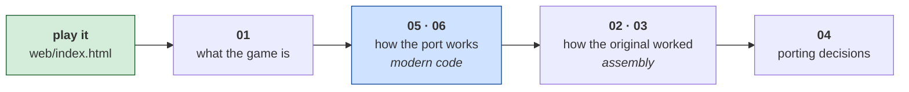

# retro-ports

**Learning to program by taking old games apart and building them again.**

This repository exists for people who want to learn programming and do not know
where to start — including people who have never written a line of code. Not by
working through exercises that compute prime numbers, but by looking closely at
real programs that real people wrote, that other real people played, and that
still work today.

Each game here gets the same treatment:

1. **What the game is** — its history, how it plays, what machine it needed.
2. **How the original program was built** — its memory layout, its graphics, its
   timing, explained from first principles.
3. **What its code actually does** — real routines, traced line by line, with
   the reasoning behind them.
4. **Where you could take it** — which modern language to port it to, and the
   honest trade-offs of each.
5. **How the port is built** — the architecture of the new version.
6. **The port's code** — walked through, including the bugs it produced.

The documents are written to be read **in order, by a beginner**. Every concept
is explained the first time it appears. You do not need to know what a register
is, or what a game loop is, or why a canvas has two different sizes — those are
all explained where they come up.

## Why old games

A game from 1982 fits in 16 kilobytes. One person can read all of it in an
afternoon and understand every part. That is not true of anything written today.

And the constraints were brutal in a way that teaches you things:

- **No memory.** So you learn why data structures matter.
- **No speed.** So you learn what things actually cost — and that the answer
  changes with the hardware, which is the real lesson.
- **No libraries.** So you see what a library would have done for you, by
  watching someone do it by hand.
- **No abstractions.** So there is nothing between you and the machine, and
  nowhere for confusion to hide.

The techniques are not obsolete. Fixed-timestep game loops, state machines,
collision detection, particle systems, seeded random numbers, separating
simulation from rendering — all of it is in current use. These games are simply
the smallest honest examples of them.

## What is here

| Game | Year | Original | The port | Documents |
|---|---|---|---|---|
| [**ParaTrooper**](paratrooper/) | 1982 | 8088 assembly, CGA, PC speaker | HTML / CSS / JavaScript | [6 documents](paratrooper/docs/) |
| [**Hard Hat Mack**](hard-hat-mack/) | 1983 | translated from Apple II 6502 | not yet | [4 documents](hard-hat-mack/docs/) |
| [**Zaxxon**](zaxxon/) | 1984 | 8088 assembly, CGA, isometric | not yet | [4 documents](zaxxon/docs/) |
| [**Karateka**](karateka/) | 1984 | 8088 assembly, and ninety data files | not yet | not started |
| [**The Oregon Trail**](oregon-trail/) | 1990 | **Turbo Pascal**, LZEXE-packed | not yet | not started |

Hard Hat Mack is decompiled and documented but not yet ported — the analysis
came first, and it turned up something worth the wait: the IBM version was
**mechanically translated from the Apple II original**, and the binary still
carries the evidence.

Karateka and The Oregon Trail are set up and triaged but not started. Each
carries a folder of work from a session that predates the toolkit, kept as
hypotheses rather than as results — the reasoning is in each one's
`prior-attempt/README.md`. They were added because they break the pattern the
first three share: Karateka keeps its artwork in ninety separate data files
rather than inside the executable, and The Oregon Trail is **Turbo Pascal**,
which nothing here has handled before.

Zaxxon is the same: decompiled, documented, not ported. It is the best example
here of the difference between a rebuild that is exact and a program that is
understood — the first attempt recovered **nine instructions out of 20,736
bytes** and still reported byte-identical, because the real entry point was
hiding behind a crack group's banner. It also holds the neatest piece of
compression in the repository: seven fortress backgrounds that would be 48 KB
as bitmaps, stored in **982 bytes**.

More will be added. Each is self-contained — nothing depends on anything else,
so you can start with whichever interests you.

## How a game folder is organised

```
<game>/
├── README.md      what it is, how to play the port, how to rebuild it
├── docs/
│   ├── 01-the-game.md          history, gameplay, tips
│   ├── 02-architecture.md      how the ORIGINAL program was built
│   ├── 03-the-code.md          the original's routines, annotated
│   ├── 04-porting.md           choosing a language, with trade-offs
│   ├── 05-web-architecture.md  how the PORT is built
│   └── 06-web-code.md          the port's code, walked through
├── web/           the playable port — open index.html, nothing to install
├── original/      the game as it shipped        (not in this repository)
└── recovered/     the reconstructed source      (not in this repository)
```

A suggested path through it:



**Read 05 and 06 before 02 and 03 if you are new.** The port is written in
JavaScript and explains modern ideas you can use immediately. The original is
assembly, and it is more rewarding once you already know what a game loop is
supposed to do.

If you already program, go straight to 02 and 03 — that is where the
archaeology is.

## Two things you will not find here

**The games themselves.** Every game in this repository is still under
copyright. The `original/` folder is excluded, and so is `recovered/` — because
a reconstruction that assembles to a byte-identical copy is the same thing as
the binary, just in source form. That is easy to overlook, so it is worth
stating plainly.

You need your own copy of a game to run the `original/` and `recovered/` parts.
**The port in `web/` needs nothing** — it is entirely our own code and artwork,
and runs on its own.

**Pixel-perfect recreations.** Where a game's original sprite data has not been
decoded, the port's artwork is newly drawn rather than copied. Each game's
README says exactly which parts are faithful and which are new. The rules, the
timing and the feel are reproduced as closely as the evidence allows; the
pictures may not be.

## Where the analysis comes from

The reverse engineering is done with
[**dos-decompiler**](https://github.com/agunawijaya/dos-decompiler), a separate
toolkit for taking DOS binaries apart. It is what produces the `recovered/`
source and most of the facts in documents 02 and 03.

The two repositories are deliberately separate: `dos-decompiler` is a set of
tools, this is a set of finished work. You do not need the toolkit to read
anything here.

## Licence

GPL-3.0. See [LICENSE](LICENSE).

That covers our own work — the documentation, the ports, the artwork. It does
not and cannot cover the original games, which belong to their publishers and
are not distributed here.
