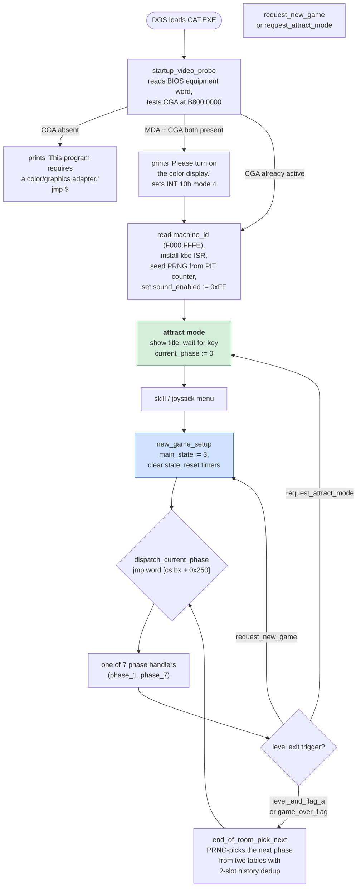

# Alley Cat — the game

*Document one of six. See [02-architecture.md](02-architecture.md) for how the
program is built, [03-the-code.md](03-the-code.md) for what the routines
actually do, and [04-porting.md](04-porting.md) for where to take it next. The
port itself is described in [05-web-architecture.md](05-web-architecture.md)
and [06-web-code.md](06-web-code.md).*

This document has two kinds of fact in it, and they are kept apart on purpose:

- **From the binary.** Text, tables, and structure read directly out of
  `CAT.EXE`. Every string is quoted with its file offset so it can be checked
  by anyone who has a copy.
- **From published sources.** History, context, gameplay tips. Linked at the
  [bottom](#sources).

Where the two disagree, the binary wins.

---

## What it is

**Alley Cat** — the name appears at file offset `0x6E12` inside the boot menu
("(A)lley Cat" — the hardest of three skill levels). But the title screen
itself is the definitive statement: it draws the text

> **IBM PRESENTS**
> *Alley Cat™*
> **By Bill Williams**
> © Copyright SynSoft™ 1984

as CGA sprite text (not as ASCII strings — the letters are drawn as
`sprite_data_bank_a` pixels, which is why they do not appear in the file's
extractable strings). To read them from the file alone would require decoding
the sprite bank; to see them, run the reconstructed executable and screenshot
it. The [screenshot in the CLAUDE.md](../CLAUDE.md) is exactly that: the boot
sequence run under Unicorn emulation, with `comrun.py --call
init_attract_screen`, and the framebuffer dumped to PNG. It is bit-for-bit
what the reconstructed source produces because the reconstructed source
assembles to a bit-for-bit copy of the original.

That title screen settles three things this document originally marked
`[inferred]`:

- **Bill Williams** — the author. His name is on the screen, not just on
  Wikipedia.
- **SynSoft** — the publisher label. (The Atari 8-bit original was Synapse
  Software; the IBM PC port ran under the SynSoft brand, which is what
  the copyright line displays.)
- **1984** — the year.

Plus one fact that wasn't inferred at all because there was no way to
suspect it: **IBM PRESENTS**. IBM co-published the PC release, which is
consistent with the extensive PCjr support in the code (nine
`cmp byte [machine_id], 0xFD` checks, a separate keyboard ISR at
`CS:0x14FB`, a per-machine palette-set path).

The IBM PC release ships as one file: `CAT.EXE`, **55,067 bytes**, MZ format,
a 512-byte header and a 54,555-byte load image. That is the whole game — code,
text, sprites, sound tables, music, every screen. A modern JPEG of a cat is
roughly ten times larger.

It requires **CGA** — the program probes for it at boot (see
[02-architecture.md](02-architecture.md)) and refuses without it. There is
extensive **IBM PCjr** support: nine separate `cmp byte [machine_id], 0xFD`
checks in the code, from three-way palette register writes at boot down to a
different keyboard interrupt handler (the PC uses a scancode-only ISR at
`CS:0x14B3`, the PCjr uses a different one at `CS:0x14FB` that filters PCjr
keyboard command codes 0xFF and 0x55).

Two versions of the interrupt handler for two keyboards — that is what
supporting the PCjr in 1984 looked like.

## The three skill levels

The whole boot menu is quoted below. It sits together in the binary at file
offset `0x6DA0..0x7000`, as a single 700-byte block of text:

```
Do you want to use a joystick (Y/N)?
Please select your skill level:
   (H)ouse Cat
   (T)omcat
   (A)lley Cat

During play:
   Ctrl-S  turns the sound on and off.
   Ctrl-R  restarts the game.
   Ctrl-M  returns you to this menu.
   Esc     puts the game into paws mode.
   Use the cursor keys to control the cat.
   The Alt key performs special actions.

Press any key to start.
```

Three difficulties named for how domestic the cat is: **House Cat** is the
easiest, **Alley Cat** the hardest, and **Tomcat** in the middle. The joke
extends to the pause menu ("**paws** mode") whose banner is `Paws Game:` at
file offset `0x709C`.

The joystick path is separate. If the player says Y at the first prompt but
the BIOS reports no game port, the program shows:

```
Either joystick is not attached or
Game Control Adapter is not present.
Please correct or select keyboard.
Press any key to continue...
```

and returns to the menu. Otherwise the control help changes to:

```
Use the joystick to control the cat.
The button performs special actions.

Please center your joystick and
press the joystick button to start.
```

## The shape of a session

**What this diagram shows:** the top-level state machine `CAT.EXE` implements.
Every arrow is a real branch in the code (see the
[main-loop reading](../CLAUDE.md#the-architecture-in-one-table) for the
routine that makes each transition).



**What to notice.** `dispatch_current_phase` is one instruction:

```
    jmp word [cs:bx + 0x250]
```

An 8-slot table at CS offset `0x250` (image offset `0x7480`) holds the seven
distinct phase handlers, indexed by the current phase (0..7 clamped). Slots 0
and 1 both point at the same address — the game boots into phase 0, which
immediately asserts `mov word [current_phase], 1` and becomes phase 1.

The **next-phase pick** is more interesting. When a level ends,
`end_of_room_pick_next` runs the PRNG and picks:

- **75% of the time** (bits 5 or 7 set in the PRNG byte), a weighted lookup:
  `bx = (phase_history & 3) * 4 + (PRNG & 3)`, then read
  `phase_select_table_weighted[bx]`. Four different transition weights
  depending on which of four history buckets the last few phases fell into.
- **25% of the time**, a uniform lookup: `PRNG & 7` retried until it lands
  under 5, then `phase_select_table_uniform[dx]`. Uniform over 5 phases.

Either result is rejected if it matches `phase_history_last`. If it also
matches `phase_history_prev`, the whole selection retries. So the cat never
enters the same room twice in a row, and rarely (never?) in an
A-B-A-B pattern.

That is the "cat picks its next room" logic, and it explains why an Alley Cat
session feels random-but-fair even though the underlying PRNG is a single
16-bit linear-feedback shift register.

## The seven rooms, mapped

The phase-to-room mapping came from a runtime hook: `comrun.py
--call phase_N_handler --stop-at inner_loop_top --stop-after 1`
runs each phase's init sequence (including the scene-drawing
`init_phase_screen_pattern` branch and the sprite-list blits) and
stops at the first iteration of the inner loop, *before* the
exit-OR check has a chance to fire on uninitialised state. Dumping
the CGA framebuffer at that moment shows each room fully drawn.
The captures are in `reference/screens/` (gitignored).

| phase | room | what the render shows |
|---|---|---|
| 0, 1 | **the courtyard/room** | chairs, coffee table, floor lamp, brick fireplace — Freddy's starting room, entered via the alley window. Both phases dispatch to `L_07612`, but phase 0 asserts itself as 1 at entry. |
| 2 | **aquarium/fishbowl** | empty cyan pond with pink rim (fish appear on later inner-loop iterations from `cycle_phase_1_bg_pattern`). Reached from phase 1 by `phase_1_to_2_trigger` at DS:0x554 — an *in-scene* transition confirming the code-level finding. |
| 3 | **library / bookshelf** | large bookshelf full of colored books, plus chairs, floor lamps, and the fireplace. The dog room. |
| 4 | **swiss cheese wall** | large cyan diagonal cheese wall with pink circular mouse holes. Mice emerge from the holes for the cat to catch. |
| 5 | **birdcage room** | a birdcage on a small table, chairs, floor lamp, and a framed portrait on the wall (Felicia). |
| 6 | **kittens / family** | floor covered with white kittens around food bowls, plus a framed Felicia portrait. The scene after Freddy meets Felicia. |
| 7 | **cupids & hearts finale** | border of pink cupids running with arrows, interior filled with rows of pink and dark hearts, a small pink gift box at the bottom. Not a normal gameplay phase (its exit-OR skips `[0x552]`) — this is the romantic scoreboard / "you saved Felicia" screen. |

Every room draw comes from `init_phase_screen_pattern`'s per-phase
branch (phase-2 branch at `L_099C0` itself; phase 3..7 branches at
`L_09AEE`, `L_09ABD`, `L_09A6E`, `L_09A29`, `L_09A1E` respectively;
phase 1 falls through to the default L_09B39 branch). Each branch
issues 5–10 `blit_sprite_list` calls, drawing composite sprites for
each room's furniture and decoration.

The one thing still not resolved from runtime alone: **whether phase
1's "courtyard room" is the actual alley-with-fence** that the game
starts in, or a first room reached by jumping through a window. The
code reading has `attract_loop_start` setting `current_phase := 0`
before dispatch, and phase 0 lands in the same handler as phase 1
which draws this room. If the game's very first frame is this room,
this IS the alley scene, drawn as an interior. That is not settled
from the render alone; it needs actual gameplay observation.

The **author's name and publisher** are settled by the title-screen render
(see the "what it is" section above): **Bill Williams**, **SynSoft**,
**1984**, published in association with **IBM**. All four are pixels on
the title screen, which is drawn by `init_attract_screen` (image `0xCEE0`)
from the sprite bytes in `sprite_data_bank_a`. Any run of the reconstructed
executable produces those pixels because the reconstruction is
byte-identical to the shipped file.

That leaves the **Atari 8-bit original attribution** as the one thing
still not verified against `CAT.EXE`: the PC port credits Bill Williams
on its title screen, but whether *this* version is a port of his 1983
Atari game (rather than a fresh IBM implementation) has to come from
outside sources. Wikipedia and MobyGames say it is; nothing on the
CGA title screen contradicts them.

## Sources

- Anything quoted with a `0x` file offset is directly from `CAT.EXE`,
  reproducible with any hex viewer.
- The title-screen text ("IBM PRESENTS", "By Bill Williams",
  "© Copyright SynSoft™ 1984") is pixels drawn by `init_attract_screen`
  (image `0xCEE0`). To reproduce it: assemble `recovered/alley-cat-named.asm`
  with NASM to get a byte-identical rebuild, then run under Unicorn
  emulation: `python DOS-Decompiler/tools/comrun.py recovered/rebuilt.exe
  --call 0xCEE0 --png out.png`. The image in [`../CLAUDE.md`](../CLAUDE.md)
  is that command's output.
- The phase-machine narrative is from reading the code — see the routines
  named in [`../symbols.json`](../symbols.json) with the evidence for each
  and the walker fix described in [`../CLAUDE.md`](../CLAUDE.md).
- The Atari-8-bit-original attribution is from Wikipedia and MobyGames.
  Bill Williams and 1984 are confirmed by the title-screen render; whether
  this IBM version derives from his 1983 Atari game (rather than being a
  fresh implementation) is the only claim here that still depends on the
  external sources.
