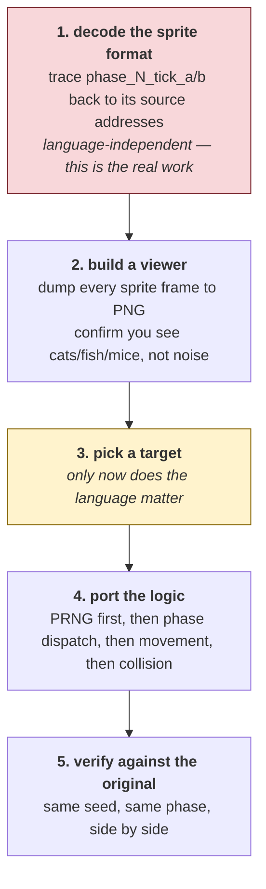
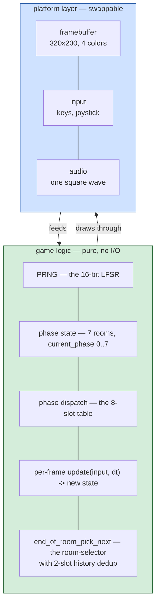

# Alley Cat — porting it

*Document four of six. See [01-the-game.md](01-the-game.md),
[02-architecture.md](02-architecture.md) and [03-the-code.md](03-the-code.md)
for the 1984 program; [05-web-architecture.md](05-web-architecture.md) and
[06-web-code.md](06-web-code.md) describe the port this page argues for.*

A port is a rewrite informed by the disassembly, not a translation of it. This
page is about choosing the target — but the language is not the first decision,
and pretending otherwise wastes the most time.

## Read this before choosing a language

### What makes Alley Cat portable

Three properties, all confirmed in [02-architecture.md](02-architecture.md),
remove most of what makes 1980s games painful to port:

- **One interrupt handler, and it does not share state with the main loop
  ambiguously.** The keyboard ISR (`keyboard_isr` at image `0x86E3`, or its
  PCjr twin at `0x872B`) writes to a 22-slot key-state table at DS:0x6B7 and
  increments a tick counter at DS:0x693; the main loop reads those. There is
  no critical section, no double-buffered handoff, no other interrupt hooked.
  The timer runs through BIOS INT 1Ah polls instead of a hooked INT 08h/1Ch.
- **Timing is BIOS-tick-driven.** Every per-frame update is rate-limited by
  `cmp dx, [some_tick_shadow]` against the value from `int 1Ah`. That is 18.2
  Hz on every DOS machine ever made — the game's pacing is *already* decoupled
  from CPU speed, and a fixed-timestep loop in any modern language reproduces
  it directly.
- **Small and flat.** 258 direct-call targets, 3 tail-call entries, 280 named
  routines, 55 KB total. One person can hold all of it — the current CLAUDE.md
  index makes that visible.

### What blocks porting until it is fixed

**The sprite format is only partially decoded.** The three sprite banks
(`sprite_data_bank_a/b/c`, totalling ~12.5 KB) are identified as CGA mode-4
2-bpp packed pixels, and the runtime hook has proven each phase's
`init_phase_screen_pattern` branch draws its room from bytes inside those
banks (see [docs/01 rooms table](01-the-game.md#the-seven-rooms-mapped)).
But the per-frame structure of individual sprites — the cat's walking cycle,
the fish that swim in the pond, the mice that emerge from the cheese wall —
has not been traced from the drawing routines back to the bytes.

That work is identical in every language on this page. Do it first, in
whatever you already read fastest.

If the sprites render as recognisable shapes, the format is right; if they
render as noise, no amount of porting effort will help, and you find out in
an afternoon rather than a month.

### Separate the two halves on day one

The port's shape is the same in every language, and it is worth enforcing
from the first commit:

The platform layer for this game is small — a 320×200 indexed framebuffer, a
handful of key states (22 to be exact), and **one** PC-speaker voice
(sometimes swept, sometimes patterned, always single-tone). That is why the
choice of language matters less than usual, and why moving between the
options below later is cheap if you keep the split.

### What NOT to port

Some parts of the 1984 code exist for reasons that no longer apply. Do not
port them:

- **The two INT 09h handlers.** Modern platforms give you a queued input
  event stream directly. The whole `key_scancode_table` / `key_state_table`
  pair collapses to a `Set<KeyCode>`.
- **The CGA two-bank scan-line interleave.** No modern framebuffer is laid
  out like this. Draw pixels linearly into a 320×200 backbuffer.
- **The PCjr detection paths.** No PCjr exists to detect. Drop
  `keyboard_isr_pcjr`, `set_pcjr_palette_register`, the three-way palette
  writes, the `shr cx, 1` speed compensation, and every
  `cmp byte [machine_id], 0xFD` branch. That is roughly 200 bytes of code
  and a lot of dead conditionals.
- **The startup CGA probe.** `startup_video_probe` writes 0x55AA to the
  CGA framebuffer to detect the adapter. Any port targeting anything
  after 1990 can assume the display works.
- **The blocking spin-wait beep** (`beep_blocking`). Blocking a modern
  event loop is unacceptable; use the async audio API's scheduled note
  duration.

That is not gutting the game — it is peeling off the hardware-abstraction
layer that a modern platform provides for free.

---

## The options

### 1. HTML / CSS / JavaScript, on a `<canvas>`

**The best choice if the point is to learn from it and show it to people.**

The web platform fits this game well. `ImageData` is a flat byte array you
write pixels into, which is what the original does to `B800:0000`; the only
difference is that you expand 2 bits to RGBA instead of letting the CGA
hardware do it. Web Audio's `OscillatorNode` with `type: 'square'` is, near
enough, what timer channel 2 produces.

Alley Cat has more visual complexity than ParaTrooper — seven rooms with
different backdrops, animated sprites, and screen transitions. That maps to
canvas naturally: one 320×200 backbuffer, one draw loop, one rAF tick. The
phase machine becomes an object with 8 methods; the sprite banks become an
array of pre-decoded frame data.

Distribution is trivial: three files, open `index.html`, no build. The
`selfTest()` on `window` that the project convention asks for is easy to
add.

**Cost:** you need to decode the sprite format first (see above), and you
need to write JavaScript, which many people would rather not.

### 2. Python + Pygame

Better than JS if you want to hack on it locally and do not care about
sharing it.

Pygame gives you a 320×200 surface, a pixel buffer, keyboard events, and a
mixer for square waves. Python's tuple destructuring makes the state
machine readable in ways JS syntax does not.

**Cost:** distribution is significantly worse — you cannot ask a friend
to "open this HTML." Getting Pygame installed on someone else's machine is
one of the harder programming tasks a beginner faces.

### 3. Rust + a small framebuffer crate (minifb, pixels, macroquad)

The best choice if the point is to learn Rust while porting the game.

Rust models the state machine with sum types (`enum Phase { Courtyard,
Aquarium(AquariumState), ... }`) in a way that reads much cleaner than the
1984 `mov word [current_phase], N` chains. The borrow checker gently
enforces the pure-logic-vs-platform split this document argues for.

**Cost:** compile times, a much larger binary than the original 55 KB, and
Rust's learning curve. If you are learning to program, this is not your
first port.

### 4. C, targeting a modern platform via SDL2

The choice most faithful to the original. If you want the port to read
almost line-by-line like the disassembly, C with SDL2 gets you there.

**Cost:** you rewrite in a language whose safety guarantees are the same as
the original's — none. Any bug the 1984 code had, your port can have too,
and your build system is larger than the game.

---

## The recommendation

**HTML / CSS / JavaScript, targeting `<canvas>`.**

Three concrete reasons:

1. **It matches the charter of this repository.** From the root CLAUDE.md:
   *"Learning to program by taking old games apart and building them again."*
   A port that opens in a browser is a port beginners can actually run.

2. **It matches the existing template.** ParaTrooper's port at
   `../paratrooper/web/` is three files, no image assets, everything drawn
   from the reading. Alley Cat's port should follow it — same shape, more
   sprites.

3. **The platform is a natural fit for what the game already is.** A CGA
   game is a program that writes 2-bit pixels to a small framebuffer and
   asks the timer whether it's time yet. A canvas is a small framebuffer
   you can write RGBA pixels to whenever `requestAnimationFrame` fires. The
   distance between the two is smaller than any of the alternatives.

The port is described in [docs/05-web-architecture.md](05-web-architecture.md)
(pending) and the code walkthrough is in
[docs/06-web-code.md](06-web-code.md) (pending).

## The order to build it

Recommended, in the order the CLAUDE.md's failure warnings suggest:

1. **Decode sprite format.** Trace `phase_1_object_tick` (0x0A380) back to
   the cat's walking-cycle data. Dump frames to PNG. If you see a cat, the
   format is right.
2. **Port the PRNG first.** It is 6 instructions and it drives every
   randomised behaviour. Write it, seed it deterministically, and verify a
   long sequence matches the emulator's output before doing anything else.
3. **Port the phase dispatch.** 8-slot table, `current_phase` variable, and
   `end_of_room_pick_next` with 2-slot dedup. This is the game's spine.
4. **Port the sprite pipeline.** Loading, blitting, save-and-restore. Do it
   once; every room uses it.
5. **Port each phase in order.** Start with phase 1 (the courtyard), because
   it is the initial state and everything else reaches it eventually. Then
   phase 2 (aquarium), which is triggered by `phase_1_to_2_trigger` — the
   in-scene transition proves the phase machinery works.
6. **Port sound last.** A port with silent sound is still a port; a port
   with buggy sound is unshippable, and audio bugs are hard to debug
   without the reference running side by side.

**Build the referee before the port** (see
[karateka/PORT-BRIEF.md](../karateka/PORT-BRIEF.md) for the argument this
project has learned the hard way): a small harness that runs the reference
`.EXE` under `comrun.py` and the port side-by-side with the same PRNG seed,
diffing the visible state each frame. Without this, a subtle divergence in
mouse spawn timing or fish direction is impossible to notice until the game
plays wrong.
