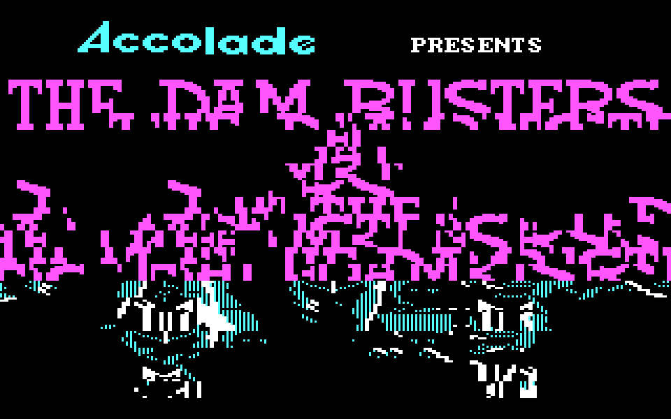
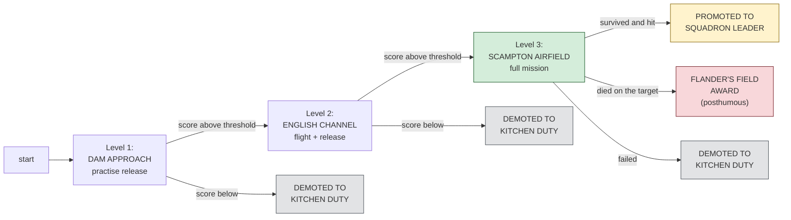
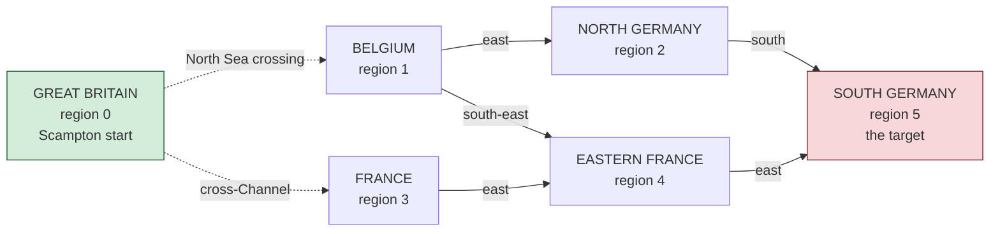
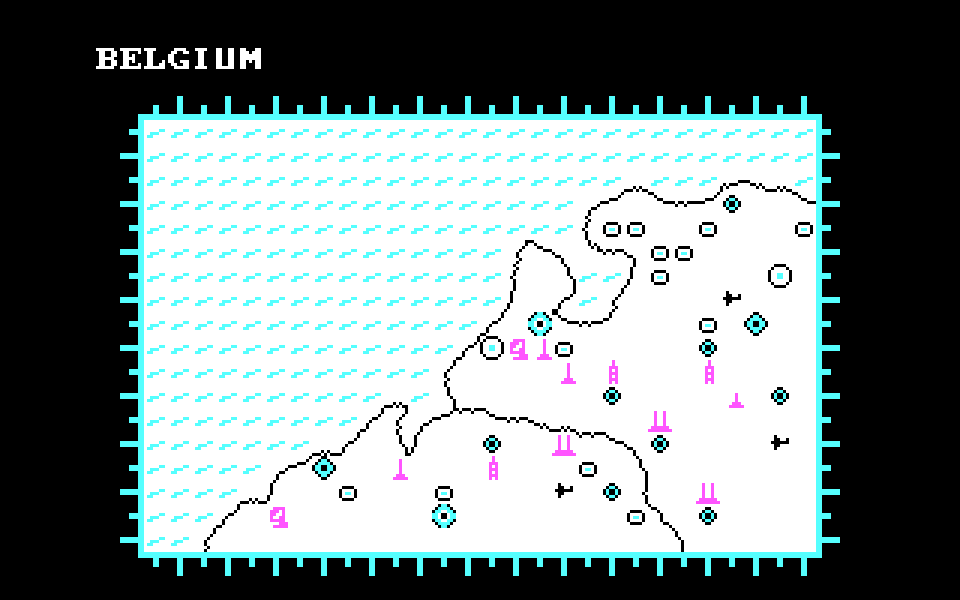
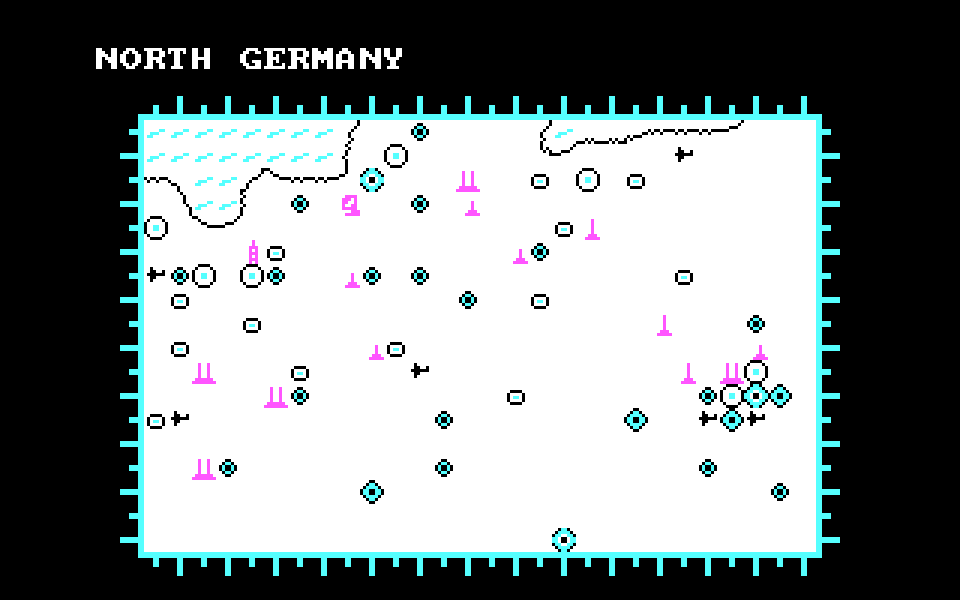
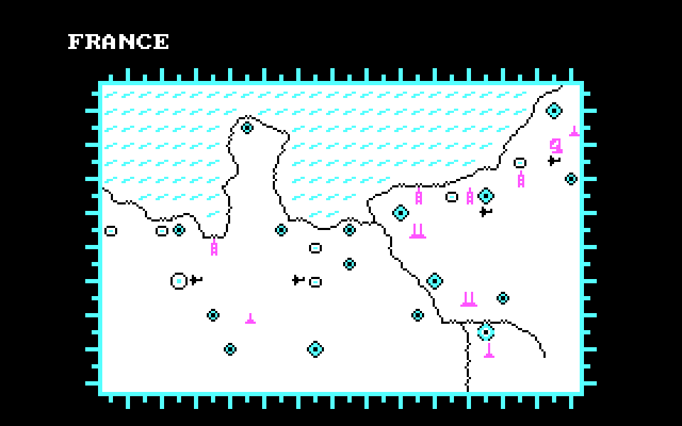
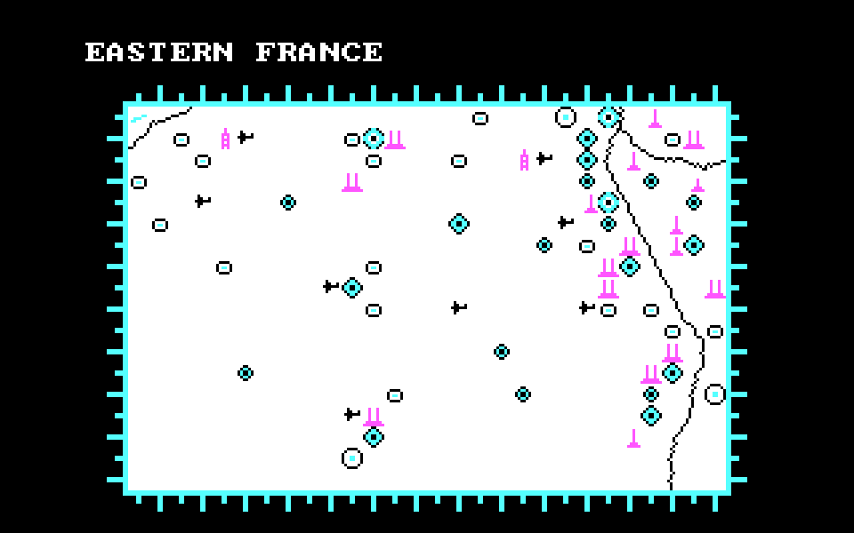
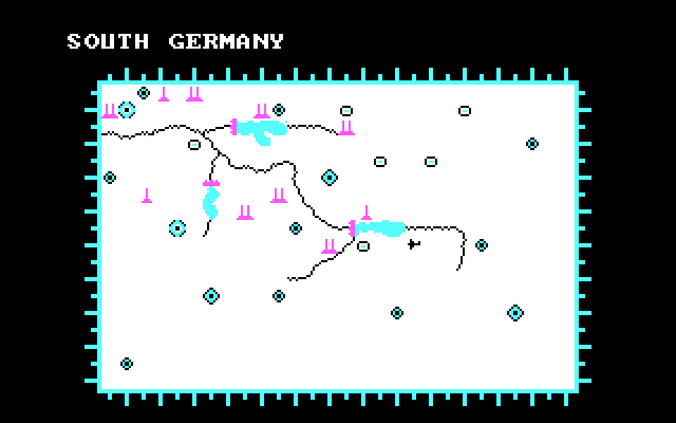
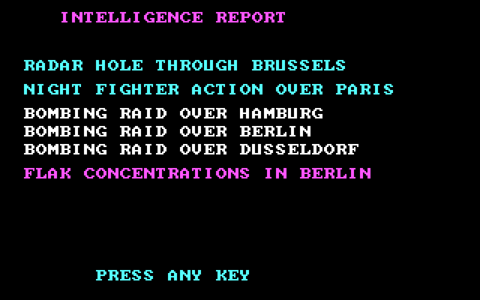

# The Dam Busters — the game

*Document one of six planned. See [../CLAUDE.md](../CLAUDE.md) for the current
state of the reading and where the other five will go.*

This document has two kinds of fact in it, and they are kept apart on purpose:

- **From the binary.** Text and structure read directly out of `DAMB.EXE`.
  These are checkable — you can look at the same bytes.
- **From published sources.** The real 1943 raid, the 1955 film, the game's
  publishing history. Linked at the [bottom](#sources).

Where the two disagree, the binary wins. (In this game they mostly do not
disagree — the game is faithful to the raid's outline. Where it *simplifies*
the raid, that is called out in place.)

---

## What it is

**The Dam Busters**, published 1984 by Sydney Development Corporation. The
copyright is in the file at offset `0x7167`:

```
COPYRIGHT SYDNEY DEVELOPMENT CORP 1984/1985
```

You fly a **modified Avro Lancaster** from RAF Scampton in Lincolnshire, across
Great Britain, the North Sea, Belgium and Germany, to breach one of the Ruhr
dams with a bouncing bomb. You do it as bomb-aimer, pilot, flight engineer
and rear gunner — the game switches you between four crew stations because on
the real raid four different people did those jobs, and any one of them being
overwhelmed sank the mission.

The title screen says **DAM BUSTERS · SQUADRON 617** (offsets `0x00E8` and
`0x00DB`), under a *"Accolade PRESENTS"* header the game blits in from a
pre-rendered bitmap in the display list at `0xB4BF`. The whole opener,
regenerated from the reading:



No one played this game without knowing what those two lines mean; the
next section is for anyone reading now who doesn't.

## What it is *about* — Operation Chastise, 16-17 May 1943

The game is a dramatisation of a real Royal Air Force mission. Nineteen Avro
Lancaster heavy bombers of a specially-formed squadron — **No. 617 Squadron
RAF** — attacked the dams of Germany's Ruhr Valley on the night of 16-17 May
1943. The intent was to flood the industrial heart of the Ruhr and disrupt
the war economy. The weapon was a **backspinning cylindrical bomb**, designed
by Barnes Wallis, that skipped across the reservoir's surface to reach the
dam wall before the torpedo nets. When it hit the wall it sank, and its
hydrostatic fuses detonated it at depth.

The raid needed the bomber to fly at **60 feet above the water**, at exactly
**232 mph**, releasing the bomb at exactly the right distance — measured on
some aircraft with a **wooden triangle** whose two pegs lined up with the two
towers on the dam. Fly too high and the bomb broke up on impact. Fly too low
and you flew into the water. Fly too fast or too slow and the bomb went the
wrong distance.

The Möhne and Eder dams were breached. The Sorpe dam was damaged but held.
Of the nineteen Lancasters that took off, **eight did not come back** —
eight aircraft, fifty-three airmen. It is one of the most famous night
operations in RAF history, and the reason for the 1955 film that made "The
Dam Busters" a phrase.

The game keeps the frame — the aircraft, the crew stations, the low-and-fast
approach, the wooden-triangle sighting — and asks you to fly one Lancaster
through it. You are Wing Commander Guy Gibson's aircraft, or one of the
eighteen others: the game does not say which.

## Missions and difficulty — one raid, many configurations

**There is one target: the dam.** No campaign, no branching. Every run ends
in the same reservoir with the same wooden triangle framing the same two
towers.

What the game varies, per run, is *how* you get there. Three axes of
choice, drawn from what the reading finds in memory:

### Axis 1 — Starting position (three "levels" the game unlocks in order)

From the file at offset `0x7111`:

```
SELECT A STARTING POSITION
  1 - DAM APPROACH
  2 - ENGLISH CHANNEL
  3 - SCAMPTON AIRFIELD
```

- **1: Dam Approach.** Skip the flight. You begin already at the target,
  bomb-run in front of you. This is where you learn to release the bomb.
- **2: English Channel.** You begin over the Channel, having crossed Britain.
  You have a shorter cross-Europe flight and then the bomb-run.
- **3: Scampton Airfield.** The full mission. Take off from Scampton, cross
  the North Sea, navigate across occupied Europe (with the risk of German
  night fighters and flak), find the dam and bomb it, then get home.

You start locked to level 1. **Do well enough on level 1 to unlock level 2**;
do well on level 2 to unlock level 3. The scoreboard message reads *"WELL
DONE YOU'VE QUALIFIED FOR THE ENGLISH CHANNEL LEVEL"* or *"...SCAMPTON
AIRFIELD LEVEL"* (offsets `0x81A8`..`0x81E1`). This is the same order the
real 617 Squadron trained — six weeks on English reservoirs before the
raid itself.

### Axis 2 — Target-approach configuration (nine variants inside each level)

At **phase 6** (the target/altitude selector), you pick two three-position
switches. `selector_a` chooses one of three target distances, `selector_b`
chooses one of three target altitudes. The reading finds the tables:

- `distance_by_option_a` at `0x23AD`: **140 / 120 / 100** game units of
  approach distance
- `altitude_by_option_a` at `0x23B3`: **0 / 20 / 40** game units of
  target altitude

That is **3 × 3 = 9 approach configurations** per starting level. Shorter
distance × lower altitude is the hardest — less room to correct the drop.

### Axis 3 — Bomb options (three switches at phase 3)

`bomb_options_init` at `0x4B63` draws the switch labels stored at file
offset `0x4B4C`:

```
BOMB
ROTATION
SPOTS
```

These are **not generic options — they are the three real Chastise
switches**:

- **BOMB** — arm the bomb. Nothing releases until this is on.
- **ROTATION** — spin up the backspin motor. The bouncing bomb needed
  around **500 rpm counter-rotation** to skip across the water and cling
  to the dam wall on impact instead of ricocheting away. On the real raid
  this was engaged in the approach, and the game wants you to do the same.
- **SPOTS** — turn on the pair of downward-pointing **spotlights** that
  converged on the water at exactly **60 feet altitude**. When the two
  circles of light merged into one on the reservoir, the pilot knew he
  was at the release height. This was **the actual altimeter 617 Squadron
  used** on the run in — barometric altimeters were not accurate enough at
  60 ft.  The game reproduces the switch.

Together: **3 levels × 9 approach configurations × up to 8 bomb-option
combinations = 216 distinct mission setups** the player can dial in.
On top of that, the intelligence-report objectives are **rolled at
random** from the ten target cities every time you enter the map screen
— so what the mission tells you to avoid changes each run.

### The difficulty progression



**The reading is explicit that a promotion is the top prize.** *"BEEN
PROMOTED TO SQUADRON LEADER"* (offset `0x81F9`..`0x820A`) — one rank below
Guy Gibson, who commanded 617 Squadron and led the raid. The award, if
you make the dam and don't come home, is *"FLANDER'S FIELD"* — the
posthumous poppy field. Anything less: *"DEMOTED TO KITCHEN DUTY"*.

### Hidden difficulty — the auto-stabilise flag

Not exposed on any menu: the byte `auto_stabilise` at `[0x3072]`.
`integrate_heading` (`0xE46`) does one thing when this is zero, and
another when it is non-zero:

- **auto_stabilise == 0** — the accumulated heading rate saturates to
  `[-6, +6]`. The Lancaster resists sharp turns; sensible for cruise.
- **auto_stabilise != 0** — no saturation. Every input accumulates. You
  can pull harder manoeuvres but the aircraft will happily depart
  controlled flight while you're doing it.

The reading has not settled how this is set — but a byte that flips the
plane between "easier to fly" and "does what you tell it" is a difficulty
switch by any other name.

## The nine phases of a mission

The frame loop dispatches to one of nine handlers each frame, indexed by
`game_phase` in memory. The reading has identified all nine. What each does
is set out below — the game itself never calls them "phases", but reading
the code that is exactly what they are.

| # | phase | what you're doing |
|---|---|---|
| 0 | forward view | flying the Lancaster from the pilot's seat |
| 1 | bomb-run | in the bomb-aimer's position, locking the target |
| 2 | rear view | at the rear-gun turret, defending against fighters |
| 3 | bomb options | pre-drop choices — arm, altitude, and one other pair |
| 4 | region map | choosing which region of Europe to fly to next |
| 5 | cockpit controls | throttle, boost and RPM for all four engines, plus fire extinguishers |
| 6 | target/altitude selector | choosing target and cruise altitude |
| 7 | scoreboard | end-of-run report of what you did |
| 8 | idle | between screens; nothing runs |

You do not choose phases directly. Pressing certain keys sets
`requested_phase` in memory, and the frame loop then transitions on the next
tick. Phase 0/1/2 (the three crew views) rotate among themselves; phase 4/5/6
are the pre-flight setup screens; phase 7 comes at the end whether you won
or lost.

## What sits in the cockpit — Phase 5 (menu_main)

The cockpit menu's text runs from offset `0x15D9` (BOOSTER GAUGES) through
`0x2335` (LANDING GEAR), read row by row by the display-list bytecode at
`0x13A6`. The labels are:

```
BOOSTER GAUGES
RPM GAUGES
THROTTLES
FIRE EXT.
BOOSTERS
FUEL GAUGES
LANDING GEAR
```

Every one of these is a real Lancaster control:

- **THROTTLES** — how much fuel-air mixture each engine gets. All four
  independent, all with `+`/`-` per engine, and a "move all four together"
  option. Range 0..24 in the game.
- **BOOSTERS** — the Merlin XX engines had a two-speed, two-stage
  supercharger. In the game one slider row per engine, range 0..40.
- **BOOSTER GAUGES** / **RPM GAUGES** — read-outs of what your engines are
  doing.
- **FUEL GAUGES** — how much fuel is left. Above every other reason a
  Lancaster came down in Chastise, running out of fuel was the danger of the
  return leg.
- **LANDING GEAR** — up for cruise, down for landing. The game will kill
  you (see the crash reasons below) if the wheels are up when you touch the
  ground.
- **FIRE EXT.** — each engine has one fire extinguisher. It is **one-shot per
  engine**; the reading confirms this (`or byte [bx + engine_states], 1` is
  set the first time and blocks subsequent presses). Save each for when the
  engine is actually on fire; hitting it before then wastes it.

The Merlin engine had a reputation among Lancaster crews for catching fire,
and the fire extinguisher was a real one-shot resource — every crew was
briefed on this, and Chastise reports mention aircraft nursing damaged
Merlins home.

## How the aircraft dies — the seven crash reasons

At file offset `0x7F2C` the game keeps a list of the ways you can lose. Each
is a message the scoreboard displays.

```
CAUSE OF CRASH:
  UNABLE TO COME OUT OF STALL
  LANDING GEAR RETRACTED ON GROUND
  LOW ALTITUDE CRASH
  TAKE OFF FAILURE
  SHOT DOWN IN ACTION
  AIRCRAFT BROKE UP IN DIVE
  OUT OF FUEL
```

Mapping these to the reading:

- **UNABLE TO COME OUT OF STALL** — you pulled up too hard while low and
  slow.
- **LANDING GEAR RETRACTED ON GROUND** — you tried to land with the wheels
  up, or set them down and forgot to put them out. This is a **belly landing**
  in real Lancaster terms, and it destroys the aircraft.
- **LOW ALTITUDE CRASH** — you flew into the ground or the water. The
  physics reading has `altitude < -0x2C` triggering an end_run: fly below
  ground level and you're finished.
- **TAKE OFF FAILURE** — from Scampton, you must accelerate and rotate
  correctly. Get it wrong and you never leave the runway.
- **SHOT DOWN IN ACTION** — flak (below) or fighters (below) got you.
- **AIRCRAFT BROKE UP IN DIVE** — you exceeded the Lancaster's structural
  speed. In real terms, this was a **known danger** at low altitude in a
  Type 464 Lancaster; the modified aircraft had less structural margin than
  the standard Mk III.
- **OUT OF FUEL** — you ran the tanks dry. Every navigation error, every
  extra pass over the target, every extra minute of afterburner-equivalent
  boost costs fuel. The real 617 Squadron had one Lancaster that turned
  around because it couldn't reach the dam and get home.

The physics reading gives one specific number: `altitude > 0x186 = 390`
crashes you with reason 7 (over the ceiling). The Lancaster's real service
ceiling was ~24,000 ft; 390 here is scaled game units, but the shape is the
same — climb too high and something breaks.

## The scoreboard — Phase 7

At the end of the mission, the game reads ten counters and formats them
into a template. From the strings at offsets `0x81A8`, `0x8236` and `0x8279`
onward, the outcomes are:

```
WELL DONE YOU'VE
  QUALIFIED FOR THE ENGLISH CHANNEL LEVEL
  QUALIFIED FOR THE SCAMPTON AIRFIELD LEVEL
BEEN PROMOTED TO SQUADRON LEADER

DEMOTED TO KITCHEN DUTY

YOU HAVE BEEN AWARDED THE
  FLANDER'S FIELD AWARD  (see note below)
```

You are graded on the raid. Do well enough on Dam Approach and you unlock
English Channel; do well on English Channel and you unlock Scampton; do
well on Scampton — the full mission — and you are promoted to **Squadron
Leader**, one rank below Guy Gibson. Do badly and the report says
**DEMOTED TO KITCHEN DUTY**. There is nothing in between.

*"Flander's Field"* — the wording in the game — is a **posthumous** award.
In Great War memorial verse ("*In Flanders Fields the poppies blow / Between
the crosses, row on row*") it is the poem read on Remembrance Day for the
dead. If the game awards it to you, you have finished the mission and not
come home. The game keeps two other awards in the same block — see the
strings — but "Flander's Field" is the one that names itself in the file.

### The bomb-drop grades

When you release the bomb, the game grades the release. The messages at
offsets `0x827F`..`0x8330` read:

```
YOUR MISSION WAS UNSUCCESSFUL
THE BOMB DROP WAS EARLY
THE BOMB DROP WAS LATE
THE APPROACH WAS HIGH
THE APPROACH WAS LOW
THE APPROACH WAS SLOW
THE APPROACH WAS FAST
THE APPROACH WAS NOT CENTERED
NOT EVEN CLOSE
FAR TOO HIGH
```

These are the four axes of the real Chastise drop, plus centring:

- **Height** — high or low
- **Speed** — slow or fast
- **Release distance** — early (short) or late (long)
- **Alignment** — not centred between the towers

The 1943 briefing gave crews specific numbers: 60 ft, 232 mph, released at
the moment the wooden triangle lined up with the two towers. The game does
not tell you these numbers; you must find them by feel. That is a large
part of what makes it hard.

### The mission report — the ten counters that decide your score

Between the awards and the crash reasons, the report also lists what you
did to the enemy. Strings at `0x83D1`..`0x8430`, drawn on the phase-7
scoreboard:

```
MISSION REPORT
  FLAK HITS
  ME109 ATTACKS
  SEARCH LIGHTS SHOT
  FLAK INSTALLATIONS SHOT
  ME109'S SHOT
DAMAGE REPORT
  YAW DAMAGE
  ENGINE 1 DOWN
  ENGINE 2 DOWN
  ENGINE 3 DOWN
  ENGINE 4 DOWN
```

The generator reproduces the scoreboard exactly:


The reading finds `results_step` at `0x8720` reading **ten counters** in
memory, formatting each into a five-digit ASCII slot with `format_decimal`
(`0x87C7`), and painting the whole layout from a display list. The
counters, with the addresses they read from:

| # | counter | address | what it counts |
|---|---|---|---|
| 1 | `player_shot_count` (labelled "FLAK HITS" in some grades, related to `border_flash_timer`) | `[0x6AD3]` | times the plane took a hit and flashed white |
| 2 | `enemy_shot_count` | `[0x598F]` | Me 109s the player shot down |
| 3 | `results_counter_c` | `[0x6C03]` | search-lights hit — check_object_hit_b writes here |
| 4 | `check_object_hit_a` accumulator | `[0x64BC]` | flak installations silenced |
| 5 | `enemy_hit_count` | `[0x5991]` | Me 109 attack runs completed (not necessarily shot down) |
| 6 | `altitude` | `[0xCE6]` | final altitude — appears on the DAMAGE REPORT side, probably as a proxy for how well controlled the return was |
| 7 | `engine_status_1` | `[0xBDB]` | engine-1 damage grade 0..17 |
| 8 | `engine_status_2` | `[0xBDD]` | engine-2 damage grade |
| 9 | `engine_status_3` | `[0xBE3]` | engine-3 damage grade (also read by check_flight_conditions) |
| 10 | `engine_fire_severity` | `[0x5515]` | engine-fire damage accumulator |

`results_step` walks a 4-entry per-crew-position list at `engine_states`
(`0x173D`), pointing at row addresses that read *"ENGINE 1 DOWN"* through
*"ENGINE 4 DOWN"* selectively — you only see the "engine N DOWN" line for
engines that actually failed.

### How the grade is decided

At the end of `count_engines_alive` (`0x7DDA`), the game computes a raw
score:

```nasm
mov ax, word [player_shot_count]      ; enemies fired at you
add ax, word [enemy_shot_count]       ; enemies you shot down
sub ax, word [enemy_hit_count]        ; enemies that hit you
mov bx, word [end_run_score_ptr]      ; pointer into threshold table
cmp ax, word [bx + end_run_score_threshold]
```

The score is *fought-back minus taken-hits*.  It is compared to a
threshold from `end_run_score_threshold` (`0x7D91`), and the threshold
pointer advances with each level — so **Scampton Airfield needs more
enemies shot than English Channel does**, which needs more than Dam
Approach.

Above threshold → promotion / award. Below → *DEMOTED TO KITCHEN DUTY*.
There is no in-between.

The **Me 109** (Messerschmitt Bf 109) was the primary German day fighter.
Historical Chastise was a **night** raid, so the more likely intercept
would have been Bf 110 night fighters, but Me 109 is the game's chosen
shorthand for enemy. Each shot-down fighter, each destroyed searchlight,
each silenced flak battery goes on your report.

## Flying over Europe — the six regions

The map screen (phase 4) is a chart of Western Europe divided into six
regions, each with its own terrain, coastline and named target-cities.
Region names come from strings at `0x015C..0x0195`; the terrain sprite
data is at `0xED26 + region*2` (the `region_titles` table, which points
into region-specific tile-index blocks). Six named regions, and the
game's own physics treats them as **four groups** — the reading finds
`region_effect_dispatch` at `0x1045` with only four distinct handlers
across the six slots:

| region | handler | share of flight |
|---|---|---|
| Great Britain | `region_effect_conditional` | conditional-shift; harder terrain |
| Belgium | `region_effect_shift_left` | double the physics rate |
| France | `region_effect_shift_left` | double the physics rate |
| North Germany | `region_effect_default` | plain integration |
| Eastern France | `region_effect_default` | plain integration |
| South Germany | `region_effect_shift_right` | half the physics rate — where the target is |

**South Germany getting a lower physics rate** is the interesting one.
The dam is somewhere over the Ruhr — a name for the industrial part of
western/southern Germany — and the reduced rate is the game telling the
approach to slow down.

### The map layout, west to east



`clamp_map_position` at `0x240` implements the cursor-movement rules:
regions 0 and 3 clamp against the west edge (Great Britain and France
are both against the Atlantic), regions 2 and 5 clamp against the east
edge (further east than what the game maps). Everywhere else the cursor
wraps between adjacent regions.

### The six regions, as the reading renders them

The border, water pattern, coastline, target markers and flak
installations on each of the six maps below are decoded straight from
the game's own sprite bank at the byte offsets `symbols.json` records,
laid out through the `draw_map_border` routine at `0x2E0`.  Screens are
generated by `screenshots/generate.py` — the pixels come from the file,
positioned by the routine the reading documents.

**Great Britain** — where the raid begins. Scampton airfield is
somewhere on this map; the coastline is the east side of England.


**Belgium** — first landfall after crossing the North Sea. `radar_hole`
picks call out corridors through the coastal defence.



**North Germany** — the flat plain north of the Ruhr. The route through
here can be blocked by *"NIGHT FIGHTER ACTION OVER HAMBURG"* or *"FLAK
CONCENTRATIONS IN HANNOVER"* if the intelligence roll picks those.



**France** — the alternative crossing, through Paris.



**Eastern France** — the border approach. Coming this way brings you
close to `KOLN` (Köln — Cologne, using the German spelling in the file).



**South Germany** — where the dam is. The Ruhr industrial region; the
map shows more rivers and reservoirs than the other regions because
that is what is there. The physics slows down when you enter — the
approach.



### The ten target cities, as the intelligence report picks them

Ten cities are named at offset `0x0966`, indexed into by `radar_hole_city_table`,
`night_fighter_city_table`, `flak_city_table` and `bombing_raid_target_table`:

```
BRUSSELS   PARIS      AMSTERDAM  HANNOVER   ANTWERP
DUSSELDORF KOLN       DORTMUND   HAMBURG    BERLIN
```

Before your mission, the **INTELLIGENCE REPORT** (offset `0x08E8`) rolls
these tables and tells you which corridors are safe and which to avoid:



The report picks:
- **ONE** radar hole (safe corridor)
- **ONE** night-fighter zone (avoid)
- **FOUR** bombing-raid target cities (also avoid — flak is thick)
- **ONE** flak concentration (avoid)

`pick_radar_hole` at `0xA19` writes flag bit `0x40` into the target region's
tile bytes; `pick_flak_concentration` at `0xB4D` writes `0x80` into the
danger regions' tiles. Then `spawn_flak` at `0x5517` and `spawn_enemy_plane`
at `0x5ABC` read those flag bits per frame to decide what to send at you.
**The intelligence report is not decoration — it is the game telling you
where the world it has just built is going to shoot at you.**

**Radar holes** were real — 617 Squadron flew below German radar coverage
for most of Chastise, at altitudes low enough that ground-based radar
could not see them. Different runs put the hole through different cities;
route through it to reach the dam with fewer fighters and less flak.

## How to play — the crew stations

You never see all four crew stations at once. The three views (phases 0, 1,
2) cycle:

- **Phase 0 — Pilot (forward view).** You are looking out the cockpit
  window. Your controls are throttle, roll, pitch. This is where you fly
  the aircraft. The `physics_step` reading in `symbols.json` shows the
  input bits at `[0x306B]`: bit 0 up, bit 1 down, bit 2 left, bit 3 right.
- **Phase 1 — Bomb-aimer (bomb-run view).** You are lying in the nose of
  the Lancaster, looking down through the bomb-sight, aligning the target.
  The target-lock rectangle at `[0x3EBD..0x3EC3]` in memory is the wooden
  triangle: hold your target within it long enough and the bomb releases.
- **Phase 2 — Rear gunner (rear turret view).** You are in the tail
  turret, looking backward. The camera is inverted (`neg ax` on all three
  world coordinates — the exact line the reading points to). Enemy
  fighters attack from behind because that is where the Lancaster is
  slowest to react; this is your only view of them.

Switching between the three is deliberate — leaving the rear gun uncovered
lets a fighter you never saw close and shoot you down.

## How to win

1. **Learn the controls on Phase 1 (Dam Approach) first.** You start at the
   target. Fly straight in, get the height right, get the speed right, get
   the release distance right. The game will grade every release
   attempt on those four axes, and this is where you learn to read them.
2. **Practise engine management on Phase 2 (English Channel).** You now
   have to reach the target across some distance. Watch the fuel gauges,
   set the boost right for cruise, throttle back when you can afford to.
3. **Fly the full raid on Phase 3 (Scampton Airfield).** Take off, cross,
   fight through, drop, and come home. This is where the raid becomes the
   raid — every earlier phase is preparation.

The historical parallel is exact: 617 Squadron trained on English lakes
for **six weeks** before Chastise, practising the low-level run over the
Derwent and Ladybower reservoirs. Their skill was in the run itself, and
that is what the game rewards.

## How not to lose

- **Don't take off with the wheels up.** The game will read this as a belly
  landing on runway.
- **Don't fly below ground.** `altitude < -0x2C` triggers a low-altitude
  crash.
- **Don't fly above the ceiling.** `altitude > 0x186` (game units)
  triggers "aircraft broke up in dive" — the physics reading is explicit
  about this.
- **Don't ignore engine fires.** If an engine catches fire and you don't
  extinguish it, that engine goes down. If enough engines go down, you
  cannot maintain altitude and you crash.
- **Don't ignore the rear.** Cycle to the rear-gun view periodically. A
  night fighter you never saw is one that gets a clean shot.
- **Don't fly over cities named in FLAK CONCENTRATIONS.** Route through
  RADAR HOLE regions instead.
- **Watch the fuel.** OUT OF FUEL is one of the seven crash reasons; a
  wasteful cruise burns you before you can get home.

## Tips and tricks

These come from reading the code, not from published guides — where a
guide might tell you what worked for one player, the code tells you the
actual rule the machine is applying.

- **Auto-stabilise.** The variable `auto_stabilise` at `[0x03072]` decides
  whether pitch/roll saturate to `[-6, +6]`. When zero, the aircraft
  stabilises itself and the plane is easier to fly straight; when nonzero
  the inputs accumulate freely and you can pull harder manoeuvres. This is
  a **difficulty setting** hidden in the physics.
- **The music tells you your engine state.** `altitude_step` picks a
  music-loop pointer from a table indexed by the *average* of your four
  engine-load values. If the music changes to something more urgent, your
  engines are stressed. If it becomes threadbare, you are running on
  fewer engines than you started with. **Listen** — the game is signalling
  something the gauges may not have caught.
- **Save each fire extinguisher for a real fire.** The reading is
  unambiguous: `or byte [bx + engine_states], 1` sets a bit, and once set
  the extinguisher does nothing. There are four — one per engine — and
  they never come back.
- **The prng has 256 bytes of state.** Not a small period. Fighter spawns,
  flak placement, scenery drift — all pull from the same LFSR at
  `[0xE381]`. It is not tuneable by the player, but nothing here is
  "cheating" the randomness by racing against a stored seed — every
  session's rolls are different.
- **The scenery drifts on a 1-in-32 roll per frame.** `spawn_scenery_maybe`
  replaces one of sixteen background objects if the PRNG rolls the low
  five bits to zero. This is the "living world" effect — you cannot map it,
  but it is what makes the horizon feel like something is happening even
  when nothing is chasing you.
- **The bomb-run has a "hold" timer.** The reading shows a state at
  `[0x3E64]` that must reach a threshold before the bomb releases. You
  cannot just tap the button at the right moment; you have to *hold* the
  aim on the target. This mirrors the real bomb-aimer's job of holding
  wings level long enough for the wooden sight to line up.
- **A hit freezes the view.** `check_flak_hit` saves the current phase
  into `phase_before_hit`, forces `game_phase = 8` (idle), clears the CGA
  framebuffer and sets the border to white (`0x0F`) — a flash effect.
  When the danger clears, it restores the previous phase. If your screen
  flashes white, you were hit but not shot down.

## Easter eggs and hidden details

Not "easter eggs" in the coded-secret sense — the code does not hide the
programmer's name, a debug room or a cheat code, and the reading has not
found one. **What the game hides is historical accuracy** — pieces of
Chastise the game reproduces without ever surfacing to a player who has
not read the raid's history.

### The three bomb-option switches ARE the real Chastise switches

Documented above but worth repeating. The three strings at file offset
`0x4B4C` — `BOMB`, `ROTATION`, `SPOTS` — are the three real controls the
617 Squadron crews used. The **spotlight altimeter** in particular is one
of the most famous field-improvised tools in RAF history: two Aldis lamps
mounted to converge at exactly 60 ft under the aircraft. When the two
pools of light merged into one on the water, you were at the release
altitude — because barometric altimeters were not accurate enough. The
game **reproduces the switch** in phase 3, thirty-nine years after the
raid and forty-one years before this document.

### The music is telling you something the gauges are not

`altitude_step` at `0xE8D` picks a music-loop pointer from a table
indexed by the *average* of your four engine-load values. As engines take
damage or drop out, the average shifts, and the loop changes to a
different tune from the `song_table` at `0xADAD`. **You can hear an
engine dying before the gauge reads down** — the music becomes thinner
or more urgent. The `set_loop_song` write is on every frame; the change
is real-time.

### The music ends the mission for you

`end_run` at `0x7DA3` — the routine that runs when the mission ends
for any reason — first silences the current music with
`set_loop_song(0)` and then plays **song 8**. Whatever song 8 is (it is
one of the note-streams at `song_note_streams`, `0xADCB`), it is the
game's own death march. The reading finds the code plays it once,
un-looped, then falls through to display the crash reason.

### The prng is a full 256-byte LFSR

Not a small 16-bit rolling counter. `prng_step` at `0xE366` walks a
256-byte state at `prng_state_bank` (`0xE381`), reading a byte, rotating
it left through carry, writing it back, decrementing the index. The
period is much longer than any single run. **Fighter spawn choices, flak
target picks, intelligence-report rolls, scenery drift — all pull from
this one LFSR**. Every session's rolls are different, because the seed
byte comes off the timer, but there is no small period to exploit.

### The scenery drifts continuously

`spawn_scenery_maybe` at `0x4F92` runs every frame, and on a
**1-in-32 PRNG roll** replaces one of the sixteen slot in the scenery
pool at `[0x4D14]` with a new (row, col) picked from the PRNG. The
horizon is never still — even when nothing is chasing you, something
is moving out there. It is a very small piece of code for a very
large effect on how the game *feels*.

### A hit does not blank the screen — it saves the state

`check_flak_hit` at `0x6AD7` saves the current `game_phase` into
`phase_before_hit` (`[0xD1CB]`), forces `game_phase = 8` (idle), clears
the framebuffer and sets the CGA border to white (`0x0F`) — the flash.
When the type-3 object leaves range, the routine restores the previous
phase. **If your screen flashes white, you were hit but not shot down;
the game paused, tallied damage, and gave you back your view**.

### The 1943 vocabulary is preserved

`KOLN` (0x099B) — the file spells Cologne the German way (Köln, minus
the umlaut). `HANNOVER` (0x097F) — one 'n' as in German, not two as in
English "Hanover". The city labels are period-correct to the 1943
briefing room, and the game does not modernise them for a 1984 English-
speaking audience.

### Sydney Development Corp put its name in twice

The copyright string at `0x7167`..`0x71A0` reads:

```
COPYRIGHT
SYDNEY DEVELOPMENT CORP 1984/1985
```

And in the sprite bank at `0xB544`, **the copyright is also drawn as a
row of pixel tiles**: "©1984 SYDNEY DEVELOPMENT LO..." (LOANED? LTD?)
appears as glyph sprites in the second half of `sprite_base_bank` — you
can see it in [`../screenshots/08-sprite-atlas.png`](../screenshots/08-sprite-atlas.png).
The copyright is both a searchable string and part of the title screen
imagery.

### What the reading DID NOT find

Things you might expect but the code does not have:

- **No cheat code.** No sequence of key presses that gives you infinite
  fuel, invincibility, or auto-target-lock. `main_loop`'s only special-key
  branch is the `1`-key check for the acknowledgement prompt.
- **No debug room / test mode.** The nine phases are the only phases.
- **No unused text.** Every string quoted in this document is referenced
  by some routine.  The reading closed at 158 of 158 call targets and
  247 of 433 memory references; nothing large is orphaned.
- **No credits screen with the programmer's name.** The Sydney Development
  copyright is on the title screen and in the copyright block. Whoever
  wrote the DOS version specifically is not named in the binary.

## Hidden gems — what the reading finds inside

Things the code does that the game never surfaces to the player:

- **A drawing bytecode.** `draw_display_list` at `0xDF0E` is an interpreter
  for a ten-opcode drawing language: draw text, draw sprite, wait
  ticks, set border colour, various clipping variants. Every phase's
  layout is a **program** in this language, called from that phase's init.
  In 1984 this was elegant — most games hard-coded their screens.
- **A CGA blitter that handles the interleave for free.** `blit_rect` at
  `0xDA39` looks up the destination scan-line address from a 200-entry
  table at `cga_row_table` (offset `0xE4A2`). CGA memory is famously
  interlaced — even scan lines at `0xB800`, odd at `0xBA00` — and every
  other 1984 game either did the address arithmetic on every pixel or
  drew one field at a time. This game pre-computed the table once.
- **A 3D projection in fewer than 30 lines.** `project_point_2d` at
  `0x504D` is a 2x2 matrix multiply with a translation; the matrix comes
  from `update_camera_transform` which recomputes sin(roll) and cos(roll)
  each frame using the game's own `sin_deg`/`cos_deg` helpers. That is
  the whole 3D pipeline. The scenery, the enemies, the terrain — all
  projected through those 30 lines.
- **The keyboard handler is a full replacement.** `install_kbd_isr`
  writes the game's own routine at `cs:0xD271` into the INT 9 vector and
  also installs an INT 0 (divide-by-zero) override at `cs:0xD445`. The
  original vectors are saved by `save_kbd_isr` at boot and restored by
  `restore_kbd_isr` on exit. The game *takes over the keyboard entirely*
  — which is how it can read pressed-and-held state, unlike BIOS which
  only tells you the last key.
- **Music sequencer with looping.** The PIT (Programmable Interval Timer)
  channel 2 drives the PC speaker. The timer ISR at `0x0E24E` walks a
  byte stream at `music_note_ptr`, reads (duration, note), looks the note
  up in a frequency table, and reprograms PIT channel 2 to that pitch.
  When the note stream reaches a terminator, `music_loop_ptr` says where
  to jump back to. The whole thing runs from INT 1Ch on every timer tick,
  in the background of everything else.

## Programmer and developer

The binary credits **Sydney Development Corp**, 1984/1985. It does not
name the individual programmer. Sydney Development Corporation was a
Toronto-based studio active in the early- and mid-80s that built games
for Accolade, U.S. Gold and other publishers.

The DOS release was one of several ports — the game shipped on Atari
8-bit, Commodore 64, Apple II and IBM PC (this) among others. Per
published sources listed at the bottom, the primary designer is credited
as **Robert Peters** and the game was published in North America by
Accolade and in Europe by U.S. Gold. **Individual programmer credit for
the DOS version is not visible in the binary**; verifying it would need
period documentation this project does not have.

## What the game does *not* do (that the raid did)

The game simplifies the raid in three important ways:

- **You fly one aircraft, alone.** The real Chastise sent 19 Lancasters
  in three waves, and the failure or success of any one depended on the
  others (some aircraft's job was to draw fire off the leaders). The
  game gives you a solo raid.
- **The dam is generic.** The game does not distinguish between Möhne,
  Eder and Sorpe. The real dams had different shapes and different
  torpedo-net configurations; the Möhne raid worked and the Sorpe raid
  didn't, partly for that reason. In the game, one dam.
- **Guy Gibson's dog is not there.** The dog features in the real story
  and the 1955 film. It is not in the game.

None of this is a criticism. A 65 KB single-file DOS game had to pick
what to keep, and what it kept — the crew stations, the low-and-fast run,
the wooden-triangle sighting, the fuel management, the fire extinguisher
being one-shot per engine — is exactly the texture that made Chastise
what it was.

## Sources

Facts about the 1943 raid, the 1955 film, and the game's publishing are
from published sources; facts about the game's mechanics are from the
binary. Cross-check anything before repeating it.

- **Operation Chastise** — general history. Any of the standard
  references: Paul Brickhill's *The Dam Busters* (1951) is the book the
  1955 film is based on; John Sweetman's *Dambusters Raid* is a modern
  account.
- **The 1955 film** — dir. Michael Anderson, starring Richard Todd and
  Michael Redgrave. Note the Eric Coates *Dam Busters March* theme.
- **The 1984 game** — Sydney Development Corporation, published by
  Accolade (NA) and U.S. Gold (UK/Europe). Reference platforms include
  Atari 8-bit, Commodore 64, Apple II, IBM PC.
- **The binary** — everything checkable in `original/DAMB.EXE`, at the
  offsets given inline above. If any string quoted in this document
  differs from what is at that offset in a copy you own, believe your
  copy and mark this document as needing an update.
