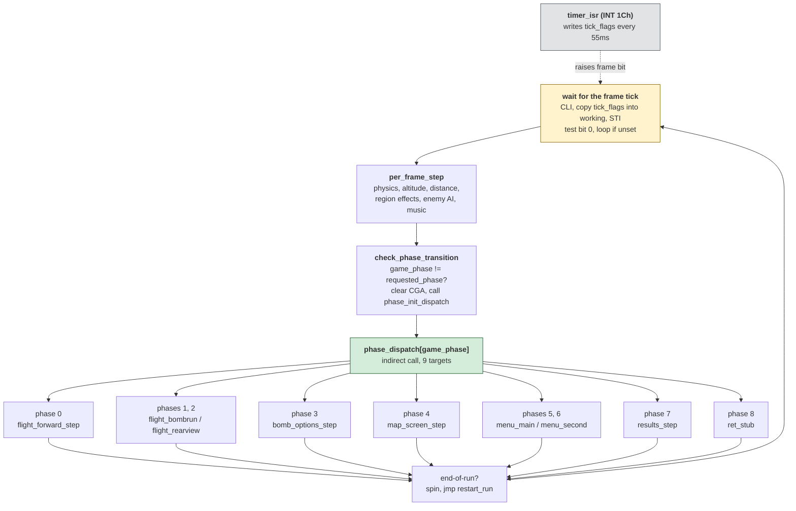

# The Dam Busters — architecture

*Document two of six. See [01-the-game.md](01-the-game.md) for what the
game is, [03-the-code.md](03-the-code.md) for annotated routines,
[04-porting.md](04-porting.md) for choosing a target,
[05-web-architecture.md](05-web-architecture.md) for the port's shape and
[06-web-code.md](06-web-code.md) for its code. Some of those files may
not exist yet; the header names positions.*

This describes how the shipped 1984 program is put together: the file,
the entry, the frame loop, the nine phases, the eleven jump tables that
dispatch between them, and the four hardware subsystems. Facts here are
read from the binary; anything reasoned rather than observed is marked
**[inferred]**. What static reading did not settle is listed at the end.

Doc 01 is the first read. [ParaTrooper's doc 02](../../paratrooper/docs/02-architecture.md)
has a gentler primer on registers, segments and memory if 8086 assembly
is new.

---

## The file, as a shape

`DAMB.EXE` is **65,664 bytes** on disk: a **512-byte MZ header**, a
**65,028-byte load image**, and **124 trailing bytes** past the image
that DOS never loads. Two facts about that shape matter:

- It is an **MZ**, DOS's ordinary relocatable format — the first two
  bytes are `4D 5A`, the initials of Mark Zbikowski.
- **It has zero relocations, and its entry is `CS:IP = 0000:0000`.**

An MZ program that expects to be loaded anywhere in memory normally
carries a *relocation table* — a list of every address that needs
patching with the segment DOS chose. This file has none. That means
every address is already usable without knowing where DOS put it,
which means the whole program lives in **one segment**. It is a
`.COM`-shape program wearing an MZ header, the same shape as Karateka.

The first two instructions confirm it:

```nasm
entry:
    mov ax, cs
    mov ds, ax          ; DS := CS
```

`CS` is where the code lives; `DS` is where the data lives. The
program sets them equal — one segment for both — and never separates
them again.

**The 124 trailing bytes.** `mzinfo.py` reports the declared load
image at file offsets `0x200..0x10004`; the file extends 124 bytes
past that end. DOS never loads them, but they are part of the file's
SHA-256, so `build.ps1` appends them back after reassembly. What they
are is not read; they are outside anything the program executes.

**One consequence for measurement.** "26.7% decoded" is 17,364
instruction bytes out of the 65,028-byte image — which includes
sprite banks, text, lookup tables and the trailing data. Two thirds
of a game file is normally not code, and this game is no exception.
Both the file number and the code-region number matter; neither alone
is enough.

---

## The entry and what boots the game

The first 45 bytes are a **hardware-detection loop** that runs 16
rounds and falls through to `post_boot` at `0x2F`. What each round
tests is not settled — it writes small values into registers, jumps
across a six-byte block of hand-written bytes, and counts up. The
dead-exit branch (`detection_failure_halt` at `0x2D`) is an infinite
`jmp $` that the shipped file never reaches because the loop always
falls through.

`post_boot` sets the machine up:

```
call init_cga_mode        ; 0xE0F2 — INT 10h AH=0 AL=4 (CGA mode 4)
call set_default_palette  ; 0xE123 — INT 10h AH=0Bh, palette 1
call save_kbd_isr         ; 0xD1CF — remember the BIOS INT 9 vector
mov  word [saved_sp], sp  ; so restart_run can restore the stack
call install_timer_isr    ; 0xE1F9 — take over INT 1Ch
call draw_title_screen    ; 0xB4D8
call flush_key
call wait_key_or_timeout
```

The 65,536-iteration empty loop between `save_kbd_isr` and
`install_timer_isr` is a timing delay — the largest a 16-bit register
counts to. `post_boot` falls through into `restart_run` (`0x53`),
then `main_setup` (`0x5F`) which starts the ambient song and
installs the keyboard ISR, and then into `main_loop`.

---

## The frame loop

`main_loop` at `0x6B` is the architectural centre of the program.
Fifteen instructions:

```nasm
main_loop:
    cli
    mov ax, word [tick_flags]
    mov word [tick_flags_working], ax
    mov word [tick_flags], 0
    sti
    test word [tick_flags_working], 1
    je main_loop
    call per_frame_step
    call check_phase_transition
    mov bx, word [game_phase]
    shl bx, 1
    call word [bx + phase_dispatch]
    ; …then end-of-run / ack-pending polls
```

**The CLI/STI dance.** `cli` disables hardware interrupts; `sti`
re-enables them. Between them, the code atomically moves `tick_flags`
into `tick_flags_working` and clears the original. Why? Because
`timer_isr` — the routine the hardware calls 18.2 times a second, on
its own schedule — writes into `tick_flags`. Without the fence, a
timer interrupt firing between the read and the clear could set a bit
that then gets cleared before anyone sees it. This is the **only**
place in the program that fences an interrupt. The shared variable
between the ISR and the main code is protected; everything else is
per-frame polling.

**The dispatch call.** `call word [bx + phase_dispatch]` is an
**indirect call**: it does not name a specific routine, it names a
memory location whose *contents* are the routine's address. The
contents are picked by `game_phase` (0..8), so the same instruction
reaches nine different routines depending on what the game is doing.
This is the first of eleven jump tables in the file.

---

## Nine phases, dispatched by two tables

The game's top-level state is `game_phase` at `[0x5DB]`. `main_loop`
reads it every frame and dispatches to a per-frame handler. When
input requests a phase change, the handler writes `requested_phase` at
`[0xD1CD]`, and `check_phase_transition` (`0x8AB`) compares the two —
on a mismatch, it clears the framebuffer, resets the palette, sets
`game_phase := requested_phase`, and calls a **second** table's
one-shot init for the new phase.

**`phase_dispatch`** at `0xB9`, indexed by `game_phase * 2`:

| # | init | step | what it is |
|---|---|---|---|
| 0 | `flight_forward_init` | `flight_forward_step` | pilot's forward view |
| 1 | `flight_bombrun_init` | `flight_bombrun_step` | bomb-aimer's view |
| 2 | `flight_rearview_init` | `flight_rearview_step` | rear gunner's view (camera negated) |
| 3 | `bomb_options_init` | `bomb_options_step` | two YES/NO toggles at `[0x4B61]`/`[0x4B62]` |
| 4 | `map_screen_init` | `map_screen_step` | six-region raid map |
| 5 | `menu_main_init` | `menu_main_step` | throttles, boosters, fire ext. |
| 6 | `menu_second_init` | `menu_second_step` | target/altitude selector |
| 7 | `results_init` | `results_step` | end-of-run scoreboard |
| 8 | *(none)* | `ret_stub` | idle — a bare `ret` |

**`phase_init_dispatch`** at `0x8D2` has the eight init entries.
Phase 8 has no init because idle is entered directly (a flak hit
forces it from `check_flak_hit`) and its step is the one-byte
`ret_stub`.

Phase 2 is worth flagging: it shares the whole 3D pipeline with
phase 0, but `flight_rearview_step` negates all three camera
coordinates (`neg ax` on `[0xBC6]`, `[0x3070]`, `[0x306D]`) before
writing them into the camera slots. Same drawing code, camera
flipped — the look-behind view for the rear gunner.

---

## The eleven jump tables

An **indirect jump** or **indirect call** is the assembly-language
shape of what a higher language would call a method dispatch: the
routine that runs is picked at run time by reading a memory location.
The 8086 has forms like `call word [bx + K]` and `jmp bx` that route
through a small table of addresses.

Every dispatcher in the file:

| table | targets | selected by | status |
|---|---|---|---|
| `phase_dispatch` (`0xB9`) | 9 | `game_phase` | named |
| `phase_init_dispatch` (`0x8D2`) | 8 | `requested_phase` on transition | named |
| `region_effect_dispatch` (`0x1045`) | 6 (4 unique) | `map_region` | named |
| `menu_action_dispatch` (`0x1610`) | 19 | `menu_cursor` | 15 of 19 named |
| `object_render_dispatch` (`0x4E82`) | 10, read at 4 offsets | object type `[si + 0xA]` | table + per-type renderers named |
| unnamed (`0x6F3E`) | 3 | `bx` guarded `cmp bx, 6 / jae` | targets named as `start_mission_*` |
| unnamed (`0x7E9E`) | 8 entries, 3 unique | `bx` | `end_run_bomb_grade_dispatch` |
| `dl_dispatch` (`0xDF18`) | 10 | display-list opcode byte | all 10 named `dl_opcode_*` |
| one unresolved `jmp bx` at ~`0x6F53` | ? | via `mov si, [0x6EAB] / mov bx, [si]` | see below |

**Three toolkit fixes were needed to find some of these.** The
disassembler walker did not follow (a) near-branch targets that wrap
past the segment origin, (b) dispatch tables addressed as `[bx + K]`
without a `cs:` prefix (Karateka's compiler always uses `cs:`; this
game does not because in a single-segment `.COM`-shape program DS *is*
CS), and (c) negative displacements in those `[bx + K]` tables that
appear in the disassembly as `[bx - K]`. Before the fixes, five of
the eleven tables were invisible and the decode rate was 12.3%. After
— same byte-identical hash, but 158 call targets instead of 75. The
narrative is in
[BRIEF.md](../BRIEF.md#where-control-went-that-the-walk-could-not-follow-2026-08-19).

**The unresolved indirect** at ~`0x6F53` gets its target from a
function pointer stored in memory whose writer is not visible to
static reading. Solving it needs a runtime hook.

The frame loop, the two phase tables and the whole dispatch structure
look like this:



**How to read it.** Start at the yellow box. The dotted line from
`timer_isr` is the *only* thing running in the background; everything
else is a call from the main loop. The green box is where the game
decides what "now" means, and there are only nine places it can go.
Reading the program is walking down each of those nine branches in
turn.

---

## The subsystems

**Video.** CGA mode 4 (320×200, four colours) set once by
`init_cga_mode` (`0xE0F2`) and never changed. The framebuffer at
segment `0xB800` is written directly. The blitter primitive is
`blit_rect` at `0xDA39`; every drawer builds on it. Scan-line
addresses come from a pre-computed table at `0xE4A2` — 200 word
entries, folding CGA's famously interlaced layout (even rows at
`0xB800:0000`, odd rows at `0xB800:2000`) into a single lookup so
drawers do not redo the arithmetic per pixel.

**Keyboard.** The game **replaces** the BIOS keyboard handler.
`install_kbd_isr` (`0xD1E2`) masks IRQs 0 and 1, writes `cs:0xD271`
into the INT 9 vector and `cs:0xD445` into the INT 0 (divide-by-zero)
vector, then unmasks the PIC. The original is saved by
`save_kbd_isr` (`0xD1CF`) at boot and restored by `restore_kbd_isr`
(`0xD20B`) on exit. The custom INT 9 writes into `input_flags` at
`[0xD1C2]` — bit 0 up, bit 1 down, bit 2 left, bit 3 right — which
every phase reads. This is how the program reads *held* keys; the
BIOS only tells you the last one pressed.

**Timer and music.** `install_timer_isr` (`0xE1F9`) programs PIT
channel 2 for the PC speaker, initialises the music sequencer, and
hooks `cs:0xE24E` as the INT 1Ch handler. `timer_isr` (`0xE24E`)
runs 18.2 times a second and does two jobs: it drives the frame-tick
bit that `main_loop` waits on, and it walks the music sequencer.
Music is a byte stream of (duration, note-index) pairs in
`song_note_streams` at `0xADCB`; each note-index picks a PIT count
from the frequency table at `0xE151`, and channel 2 is reprogrammed
to that pitch. Songs 0..14 live in `song_table_and_data` at `0xADAD`.

**PRNG.** `prng_step` at `0xE366` walks a 256-byte LFSR state at
`prng_state_bank` (`0xE381`) — pre-populated in the file, modified in
place at run time. Reads one byte, rotates left through carry, writes
back, decrements an index. Every random decision in the game — flak
spawn, scenery drift, enemy attack timing, city picks in the
intelligence report — pulls from this one LFSR.

**The drawing DSL.** `draw_display_list` at `0xDF0E` is an
interpreter for a **bytecode** of ten opcodes. A "display list" is a
sequence of bytes: the interpreter reads one, dispatches through
`dl_dispatch` at `0xDF18` (the tenth jump table above), executes what
that opcode says, reads the next. Opcode 0 ends the program; 1 and 6
draw text (without and with clipping); 2, 5, 7, 8, 9 draw sprite
variants; 3 waits ticks; 4 sets the CGA border colour. Every phase's
init is a display-list program, called from its `phase_init_dispatch`
entry with `SI` pointing at the bytecode. `draw_display_list` is
called 34 times — every menu, every panel, every title is a small
program in this language. In 1984 this was elegant; most games
hard-coded their screens.

**3D projection.** The flight phases share one pipeline.
`update_camera_transform` (`0x4EDA`) recomputes a 2×2 matrix from
`sin(roll)` and `cos(roll)` each frame plus a translation from pitch.
`project_point_2d` is that matrix multiply plus translation for a
single point. `render_object_pool` walks the 20-slot `object_pool` at
`0x51DD`, projects each live one, culls off-screen, and dispatches
through `object_render_dispatch` (`0x4E82`) by the slot's type byte
`[si + 0xA]`. The rear view calls `render_object_pool_rear`, which
mirrors the world coordinate — same pipeline, camera flipped. The
whole 3D system fits in a few hundred bytes.

---

## The image, partitioned

`symbols.json` maintains a `_data_spans` partition — a contiguous,
non-overlapping list of extents covering the whole image, each with a
reason for its content. **112 spans cover 65,028 bytes.**
`annotate.py` refuses the reading unless the spans partition exactly:
every gap or overlap is a bug the tool catches.

Why maintain that partition at all? Because "100% of call targets
named" is a fraction whose denominator is *references*, not bytes.
The bytes *between* the named references can be 40% of the file, and
a symbol table can be complete against its own denominator while
leaving half the image unread. Karateka went to 100% call targets
with a fifth of its bytes unaccounted for. `_data_spans` is the
second denominator, and it catches that class of gap.

Rough breakdown of what the 65,028 bytes are, aggregated from the
spans:

| what | how many bytes | where |
|---|---|---|
| code | ~17,000 (26%) | a dozen "code region" spans interleaved through the first half |
| sprite banks | ~19,000 (29%) | `sprite_base_bank` (`0xB544`, 7,307B), `phase_sprite_bank_a` (`0x886B`, 5,973B), `sprite_bank_at_e9f2` (5,138B), smaller banks |
| ground/rotation sprite frames | ~3,400 (5%) | `object_ground_sprite_frames` (2,694B), per-object frame tables |
| game text strings | ~1,500 (2%) | crash messages, awards, cities, menus, intelligence report — mostly `0x7EFC..0x84C7` |
| lookup tables | ~1,500 (2%) | trig tables, PRNG state, CGA scanline table, PIT frequency table, bit-expansion table |
| jump/dispatch tables | ~200 (< 1%) | the eleven tables above |
| per-run state clusters | ~2,000 (3%) | flight, menu, target-lock, object pool, HUD — zeroed in the image, written at run time |
| song data | ~550 (1%) | `song_note_streams` |
| results-page sprite bank | ~3,000 (5%) | `results_sprite_bank` (`0xA10E`) |
| trailing bytes past load image | 124 | `0x10004..0x10080` |

Percentages are approximate; the spans partition is the exact record.
**Two thirds of the file is not code.** "26.7% decoded" is the right
number to quote and "100% would be the goal" is the wrong sentence to
write.

---

## What is still unknown

Static reading did not settle these:

- **The 124 trailing bytes** past the declared load image. Preserved
  in the reconstruction because the hash requires them; not read.
- **The 16-round detection loop at entry.** What it probes and what
  makes the shipped file always fall through are not established.
- **The `jmp bx` at ~`0x6F53`.** The one unresolved indirect. Its
  target comes from `jmp_bx_indirect_ptr` at `0x6EAB` whose writer is
  not visible statically. Needs a runtime hook per the toolkit's
  [knowledge/12](../../DOS-Decompiler/knowledge/12-hooking-the-right-thing.md).
- **Two globals inside `check_flak_hit_type4`.** `flak_active_type_a`
  (`0x6B7F`) and `flak_active_type_b` (`0x6B7D`) are addressed as data
  by the code that reads them, but their bytes disassemble cleanly as
  instructions in the middle of the routine. Either the reading has
  mis-identified them or the routine writes into its own body — a
  self-modifying idiom the reading has not confirmed elsewhere.
  Recorded as a note on the containing span rather than papered over.
- **Sprite frame formats** are not decoded to the pixel. Banks are
  located and sized, and the routines that read them are named
  (`draw_sprite_row_2x8`, `blit_shape`, `object_render_ground`), but
  no single sprite has been walked byte-for-byte to a rendered frame.

None of these affect the reconstruction. It rebuilds to
`D3657960A00AAC6548C47EE35A8AC008EF0BB254F94AE2A335B04431F26C380D`
whether they are answered or not — and that is worth ending on.
**Byte-identity is the floor, not the ceiling.** A file that
assembles back to itself while half of it is emitted as `db` also
hashes correctly and teaches nothing. The number that matters is how
much came back as instructions with names and evidence, and after
that how much sits inside a span that says what it is for. The
reading tracks both.
