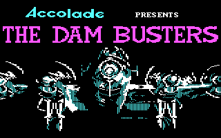
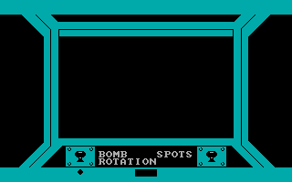
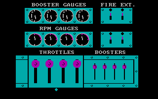
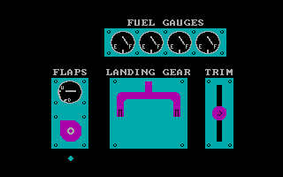
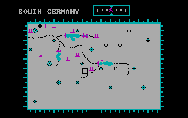
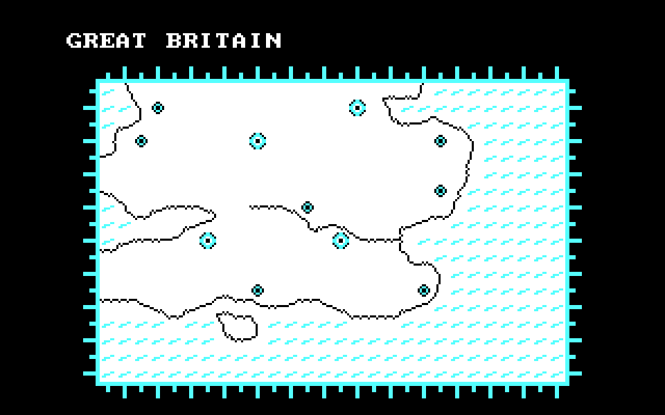
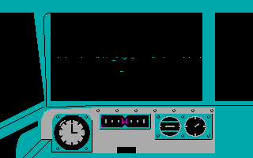
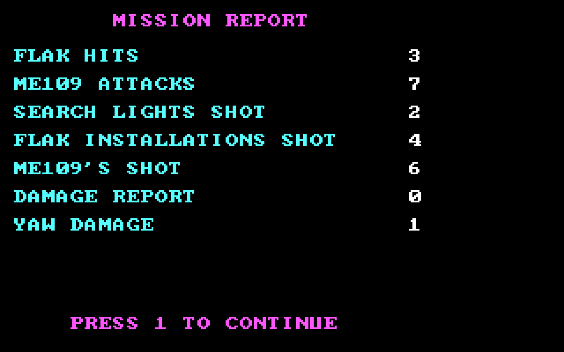
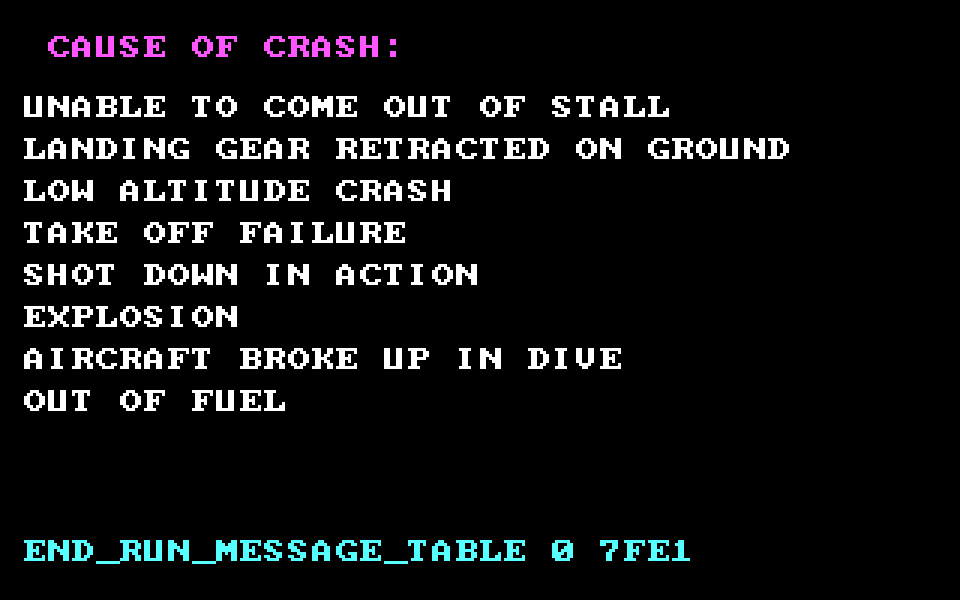

# The Dam Busters — Player's Manual

*Sydney Development Corporation, 1984. Published in North America by
Accolade, in Europe by U.S. Gold. This manual is written from the
reading of the binary itself — the actual keys the game listens for,
the actual screens it draws, the actual rules it applies. Where the
manual differs from what you remember, believe your copy of the game
and report the difference.*

*See [../01-the-game.md](../01-the-game.md) for the history, the raid
this game dramatises, and the file-level evidence for every claim
here. This document is the shorter kind — the one that came in the
box.*

*Most of the images here are **real screenshots** captured from
DOSBox running an original copy of `DAMB.EXE`: title, cockpit menu,
secondary menu, bomb options, forward flight, and the South Germany
map. Four screens where a real run was harder to script — the
intelligence report, the Great Britain map, the mission report, and
the crash-message list — are **reconstructions** drawn by running
the game's own drawing routines over the game's own data. Both
kinds contain pixels that come from the 1984 game and are included
under fair-use for teaching purposes.*

---



## Welcome, Wing Commander

On the night of 16-17 May 1943, nineteen Avro Lancaster bombers of
617 Squadron, RAF, flew low across occupied Europe with a weapon
nobody had used in combat before — a spinning cylindrical bomb that
skipped across water like a stone. Their target was the Ruhr Valley
dams. Their instructions were exact: fly at exactly 60 feet above
the reservoir, at exactly 232 miles per hour, and release at the
moment two towers on the dam wall lined up in a small wooden sight.

Eight aircraft did not come back. The Möhne and Eder dams were
breached. You are about to fly that mission.

You will do it alone. There is one Lancaster, and it is yours. You
will be pilot, bomb-aimer, flight engineer, and rear gunner — because
the real crew of a Lancaster had four different people doing those
jobs and you, sitting at the keyboard, are all of them.

## What you have to do

Take off from **RAF Scampton** in Lincolnshire. Cross the North Sea
into Belgium or northern France. Route through **radar holes** where
the intelligence briefing says the coverage is thin, avoiding cities
where the German night-fighter groups and flak concentrations are
active. Find the Ruhr. Line up on the dam. Get down to 60 feet.
Release the bomb at exactly the right instant. Then get home.

Do it well and you are **promoted to Squadron Leader** — one rank
below Wing Commander Guy Gibson, who led the real raid. Do it
badly and you are **demoted to kitchen duty**. Die on the target
and you are awarded **Flander's Field** — the poppy field, a
posthumous award.

There is no middle ground.

## The three difficulty levels

You do not begin with the full mission. The game unlocks it in
three stages, exactly as 617 Squadron trained for the real raid on
English reservoirs before flying to Germany:

**Level 1 — DAM APPROACH.** Skip the flight. You start in the
bomb-run, already lined up on the target. This is where you learn
to release the bomb.

**Level 2 — ENGLISH CHANNEL.** You start over the Channel, having
crossed Britain. Shorter cross-Europe leg, then the bomb-run.

**Level 3 — SCAMPTON AIRFIELD.** The full mission. Take off, cross
the sea, navigate to the target, drop, fly home.

You start locked to level 1. Score above the threshold on level 1
and the scoreboard tells you: *"WELL DONE YOU'VE QUALIFIED FOR THE
ENGLISH CHANNEL LEVEL"*. Do it again on level 2, unlock level 3.
Fly Scampton well and you are promoted.

---

## The controls

The Dam Busters uses the whole keyboard. The keys below are what
the game actually listens for, taken from the binary's own keyboard
handler at `cs:0xD271`.

### Flight and menu movement

| Key | What it does |
|---|---|
| **↑** or **Numpad 8** | Pitch up / cursor up |
| **↓** or **Numpad 2** | Pitch down / cursor down |
| **←** or **Numpad 4** | Roll / bank left / cursor left |
| **→** or **Numpad 6** | Roll / bank right / cursor right |
| **Space** | Release bomb / fire gun / confirm menu choice |
| **Ctrl** (left) | Hold-and-drag map cursor (held while positioning) |

Movement is **hold-to-continue**. The game reads a key-down event
as "start pressing" and a key-up event as "stop pressing", so you
can hold the stick over.

### Switching between crew stations

The game keeps you at one crew station at a time and switches you
between them on demand. The nine phases of a mission (numbered 0 to
8) are selectable directly:

| Key | Where you go |
|---|---|
| **1** or **F1** | Pilot — forward view (fly the aircraft) |
| **2** or **F2** | Bomb-aimer — bomb-run view (target the dam) |
| **3** or **F3** | Rear gunner — rear turret view (defend against fighters) |
| **4** or **F4** | Bomb options — arm/rotation/spots switches |
| **5** or **F5** | Map screen — pick which region to fly toward |
| **6** or **F6** | Cockpit controls — throttles, boost, RPM, fire extinguishers |
| **7** or **F7** | Target/altitude selector — the two 3-way switches |
| **8** or **F8** | Scoreboard — the mission report |

Every phase key is doubled: the number row *and* the function row do
the same thing. Whichever is more comfortable for your keyboard is
fine.

### Housekeeping

| Key | What it does |
|---|---|
| **S** | Sound on |
| **Q** | Sound off (quiet) |
| **B** | Pause — the game hands control back to DOS. Press **1** to resume. |
| **Enter** | Confirm restart at end-of-mission scoreboard |
| **Esc** | End the run (accepts the current mission, jumps to scoreboard) |

`B` is a real pause: the game unhooks its keyboard handler and
restores the BIOS default, so the machine is fully idle while you
are away.  Press `1` (the number, not F1) to reattach and resume.

---

## The mission, screen by screen

You enter each screen through its phase key. This walkthrough goes
in the order a full Scampton run visits them.

### 1. The intelligence report


Before every mission the game prepares a briefing. It picks, at
random:

- **One** RADAR HOLE — a corridor where German radar coverage is
  thin. Route through this region and fewer fighters will find you.
- **One** NIGHT FIGHTER city — where Luftwaffe interceptors are
  concentrated. Avoid.
- **Four** BOMBING RAID target cities — where allied bombers are
  active, so the German flak has been aimed and warmed up. Avoid.
- **One** FLAK CONCENTRATION city — the worst anti-aircraft
  positions of the night. Avoid.

The briefing draws from ten cities: **BRUSSELS, PARIS, AMSTERDAM,
HANNOVER, ANTWERP, DUSSELDORF, KOLN** (Cologne, spelled the German
way), **DORTMUND, HAMBURG, BERLIN**.

Every mission is different because these picks are re-rolled. The
briefing is not decoration — the game reads its own picks each
frame to decide where to spawn flak and enemy fighters. **What the
report tells you to avoid is the region the game will actually
send more danger into.**

### 2. The bomb options — Phase 3



Press **4** or **F4** to reach the bomb options page. What you see is
your bomb-aimer's forward cockpit frame — the cyan rectangle looking
out — with a small control panel at the bottom labelled **BOMB /
ROTATION / SPOTS** and two small indicator boxes.

These are the three real switches the 617 Squadron bomb-aimer worked
in 1943:

- **BOMB** — arm the bomb. Nothing releases until this is on.
- **ROTATION** — spin up the backspin motor. The bouncing bomb
  needed about 500 rpm counter-rotation to skip across the water
  and cling to the dam wall on impact instead of ricocheting away.
- **SPOTS** — turn on the pair of downward-pointing spotlights that
  converged on the water at exactly 60 feet. When the two circles
  of light merged into one on the reservoir, the pilot knew he was
  at the release height. Barometric altimeters were not accurate
  enough for 60 feet; the spotlight altimeter was **the actual
  altimeter 617 Squadron used** on the run in.

**Turn all three ON before entering the bomb-run.** If you release
with rotation off, the bomb bounces the wrong way. If you release
without spots on, you cannot see the release altitude.

### 3. The cockpit controls — Phase 5



Press **6** or **F6** to reach the cockpit menu. This is where you
manage the four Rolls-Royce Merlin XX engines of your Lancaster.

Five panels:

- **BOOSTER GAUGES** — read-outs of what your supercharger boosters
  are doing on each engine.
- **RPM GAUGES** — the same read-outs for engine RPM.
- **THROTTLES** — one slider per engine, plus a "move all four
  together" option. Range 0..24.
- **BOOSTERS** — one slider per engine. Range 0..40. The Merlin XX
  had a two-speed, two-stage supercharger; more boost gives more
  power for climb or emergency, but stresses the engine and burns
  more fuel.
- **FIRE EXT.** — one fire extinguisher per engine. This is a
  **one-shot resource**. Discharge it when the engine is on fire,
  not before. If you press it while the engine is fine, it is gone.

Use the arrow keys to move between panels. Use up/down to raise or
lower the currently-selected slider. Space confirms selections
where prompted.

*The Merlin engine had a real reputation among Lancaster crews for
catching fire. The extinguisher-per-engine model is faithful to
the aircraft.*

### 4. The secondary controls — Phase 6



Press **7** or **F7** to reach the second menu. Four more Lancaster
systems, plus the two-switch mission profile.

- **FUEL GAUGES** — one per engine. Running out of fuel is one of
  the seven ways the game will kill you.
- **FLAPS** — up for cruise, down for landing.
- **LANDING GEAR** — up for cruise, down for landing. Land with
  the wheels up and the game records "LANDING GEAR RETRACTED ON
  GROUND" — a belly landing that destroys the aircraft.
- **TRIM** — a small dial to keep the aircraft flying level
  hands-off.

And the two switches that define your bomb-run:

- **Selector A** — three positions choosing the approach distance:
  **140 / 120 / 100** game units. Shorter is harder — less room to
  correct.
- **Selector B** — three positions choosing the target altitude:
  **0 / 20 / 40** game units. Lower is harder — you have less
  margin above the water.

That gives you **3 × 3 = 9 approach profiles**, from generous
(140 distance, 40 altitude) to unforgiving (100 distance, 0
altitude).

### 5. The map — Phase 4



Press **5** or **F5** to reach the map — the region-selection
screen.

Six regions of Europe, each with its own physics:

| Region | The route it is |
|---|---|
| **GREAT BRITAIN** | Where you start. Scampton airfield is here. |
| **BELGIUM** | First landfall after crossing the North Sea. |
| **NORTH GERMANY** | The flat plain north of the Ruhr. |
| **FRANCE** | The alternative crossing, further south. |
| **EASTERN FRANCE** | Border approach — brings you close to Cologne. |
| **SOUTH GERMANY** | The Ruhr — **the target is here.** |

Hold **Ctrl** and use the arrow keys to move the map cursor. The
cursor snaps between the six regions. Once positioned, release
Ctrl to commit.

The cursor position tells the game which region to fly you into
next. The heading arrow at your plane's current position shows
which way you are pointing. The bearing display along the top
shows the compass reading from your last committed position to
the current cursor.

*South Germany has the slowest physics rate of the six regions —
half the normal integration. The game is telling you the approach
to the target slows down naturally when you get there.*

Every region has flak batteries, radar sites and coastlines drawn
from tables in the game itself. If the intelligence report picked
your current region as a **radar hole**, some of those flak batteries
are marked as passable corridors.



### 6. The pilot's view — Phase 0



Press **1** or **F1**. You are looking forward out the pilot's
canopy. The cyan cockpit frame surrounds a 3D world drawn from
the object pool — the horizon, any aircraft or terrain in view,
the instrument panel at the bottom.

Fly the aircraft with the arrow keys:

- **↑** — pitch nose up (climb)
- **↓** — pitch nose down (dive)
- **←** — bank left (turn left)
- **→** — bank right (turn right)

There is **a hidden auto-stabilise mode**. When active, the
accumulated pitch/roll rate saturates to the range [-6, +6] — the
Lancaster resists sharp manoeuvres. When off, every input keeps
accumulating and you can pull harder turns but the aircraft will
happily depart controlled flight while you are doing it. It is
essentially a difficulty switch built into the physics.

Watch:

- **The altitude number** — if it climbs above about 390 game
  units, the aircraft breaks up (crash reason: AIRCRAFT BROKE UP
  IN DIVE — the modified Type 464 Lancaster's structural limit).
  If it falls below about -0x2C (-44), you have crashed into the
  ground. Both are counted as crashes.
- **The horizon** — level flight looks level. If the horizon
  tilts, you are banked.

### 7. The bomb-aimer's view — Phase 1

Press **2** or **F2**. You are lying in the perspex nose of the
Lancaster, looking forward and down through the bomb-sight.

A **target-lock rectangle** appears in the centre of the view.
Your job is to hold the target inside that rectangle. The game
tracks a hold timer: **you have to hold the aim on the target
long enough**, not just tap Space at the right moment. This
mirrors the real bomb-aimer's job — you cannot bomb from a
banking aircraft, you have to fly straight and level long enough
for the wooden sight to line up.

When the timer completes, **press Space** to release the bomb.

The game grades the release on four axes:

- **Height** — high (over 60 ft equivalent) or low (into the water)
- **Speed** — slow or fast (target: 232 mph equivalent)
- **Release distance** — early (too short) or late (too long)
- **Alignment** — centred between the towers, or not

Get all four right and the mission succeeds. Miss on any axis and
the scoreboard tells you which: *"THE BOMB DROP WAS EARLY"*, *"THE
APPROACH WAS HIGH"*, *"THE APPROACH WAS FAST"*, *"THE APPROACH WAS
NOT CENTERED"*, and so on.

The game does not tell you the numbers. You must find them by feel.

### 8. The rear gunner — Phase 2

Press **3** or **F3**. You are in the tail turret, looking backward
down the length of the Lancaster. The 3D scene is the same as the
pilot's view but with all three camera coordinates negated — you
are looking behind you.

**Enemy fighters attack from behind** because that is where the
Lancaster is slowest to react. This is the only view from which you
can see them coming. Use the arrow keys to traverse the twin
Browning .303 turret, and **press Space to fire**.

Do not stay in the rear turret indefinitely — you cannot fly the
aircraft from the tail. Cycle back to the pilot's view (**1** or
**F1**) to keep the Lancaster on course. But cycle back to the rear
often enough to spot fighters before they get in range: a night
fighter you never saw is one that gets a clean shot.

### 9. The mission report — Phase 7



At the end of every run — whether you made it home, crashed, or
were shot down — you see the scoreboard. Ten counters tell you
what you did:

- **FLAK HITS** — how many times the flak hit you
- **ME109 ATTACKS** — enemy attack runs completed
- **SEARCH LIGHTS SHOT** — searchlights you destroyed
- **FLAK INSTALLATIONS SHOT** — flak batteries silenced
- **ME109's SHOT** — enemy fighters shot down

And the damage report:

- **YAW DAMAGE** — how much the aircraft was thrown off heading
- **ENGINE 1..4 DOWN** — one line per engine that failed

The final grade is your **fought-back minus taken-hits**, compared
to a threshold. Above threshold: promotion or level unlock. Below
threshold: *DEMOTED TO KITCHEN DUTY*.

The messages you might see, in the order they appear in the file:

```
WELL DONE YOU'VE
  QUALIFIED FOR THE ENGLISH CHANNEL LEVEL
  QUALIFIED FOR THE SCAMPTON AIRFIELD LEVEL
BEEN PROMOTED TO SQUADRON LEADER

DEMOTED TO KITCHEN DUTY

YOU HAVE BEEN AWARDED THE
  FLANDER'S FIELD AWARD
```

Press **Enter** to restart.

---

## How you can die

The game keeps a list of the seven ways a mission ends badly.
Each is a message the scoreboard displays.



```
CAUSE OF CRASH:
  UNABLE TO COME OUT OF STALL
  LANDING GEAR RETRACTED ON GROUND
  LOW ALTITUDE CRASH
  TAKE OFF FAILURE
  SHOT DOWN IN ACTION
  AIRCRAFT BROKE UP IN DIVE
  OUT OF FUEL
```

- **UNABLE TO COME OUT OF STALL** — pulled up too hard while low
  and slow.
- **LANDING GEAR RETRACTED ON GROUND** — belly landing. Wheels up
  when you touched the runway.
- **LOW ALTITUDE CRASH** — flew into the ground or water.
  `altitude < -44` triggers this.
- **TAKE OFF FAILURE** — did not accelerate correctly off Scampton.
- **SHOT DOWN IN ACTION** — flak or a fighter got you.
- **AIRCRAFT BROKE UP IN DIVE** — exceeded the Lancaster's
  structural speed. Climb above about 390 game units and this
  triggers.
- **OUT OF FUEL** — ran the tanks dry. Every extra pass over the
  target, every extra minute of boost, costs fuel. Watch the
  gauges.

---

## Playing to win

**Start on Dam Approach.** The full raid is impressive but you
have no chance of scoring on it until you can get the release
right. Spend as long as you need on Level 1. The bomb-run is
the entire game, in miniature, and everything else is either
setup or aftermath.

**Practise the four axes separately.** The grade tells you what
you got wrong: HIGH, LOW, SLOW, FAST, EARLY, LATE, NOT CENTERED.
Fix them one at a time. Get the height dialled in first (turn
SPOTS on and read the spotlights), then the speed (steady throttle
in cruise), then the distance (learn to release when the wooden
sight aligns with the two towers), then the centering.

**When you can hit Dam Approach, go to English Channel.** You now
have to fly there. Watch the fuel gauge. Set boost to something
sensible for cruise (not the maximum — that burns fuel and stresses
engines). Do not weave.

**When you can hit English Channel, go to Scampton.** Now you take
off, navigate across occupied Europe, cross into the Ruhr, drop,
and come home.

### Tricks the game does not tell you

- **The music tells you your engine state.** The score that plays
  in the background is picked based on the *average* of your four
  engine-load values. If the music thins out or gets more urgent,
  you are running on fewer or damaged engines. **Listen** — the
  music sometimes catches damage before the gauges do.
- **The screen flashes white when you take a hit.** This is not a
  crash. The game saves your current view, forces you into an
  idle phase for a moment, flashes the border white, then restores
  your view. If you see the flash and are still flying, you were
  hit but not shot down.
- **The scenery is never still.** Every frame the game rolls a
  1-in-32 chance to replace one of the sixteen background objects
  with a new one. Even when nothing is chasing you, the horizon
  moves. This is intentional — it makes the world feel alive.
- **Save each fire extinguisher for a real fire.** There is one per
  engine, and once discharged it is gone. If an engine catches fire
  and you extinguish it in time, that engine survives with reduced
  performance. If you press the extinguisher when the engine is
  fine, the extinguisher is wasted and the next fire is fatal for
  that engine.
- **The rear gunner's camera is inverted.** All three world-space
  coordinates are negated. If it feels backwards, that is because
  it is — you are looking backwards down the aircraft.

---

## How to actually win — traced from the code

Every fact in this section comes from a specific routine in the
recovered assembly. Where a number appears, it is the exact byte
constant the game compares against. If the game feels arbitrary, it
is not — the whole win path is a chain of numeric gates and this is
what they are.

### 1. What the game sets up when you pick a level

The three level-select handlers (`start_mission_dam_approach` at
`0x05E7`, `start_mission_channel` at `0x07B0`, `start_mission_scampton`
at `0x0866`) set very different starting states. Read them together
and it is clear why the three "levels" behave the way they do:

| variable | Dam Approach | English Channel | Scampton |
|---|---|---|---|
| `starting_position_id` (`[0x8140]`) | **2** | 1 | **0** |
| plane position | (`0x50`, `0x50`, region 0) | (`0x50`, `0x50`, region 1) | (`0x60`, `0x14`, region 5) |
| heading (`[0xBC9]`) | `0x5A` (90°) | `0x5A` | `0x5A` |
| `distance_travelled` (`[0xBCB]`) | **0** — already at target | `0x800` (2048) | `0x800` |
| `altitude` (`[0xCE6]`) | **0** — on the water | `0xFA` (250) | `0xFA` |
| engine sliders | zero | (23, 21) per engine | (23, 21) per engine |

Then all three fall into `reset_per_run_counters` (`0x006B1`) which
zeroes every combat counter, sets `game_phase = 0xFFFF`, requests
phase 4, and calls `check_phase_transition`. **You always begin
looking at the map.**

Dam Approach is the training mode in the strongest sense: your
distance and altitude are both zero, meaning you begin **inside**
the release window and need to fly *forward* to reach it. Channel and
Scampton drop you 2048 distance-units away at altitude 250, meaning
you have real ground to cover and real fuel to manage.

### 2. Committing a region on the map (Phase 4)

`map_screen_step` reads three input flags per frame:

- `input_flags` (`[0xD1C2]`) — arrow keys, moves the map cursor
- `input_cursor` (`[0xD1C3]`) — set on Ctrl-down, cleared on Ctrl-up
- `input_fire` (`[0xD1C5]`) — set on Space-down

`update_map_view` (`0x001F0`) triggers on the *cursor toggle*: with
Ctrl held it swaps `[0x10E]` between the two cached position slots
and redraws the border. `save_map_pos` (`0x0021D`) commits the
working position into the saved slot when the fire flag is set.

You steer the plane by picking a region under the cursor and
committing it. `clamp_map_position` (`0x00240`) wraps the cursor
between adjacent regions per the map layout — regions 0 and 3 clamp
against the west edge (nothing further west), regions 2 and 5 clamp
east.

### 3. How the plane actually reaches the target

`step_plane_position` (part of `per_frame_step`) integrates a
distance step each tick, incrementing `distance_step_counter`
(`[0x2397]`) and — on every full step — `distance_travelled`.
`check_flight_conditions` (`0x00FBF`) compares `distance_step_counter`
to `12`; too many steps without progress is one of the crash gates.

`integrate_heading` and `integrate_pitch_roll` translate your
controls into heading/altitude changes. The saturation ranges in
`integrate_heading` are `[-6, +6]` **only when `[auto_stabilise]`
= 0**; when non-zero, the aircraft becomes twitchy and you can
depart controlled flight.

Watch two hard limits that end the run outright:

- **`altitude < -0x2C` (-44)** in `physics_step` → jumps straight to
  `end_run` with reason 3 (LOW ALTITUDE CRASH).
- **`altitude > 0x186` (390)** → reason 7 (AIRCRAFT BROKE UP IN
  DIVE).

### 4. What triggers the bomb-run outcome

`flight_bombrun_step` (Phase 1 handler at `0x03F4B`) branches on
`[0xBBF]`: on `0`, it runs the normal per-frame bomb-run rendering
chain (`L_0408C`..`L_0420B`); on non-zero it displays a transition
message, waits for input, then **jumps to `bomb_run_end` at
`0x084C7`**.

`hud_check_bomb_press` on the bomb-run frame reads the plane's
region and cursor region: if they match, and the plane is within 4
game units of the cursor position, it plays sound effect 5 (the
target-acquired chirp). This is what tells you you have arrived
over the target — a small audio cue, easy to miss.

Pressing **Space** during the bomb-run sets `bomb_dropped_flag`
(`[0x5512]`) to 1, marks the bomb sprite as active, and the run
proceeds until `bomb_run_end` fires.

### 5. The four axes of a perfect release

`bomb_run_end` at `0x084C7` is the single routine that decides
whether you won. Every condition below is one line of code in it.

**Gate 0 — Are your engines healthy enough?**

```
al = engine_status_3            ; [0xBE3]
if al ≠ 0 and al ≠ 0x12: jmp crash_path
```

`engine_status_3 = 0` (normal) or `0x12` (18, damaged-but-flyable)
lets you continue. Anything else and the release fails regardless
of aim.

**Gate 1 — Did you actually drop the bomb?**

```
if bomb_dropped_flag == 0:
    if distance_travelled < 0x180:
        jmp no_drop_miss_close     ; L_0868F
    else:
        jmp no_drop_miss_far       ; L_086B4
```

If you never pressed Space, the game already knows how badly you
overshot.

**Gate 2 — Are you still within the release window?**

```
if distance_travelled >= 0x300:  ; you flew right past
    jmp overshot_completely       ; L_0866B
```

Distance `0x300` (768) past target is game-over even if you did
drop.

**The four axis checks — this is the winning window.** The game
builds a bitfield called `bomb_run_state` (`[0x824E]`) from four
comparisons, then reads it:

| axis | code check | passes when |
|---|---|---|
| **target sprite** | `if near_object_sprite ≠ 0x735F: set bit 1 or 2` | you are drop-close to the exact dam sprite (`0x735F`) |
| **distance** | `if distance_travelled ≥ 0x106: set bit 2` (late), `if ≤ 0xFA: set bit 3` (early) | `distance_travelled` is in **`0xFA..0x106` = 251..261** |
| **altitude** | `if altitude ≤ 0xEF: set bit 4` (low), `if ≥ 0x113: set bit 5` (high) | `altitude` is in **`0xEF..0x113` = 240..274** |
| **centering** | `if near_object_x < 0x32 or ≥ 0x6A: set bit 6` | `near_object_x` is in **`0x32..0x6A` = 50..105** |

Then two tests decide the outcome:

```
if bomb_run_state & 2 and (bomb_run_state & 0x15) == 0:
    jmp near_miss                 ; L_0861E
if bomb_run_state & 0x6A ≠ 0:
    jmp graded_miss               ; L_08660
; both tests failed → success
```

**Perfect hit is `bomb_run_state == 0`.** Every one of the four
axes has to pass. In practical numbers: **release when you are
exactly at the dam sprite, distance 251-261, altitude 240-274,
centering 50-105.**

Convert to intuitive units: the release window is a **10-unit
range on distance and a 34-unit range on altitude**, with the
target sprite recognised only at drop range. This is why the game
is so hard — you must satisfy four tight gates simultaneously
while flying.

### 6. What happens on success

If all four axes pass and you reach `L_08592`, the game:

1. Draws a score row and cell (`results_draw_score_row`,
   `results_draw_score_cell`).
2. Plays the success display list at `0x7FF3`.
3. Loops the celebration display list at `0x800E` **twenty times**.
4. Clears the frame, clears `bomb_run_end_active`.
5. Reads `starting_position_id`, doubles it, and looks up a
   message pointer at `[bx + 0x8142]` — the promotion / qualification
   string for your current level.
6. Draws that message, waits for a key, calls `results_init`
   (the scoreboard), waits again, and `jmp restart_run`.

The message you see depends on `starting_position_id`:

| you finished on | starting_position_id | message on success |
|---|---|---|
| Dam Approach | 2 | *WELL DONE YOU'VE QUALIFIED FOR THE ENGLISH CHANNEL LEVEL* |
| English Channel | 1 | *WELL DONE YOU'VE QUALIFIED FOR THE SCAMPTON AIRFIELD LEVEL* |
| Scampton Airfield | 0 | *WELL DONE YOU'VE BEEN PROMOTED TO SQUADRON LEADER* |

These strings live at `0x081A8` (`WELL DONE YOU'VE`), `0x081B9`
(`QUALIFIED FOR THE`), `0x081CB` (`ENGLISH CHANNEL LEVEL`), `0x081E1`
(`SCAMPTON AIRFIELD LEVEL`), `0x081F9` (`BEEN PROMOTED TO`),
`0x0820A` (`SQUADRON LEADER`).

### 7. The nine ways the game can end you instead

`end_run_message_table` at `0x07FE1` is nine word pointers indexed
by `end_run_reason` (`[0x7D33]`):

| reason | message | set by |
|---|---|---|
| 0 | (no message — unused / success) | — |
| 1 | UNABLE TO COME OUT OF STALL | `check_flight_conditions` |
| 2 | LANDING GEAR RETRACTED ON GROUND | landing check |
| 3 | LOW ALTITUDE CRASH | `physics_step` when `altitude < -0x2C` |
| 4 | TAKE OFF FAILURE | `check_flight_conditions` |
| 5 | SHOT DOWN IN ACTION | `count_engines_alive` on score-threshold overflow |
| 6 | EXPLOSION | `count_engines_alive` when a dead engine's counter reaches `0x32` |
| 7 | AIRCRAFT BROKE UP IN DIVE | `physics_step` when `altitude > 0x186` |
| 8 | OUT OF FUEL | `count_engines_alive` when an engine damage timer hits zero |

Note reason 6 = **EXPLOSION**, not "aircraft broke up" — the
manual sections above use the file's literal strings.

### 8. The score threshold ladder — how promotion actually works

`count_engines_alive` (`0x07DDA`, called every frame as
`per_frame_step[2]`) computes a running score:

```
score = player_shot_count       ; [0x6AD3] — flak hits taken
      + enemy_shot_count        ; [0x598F] — ME 109s shot down
      - enemy_hit_count         ; [0x5991] — ME 109 attack runs
```

Each frame it compares this against a threshold from the
9-entry table at `0x07D91`:

```
thresholds = 20, 35, 50, 65, 75, 85, 90, 95, 100
```

`end_run_score_ptr` (`[0x7D8F]`) starts at `0` and points into that
table. When the running score first exceeds the current threshold,
the pointer advances by 2 and the game rolls the PRNG:

- roll `0x14` → set reason 5 (SHOT DOWN IN ACTION) and end the run
- roll with low bit set → nothing happens
- else dispatch through `end_run_bomb_grade_dispatch` at `0x7E9E`
  — half the entries pick a random engine to kill (via `L_07EBA`),
  one entry adds a `end_run_bonus` (via `L_07EAE`), the rest do
  nothing

When `end_run_score_ptr` reaches `0x10` (past all 8 word entries),
reason 5 fires unconditionally. **The score system is a slow
ratchet that trades continued play for the risk of a random
engine death or a "shot down" ending.**

### 9. Putting it together — the practical route to Squadron Leader

The game locks you to Dam Approach at start. Your goal is the
message *WELL DONE YOU'VE BEEN PROMOTED TO SQUADRON LEADER*.

**Phase 1 — Level 1 (DAM APPROACH).**
You start already at the target (`distance_travelled = 0`,
`altitude = 0`). You must fly forward and gain altitude until
`distance` reaches `250..261` (0xFA..0x106) AND `altitude` reaches
`240..274` (0xEF..0x113), then release with Space while the target
sprite is inside the centering window (50..105 on `near_object_x`).
Each miss adds a grade line (*THE APPROACH WAS HIGH*, *THE BOMB
DROP WAS EARLY*, *THE APPROACH WAS NOT CENTERED*, etc.); a perfect
release gives *QUALIFIED FOR THE ENGLISH CHANNEL LEVEL*.

**Phase 2 — Level 2 (ENGLISH CHANNEL).**
Now the game gives you `distance = 0x800` (2048), altitude 250,
engines already at cruise settings (sliders 23/21). You have to
navigate west→east through the map (Belgium/France/Germany), watch
fuel, and reach the bomb-run with the aircraft in one piece.
Success message: *QUALIFIED FOR THE SCAMPTON AIRFIELD LEVEL*.

**Phase 3 — Level 3 (SCAMPTON AIRFIELD).**
Full mission. You start at (`0x60, 0x14`) in region 5, with
`distance = 0x800` and `altitude = 250`. You have to take off from
Scampton (avoiding TAKE OFF FAILURE = reason 4), cross the North
Sea, navigate through occupied Europe using the intelligence
briefing's radar hole, reach the Ruhr, drop, and get home — all
while count_engines_alive is ratcheting the score and randomly
picking engines to kill on your successes. Success: *BEEN PROMOTED
TO SQUADRON LEADER*.

**Practical route:**

1. Turn on **BOMB**, **ROTATION**, and **SPOTS** (Phase 3) before
   every run. Nothing else releases the bomb.
2. On the map (Phase 4), route through the **RADAR HOLE** city
   named in the intelligence report and avoid the **FLAK
   CONCENTRATION** and **NIGHT FIGHTER** cities. `spawn_flak` and
   `spawn_enemy_plane` read these flags per frame to decide where
   to send the danger.
3. In flight (Phase 0), keep `auto_stabilise` on (default) until
   you learn the aircraft. Manage engine boost/RPM sliders (Phase 5)
   so you don't burn fuel unnecessarily.
4. Cycle to the rear turret (Phase 2) periodically — fighters
   attack from behind because that is where the game spawns them.
   Shoot them down to raise `enemy_shot_count`.
5. When you cross the target region and hear the acquired chirp,
   switch to the bomb-run (Phase 1). Line up on the dam sprite, get
   the height right (240..274 in game units), the speed right (so
   your distance is 251..261 when you release), and press Space.
6. If the game says *DEMOTED TO KITCHEN DUTY* (`0x08236`), you did
   not meet the threshold. Try again — the intelligence report is
   re-rolled each mission, so the map changes.

---

## Historical notes

This is a game about a real raid. Some deliberate simplifications:

- **You fly one aircraft, alone.** The real Chastise sent 19
  Lancasters in three waves. The failure or success of any one
  depended on the others (some aircraft's job was to draw fire
  off the leaders).
- **The dam is generic.** The real 617 Squadron attacked three
  different dams — Möhne, Eder, Sorpe — of very different shapes,
  with different torpedo nets. The game gives you one dam.
- **The enemy fighter is "ME109".** The Messerschmitt Bf 109 was
  the German day fighter. The real Chastise was a night raid, so
  the more likely intercept would have been Bf 110 night fighters.
  ME109 is the game's shorthand for enemy.
- **Guy Gibson's dog is not in the game.** Look him up.

None of this is a criticism. A 65 KB DOS game had to choose what
to keep, and what it kept — the crew stations, the bouncing bomb,
the spotlight altimeter, the low-and-fast approach, the four-engine
fire-extinguisher management, the flak and fighter route through
occupied Europe — is exactly the texture that made Chastise what
it was.

For the full historical context and the file offset of every string
quoted in this manual, see [../01-the-game.md](../01-the-game.md).

---

## Credits

The Dam Busters was published by **Sydney Development Corp**,
copyright 1984/1985. Published in North America by **Accolade** and
in Europe by **U.S. Gold**. Primary designer credit is given to
**Robert Peters** in period sources; the individual programmer of
the DOS version is not named in the binary.

This manual was reconstructed in 2026 from the DOS binary
`DAMB.EXE`. Every key it names is one the game's own INT 9 handler
actually listens for; every screen it describes is one the game
actually draws. Where the images are captured screenshots (title,
cockpit menu, secondary menu, bomb options, forward flight, South
Germany map) they came from DOSBox 0.74-3 running the original
`DAMB.EXE`; where they are reconstructions (intelligence report,
Great Britain map, mission report, crash messages) they came from
running the game's own drawing routines in Python over the game's
own byte-identical rebuild.

*Good luck, Wing Commander. The Ruhr is that way.*
