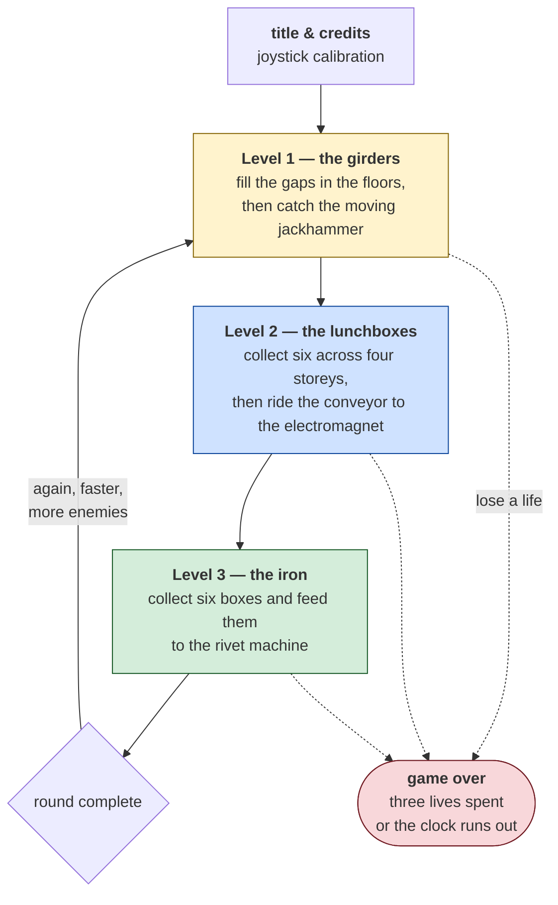

# Hard Hat Mack — the game

*Document one of four. [02-architecture.md](02-architecture.md) is how the
program is built; [03-the-code.md](03-the-code.md) is what its routines do;
[04-porting.md](04-porting.md) is what it would take to rebuild it.*

Two kinds of fact are kept apart here on purpose:

- **From the binary.** Text, tables and code read out of `HHM.COM`. Checkable —
  you can look at the same bytes.
- **From published sources.** History and reception, linked at the
  [bottom](#sources).

---

## What it is

**Hard Hat Mack**, designed by **Michael Abbot** and **Matthew Alexander**,
published by **Electronic Arts** in October 1983. Electronic Arts calls it
"truly EA's first game" — it was in the company's opening batch of five.

### The IBM version had different authors, and the program says so

The title screen was recovered by running the program under emulation, and it
credits people the histories of this game rarely mention:

```
              HARD HAT MACK

  IBM VERSION BY DANA HOW & KEVIN GILMORE,
       THROUGH TMQ SOFTWARE, INC.

      AN ORIGINAL GAME DESIGN BY
  MICHAEL ABBOT & MATTHEW ALEXANDER.

     VANDAL        MACK        OSHA

  ElectronicArts   (C)1984 THE DUPLICATORS
```

Abbot and Alexander designed the game, on the Apple II, in 1983. The IBM PC
version is **Dana How and Kevin Gilmore's**, through **TMQ Software**, and it is
dated **1984**.

That is worth more than a credit line. This document's companion shows that the
IBM code was
[mechanically translated from 6502](03-the-code.md#5-the-instruction-that-should-not-be-there) —
391 `cmc` instructions that exist only to reconcile two processors that
disagree about the carry flag. A separate contract house converting someone
else's Apple II game is exactly the situation in which a translator gets
written rather than a rewrite attempted. The screen and the instruction counts
tell the same story from different ends.

The screen also names the three characters — **VANDAL, MACK, OSHA** — and shows
each one's sprite beside its name.

You are a construction worker on an unfinished building. You run along girders,
climb ladders, ride conveyor belts and elevators, bounce off springboards, and
try to finish the job before the clock runs out. Two things want to stop you: a
**vandal**, and an inspector from **OSHA**, the American workplace-safety
agency.

All three names are in the file, in one row of the credits screen at file
offset `0x1F02`:

```
VANDAL         MACK         OSHA
```

The copy examined here is `HHM.COM`, **42,112 bytes** — two and a half times
the size of [ParaTrooper](../../paratrooper/), and a much more ambitious
program.

## Who actually wrote this version

The credits are unusually complete, and they matter for everything in the other
two documents:

```
0x1E78  IBM VERSION BY DANA HOW & KEVIN GILMORE,
0x1EA3  THROUGH TMQ SOFTWARE, INC.
0x1EC0  ORIGINAL GAME DESIGN BY
0x1EDD  MICHAEL ABBOT & MATTHEW ALEXANDER.
0x1F26  (C)1984 THE DUPLICATORS
```

The game was designed for the **Apple II**, whose processor is a 6502. The IBM
PC has an 8088 — a completely different instruction set. Somebody had to move
it across, and that somebody was a contract house.

**The binary shows how they did it, and it is the most interesting thing about
this program.** The conversion was not a rewrite. It was a *mechanical
translation* of the 6502 source, and the evidence is 391 instructions that do
nothing. That is traced in
[03-the-code.md](03-the-code.md#5-the-instruction-that-should-not-be-there).

## Two dedications

Also in the file, at `0x1F40` and `0x1F9D`:

> **MICHAEL'S DEDICATION**
> DEDICATED TO MY GRANDPARENTS
> MYMY AND JIMDAD

> **MATTHEW'S DEDICATION**
> TO BIG AL:
> MAY THE OSHA NEVER DARKEN YOUR DOORWAY

The second one turned out to be prophetic. See
[the controversy](#a-state-senator-objected).

---

## The three levels

**What this diagram shows:** the whole game. Three levels, each with its own
task, and then it starts again — faster, with more enemies.



**How to read it.** There is no ending. Finish level three and you start again
at level one, faster and with more on screen — the standard arcade structure of
the period. "Winning" means a high score.

The dotted lines are what actually happens most of the time. You have **three
lives** and a **clock**, and the clock is as dangerous as the enemies.

### Hazards

| | |
|---|---|
| **The vandal** | roams the site and undoes your work |
| **The OSHA inspector** | patrols; contact costs a life |
| **Falling bolts** | drop from above on level one |
| **A portable toilet** | a hazard on level three — the game has a sense of humour |
| **The clock** | the constant pressure behind all of it |

### The HUD

One string at `0x1DF0` holds the whole display, with zeros where the numbers go:

```
BONUS:00000  SCORE:00000  HI-SCORE:00000
```

**BONUS** is the clock — it counts down while you work and what remains is
added to your score. Finishing fast is worth more than finishing safely, which
is the tension the game is built on.

---

## How to win

There is no winning, in the sense of an ending. Finish level three and level one
comes back, faster and with more enemies. What you are playing for is the score,
and the score is almost entirely the bonus clock.

### The clock is the game

| | |
|---|---|
| Bonus at the start of a level | **5,000** |
| How it falls | 100 at a time, every few seconds |
| After each complete round of three levels | the starting maximum drops by 1,000 |
| Extra life | one, at **7,000 points** — and only ever one |
| Lives | three |

The binary agrees with the published figures: run the game under emulation and
the HUD reads `BONUS:05000` on entry, ticking down through `04800`, `04600`
while you watch. That is the one number in this document you can check yourself
in thirty seconds.

**Read the second row again.** The starting bonus shrinks each time round. So
the same level, played identically, is worth less on the second lap and less
again on the third — the game does not get harder only by adding enemies, it
gets harder by paying less. A late round is a test of survival, not of scoring,
and the score you will actually finish on is mostly decided in the first two or
three rounds.

**And the third row.** One extra life, at 7,000, ever. There is no second. That
makes the early game the only place where risk is cheap: before 7,000 a death
may still be recovered, after it every death is permanent progress lost.

### What each level asks

| Level | The task | The part that kills you |
|---|---|---|
| **1 — the girders** | fill four gaps in the floors, then catch the moving jackhammer to rivet the plates down | the jackhammer moves; falling bolts drop from above |
| **2 — the lunchboxes** | collect six across four storeys, then ride the conveyor up so the electromagnet lifts you clear | an enemy blocks the last hurdle and has to be jumped past on timing; below the conveyor is an incinerator |
| **3 — the iron** | collect six boxes and drop each into the rivet processor | the diagonal conveyor, the springboards, and a fall with no trampoline under it |

### Tips that actually move your score

- **Plan the route before you move, not while you move.** The bonus falls on a
  clock, not on your input, so standing still to think costs exactly what moving
  in the wrong direction costs. Thinking first is free by comparison.
- **On level one, look at where the jackhammer is before you fill the last
  gap.** Filling gaps is safe and the jackhammer is not; finishing the safe part
  while the dangerous part is at the far end of its path wastes the clock you
  will need to chase it.
- **On level two, collect toward the conveyor, not away from it.** The exit is
  the electromagnet at the top; a route that ends beside it turns the escape into
  a step rather than a journey.
- **Jumps here are pixel-exact and the graphics are not.** Contemporary reviews
  complained about precisely this, and it is a fair complaint on CGA. Land on
  the middle of a girder rather than its edge; the sprite is more forgiving than
  the pixels suggest.
- **Do not fight the enemies — they cannot be killed.** The vandal undoes your
  work and the inspector costs a life on contact. Both are obstacles to be timed
  past, and time spent waiting for a safe gap is often cheaper than the life.
- **The clock is more dangerous than either of them.** Most runs end with the
  bonus at zero rather than with a life lost.

---

## Controls

The game supports a joystick, and the first thing it does after loading is
calibrate it. The prompts are at `0x0823`:

```
Put the stick in the upper left
  and then press the space bar
  Put the stick in the center
Put the stick in the lower right
```

**This tells you something about 1983 hardware.** An analogue PC joystick had no
fixed range — the values it returned depended on the individual stick, and even
on temperature. Software could not assume anything, so it asked you to hold the
stick at three known positions and measured what came back. Modern controllers
report a normalised range and this whole ritual is gone.

The keyboard is handled by the program itself rather than by the operating
system, through a translation table of 68 keys. Why it does that, and what it
costs, is in
[02-architecture.md](02-architecture.md#it-takes-over-the-keyboard).

---

## A state senator objected

The best story about this game is not in the binary.

OSHA is the US Occupational Safety and Health Administration — the agency that
inspects building sites for hazards. Making its inspector one of the two
villains was a joke about paperwork getting in the way of work.

California state senator **Dan McCorquodale** did not find it funny. He wrote to
complain that the game was **"anti-worker"**, and an Emporium-Capwell store in
Santa Clara pulled it from the shelves.

Which makes Matthew Alexander's dedication — *MAY THE OSHA NEVER DARKEN YOUR
DOORWAY*, sitting in the file since 1984 — read rather differently in hindsight.

---

## How it was received

Genuinely mixed, and the disagreement is interesting.

*Video* magazine called it "a 'must' buy" and "one of the finest programs ever
made for the Apple". *Softline* praised the animation against comparable games.
*Computer Gaming World* called it "a brand new concept in arcade action".

*PC Magazine* was not convinced: **10.5 out of 18**, and the verdict "computer
game pop art — flashy to the eye, but hollow inside."

That is worth noting for a reason beyond gossip. PC Magazine gave
[ParaTrooper](../../paratrooper/docs/01-the-game.md#how-it-was-received) 10 out
of 18 — almost the same score, in the same magazine, to a game a quarter the
size and a year older. Contemporary reviews are evidence about contemporary
taste, not a measurement of the program.

In 1996 *Next Generation* ranked Hard Hat Mack **#92 in its Top 100 Games of All
Time**. Thirteen years is enough for opinion to move a long way.

---

## What the machine had to be

Read from the hardware the program touches:

| | |
|---|---|
| CPU | 8088, real mode |
| Video | CGA, mode 4 — 320×200, four colours |
| Memory | ~42 KB, of which a third is sprite artwork carried inside the file |
| Sound | PC speaker, one square wave |
| Input | **its own keyboard interrupt handler**, and an analogue joystick on port `0x201` |
| Storage | none — it never opens a file |
| DOS | **none at all** |

Like ParaTrooper, this program never calls DOS. Published sources describe the
1984 IBM release as a **self-booting disk** — you put the floppy in and turned
the machine on, and the game *was* the operating system. The `.COM` examined
here is a later conversion for people running DOS, and it kept that character
completely.

Unlike ParaTrooper, it **installs its own interrupt handler**, which changes how
the whole program has to be read. That is the subject of the next document.

---

## Provenance

`HHM.COM`, 42,112 bytes, SHA-256
`FD70BAB8A1099A01A7696A236957F816CC54DE3F0D28C8707F7CADDF60D22737`.

Hard Hat Mack is © 1983–84 Electronic Arts. Nothing in this repository
redistributes it.

## Sources

- [Hard Hat Mack — Wikipedia](https://en.wikipedia.org/wiki/Hard_Hat_Mack)
- [Hard Hat Mack — MobyGames](https://www.mobygames.com/game/577/hard-hat-mack/)
- [Hard Hat Mack — C64-Wiki](https://www.c64-wiki.com/wiki/Hard_Hat_Mack)
- [Hard Hat Mack — Apple2Games](https://apple2games.com/wiki/Hard_Hat_Mack)
- [Hard Hat Mack (woz-a-day collection) — Internet Archive](https://archive.org/details/wozaday_Hard_Hat_Mack)
- [Hard Hat Mack FAQ, Apple II, by ASchultz — GameFAQs](https://gamefaqs.gamespot.com/appleii/579172-hard-hat-mack/faqs/8818) — the scoring figures
- [Hard Hat Mack command summary (Commodore 64) — Museum of Computer Adventure Game History](https://www.mocagh.org/ea/hhmack-refcard.pdf)

The scoring figures above come from the published sources and were checked
against the binary where the binary can answer: the starting bonus of 5,000
appears on the HUD the moment a level is built, and counts down while the game
runs under emulation. The point values for individual actions are *not* in this
document, because no source states them and nothing in the program has been
traced to them yet.
