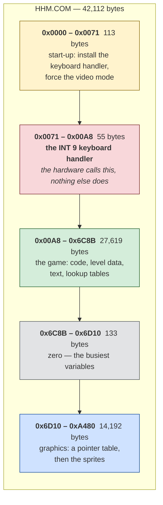
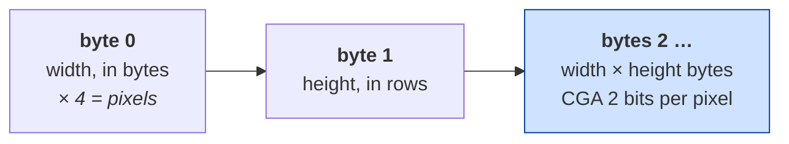
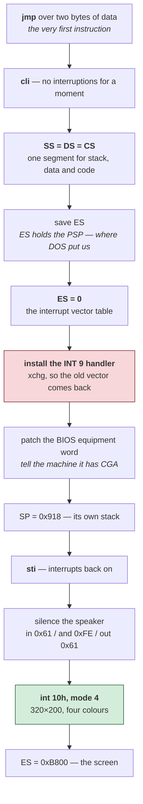

# Hard Hat Mack — architecture

*Document two of three. [01-the-game.md](01-the-game.md) is what the game is;
[03-the-code.md](03-the-code.md) walks through the routines.*

**You do not need to know assembly to read this.** If it is new, the
[five ideas](../../paratrooper/docs/02-architecture.md#five-ideas-if-assembly-is-new-to-you)
at the start of ParaTrooper's architecture document cover everything assumed
here — what a register is, why addresses have two parts, why there is no
operating system helping.

Facts here were read from the binary. Anything reasoned rather than observed is
marked **[inferred]**, and [what is still unknown](#what-is-still-unknown) is
listed at the end.

---

## Shape of the file

42,112 bytes. **What this diagram shows:** the four regions it actually
contains, top to bottom, with positions in the file down the left.



**How to read it.** The red band is the surprise. It is 55 bytes of code that
**nothing in the program ever calls** — it is reached only when you press a key,
because the keyboard hardware jumps to it directly. More on that
[below](#it-takes-over-the-keyboard).

The grey sliver is small but busy: 133 bytes of zeros holding the variables the
code touches most. `[0x6D9B]` alone appears 144 times, `[0x6D9C]` 140 times.
Zeros in a file mean "not initialised yet", which is exactly what a variable
looks like before the program runs.

The blue band is a third of the whole file and it is **artwork**. Two things
identify it without decoding anything:

- It opens with a table of 16-bit values climbing by a constant 66 —
  `0x776F, 0x77B1, 0x77F3, 0x7835…` — the shape of a pointer table into
  fixed-size records.
- Its commonest byte values are `0xAA`, `0x55`, `0xFF`, `0xF0`, `0xC0`. In CGA's
  two-bits-per-pixel format those are *four pixels of colour 2*, *four of colour
  1*, *four of colour 3*, and *two-and-two*. Solid runs of one colour are what
  sprite data is mostly made of.

**A caution, because this document got it wrong first.** The region was
originally described here as zero-filled working memory, on the strength of the
first sixteen bytes being zeros and the disassembler declining to read it as
code. Measuring it says otherwise: 42.5% zeros, 8,236 non-zero bytes. *Not
being code* and *being empty* are different claims, and only one of them had
been checked.

### The sprite format, decoded

The pointer table's stride of 66 was the way in. Sixty-six is an awkward number
until you look at the bytes it points at:

```
0x766F:  04 10 | 00 00 00 00  00 00 00 00  00 00 00 00 ...
         ^^ ^^
         |  height: 16 rows
         width: 4 bytes = 16 pixels
```

4 × 16 = 64 pixels bytes, plus the two header bytes, is exactly 66. The stride
is not a fixed record size at all — **each sprite carries its own dimensions**,
and the pointer table's steps vary because the sprites do. The 34-byte steps
seen elsewhere are 4 × 8 sprites.

So the format is:



**And they are stored bottom row first.** Not mirrored — that was this
document's first answer and it was wrong. The blitter says so plainly: it walks
*down* the scanline address table (`dec bp / dec bp`) while reading the sprite
*forwards*, so the first bytes of a sprite land on its lowest row. Reading it
top-first therefore turns every sprite upside down.

The Electronic Arts logo settled it. Rendered as stored it is unreadable;
flipped **vertically** it reads correctly. It was first called *horizontally
mirrored* here because at that size a vertically flipped E-L-C-T-O-I-A-R-S is
symmetric enough to seem to read backwards — a guess that four renders would
have caught and one did not.

**If a sprite sheet contains text anywhere, orient it by the text.** Text has
exactly one correct orientation; shapes have four that all look plausible.

`tools/gfxdump.py` in the toolkit renders any of this to a PNG without running
the program, which is how the format was confirmed: decode, look, and see
whether shapes or noise come out.

---

## Start-up, in order

Everything the program does before the game begins, in nineteen instructions:



**Three of these are worth stopping on.**

**`SS = DS = CS`** — stack, data and code all in one segment. This is the tiny
memory model: everything the program has fits in 64 KB and it never has to
think about segments again. The whole rest of the program can treat memory as a
flat 64 KB array, which is why it is so much easier to read than it might be.

**Patching the BIOS equipment word.** The BIOS keeps a description of the
machine at address `0x410`, and this program *edits* it:

```nasm
    and byte [es:0x410], 0xcf     ; clear the two video bits
    or  byte [es:0x410], 0x20     ; set them to "colour, 80 columns"
```

It does not ask what video card is installed — it declares one. ParaTrooper
[checked politely and refused to run](../../paratrooper/docs/01-the-game.md#it-demands-a-colour-monitor-and-asks-politely)
on the wrong hardware; this one simply overwrites the operating system's own
notion of reality and carries on. Both were normal. Reaching into the BIOS's
private data would end a code review today.

**Its own stack.** `mov sp, 0x918` puts the stack at a fixed address the
program chose, rather than using whatever DOS provided. It is taking over the
machine.

---

## It takes over the keyboard

This is the largest structural difference from ParaTrooper, and it changes how
the program must be read.

### What an interrupt handler is

Normally your program asks for input: *is there a key waiting?* The BIOS
answers. You are in control, and you look when it suits you.

An **interrupt handler** inverts that. You register a routine with the
hardware, and when a key is pressed the processor **stops whatever it is doing**
— mid-loop, mid-calculation, anywhere — jumps to your routine, and resumes
afterwards as though nothing happened.


### How it installs itself

The vector table sits at address 0 — 256 slots of four bytes, one per interrupt
number. Slot 9 is the keyboard. So:

```nasm
    xor ax, ax
    mov es, ax                  ; ES -> address 0, the vector table
    lea ax, [0x171]             ; our handler's offset
    mov bx, cs                  ;   and its segment
    xchg word [es:0x24], ax     ; 0x24 / 4 = 9. Swap ours in...
    xchg word [es:0x26], bx     ;   ...and the old one out
    mov word [0x782], ax        ; keep the old vector,
    mov word [0x784], bx        ;   so it can be put back on exit
```

`xchg` rather than `mov` is the neat part: one instruction installs the new
handler *and* retrieves the old one, which the program stores and restores when
it quits.

### Why this matters for reading the program

**A handler is unreachable by any branch.** Nothing calls it. Nothing jumps to
it. A disassembler that follows the program's own control flow — which is how
they all work — will walk straight past those 55 bytes and record them as data.

That is a real hole in the method, and it was found by this game: the
reconstruction tool recovered the handler, but by a *heuristic* that happened to
work, not because it understood what it was looking at. It now reads the
install and reports it:

```
interrupts  : INT 09h -> file 0x00071
```

**INT 9 is the only vector it touches.** There are exactly four writes into the
table in the whole program: two to install (`xchg`, at start-up) and two to
restore (`mov`, on the way out), all to slots `0x24` and `0x26` — vector 9. No
timer handler, no anything else. That is now checked rather than assumed.

Which leaves the question of what paces the game. It is answered
[below](#timing-it-counts).

---

## Video

**CGA mode 4: 320×200, four colours.** Set with the BIOS, and then the BIOS is
finished with:

```nasm
    mov ax, 4
    int 0x10            ; AH=0 set mode, AL=4
    mov ax, 0xb800
    mov es, ax          ; ES -> the screen, permanently
```

The whole program calls `int 10h` exactly **four times**: twice to set mode 4,
twice to set mode 3 (text) when handing the machine back. Every pixel of the
game is written straight into the memory at `0xB800`, which on a CGA card *is*
the display.

The two-bank interleave that makes CGA awkward — even scanlines at offset 0,
odd ones 8 KB later — is
[explained in ParaTrooper's document](../../paratrooper/docs/02-architecture.md#the-interleave)
and applies identically here.

---

## Timing: it counts

ParaTrooper waited on the BIOS clock, so it runs at the same speed on any
machine. Hard Hat Mack does not. It has no timer handler, never reads the BIOS
tick, and never watches the video retrace. What it has is this, at file
`0x00DF`:

```nasm
delay:
    push ax
.inner:
    dec al
    jne .inner          ; count AL down to zero
    pop ax
    dec al
    jne delay           ; ...and do that AL times over
    ret
```

Two nested loops that touch no memory, no port and no clock. They burn
processor cycles and nothing else. `AL` on entry sets the length, and the 21
call sites pass 20, 32, 40, 48, 80, 96, 128, 144, 160 and 255 — a menu of
pauses.

**This is the technique ParaTrooper deliberately avoided**, and it means Hard
Hat Mack's speed is the *processor's* speed. On the 4.77 MHz 8088 it was
written for, `dec al / jne` costs about 19 cycles a pass, so `AL = 255` is
roughly a quarter of a second. On anything faster the whole game speeds up in
proportion — which is exactly why so many games of this era became unplayable
within a few years.

**[inferred]** It fits the [provenance](03-the-code.md#5-the-instruction-that-should-not-be-there).
A translation from 6502 code inherits the original's structure, and the Apple II
had no equivalent of the PC's BIOS tick to lean on. Counting cycles is what the
source being translated would have done.

## Sound

The PC speaker, through the same two ports every program of the era used:

```nasm
    in  al, 0x61
    and al, 0xfe        ; clear bit 0 — disconnect the timer, silence
    out 0x61, al
```

Bit 0 of port `0x61` gates the timer's output to the speaker; bit 1 connects
the speaker at all. Toggling them directly, without the timer, produces sound
by moving the cone by hand — cruder than ParaTrooper's tone generation, and
capable of noises a square wave cannot make.

**[inferred]** Only nine writes to port `0x61` appear, and one to the timer
control port `0x43`. That is very little for a game with this much going on, so
the sound is probably driven from a routine reached by a computed path this
analysis did not follow.

---

## The shape of the code

Here the difference from ParaTrooper is stark:

| | ParaTrooper (1982) | Hard Hat Mack (1983) |
|---|---|---|
| File size | 16,400 bytes | 42,112 bytes |
| Instructions recovered | 2,017 | **9,086** |
| Subroutines | 19 | **222** |
| Call sites | 38 | **568** |
| `ret` instructions | 36 | **404** |
| Distinct variables | 47 | **405** |
| Interrupt handlers | none | one |

**This is a different kind of program.** ParaTrooper is a single flat loop with
a handful of helpers. Hard Hat Mack is decomposed into 222 named things, the
busiest called 52 times from all over the program. That is recognisably modern
structure — you could describe its call graph to someone today and they would
know what you meant.

The instruction mix says the same:

```
mov  3696    jmp 793    dec 704    inc 665
call  570    ret 403    cmc 391    cmp 307
```

`call` and `ret` together are over 10% of the program. In ParaTrooper they were
under 4%.

### And one number that should not be there

`cmc` — *complement carry flag* — appears **391 times**. It is a rare
instruction; most programs contain none.

It is not a mistake, and it is not data being misread. It is the fingerprint of
how this version was made, and it is worth its own section in
[03-the-code.md](03-the-code.md#5-the-instruction-that-should-not-be-there).

---

## The data, accounted for

19,628 bytes — 46.7% of the file — did not come back as instructions. That is
not the same as unexplained. Here is what all of it is:

| Where | Size | What it is | Confidence |
|---|---|---|---|
| `0x6D10` | 836 | pointer table into the sprites | **proven** — its arithmetic matches the sprite headers |
| `0x766F`–`0xA480` | 14,192 | the sprites themselves | **proven** — they render |
| `0x042D` | 404 | **CGA scanline address table** | **proven** — 202 entries, exactly `(row&1)*0x2000 + (row>>1)*80` |
| `0x05C1` | ~800 | further screen tables, bank ends | inferred from the values |
| `0x251A` | 1,171 | bit masks — 1, 2, 4, 8, 16 dominate | inferred; that is what pixel plotting needs |
| `0x4795` | 162 | **a trajectory table** | inferred: differences 41, 43, 46, 49, 51, 55…, second differences ≈ 3, which is constant acceleration |
| `0x1DEE` | 506 | the HUD and credits text | **proven** — you can read it |
| `0x6376` | 278 | the configuration screen text | **proven** |
| `0x2F36` | 565 | repeating pattern data | not identified |
| `0x6C8B` | 133 | the variable block | **proven** — the busiest addresses point here |
| rest | ~600 | small runs, mixed | not identified |

The **scanline table** is worth a moment. Rather than compute a row's address
every time it draws, the game looks it up — 404 bytes spent to avoid a shift,
an AND and a multiply on every single blit. Trading memory for arithmetic is
the oldest optimisation there is.

## The level layout, decoded

The playfield is a grid, and three tables in the file describe it. The loop
that reads them is at file `0x1951`:

```nasm
    mov cl, 4
    mov [0x6dc9], cl        ; outer counter: five floors, counting down
.floor:
    mov bl, 0xd
    mov [0x6dc8], bl        ; inner counter: fourteen columns, counting down
    mov cl, [0x6dc9]
    mov si, cx
    mov al, [si + 0x15b9]   ; <- the scanline of this floor
    call draw_cell
```

and the per-cell draw at `0x198F`:

```nasm
    mov [0x6d9c], al        ; row
    mov al, [bx + 0x15bf]   ; <- the column of this cell
    mov [0x6d9b], al
    mov word [0x6d97], 0x1b00
    add al, [bx + 0x71ea]   ; <- which girder variant goes here
    ...
    call draw
```

| Table | File | Contents |
|---|---|---|
| floor heights | `0x14B9` | 47, 79, 111, 143, 175 — five floors, 32 scanlines apart |
| column positions | `0x14BF` | 4, 6, 8 … 30 — fourteen cells, and the blitter's `mul 7` turns a cell into pixels |
| the map itself | `0x70EA` | 70 bytes, one per cell, each 0–4 |

A cell's value picks the sprite: the code builds `0x1B00 + value`, and the
lookup at `0x30A` does `add bl, bh` before indexing — so **sprite index =
27 + value**. Indices 27 to 34 in the pointer table are girder segments:
plain, riveted, holed, and broken-ended.

Reading the 70 bytes as five rows of fourteen produces five distinct floors
with joins and gaps in different places. Reading them as one row of fourteen
repeated produces five identical floors. The first is obviously right, and
that is how the ambiguity in the code — whether `BX` spans the whole table or
restarts each row — was settled: by drawing it.

`recovered/screen-playfield.png` is the result, with nothing placed by hand.

### The build sequence

The girders are one step of a longer list. The routine at file `0x1763` builds
a whole screen by calling eighteen others in order, each drawing one kind of
thing:

```nasm
    call 0x1a51      ; girders   -- five floors x fourteen columns
    call 0x1ac9      ; ladders   -- sprite 58
    call 0x1b23      ; footings  -- sprite 0, along the bottom
    call 0x5950
    call 0x36e5
    ...
    call 0x20e8      ; the text routine
    ...
```

Three of those are now decoded end to end, and every position in
`recovered/screen-playfield.png` comes from them:

| Step | Draws | Rows | Columns | Sprite |
|---|---|---|---|---|
| `0x176F` | girder floors | `0x14B9` — 47, 79, 111, 143, 175 | `0x14BF` — 4, 6 … 30 | 27 + map value from `0x70EA` |
| `0x1772` | ladders | `0x14CD` — 71, 103, 135, 167 | `0x14D1`, `0x14D2` — 8 and 26 | 58 |
| `0x1775` | footings | `0x14D3` — 191 | `0x14D4` — 6, 14, 20, 28 | 0 |

**A row is a scanline counted from the top**, and the sprite's *bottom* edge
sits on it — because the blitter indexes the scanline table with the row and
then steps upward (`dec bp / dec bp`) as it draws. Getting that backwards puts
the whole building upside down and pushes the footings off the top of the
screen, which is how it was caught.

The rest are now traced too. Five place a single sprite at a constant
position, written straight into the code:

| Step | Sprite | Column | Row |
|---|---|---|---|
| `0x177E` | 70 | 8 | 0x12 |
| `0x178D` | 3 — ladder pieces | `0x2B05`, 0xFF-terminated | `0x2B0A` |
| `0x17B4` | 21 — machine | 0x26 | 0x2A |
| `0x17BA` | 19 — ramp | 1 | 0xBC |
| `0x17BD` | 12 — hoist | 0x23 | 0xBC |

and one draws the Electronic Arts logo, sprite 93. So what this sequence
builds is the **title screen** — the credits, over the playfield.

### The font

Text is drawn by a routine of its own at file `0x013E`, and it does not use the
sprite table:

```nasm
    and ax, 0x3f              ; the character, masked to six bits
    mov si, ax
    shl si, 1
    mov si, word [si + 0x726f] ; a font pointer table, 64 entries
```

So the glyph index is `character AND 0x3F` — `A` is 1, `Z` is 26, `0` is 48 —
into a **separate** pointer table at file `0x716F`. Looking for the letters in
the sprite table was the obvious guess and it is why they were not found
earlier.

The font is stored **top row first**, the ordinary way round, unlike the
sprites. That is not an inconsistency: the character drawer is a different
routine with its own loop, so it has its own convention. Rendering the text
with the sprites' convention turns every letter upside down, which is how it
was caught.

`recovered/screen-title.png` is the whole screen: 285 sprites, every identity
and position read from the file.

### Three screens, not one

`[0x594F]` is the screen number, and it is written in exactly three places.
Each is the head of a build sequence:

| Builder | Sets `[0x594F]` | |
|---|---|---|
| file `0x14D8` | 1 | **Level 1** |
| file `0x1763` | 2 | **Level 2** |
| file `0x1627` | 3 | **Level 3** |

So the screen reconstructed above is not a title screen at all — it is
**Level 2**. The credits are drawn over the playfield, which was normal for the
period, and mistaking one for the other cost a round of analysis.

Levels 1 and 3 build their floors differently. Level 2 uses the grid loop with
the 70-byte map; the others place girder runs by explicit calls, and choose the
girder variant per level:

```nasm
    mov bl, byte [0x2aac]        ; the level number
    mov al, byte [bx + 0x71e8]   ; a variant per level
    add ax, 0x2800               ; + the sprite base, 40
    mov word [0x6d97], ax
```

`tools/placements.py` in the toolkit recovers placements from these sequences
without executing anything. It recognises the idioms rather than interpreting
the code, and reports what it cannot parse instead of skipping it — a screen
quietly missing a girder looks perfectly fine and is wrong.

Current coverage, and it is uneven:

| | sprites placed | sites not parsed |
|---|---|---|
| Level 1 | 228 | 9 |
| **Level 2** | **291 — complete** | 8 |
| Level 3 | 220 | 7 |

## What is still unknown

Three things, stated plainly:

- **Levels 1 and 3 are partial.** Their floors are placed by loops whose sprite
  choice depends on a variable the *builder* writes — and `placements.py` reads
  that variable's initial value from the file instead, so it picks the wrong
  variant and misses the rest. Closing it means tracking writes to variables
  across routine boundaries, which is a step from pattern-matching towards
  interpretation, and a decision to take deliberately rather than by drift.
- **The 405 variables.** None are named. Doing that honestly means watching
  every routine that touches each one, and with 222 subroutines that is a
  project of its own rather than a gap in this one.
- **The two bytes at file `0x0001`.** The program's first instruction jumps
  over `FF FC`, and **nothing in the program ever reads them** — checked, zero
  references to addresses `0x100`–`0x103`. What they meant is not recoverable
  from this file; it would take the loader or the build tool that put them
  there.

None of this affects the reconstruction. `recovered/hhm.asm` rebuilds the file
byte for byte regardless of how much of it is *understood* — the correctness of
the rebuild and the completeness of the reading are two different things, and
only the first is finished.
