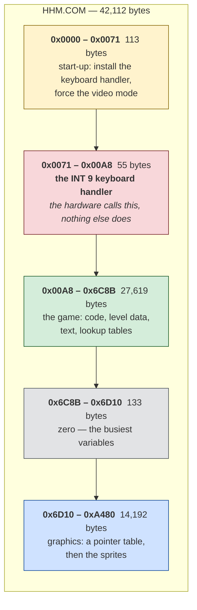
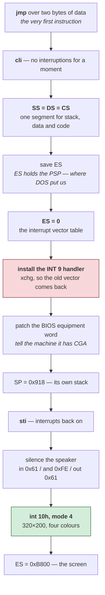

# Hard Hat Mack — architecture

*Document two of three. [01-the-game.md](01-the-game.md) is what the game is;
[03-the-code.md](03-the-code.md) walks through the routines.*

**You do not need to know assembly to read this.** If it is new, the
[five ideas](../../paratrooper/docs/02-architecture.md#five-ideas-if-assembly-is-new-to-you)
at the start of ParaTrooper's architecture document cover everything assumed
here — what a register is, why addresses have two parts, why there is no
operating system helping.

Facts here were read from the binary. Anything reasoned rather than observed is
marked **[inferred]**, and [what is still unknown](#what-is-still-unknown) is
listed at the end.

---

## Shape of the file

42,112 bytes. **What this diagram shows:** the four regions it actually
contains, top to bottom, with positions in the file down the left.



**How to read it.** The red band is the surprise. It is 55 bytes of code that
**nothing in the program ever calls** — it is reached only when you press a key,
because the keyboard hardware jumps to it directly. More on that
[below](#it-takes-over-the-keyboard).

The grey sliver is small but busy: 133 bytes of zeros holding the variables the
code touches most. `[0x6D9B]` alone appears 144 times, `[0x6D9C]` 140 times.
Zeros in a file mean "not initialised yet", which is exactly what a variable
looks like before the program runs.

The blue band is a third of the whole file and it is **artwork**. Two things
identify it without decoding anything:

- It opens with a table of 16-bit values climbing by a constant 66 —
  `0x776F, 0x77B1, 0x77F3, 0x7835…` — the shape of a pointer table into
  fixed-size records.
- Its commonest byte values are `0xAA`, `0x55`, `0xFF`, `0xF0`, `0xC0`. In CGA's
  two-bits-per-pixel format those are *four pixels of colour 2*, *four of colour
  1*, *four of colour 3*, and *two-and-two*. Solid runs of one colour are what
  sprite data is mostly made of.

**A caution, because this document got it wrong first.** The region was
originally described here as zero-filled working memory, on the strength of the
first sixteen bytes being zeros and the disassembler declining to read it as
code. Measuring it says otherwise: 42.5% zeros, 8,236 non-zero bytes. *Not
being code* and *being empty* are different claims, and only one of them had
been checked.

---

## Start-up, in order

Everything the program does before the game begins, in nineteen instructions:



**Three of these are worth stopping on.**

**`SS = DS = CS`** — stack, data and code all in one segment. This is the tiny
memory model: everything the program has fits in 64 KB and it never has to
think about segments again. The whole rest of the program can treat memory as a
flat 64 KB array, which is why it is so much easier to read than it might be.

**Patching the BIOS equipment word.** The BIOS keeps a description of the
machine at address `0x410`, and this program *edits* it:

```nasm
    and byte [es:0x410], 0xcf     ; clear the two video bits
    or  byte [es:0x410], 0x20     ; set them to "colour, 80 columns"
```

It does not ask what video card is installed — it declares one. ParaTrooper
[checked politely and refused to run](../../paratrooper/docs/01-the-game.md#it-demands-a-colour-monitor-and-asks-politely)
on the wrong hardware; this one simply overwrites the operating system's own
notion of reality and carries on. Both were normal. Reaching into the BIOS's
private data would end a code review today.

**Its own stack.** `mov sp, 0x918` puts the stack at a fixed address the
program chose, rather than using whatever DOS provided. It is taking over the
machine.

---

## It takes over the keyboard

This is the largest structural difference from ParaTrooper, and it changes how
the program must be read.

### What an interrupt handler is

Normally your program asks for input: *is there a key waiting?* The BIOS
answers. You are in control, and you look when it suits you.

An **interrupt handler** inverts that. You register a routine with the
hardware, and when a key is pressed the processor **stops whatever it is doing**
— mid-loop, mid-calculation, anywhere — jumps to your routine, and resumes
afterwards as though nothing happened.


### How it installs itself

The vector table sits at address 0 — 256 slots of four bytes, one per interrupt
number. Slot 9 is the keyboard. So:

```nasm
    xor ax, ax
    mov es, ax                  ; ES -> address 0, the vector table
    lea ax, [0x171]             ; our handler's offset
    mov bx, cs                  ;   and its segment
    xchg word [es:0x24], ax     ; 0x24 / 4 = 9. Swap ours in...
    xchg word [es:0x26], bx     ;   ...and the old one out
    mov word [0x782], ax        ; keep the old vector,
    mov word [0x784], bx        ;   so it can be put back on exit
```

`xchg` rather than `mov` is the neat part: one instruction installs the new
handler *and* retrieves the old one, which the program stores and restores when
it quits.

### Why this matters for reading the program

**A handler is unreachable by any branch.** Nothing calls it. Nothing jumps to
it. A disassembler that follows the program's own control flow — which is how
they all work — will walk straight past those 55 bytes and record them as data.

That is a real hole in the method, and it was found by this game: the
reconstruction tool recovered the handler, but by a *heuristic* that happened to
work, not because it understood what it was looking at. It now reads the
install and reports it:

```
interrupts  : INT 09h -> file 0x00071
```

**[inferred]** Only INT 9 is installed. No timer handler (INT 8) is written,
which raises the question of where the game's pacing comes from — see
[what is still unknown](#what-is-still-unknown).

---

## Video

**CGA mode 4: 320×200, four colours.** Set with the BIOS, and then the BIOS is
finished with:

```nasm
    mov ax, 4
    int 0x10            ; AH=0 set mode, AL=4
    mov ax, 0xb800
    mov es, ax          ; ES -> the screen, permanently
```

The whole program calls `int 10h` exactly **four times**: twice to set mode 4,
twice to set mode 3 (text) when handing the machine back. Every pixel of the
game is written straight into the memory at `0xB800`, which on a CGA card *is*
the display.

The two-bank interleave that makes CGA awkward — even scanlines at offset 0,
odd ones 8 KB later — is
[explained in ParaTrooper's document](../../paratrooper/docs/02-architecture.md#the-interleave)
and applies identically here.

---

## Sound

The PC speaker, through the same two ports every program of the era used:

```nasm
    in  al, 0x61
    and al, 0xfe        ; clear bit 0 — disconnect the timer, silence
    out 0x61, al
```

Bit 0 of port `0x61` gates the timer's output to the speaker; bit 1 connects
the speaker at all. Toggling them directly, without the timer, produces sound
by moving the cone by hand — cruder than ParaTrooper's tone generation, and
capable of noises a square wave cannot make.

**[inferred]** Only nine writes to port `0x61` appear, and one to the timer
control port `0x43`. That is very little for a game with this much going on, so
the sound is probably driven from a routine reached by a computed path this
analysis did not follow.

---

## The shape of the code

Here the difference from ParaTrooper is stark:

| | ParaTrooper (1982) | Hard Hat Mack (1983) |
|---|---|---|
| File size | 16,400 bytes | 42,112 bytes |
| Instructions recovered | 2,017 | **9,086** |
| Subroutines | 19 | **222** |
| Call sites | 38 | **568** |
| `ret` instructions | 36 | **404** |
| Distinct variables | 47 | **405** |
| Interrupt handlers | none | one |

**This is a different kind of program.** ParaTrooper is a single flat loop with
a handful of helpers. Hard Hat Mack is decomposed into 222 named things, the
busiest called 52 times from all over the program. That is recognisably modern
structure — you could describe its call graph to someone today and they would
know what you meant.

The instruction mix says the same:

```
mov  3696    jmp 793    dec 704    inc 665
call  570    ret 403    cmc 391    cmp 307
```

`call` and `ret` together are over 10% of the program. In ParaTrooper they were
under 4%.

### And one number that should not be there

`cmc` — *complement carry flag* — appears **391 times**. It is a rare
instruction; most programs contain none.

It is not a mistake, and it is not data being misread. It is the fingerprint of
how this version was made, and it is worth its own section in
[03-the-code.md](03-the-code.md#5-the-instruction-that-should-not-be-there).

---

## What is still unknown

Stated plainly, so this is not mistaken for a complete map:

- **Where the timing comes from.** There is no `int 1Ah` (the BIOS clock,
  which ParaTrooper used), no timer interrupt handler, and no polling of the
  video retrace register. Only one counted delay loop was found, in the exit
  path. Something paces this game and this analysis did not find it.
- **The sprite format.** As with ParaTrooper, the shapes have not been traced
  back to the routines that draw them.
- **The level data.** Three levels of girders, ladders and conveyors are
  described somewhere in the 27 KB middle region; the encoding is not decoded.
- **Most of the 405 variables.** Naming one honestly means watching every
  routine that touches it. That was done for none of them here.
- **19,628 bytes — 46.7% — did not come back as instructions.** Most of that is
  the 14 KB of graphics, which is data and should stay data. But 27 separate
  runs of 16 bytes or more, 4,660 bytes in total, sit inside the code region
  and are unaccounted for. Some of those are certainly code the walk never
  reached.
- **The sprite format.** The graphics region is identified but not decoded: the
  pointer table's stride is 66 bytes, and what those 66 bytes describe — width,
  height, mask, frames — is unknown.

None of this affects the reconstruction. `recovered/hhm.asm` rebuilds the file
byte for byte regardless of how much of it is *understood* — the correctness of
the rebuild and the completeness of the reading are two different things, and
only the first is finished.
