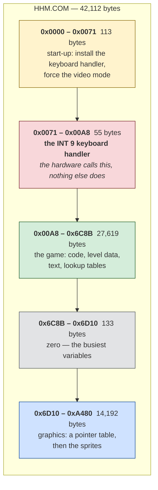
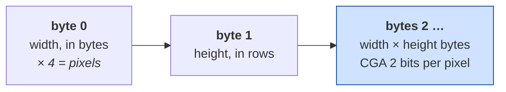
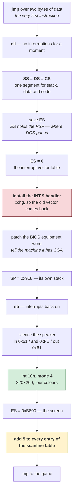
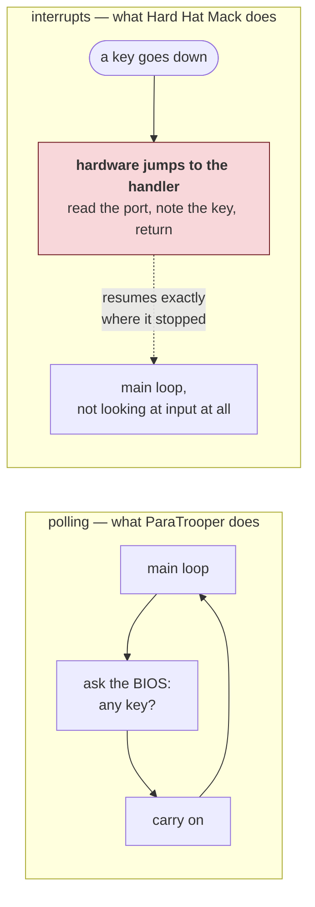
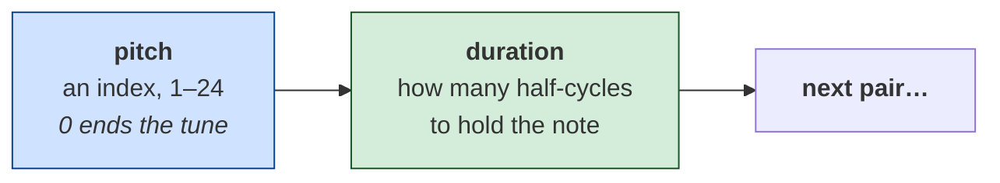
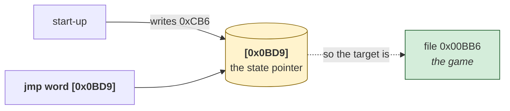
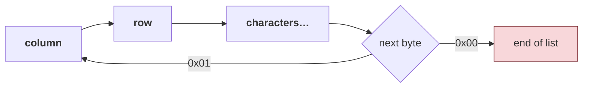

# Hard Hat Mack — architecture

*Document two of three. [01-the-game.md](01-the-game.md) is what the game is;
[03-the-code.md](03-the-code.md) walks through the routines.*

**You do not need to know assembly to read this.** If it is new, the
[five ideas](../../paratrooper/docs/02-architecture.md#five-ideas-if-assembly-is-new-to-you)
at the start of ParaTrooper's architecture document cover everything assumed
here — what a register is, why addresses have two parts, why there is no
operating system helping.

Facts here were read from the binary. Anything reasoned rather than observed is
marked **[inferred]**, and [what is still unknown](#what-is-still-unknown) is
listed at the end.

---

## Shape of the file

42,112 bytes. **What this diagram shows:** the four regions it actually
contains, top to bottom, with positions in the file down the left.



**How to read it.** The red band is the surprise. It is 55 bytes of code that
**nothing in the program ever calls** — it is reached only when you press a key,
because the keyboard hardware jumps to it directly. More on that
[below](#it-takes-over-the-keyboard).

The grey sliver is small but busy: 133 bytes of zeros holding the variables the
code touches most. `[0x6D9B]` alone appears 144 times, `[0x6D9C]` 140 times.
Zeros in a file mean "not initialised yet", which is exactly what a variable
looks like before the program runs.

The blue band is a third of the whole file and it is **artwork**. Two things
identify it without decoding anything:

- It opens with a table of 16-bit values climbing by a constant 66 —
  `0x776F, 0x77B1, 0x77F3, 0x7835…` — the shape of a pointer table into
  fixed-size records.
- Its commonest byte values are `0xAA`, `0x55`, `0xFF`, `0xF0`, `0xC0`. In CGA's
  two-bits-per-pixel format those are *four pixels of colour 2*, *four of colour
  1*, *four of colour 3*, and *two-and-two*. Solid runs of one colour are what
  sprite data is mostly made of.

**A caution, because this document got it wrong first.** The region was
originally described here as zero-filled working memory, on the strength of the
first sixteen bytes being zeros and the disassembler declining to read it as
code. Measuring it says otherwise: 42.5% zeros, 8,236 non-zero bytes. *Not
being code* and *being empty* are different claims, and only one of them had
been checked.

### The sprite format, decoded

The pointer table's stride of 66 was the way in. Sixty-six is an awkward number
until you look at the bytes it points at:

```
0x766F:  04 10 | 00 00 00 00  00 00 00 00  00 00 00 00 ...
         ^^ ^^
         |  height: 16 rows
         width: 4 bytes = 16 pixels
```

4 × 16 = 64 pixels bytes, plus the two header bytes, is exactly 66. The stride
is not a fixed record size at all — **each sprite carries its own dimensions**,
and the pointer table's steps vary because the sprites do. The 34-byte steps
seen elsewhere are 4 × 8 sprites.

So the format is:



**And they are stored bottom row first.** Not mirrored — that was this
document's first answer and it was wrong. The blitter says so plainly: it walks
*down* the scanline address table (`dec bp / dec bp`) while reading the sprite
*forwards*, so the first bytes of a sprite land on its lowest row. Reading it
top-first therefore turns every sprite upside down.

The Electronic Arts logo settled it. Rendered as stored it is unreadable;
flipped **vertically** it reads correctly. It was first called *horizontally
mirrored* here because at that size a vertically flipped E-L-C-T-O-I-A-R-S is
symmetric enough to seem to read backwards — a guess that four renders would
have caught and one did not.

**If a sprite sheet contains text anywhere, orient it by the text.** Text has
exactly one correct orientation; shapes have four that all look plausible.

`tools/gfxdump.py` in the toolkit renders any of this to a PNG without running
the program, which is how the format was confirmed: decode, look, and see
whether shapes or noise come out.

---

## Start-up, in order

Everything the program does before the game begins, in nineteen instructions:



### The last step: the file's table is not the table it uses

```nasm
    mov bx, 0x18e
.patch:
    add word [bx + 0x52d], 5    ; 0x52D is the scanline table
    dec bx
    dec bx
    jns .patch
```

`BX` counts down 398, 396 … 2, 0 — **200 entries, the 200 visible rows** — and
adds 5 to each. Load address `0x52D` is file `0x042D`, which is exactly where
the scanline table sits.

So the values verified earlier as *exactly* `(row&1)*0x2000 + (row>>1)*80` are
the values in the file, and the program never uses them. It runs with all of
them five bytes larger. The two spare entries at rows 200 and 201, and the 96
clamp entries after them, are left alone.

Five bytes in CGA mode 4 is **twenty pixels**: the playfield begins one fifth
of an inch in from the left edge of the screen.

This could not be settled by reading. Applying the shift fitted the whole
character-grid part of the screen and pushed one wide girder sprite off the
right-hand edge, and there was no way to tell from the file which of those was
the mistake. It took **running the program** — `comrun.py` executes the
start-up and reads the table back out of memory:

```
memory at 0x42d, 24 bytes:
  05 00 05 20 55 00 55 20 a5 00 a5 20 f5 00 f5 20 …
```

`0x0005, 0x2005, 0x0055, 0x2055 …` against the file's `0x0000, 0x2000, 0x0050,
0x2050`. Every entry five larger, measured rather than argued.

The wider lesson costs nothing to remember and would have cost a lot to learn
twice: **reading a table out of a binary tells you what shipped, not what
runs.** Start-up code that patches its own data is invisible to anyone who only
looks at the data — and it is invisible in a way that produces a plausible
answer rather than an obviously broken one.

**Three of these are worth stopping on.**

**`SS = DS = CS`** — stack, data and code all in one segment. This is the tiny
memory model: everything the program has fits in 64 KB and it never has to
think about segments again. The whole rest of the program can treat memory as a
flat 64 KB array, which is why it is so much easier to read than it might be.

**Patching the BIOS equipment word.** The BIOS keeps a description of the
machine at address `0x410`, and this program *edits* it:

```nasm
    and byte [es:0x410], 0xcf     ; clear the two video bits
    or  byte [es:0x410], 0x20     ; set them to "colour, 80 columns"
```

It does not ask what video card is installed — it declares one. ParaTrooper
[checked politely and refused to run](../../paratrooper/docs/01-the-game.md#it-demands-a-colour-monitor-and-asks-politely)
on the wrong hardware; this one simply overwrites the operating system's own
notion of reality and carries on. Both were normal. Reaching into the BIOS's
private data would end a code review today.

**Its own stack.** `mov sp, 0x918` puts the stack at a fixed address the
program chose, rather than using whatever DOS provided. It is taking over the
machine.

---

## It takes over the keyboard

This is the largest structural difference from ParaTrooper, and it changes how
the program must be read.

### What an interrupt handler is

Normally your program asks for input: *is there a key waiting?* The BIOS
answers. You are in control, and you look when it suits you.

An **interrupt handler** inverts that. You register a routine with the
hardware, and when a key is pressed the processor **stops whatever it is doing**
— mid-loop, mid-calculation, anywhere — jumps to your routine, and resumes
afterwards as though nothing happened.



### How it installs itself

The vector table sits at address 0 — 256 slots of four bytes, one per interrupt
number. Slot 9 is the keyboard. So:

```nasm
    xor ax, ax
    mov es, ax                  ; ES -> address 0, the vector table
    lea ax, [0x171]             ; our handler's offset
    mov bx, cs                  ;   and its segment
    xchg word [es:0x24], ax     ; 0x24 / 4 = 9. Swap ours in...
    xchg word [es:0x26], bx     ;   ...and the old one out
    mov word [0x782], ax        ; keep the old vector,
    mov word [0x784], bx        ;   so it can be put back on exit
```

`xchg` rather than `mov` is the neat part: one instruction installs the new
handler *and* retrieves the old one, which the program stores and restores when
it quits.

### Why this matters for reading the program

**A handler is unreachable by any branch.** Nothing calls it. Nothing jumps to
it. A disassembler that follows the program's own control flow — which is how
they all work — will walk straight past those 55 bytes and record them as data.

That is a real hole in the method, and it was found by this game: the
reconstruction tool recovered the handler, but by a *heuristic* that happened to
work, not because it understood what it was looking at. It now reads the
install and reports it:

```
interrupts  : INT 09h -> file 0x00071
```

**INT 9 is the only vector it touches.** There are exactly four writes into the
table in the whole program: two to install (`xchg`, at start-up) and two to
restore (`mov`, on the way out), all to slots `0x24` and `0x26` — vector 9. No
timer handler, no anything else. That is now checked rather than assumed.

Which leaves the question of what paces the game. It is answered
[below](#timing-it-counts).

---

## Video

**CGA mode 4: 320×200, four colours.** Set with the BIOS, and then the BIOS is
finished with:

```nasm
    mov ax, 4
    int 0x10            ; AH=0 set mode, AL=4
    mov ax, 0xb800
    mov es, ax          ; ES -> the screen, permanently
```

The whole program calls `int 10h` exactly **four times**: twice to set mode 4,
twice to set mode 3 (text) when handing the machine back. Every pixel of the
game is written straight into the memory at `0xB800`, which on a CGA card *is*
the display.

The two-bank interleave that makes CGA awkward — even scanlines at offset 0,
odd ones 8 KB later — is
[explained in ParaTrooper's document](../../paratrooper/docs/02-architecture.md#the-interleave)
and applies identically here.

---

## Timing: it counts

ParaTrooper waited on the BIOS clock, so it runs at the same speed on any
machine. Hard Hat Mack does not. It has no timer handler, never reads the BIOS
tick, and never watches the video retrace. What it has is this, at file
`0x00DF`:

```nasm
delay:
    push ax
.inner:
    dec al
    jne .inner          ; count AL down to zero
    pop ax
    dec al
    jne delay           ; ...and do that AL times over
    ret
```

Two nested loops that touch no memory, no port and no clock. They burn
processor cycles and nothing else. `AL` on entry sets the length, and the 21
call sites pass 20, 32, 40, 48, 80, 96, 128, 144, 160 and 255 — a menu of
pauses.

**This is the technique ParaTrooper deliberately avoided**, and it means Hard
Hat Mack's speed is the *processor's* speed. On the 4.77 MHz 8088 it was
written for, `dec al / jne` costs about 19 cycles a pass, so `AL = 255` is
roughly a quarter of a second. On anything faster the whole game speeds up in
proportion — which is exactly why so many games of this era became unplayable
within a few years.

**[inferred]** It fits the [provenance](03-the-code.md#5-the-instruction-that-should-not-be-there).
A translation from 6502 code inherits the original's structure, and the Apple II
had no equivalent of the PC's BIOS tick to lean on. Counting cycles is what the
source being translated would have done.

## Sound, and the music

This section previously ended with a guess — that the sound must be driven from
somewhere this analysis had not followed, because nine writes to port `0x61`
seemed too few. The guess was wrong, and worth leaving on the record: nine
writes were the right number, because **eight of them are one routine, and that
routine is the whole sound system.**

### The speaker is moved by hand

Bit 0 of port `0x61` gates the timer's output to the speaker; bit 1 connects
the speaker at all. Hard Hat Mack does not use the timer:

```nasm
    in  al, 0x61
    xor al, 2           ; flip bit 1 — push the cone the other way
    out 0x61, al
```

That is a square wave generated **by the program itself**, one edge at a time,
with a counting loop deciding how long to wait between flips. ParaTrooper did
the opposite: it programmed timer channel 2 with a divisor and let the hardware
produce the tone while the game got on with other things.

The consequence is the same one the [timing](#timing-it-counts) section describes, and it
is worth stating twice because it is so unusual to modern eyes: **on a faster
machine the music plays sharp.** Every note is a delay loop, so the pitch is a
property of the processor, not of the note.

### A tune is a list of notes

The player takes the address of a tune in `AX`. What it reads is
straightforward once you see the two-byte stride:



The pitch is not a frequency. It is an index into a 25-entry table at file
`0x63F3`, which gives the **half-period as a loop count**:

```
193 183 172 162 153 144 136 128 121 114 108 101  96
 90  86  80  76  72  67  64  60  56  53  50  47
```

Divide each entry by the next and you get 1.0546, 1.0640, 1.0617, 1.0588 … —
mean **1.0606**. The twelfth root of two is **1.0595**. Entry 0 divided by entry
12 is **2.010**; entry 12 divided by entry 24 is **2.043**.

That is a **chromatic scale, two octaves of it**, worked out by hand in 1983 and
rounded to whole loop counts. The rounding is why the ratios wobble: 47 cannot
be a twelfth of the way anywhere in particular, it is just the nearest integer.

### Seven tunes, and where they play

All seven sit between the pitch table and the player, `0x640C`–`0x648A`, and
every one of them is reached from a decoded call site:

| file | notes | played from |
|---|---|---|
| `0x640C` | 8 | one site |
| `0x641D` | 9 | one site |
| `0x6431` | 15 | one site |
| `0x6450` | 1 | one site — a single blip |
| `0x6453` | 10 | **three** sites |
| `0x6468` | 13 | one site |
| `0x6483` | 3 | one site |

`0x6453` being played from three places is the shape of a jingle that marks
some repeated event. `0x6450` is one note, 24 ticks long, which is a sound
effect rather than music.

**[inferred]** Which tune is which event has not been established. That needs
the calling routines named, and they are not.

---

## The game is entered through a pointer

Follow the program from its first instruction, taking every call and every
branch, and you reach **236 instructions out of 9,060**. Two and a half per
cent. Then it stops, here:

```nasm
    jmp word [0xbd9]        ; go wherever that variable points
```

A jump through a variable. Nothing in the instruction says where it goes, so a
disassembler that follows control flow can go no further — and everything the
game does is on the other side.

The way through is not to follow the jump but to find **who loads the
pointer**, and this program does not compute it. It writes a constant, once,
during start-up:

```nasm
    mov word [0xbd9], 0xcb6
```



One constant, one variable, and the picture changes completely:

| | before | after |
|---|---|---|
| instructions reachable from the entry point | 236 (2.6%) | 8,624 (**95.2%**) |
| sprite placement calls reachable | 37 of 89 | **85 of 89** |

*(The percentages are against the 9,060 instructions the toolkit recovers
today. They were first published against 9,094, before a later change stopped
the gap sweep from claiming 34 runs of zero padding as instructions. The
numerators are unaffected — zero fill was never reachable from anywhere.)*

There is a second such variable, `[0x6DAA]`, with three constants written to it
— three states of something. It is only written by code that the *first*
dispatch reaches, which is why the search has to be repeated until it stops
finding things rather than run once.

This is worth more than one game. "Functions reached only through pointers" is
the gap this project has recorded as unsolved since Sopwith, where 28 of 148
entry points hide that way, and an unrelated reconstruction of a different game
reported having no technique for it either. It is still not solved in
general — a pointer loaded from a table, or arrived at by arithmetic, gives
nothing to read. But a state machine of this vintage usually stores a constant,
and when it does, the answer is written down in the program.

The pass is now in the toolkit, and `comrec.py` reports it:

```
dispatch    : jmp [0x0bd9] -> 0x00BB6; jmp [0x6daa] -> 0x02AFC, 0x02B05, 0x02B0E
```

### The main loop

What sits at the other end is short enough to read whole:

```nasm
    mov sp, 0x918           ; reset the stack — every single iteration
    call 0x0611C
    call 0x00E90
    mov al, [0xb62]
    inc al                  ; a translated 6502 idiom: set the flags
    dec al
    jne done
    jmp $-0x12              ; round again
```

**It resets the stack pointer on every pass.** Not on entry, not on error — on
every iteration of the loop. A program that does this is telling you it does
not trust its own call depth to balance, and it does not need to: nothing is
kept on the stack between frames, so throwing the whole thing away each time is
free and cannot go wrong. It is a habit from machines with 256 bytes of stack,
which is where this code came from.

## The shape of the code

Here the difference from ParaTrooper is stark:

| | ParaTrooper (1982) | Hard Hat Mack (1983) |
|---|---|---|
| File size | 16,400 bytes | 42,112 bytes |
| Instructions recovered | 2,017 | **9,060** |
| Subroutines | 19 | **222** |
| Call sites | 38 | **568** |
| `ret` instructions | 36 | **404** |
| Distinct variables | 47 | **405** |
| Interrupt handlers | none | one |

**This is a different kind of program.** ParaTrooper is a single flat loop with
a handful of helpers. Hard Hat Mack is decomposed into 222 named things, the
busiest called 52 times from all over the program. That is recognisably modern
structure — you could describe its call graph to someone today and they would
know what you meant.

The instruction mix says the same:

```
mov  3696    jmp 793    dec 704    inc 665
call  570    ret 403    cmc 391    cmp 307
```

`call` and `ret` together are over 10% of the program. In ParaTrooper they were
under 4%.

### And one number that should not be there

`cmc` — *complement carry flag* — appears **391 times**. It is a rare
instruction; most programs contain none.

It is not a mistake, and it is not data being misread. It is the fingerprint of
how this version was made, and it is worth its own section in
[03-the-code.md](03-the-code.md#5-the-instruction-that-should-not-be-there).

---

## The data, accounted for

19,671 bytes — 46.7% of the file — did not come back as instructions. That is
not the same as unexplained. Every byte of the file has been put in one of
these buckets:

| What it is | Size | Share | Confidence |
|---|---|---|---|
| code | 22,441 | 53.3% | **proven** — it reassembles |
| the sprites | 11,750 | 27.9% | **proven** — they render |
| the character glyphs | 1,152 | 2.7% | **proven** — they render as text |
| plain text | 887 | 2.1% | **proven** — you can read it |
| zero-filled variables | 806 | 1.9% | **proven** — the busiest addresses point here |
| the sprite pointer table | 790 | 1.9% | **proven** — 395 entries, arithmetic matches the sprite headers |
| the CGA scanline address table | 404 | 1.0% | **proven** — 202 entries, exactly `(row&1)*0x2000 + (row>>1)*80` |
| the HUD text records | 370 | 0.9% | **proven** — the routine that walks them is at `0x1D86` |
| the scanline table's clamp | 192 | 0.5% | **proven** — see below |
| the font pointer table | 128 | 0.3% | **proven** — 64 entries |
| **still unidentified** | **3,192** | **7.6%** | — |

*The `code` row was measured before a later toolkit change stopped the gap
sweep from claiming runs of zero padding as instructions — 34 runs, 68 bytes,
which are counted as data rather than code today. The tool now reports 53.2%
of the file as code where it reported 53.3%. The other rows are unaffected;
they were derived from the file, not from the sweep.*

**A correction about the count.** An earlier attempt at this table put code at
49.4% and left 12% unexplained, and concluded from the leftovers that there
were nine runs of unreachable build sequences in the program. There are none.
The measurement had used the reconstruction tool's *coverage* map, which counts
bytes carrying an emitted instruction and therefore leaves out all 646 **pinned**
instructions — ones the tool decoded and then had to write as fixed bytes
because the assembler would otherwise pick a different encoding for them. They
are code, and fully understood code. A confident structural finding came out of
asking the wrong question, and nothing about the program had changed.

### The scanline table has a safety net made of data

Rows 0 to 201 hold exactly what the formula says. From row **202 onwards**,
every one of the remaining 96 entries is `0x1F40` or `0x3F40` — the addresses of
the last two lines, repeated.

That is a bounds check with no comparison in it. A sprite whose row falls up to
96 lines below the bottom of the screen still gets a legal address; it draws
over the last line instead of over whatever follows video memory. The check
costs nothing at run time because it is not a check — it is 192 bytes of table.

The table as a whole is the same trade. Rather than compute a row's address on
every blit, the game looks it up: 596 bytes spent to avoid a shift, an AND and a
multiply, on every single sprite. Trading memory for arithmetic is the oldest
optimisation there is, and here it buys a free bounds check as well.

### What the 7.6% is

Twenty runs of 24 bytes or more account for 1,987 of the 3,192; the rest is
scattered in gaps of a few bytes between routines. Most of the runs are
identified by what reads them:

| file | size | what the reader does with it |
|---|---|---|
| `0x0268C` | 488 | writes it to the column variable — a column table |
| `0x07026` | 314 | added to the sprite selector, 31 readers — the per-level variant tables |
| `0x02894` | 272 | writes it to the column variable |
| `0x04795` | 162 | loaded as a pair into two variables and shifted — the trajectory table |
| `0x0640C` | 126 | nothing reads it *as a table* — it is the seven tunes |
| `0x025C2` | 82 | column and row for an object |
| `0x00F03` | 70 | sprite selector words, high byte only |

**Four blocks are read by nothing the static analysis can see**, and their
shapes say what they are without proving it:

```
0x02543  128 132 136 140 144 148 150 152 154 156 156 156 …   accelerate, then stop
0x02579  127 131 … 183 179 … 159 159 … 183 179 … 127         out and back, a patrol
0x0390F    1   2   2   3   7   7   6   6   5   5   4   4 …   small values, a frame sequence
```

**[inferred]** motion paths for the moving hazards, read during play.

The reason they look unread is a limit of the method, not a mystery in the
program. This analysis finds a table's users by searching for its address as an
immediate — `mov al, [bx + 0x2894]`. There are **420** reads of that shape and
**145** that go through a register base alone — `mov si, [var]` then
`mov al, [bx+si]` — where the address is assembled at run time and appears
nowhere in the instruction. Sixteen variables are used as table pointers that
way. A table reached only like that is invisible to a search through the text,
however completely the program is disassembled.

### Asking the program instead

That limit is only a limit of *reading*. Running the game and recording every
address it fetches from settles the question for good — twenty frames of play
under `comrun.py`, with a hook on memory reads:

| block | bytes | read while running |
|---|---|---|
| `0x0390F` | 45 | **100%** |
| `0x037A0` | 31 | **100%** |
| `0x014B3` | 37 | 91% |
| `0x03020` | 45 | 91% |
| `0x07026` | 314 | 81% |
| `0x03DAF` | 29 | 55% |
| `0x008AB` | 25 | 56% |
| `0x04795` | 162 | 14% |
| `0x02543`, `0x02579`, `0x025C2`, `0x02F80`, `0x05FE2` | 255 | **0%** |
| `0x0640C` | 126 | 0% |

Two of the four blocks nothing appeared to read are read **completely**, on
every frame. They are live data reached through a pointer, exactly as
suspected, and now that is measured rather than suspected.

`0x0640C` reading zero is the reassuring kind of zero: it is the seven tunes,
and no tune plays in a run that never triggers a sound. The remaining 255 bytes
across five blocks are untouched in twenty frames of one level — **[inferred]**
they belong to hazards or levels this run did not reach, which is a much
narrower claim than "unidentified" and one a longer run can test.

## The level layout, decoded

The playfield is a grid, and three tables in the file describe it. The loop
that reads them is at file `0x1951`:

```nasm
    mov cl, 4
    mov [0x6dc9], cl        ; outer counter: five floors, counting down
.floor:
    mov bl, 0xd
    mov [0x6dc8], bl        ; inner counter: fourteen columns, counting down
    mov cl, [0x6dc9]
    mov si, cx
    mov al, [si + 0x15b9]   ; <- the scanline of this floor
    call draw_cell
```

and the per-cell draw at `0x198F`:

```nasm
    mov [0x6d9c], al        ; row
    mov al, [bx + 0x15bf]   ; <- the column of this cell
    mov [0x6d9b], al
    mov word [0x6d97], 0x1b00
    add al, [bx + 0x71ea]   ; <- which girder variant goes here
    ...
    call draw
```

| Table | File | Contents |
|---|---|---|
| floor heights | `0x14B9` | 47, 79, 111, 143, 175 — five floors, 32 scanlines apart |
| column positions | `0x14BF` | 4, 6, 8 … 30 — fourteen cells, and the blitter's `mul 7` turns a cell into pixels |
| the map itself | `0x70EA` | 70 bytes, one per cell, each 0–4 |

A cell's value picks the sprite: the code builds `0x1B00 + value`, and the
lookup at `0x30A` does `add bl, bh` before indexing — so **sprite index =
27 + value**. Indices 27 to 34 in the pointer table are girder segments:
plain, riveted, holed, and broken-ended.

Reading the 70 bytes as five rows of fourteen produces five distinct floors
with joins and gaps in different places. Reading them as one row of fourteen
repeated produces five identical floors. The first is obviously right, and
that is how the ambiguity in the code — whether `BX` spans the whole table or
restarts each row — was settled: by drawing it.

`recovered/screen-playfield.png` is the result, with nothing placed by hand.

### The build sequence

The girders are one step of a longer list. The routine at file `0x1763` builds
a whole screen by calling eighteen others in order, each drawing one kind of
thing:

```nasm
    call 0x1a51      ; girders   -- five floors x fourteen columns
    call 0x1ac9      ; ladders   -- sprite 58
    call 0x1b23      ; footings  -- sprite 0, along the bottom
    call 0x5950
    call 0x36e5
    ...
    call 0x20e8      ; the text routine
    ...
```

Three of those are now decoded end to end, and every position in
`recovered/screen-playfield.png` comes from them:

| Step | Draws | Rows | Columns | Sprite |
|---|---|---|---|---|
| `0x176F` | girder floors | `0x14B9` — 47, 79, 111, 143, 175 | `0x14BF` — 4, 6 … 30 | 27 + map value from `0x70EA` |
| `0x1772` | ladders | `0x14CD` — 71, 103, 135, 167 | `0x14D1`, `0x14D2` — 8 and 26 | 58 |
| `0x1775` | footings | `0x14D3` — 191 | `0x14D4` — 6, 14, 20, 28 | 0 |

**A row is a scanline counted from the top**, and the sprite's *bottom* edge
sits on it — because the blitter indexes the scanline table with the row and
then steps upward (`dec bp / dec bp`) as it draws. Getting that backwards puts
the whole building upside down and pushes the footings off the top of the
screen, which is how it was caught.

The rest are now traced too. Five place a single sprite at a constant
position, written straight into the code:

| Step | Sprite | Column | Row |
|---|---|---|---|
| `0x177E` | 70 | 8 | 0x12 |
| `0x178D` | 3 — ladder pieces | `0x2B05`, 0xFF-terminated | `0x2B0A` |
| `0x17B4` | 21 — machine | 0x26 | 0x2A |
| `0x17BA` | 19 — ramp | 1 | 0xBC |
| `0x17BD` | 12 — hoist | 0x23 | 0xBC |

and one draws the Electronic Arts logo, sprite 93. So what this sequence
builds is the **title screen** — the credits, over the playfield.

### The font

Text is drawn by a routine of its own at file `0x013E`, and it does not use the
sprite table:

```nasm
    and ax, 0x3f              ; the character, masked to six bits
    mov si, ax
    shl si, 1
    mov si, word [si + 0x726f] ; a font pointer table, 64 entries
```

So the glyph index is `character AND 0x3F` — `A` is 1, `Z` is 26, `0` is 48 —
into a **separate** pointer table at file `0x716F`. Looking for the letters in
the sprite table was the obvious guess and it is why they were not found
earlier.

The font is stored **top row first**, the ordinary way round, unlike the
sprites. That is not an inconsistency: the character drawer is a different
routine with its own loop, so it has its own convention. Rendering the text
with the sprites' convention turns every letter upside down, which is how it
was caught.

`recovered/screen-title.png` is the whole screen: 285 sprites, every identity
and position read from the file.

### Three screens, not one

`[0x594F]` is the screen number, and it is written in exactly three places.
Each is the head of a build sequence:

| Builder | Sets `[0x594F]` | |
|---|---|---|
| file `0x14D8` | 1 | **Level 1** |
| file `0x1763` | 2 | **Level 2** |
| file `0x1627` | 3 | **Level 3** |

So the screen reconstructed above is not a title screen at all — it is
**Level 2**. The credits are drawn over the playfield, which was normal for the
period, and mistaking one for the other cost a round of analysis.

Levels 1 and 3 build their floors differently. Level 2 uses the grid loop with
the 70-byte map; the others place girder runs by explicit calls, and choose the
girder variant per level:

```nasm
    mov bl, byte [0x2aac]        ; the level number
    mov al, byte [bx + 0x71e8]   ; a variant per level
    add ax, 0x2800               ; + the sprite base, 40
    mov word [0x6d97], ax
```

`tools/placements.py` in the toolkit recovers placements from these sequences
without executing anything. It recognises the idioms rather than interpreting
the code, and reports what it cannot parse instead of skipping it — a screen
quietly missing a girder looks perfectly fine and is wrong.

All three screens are in `recovered/screens-game.png`: the playfield of each
level, with the HUD around it in the game's own font.

### The HUD is a chain of records, and reading one is not reading them

The text is not stored as strings at fixed positions. The routine at file
`0x1D86` takes the address of a list and walks it:



Three lists exist. The first is one record — the score line across the top. The
other two are seven and six records of **one character each**, at column 39,
stepping eight scanlines down:

```
col 39 row  64 'L'   col 39 row 144 'M'
col 39 row  72 'E'   col 39 row 152 'A'
col 39 row  80 'V'   col 39 row 160 'C'
col 39 row  88 'E'   col 39 row 168 'K'
col 39 row  96 'L'   col 39 row 176 ' '
col 39 row 104 ' '   col 39 row 184 '2'
col 39 row 112 '0'
```

**"LEVEL 0" and "MACK 2", written vertically down the right-hand edge** — the
level number and the lives remaining.

The rendering here got this wrong first, and the way it was wrong is worth
keeping. It read each list's first record and stopped at the terminator, which
put a lone **"L"** and a lone **"M"** on the right edge of every screen. Both
looked like plausible little markers. Nobody would have questioned them.

That is the same failure the [CONTRAP reconstruction](https://github.com/agunawijaya/dos-decompiler/blob/main/knowledge/09-lessons-from-contrap.md)
recorded independently — chained records treated as one, producing output that
is silently truncated and entirely believable. It survives because the wrong
answer is *shorter* than the right one, and nothing about a shorter answer looks
broken.

A picture is weak evidence on its own — "it looks right" proves nothing, and
looking right is exactly what a screen quietly missing a girder does. So the
tool reports a number as well: of the placement calls it reaches while walking
the builder's call tree, how many it could turn into an actual placement.

| | sprites drawn | placement calls explained |
|---|---|---|
| Level 1 | 53 | 36 / 36 |
| Level 2 | 104 | 30 / 30 |
| Level 3 | 36 | 39 / 39 |

Read the denominator carefully, because it is doing a lot of work. It counts
calls **reached from the three level builders** — 40 of the 89 placement call
sites in the program. The other 49 belong to the game running: Mack walking,
the hazards, the animation. Nothing here says anything about those.

### The number that has a reference

That figure has a limit worth more than the figure itself: it counts calls that
produced *a* placement, not calls that produced the *right* one. It read 100%
on all three levels while a fourteen-girder floor was being laid out as a
diagonal staircase across the score line, and again — later, and worse — while
Level 2's four floors were collapsed onto a single row. **Both times the number
was identical before and after the fix.** An oracle with no reference can only
detect absence.

So there is now a reference. `comrun.py` runs the game under emulation and
dumps the framebuffer, and the two pictures are compared pixel by pixel:

| | pixels the game draws | covered by the static render | drawn but not in the game |
|---|---|---|---|
| Level 1 | 10,104 | **85.6%** | 28.7% |
| Level 2 | 12,550 | **87.1%** | 24.5% |
| Level 3 | 8,685 | **82.6%** | 34.7% |

Both columns are needed. A renderer that draws nothing scores 0% and 0%; one
that fills the screen scores 100% and enormously.

The static render is still what is produced without running anything. The
emulator is only the referee, and it is the referee that found the Level 2
collapse: 54.1% covered before, 87.1% after.

### And a harder number, which is the true one

Comparing pixels flatters. Floors overlap, so drawing roughly the right thing
in roughly the right place covers a great many pixels while getting the
placement wrong. Comparing the **placements themselves** — every blit the game
performs, against every placement the static reading produces — does not:

| | blits the game makes | placements read from the file | recall | precision |
|---|---|---|---|---|
| Level 1 | 47 | 68 | **38.3%** | 26.5% |
| Level 2 | 102 | 117 | **83.3%** | 72.6% |
| Level 3 | 33 | 49 | **57.6%** | 38.8% |

That is the honest state of the level extraction, and it is a long way from the
100% that counting explained call sites reported.

**Why, and it is not the tables.** The static walk follows every call and has no
idea which branch the program takes. Worse, some drawing routines set no
position of their own — `0x2A03` reads the column and row variables and draws
at whatever is already there — so the walk hands them whatever position it last
computed, on a path the program takes in a different order or not at all.

That is a limit of reading without executing, not a defect to be tuned out. It
can be narrowed, and it cannot be closed by better pattern-matching.

**Level 1's floors have holes in them, and that is correct.** Its task is to
fill the gaps in the girders, so it starts incomplete — a sparse screen that
looks like a failed extraction is the level design. Level 3 has the diagonal
conveyor and the boxes to feed the rivet machine. Level 2 is the tall building
with ladders.

The credits are drawn over the playfield by a separate overlay, which is why
the earlier reconstruction looked like a title screen. Leaving that overlay out
is what turns these into game screens.

## What is still unknown

Five things, stated plainly:

- **A quarter to a third of what the static render draws is not on the game's
  screen.** 28.7%, 24.5% and 34.7% by level. Some of it is the HUD, which the
  game fills in at run time — it prints `LEVEL 01`, the file says `LEVEL 0` —
  but not all of it, and the rest is not yet explained.
- **The other four placement calls.** Eighty-five of the eighty-nine are now
  reachable, once the dispatch pointer is followed. Four are not, and they are
  reached by a route this analysis does not see.
- **What the in-game drawing draws.** Reachable is not the same as read. The
  forty-nine calls outside the level builders belong to Mack, the hazards and
  the animation; they can now be walked to, and have not been.
- **Whether the placements that were found are in the right places.** The
  fraction cannot answer this; only comparison with the real game can, and the
  only comparison made so far is by eye. One error of exactly this kind was
  found and fixed while the fraction sat at 100%.
- **The 405 variables.** Nine are named. Seven came from the routines that
  consume them — the column, row and selector pairs the drawing routines read,
  plus the level number and the loop counter. Two more came from running the
  game: `[0x0781]` holds the last key, with its top bit set to mean *unread*
  (every consumer clears it with `and byte [0x781], 0x7f`), and `[0x0B62]` is
  the flag that ends the title loop, set when the key is `0xA0` — the space
  bar, through the game's own translation table.

  **And a negative result, which is the interesting part.** The obvious way to
  name the rest is to correlate: play the game, and see which byte follows a
  sprite's position. Forty frames were captured with the whole 42 KB image
  frozen *at the instant each sprite was drawn*, so there is no timing skew to
  explain a miss. The moving characters range across 112 pixels — and **no
  single byte of the image holds their position at the moment they are drawn**.

  So the position is not simply stored. It is computed, or held as a word, or
  reached through a table this comparison did not model. That is a much better
  question than "405 variables are unnamed", and it is one the harness can now
  be pointed at.
- **The two bytes at file `0x0001`.** The program's first instruction jumps
  over `FF FC`, and **nothing in the program ever reads them** — checked, zero
  references to addresses `0x100`–`0x103`. What they meant is not recoverable
  from this file; it would take the loader or the build tool that put them
  there.

None of this affects the reconstruction. `recovered/hhm.asm` rebuilds the file
byte for byte regardless of how much of it is *understood* — the correctness of
the rebuild and the completeness of the reading are two different things, and
only the first is finished.
