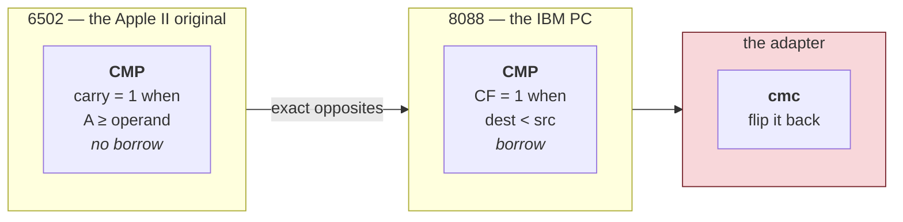

# Hard Hat Mack — the code

*Document three of three. [01-the-game.md](01-the-game.md) is what the game is;
[02-architecture.md](02-architecture.md) is how the program is shaped.*

Six sections: five routines, one discovery, and one picture. Every listing is copied from
`recovered/hhm.asm` — the file that reassembles to a byte-identical copy of the
original — with comments added and nothing else changed.

**Written for someone learning to program.** Each section explains what the
machine does, then what the programmer was thinking, then what transfers.

Nothing here is a guess about what the machine does. Where the *purpose* of
something is reasoned rather than proven, it says so.

**If you read one section, read [section 5](#5-the-instruction-that-should-not-be-there).**

---

## 1. The first instruction is a jump over data

```nasm
L_00000:
    jmp 0x104            ; EB 02 — skip the next two bytes
    db 0xFF, 0xFC        ; not code, and nothing in the program reads it
L_00004:
    cld
    cli
```

**What the machine does.** `EB 02` jumps two bytes forward. Those two bytes,
`FF FC`, are never executed.

**Why do that?** Because a `.COM` always begins at offset `0x100`, so `0x100` is
the one address every program can rely on. Putting a value there — a version
number, a signature, a flag — makes it findable by anything that loads the file.
The jump exists purely to step over it.

**Nothing in the program reads them** — checked: zero instructions reference
addresses `0x100`–`0x103`. So they were put there for something outside this
file, and what they meant cannot be recovered from it. That is a closed
question in the only sense available: the answer is not in here.

**What transfers:** a fixed, known offset at the very start of a format is
useful precisely because it is fixed. Magic numbers in file headers, the
`#!/bin/sh` on the first line of a script — same idea.

---

## 2. Taking over the machine

The nineteen instructions that run before the game starts. This is what "no
operating system" looks like in practice:

```nasm
    cli                          ; no interruptions while we rearrange things
    mov bx, cs
    mov ss, bx                   ; stack segment  = code segment
    mov ds, bx                   ; data segment   = code segment
    mov word [0x786], es         ; ES holds the PSP — save it, we will need it

    xor ax, ax
    mov es, ax                   ; ES -> address 0: the interrupt vector table
    lea ax, [0x171]              ; the offset of our keyboard handler
    mov bx, cs                   ;   and its segment
    xchg word [es:0x24], ax      ; 0x24 / 4 = 9. Ours goes in, the old one out
    xchg word [es:0x26], bx
    mov word [0x782], ax         ; keep the old vector so we can put it back
    mov word [0x784], bx

    and byte [es:0x410], 0xcf    ; the BIOS equipment word: clear the video bits
    or  byte [es:0x410], 0x20    ;   and declare colour graphics

    mov sp, 0x918                ; our own stack, at an address we chose
    sti                          ; interrupts back on
    in al, 0x61
    and al, 0xfe                 ; disconnect the speaker — silence
    out 0x61, al
    mov ax, 4
    int 0x10                     ; CGA mode 4: 320x200, four colours
    mov ax, 0xb800
    mov es, ax                   ; ES -> the screen, for the rest of the program
```

**Three things worth pausing on.**

**`xchg` is doing two jobs.** It swaps a register with memory in one
instruction, so `xchg word [es:0x24], ax` installs the new handler *and* hands
back the old one, which the next two lines file away. Two operations, one
instruction, no temporary. The 8088 had few registers and instructions like this
are why.

**It edits the BIOS's own data.** `[es:0x410]` with ES = 0 is absolute address
`0x410` — inside the BIOS data area, where the machine records what hardware is
installed. The program does not read it to find out; it writes it to *declare*.

**It never gives the machine back.** Its own stack, its own keyboard handler,
the screen mode changed, the BIOS's records rewritten. There is no `int 21h`
anywhere in this program — no DOS call at all, not even to exit. Published
sources say the 1984 IBM release was a self-booting disk, and this reads exactly
like a program that expects to *be* the operating system.

**What transfers:** "save the old value, install yours, restore on the way out"
is the shape of every hook, patch and middleware you will ever write. The
program that forgets the last step is the one that breaks everything after it.

---

## 3. The keyboard handler

**File `0x0071`, 55 bytes. The hardware calls this. Nothing else does.**

```nasm
handler:
    sti                          ; allow other interrupts — we are quick
    push ax                      ; whatever was running must not notice us

    in al, 0x60                  ; the scancode, straight off the keyboard port
    mov ah, al                   ; keep it

    in al, 0x61                  ; the keyboard control port
    or  al, 0x80
    out 0x61, al                 ; raise the acknowledge line
    and al, 0x7f
    out 0x61, al                 ;   and drop it again — "got it, send the next"

    mov al, ah
    test al, al
    js  .done                    ; high bit set = a key being RELEASED. Ignore.

    push bx
    cbw                          ; scancode 0..127 into a full register
    xchg bx, ax
    mov ah, byte [cs:bx + 0x72d] ; look it up in our own table
    test ah, ah
    jns .restore                 ; a positive entry means "not a key we want"
    mov byte [cs:0x781], ah      ; record it where the game will find it

.restore:
    pop bx
.done:
    cli
    mov al, 0x20
    out 0x20, al                 ; end-of-interrupt: tell the chip we are done
    dec ah
    je  .special1
    dec ah
    je  .special2
    pop ax
    iret                         ; back to whatever we interrupted
```

**What the machine does**, in order: grab the scancode, tell the keyboard
hardware you have it, throw away key-*releases*, translate the code through a
private table, store the result, tell the interrupt controller you are finished,
return.

### The three things every handler must get right

**Leave no trace.** The interrupted code has no idea this happened. Every
register touched is pushed and popped. Miss one and you get a bug that appears
in a completely unrelated routine, only when a key happens to be pressed at the
wrong instant — one of the hardest classes of bug there is.

**Acknowledge the hardware.** The `or 0x80` / `and 0x7F` pair on port `0x61`
pulses a line that tells the keyboard its byte was taken. Skip it and the
keyboard sends nothing further — the game appears to freeze on the second
keypress.

**Send the end-of-interrupt.** `mov al, 0x20 / out 0x20, al` tells the
interrupt controller the handler is finished. Skip it and the controller never
delivers another interrupt of that priority again. The machine goes silent and
nothing in your code looks wrong.

Three obligations, all invisible in the source, all fatal to omit. This is why
interrupt handlers have a reputation.

### Why bypass the BIOS at all?

The BIOS *has* a keyboard handler, and it is the one this replaces. But it
gives you *characters*, one at a time, from a queue — it is built for typing.

A game needs to know that the left arrow is being **held down**, right now, at
the same time as the jump button. The BIOS cannot answer that question. So the
game reads the raw hardware and keeps its own picture of the keyboard.

The table at `cs:bx + 0x72d` is that translation: 90 scancode slots, 68 of them
filled. Entries with the high bit set are keys the game cares about; the rest
are ignored, which is what `jns .restore` is testing.

**What transfers:** when a layer gives you the wrong *shape* of answer, going
under it is legitimate — but you inherit everything it was doing for you. All
three obligations above were the BIOS's job a moment ago.

---

## 4. An ordinary routine

Not everything is exotic. The most-called routine in the program — 52 call sites
— is this, and it is the kind of code the other 221 are made of:

```nasm
L_00217:
    mov al, 7
    mul byte [0x6d9b]            ; row * 7
    xchg cx, ax
    mov dl, byte [0x6d9c]        ; column
    xor dh, dh
    mov si, word [0x6d97]
    call L_0040A                 ; do the work

    test byte [0x1b67], 0xff     ; three flags, checked in turn
    jne .a
    test byte [0x1b68], 0xff
    jne .b
    test byte [0x1b66], 0xff
    jne .c
    call L_0046D
    jmp .done
.a: call L_00419
    jmp .done
.b: call L_00443
    jmp .done
.c: call L_004DD
.done:
    xor bx, bx
    mov byte [0x1b67], bl        ; clear all three flags
    mov byte [0x1b68], bl
    mov byte [0x1b66], bl
    ret
```

**What it is:** take a row and a column out of two variables, multiply the row
by 7, call a worker, then pick one of four follow-up routines depending on three
flags — and clear the flags on the way out.

Two details worth noticing.

**`mul byte [0x6d9b]` — multiplying by 7 with a real multiply.** On the 8088
`mul` is slow, and the usual trick is shifts and adds. Using `mul` here says the
author was not counting cycles at this point, which tells you this routine is
not in the innermost loop.

**Clearing the flags at the end.** The routine consumes them and resets them, so
whoever set them does not have to. That is a small, deliberate contract: *I will
clean up after you.* Getting that wrong in either direction — nobody clearing,
or both clearing — is a classic source of bugs where an action happens twice or
not at all.

**The `× 7` is a strong hint.** Multiplying a row number by seven to reach an
address means each row is seven bytes. **[inferred]** That looks like a table of
seven-byte records — one per moving object, perhaps — but the consumer at
`L_0040A` was not traced, so this is shape, not proof.

---

## 5. The instruction that should not be there

Now the discovery.

`cmc` — *complement carry flag* — flips one bit of the flags register. It is
rare; most programs contain none at all.

**Hard Hat Mack contains 391.**

And they appear in a pattern:

```nasm
    cmp al, 0xb0
    cmc                  ; <- flip the carry
    jne L_00FBA
    jmp L_00FF2

    cmp al, 0xca
    cmc                  ; <- and again
    jne L_00FC2
    jmp L_00FF2

    cmp al, 0xa0
    cmc                  ; <- and again
    jne L_00FCA
```

Look closely. `jne` tests the **zero** flag. `cmc` changes the **carry** flag.
The `cmc` has no effect whatsoever on the branch that follows it. It is dead
code — and it is everywhere.

### Measuring it

Guessing is not enough, so the pattern was counted across all 9,094 recovered
instructions:

| | |
|---|---|
| `cmc` instructions | **391** |
| directly after a `cmp` | 73% |
| directly after a `sub` | 26% |
| **after one or the other** | **99%** |
| share of *all* compares followed by `cmc` | **91%** |
| followed within 3 instructions by anything that reads carry | only 37% |

So: almost every compare and subtract in the program is followed by a carry
flip, and most of those flips are never read.

### What it means

`CMP` and `SUB` both set the carry flag to record a **borrow**. And the two
processors involved disagree about which way round that should be:



They are exact opposites. So 6502 code moved onto an 8088 must flip the carry
after every compare, or every branch that depends on it goes the wrong way.

**One instruction does exactly that, and it is present after 91% of the
compares in this program.**

### The conclusion

The IBM version of Hard Hat Mack was not rewritten. **It was mechanically
translated from the 6502 source**, instruction by instruction, by something that
emitted a carry-flip after every compare *without checking whether the carry was
going to be read*.

The 63% that are dead are the proof. A human porting by hand flips the carry
where it matters and nowhere else; only a machine does it unconditionally. And
it fits what the credits say — *IBM VERSION BY DANA HOW & KEVIN GILMORE,
THROUGH TMQ SOFTWARE, INC.* A contract conversion house with a deadline
translates; it does not rewrite.

### Why this changes how you read the rest

Every judgement you would normally make about the code is now suspect:

- **The structure is the 6502 program's**, not an x86 programmer's. Routines are
  short and numerous partly because the 6502 has almost no registers and pushes
  everything through memory.
- **Odd-looking sequences are translation artefacts**, not intent. There is no
  point asking why an author wrote something a strange way when no author wrote
  it at all.
- **The dead `cmc` are noise.** Reading meaning into them is reading meaning
  into a machine's habit.

**What transfers, and it is the real lesson:** before asking *why is this code
like this*, establish *who or what wrote it*. Code emitted by a tool follows the
tool's rules, and the tool's rules are usually visible as a pattern repeated far
more often than any human would repeat it. **An instruction that appears 391
times and does nothing is not a style. It is a signature.**

This is now detected automatically. The reconstruction tool reports:

```
provenance  : mechanically translated from 6502
              391 cmc, 99% of them straight after a cmp/sub, covering 91% of
              all compares -- a carry-convention adapter, not hand-written x86
```

and stays silent on ParaTrooper, which really was written by hand.

---

## What was learned here

Two things this game taught that
[ParaTrooper](../../paratrooper/docs/03-the-code.md) could not.

**Interrupt handlers are entry points nothing branches to.** A disassembler
follows control flow; the hardware does not. 55 bytes of this program were
invisible to the method until the tool learned to read the vector install.

**Code has provenance, and it is measurable.** Not just "which compiler" but
"was this written or generated, and from what". The evidence was an instruction
appearing 391 times for no reason — a thing you only notice by *counting*, not
by reading.

Both are now capabilities of the toolkit rather than things noticed by luck,
which is the point of working through a second game.

---

## 6. Proof without running anything

The sprites can be read out of the file and drawn, with the program never
executed. That is worth doing for its own sake, and it is also the only honest
way to check that a region you have *called* graphics is graphics.

The way in was the pointer table's stride of 66:

```
0x766F:  04 10 | 00 00 00 00  00 00 00 00 ...
         ^^ ^^
         |  height: 16 rows
         width: 4 bytes = 16 pixels
```

4 × 16 = 64, plus two header bytes, is 66 exactly. So the stride is not a
record size — **each sprite states its own dimensions**, and the table's steps
vary because the sprites do. The 34-byte steps elsewhere are 4 × 8 sprites.

Decoded that way, out come a wrench, lunchboxes, girders with rivets, six
frames of a walk cycle — and a 96 × 33 sprite of the **Electronic Arts logo**.

**The logo is what makes this proof rather than pattern-matching.** A shape can
be argued with; somebody can always say a blob happens to resemble a spanner.
Legible text cannot be argued with. If a single bit of the format were wrong,
what came out would be noise.

It arrives upside down, because sprites are stored **bottom row first**. The
blitter reads a sprite forwards while stepping *down* the scanline address
table (`dec bp / dec bp`), so the first bytes belong to the lowest row. There
is not a single `std` instruction in the program — an earlier reading here
called the data horizontally mirrored, and that was wrong.

`tools/gfxdump.py` in the toolkit does this for any binary.

---

## 7. What the game draws while you play

Everything above is the program before it starts, and the screens as they are
built. The other half — Mack walking, the vandal, the hammers falling — sits
behind the dispatch pointer, and reading it statically runs into the wall
described in [02-architecture.md](02-architecture.md#the-number-that-has-a-reference):
a reader that follows every call has no idea which branch the program takes.

So it was measured by running it. `comrun.py` builds a level, drives the two
routines the main loop calls, and records every sprite the program blits:

| sprite | blits in twelve frames | positions |
|---|---|---|
| 115 | 232 | 115 |
| 117 | 232 | 115 |
| 123 | 251 | 99 |
| 125 | 210 | 82 |
| 21 | 71 | one |
| 27 | 70 | 70 |

**Two pairs, moving constantly, drawn in equal numbers.** 115 with 117, and
123 with 125. A sprite drawn exactly as often as another, always in the same
frame, is one of two things: a figure made of two pieces, or a figure drawn and
then erased. Both pairs move across almost the whole playfield — 115 ranges
from column 30 to 206 — which is what a character does and what scenery does
not.

Sprite 27 is the girder tile, redrawn seventy times in seventy places: the
floors are not static scenery, they are repainted. That is how the gaps Mack
fills appear and disappear.

**A correction this produced.** The static reading of the level builders was
accused, in an earlier version of these documents, of inventing placements —
sprite 40 at column 14 and column 24, row 144, drawn on no level screen. They
are not invented. The running game draws them, at exactly those coordinates,
**during play rather than during the build**. The extraction had found real
placements and attributed them to the wrong phase, which is a different fault
from making things up and has a different fix.

### Starting the game, which took a working keyboard

None of the above could be seen until the harness could press a key, and that
took longer than it should have for two reasons worth writing down.

**The emulator's port hook returns the value read, not a success flag.** It was
returning `True`, so every `in al, 0x60` produced 1. The handler then did
everything right — filtered the scancode, acknowledged the hardware, translated
it through the game's table, stored the result — and every key delivered was
Escape. Nothing failed. Three different scancodes producing the same stored
byte is what gave it away.

**An injected interrupt has to return where the program was.** Pushing a
sentinel return address is the obvious shortcut; it means the `iret` lands
execution at an address the program has never been at, and the next fetch
faults. Push the real `CS:IP`, exactly as the hardware does, and the handler
becomes invisible to the program it interrupts.

With both fixed, the title screen answers. The loop at file `0x0AA8` spins until
`[0x0B62]` is non-zero, and the routine that sets it compares the stored key
against three values:

```nasm
    cmp al, 0xca          ; 'J' -- switches something and stays on the title
    je  .set_mode
    cmp al, 0xa0          ; the space bar
    je  .start
    cmp al, 0xcb          ; 'K'
    je  .start
```

`0xA0` is the space bar with the high bit set — the bit the handler adds to
mean *this key has not been read yet*. Deliver scancode `0x39` and the game
starts.

## Reading the rest

`recovered/hhm.asm` covers all 42,112 bytes and reassembles to the original
exactly. It is navigable:

- **Labels** are `L_xxxxx`, named after the position in the file.
- **`db` lines with a comment** are instructions pinned to a fixed encoding —
  they execute, they are just spelled in bytes.
- The honest limits are at the end of
  [02-architecture.md](02-architecture.md#what-is-still-unknown), and they have
  changed as the measurements got sharper. What remains is the 398 unnamed
  variables, 7.6% of the file with no bucket, and the gap between what the
  static reading of a level produces and what the game actually blits.
