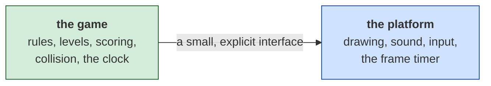

# Hard Hat Mack — porting it

*Document four of four. [01-the-game.md](01-the-game.md) is what the game is;
[02-architecture.md](02-architecture.md) is how the program is shaped;
[03-the-code.md](03-the-code.md) walks its routines.*

**No port of this game exists yet.** This document is the decision that comes
before one — what the choices are, what each costs, and what specifically about
*this* program makes it harder to port than
[ParaTrooper](../../paratrooper/docs/04-porting.md) was.

---

## Read this before choosing a language

### This one is not the easy case

ParaTrooper's porting document opens by saying the program is unusually
portable. Hard Hat Mack is not, and the reasons are worth stating before any
language is compared, because they apply the same way to all of them.

| | ParaTrooper (1982) | Hard Hat Mack (1983) |
|---|---|---|
| File | 16,400 bytes | 42,112 bytes |
| Instructions | 2,017 | 9,060 |
| Subroutines | 19 | **222** |
| Distinct variables | 47 | **405** |
| Frame timing | the BIOS tick, 18.2 Hz | **a counted delay loop** |
| Sound | timer channel 2 — set a divisor and walk away | **the speaker bit-banged by hand** |
| Written by | one person, in assembly | **a translator, from 6502** |

Every row on the right is worse for a port, and the last one is the one that
governs the rest.

### The code was not written, it was translated

391 `cmc` instructions exist in this program for no reason other than to
reconcile two processors that disagree about which way round the carry flag
means "borrow" — see
[03-the-code.md](03-the-code.md#5-the-instruction-that-should-not-be-there).
The structure you are reading is a 6502 program's structure, rendered into 8088
by a tool.

That matters to a porter in a specific way: **the code is not idiomatic of
anything.** There is no design to recover, only a machine translation of a
design. Variables are used the way zero-page addresses are used. Control flow
carries the shape of a processor with one index register. Reading it to
understand *what the game does* works; reading it to understand *how it was
meant to be organised* does not, because it never was.

The practical consequence: **do not try to transliterate this program.** Read it
for behaviour and rules, then write those rules in whatever language you chose.
That is true of most ports and it is emphatic here.

### The timing is the blocker, and it is a real one

ParaTrooper reads the BIOS clock. Its port needed one number — 18.2 Hz — and
the rest followed.

Hard Hat Mack has no clock at all. Its frame rate is a **nested counted delay
loop** at file `0x00DF`, called from 21 sites, and its musical pitch is another
delay loop toggling the speaker. Both were tuned by ear on a 4.77 MHz 8088.

So there is no number to copy. There is a *behaviour* to match, and matching it
requires either:

- measuring the original under emulation and fitting a frame rate to it — the
  harness for this exists, `comrun.py` in the toolkit, and it is how the rest of
  this documentation was checked; or
- accepting that your port runs at a rate you chose, and saying so.

The second is a legitimate answer. The first is better and costs a day.

**And the music will be wrong either way.** The pitch table is a chromatic scale
expressed as loop counts (`02-architecture.md`, *Sound*). On modern hardware
those counts mean nothing. You have the scale — two octaves, ratios averaging
1.0606 against the twelfth root of two's 1.0595 — so you can reconstruct the
*notes*, but the tempo was whatever a 1983 PC did between two `out` instructions.

### Separate the two halves on day one

The same advice as ParaTrooper's, and for the same reason:



If the two are tangled, changing renderer means rewriting the game. If they are
separated, the game logic is testable without a screen — which matters more here
than it did for ParaTrooper, because there is five times as much of it.

---

## The options

### 1. HTML / CSS / JavaScript, on a `<canvas>`

**The one everybody can run.** A URL, no install, no toolchain, works on a phone.

```js
const ctx = canvas.getContext('2d');
ctx.imageSmoothingEnabled = false;      // keep the pixels square
ctx.drawImage(sheet, sx, sy, 16, 16, x, y, 16 * S, 16 * S);
```

**For:**
- Nothing to install, for you or anyone you show it to.
- `requestAnimationFrame` gives a real frame clock; a fixed-timestep loop over
  it reproduces period timing exactly.
- The Web Audio API can play the recovered chromatic scale properly, which is
  more than the original could.
- Sprites decode straight from the binary at load time — no asset pipeline.

**Against:**
- One language for everything, including the parts JavaScript is weakest at.
- 405 variables and 222 routines is a lot of program to keep honest without
  types. **Use TypeScript** if the port goes past a prototype.
- Audio needs a user gesture before it will start. Every browser, no exceptions.

**Effort: about a week** for a playable level one, given this documentation.
That is longer than ParaTrooper's port took, and the difference is the level
data and the three enemies, not the language.

### 2. C99 + SDL2 (or raylib)

**The closest thing to what the original was.**

**For:**
- The mental model matches: a framebuffer, a blit, a byte array.
- Structures map onto the game's own layout without translation.
- Fast enough that performance never enters the conversation.
- SDL2 runs everywhere, including — via Emscripten — the browser.

**Against:**
- A toolchain, a build, and a binary per platform.
- Manual memory management buys you nothing here; the whole game fits in 64 KB.
- Sharing it means asking someone to download and trust an executable.

**Effort: about a week and a half.** The extra time is toolchain and packaging,
not code.

### 3. Rust + macroquad

**For:** the compiler catches the class of bug this game is full of — an index
into the wrong table, a byte where a word was meant. With 405 variables that is
a real safety net. Single binary out, WebAssembly target available.

**Against:** the borrow checker and a game loop full of mutable shared state are
a poor first date. If you do not already know Rust, learn it on something else.

**Effort: two weeks**, or considerably more if it is your first Rust project.

### 4. Python + pygame

**For:** the shortest distance from reading this documentation to seeing
something move. The sprite decoder is fifteen lines. Ideal for *verifying your
understanding* — which is exactly what the tooling in this repository already
does in Python.

**Against:** distribution is genuinely painful, and 222 routines of per-frame
logic in CPython will need care. Not the right answer for a port people are
meant to play.

**Effort: three days to something playable**, and then a wall.

### 5. Do not port it — run the original

DOSBox runs the real thing, exactly, today. If the goal is *playing Hard Hat
Mack*, that is the honest answer and it costs nothing.

Port it when the goal is different: to understand it completely, to change it,
to put it somewhere DOSBox will not go, or to prove the reading was right.

---

## Side by side

| | reach | effort | how well it fits this program | shareable |
|---|---|---|---|---|
| **HTML/CSS/JS** | everywhere | ~1 week | good — canvas is a framebuffer | a URL |
| **C99 + SDL2** | desktop, +web via Emscripten | ~1.5 weeks | best — same mental model | a download |
| **Rust + macroquad** | desktop, +web | ~2 weeks | good, and the types help | a download |
| **Python + pygame** | wherever Python is | ~3 days | fine for checking, poor for playing | painful |
| **DOSBox** | everywhere | none | it *is* the program | a disk image |

---

## Recommendation

**HTML/CSS/JS, and use TypeScript.**

The reasoning is the same as ParaTrooper's with one addition. Reach and zero
install win for a game people are meant to try; the browser's frame clock and
audio are better than what the original had; and the sprites decode from the
binary at load time so there is no asset pipeline to maintain.

The addition is the 405 variables. ParaTrooper's port is plain JavaScript and
that was the right call for 47 variables and 19 routines. At this size, plain
JavaScript will let you write `state.macX` where you meant `state.mackX` and
find out three levels later. TypeScript costs an afternoon of setup and repays
it the first time.

**If you would rather learn systems programming than ship something**, C99 with
SDL2 is the more instructive choice, and this program is a good teacher: it will
make you handle a framebuffer, a blitter and a timer yourself.

---

## Five things that will bite, in any language

These are not language problems. They are this-program problems, and every one
of them was found the hard way while writing the other three documents.

**1. The sprites are stored bottom row first.** Not mirrored — the blitter walks
*down* the scanline table while reading the bitmap forwards. Decode them
top-first and every sprite is upside down, and at this resolution several of
them look fine that way. **Orient by the text**: the EA logo has exactly one
correct orientation and a shape has four that all look plausible.

**2. The font is the other way round.** A different routine draws it, with its
own convention: top row first. Two formats, one file.

**3. A row is a scanline from the top, and the sprite's *bottom* edge sits on
it.** Not the top-left corner. Get this wrong and everything is off by its own
height, which looks like a physics bug and is not.

**4. The scanline table in the file is not the one the program uses.** Start-up
adds 5 to every entry, so the playfield begins twenty pixels in from the left.
Read the table out of the binary and your whole screen is twenty pixels off.
This one cannot be found by reading — it took running the program.

**5. Two of the three drawing routines place *two* sprites per call**, from a
second set of variables, and one of them works in byte columns rather than
seven-pixel character cells. Assume one convention and a third of the screen
lands in the wrong place.

---

## How to know your port is right

The same ladder the rest of this project uses, and the top of it is reachable
here in a way it usually is not — because the original can be run and watched.

| | check | what it proves |
|---|---|---|
| weakest | it looks like the screenshots | nothing |
| | the sprites you decode match `recovered/screens-game.png` | your decoder is right |
| | your level screens match the emulator's, pixel for pixel | your level data is right |
| strongest | **the same recorded input produces the same frames** | the game behaves the same |

`comrun.py` in the toolkit runs the original and dumps its framebuffer. That is
the reference. Use it: it is how the level extraction in this documentation went
from a confident 100% to a measured 38–83%, and the difference was real.

**And record what you deliberately changed.** A port that fixes the CGA palette,
adds a pause key or lets the music play in tune is a better program and a
different one. Say which is which; the port is worth more when the reader knows
what is faithful and what is improved.
