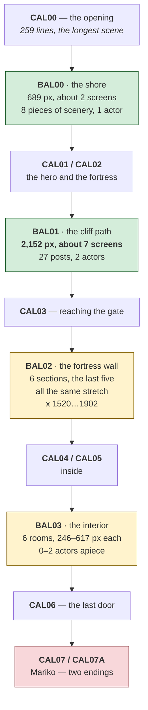

# Karateka — the game

*Document one of five. [02-architecture.md](02-architecture.md) is how the
program is built; [03-the-code.md](03-the-code.md) walks its routines;
[04-porting.md](04-porting.md) is what rebuilding it would take;
[05-the-fighting.md](05-the-fighting.md) reads the fighting.*

Two kinds of fact are kept apart here on purpose:

- **From the binary.** Strings, tables and code read out of `KARATEKA.EXE` and
  its ninety data files. Checkable — you can look at the same bytes.
- **From published sources.** History and reception, linked at the
  [bottom](#sources).

---

## What it is

**Karateka**, written by **Jordan Mechner** and published by **Brøderbund** in
1984 — his first game, made while he was an undergraduate at Yale. You climb a
cliff to Akuma's fortress, fight your way past his guards and his eagle, defeat
Akuma, and free Princess Mariko.

The IBM PC version examined here is `KARATEKA.EXE`, **87,990 bytes**, with
ninety data files beside it.

## Why it mattered

Two things, and the second one is why people still talk about it.

**It was rotoscoped.** Mechner filmed his father — in his mother's karate gi,
in the woods behind the family house in upstate New York — and traced the
frames. The result is a figure that moves like a person rather than like a
sprite, and it is visible directly in the data: sixty frames of the hero come
out of `KSC.DAT` alone, and laid out in a grid they read as a continuous
performance rather than a set of poses.

Mechner used the same technique four years later on *Prince of Persia*.

**It was cinematic.** Karateka opens with an animated sequence, cuts between
the hero and Akuma's fortress, and ends with a scene rather than a score
screen. That was close to unheard of on 1984 home computers, and the program
does it with a **small interpreted language** — fourteen commands, in a table
the binary names itself:

```
set_tune   set_bg    set_fig   chg_fig   do_scr    del_fig    set_wipe
set_nowipe wait      init_sal  set_pos   inc_x     loop       end_animation
```

That is a cutscene system, written as a script engine, in 1984. It is traced in
[03-the-code.md](03-the-code.md#the-animation-language).

## How to play

| | |
|---|---|
| approach | walk right; you are attacked in sequence |
| stance | you fight in a karate stance and travel in a run |
| attacks | three heights of punch and three of kick |
| the eagle | attacks in the fortress and must be struck out of the air |
| the death gate | a portcullis that will crush you if you mistime it |
| Akuma | the last fight |

**Most guards fall to a low kick and a high kick, repeated.** It is not elegant
and it works; the guards vary in how quickly they close and how far they back
off, not in what beats them.

## The map, from the beach to the princess

Four scenery scripts hold the whole game, and their own coordinates give the
size of each place. Everything below was measured out of `BAL00`–`BAL03` and the
routines that sequence them — see
[05-the-fighting.md](05-the-fighting.md) — rather than from playing.



`CAL07` and `CAL07A` are the same length, 71 lines, and differ in content:
**the two endings**. Approach Mariko in a fighting stance and she kicks you in
the head; drop out of it and you do not get that one.

### How many rooms you fight through

This is the part worth being precise about, because it is easy to assume it is
random and the code says otherwise.

`BAL02` and `BAL03` are each **six sections**, and the loader is told so
outright — `0x19EE` is called with a literal **6**, and walks the compiled
script counting `init_sal` markers to index them. Within `BAL02` the last five
sections are the same piece of wall with different numbers of opponents standing
on it:

| section | scenery | opponents |
|---|---|---|
| 0 | 40 pieces, x −24…1902 | 1 |
| 1 | 14 | 1 |
| 2 | 11 | 5 |
| 3 | 11 | **6** |
| 4 | 11 | **7** |
| 5 | 11 | **9** |

Which one you get is **not random**. The section index is a two-line
calculation:

```nasm
    mov  word [0xc3a6], 3       ; three, normally
    cmp  word [bp+6], 7
    jne  .normal
    mov  word [0xc3a6], 5       ; five, on the last level
.normal:
    mov  ax, [0x12e]
    add  word [0xc3a6], ax      ; plus a per-level flag, 0 or 1
```

So the courtyard holds **6 opponents, or 7 once the per-level flag is set, or 9
on level 7** — three fixed outcomes, chosen by where you are in the game.

### What *is* random

`random(n)` sits at image `0x629` — `rand()`, multiplied by `n + 1`, high word
taken, giving a uniform integer in `0…n` without a division. It is called from
**eleven places**, and never for the room count:

| | |
|---|---|
| `random(1)` | which of two variants of a move to play — `pal17` or `pal18` |
| `random(2)` | on spawning a guard, `× 12` → an aggression of **0, 12 or 24** |
| `random(255)` | probability rolls inside the guard's decision tree |

So two guards on the same piece of wall are not identical: each is dealt one of
three temperaments when it appears. That, and not the layout, is where the game's
variety comes from.

### The levels themselves

`[0x130]` counts the level and runs **1 to 7**, advancing by a plain `inc`.
Level 2 starts the player at x = 32 rather than 4 and shifts the level bounds
one screen left; levels 6 and 7 are special-cased in several places; the
`[0x102]` and `[0x104]` globals hold the current left and right walls, and the
player's x is clamped between them every frame.

### The ending everyone gets wrong the first time

When you reach Mariko, **drop out of your fighting stance before you approach
her.** Walk up to her in a stance and she takes you for one of Akuma's men,
kicks you in the head, and the game ends.

It is the most famous thing about Karateka after the animation, and it is a
deliberate joke at the expense of a player who has spent the whole game being
told that stance is safety.

There is a second joke in the same spirit: the game was pressed so that it
would boot from either side of the disk, and if you inserted it upside down it
ran **upside down**.

## What the binary says about itself

Three things it states outright, which most games of the era do not.

**The compiler.** The first string in the data segment is `Lattice C 2.1`,
followed by its runtime's own error messages — `Invalid stack size`,
`Invalid I/O redirection`, `Insufficient memory`, `*** STACK OVERFLOW ***`.
So the DOS version is a **C program**, not the hand-written assembly that its
prologue density at first suggested. See
[02-architecture.md](02-architecture.md#it-is-a-c-program-and-it-says-so).

**The asset tables.** Two parallel lists of fourteen names, in the same order:

```
ks0 ks1 ks2 ks3 ks4 ksc ksi0 ksi1 ksi2 ksj2 ksi3 ksi4 ksj4 ksi
km0 km1 km2 km3 km4 kmc kmi0 kmi1 kmi2 kmj2 kmi3 kmi4 kmj4 kmi
```

Fourteen shapes, fourteen masks, one pair per character or scene. The `.dat`
extension is appended at run time, from another string three bytes further on.

**And a curiosity.** At `DS:0x0322` sits `qazwsx46 b0.ind` — a keyboard pattern
and a filename in one string. **[inferred]** a developer shortcut left in the
shipped build; nothing in this analysis has traced what typing it does.

## It was not translated — it was rewritten

[Hard Hat Mack](../../hard-hat-mack/), also an Apple II game brought to the IBM
PC in the same period, turned out to be a **mechanical translation** of its 6502
original: 391 `cmc` instructions that exist only to reconcile two processors
that disagree about the carry flag.

Karateka has **zero**, in 10,589 instructions, against 913 compares. Brøderbund's
conversion was a rewrite in C where Electronic Arts' was a translation — and the
difference is measurable rather than a matter of opinion.

The Apple II original is still worth reading alongside it. Six disk images are
in `reference/apple-ii/`, and now that the DOS version is known *not* to be a
translation, the comparison is more interesting rather than less: two
independent implementations of one design, four years before *Prince of
Persia*.

## Sources

- [Karateka — Jordan Mechner's own page](https://www.jordanmechner.com/en/games-movies/karateka/)
- [Karateka — TV Tropes](https://tvtropes.org/pmwiki/pmwiki.php/VideoGame/Karateka)
- [The Making of Karateka — Xbox Wire](https://news.xbox.com/en-us/2023/07/11/making-of-karateka-gold-master-series/)
- [karateka.com](https://karateka.com/) — the 2023 remaster

Everything in *What the binary says about itself* and *It was not translated*
was read out of `KARATEKA.EXE`; the history and the anecdotes are from the
sources above.
