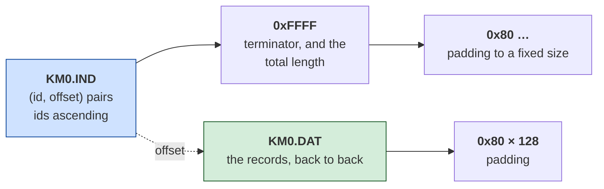

# Karateka — architecture

*What the program is made of. Facts here were read from the binary; anything
reasoned rather than observed is marked **[inferred]**, and
[what is still unknown](#what-is-still-unknown) is listed at the end.*

---

## It is an MZ, but it is really a .COM

`KARATEKA.EXE` is 87,990 bytes with an MZ header, which normally means the
program uses segments and needs a loader that understands them. This one does
not. It has **four relocations in 85 KB**, and its entry stub settles the
question in seven instructions:

```nasm
    cli
    mov ax, 0x6ca
    mov ds, ax              ; DS = image + 0x6CA0 — and that is the last word
    mov ax, 0x155c          ; on the subject of segments
    mov ss, ax
    mov sp, 0x80
    sti
```

Code is addressed from 0, data from `0x6CA0`, and nothing moves after that. The
only reason this is an `.EXE` rather than a `.COM` is that it is bigger than a
`.COM` may be.

That matters because it changes which route the program takes through the
toolkit, and the route decides how strong a claim can be made at the end. The MZ
pipeline produces readable output that is probably right. The `.COM` route
produces a rebuild that is byte-identical and proves it.

```
python <toolkit>/tools/comrec.py original/KARATEKA.EXE --out recovered/karateka.asm
```

```
format      : MZ, 512-byte header stripped; entry CS:IP -> image offset 0x2
instructions: 9,740 disassembled (918 pinned to fixed bytes to preserve encoding)
code region : 0x0000..0x6C9D  (27,805 bytes)
  recovered : 23,628 bytes as instructions (85.0% of the code region)
data tail   : 0x6C9D..0x155B6 left as data (59,673 bytes)
BYTE-IDENTICAL
```

Checked outside the tool that produced it:

```
nasm -f bin -o image.bin recovered/karateka.asm
cat recovered/karateka.mzheader image.bin > rebuilt.exe
```

SHA-256 of `rebuilt.exe` equals the shipped file, all 87,990 bytes.

**The code region the tool found ends at `0x6C9D`. The entry stub sets `DS` to
`image + 0x6CA0`.** Those are the same boundary, arrived at twice by different
means — one by walking the code, one by reading a constant — and that agreement
is the reason to believe either.

## It was written for the 8088, not translated to it

Karateka is Jordan Mechner's Apple II game. [Hard Hat Mack](../../hard-hat-mack/)
is Michael Abbot and Matthew Alexander's Apple II game, and its IBM version
turned out to be a **mechanical translation** of the 6502 original — provable
from 391 `cmc` instructions that exist only to reconcile two processors that
disagree about the carry flag.

The obvious prediction was that Karateka would be the same. This document said
so before the work started, in as falsifiable a form as could be managed.

**It is not.**

| | Hard Hat Mack | Karateka |
|---|---|---|
| `cmc` instructions | 391 | **0** |
| `cmp` / `sub` | 431 | 914 |
| `cmc` straight after a compare | 99% of them | — |

Zero `cmc` in 9,740 instructions, against 914 compares. There is no carry-flag
adapter because nothing needed adapting: this is hand-written 8088 assembly.
Broderbund's DOS conversion was a rewrite where Electronic Arts' was a
translation.

**[inferred]** — that is a claim about the code, not about who wrote it. The
binary shows a rewrite; it does not say whose.

## Ninety files outside the executable

Every other game examined in this repository keeps its artwork inside the
executable. Karateka does not: 59,673 bytes of the program are data, and beside
it on the disk sit **twenty-eight paired data files** plus a set of loose ones.

```
KM0.DAT / KM0.IND      KS0.DAT / KS0.IND      ALLPAL   CASTLE.BCG
KM1.DAT / KM1.IND      KS1.DAT / KS1.IND      ALLBAL   FUJI.BCG
   … twenty-eight pairs in all …              ALLCAL   BAL00 … BAL03F
                                              ALLGAL   CAL00 … CAL07A
                                              ALLVAL   PAL…  VAL…
```

### The pairs are an index and a heap, and the format is settled



Read as bytes, the first entries of `KM0.IND`:

```
4a 01 | 00 00      id 0x014A at offset 0x0000
4b 01 | 5a 00      id 0x014B at offset 0x005A
66 01 | ab 00      id 0x0166 at offset 0x00AB
…
ff ff | 49 03      end, total length 0x0349
80 80 80 …         padding
```

**Every one of the twenty-eight pairs satisfies all three conditions**: ids
strictly ascending, offsets strictly ascending, and the terminator's length
exactly equal to the `.DAT` size minus 128 bytes of `0x80` padding. Twenty-eight
files agreeing on a constant 128 is not a coincidence; it is the format.

A record's length is the next record's offset minus its own — the standard way
to store variable-length records with a sorted lookup table, and the same idea
as the sprite pointer table inside Hard Hat Mack, moved out of the executable.

### The records themselves are not decoded

Each record opens with three bytes that read like a header, and the data that
follows is compressed:

```
id  363   04 09 01 | 7b ff 08 | 00 | 7b ff 05 | f3 00 ff f0 | …
          ^^ ^^ ^^   ^^^^^^^^
          w  h  ?    0x7B looks like an escape: value, then a count
```

`0x7B` as `escape, value, count` decodes 282 of 284 records without running off
the end, which is encouraging and proves very little — almost any rule decodes
*something*.

The test that matters is whether the decoded length equals `width × height`, and
**it does so for only 10 of 284 records**. So the rule is close and wrong, and
the difference is not a detail: a compression rule that is nearly right produces
pictures that are nearly right, which is exactly the failure this repository has
been caught by before.

It is left undecoded rather than guessed at. The way to settle it is the way the
scanline table in Hard Hat Mack was settled — run the program and look at what
it actually put on the screen.

## The copy protection

`reference/` contains `KARATEKA_NOCHK.EXE`, a copy with the disk check removed.
It is not the shipped game and it is not this project's work.

**It must not be decompiled by mistake.** A byte-identical reconstruction of a
patched binary is a byte-identical reconstruction of the patch, and it would say
so nowhere. Everything in this document is from `original/KARATEKA.EXE`, where
the check is still present.

## What is still unknown

- **The record compression.** The container is settled; what is inside a record
  is not. `width × height` fails for 274 of 284 records under the obvious
  reading of the escape byte.
- **What the twenty-eight pairs are for.** `KM*` and `KS*` are two parallel
  series with matching numbers — **[inferred]** two of something, perhaps two
  characters or two graphics modes, but nothing has been checked.
- **The loose files.** `ALLPAL`, `ALLBAL`, `ALLCAL`, `ALLGAL`, `ALLVAL` look
  like combined versions of the `PAL*`, `BAL*`, `CAL*`, `VAL*` series;
  `CASTLE.BCG` and `FUJI.BCG` are backdrops by their names alone.
- **The other 15% of the code region**, and all 59,673 bytes of the data tail.
- **Everything the program does.** This document is about its shape. Nothing
  here has yet followed the game loop, the fighting, or the animation that made
  Karateka worth remembering.
