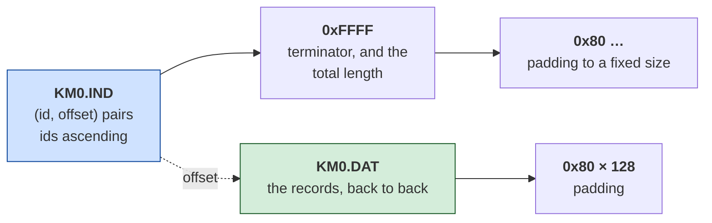

# Karateka — architecture

*Document two of six. [01-the-game.md](01-the-game.md) is what the game is;
[03-the-code.md](03-the-code.md) walks its routines;
[04-porting.md](04-porting.md) is what rebuilding it would take;
[05-the-fighting.md](05-the-fighting.md) reads the fighting;
[06-web-code.md](06-web-code.md) walks the port's code.*

*Facts here were read from the binary; anything
reasoned rather than observed is marked **[inferred]**, and
[what is still unknown](#what-is-still-unknown) is listed at the end.*

---

## It is an MZ, but it is really a .COM

`KARATEKA.EXE` is 87,990 bytes with an MZ header, which normally means the
program uses segments and needs a loader that understands them. This one does
not. It has **four relocations in 85 KB**, and its entry stub settles the
question in seven instructions:

```nasm
    cli
    mov ax, 0x6ca
    mov ds, ax              ; DS = image + 0x6CA0 — and that is the last word
    mov ax, 0x155c          ; on the subject of segments
    mov ss, ax
    mov sp, 0x80
    sti
```

Code is addressed from 0, data from `0x6CA0`, and nothing moves after that. The
only reason this is an `.EXE` rather than a `.COM` is that it is bigger than a
`.COM` may be.

That matters because it changes which route the program takes through the
toolkit, and the route decides how strong a claim can be made at the end. The MZ
pipeline produces readable output that is probably right. The `.COM` route
produces a rebuild that is byte-identical and proves it.

```
python <toolkit>/tools/comrec.py original/KARATEKA.EXE --out recovered/karateka.asm
```

```
format      : MZ, 512-byte header stripped; entry CS:IP -> image offset 0x2
instructions: 10,589 disassembled (987 pinned to fixed bytes to preserve encoding)
code region : 0x0000..0x6C9D  (27,805 bytes)
  recovered : 25,558 bytes as instructions (91.9% of the code region)
data tail   : 0x6C9D..0x155B6 left as data (59,673 bytes)
BYTE-IDENTICAL
```

Checked outside the tool that produced it:

```
nasm -f bin -o image.bin recovered/karateka.asm
cat recovered/karateka.mzheader image.bin > rebuilt.exe
```

SHA-256 of `rebuilt.exe` equals the shipped file, all 87,990 bytes.

**The code region the tool found ends at `0x6C9D`. The entry stub sets `DS` to
`image + 0x6CA0`.** Those are the same boundary, arrived at twice by different
means — one by walking the code, one by reading a constant — and that agreement
is the reason to believe either.

## It was written for the 8088, not translated to it

Karateka is Jordan Mechner's Apple II game. [Hard Hat Mack](../../hard-hat-mack/)
is Michael Abbot and Matthew Alexander's Apple II game, and its IBM version
turned out to be a **mechanical translation** of the 6502 original — provable
from 391 `cmc` instructions that exist only to reconcile two processors that
disagree about the carry flag.

The obvious prediction was that Karateka would be the same. This document said
so before the work started, in as falsifiable a form as could be managed.

**It is not.**

| | Hard Hat Mack | Karateka |
|---|---|---|
| `cmc` instructions | 391 | **0** |
| `cmp` / `sub` | 431 | 913 |
| `cmc` straight after a compare | 99% of them | — |

Zero `cmc` in 10,589 instructions, against 913 compares. There is no carry-flag
adapter because nothing needed adapting. Brøderbund's DOS conversion was a
rewrite where Electronic Arts' was a translation.

**[inferred]** — that is a claim about the code, not about who wrote it. The
binary shows a rewrite; it does not say whose.

## It is a C program, and it says so

This document first concluded the rewrite was in hand-written assembly, on the
strength of triage's **0.4 stack frames per KB**. That figure is correct and the
conclusion drawn from it was not, for a reason worth stating: it is computed
over the *whole file*, and 68% of this file is data. Over the code region alone
the density is about **4 per KB**, which is an entirely different signal.

The program settles it without being asked. The first string in its data
segment is:

```
DS:0x0002   Lattice C 2.1
DS:0x0082   Invalid stack size
DS:0x0096   Invalid I/O redirection
DS:0x00B0   Insufficient memory
DS:0x00C6   *** STACK OVERFLOW ***
```

A compiler name, followed by its runtime's own start-up errors. And the code
agrees: 117 `push bp` prologues, thirty of them carrying a stack-limit check
against a global at `[0x17]`, all branching to one shared routine that prints
`*** STACK OVERFLOW ***` and exits with `AX = 0x4C01`.

```nasm
    push bp
    sub  sp, 2
    jb   .overflow
    cmp  sp, word [0x17]        ; the stack limit, a runtime global
    ja   .ok
.overflow:
    jmp  stack_error
.ok:
    mov  bp, sp
```

Three independent sources — the version string, the runtime's message set, and
the prologue idiom — and they agree.

**But the drawing routines have no prologues at all.** The blitter and the
decoder in [03-the-code.md](03-the-code.md) use every register, keep their state
in globals, and never touch `bp`. So Karateka is **mixed**: C for the game, hand
-written assembly for the inner loops, which is exactly what a 1984 developer
would do and exactly what the mixed prologue density was telling us before it
was misread.

**[inferred]** that the assembly routines were written as assembly rather than
emitted by the compiler. Lattice C 2.1 did not generate code like this, and the
surrounding C does not either — but no `.OBJ` survives to prove it.

### What this does not unlock

`libscan.py` subtracts a C runtime by matching modules out of an OMF `.LIB`,
recovers the entry point from the startup module, and names the runtime's
functions from its PUBDEF records. It would apply here in principle — and there
is no copy of Lattice C 2.1's library on this machine to try it with. The
compiler is identified; its runtime is not subtracted.

## Ninety files outside the executable

Every other game examined in this repository keeps its artwork inside the
executable. Karateka does not: 59,673 bytes of the program are data, and beside
it on the disk sit **twenty-eight paired data files** plus a set of loose ones.

```
KM0.DAT / KM0.IND      KS0.DAT / KS0.IND      ALLPAL   CASTLE.BCG
KM1.DAT / KM1.IND      KS1.DAT / KS1.IND      ALLBAL   FUJI.BCG
   … twenty-eight pairs in all …              ALLCAL   BAL00 … BAL03F
                                              ALLGAL   CAL00 … CAL07A
                                              ALLVAL   PAL…  VAL…
```

### The pairs are an index and a heap, and the format is settled



Read as bytes, the first entries of `KM0.IND`:

```
4a 01 | 00 00      id 0x014A at offset 0x0000
4b 01 | 5a 00      id 0x014B at offset 0x005A
66 01 | ab 00      id 0x0166 at offset 0x00AB
…
ff ff | 49 03      end, total length 0x0349
80 80 80 …         padding
```

**Every one of the twenty-eight pairs satisfies all three conditions**: ids
strictly ascending, offsets strictly ascending, and the terminator's length
exactly equal to the `.DAT` size minus 128 bytes of `0x80` padding. Twenty-eight
files agreeing on a constant 128 is not a coincidence; it is the format.

A record's length is the next record's offset minus its own — the standard way
to store variable-length records with a sorted lookup table, and the same idea
as the sprite pointer table inside Hard Hat Mack, moved out of the executable.

### The records, read off the code that reads them

The first attempt at this guessed. Each record opens with three bytes that look
like a header and continues with something that looked compressed, `0x7B`
appeared often enough to be an escape byte, and *escape, value, count* decoded
282 of 284 records without running off the end.

**All of that was wrong, and the way it was wrong is the point.** 282 of 284 is
the kind of number that ends an investigation. The rule decoded almost
everything and produced almost-plausible sizes, and the only reason it did not
survive was a second test — decoded length against `width × height` — which it
failed 274 times out of 284.

So the format was settled the other way: by running the game and finding the
code that reads a record. `comrun.py` loads the executable, answers enough DOS
for it to open its ninety files, and a hook on the buffer `KS0.DAT` was read
into names the instructions that touch it. Fourteen of them, and two account
for 385,000 of the 397,000 reads:

```nasm
L_00AE7:
    mov  dl, [si + 0x443c]      ; one byte of the record
    inc  si
    mov  ax, [bx + 0x4234]      ; a mask, chosen by the pixel offset
    and  ax, [di + 0x337]       ; what is already on screen
    mov  cl, [0x4227]           ; how far into a byte this column starts
    xor  dh, dh
    ror  dx, cl                 ; shift the byte into place
    or   ax, dx
    mov  [di + 0x337], ax
    add  di, 0x50               ; 80 bytes -- the next scanline
    dec  byte [0x422a]
    jne  L_00AE7
```

`add di, 0x50` is a CGA row. The loop walks **down a column**, one byte per
scanline, then the outer loop moves one column right. There is no decompression
anywhere in it: the bytes go from the record to the screen through a rotate and
a mask.

So the header means what it looked like, and the body is raw:

```
byte 0   width, in bytes
byte 1   height, in scanlines
byte 2   a flag -- 0x01 in every record examined
byte 3+  width x height raw bytes, column-major
```

Four records were checked against what the blitter actually consumed, and all
four agree exactly:

| record | header | `w × h` | bytes consumed |
|---|---|---|---|
| 456 | `0C 48 01` | 12 × 72 = 864 | **864** |
| 457 | `18 08 01` | 24 × 8 = 192 | **192** |
| 462 | `0C 48 01` | 12 × 72 = 864 | **864** |
| 464 | `01 0C 01` | 1 × 12 = 12 | **12** |

Each consumed run begins exactly three bytes into its record.

### The stream is run-length encoded, and 0x7B is the escape after all

The blitter above draws from a byte at a time. Where that byte comes from is a
second routine, and it is the decoder:

```nasm
L_00B95:
    cmp  byte [0x422e], 0       ; anything left of the current run?
    je   fetch
    mov  al, [0x422f]           ; yes -- emit the run's value
    dec  byte [0x422e]
    ret
fetch:
    mov  si, [0x4220]
    mov  al, [si - 0x76c6]      ; the next token
    inc  si
    cmp  al, 0x7b
    jne  done                   ; an ordinary byte: emit it as it is
    mov  al, [si - 0x76c5]      ; the count
    mov  byte [0x422e], al
    mov  al, [si - 0x76c6]      ; the value
    mov  byte [0x422f], al
    add  si, 2
done:
    mov  [0x4220], si
    ret
```

So the format is:

```
0x7B v c   emits v, then c more of v -- c + 1 bytes in total
any other  emits itself
```

The `+ 1` is not a detail: the escape path returns the value immediately and
*then* the counter supplies `c` more. And the header is three bytes, which the
program says itself — `add word [0x4220], 3` — and which the emulator confirms:
every run of reads the game made from `KM0.DAT` began exactly three bytes into
its record.

**Two corrections to earlier readings of this**, and they went in opposite
directions.

The first attempt guessed `0x7B` as an escape and was right about that, wrong
about the arithmetic, and tested it against the wrong thing. The second attempt
looked at the shape blitter, found no decompression in it, and concluded `0x7B`
was an ordinary pixel value. **That was an over-correction.** The blitter does
not decompress because decompression happens one call earlier, in a routine
neither attempt had found.

### 666 of 666

The obvious test — "does a record decode to exactly `width × height`?" — reached
338 and then stalled, and it stalled because **it was never a property of the
format.** The decoder is called once per output byte and stops when the caller
stops asking. A record is a stream, not a picture: the game consumed 21 bytes of
one 90-byte record and all but four of the next.

Chasing the remaining 328 with `(w+1)*h`, `w*(h+1)` and friends got to 491, and
that is curve-fitting rather than reading. Five formulas tried until one matched
is exactly the failure this repository keeps recording.

What the format *does* imply is checkable on every record:

> the stream decodes without an escape running off the end, **and** yields at
> least `width × height` bytes, because that is what the blitter will ask for.

| | |
|---|---|
| records | **666** |
| decode with no escape running off the end | **666** |
| yield at least `width × height` | **666** |

### The check can fail, which is why it counts

A test that passes everything tests nothing. Five variants of the rule, against
the same 666 records:

| rule | decodes | ≥ `w×h` |
|---|---|---|
| **`0x7B`, count **+1**, 3-byte header** — read off the code | **666** | **666** |
| `0x7B`, count as written | 666 | 318 |
| `0x7C` — the neighbouring byte | 666 | 80 |
| `0xFF` as the escape | 629 | 599 |
| no escape; every byte a literal | 666 | 88 |

Four of the five fail. One further variant — the same rule without skipping the
three header bytes — also passes, and cannot be separated by this test, because
skipping fewer bytes only adds output. It is separated by the program instead:
`add word [0x4220], 3`, and every measured read beginning three bytes in.

## The scene backdrop is more than the BAL script

`BAL00` is the level-0 layout file. Reading it gives six figures —
ground, ground, fence-top, three fence posts — plus a gate at
world-x=326 that is off the visible 320-pixel screen. A port that
draws only those figs on top of `FUJI.BCG` at Y=0 gets 34 % of the
bytes right and looks nothing like the game. What is happening on
the other 66 %, measured by hooking `draw_sprite` and comparing the
shadow at `DS:0x0337` against a Python replica of the same
composition path:

- **`FUJI.BCG` is at Y=80, not Y=0.** The horizon offset that puts
  Mt. Fuji's base at the top of the plateau. Byte-scoring by
  distinctive content: 195 of 206 non-sky non-black FUJI bytes
  match at Y=80, zero at Y=0.
- **The sky is filled with `0x55`.** Y=0..107 is set to `0x55` (four
  cyan pixels per byte) before any figure is drawn. `FUJI.BCG`
  overwrites rows 80..114 within that band, so the mountain sits
  in a sky the backdrop file did not supply — cyan above the
  mountain is not from any file, it is a rectfill.
- **The plateau is a two-row dither, Y=154..183.** Alternates:
  even rows `0x99` (pixel pattern magenta/cyan/magenta/cyan), odd
  rows `0x66` (cyan/magenta/cyan/magenta). Same visual pattern
  either way, a byte apart. Getting the range wrong by one on
  either end is invisible on screen but a 100 % byte miss on the
  affected rows.
- **Structural sprites (no mask pack) write opaquely.** `fig 200`,
  `fig 206`, `fig 201`, `fig 208` all have `KMC[fig]` at zero,
  meaning no mask; the game writes their shape bytes — including
  the zeros — straight through. Treating zero as transparent, which
  the port did first, let the plateau show through where the
  ground pieces meant to draw black.
- **Post-FUJI overlays paint the horizon by hand.** After drawing
  `FUJI.BCG` the game overwrites four rows: Y=106 to `0xFF` (the
  white horizon rail across the whole screen), Y=107..109 to
  `0x00` (a shadow band under the rail), and Y=114 to `0x00` (the
  base — FUJI's row 34 is cyan and would leak through otherwise).
  These are not in FUJI.BCG and not in any BAL script; only the
  before-and-after shadow comparison shows them.

None of that is in any file. It is code, in a routine that runs
between opening `BAL00` and the first `draw_sprite`, and nothing
in the BAL script itself says a word about it. Applying all of it
takes a Python replica of the port's renderer from 34 % to
**100 % byte-match** against the game's own composed shadow —
16000 of 16000 bytes agree. The account is in
[06-web-code.md](06-web-code.md).

## The copy protection

`reference/` contains `KARATEKA_NOCHK.EXE`, a copy with the disk check removed.
It is not the shipped game and it is not this project's work.

**It must not be decompiled by mistake.** A byte-identical reconstruction of a
patched binary is a byte-identical reconstruction of the patch, and it would say
so nowhere. Everything in this document is from `original/KARATEKA.EXE`, where
the check is still present.

## What is still unknown

- **What a record holds beyond the pixels it is asked for.** The stream is
  settled and every one of the 666 decodes, but a record usually carries more
  than `width × height` bytes and nothing here explains how much more or why.
  **[inferred]** the extra is a margin for the shifted-edge column the blitter
  needs, since `(w+1)×h` accounts for 112 of them — but that is a formula that
  fits, not a routine that was read, and this document has been burned by the
  difference already.
- **What the twenty-eight pairs are for.** **[inferred]** `KS` is the shape and
  `KM` the mask. Both are read through the same decoder but through separate
  stream pointers and separate run state — `0x421E` with `0x422C`/`0x422D` for
  one, `0x4220` with `0x422E`/`0x422F` for the other — which is what two
  independent streams consumed in lockstep looks like. Which is which has not
  been established.
- **The loose files.** `ALLPAL`, `ALLBAL`, `ALLCAL`, `ALLGAL`, `ALLVAL` look
  like combined versions of the `PAL*`, `BAL*`, `CAL*`, `VAL*` series;
  `CASTLE.BCG` and `FUJI.BCG` are backdrops by their names alone.
- **All 59,673 bytes of the data tail.**
- **254 bytes of the code region**, which is what is left of a gap that used to
  be 15% and was never data. Karateka's `switch` tables sit directly behind the
  functions that switch, so a table and the arms it names go unreached together
  and neither can be used to find the other — 2,318 bytes of ordinary compiled C
  sat in the file as data for that reason alone. Reading a table by its contents
  took the figure from 85.0% to **91.9%**, and to 99.1% counting the
  instructions pinned to fixed bytes. The account is in
  [DOS-Decompiler/knowledge/11](../../../DOS-Decompiler/knowledge/11-unreached-code.md).

  What remains is now *identified* rather than missing: about 120 bytes are
  those tables, correctly left as data; eleven runs are a single `0x90` of
  alignment padding; and roughly thirty bytes are genuinely unread code,
  including a five-byte function that is `push bp / mov bp, sp / pop bp / ret`
  and does nothing whatever.
- **Everything the program does.** This document is about its shape. Nothing
  here has yet followed the game loop, the fighting, or the animation that made
  Karateka worth remembering.
