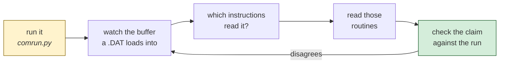

# Karateka — the code

*Document three of six. [01-the-game.md](01-the-game.md) is what the game is;
[02-architecture.md](02-architecture.md) is how the program is shaped;
[04-porting.md](04-porting.md) is what rebuilding it would take;
[05-the-fighting.md](05-the-fighting.md) reads the fighting;
[06-web-code.md](06-web-code.md) walks the port's code.*

Five things, in the order they were found rather than the order they run. Every
listing is copied from `recovered/karateka.asm` — the file that reassembles to
a byte-identical copy of the original — with comments added and nothing else
changed.

**How these were found matters as much as what they say.** Not one of them was
located by reading the disassembly from the top. Each came from running the
game under `comrun.py`, watching which addresses it touched, and following the
program's own answer. The method is at the [end](#how-each-of-these-was-found).

---

## 1. The entry stub, which decides everything after it

```nasm
    cli
    mov ax, 0x6ca
    mov ds, ax              ; DS = image + 0x6CA0
    mov ax, 0x155c
    mov ss, ax
    mov sp, 0x80
    sti
    mov ah, 0x30
    int 0x21                ; which DOS is this?
    or  al, al
    jne .ok
    mov ax, 1
.ok:
    mov [0xf], ax
    mov [0x5b], es          ; keep the PSP
    cmp byte [0xf], 2
    jl  .too_old            ; DOS 1.x -- refuse
```

**Seven instructions decide the whole shape of the analysis.** `DS` is set once
and never touched again, so code is addressed from 0 and data from `0x6CA0`, and
nothing in the program moves between segments. That is what makes an 87,990-byte
MZ executable eligible for the `.COM` route, and the `.COM` route is the one
that reaches a byte-identical rebuild.

**What transfers:** the first twenty instructions of a program tell you how to
read the rest of it. Segment registers set once mean one address space; segment
registers set repeatedly mean you are in for a much harder time.

---

## 2. The animation language

Karateka's cutscenes are not code. They are a **script**, and the interpreter's
command table sits at `DS:0x01E8` with the names beside it:

| | |
|---|---|
| `set_tune` | start a piece of music |
| `set_bg` | load a backdrop — `FUJI.BCG`, `CASTLE.BCG` |
| `set_fig` | put a figure on stage |
| `chg_fig` | change which frame that figure is showing |
| `del_fig` | take it off |
| `set_pos` | move it |
| `inc_x` | nudge it sideways |
| `do_scr` | draw the frame |
| `set_wipe` / `set_nowipe` | erase before drawing, or do not |
| `wait` | hold |
| `loop` | repeat |
| `init_sal` | initialise — **[inferred]** something to do with the sprite tables |
| `end_animation` | stop |

Fourteen verbs. A director's vocabulary: place a figure, change its pose, move
it, hold, repeat, cut.

**Two things said here were wrong, and [05-the-fighting.md](05-the-fighting.md)
corrects them.** The scripts are not only the cutscenes — the *fighting* is
written in the same language, three libraries of it, and they ship as readable
text beside the executable. And the routine at `0x1364..0x1660` is not an
interpreter but a **compiler**: each of its fourteen arms emits an opcode and
parses its arguments with `sscanf`. The opcode is twice the command index.

**Why this is the interesting part of the program.** A 1984 game that wanted a
cutscene normally hard-coded it. Karateka built a small language, which is why
its opening can cut between the hero and the fortress at all, and why the same
engine can drive both the attract sequence and the ending.

**What transfers:** when a program has to do the same *kind* of thing many times
with different content, the content stops being code and becomes data, and
something has to interpret it. That is as true of a cutscene as of a shader
graph or a build pipeline.

---

## 3. The decoder, which is not where you would look for it

Sprite data is run-length encoded, and the decoder is **one call above** the
blitter. That placement is why looking at the blitter alone produces a
confident wrong answer — there is no decompression in it, so it is easy to
conclude there is none anywhere.

```nasm
next_byte:
    cmp  byte [0x422e], 0       ; is a run still running?
    je   fetch
    mov  al, [0x422f]           ; yes: emit the run's value
    dec  byte [0x422e]
    ret
fetch:
    mov  si, [0x4220]           ; the stream pointer
    mov  al, [si - 0x76c6]
    inc  si
    cmp  al, 0x7b               ; the escape
    jne  done                   ; an ordinary byte is itself
    mov  al, [si - 0x76c5]      ; the count
    mov  byte [0x422e], al
    mov  al, [si - 0x76c6]      ; the value
    mov  byte [0x422f], al
    add  si, 2
done:
    mov  [0x4220], si
    ret                         ; AL is the byte
```

```
0x7B v c   emits v, then c more of v   -- c + 1 bytes in total
any other  emits itself
```

**The `+1` is not a rounding detail.** The escape path returns the value
immediately and *then* leaves the counter to supply `c` more. Read it as `c`
bytes and 328 of the game's 666 records decode to the wrong length — which is
exactly what happened here before this routine was found.

**What transfers:** a decoder that yields one byte per call has no notion of
"decoding a record". It stops when the caller stops asking. So "does this record
decode to exactly the right size?" is a question about a particular drawing, not
about the format — and asking it of the format produces a number that stalls and
cannot be made to move.

---

## 4. The blitter, one byte per scanline

```nasm
draw_column:
    mov  dl, [si + 0x443c]      ; one byte of shape
    inc  si
    mov  ax, [bx + 0x4234]      ; an edge mask, by pixel offset
    and  ax, [di + 0x337]       ; what is on the screen already
    mov  cl, [0x4227]           ; how far into a byte this column starts
    xor  dh, dh
    ror  dx, cl                 ; rotate the byte into position
    or   ax, dx
    mov  [di + 0x337], ax
    add  di, 0x50               ; 80 bytes -- the next scanline
    dec  byte [0x422a]
    jne  draw_column
```

`add di, 0x50` is one CGA row, so the loop walks **down a column**, and the
outer loop steps one column right. That is why the sprite data is column-major,
and why reading it row-major produces a figure lying on its side — a wrong
answer that looks like a discovery.

The `ror` is how a sprite lands on a pixel boundary that is not a byte boundary.
CGA packs four pixels to a byte, so a sprite at an odd pixel column has to be
rotated into place and merged with what is there. Writing a whole word and
masking the edges is how you do that without a shift-per-pixel loop.

**What transfers:** the two hardest constraints in this routine — pixels
narrower than the addressable unit, and a destination you must merge with rather
than overwrite — are the same two a modern GPU blend pipeline solves. The
solution has the same shape: mask, shift, combine.

---

## 5. The sprite dispatcher, and where the two streams come from

```nasm
draw_sprite:                    ; the id arrives on the stack
    push bp
    mov  bp, sp
    mov  byte [0x422c], 0       ; reset the shape stream's run state
    mov  byte [0x422e], 0       ; reset the mask stream's run state
    mov  si, [bp + 4]           ; the sprite id
    shl  si, 1
    mov  bx, [si + 0x423c]      ; the shape record's address
    mov  [0x421e], bx           ;   -> the shape stream pointer
    mov  ax, [si - 0x78c6]      ; the mask record's address
    mov  [0x4220], ax           ;   -> the mask stream pointer
    mov  al, [bx + 0x443c]      ; width, from the shape record's header
    mov  [0x4222], al
```

**Two tables, two streams, one id.** This settles what the twenty-eight paired
files are for: `KS*` holds shapes, `KM*` holds masks, and a sprite is one
address from each table decoded in lockstep. Both run through the decoder in
section 3, with separate pointers and separate run state — `0x421E`/`0x422C` for
one and `0x4220`/`0x422E` for the other.

Rendering a matched pair shows it plainly: the `KS` record carries the figure
with its internal detail, the `KM` record the same figure as a solid
silhouette, at identical dimensions.

**Note the prologue.** `push bp / mov bp, sp`, the argument at `[bp + 4]`. That
is a C compiler's calling convention, and it is the thread that leads to
`Lattice C 2.1` sitting at the start of the data segment — see
[02-architecture.md](02-architecture.md#it-is-a-c-program-and-it-says-so).

---

## How each of these was found

None of it by reading from the top. 10,589 instructions is too many to read and
too few to search blindly.



The loop is the method, and it converged in four passes:

1. Hooking `KS0.DAT`'s buffer named fourteen instructions; two accounted for
   385,000 of 397,000 reads. Those two were the blitter — **section 4**.
2. The blitter contains no decompression, which produced the confident wrong
   conclusion that there is none. Hooking `KM0.DAT` instead named a different
   routine — the decoder, **section 3** — sitting one call earlier.
3. Following what set the decoder's stream pointers led to the dispatcher,
   **section 5**, and to the two tables.
4. The dispatcher's prologue led to the compiler, and the compiler's runtime
   strings led to the animation vocabulary sitting beside them — **section 2**.

Each step was a question put to the running program, not to the listing. The
listing answered afterwards.

---

## Reading the rest

`recovered/karateka.asm` covers the whole load image and reassembles to the
original exactly, header and all.

- **Labels** are `L_xxxxx`, named after the image offset. **Add `0x200` for a
  file offset** — the MZ header is stripped before the walk.
- **`db` lines with a comment** are instructions pinned to a fixed encoding.
  They execute; they are just spelled in bytes.
- The honest limits are at the end of
  [02-architecture.md](02-architecture.md#what-is-still-unknown). The largest is
  that this document covers the drawing and the scripting, and says almost
  nothing about the fighting.
