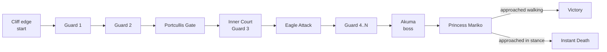
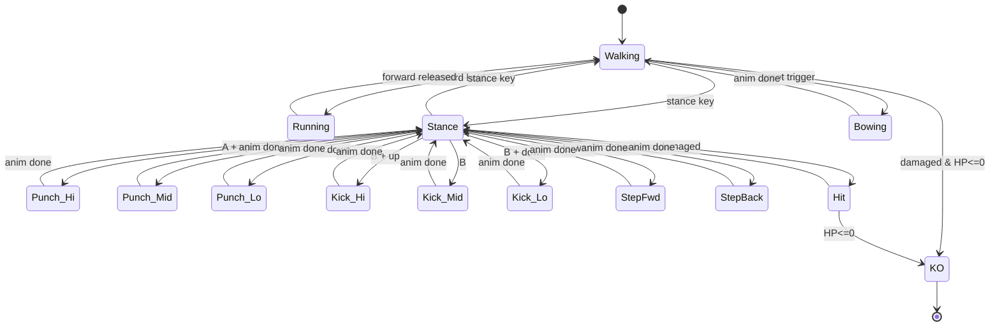
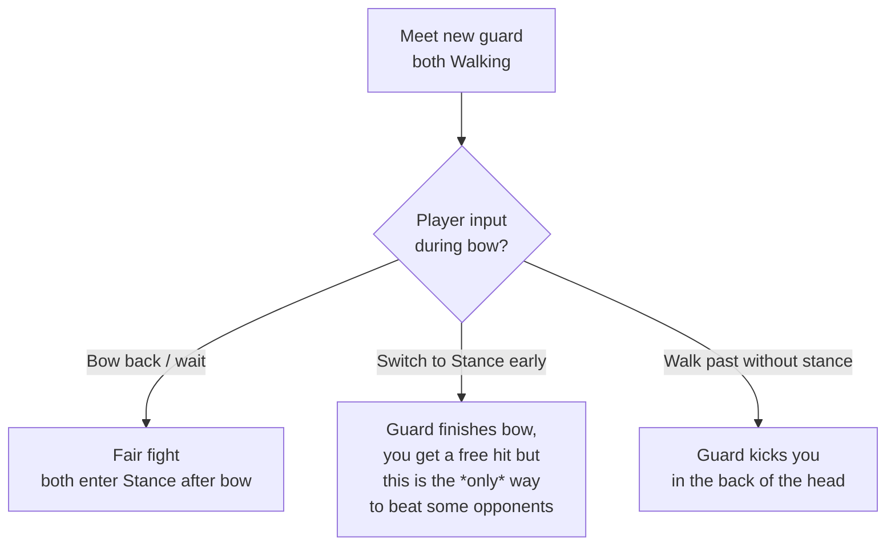
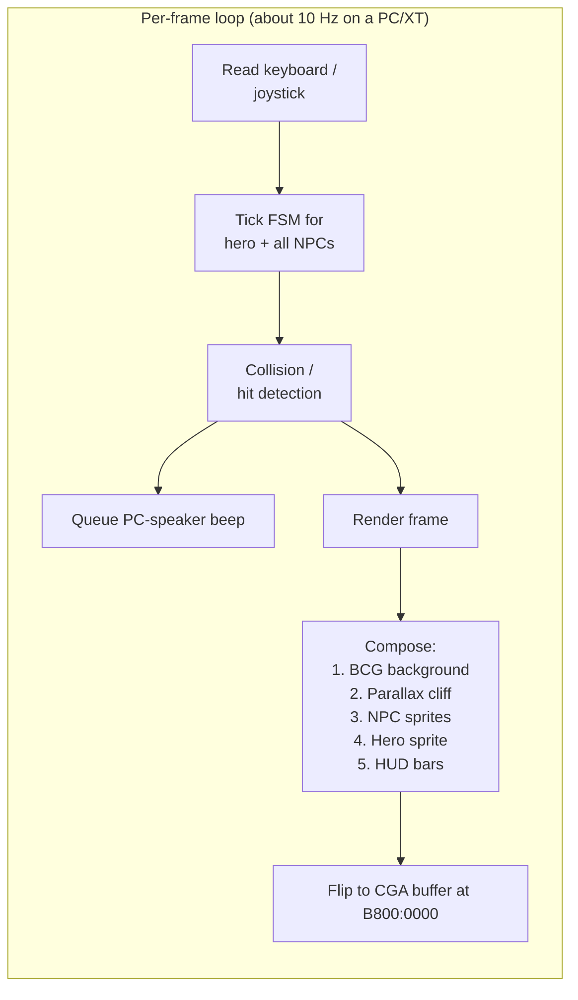

# 01 — Karateka: Game Logic & Concept

> Goal: explain *what Karateka is doing* under the hood — the model, not the bytes.

## 1. One-paragraph premise

You play a young karateka who must storm the cliff-top fortress of the warlord **Akuma**, defeat his guards one-by-one along a forced left-to-right path, fend off his trained **eagle**, kill Akuma himself, and rescue **Princess Mariko**. One life, no continues, no save: it is a *cinematic action* game where pacing, distance, and bowing manners matter as much as button-mashing.

## 2. Why the game matters technically

Jordan Mechner wrote Karateka on the Apple II in 1984 as a Stanford undergrad project. It pioneered three things that *every* modern fighting / action game still does:

| Innovation | What it really is |
|---|---|
| **Rotoscoped sprites** | He filmed his karate-instructor brother and traced the frames — that's why the karateka *moves like a real person*. |
| **Two-stance combat** | Walking vs. fighting stance — the same character is *a different state machine* depending on stance. |
| **Cinematic cutaways** | The camera literally cuts away to show Akuma sneering, the eagle launching, the princess waiting. This is the *first* game to do CG cutscenes inline. |

The PC port you have (`KARATEKA.EXE`, 87,990 bytes, MZ header, 4 reloc entries) is a near-direct hand-written 8086 assembly translation of the 6502 Apple original — that is why the EXE is so small.

## 3. The world model

A Karateka level is a 1-D corridor. Logically the game has only one "tape" the camera scrubs over:

Everything in the game — terrain, enemies, cutscenes, the eagle's swoop, the portcullis trap — is just **events triggered by player X-coordinate** along this tape.

## 4. The player as a finite-state machine

This is the heart of the game. Each character (hero, every guard, even Akuma) runs the *same* FSM with different stat tables.

Key facts the diagram encodes:

- **Stance is modal.** You cannot attack from Walking. Attempting to walk past an enemy *in stance* is what triggers most combat.
- **Attacks are not interruptible.** Once you commit to a kick, the animation plays out — that is why timing matters.
- **There is no "block".** Defense is *distance*: step back, or be out of reach.
- **HP recovers only between fights**, not during one.

## 5. The "etiquette" sub-system — Karateka's signature trick

When the hero meets a new guard, both characters are in Walking stance. There is a short window where the AI bows. The player's input during that window decides the encounter:

This is why Karateka feels different from every other 1984 brawler: it has *manners*, and manners are mechanics.

## 6. Special events along the corridor

| Trigger (player X) | Event | Required action |
|---|---|---|
| Mid-level | **Portcullis** — iron gate starts to fall | Sprint through; release just before it lands |
| After portcullis | **The Eagle** swoops from background | High kick at the exact frame |
| Penultimate room | **Akuma** (faster, more HP) | Same FSM, harder stats |
| Final room | **Princess Mariko** | Must enter Walking stance *before* the threshold tile |

The Princess kick is the game's most famous troll: a victory animation that turns into instant death if your stance flag isn't cleared. Internally it's just a hidden enemy with one move and one trigger.

## 7. The render & audio model (high level)

- **Backgrounds**: `CASTLE.BCG`, `FUJI.BCG` — full-screen CGA images, drawn once per scene.
- **Sprites**: every `K?*.DAT` + `K?*.IND` pair is a sprite pack — `IND` is a `(sprite_id, byte_offset_in_DAT)` lookup table, `DAT` is RLE-compressed CGA pixel rows. Prefixes:
  - `KM*` / `KS*` — Movement / Stance frames for character 0 (hero) through 4 (Akuma / boss).
  - `KMI*` / `KSI*` — Mirrored (`I` = inverse / facing-left) variants.
  - `KMJ*` / `KSJ*` — Jumping or jeopardy frames (eagle / falling guard).
  - `KMC*` / `KSC*` — Common cutscene frames (princess, Akuma close-ups).
- **Animation scripts**: `ALLBAL`, `ALLCAL`, `ALLGAL`, `ALLPAL`, `ALLVAL` + the per-segment `BAL0x` / `CAL0x` files are tiny byte-code lists: each frame is a *list of draws* (sprite_id, dx, dy) compositing a pose from primitive shapes. This is the Mechner trick that lets a single guard with ~30 base shapes produce hundreds of poses.
- **Sound**: PC speaker only — beep frequencies driven by timer-channel-2.

## 8. Why Karateka feels "slow but readable"

Three deliberate design choices, all visible in the FSM:

1. **One action per state.** No combo system — committing matters.
2. **Animation duration *is* the timing window.** A kick lasts 6–8 frames; an opponent's punch lasts 5. Whoever started later, hits later.
3. **HP is binary segments, not continuous.** The bar has discrete chunks, so a "good hit" is observable.

That is the whole concept: *one corridor, one body, one breath at a time*.
