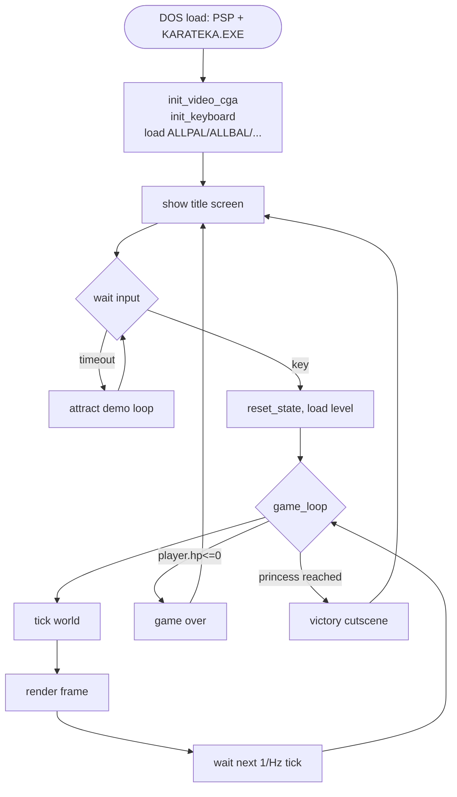
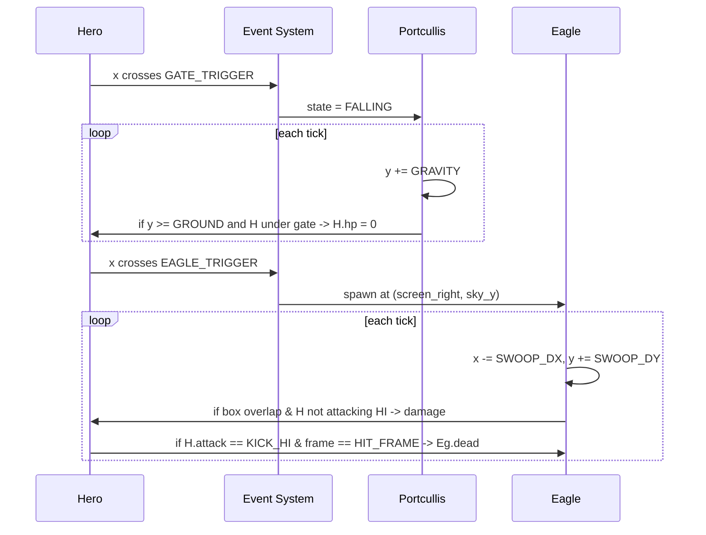
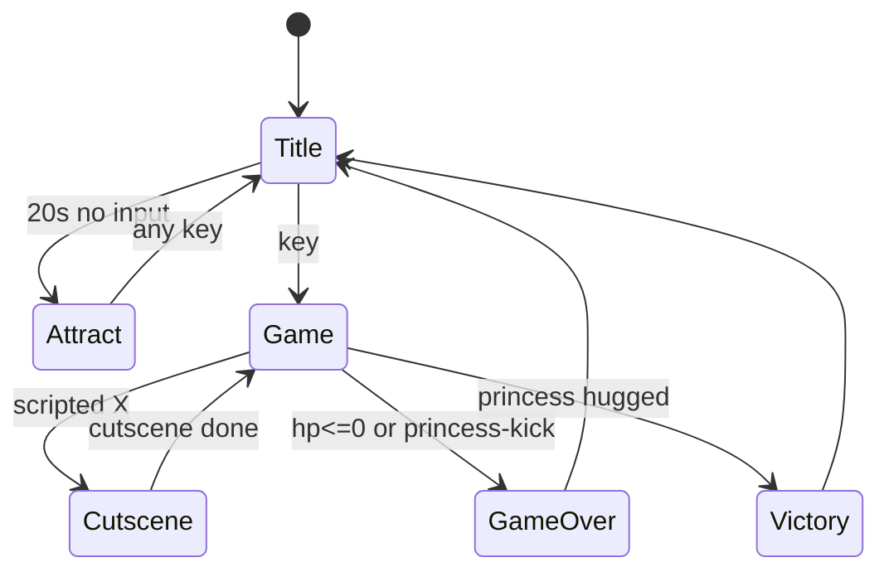

# 02 — Karateka: Pseudo-code

> Goal: show *what* the engine does each tick, in language-agnostic pseudo-code.
> Numbers in comments are observed from the data files (`KARATEKA.EXE = 87,990 bytes`, sprite packs `K?*.DAT + .IND`, palette files `ALLPAL`, etc.).

---

## 0. Top-level architecture



---

## 1. The main loop

```pseudocode
procedure main():
    set_video_mode(CGA_320x200x4)              # INT 10h, AX=0004h
    install_timer_isr(60_Hz)                   # INT 08h hook, gives a frame-clock
    install_keyboard_isr()                     # INT 09h hook, raw scancodes
    load_palette("ALLPAL")
    load_anim_scripts("ALLBAL","ALLCAL","ALLGAL","ALLVAL")
    load_background("FUJI.BCG")

    while True:
        run_title_and_demo()
        run_game()
        run_game_over_or_victory()
```

---

## 2. Per-frame tick

```pseudocode
procedure game_loop():
    while player.alive and not victory:
        # ---- INPUT --------------------------------------------------
        keys = read_keyboard_buffer()          # from ISR ring buffer

        # ---- WORLD UPDATE ------------------------------------------
        update_hero(keys)
        for npc in scene.npcs:
            update_npc(npc)
        resolve_collisions()                   # hits, scenery, eagle, gate
        run_scripted_events(hero.x)            # portcullis, eagle launch, etc.

        # ---- RENDER ------------------------------------------------
        clear_dirty_rects()
        draw_background(scene.background)
        for s in scene.sorted_sprites_by_z():
            draw_sprite(s.id, s.x, s.y)
        draw_hud(hero.hp, top_enemy.hp)
        page_flip()

        # ---- TIMING ------------------------------------------------
        wait_until(next_frame_tick)            # ~10 fps on a 4.77 MHz XT
```

---

## 3. The character FSM

Every character — hero and NPC — is one record of:

```pseudocode
struct Actor:
    x, y            : int           # world position, pixels
    facing          : {LEFT, RIGHT}
    stance          : {WALK, FIGHT, KO}
    state           : enum          # current pose
    anim_id         : int           # current animation sequence id
    anim_frame      : int           # index inside that sequence
    anim_timer      : int           # ticks remaining on this frame
    hp              : int           # 0..MAX_HP
    ai              : AIType        # NONE for hero
    hitbox_offset   : (dx,dy,w,h)   # derived from anim_id+anim_frame
```

### 3.1 Hero update

```pseudocode
procedure update_hero(keys):
    if hero.state is in {ATTACKING, HIT, BOWING}:
        tick_animation(hero)                   # locked until anim ends
        return

    if keys.toggle_stance_pressed:
        hero.stance = (FIGHT if hero.stance==WALK else WALK)
        play_anim(hero, anim_for("toggle_stance"))
        return

    if hero.stance == WALK:
        if keys.right: hero.x += WALK_SPEED;  play_anim(hero,"walk_right")
        elif keys.left: hero.x -= WALK_SPEED; play_anim(hero,"walk_left")
        else:                                 play_anim(hero,"idle_walk")
    else:  # FIGHT stance
        action = decode_attack(keys)
        if action != NONE:
            play_anim(hero, anim_for(action))
            hero.state = ATTACKING
        elif keys.right: hero.x += STEP;      play_anim(hero,"step_fwd")
        elif keys.left:  hero.x -= STEP;      play_anim(hero,"step_back")
        else:                                 play_anim(hero,"stance_idle")
```

```pseudocode
function decode_attack(keys):
    # The PC port uses: A = punch, B = kick, +Up high, +Down low
    if keys.punch and keys.up:    return PUNCH_HI
    if keys.punch and keys.down:  return PUNCH_LO
    if keys.punch:                return PUNCH_MID
    if keys.kick  and keys.up:    return KICK_HI
    if keys.kick  and keys.down:  return KICK_LO
    if keys.kick:                 return KICK_MID
    return NONE
```

### 3.2 NPC update (guards, Akuma, eagle)

```pseudocode
procedure update_npc(npc):
    if npc.state in {ATTACKING, HIT, KO}:
        tick_animation(npc); return

    dx = hero.x - npc.x
    dist = abs(dx)

    # 1. Approach / etiquette
    if not npc.has_bowed and dist < BOW_DIST:
        play_anim(npc, "bow"); npc.has_bowed = True; return

    # 2. Stance
    if dist < FIGHT_DIST and npc.stance == WALK:
        npc.stance = FIGHT; play_anim(npc, "to_stance"); return

    # 3. Combat AI — a tiny weighted table per character
    if dist < ATTACK_REACH:
        move = npc.ai.pick_move(hero.last_action, hero.recent_hits)
        play_anim(npc, anim_for(move))
        npc.state = ATTACKING
    elif dist < ENGAGE_DIST:
        npc.x += sign(dx) * STEP            # close in
        play_anim(npc, "step")
    else:
        play_anim(npc, "stance_idle")
```

`npc.ai.pick_move` is *not* heuristic — Karateka uses pre-baked **attack patterns** per guard tier. Guard 1 has a 2-move loop; later guards have 6+ moves with reactive entries. These tables are part of the data files (`ALLCAL` = "all character action lists").

### 3.3 Collision / hit resolution

```pseudocode
procedure resolve_collisions():
    for attacker in actors:
        if attacker.state != ATTACKING: continue
        if attacker.anim_frame != HIT_FRAME(attacker.anim_id): continue
        box = world_hitbox(attacker)              # tip-of-fist / tip-of-foot
        for target in actors:
            if target is attacker: continue
            if box overlaps body_box(target):
                damage = damage_table[attacker.anim_id][attacker.role]
                target.hp -= damage
                play_anim(target, "hit")
                queue_beep(HIT_FREQ, HIT_DURATION)
                if target.hp <= 0:
                    play_anim(target, "ko")
                    target.state = KO
```

Two important details:

- Only the *single frame* `HIT_FRAME(anim_id)` of an attack can connect — that's why timing matters. A kick that started "a frame too early" whiffs.
- `body_box(target)` shrinks when the target is mid-step — the recoil animation moves the hurtbox out of reach. This is how step-back defense works.

---

## 4. Scripted events along the corridor

```pseudocode
procedure run_scripted_events(hero_x):
    for evt in level.events:
        if not evt.fired and hero_x >= evt.trigger_x:
            spawn(evt)                # gate falling, eagle launching, etc.
            evt.fired = True
```



---

## 5. Sprite renderer (the heart of the data-file format)

Each animation script tells the renderer *which composite to draw*:

```pseudocode
function play_anim(actor, name):
    actor.anim_id = anim_table[name]      # index into ALLBAL/ALLCAL list
    actor.anim_frame = 0
    actor.anim_timer = frame_duration[actor.anim_id][0]

function tick_animation(actor):
    actor.anim_timer -= 1
    if actor.anim_timer <= 0:
        actor.anim_frame += 1
        if actor.anim_frame >= frame_count[actor.anim_id]:
            on_anim_end(actor)
        else:
            actor.anim_timer = frame_duration[actor.anim_id][actor.anim_frame]
```

```pseudocode
procedure draw_sprite(anim_id, frame, x, y, facing):
    # An anim frame is a list of (shape_id, dx, dy) draws.
    composite = anim_frames[anim_id][frame]
    for (shape_id, dx, dy) in composite:
        if facing == LEFT:
            dx = -dx
            shape = mirror_table[shape_id]    # KMI / KSI variants
        else:
            shape = shape_id                  # KM  / KS  variants
        blit_rle_sprite(shape, x+dx, y+dy)
```

```pseudocode
procedure blit_rle_sprite(shape_id, x, y):
    pack = sprite_pack_for(shape_id)          # which K*.DAT
    offset = IND[shape_id].byte_offset        # from K*.IND
    width_bytes = DAT[offset]                 # 1st byte = row width in bytes
    height      = DAT[offset+1]
    p = offset + 2
    for row in 0..height-1:
        decode_rle_row(DAT, p, vram_at(x, y+row), width_bytes)
        p += compressed_row_size
```

The CGA hardware is plain framebuffer at `B800:0000`, 16 KB, two interleaved banks of even/odd scanlines.

---

## 6. Title / attract / cutscene flow



Cutscenes are *the same renderer* — they just play scripted actor positions instead of reading keys.

---

## 7. Memory budget (what you'd plan if writing this today)

| Region | Approx size | Purpose |
|---|---|---|
| Executable code | ~60 KB | All game logic, fits easily in one segment |
| Active sprite packs | ~30 KB | Hero + 1–2 NPCs loaded at a time |
| Current background | 16 KB | CGA full-frame image |
| Animation scripts | ~10 KB | `ALL*` files kept resident |
| Stack + working RAM | ~4 KB | Actor records (≤8 actors) |
| **Total** | **~120 KB** | Comfortably fits in 128 KB minimum, with room for DOS |

The whole runtime model is *less than a single modern texture*.
