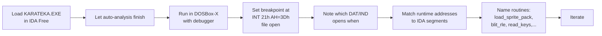

# 03 — Can KARATEKA.EXE be decompiled / disassembled?

> **Short answer**: **Disassembled — yes, completely.** **Decompiled to C-like source — only partially, and with manual effort.** Here's the why and the how.

---

## 1. What's actually in the file

From the MZ header I parsed:

| Field | Value | Meaning |
|---|---|---|
| Signature | `MZ` | Standard DOS executable, real-mode 16-bit 8086/8088 |
| File size | 87,990 bytes | Tiny — fits in L1 of any modern CPU |
| Header size | 512 bytes (32 paragraphs) | Normal |
| Code+data | ~87,478 bytes | Single load image, no overlays |
| Relocation entries | **4** | *Extremely* low → almost all addressing is relative; hallmark of **hand-written assembly**, not a compiler |
| Initial CS:IP | `0000:0002` | Entry point is a 2-byte `JMP` at the very start — classic hand-rolled ASM convention |
| Initial SS:SP | `005C:0080` | Stack set up by hand |
| Min/Max alloc | 9 / 255 paragraphs | Game asks for very little extra RAM |

There is **no packer signature**, no LZEXE/PKLITE/EXEPACK marker. The image is *raw machine code* you can read directly.

The data files (`K*.DAT/IND`, `ALL*`, `*.BCG`) are independent — they are loaded by the EXE at runtime via `INT 21h` file I/O, not embedded.

## 2. Disassembly — fully feasible

### Why it works well

- 16-bit real-mode x86 has no anti-debugging, no ASLR, no symbol stripping problem (there were never symbols to strip).
- Only 4 relocation entries means almost every jump and call is *intra-segment*, so a disassembler can resolve targets confidently.
- The data files are *not* in the EXE, so you don't have to separate code from sprite blobs — the EXE is mostly code + a small constant pool.
- The community has already disassembled both the Apple II and IBM PC versions; there is reference material to cross-check against.

### Recommended tools (in order)

| Tool | Why use it |
|---|---|
| **IDA Free** (free, Windows) | Best 16-bit MZ support; auto-recognizes DOS API calls (`INT 21h` etc.); interactive renaming. |
| **Ghidra** (free, open source) | Loads MZ EXEs; weaker on 16-bit segmented memory than IDA but improving; you can script in Java/Python. |
| **radare2 / Cutter** (free) | Good 16-bit support, scriptable, has a GUI in Cutter. |
| **DOSBox-X + built-in debugger** | You already have it on PATH. `dosbox-x -machine pcjr` or default, then `F12 → debugger`, gives single-step + memory view + register dump on the *running* program — perfect for confirming what a static disassembler suggests. |
| **DEBUG.COM** (inside DOSBox) | The original 1980s way — `debug KARATEKA.EXE`, then `u` to unassemble, `t` to trace. Crude but always available. |

### A practical workflow



Concrete first steps inside DOSBox-X:

```
C:\> debug KARATEKA.EXE
-r                    ; show registers
-u cs:0002            ; unassemble entry
-g 100                ; run until offset 100
```

Or, with the integrated debugger (`Debug → Start Debugger` in DOSBox-X menu, or `Ctrl-F1` to map a key):

- `BPINT 21` — break on every DOS call (you'll see every file open, every keystroke read).
- `BPINT 10` — break on video calls (mode set, palette).
- Memory view at `B800:0000` shows the CGA frame buffer being composed in real time.

### What you can recover

Within a few hours of work you can identify:

- The frame loop (calls to `INT 21h AH=2Ch` / timer reads).
- The keyboard handler (vector 09h hook).
- The sprite blit inner loop (it touches `B800:0000` repeatedly).
- The file loader (`INT 21h AH=3Dh/3Fh`).
- The animation script interpreter (small switch-style code reading from `ALL*` buffers).

With a few weekends you can rebuild the whole call graph.

## 3. Decompilation to C — partially feasible

A "decompiler" turns machine code into approximate high-level source. Results depend heavily on what the original was written in.

| Original language | Decompiler quality |
|---|---|
| C compiled by Microsoft C / Turbo C | ★★★★ — Ghidra/IDA Hex-Rays produce *readable* C |
| Pascal (Turbo Pascal) | ★★★ — runtime stubs are recognizable |
| **Hand-written assembly** (Karateka) | ★ — decompiler will emit *C-shaped* output, but it's just transliterated asm: `goto loc_1234`, raw segment math, no real types |

Evidence Karateka is hand-written asm:

1. The Apple II original (1984) was 6502 assembly — Mechner has said so publicly. The PC port followed the same approach.
2. Only **4 relocation entries** in a 88 KB binary. A Microsoft C or Turbo Pascal program of this size would typically have **hundreds** (each absolute pointer in static data needs one). Hand-written asm uses relative jumps and `DS`-relative addressing throughout, requiring almost none.
3. No recognizable C runtime startup (no `_acrtused`, no `__argc` setup pattern at entry).
4. No Pascal RTL signatures either.

So the realistic ceiling is:

- **Hex-Rays / Ghidra decompiler will produce output**, but it'll read more like annotated assembly than real C.
- You will get more value from **disassembly + manual reconstruction** than from running a decompiler blind.

## 4. What about the data files?

Decompilation here means *format reverse-engineering*, not source recovery.
The companion script `extract_karateka.py` (in this directory) decodes the
formats below. **Confirmed empirically** by running it against every file:

- **`*.IND`** — 4-byte rows: `(sprite_id : u16 LE, byte_offset : u16 LE)`.
  Tail is padded with `0x80` bytes, decoding as the sentinel row
  `(0x8080, 0x8080)` — the parser stops there. Every pack ends with one
  `0xFFFF` entry of length 128, which appears to be a blank/null shape.
  Across 28 packs the entry counts range from 12 (`KM0`, hero core) to 61
  (`KMC`, cutscene character).
- **`*.DAT`** — pool of opcode-coded "shapes". Offsets in `.IND` can jump
  backward (e.g. in `KM0`: `..., 232, 262, 340, 425, 544, 661, 760, 841`),
  which means shape streams share suffixes. Statistical analysis flags
  `0x7B` as the dominant non-pixel byte, almost certainly a row-break /
  control opcode. The exact opcode set still needs a DOSBox-X debugger
  trace of the blit routine to nail down — `extract_karateka.py raw`
  renders two visual *guesses* per shape (flat bitmap + 0x7B-as-rowbreak)
  for inspection.
- **`*.BCG`** — full-screen CGA background, **linear layout** (line-
  sequential, *not* CGA-mode-4 bank-interlaced as I first assumed).
  `CASTLE.BCG` is 15,360 bytes = 192 lines × 80 bytes, 4-color CGA
  (palette 1: black / cyan / magenta / white), 2 bpp MSB-first within
  each byte. Decoded result *is* the iconic Akuma-fortress title screen.
  `FUJI.BCG` (2,816 bytes) is smaller and appears to use a mask-and-pixel
  layout for compositing — needs more work.
- **`ALL*`, `BAL0x`, `CAL0x`** — small animation / per-segment scripts,
  not yet decoded; sizes (89 B … 10 KB) and naming pattern strongly
  suggest *frame composition lists* (`(shape_id, dx, dy)` triples) keyed
  by anim name.

Community tools (**Camoto**, **DROD-utils**, scattered community efforts)
cover some related Brøderbund formats. Reverse-engineering the rest end-
to-end is a few weekends of work using IDA + DOSBox-X.

## 5. Legal note

KARATEKA is still under copyright (Jordan Mechner / Brøderbund / Karateka Classic on modern platforms). For *personal study*, disassembly and decompilation are generally fine in most jurisdictions (US: fair use / 17 U.S.C. §1201(f) interoperability exception; EU: Software Directive Art. 6 decompilation for interoperability). Redistributing the binary, the disassembly, or large verbatim chunks of recovered source is **not** safe — keep recovered notes private and rewrite anything you reuse from scratch.

## 6. Verdict

| Question | Answer |
|---|---|
| Can the EXE be disassembled? | **Yes, completely.** Use IDA Free or Ghidra; verify with DOSBox-X debugger. |
| Can it be decompiled to C? | **Partially.** Output will be transliterated asm because the original is hand-written assembly. |
| Can the data files be decoded? | **Yes, easily.** Formats are simple table + RLE. |
| Is it worth doing? | For learning: **absolutely** — you'd see how a 1984 console-quality action game fits in 88 KB. For shipping a remake: **no** — just learn the design and rewrite. |
