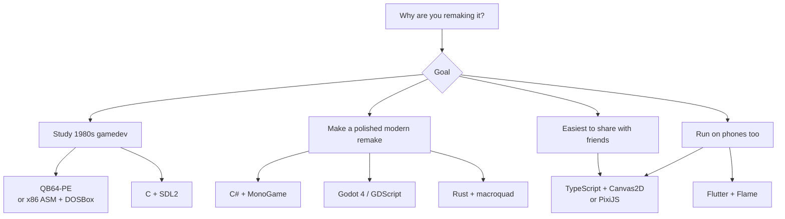
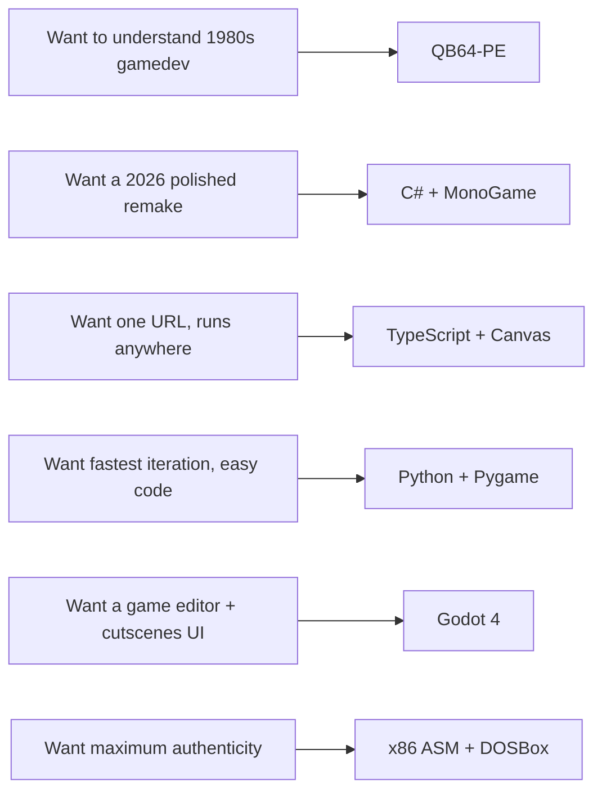

# 04 — What's the best language to remake Karateka?

> **TL;DR**
> - For **learning how 1980s games were built**: write it in **QuickBASIC (QB64)** or **C with SDL2** — closest to the era's mental model.
> - For a **modern, portable, share-it-with-anyone remake**: **TypeScript + HTML5 Canvas** (one tab in any browser, no install).
> - For **best balance of "feels modern" + still small**: **Python with Pygame** *or* **C# with MonoGame / Godot**.
>
> "Best" depends on your real goal — see the matrix below.

---

## 1. What Karateka actually needs from a language

The game has very modest requirements; you can ship it in almost anything. The decision is really about *audience*, *toolchain pain*, and what you want to *learn*.

| Requirement | Notes |
|---|---|
| 2D blitting of ~512×200-ish sprites at ~10–30 fps | Trivial on any platform from 1990 onward. |
| Keyboard input (8 keys total) | Trivial everywhere. |
| ~30–50 small sprite sheets | Easy. |
| Side-scrolling with parallax | Easy. |
| Beeps / chiptune (PC speaker era) | Easy with WebAudio, OpenAL, FMOD, etc. |
| No 3D, no networking, no save system | Massive simplification. |

So the language question is *which toolchain do you want to live in for the next 20–80 hours*.

---

## 2. The candidates

---

## 3. Side-by-side

| Language / stack | Best for | Pros | Cons |
|---|---|---|---|
| **QuickBASIC (QB64-PE)** | Learning the era | Free, single-file `.bas`, near-1:1 with how DOS games felt. Built-in `_PUTIMAGE`, `_KEYDOWN`. | Tiny community, fewer libraries, weird quirks. |
| **C + SDL2** | Closest to "real" 1980s gamedev with modern tooling | Tiny binaries, deterministic, runs on Win/Mac/Linux/web (via emscripten). | Manual memory mgmt, slow iteration. |
| **C# + MonoGame** | Polished modern 2D, easy ship to Windows/Mac/Linux/iOS/Android | Mature, used by Stardew Valley/Celeste, great tooling (Rider/VS). | Heavy runtime for such a small game. |
| **Godot 4 (GDScript)** | Fastest path to a playable build | Free, scene tree fits sprite-based 2D perfectly, exports to *every* platform incl. HTML5. | New API, you'll fight engine assumptions for retro pixel scaling. |
| **Python + Pygame** | Hobby project, easy to read | Very short code, huge tutorial base. | Distribution is painful (PyInstaller, big binaries). |
| **TypeScript + HTML5 Canvas / PixiJS** | Maximum reach (anyone with a browser) | Zero install, free hosting (GitHub Pages, itch.io), perfect for a "T-Rex style" remake. | JS quirks, asset loading & input mapping take care. |
| **Rust + macroquad / Bevy** | If you also want to learn modern systems language | Fast, single binary, growing 2D ecosystem. | Bevy is overkill; macroquad is fine. Compile times. |
| **Java + libGDX** | Java-heavy environment, Android target | Mature, free, cross-platform. | Lots of boilerplate; tooling heavier than the game. |
| **x86 assembly + TASM/NASM, run in DOSBox** | Full era authenticity | You will *understand* every byte. | Slow, painful, fun. |

---

## 4. Specifically about your four candidates

### QB (QuickBASIC / QB64-PE)

- Use **QB64-PE** (modern, runs natively on Windows 10/11). It's the right call if your goal is to feel what 1984 programmers felt — but it has long since lost mainstream tooling, so debugging is rougher than the alternatives.
- **Verdict**: great for *one* learning project. Not great for a polished remake.

### Java

- Solid, mature, cross-platform. Use **libGDX** (not raw AWT/Swing). Performance is fine.
- **Downside for Karateka**: heavyweight for a tiny game. You'll spend more time on Gradle than on the karateka.
- **Verdict**: fine if you're already a Java person. Not the *first* choice for a small retro 2D game in 2026.

### Python

- **Pygame** or **arcade** are perfect for the *coding part*. Iteration is fast, code reads like pseudo-code, you'll have a playable prototype in a weekend.
- **Downside**: shipping a polished `.exe` to non-Python users is irritating (PyInstaller). Performance is fine for Karateka but you may hit issues if you scale up.
- **Verdict**: **excellent for prototyping and learning**, weaker for distribution.

### "Else" — what I'd actually pick today

For a project that is *one* game, single developer, want it playable by friends without "install this 600 MB engine":

1. **TypeScript + Canvas2D (no engine, or PixiJS if you want sprite batching)** — see file `05-trex-style-remake.md` for why this aligns perfectly with the "T-Rex offline game" aesthetic you mentioned.
2. **Godot 4** if you want a *game editor* that helps with cutscenes and timelines (Karateka has real cutscenes).
3. **C# + MonoGame** if you want it to feel like Celeste's tech: tight loop, good debugger, single executable per platform.

---

## 5. Decision matrix (pick your row)

---

## 6. My one recommendation

If you only do one of these:

> **TypeScript + HTML5 Canvas2D, ~600 lines, hosted on GitHub Pages.**

Why:
- The mechanic is *exactly* the kind of thing Canvas is good at.
- You already mentioned the T-Rex offline game in task 5 — that game is a 1-file Canvas2D project. The same architecture fits Karateka.
- Zero install for players. One commit to deploy.
- You can later port the same logic to anywhere (the FSM in pseudo-code in `02-pseudo-code.md` is language-agnostic).
- Free profiler in DevTools, free debugger, free art pipeline (PNG sprite sheets).

If you specifically want the *learning* outcome ("how were games made in the past?"), then in parallel make a tiny **QB64-PE** version of the title screen and walking animation — half a weekend, and you'll feel the difference viscerally.
