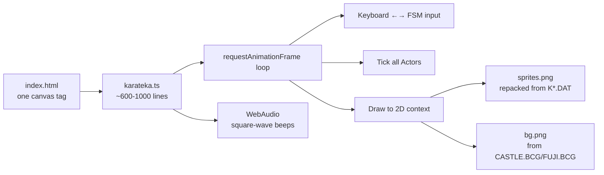
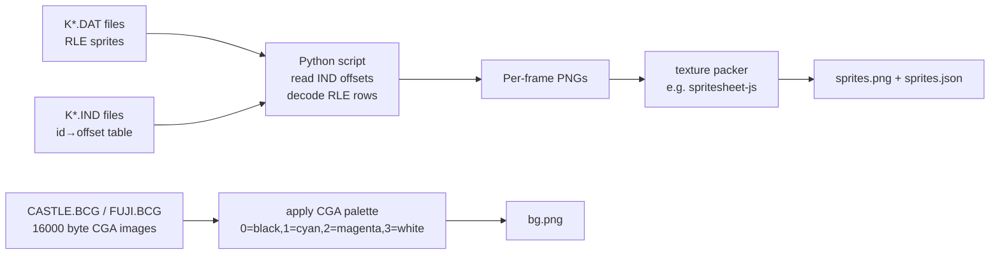
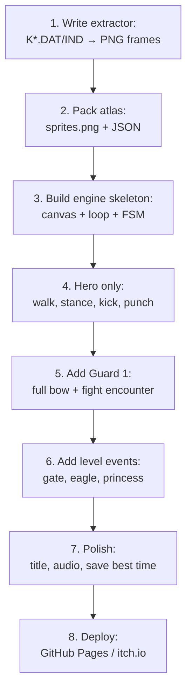

# 05 — Can Karateka be remade in the style of Chrome's T-Rex offline game?

> **Yes — and it's a remarkably good fit.** The T-Rex offline game (`chrome://dino`) is a single Canvas2D file, ~80 KB of JS, runs in any browser, no install, no server. Karateka's core loop (one-axis movement, sprite-based combat, scripted events) maps cleanly onto exactly that architecture.

---

## 1. What the T-Rex game actually is, technically

It's worth being precise about the model you want to copy:

| T-Rex game property | Karateka equivalent |
|---|---|
| Side-scrolling 1-D world | ✅ Karateka is also 1-D |
| Sprite sheet drawn to `<canvas>` 2D context | ✅ Karateka sprites are flat 2D too |
| Pixel-art, no shaders | ✅ Karateka is 4-color CGA pixel-art |
| Game loop driven by `requestAnimationFrame` | ✅ Replaces the DOS 60 Hz timer ISR |
| One sprite sheet, one PNG | ✅ You can pack `K*.DAT` into one PNG |
| Keyboard input (Space / Up) | ✅ Karateka also has very few keys |
| ~80 KB total payload | ✅ Karateka's whole EXE is only 88 KB |
| Procedural difficulty | ✘ Karateka has *scripted* difficulty — you'd swap procedural cactus spawning for a scripted enemy list |

So the architecture transfers almost 1:1; you just swap the *content engine* (random obstacle spawner → scripted FSM).

---

## 2. Architecture for a Karateka-in-T-Rex-style remake



Roughly:

```text
src/
  index.html          ~30 lines: one <canvas>, one <script>
  main.ts             game loop, scene switching
  actor.ts            Actor class, FSM, hitboxes
  hero.ts             hero-specific input → state
  ai.ts               per-guard attack patterns
  anim.ts             frame tables, animation playback
  sprites.ts          sprite atlas access
  audio.ts            tiny WebAudio beep helper
  level.ts            list of scripted events along X axis
assets/
  sprites.png         atlas (~200 frames × 40×60 px ≈ 1 MB raw, ~150 KB PNG)
  bg.png              ~640×200, parallax-tiled
```

Total deliverable: one HTML file, one PNG, one JS bundle. Drag and drop onto **GitHub Pages** or **itch.io** and it works for anyone with a browser, *exactly* like the T-Rex page.

---

## 3. What needs to be done

### 3.1 Extract assets from the DOS files

Since the data files are on disk (`KM*.DAT/IND`, `KS*.DAT/IND`, `*.BCG`), a small Python/Node script can convert them:



The decoding logic is described in `02-pseudo-code.md` §5 and `03-decompile-disassemble.md` §4. Realistically a weekend of work to nail down the exact RLE encoding for one character, then the rest follows.

### 3.2 The game loop (essentially T-Rex's loop, swapped content)

```typescript
// ~30-line skeleton, identical in shape to chrome://dino
const ctx = (document.getElementById('c') as HTMLCanvasElement).getContext('2d')!;
let last = performance.now();

function frame(now: number) {
  const dt = (now - last) / 1000; last = now;
  input.read();
  world.tick(dt);
  world.draw(ctx);
  requestAnimationFrame(frame);
}
requestAnimationFrame(frame);
```

Each `Actor` is the FSM from `02-pseudo-code.md` §3. The scripted events (portcullis, eagle, princess) are entries in a `level.events: {triggerX, fire(world)}[]` list.

### 3.3 Input mapping

T-Rex uses Space/Up. Karateka needs:

| Key | Action |
|---|---|
| Space | Toggle stance (walk ↔ fight) |
| ←/→ | Move / step |
| ↑/↓ | Attack height modifier |
| Z | Punch |
| X | Kick |

All of these are 5–10 lines with `addEventListener('keydown'...)` and a single `pressed: Set<string>` mirror.

### 3.4 Audio

PC speaker beeps map to WebAudio square-wave oscillators — about 15 lines:

```typescript
const ac = new AudioContext();
export function beep(freq: number, ms: number) {
  const o = ac.createOscillator(); o.type = 'square'; o.frequency.value = freq;
  o.connect(ac.destination); o.start(); o.stop(ac.currentTime + ms/1000);
}
```

### 3.5 Pixel scaling

T-Rex uses a 600×150 canvas drawn at CSS-zoomed integer scale. For Karateka you want a *low-res buffer* upscaled with `image-rendering: pixelated`:

```html
<canvas id="c" width="320" height="200"
        style="width:960px;height:600px;image-rendering:pixelated"></canvas>
```

That preserves the CGA aesthetic perfectly.

---

## 4. What's harder than T-Rex?

Be honest about the deltas:

| Aspect | T-Rex | Karateka |
|---|---|---|
| Number of distinct sprites | ~10 | ~200+ |
| Animation complexity | 2 cycles (run, jump) | dozens of named anims per actor |
| AI | none (cactus = wall) | per-tier attack patterns |
| State to track | dino-y, score | full FSM × N actors |
| Cutscenes | none | yes (Akuma sneer, princess waiting, etc.) |
| Asset pipeline | one PNG hand-drawn | extraction script over RLE sprites |

But none of these change the *shape* of the project — they just make it ~5–10× longer, still small by modern standards. A solo dev who already knows TypeScript can produce a playable vertical slice (hero + first guard, no cutscenes) in a weekend, and a full version in 2–4 weeks of evenings.

---

## 5. Bonus: it can literally replace the dino

Chrome's offline page runs from local resources, so you can't *replace* it without unpacking Chrome. But you can:

- Host your Karateka at e.g. `karateka.yourdomain.com` and turn it into an *installable PWA* (10 lines of `manifest.json` + service worker). Players double-click an icon, the canvas fills the window, no browser chrome.
- Embed it as the "offline page" for your own site (a service worker can serve it when navigations fail).
- Publish it on **itch.io** with one click — itch's HTML5 game embedding is exactly this format.

So the deliverable can feel *better* than the T-Rex game: it boots instantly, runs offline, and lives at a single URL.

---

## 6. Recommended path



Estimated effort for a solo developer comfortable with TypeScript:

| Phase | Time |
|---|---|
| 1–2 Asset extraction | 1 weekend |
| 3–4 Engine + hero | 1 weekend |
| 5 One guard, full fight | 1 weekend |
| 6 Full level scripting | 1–2 weekends |
| 7 Polish + audio | 1 weekend |
| 8 Deploy | 1 evening |

**~5–7 weekends total** — comfortably less than the original Karateka took Jordan Mechner in 1983–84, despite us doing it as a hobby in a browser.

---

## 7. Bottom line

| Question | Answer |
|---|---|
| Is a Karateka-in-T-Rex-style remake possible? | **Yes — straightforwardly.** |
| Is it a *good* match for that style? | **Yes** — both are 1-D, sprite-based, keyboard-driven, tiny payload. |
| What changes from T-Rex? | Replace random obstacle spawning with a scripted FSM + event list. |
| Best stack? | TypeScript + Canvas2D, optionally PixiJS for sprite batching. |
| Deployable how? | Single HTML page on GitHub Pages, itch.io, or installable PWA. |
| Effort? | ~5–7 weekends for a polished single-player full game. |
