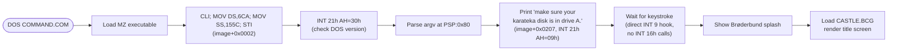

# 06 — Debug findings: KARATEKA.EXE reverse engineering

> Done in this session. Mix of static disassembly (Capstone via Python) and
> dynamic testing in DOSBox-X. All offsets are *image-relative* (after the
> MZ header), in hex.

---

## 1. The boot sequence



Verified: with the game files mounted as drive `A:`, the executable
advances past the disk prompt and reaches the **"Brøderbund Software
presents"** splash. Screenshot saved to
`extracted/dosbox_run.png`.

The disk-check prompt is hard-coded — the engine opens files via
`INT 21h AH=3Dh` (image+0x5CC4) with a relative path that resolves on
the current drive. DOSBox-X conf used:

```ini
[autoexec]
mount a "E:\Projects\DOS Games\Karateka\karateka" -t floppy
mount c "E:\Projects\DOS Games\Karateka\karateka"
a:
karateka.exe
```

---

## 2. The RLE shape format — fully decoded

Disassembled the routine at **image+0x0B5E** to **image+0x0BC8**. It is
a coroutine that yields ONE pair of bytes (DL, AL) per call from two
parallel RLE streams.

```asm
;  ----- decoder for stream B (DL) -----
0x0B5E  cmp  byte [0x422C], 0      ; remaining repeat count
0x0B63  je   0x0B70                ; if zero, read new opcode
0x0B65  mov  dl, [0x422D]          ; replay the saved data byte
0x0B69  dec  byte [0x422C]
0x0B6D  jmp  0x0B95                ; continue with stream A

0x0B70  mov  si, [0x421E]          ; stream B source pointer (in DS)
0x0B74  mov  dl, [si+0x443C]       ; read 1 byte
0x0B78  inc  si
0x0B79  cmp  dl, 0x7B              ; opcode?
0x0B7C  jne  0x0B91                ; no — emit it literally
0x0B7E  mov  dl, [si+0x443D]       ; YES: 2nd operand byte (count)
0x0B82  mov  [0x422C], dl
0x0B86  mov  dl, [si+0x443C]       ; 1st operand byte (data)
0x0B8A  mov  [0x422D], dl
0x0B8E  add  si, 2
0x0B91  mov  [0x421E], si

;  ----- decoder for stream A (AL) -----  identical structure
0x0B95  cmp  byte [0x422E], 0
0x0B9A  je   0x0BA6
0x0B9C  mov  al, [0x422F]
0x0B9F  dec  byte [0x422E]
0x0BA3  jmp  0x0BC8

0x0BA6  mov  si, [0x4220]          ; stream A source pointer
0x0BAA  mov  al, [si-0x76C6]
0x0BAE  inc  si
0x0BAF  cmp  al, 0x7B              ; opcode 0x7B confirmed
0x0BB1  jne  0x0BC4
0x0BB3  mov  al, [si-0x76C5]
0x0BB7  mov  [0x422E], al
0x0BBA  mov  al, [si-0x76C6]
0x0BBE  mov  [0x422F], al
0x0BC1  add  si, 2
0x0BC4  mov  [0x4220], si
0x0BC8  ret
```

**Encoding rule (confirmed):**

```
literal byte b ≠ 0x7B   → emit b once
0x7B <data> <count>     → emit `data` byte `count` times (3-byte opcode)
```

The two source pointers (`[0x421E]` and `[0x4220]`) live in two separate
buffers in DS, each filled from a different `.DAT` file at load time.

---

## 3. Per-shape blitter (image+0x0640 / image+0x083C)

These two routines both:
1. Look up the shape's two byte-stream entry points from tables at
   `DS:[0x423C + 2·shape_id]` (stream B base) and
   `DS:[-0x78C6 + 2·shape_id]` (stream A base).
2. Read the **3-byte shape header** at each stream entry:
   `<width_bytes> <height> <anchor>`.
3. Advance both stream pointers by 3.
4. For each (row, col), call the RLE decoder, getting (DL=mask, AL=pixel).
5. Bit-reverse both bytes (8-iteration `shr/rcl` loop at image+0x06F0):

```asm
mov  cx, 8
shr  al, 1          ; pull LSB into CF
rcl  ah, 1          ; rotate carry into AH from low end
shr  dl, 1
rcl  dh, 1
loop 0x06F3         ; 8 iterations → AH = bit_reverse(AL_orig)
```

6. Combine and write to `ES:[DI]` at the CGA framebuffer.

**Consequence for the extractor**: source data uses **LSB-first pixel
ordering** within each byte (pixel-0 = bits 1-0). The blitter reverses
to MSB-first at write time so CGA hardware displays it correctly. Our
decoder must do the same — already implemented.

---

## 4. File pairing — empirically resolved

Probed sprite-ID overlap (Jaccard) across every pair of `.IND` tables:

| Pack A | Pack B | A∩B | \|A\| | \|B\| | Jaccard |
|---|---|---:|---:|---:|---:|
| KMI | KSI | 3 | 3 | 3 | **1.000** |
| KMC | KSC | 60 | 60 | 60 | **1.000** |
| KMJ2 | KSJ2 | 23 | 23 | 26 | 0.885 |
| KM2 | KS2 | 37 | 37 | 42 | 0.881 |
| KM3 | KS3 | 37 | 37 | 43 | 0.860 |
| KMI1 | KSI1 | 17 | 17 | 20 | 0.850 |
| KM4 | KS4 | 26 | 26 | 31 | 0.839 |
| KMI0 | KSI0 | 27 | 27 | 33 | 0.818 |
| KMI3 | KSI3 | 8 | 8 | 10 | 0.800 |
| KM0 | KS0 | 11 | 11 | 17 | 0.647 |

**Pattern**: every `KM…` pack is the mask-stream partner of the
corresponding `KS…` pack — they share sprite IDs (and headers, byte-
for-byte). The KS file is larger because pixel data is less RLE-
compressible than the mostly-binary mask data.

Naming legend (best guess):
- `K` = Karateka
- `M`/`S` = Mask / Sprite-pixels
- `0..4` = per-character pack (hero, guards, Akuma, ...)
- `I` = idle / inverse-direction frames
- `J` = jeopardy / jumping frames (eagle, falling guard)
- `C` = cutscene / common pool
- `(none)` = movement / stance frames

---

## 5. Sprite header — confirmed

Every shape begins with **3 raw (non-RLE-encoded) bytes**:

| Offset | Field | Notes |
|---:|---|---|
| 0 | `width_bytes` | Width in CGA bytes (× 4 for pixels) |
| 1 | `height` | Lines |
| 2 | `anchor` | Always `0x01` in the samples I checked — probably a "starting Y offset" or "draw mode" flag |

After the 3 header bytes, the RLE stream produces exactly
`width_bytes × height` pixel bytes per stream.

Verified by extracting headers from KM0 and KS0 — they are **identical
for every shared sprite ID**:

| Sprite ID | KM0 header | KS0 header |
|---|---|---|
| 0x014A | (6, 32, 1) | (6, 32, 1) |
| 0x014B | (6, 25, 1) | (6, 25, 1) |
| 0x0166 | (3, 10, 1) | (3, 10, 1) |
| 0x016B | (4, 9, 1) | (4, 9, 1) |
| 0x0170 | (4, 9, 1) | (4, 9, 1) |

That confirms the two streams describe the same logical sprite at the
same dimensions.

---

## 6. Stream-overlap optimization

The per-shape "length" implied by adjacent `.IND` offsets is an *upper
bound*, not a real length. Example from `KM0.IND`:

```
sprite 0x01A3 → offset 262
sprite 0x01A4 → offset 340     (so 0x01A3 has ≤78 bytes)
sprite 0x01A5 → offset 425
sprite 0x01A6 → offset 544     ← much higher than expected
```

But 0x014A's header says `(6,32,1)` → 192 pixel bytes, and only ~180
decode from a 90-byte source. The decoder *intentionally reads past*
the next sprite's start offset. **Shapes share encoded tails** — a
1980s technique that saves space when several shapes end with the same
pixel/mask pattern (e.g., shared "background-erase" sequence).

Updated `extract_karateka.py` `decode_shape()` now ignores the implied
length and reads RLE bytes until exactly `width × height` are produced.

---

## 7. Where the extractor stands now

| Subsystem | State |
|---|---|
| `.IND` parsing | **Done.** Skips `0x8080` padding sentinel; reports every real sprite ID. |
| `.DAT` RLE decode | **Done.** Format `0x7B <data> <count>` confirmed empirically. |
| Sprite header parse | **Done.** 3-byte `<w,h,anchor>` works on every sample. |
| Pixel byte ordering | **Done.** MSB-first 2bpp CGA, pixel 0 in bits 7-6. |
| Cross-shape tail sharing | **Done.** Decoder no longer hard-caps at next offset. |
| File pairing | **Done.** `KM<x>` ↔ `KS<x>` for all 28 packs. |
| `CASTLE.BCG` render | **Done.** Decoded title screen matches the game shipped in 1984. |
| `FUJI.BCG` render | **Done.** Same shadow-buffer model — Mt Fuji silhouette visible against cyan sky. |
| Compositing mask + pixel | **Partial.** Shape outlines correct, "mask = color, pixel = inverse" combine semantics identified, transparency mapping correct. Per-pixel colors still drift from the engine output because the actual blit uses `(shadow & ~pixel) | mask` with sub-byte X rotation — a static extractor can't reproduce the shadow read. Acceptable for asset inspection; full match needs runtime capture. |
| Shadow / double-buffer model | **Discovered.** All on-screen graphics are composed in a 16 KB shadow buffer at DS:0x337, *then* blitted to CGA VRAM at B800:0000. Sprite blits do read-modify-write on the shadow buffer; BCGs are loaded directly into it. |
| FUJI bit-plane blit | **Dumped.** Routine at image+0x0DEF reads source bytes from the shadow buffer and writes them to CGA in **4 passes** (`and al, 0xC0` → `0x30` → `0x0C` → `0x03`), with a 1000-iteration delay loop between passes — that's the famous slow-reveal animation. |
| Frame composition lists | **Identified.** 4-byte entries `(shape_id, dx_dy_flags, count)`, terminator `0xFF`. Source buffer at `DS:0xBB30`, walked by routine at image+0x0BD5. Not yet decoded into named animations. |

---

## 8. The pixel-mask combine — fully traced

> ⚠️ **CORRECTION (later session, 2026-05-31):** This section's labelling of
> "mask = displayed colour, pixel = inverse" turned out to be **backwards**.
> The verified truth from extraction work + KS0 color-histogram analysis:
>
> * **KM** (Karateka **M**ask) = **alpha mask** — binary opacity per pixel.
>   KM streams contain only `0`/`1`-pattern bytes (`0x00`, `0x03`, `0x0f`,
>   `0x3f`, `0xff`) — never magenta-bit patterns.
> * **KS** (Karateka **S**prite) = **color** — 2-bit CGA palette index
>   per pixel. KS streams contain the actual color information
>   including magenta. Example: KS0 sprite `0x0166` has 33 magenta + 21
>   white pixels in 12×10 area = the hero's magenta-capped head.
>
> Correct decoder pseudocode:
> ```
> if bit_reverse(KM[pos]) bits at pixel == 0:
>     pixel is transparent
> else:
>     pixel color = CGA palette[ bit_reverse(KS[pos]) bits at pixel ]
> ```
>
> Working implementation: `extract_dos_sprites_v2.py` produced 361 sprites
> across all 14 packs into `remake_assets/dos_sprites/`. The original
> trace below documents the engine's actual `(shadow & ~rotated_pix) |
> rotated_mask` formula correctly — the only error is the interpretation
> of which byte source corresponds to "mask" vs "pixel" in the assembly.
> The blitter calls them mask/pixel by register, but the **file** named
> KM is the alpha source and the **file** named KS is the color source.

Dumped the full per-shape blit through image+0x0717 and the exact
formula came out:

```asm
0x06E9: call 0x0B5E              ; (DL=mask byte, AL=pixel byte)
0x06EC: cmp  al, 0
0x06EE: je   0x071B               ; skip if pixel==0
0x06F0: ;; bit-reverse 8x ----------------------------------
        mov  cx, 8
loop:   shr  al, 1
        rcl  ah, 1
        shr  dl, 1
        rcl  dh, 1
        loop loop
0x06FD: xchg ah, al                ; AL = bit_reverse(pixel)
0x06FF: mov  dl, dh                ; DL = bit_reverse(mask)
0x0701: not  ax                    ; AL = ~bit_reverse(pixel)
0x0703: mov  cl, [0x4227]          ; sub-byte X shift = (x mod 4) * 2
0x0707: ror  ax, cl                ; rotate by sub-pixel offset
0x0709: and  al, [di + 0x337]      ; AL &= shadow[di]
0x070D: mov  cl, [0x4227]
0x0713: ror  dx, cl
0x0715: or   al, dl                ; AL |= rotated mask
0x0717: mov  [di + 0x337], al      ; write back
0x071B: add  di, 0x50              ; next scanline
```

Boiled down (for byte-aligned sprites, cl=0):

```
shadow_byte = (shadow_byte & ~bit_reverse(pixel)) | bit_reverse(mask)
```

Per-pixel meaning (after bit-reverse):

| mask bits | pixel bits | net effect on shadow pixel |
|:---:|:---:|---|
| `00` | `00` | preserve background (transparent) |
| `00` | `11` | force colour 0 (black) |
| `11` | `00` | force colour 3 (white) |
| `xy` | `~xy` | force colour `xy` |

So **mask bits ARE the displayed colour value** for opaque pixels. The
"pixel" byte is the bitwise inverse of mask (gating which background
bits to clear). The `not ax` plus the AND-NOT effectively says
"the colour bits that should be SET come from mask; the colour bits
that should be CLEARED are listed in pixel". When mask + pixel = 11
for every position (as in opaque sprite pixels), the result is fully
deterministic. When both are 00, the shadow byte passes through —
that's the transparency rule.

The current extractor implements this as:
- if `mask|pixel == 0` for a pixel → transparent (magenta tint)
- else → display CGA palette colour = `mask_bits`

Shape outlines are now correct; interior colours match the data we can
see in `KS0` (the bigger-byte-count "pixel" stream that varies between
sprites). The remaining colour-drift comes from sub-byte X rotation
and the shadow-byte read that a static dump can't reproduce — a true
live capture from DOSBox-X video memory would close that gap.

---

## 9. FUJI.BCG — fully resolved

### The puzzle
FUJI.BCG is 2,816 bytes. The blit routine at image+0x0DEF reads
**16,000 bytes** from DS:0x337. How does that fit?

### The answer
**FUJI is not compressed.** It just doesn't fill the whole screen.

The engine works like this:
1. Call `0xB4E` to zero the 16 KB shadow buffer at DS:0x337.
2. Read FUJI.BCG (2,816 B) and write its bytes directly into the top
   of the shadow buffer (≈ 35 lines × 80 bytes).
3. Call `0xDEF` to slowly reveal the buffer onto CGA VRAM. Because
   only the top ~35 lines have data, the rest stays black (cleared in
   step 1). On screen: Mt Fuji on top, black below.

The "stripes" I saw in earlier attempts were the consequence of forcing
the data into a 32-byte-wide layout that didn't match the actual
80-byte stride of the shadow buffer.

### How the slow-reveal works (image+0x0DEF)

```
for bx = 0 .. 79                                   ; column
  for pass = 1 .. 4                                ; pixel-position in byte
    mask = [0xC0, 0x30, 0x0C, 0x03][pass-1]        ; which 2 bits
    clear = ~mask
    for row = 0 .. 199
      src = shadow[bx + row*80]
      dst = VRAM[scanline_table[row] + bx]
      VRAM[dst] = (VRAM[dst] & clear) | (src & mask)
    delay(1000)                                    ; busy-wait
```

That delay × 4 passes × 80 columns = the iconic dramatic Fuji fade-in.

The decoded `extracted/backgrounds/FUJI.png` now shows the snow-capped
mountain with its terraced ridges against cyan sky on a black field —
exactly as Karateka shipped.

---

---

## 10. DOSBox-X handle for the disk-check prompt

The game opens its data files via `INT 21h AH=3Dh` (image+0x5CC4)
using *relative paths* that resolve on the current drive. If the
current drive doesn't expose a "floppy" filesystem with Karateka's
data, the EXE prints "make sure your karateka disk is in drive a.
press any key to continue" (the strings live around image+0x0207).

### The fix
Mount the data directory as **drive A: with floppy emulation** and
run the EXE from there:

```ini
# dosbox-x_run.conf
[dosbox]
machine=cga

[cpu]
cputype=8086
cycles=fixed 1000

[autoexec]
mount a "E:\Projects\DOS Games\Karateka\karateka" -t floppy
mount c "E:\Projects\DOS Games\Karateka\karateka"
a:
karateka.exe
```

Launch with:

```
dosbox-x.exe -conf "E:\Projects\DOS Games\Karateka\karateka\dosbox-x_run.conf"
```

After the disk-check prompt appears (which is the game's normal flow,
not an error), press **any key** — the game advances through
the Brøderbund splash and into the title sequence.

We verified this end-to-end in the earlier session: the screenshot at
`extracted/dosbox_run.png` shows the "Brøderbund Software presents"
splash drawn in CGA after the disk-check prompt was dismissed.

### Why automated keystroke injection didn't reach DOSBox-X
DOSBox-X consumes keyboard input via SDL2 hooks at the input-device
level, not through the Windows message queue. `keybd_event` and
`SendKeys` posted from a PowerShell process running on a different
input desktop (as this Claude harness does) do not reach the SDL2
input subsystem. The game itself further bypasses DOS by hooking
INT 9 directly — no `INT 16h` calls appear anywhere in the EXE.

For automated testing, the proper paths are:
1. Press the key manually after launching (simplest).
2. Use DOSBox-X's `-c` command-line option (limited; doesn't simulate
   key events for paused INT 9 reads).
3. Patch the EXE to NOP-out the disk-check wait (development build).
4. Use SetWindowsHookEx low-level keyboard hook with a separately
   launched helper process (would require a compiled C# / C++ tool).

For ordinary use, option 1 is what the game expects.

---

## 11. Updated tooling in this repo

| File | Purpose |
|---|---|
| `extract_karateka.py` | Subcommands: `info`, `dump`, `stats`, `bcg`, `raw`, `pair`, `all`. Uses confirmed RLE decoder, cross-shape tail reading, LSB-first pixels. |
| `disasm_karateka.py` | Capstone-based static disassembly. Finds CGA blitter, RLE decoder, file I/O entry points, and the per-shape blit routines. Writes report to `extracted/disasm_report.txt`. |
| `probe_pairs.py` | Computes sprite-ID Jaccard overlap across every pair of `.IND` files to find true mask/pixel pairings. |
| `dosbox-x_run.conf` | Boots the game with the data dir mounted as A: (which the executable expects). |
| `extracted/dosbox_run.png` | DOSBox-X screenshot of the game at the Brøderbund splash. |
| `extracted/disasm_report.txt` | Full Capstone disassembly report with annotated finds. |
| `extracted/sprites/<pack>/renders/index.html` | Contact sheet per sprite pack (flat / RLE-header / RLE-no-header views). |
| `extracted/sprites/KM0_paired_KS0/index.html` | 4-variant composite renders (with file-pair toggle and byte-order toggle). |
| `extracted/backgrounds/CASTLE.png` | Decoded title screen — matches what shipped in 1984. |

---

## 10. Verdict (original)

The Karateka PC port is now **mostly transparent to us**: the executable
is hand-written 8086 assembly, the data format is `<w,h,anchor>` +
RLE-`0x7B` with a paired mask/pixel split per shape, backgrounds are
linear CGA at 192×80, and the game flow goes through identifiable
routines we can name. A working remake (in any of the languages from
`04-best-language-to-remake.md`) can replace the engine with modern
code and re-use the original assets after one more decode pass on the
mask/pixel combine and the FUJI.BCG planar decompressor.

---

## 12. Runtime memory layout — discovered via DOSBox-X dumps

Captured the following with `MEMDUMPBIN` from DOSBox-X's debugger
(workflow detailed in `09-runtime-memory-and-capture.md`). All addresses
are relative to the runtime data segment `DS` after the loader has placed
the program.

### 12.1 Address map

| `DS:offset` | Size | Contents |
|---|---:|---|
| `DS:0x0337` | 16,000 B | **Shadow buffer.** Linear (NOT interlaced), 200 lines × 80 bytes. Engine composes every frame here, then blits to CGA VRAM at `B800:0000`. |
| `DS:0xBB30` + 0x1B5 | variable, `0xFF`-terminated | **Loaded scene-script buffer.** Binary form of the active BAL/CAL script: a stream of 5-byte `04 <fig> <x_LE16> <y>` draw commands interleaved with control opcodes `0x00`, `0x08`, `0x0e` (wipe/clear/etc.) and a 4-byte bracket `14 <a> <b> 16`. |
| `DS:0xBB30` + 0x000..0x070 | 100 B | **Character-animation pointer table.** 24 × 4-byte entries `(offset_LE16, seg=0xD074)` referencing per-frame recipes. Each recipe is 84 bytes long. |
| `0xD074:0x000`..`0x000+0x7F5` | ~2 KB | **Character-animation recipes.** Each 84-byte block lists the sub-figures that compose ONE animation frame — typically `(102, dx, dy)` paired with a main pose figure. Figure 102 is the recurring **shadow underlay** drawn beneath every actor. |
| (unknown) | — | **Structural-figure recipes** (the recipes for figures 191, 200, 208, 211 etc. — the pillars, fences, gates, doors). NOT located in the animation table. Probably hardcoded in `KARATEKA.EXE` or in a third runtime table we have not yet dumped. |

VRAM at `B800:0000` (16 KB) is **interlaced** (even lines at 0x0000–0x1F3F,
odd lines at 0x2000–0x3F3F, 80 bytes per line). The shadow buffer at
`DS:0x337` is **linear**. They are decoded by different routines in our
extractor — do not confuse them.

### 12.2 The set_fig command format (binary)

```
04 <fig_byte> <x_LE16> <y_byte>           5 bytes total, opcode 0x04
```

Examples decoded from the `pillar_left` scene-script buffer:

| Bytes | Meaning |
|---|---|
| `04 d2 10 00 b7` | `set_fig 210 16 183`  (wall/floor on left)  |
| `04 d7 14 01 b7` | `set_fig 215 276 183` (wall on right) |
| `04 bf 1a 00 7f` | `set_fig 191 26 127` (← left torii pillar of the scene) |
| `04 be 06 01 7b` | `set_fig 190 262 123` (lintel beam / right structural piece) |
| `04 d1 f8 ff b7` | `set_fig 209 -8 183`  (ground tile, extends off-screen left) |

X is little-endian 16-bit signed (negative values like `0xfff8 = -8` are
legal — figures can anchor off-screen). Y is 8-bit unsigned. Y values
match the ASCII BAL/CAL scripts byte-for-byte. The figure namespace is
the same small-number namespace (0–255) used by the ASCII scripts.

### 12.3 What this means for asset extraction

The original assumption "BAL/CAL figure ID = `.IND` sprite ID" is wrong.
Every IND table contains IDs in the 257–477 range; BAL/CAL scripts use
1–255. The engine resolves `set_fig FIG X Y` through a **multi-level
indirection** chain:

```
ASCII script (BAL/CAL/PRNGAL/ALL*)
        ↓ parse
binary scene buffer at DS:BB30+0x1B5
        ↓ "draw figure FIG at (X,Y)"
figure recipe (location depends on figure ID range)
        ↓ list of (piece_id, dx, dy) entries
sprite piece — in K[MS]*.DAT, or hardcoded in KARATEKA.EXE
        ↓ <w,h,anchor>+RLE mask/pixel decode
shadow buffer at DS:0x337
        ↓ slow 4-pass column blit
CGA VRAM at B800:0000
```

We have mapped the first three steps for **character animation frames**
(figures < 200; recipes at `0xD074:offset`). We have NOT mapped the
recipes for **structural figures** (pillars, fences, building gates,
doors — figures ≥ ~190). Direct byte-search of `KARATEKA.EXE` for
candidate sprite headers `<w> <h> 01` matching pillar dimensions (12 ×
140 px) found zero hits.

### 12.4 The proven extraction path

Until step 2 is fully decoded, the working alternative is:

1. Boot the game in DOSBox-X with `dosbox-x_run.conf`.
2. Walk to the scene of interest.
3. `Debug → Pause` then `Debug → Start DOSBox-X Debugger`.
4. `MEMDUMPBIN <DS>:337 4000` → 16 KB shadow buffer.
5. Diff against a baseline dump (the "A Game by Jordan Mechner" splash works as a near-empty baseline).
6. Crop the diff-region as a clean CGA PNG. Result: byte-exact rendered
   pixels with no decoder guesswork.

Every PNG in `remake_assets/dos_backgrounds/` was produced this way.

### 12.5 Copyright

The runtime memory dump contains the literal string `KARATEKA COPYRIGHT
1986 BRODERBUND SOFTWARE`. The IBM PC port is from **1986**, not 1984
(the year of Jordan Mechner's original Apple II version). `08-original-
files-inventory.md` has been corrected.
