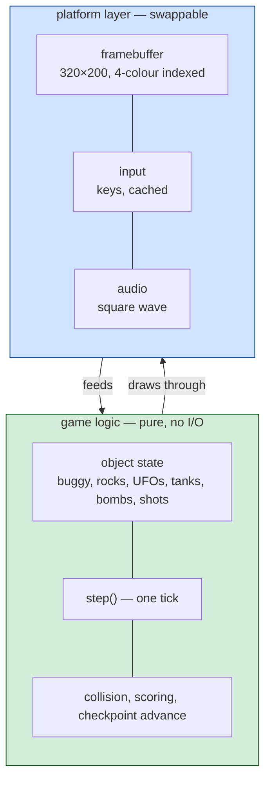

*Document four of six. See [01-the-game.md](01-the-game.md),
[02-architecture.md](02-architecture.md) and [03-the-code.md](03-the-code.md)
for the 1984 DOS program; [05-web-architecture.md](05-web-architecture.md) and
[06-web-code.md](06-web-code.md) describe the port this page argues for.*

# Moon Patrol — porting it

A port is a rewrite informed by the disassembly, not a translation of it. This
document argues for **HTML/CSS/JavaScript on a `<canvas>`, at 320×200 in CGA
palette 1**, and — more importantly — sets out where the reading in
[`symbols.json`](../symbols.json) does and does not tell you what to write.

The single rule that makes this document worth reading: **every design decision
below is either sourced to a routine in `symbols.json` or marked `[inferred]`
with what would settle it.** Some things the static reading of PATROL.COM
plainly does not say, and pretending otherwise is what produced the previous
port that had to be discarded.

## Read this before choosing a language

### The good news: the shape of the game is small

Three properties, all in [02-architecture.md](02-architecture.md), remove
what usually makes 1980s games painful to port:

- **The four segment registers are set once and never touched again.** `startup`
  at file 0x2EE sets CS = SS = code, DS = code + 0x55D paragraphs, ES swaps
  between 0xB800 and 0. Everything else is one flat address space.
- **The game state is byte cells at fixed addresses.** No structs, no pointers
  to allocate, no heap. `buggy_x_current` is `[0x99]` in the running program
  and nowhere else.
- **The video model is a linear byte array.** CGA mode 4 is 320×200 at 2 bits
  per pixel, four colours, palette 1 (`enter_cga_graphics` at file 0x573
  chooses it and never changes it). Any modern framebuffer can carry it.

### The bad news: half the *behaviour* is not in the file the way the shape is

This is the difference between Moon Patrol and [ParaTrooper](../paratrooper/).
ParaTrooper's [porting doc](../paratrooper/docs/04-porting.md) names an 18.2 Hz
clock, an LCG with the constants `30593, 25801`, and scoring of 10/5/30 — every
one of those pulled straight out of the disassembly. Moon Patrol's reading, at
this stage, does not give you the same list.

What we do have, with citations. This table was updated after the
Computer Archeology arcade reverse-engineering docs were consulted; where
the arcade docs provide a value the DOS reading is silent on, both are
listed. See [05-web-architecture.md § Provenance](05-web-architecture.md#provenance)
for the four-group rule the port uses to distinguish sources.

| behaviour | evidence | confidence |
|---|---|---|
| **Display**: CGA mode 4, palette 1 (cyan / magenta / white on black) | `enter_cga_graphics` at file 0x573 sets `int 10h AX=4`, then `AH=0Bh BH=1 BL=1`, then background 0 | **certain** |
| **Split-screen HUD** at top, scrolling field below | `program_crtc_split` at file 0x85D writes CRTC register 3 (h-sync) and a MA-lookup pair driven by `crtc_scroll_offset` at `[0x8817]` | **certain** — visible in the referee screenshot |
| **Two courses**: Beginner and Champion | `init_script_pointers` at file 0x3D89 seeds two cursors at DS:0xC46 and DS:0xC93; menu strings `[B] BEGINNER COURSE` / `[C] CHAMPION COURSE` at file 0xD8B0+ per [01-the-game.md](01-the-game.md) | **certain** |
| **8-digit BCD score** | `add_bcd_score` at file 0x2249 does `add al, [0x7A]; daa; mov [0x7A], al`; digits live at `[0x7A..0x81]` | **certain** |
| **Keyboard input**: bit 7 = ready, bits 6..0 = scancode at `[0x100]` | Int 9 ISR at file 0x405, `peek_key` at 0x562 | **certain** |
| **Title-screen keys**: F1 = start, F2 = option screen | Visible on the referee-run screenshot at [`reference/screen-boot.png`](../reference/screen-boot.png) | **certain** — read off the pixels |
| **Options menu keys**: K, J, 1, 2, B, C, S | Menu strings listed in [01-the-game.md](01-the-game.md#controls); dispatched via `scancode_dispatch` at file 0x64B | **certain** |
| **Sound**: 1-bit PC speaker at port 0x61, gated by `sound_enable` at `[0x216]` | `speaker_toggle` at file 0x4F8B is the whole primitive; `[S]` toggles the enable byte | **certain** |
| **Four object-class slot arrays** (three UFOs / rocks / etc. per class), each iterated by `mov cl, 3` over bases DS:0x82B, 0x867, 0x8BE, 0x8F3, 0x90A, 0xF0A | 20+ `for_each_slot_XXX` routines in `symbols.json`, each an arm of draw / undraw / step / hit | **certain the arrays exist**; **which class is which enemy is [inferred]** |
| **Terrain scroll**: single-row strip, wraps at 0x8D (141 cells) | `advance_scroll` at file 0x20DB copies `[0x43]` to `[0x41]` and wraps `[0x43]` at 0x8D; `render_horizon_stripe` at 0x5172 walks 0x8D cells | **certain** for the mechanism; the tile *contents* live in the data tail at file 0x7A99..0xAA99, and would have to be extracted with a copyright-safe method to port them |
| **Buggy horizontal bound**: column - left edge ≤ 0x8E (142 pixels) | `check_bounds_5C_A3_8E` at file 0x3975 | **certain** for the number; whether that width is centred, left-aligned, or offset in the game field is [inferred] |
| **Buggy velocity states**: `[0x10]` = 0xFC / 4 / 0 for left / right / idle | `check_var13_set_10_FC/04/00` trio at file 0xE2B/E4B/E6B | **the values are certain**; the *mapping* to left/right/idle is `[inferred]` and flagged as open in [02-architecture.md](02-architecture.md#what-is-genuinely-open) |
| **Three sound-effect trampolines** at file 0x4D70/0x4D75/0x4D7A pointing to DS:0xB75/0xBBC/0xDA7 | `sound_effect_B75/BBC/DA7` in `symbols.json` | **certain they exist**; which is alarm / crash / celebration is `[inferred]` and flagged as open |

What the DOS reading does **not** give us — and what the arcade docs now
do:

- **RNG is not named in either source.** ParaTrooper's LCG is called from
  six sites and traced; neither the DOS decompilation nor the arcade
  RAM.txt name an equivalent for Moon Patrol. Wave-to-wave variety
  probably comes from the wave scripts (DS:0xC46/0xC93 in the DOS binary,
  a sequencer we do not have in the arcade extracts either) rather than a
  random generator.
- **Frame rate is now known from the arcade**: **56.74 Hz** VBLANK
  (`Moon_Patrol_Hardware_Info.txt`). The DOS reading is silent; the port
  uses the arcade rate as the closest known.
- **Point values per enemy — partial, from the arcade**. The 10-tier
  score-add table at Z80 address 2A0C (`Moon_Patrol.txt`) gives the
  possible deltas: `0, 20, 50, 80, 100, 200, 300, 500, 800, 1000`. Two
  entries are labelled directly: index 4 = 100 ("shooting a rock,
  shooting an alien ship") and index 2 = 50 ("successfully jumping a
  crater"). Which enemy class picks which of the other indices at each
  callsite is not enumerated in the extracts.
- **Enemy roster is now known from the arcade** (`Moon_Patrol.txt`
  `ObjectDraws` table at 08F5): rocks/boulders (`ObjDraw_00`), tank
  (shares `_00`), hover-craft UFO (`ObjDraw_01`, boost `_13`), space
  plant (`_02/03/0C/0D` + `_11`), ground mine (`_14`, 31-frame animation),
  alien shots hitting ground (`_0A/0F`), bubble alien shot (`_15`),
  crater explosion (`_08`), various buggy-explosion variants.
- **Sound-effect names are now known from the arcade**
  (`Moon_Patrol_Sound.txt` jump table at F400): 01 shoot-rocks, 02
  missile-hits-ground, 10 passing-one-point, 11 UFO-explosion, 12
  missile-from-car (fire), 13 coin, 14 car-jump, 17 UFO-flying, 18
  background-music, 1C opening-music (title), 1D reaching-goal, 1F
  car-explosion. Which of the DOS `sound_effect_B75/BBC/DA7` data streams
  maps to which arcade command is still open — that would need a comrun
  audio capture.
- **Attract-mode behaviour** is known: E046 bit 7 = "demo mode, don't
  register score" (`RAM.txt`). Any keypress aborts.
- **Course structure**: 0 = Beginner, 1+ = Champion N (`RAM.txt` `courseNum`
  at E510). Champion is repeatable and increments. Colour flag at E0F9
  swaps buggy pink→red and status window blue→pink.
- **Point letter caps at 0x33 = 51** (`Moon_Patrol.txt` `CP $34; JR NC`
  at 0B66) with rollover using an alternate colour after Z (position 27).
- **Jump physics still not stated in either source.** Arcade
  `ISROBJRun_03` (Z80 1370) initialises by `SUB $1E` (30-pixel initial Y
  offset) and `ISROBJRun_04` (1388) uses a 16-bit velocity accumulator,
  but the exact numeric constants are per-frame position deltas we would
  need to trace. Port physics is `[invented]`.
- **Sprite bitmap format is not decoded in either source** — the DOS
  atlas record header, or the arcade's sprite-tile encoding. The arcade
  extracts include PNGs at `Sprite_Tiles.txt`, but the arcade art is
  copyrighted and would not be shipped even if extracted.

**This inventory is the boundary of the port.** Anything with a citation
can be reproduced faithfully; anything else is invented and documented
as such.

The port that ships as v1 will be **explicit about which side of this line
every design decision falls on** — no design choice will be presented as
faithful to the DOS version if it is not.

### Separate the two halves on day one

Same principle as [ParaTrooper's version of this section](../paratrooper/docs/04-porting.md#separate-the-two-halves-on-day-one).
The platform layer is small — a 320×200 indexed framebuffer, a handful of key
states, one square wave — and the choice of language matters less than usual
because moving between the options is cheap if the split is enforced.

`window.selfTest()` in the browser console runs the logic layer without
touching the DOM. `resetGame(seed)` in the console re-runs with an arbitrary
seed. Both are non-negotiable — they are what turns a bug you saw once into a
bug you can reproduce.

---

## The options

The five options are the same as [ParaTrooper's](../paratrooper/docs/04-porting.md#the-options)
and the arguments carry across word for word: HTML/JS, C99+SDL2, Rust,
Python+pygame, or run the original under an emulator. The differences worth
noting for Moon Patrol are these three:

- **The C99 correspondence is weaker.** Moon Patrol is 175 routines and
  translated from 6502; the 8086 assembly is a 6502 program in x86 clothing.
  C would not read side-by-side with the disassembly the way it does for
  ParaTrooper's hand-written x86.
- **The verifiability floor is lower.** ParaTrooper's LCG + 18.2 Hz tick makes
  rung 3 — *same state after N ticks from the same seed* — a real target. Moon
  Patrol's timing is not named and its randomness is not identified; rung 3
  requires the wave-script opcodes to be decoded first, which is work outside
  the port.
- **Running the original in an emulator gets you further, faster.** The `.COM`
  runs unmodified in DOSBox, js-dos or PCjs — and where ParaTrooper's port has
  a case to make against emulation (the whole game logic is well-understood
  and re-implementable), Moon Patrol's port has to work around genuine unknowns.
  Emulation ships the whole game today; the port ships the parts we can
  responsibly reproduce.

Neither of those makes JavaScript the wrong choice — they just narrow the
distance between the port and the emulation, which is worth naming.

## Recommendation

**HTML/CSS/JavaScript on a `<canvas>`, 320×200 internal resolution, palette 1
of CGA mode 4 (`#000000`, `#55FFFF` cyan, `#FF55FF` magenta, `#FFFFFF` white).**

The same argument as ParaTrooper: the platform layer this game needs is a
framebuffer, a few key states and one square wave, and the web gives all three
with no build step and no install. Being able to send someone a link is worth
more than any structural argument.

**Constraints, from the reading:**

- **Internal resolution is 320×200.** Any other size means either an aspect
  distortion or a re-scale of every sprite, and the reading gives coordinates in
  the 320×200 space (e.g. `check_bounds_5C_A3_8E` at file 0x3975 caps the buggy
  at column 142 out of 320).
- **CGA palette 1 is chosen, not selectable.** `enter_cga_graphics` at file
  0x573 calls `int 10h AH=0Bh BH=1 BL=1` unconditionally. The port keeps that.
  Neither ParaTrooper nor Karateka bothered offering a palette switch, and the
  wrong palette is instantly recognisable to anyone who played the DOS version.
- **The scanline table at DS:0x53C9 is not a design decision to reproduce.**
  It exists because the 6502 translator carried across an Apple-II-hi-res
  scanline-index table (see [02-architecture.md](02-architecture.md#the-scanline-table));
  a modern framebuffer computes offsets arithmetically and needs no equivalent.
  This is one of the places where the port is *deliberately* not a translation.

**What ships in v1, from the reading:**

- Title screen with `F1: START GAME` and `F2: OPTION SCREEN` at the bottom
  (matches [`reference/screen-boot.png`](../reference/screen-boot.png)).
- Options sub-screen with the six option keys enumerated in
  [01-the-game.md](01-the-game.md#controls), even if their behaviour is
  simplified (see below).
- Split HUD: score panel at top-left, POINT / TIME / checkpoint bar / life
  counter at top-right, game field below (matches the attract-mode frames at
  [`reference/clean-final.png`](../reference/clean-final.png) and
  [`reference/game-45000000.png`](../reference/game-45000000.png)).
- BCD scoring, 8 digits — the primitive is `add_bcd_score`.
- Beginner and Champion course toggle — different wave rate, same enemies.
  The exact wave *sequence* per course is `[inferred]` since the scripts are
  not decoded.
- Keyboard-only input for v1. Joystick support is a real feature of the DOS
  version (calibrated read via port 0x201 in `read_joystick_raw` at file
  0x7AB), but browsers do not expose a PC gameport and mapping it to
  `navigator.getGamepads()` is a separate design decision.
- PC-speaker-style audio via one square-wave `OscillatorNode`. Three sound
  effects will be *invented*, not translated — see the traps section below.

**What is deferred, and where it is documented:**

- **Wave-script decoding.** The two scripts at DS:0xC46 and DS:0xC93 would let
  the port reproduce the exact wave sequence. Without that, wave design is
  invented (documented in [docs/05](05-web-architecture.md) once written).
- **Extracting sprite artwork.** The three atlases hold the buggy, enemies,
  digits and terrain tiles. Their record format is not settled; before v1
  attempts extraction, the format needs to be decoded (candidate approach:
  extend `tools/render-scene.py` used successfully by Karateka) — and even if
  extracted, the artwork is copyrighted and cannot ship in the repo. v1 ships
  redrawn art, not extracted art.
- **Joystick support.** Gamepad API mapping is deferred to v2 or later.
- **Two-player alternating play.** The mechanism is in the reading
  (`active_player` at `[0x22F]`, `player_switch` at file 0x3821 that snapshots
  input mode and sound flag to `[0xEF]/[0xF0]`), but v1 is single-player.

## The four traps that will bite

These are the ones the reading itself has already caught. Adding a fifth or
sixth as the port develops belongs in [docs/05](05-web-architecture.md).

### 1. There is no named RNG

ParaTrooper's port ships with an exact-value test:

    seed=1 → 56394, 52243, 3932, 58917, 36974, 20023

Moon Patrol has no equivalent. `symbols.json` names 175 routines and none of
them are an LCG. If wave design ever calls for randomness, **do not import an
LCG "compatible with the 1980s"** — that is exactly the "guess and it will be
wrong" that this project's own history warns against. Either:

- **Find the real randomness first** by running the game under `comrun.py`,
  hooking every store to a scratch cell, and looking for the `LDA rand;
  ...; STA rand` shape of a 6502-translated LCG. The result gets a name and
  evidence in `symbols.json` before it is used.
- **Or use `Math.random()`** and document plainly that the wave order is not
  the original's.

The wrong answer is a hand-picked LCG that "looks period-appropriate". The
port will document whichever choice was made in [docs/05](05-web-architecture.md).

### 2. The keyboard buffer semantics differ from `int 16h`

The DOS game does not use `int 16h`. It uses its own int 9 ISR at file 0x405
that writes one byte to `[0x100]` (bit 7 = key ready, bits 6..0 = scancode).
Polling routines (`peek_key`, `wait_key_up`, `clear_key`) drain it exactly
that way. Browsers deliver `keydown` and `keyup` events, and treating a
`keydown` as *one press* (like the ISR's ready-flag) versus as *held* changes
the feel of the game.

Menu keys (F1, F2, K, J, 1, 2, B, C, S) should be treated as *one press* —
which is what `peek_key`+`clear_key` does in the original. Game keys (left,
right, jump, shoot) probably want to be treated as *held* while the key is
down. That is `[inferred]` since no *game-time* input routine has been named
in `symbols.json` beyond `read_dir_pad_x` at file 0xE93 which reads a level
(`ja` / `jb` / neutral) rather than an edge, which supports held-key
semantics — but it is worth confirming with a `comrun.py` trace.

### 3. Sound effect mapping is not settled

`sound_effect_B75/BBC/DA7` are three trampolines pointing to three data
streams. Which one is the crash, which is the alarm, which is the celebration
is called out as open in [02-architecture.md#what-is-genuinely-open](02-architecture.md#what-is-genuinely-open).
The port either:

- **Runs `comrun.py` with audio capture** and identifies each effect by
  listening, then names them in `symbols.json` and uses them.
- **Or invents three effects** (one short low buzz for crash, one two-tone
  pulse for shot, one rising arpeggio for checkpoint) and documents that
  invention in [docs/05](05-web-architecture.md).

**Do not label an invented effect as the DOS effect.**

### 4. One stray `const` inside a function kills the whole script

Not Moon Patrol specific, but ParaTrooper met it and it is worth carrying
forward: a classic script (`<script>` without `type="module"`) with a syntax
error does not run at all, while the page still renders normally. If the port
goes blank, open the browser console before debugging anything else.

## How to know the port is right

The [DOS-Decompiler verification ladder](https://github.com/agunawijaya/DOS-Decompiler#the-verification-ladder)
grades claims about equivalence. A port cannot reach rungs 1-2 (that is the
`.asm`); the rungs it *can* reach, for Moon Patrol specifically:

| Rung | Meaning for a Moon Patrol port | Achievable now? |
|---|---|---|
| 1 | byte-identical rebuild | no — that is `recovered/moon-patrol.asm` |
| 2 | instruction-identical | no |
| 3 | **same state after N ticks from the same seed** | **no**, until an RNG is named — see trap 1 |
| 4 | pixel-identical title screen against `comrun.py` | **yes for the title bitmap**, if we extract it (out of scope for v1; art is redrawn) |
| 5 | "looks right" against the referee frames | **yes, and this is where v1 lands** |

**Rung 5 with evidence** is not nothing. It means: the title screen matches
the layout in `reference/screen-boot.png`, the HUD matches
`reference/clean-final.png` (score panel top-left, POINT/TIME/checkpoint bar
top-right, life counter beside the buggy icon), the palette matches (cyan /
magenta / white on black — not gray on white, which is what the previous port
did), the CRTC split behaviour matches (HUD is fixed, field scrolls), and the
control model matches the routines named in the reading. Everything invented
is *documented as invented*.

Rung 3 arrives when the wave-script opcodes get decoded and the RNG is named —
work that belongs in `symbols.json` and `docs/03`, not in the port. When it
does, the port picks it up.
