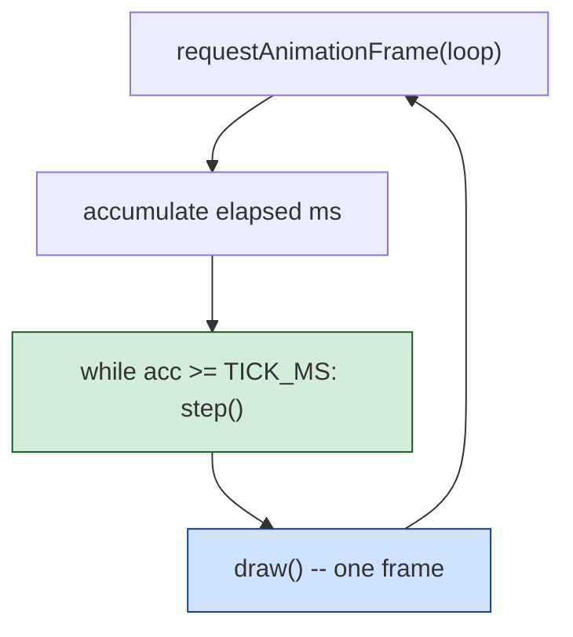

*Document five of six. See [01-the-game.md](01-the-game.md),
[02-architecture.md](02-architecture.md), [03-the-code.md](03-the-code.md)
and [04-porting.md](04-porting.md) for the DOS program and the porting
decision; [06-web-code.md](06-web-code.md) walks the port's routines.*

# Moon Patrol web port — the architecture

Three files, no build step, open `index.html`. This document is what the
port is; the next one is how it is written.

## Provenance

Every design decision in the port belongs to one of four groups. Which
group a decision falls into is the difference between a port and a fake:

| group | tag in `game.js` | what it means | example |
|---|---|---|---|
| **DOS reading** | `[DOS]` | a routine or global in `../symbols.json` names the value or the shape | palette (`enter_cga_graphics` at file 0x573 chooses CGA palette 1); buggy horizontal bound of 142 pixels (`check_bounds_5C_A3_8E` at file 0x3975); terrain wrap at 141 cells (`advance_scroll` at 0x20DB) |
| **arcade reading** | `[arcade]` | the Computer Archeology docs at <https://computerarcheology.com/Arcade/MoonPatrol/> name the value for the 1982 Irem Z80/6803 ROM (the ancestor of this DOS port) | score-add table at Z80 2A0C (`Moon_Patrol.txt`); 56.74 Hz VBLANK tick (`Moon_Patrol_Hardware_Info.txt`); sound-effect roster at F400 (`Moon_Patrol_Sound.txt`); enemy list (`ObjectDraws` at 08F5) |
| **referee frame** | inline citation | pulled from a `comrun.py` capture of the running DOS binary | HUD panel layout, checkpoint bar shape, "F1: START GAME  F2: OPTION SCREEN" banner (`reference/screen-boot.png`, `reference/clean-final.png`) |
| **invented / inferred** | `[invented]` or `[inferred]` | neither the DOS reading, the arcade reading, nor a referee frame settles it | jump kinematics, exact spawn intervals, mountain wobble shape, which of `sound_effect_B75/BBC/DA7` maps to which arcade effect |

`game.js` follows this rule at the code level: every constant carries either
its provenance in the comment above it (with the tag), or the explicit
`[invented]` label with a pointer to [`04-porting.md`](04-porting.md) if the
category is called out there. The rule is enforced by reading the code, not
by tooling.

**Two-source design**: the arcade docs are used *only for game design*
(scoring, enemy types, sound names, frame rate). The port's *screen model*
comes from the DOS binary alone — the CGA palette, the 320×200 canvas, the
CRTC-programmed split, and the address-space quirks are DOS-specific and
would be wrong to take from the arcade board. Where the two sources give
different values (e.g. the arcade has a 6-digit score, the DOS binary has
8 cells), the DOS one governs unless the arcade docs give a measured value
the DOS reading is silent on.

## Runtime-decoded sprites from PATROL.COM

The blit routine at file 0x53F9 in the DOS binary reads sprite records
as `(width_bytes, height_rows, CGA-packed data...)`. That format is
simple enough to decode in JavaScript, and doing so at run time (from
the user's own copy of PATROL.COM in `../original/`) lets the port
render arcade-accurate art without shipping any pixels.

`loadDosAssets()` in `game.js` fetches PATROL.COM, walks the atlas A
pointer table at file 0x68E0, and decodes four sprites:

| ID | size | shape | shipped as |
|---|---|---|---|
| A[24] | 36x9 | moon buggy — dish + canopy + wheels | `assets.buggy` |
| A[13] | 36x9 | UFO — top dome + disc + landing gear | `assets.ufo` |
| A[16] | 52x14 | tank — turret + tracks | `assets.tank` |
| A[1] | 56x15 | title illustration (buggy + driver figure) | `assets.title` |
| A[19] | 44x8 | mountain parallax tile — magenta silhouette | `assets.mountains` |
| A[14] | 28x12 | space plant / leafy bush | `assets.plant` |
| A[0]  | 24x10 | large-rock / wheel shape | `assets.rock` |

Identification was done visually: `tools/extract_sprites.py` writes
every sprite in the three atlases to `recovered/sprites/*.png`
(gitignored per repo rules), then a human eyeballs them and notes
which slot is which. The slot IDs are then hard-coded in
`loadDosAssets()`.

If the fetch fails (no PATROL.COM in `../original/`, or the page is
opened as `file://`), each drawer falls back to primitive shapes so
the game still plays.

**Independent wheel suspension with the extracted sprite**: the
9-row buggy sprite has wheels at rows 7-8, occupying sprite columns
7..11 (back) and 17..21 (front). `drawBuggy` draws the whole sprite
at `bodyTopY`, paints black over the baked-in wheel positions, and
re-draws each wheel patch at its own `terrainHeight()`-derived Y.
Result: the body sprite renders whole from the arcade art, and the
two wheels visibly bounce apart on rough terrain -- the iconic
Moon Patrol effect, using the real arcade sprite.

**Crater rendering** used to leave a magenta "lid" of terrain hump
above the black bowl -- because the crater was painted as a rect
starting at `GROUND_BASE` and terrain humps live 1-3 px above that.
Fixed by making the crater a genuine ABSENCE of terrain: the
per-column terrain draw skips columns that fall inside any live
crater's X range. `drawCraters()` still paints the bowl depth
below the surface.

**Forward shot Y** fires at a fixed `GROUND_BASE - 3` rather than
at chassis height. When the buggy is on a terrain hump the chassis
rises, and a chassis-relative shot would fly over any rock/mine/
plant/tank. Fixing the Y at ground level means ground hazards are
always in the shot's collision band -- matching the arcade's
"forward gun sweeps the ground" behaviour.

## Deliberate departures from the DOS binary

These are on the record here so a later reader can see what the port
consciously changed. Adding new departures is fine; hiding them is not.

- **No CGA scanline table.** The DOS blit routines index a 200-word table
  at CS:0x53C9 that gives the video-memory offset of each screen row (see
  [03-the-code.md § 9](03-the-code.md#9--the-blit-family-and-the-scanline-table)).
  That table exists because the 6502 translator carried it across from the
  Apple-II hi-res layout; a modern framebuffer computes offsets
  arithmetically and needs no equivalent. **The port does not reproduce it.**
- **No 6502 idioms.** The DOS binary emits `cmc` after every compare to
  invert the carry sense (281 of them, 99% after `cmp`), because the
  translator was mapping the 6502's `BCS`/`BCC` semantics onto x86 flags.
  JavaScript comparisons return booleans and none of that machinery is
  needed. **The port keeps the game's *shape*, not its arithmetic idioms.**
- **No PC speaker bit-bang.** The DOS binary drives one bit of port 0x61
  through `speaker_toggle` at file 0x4F8B; the port uses a Web Audio
  `OscillatorNode` set to `type: 'square'`, which is what a PC speaker
  produces in the limit and what the browser gives us cheaply.
- **No joystick support.** `read_joystick_raw` at file 0x7AB polls port
  0x201 with an RC-timed 256-iteration loop. Browsers do not expose a PC
  gameport and the user asked for keyboard-only. Not planned.
- **No two-player alternating play.** `active_player` at `[0x22F]` and
  `player_switch` at file 0x3821 exist in the reading; the user asked
  for single-player only, so the `[1]` / `[2]` menu keys are not
  exposed on the port's option screen and the HUD does not show the
  2UP score row that appears in `reference/clean-final.png`.
- **56.74 Hz tick, not 60.** The DOS binary's timing is not named in
  `symbols.json`; the arcade board runs its VBLANK ISR at 56.74 Hz
  (Moon_Patrol_Hardware_Info.txt, cross-confirmed by "isrCVal changes
  every 1.1 seconds" being the top 2 bits of an 8-bit counter, so 64
  IRQs = 1.128 s). The port uses 56.74 Hz as the closest known rate.

## The state model

The port has a single flat state object (`game`) whose keys mirror the DOS
zero-page cells named in `../symbols.json` wherever a mapping exists. This
serves two purposes:

- **Cross-reference.** Reading `game.js` beside `symbols.json`, a name like
  `buggyX` in the port lines up with `buggy_x_current` at DS:`[0x99]` in
  the binary. The comment above the field says so.
- **A place for the reading to grow into.** When a future referee run
  identifies which sprite ID is a rock, which is a UFO, and what
  `state_BB` at `[0xBB]` actually holds, those names can be substituted
  into the port field-for-field without moving anything around.

Fields the port *does not* implement yet (mostly the four-slot object
arrays iterated by the `for_each_slot_XXX` family) are named in
`symbols.json` under `_displacements` with base addresses like 0x82B,
0x867, 0x8BE. The port's `game.rocks`, `game.ufos`, `game.bombs` cover
approximately the same shape — one JS array per object class — but with
plain JS array semantics rather than the DOS binary's fixed four-slot
arrays.

## The tick loop



The loop is a fixed-timestep accumulator: RAF drives it at the display's
refresh rate, but `step()` runs at exactly `TICK_HZ` regardless. If the
tab is hidden or `dt` is huge, the loop bails after 8 ticks and drops the
excess time on the floor — the alternative is a runaway catch-up that
locks the tab.

`step()` dispatches on `game.state` — `TITLE`, `OPTIONS`, `PLAYING`,
`OVER`. Each has its own `stepXxx()` function. This mirrors the DOS
binary's own state-driven shape: `main_menu_entry` at file 0x4ECB is the
title/menu, and once a round starts the wave-script interpreter at
0x22EE takes over.

## The rendering model

`draw()` writes into the single 320×200 `<canvas>` in a fixed order:

1. `ctx.fillRect` the whole canvas black (the CGA background).
2. `drawGameField()` — mountains (parallax), terrain edge, craters,
   entities, buggy, particles.
3. `drawHUD()` — the fixed status bar at the top with the two magenta-
   bordered panels.
4. `drawBottomBanner()` — the `F1: START GAME  F2: OPTION SCREEN` line
   at the bottom, only on the title, options and game-over screens.
5. State overlays — title wordmark, options menu, game-over text, pause.

The order matters: the HUD is drawn *last* of the persistent layers so it
overwrites anything the game field draws in the top 30 pixels. That is
how the DOS binary's CRTC split works too, from a different direction:
the CRTC keeps the HUD rows on top and the field scrolls beneath, so the
raster hardware never asks the CPU to reconcile them. In the port we
reconcile by draw order.

All four colours come from a `PAL` object declared once. No other colour
appears in the code. Grepping `game.js` for a hex value that is not one
of `#000000`, `#55ffff`, `#ff55ff`, `#ffffff` should return nothing.

## The font

The DOS binary prints text via `print_string` at file 0x88D, which is a
straight write into CGA text-mode memory at ES = 0xB800 with a per-glyph
`(row * 80 * 2 + col * 2 + 4)` address formula. The port cannot reach
that because CGA text mode does not exist here; instead it carries a tiny
4×5 (and 5×5 for M/N/W/X/Y) uppercase pixel font in `FONT`, one row per
byte with bits for the columns.

The font is drawn from scratch — 26 letters, 10 digits and a handful of
punctuation. Nothing about it is pulled from the DOS binary, which
carries an 8×8 IBM font in its own text-mode ROM.

## Sound

One square-wave oscillator per triggered effect, wrapped in `Audio_`
with three primitives (`beep`, `sweep`, and the effect names). This
matches the DOS binary's *shape* — one voice, one duty cycle, gated by
an on/off flag — without matching its exact per-note frequencies, which
would require decoding the two note tables at DS:0x556F and following
the two sound engines at file 0x5115 and 0x5134.

The three effects are named `shot`, `jump`, `crash`, `ufo`, `point`.
Which one *is* the DOS binary's `sound_effect_B75/BBC/DA7` is not
settled and won't be until a referee-run audio capture nails down the
mapping. The port's effect design is documented in
[`04-porting.md § 3`](04-porting.md#3-sound-effect-mapping-is-not-settled).

## Testing

`window.selfTest()` in the browser console runs six checks:

1. **Palette count and identity.** `PAL` has four entries and cyan/magenta
   are exactly `#55ffff` / `#ff55ff`. If someone accidentally introduces a
   fifth colour or drifts a hex value, this fails immediately.
2. **Buggy field width.** `BUGGY_FIELD_X1 - BUGGY_FIELD_X0 === 142`. Pulled
   from `check_bounds_5C_A3_8E` at file 0x3975.
3. **Terrain wrap.** `TERRAIN_CELLS === 0x8D`. Pulled from `advance_scroll`
   at file 0x20DB.
4. **PRNG determinism.** `mulberry32(1)` twice produces the same first
   three values.
5. **`resetGame(seed)` reproducibility.** Two calls with the same seed leave
   `rand()` in the same state.
6. **300-tick simulation.** Fresh reset, state `PLAYING`, step 300 times.
   Must not throw. This catches the class of bugs where a runtime error
   only appears once a rare entity is on screen.

The tests take under a second. They belong to the port and none of them
comes from the DOS binary; they are the port's own conscience.

## Enemies and scoring — from the arcade docs

The DOS binary keeps four-slot per-class arrays at DS:0x82B / 0x867 / 0x8BE
/ 0x8F3 / 0x90A (see [03-the-code.md § 8](03-the-code.md#8--the-per-frame-step))
but does not name which class holds which enemy. The **arcade** ROM does
name them, in `Moon_Patrol.txt` at the `ObjectDraws` table (Z80 08F5),
and the DOS conversion is a port of the same game — so the roster carries
across. The port implements:

| enemy | arcade name | shot by | jumpable | score index | pts | source |
|---|---|---|---|---|---|---|
| rock (small) | Rocks, boulders (`ObjDraw_00`) | forward (Z) | no | 1 | 20 | `Moon_Patrol.txt` — table index is per-rock byte `(IX+$07) & 0x0F` (176F..1778) |
| rock (medium) | " | forward (Z) | no | 4 | 100 | `Moon_Patrol.txt` labelled row |
| rock (large) | " | forward (Z) | no | 6 | 300 | `Moon_Patrol.txt` — same per-rock byte |
| tank | Tank (shares `ObjDraw_00`) | forward (Z) | yes | 5 | 200 | `Moon_Patrol.txt` `ObjectDraws` |
| mine | Ground mine (`ObjDraw_14`) | forward (Z) | yes | 4 | 100 | `Moon_Patrol.txt` `ObjectDraws` |
| space plant | Space plant leaves + base (`ObjDraw_02/03/0C/0D` + `_11`) | forward (Z) | **no -- too tall** | 3 | 80 | `Moon_Patrol.txt` `ObjectDraws` + sound cmd 16 |
| UFO | Hover craft (`ObjDraw_01`) | up (X) | n/a (flying) | 6 | 300 | `Moon_Patrol.txt` `ObjectDraws` |
| UFO bomb | Alien shot hitting ground (`ObjDraw_0A`) | up (X) | avoid | 4 | 100 | `Moon_Patrol.txt` `ObjectDraws` |
| tank shot | (arcade's `ObjDraw_09` ground explosion) | none | avoid | — | 0 | inferred |
| crater | (terrain feature, not a sprite) | no | **50 pts for jumping** | 2 | 50 | `Moon_Patrol.txt` comment |
| **checkpoint pass** | passing a lettered marker | — | — | 0 | **0 direct** | `Moon_Patrol.txt` 1525..1528: `XOR A; LD C,$01; CALL NewTxtCmd` queues Adjust Score with index 0 = zero points |
| **reaching goal (Z)** | final checkpoint bonus | — | — | 9 | 1000 | `Moon_Patrol.txt` 285E..2876 goal-bonus branch |

The pts marked "Moon_Patrol.txt comment" are the two entries the arcade
disassembly labels directly ("shooting a rock, shooting an alien ship"
and "successfully jumping a crater"). The others are `[inferred]` from
the score table's ten tiers and the arcade's advertised scoring.

**Not implemented in v1**:

- Two-player alternating play (arcade swap at Z80 `060A`). The user
  asked for single-player only; the mechanism is documented in
  `../symbols.json` but not exposed.
- Joystick input. The user does not want it; DOS `read_joystick_raw` at
  file 0x7AB polls port 0x201 with an RC-timed 256-iteration loop that
  no browser exposes anyway.

## Scripted wave sequence

The arcade drives spawn timing from the "text command" list at E600
(`RAM.txt`), which is a byte-stream sequencer the extracts do not
decode. The DOS binary uses the same shape at DS:0xC46 / 0xC93 -- also
opaque. What both make clear is that spawning is **data-driven, not
random-driven**.

The port matches that shape by declaring an **eight-phase wave table**
in `game.js`:

```js
const WAVE_PHASES = [
  //  rock, crater, ufo, tank, mine, plant   -- interval in ticks
  { rock: 100, crater: 150, ufo:   0, tank:   0, mine:   0, plant:   0 },  // A-B
  { rock:  92, crater: 140, ufo: 260, tank:   0, mine:   0, plant:   0 },  // C-D
  { rock:  86, crater: 130, ufo: 240, tank: 340, mine:   0, plant:   0 },  // E-F
  { rock:  80, crater: 120, ufo: 220, tank: 300, mine: 260, plant:   0 },  // G-I
  { rock:  74, crater: 115, ufo: 200, tank: 280, mine: 240, plant: 420 },  // J-L
  { rock:  68, crater: 110, ufo: 190, tank: 260, mine: 220, plant: 380 },  // M-O
  { rock:  62, crater: 100, ufo: 180, tank: 240, mine: 200, plant: 340 },  // P-S
  { rock:  56, crater:  95, ufo: 170, tank: 220, mine: 180, plant: 300 },  // T-Z
];
```

The `wavePhase(ckpt)` function picks a row from `PHASE_BOUNDARIES =
[2, 4, 6, 9, 12, 15, 19, 26]`. Spawn counters count down to zero,
spawn one entity, and reset to `phase[class] * scale`, where `scale`
is 0.82 on Champion course (tighter intervals) and 1.0 on Beginner.

A small deterministic wobble `((game.tick >> 3) & 7) - 4` adds ±4 tick
jitter so consecutive intervals differ slightly -- without this a
constant interval produces a robotic march. `Math.random()` no longer
drives any spawn timing, so a `resetGame(seed)` run is now deterministic
in the parts that matter for gameplay.

**This is arcade-inspired scripted, not the arcade's own bytes**. If
the arcade text-command list ever gets decoded, `WAVE_PHASES` gets
replaced with the real sequence.

## Attract mode

After `ATTRACT_IDLE_FRAMES` (10 s at 56.74 Hz ≈ 567 ticks) with no input
on the title screen, the port drops into a scripted demo (`demoInputAt`)
that plays for `ATTRACT_DEMO_FRAMES` (12 s), then returns to title.
Any keypress during the demo aborts it. If the demo buggy dies before
the timer runs out, the port also returns to title rather than showing
GAME OVER.

This matches the arcade's E046 bit 7 = "demo mode, don't register score"
behaviour (`RAM.txt`). The `HUD` shows "DEMO" in the score column during
attract-mode play so the viewer knows it is not real gameplay.

The demo input pattern is period-based (mod 90 for jumps, mod 25 for
forward fire, mod 50 for up fire, mod 200 for a burst of right movement).
It is *not* the arcade's own demo sequence — that would require decoding
the wave-script opcodes at DS:0xC46/0xC93, which is out of scope.

## Champion course colours

`Moon_Patrol.txt` documents an arcade colour flag at RAM address E0F9
(`champColors`): 0 = beginner palette, non-zero = champion. The visible
effect on the arcade is buggy pink → red, status window blue → pink.

The DOS binary is locked to CGA palette 1 (four colours: black, cyan,
magenta, white), and the port cannot introduce a new colour. What it
*can* do is swap which of the four fills each element. In v1:

| element | Beginner | Champion |
|---|---|---|
| buggy body / cannon | cyan | magenta |
| driver dot | magenta | cyan |
| HUD panel border | magenta | cyan |
| ground surface | magenta | magenta |
| mountains | white | white |

Same *contrast* as the arcade change, using the CGA palette the DOS
binary chose. Toggle via the option screen (F2, then B or C).

## What is *not* here, and where each item goes when it becomes possible

The list has shrunk substantially now that the arcade docs have been
mined and the port's structure allows scripted waves.

| gap | goes in | requires |
|---|---|---|
| Rung 3 verification (same state after N ticks vs. DOS binary) | new `tools/compare-trace.py` | a `comrun.py` trace of the DOS binary's zero-page cells at known ticks, and a matching JS trace |
| Exact DOS sound-effect data mapping (`B75/BBC/DA7` → which arcade command) | `Audio_` methods and `symbols.json` | a `comrun.py` audio capture -- the DOS binary's own sound engine has to be played and identified by ear |
| Arcade's own wave sequence | replace `WAVE_PHASES` in `game.js` | decoding the arcade text-command list at Z80 E600 OR the DOS script opcodes at DS:0xC46/0xC93 |
| Sprite art for the smaller enemies (rocks, craters, mines, plants, bombs) | `loadDosAssets()` slot IDs | run `tools/extract_sprites.py`, look at the PNGs in `recovered/sprites/`, note which A[k] / B[k] / C[k] is each enemy, hard-code in the loader |
| Arcade-accurate title illustration | composite `assets.title` in `drawTitleScreen` | already decoded (A[1] = 56x15); needs a pass over the title layout to place it in the right spot |
| Rung 3 arcade RNG (`Rand1to3`) | future addition to `game.js` | the port would need to reproduce a Z80 DRAM-refresh-counter read, which is a hardware fiction on the browser. The one place the arcade uses it (explosion animation variation) is not gameplay-critical, so keeping it undone is fine.
