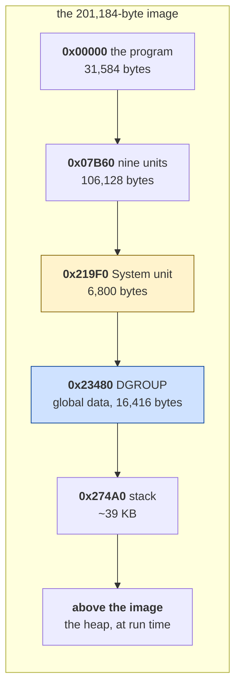

# The Oregon Trail — how the program is built

*Document two of four. Before: [01 — the game](01-the-game.md). After:
[03 — the code](03-the-code.md), [04 — porting](04-porting.md).*

Everything here was measured. Where something is reasoned rather than observed
it is marked **[inferred]**, and [what is still
unknown](#what-is-still-unknown) is listed at the end rather than papered over.

---

## Contents

- [Is this even the game that shipped?](#is-this-even-the-game-that-shipped)
- [It is packed, and the packer tells you where to start](#it-is-packed-and-the-packer-tells-you-where-to-start)
- [It is Turbo Pascal, and how you can tell](#it-is-turbo-pascal-and-how-you-can-tell)
- [Fifteen segments, one per unit](#fifteen-segments-one-per-unit)
- [Where the memory goes](#where-the-memory-goes)
- [The artwork, which needs no reverse engineering](#the-artwork-which-needs-no-reverse-engineering)
- [The check that is not copy protection](#the-check-that-is-not-copy-protection)
- [The protection that is](#the-protection-that-is)
- [Running it, at last](#running-it-at-last)
- [Could this be rebuilt byte-identically?](#could-this-be-rebuilt-byte-identically)
- [What changed between 1983 and 1990](#what-changed-between-1983-and-1990)
- [What is still unknown](#what-is-still-unknown)

---

## Is this even the game that shipped?

The first question, and it is not rhetorical. This repository has been handed a
game with its disk check already removed, and a byte-identical reconstruction
of *that* proves you reconstructed somebody's patch.

`original/` holds nineteen loose files and the distribution archive they came
from. Every one of the nineteen matches the archive **byte for byte**. So this
is the release, not a modified copy of it.

```
OREGON.EXE   81,896 bytes
SHA-256      4d53abb5c55661b0e38ce6f1dbae82b2875f381bb7d81d04b0cf6b98d52aefed
```

`file_id.diz` says MECC, version 2.1, 1990.

## It is packed, and the packer tells you where to start

Triage refuses the file:

```
[BLOCKER] packed with LZEXE 0.91
VERDICT: out of scope. Unpack before doing anything else.
```

That is the right answer. The visible code is a decompressor; disassembling it
would be correct and useless. `unpack.py` runs the decompressor under emulation
and dumps what it produces: **81,896 bytes become 201,184.**

### The entry point, and why it is worth a section

A DOS executable's header says where execution starts. LZEXE overwrites that
with its own decompressor, so after unpacking the entry point is gone — and a
wrong entry point is worse than none, because a disassembler started in the
middle of a routine produces plausible nonsense that everything downstream
inherits.

The toolkit's behavioural guess — *the last place control jumps into memory the
decompressor wrote* — said **`0x10F`**.

LZEXE, it turns out, states the answer. Versions 0.90 and 0.91 put a sixteen-
byte block at the *start* of the stub, which is why every LZEXE'd file has
`IP = 0x0E`: the header entry steps over it.

```
+0  IP    +4  SP    +8   compressed size, in paragraphs
+2  CS    +6  SS    +10  increase   +12  stub size   +14  checksum
```

Two cross-checks pin that layout rather than trusting a field list:

- the compressed-size word reads `0x130F`, and the packed file's own header
  puts the stub at segment `0x130F`. It must — LZEXE places the stub directly
  after the compressed data, so those are the same number by construction.
- `SS:SP` resolves to `0x310E0` against an image of `0x311E0` bytes. The stack
  lands 256 bytes below the top, which is where a stack goes.

It says **`0x10A`**. Five bytes earlier than the guess, and here is why those
five bytes matter:

```nasm
0010A  lcall 0x319F:0x0000        <- the real entry
0010F  lcall 0x313D:0x0000        <- where the guess would have started
00114  lcall 0x2DE9:0x1326
00119  lcall 0x28DC:0x0000
0011E  lcall 0x25BB:0x0000
00123  lcall 0x251C:0x09E5
00128  push bp / mov bp, sp       <- the program's own begin block
```

Every one of those far calls is a Turbo Pascal **unit initialiser**. Starting at
`0x10F` runs the program with its first unit never initialised, and nothing
anywhere reports it.

*This was fixed in the toolkit rather than worked around here: `unpack.py` now
reads the block, refuses it if the cross-check fails, and prints what the
heuristic would have said so the two stay comparable.*

## It is Turbo Pascal, and how you can tell

Two independent routes, which is this repository's standard for committing to a
claim.

**The strings.** `Runtime error ` at image `0x21BFD` is Borland's runtime error
handler, and beside it sit ` at ` and `.` — the pieces of
`Runtime error 203 at 1234:5678.`

**The shape of the start-up.** At image `0x219F0`:

```nasm
    mov dx, 0x3348
    mov ds, dx                  ; DS = DGROUP
    mov [0x1566], es            ; ES holds the PSP on entry -- save it
    xor bp, bp
    mov ax, sp
    add ax, 0x13                ; round the stack top up ...
    mov cl, 4
    shr ax, cl                  ; ... to a whole paragraph
    mov dx, ss
    add ax, dx                  ; and that is where the heap begins
    mov [0x153E], ax            ; HeapOrg
    mov [0x1540], ax            ; HeapPtr
    ...
```

That is Turbo Pascal's `System` unit initialising itself, and the sequence is
stable from version 4.0 through 6.0. It is worth more than a yes: `0x3348` is
**DGROUP**, and DGROUP is the boundary between code and data — which nothing
else recovers for a Pascal program.

### And the version is 5.0

No string separates the versions — the runtime error format is identical from
4.0 to 6.0. The runtime's *code* does.

`TURBO.TPL` is the library of compiled standard units that ships with each
Turbo Pascal. Comparing the program's 6,800-byte runtime segment against two of
them:

| library | signature | covered | longest identical run |
|---|---|---|---|
| **Turbo Pascal 5.0** | `TPU5` | **86%** | **1,587 bytes** |
| Turbo Pascal 5.5 | `TPU6` | 74% | 545 bytes |
| `TPC.EXE` — right product, wrong file | — | 2% | — |
| Zaxxon — not Pascal at all | — | 0% | — |

**A 1,587-byte unbroken identical run is not a coincidence.** The game was built
with **Turbo Pascal 5.0**.

Two details make that claim worth believing rather than merely plausible.

The comparison could not be a simple alignment, because Turbo Pascal
**smart-links**: procedures the program never calls are dropped from the linked
runtime and everything after them shifts. So the measure is *coverage* — how
much of the segment can be found verbatim anywhere in the library — which
survives both the dropped procedures and the relocated segment words.

And the bottom two rows are the argument, not the top one. Turbo Pascal 5.0 and
5.5 cover only **62% of each other**: different enough for the comparison to
mean something, similar enough that a single library on its own would have
proved nothing. The tool that does this refuses to name a version at all unless
one library beats the next by half again.

*Both libraries were downloaded from the Internet Archive — 5.5 from
Embarcadero's own Antique Software release, 5.0 from a floppy image set that the
toolkit's `fatextract.py` opened directly.*

### Confirmed twice more, without disassembling anything

Having the actual compiler makes two further checks almost free, and both agree.

**The game ships Borland's graphics driver unmodified.** `CGA.BGI` in
`original/` is 6,253 bytes. `CGA.BGI` from the Turbo Pascal 5.0 distribution is
6,253 bytes. They are **byte-identical** — same SHA-256. `VGA256.BGI` is
Borland's too, and says so: `BGI Device Driver (VGA256) 2.00 - Mar 21 1988,
Copyright (c) 1987,1988 Borland International`. It simply was not in the retail
box, which is why it is not on the 5.0 floppies.

**And the `Graph` segment is Borland's `Graph` unit.** `GRAPH.TPU` ships in
`BGI.ARC` rather than in `TURBO.TPL`, which is why the library comparison above
scored it at only 1.5%. Extracted with Borland's own `UNPACK.COM` and compared
directly: **73.7% covered, with a single unbroken identical run of 6,636 bytes**
— half the segment in one piece.

So the compiler is established three separate ways: the runtime's code, a
byte-identical driver file, and a 6,636-byte match against the graphics unit.

## Fifteen segments, one per unit

Here is the fact that makes a Pascal program readable without any symbol
information at all:

> **In Turbo Pascal every unit is its own code segment, and every call between
> units is a far call carrying a literal segment word.**

So one linear scan for far calls with an in-image destination recovers the
module structure. There is no database to download and no reference build
needed.

```
segment    starts    bytes   calls  entries
 0x00000 0x0000000   31,584       -        -   the program itself
 0x007b6 0x0007b60   17,216       9        9
 0x00bea 0x000bea0    1,696       1        1
 0x00c54 0x000c540    2,656       1        1
 0x00cfa 0x000cfa0    9,056       1        1
 0x00f30 0x000f300    4,384       1        1
 0x01042 0x0010420   18,656     806       62
 0x014d0 0x0014d00    1,216     101        5
 0x0151c 0x00151c0    2,544       3        3
 0x015bb 0x0015bb0   12,816     122       26
 0x018dc 0x0018dc0   19,904     175       45
 0x01db8 0x001db80      784      35       15
 0x01de9 0x001de90   13,632     220       23
 0x0213d 0x00213d0    1,568     109        8
 0x0219f 0x00219f0    6,800   1,500       60   Borland's System unit
```

### Naming them, which turned out to be nearly free

A Pascal string is a length byte followed by exactly that many characters, so
scanning a segment for them is *exact* — no minimum-run guessing, no false hits
inside code. And a unit's strings say what the unit is:

| segment | its first strings | so it is |
|---|---|---|
| `0x00000` | `You may:\\  1. Travel the trail\\  2. Learn about the trail`, `Miles traveled:`, `Weather:`, `Snow bound` | **the main program and the trail** |
| `0x007b6` | `Congratulations!  You have made it to Oregon!`, `Points for arriving in Oregon`, `carpenter`, `The Oregon Top Ten` | **scoring and the ending** |
| `0x01042` | `Disk error:`, `Please insert the disk.`, `hiscores.rec`, `TOMB.REC`, `Here lies`, `Greenhorn` | **UI, files, saves, tombstones** |
| `0x014d0` | `VGA256`, `OTMCGA.PCL`, `LOGO.256`, `OTCGA.PCL`, `PAL.256` | **the artwork loader** |
| `0x0151c` | `This disk appears to be damaged`, `PROGRAM IS NOT AVAILABLE`, `licensed for use by a single computer` | **the licence check** |
| `0x01de9` | `BGI Error: Graphics not initialized (use InitGraph)` | **Borland's `Graph` unit**, naming itself |
| `0x015bb`, `0x018dc`, `0x01db8`, `0x0213d` | *none at all* | libraries — see below |
| `0x0219f` | `Runtime error `, ` at ` | **Borland's `System` unit** |

**Having no strings is evidence too.** A library is code without messages;
application code is not. The four silent segments are exactly the four
third-party or runtime units that are not `System` or `Graph`.

Once Borland's own libraries were in hand, guessing stopped being necessary.
Matching every segment against `TURBO.TPL` and `GRAPH.TPU` settles which are
Borland's and which are not, in one pass:

| segment | covered by Borland's libraries | longest run | verdict |
|---|---|---|---|
| `0x01DB8` Dos | **98.2%** | 240 | Borland |
| `0x0219F` System | **86.8%** | 1,587 | Borland |
| `0x01DE9` Graph | **73.7%** | 6,636 | Borland |
| `0x0213D` Crt | **71.3%** | 132 | Borland |
| `0x015BB` | **0.0%** | 0 | **not Borland** |
| `0x018DC` | **0.0%** | 0 | **not Borland** |
| MECC's five | 0.0 – 0.1% | ≤ 17 | not Borland |

That is a clean separation with nothing in between — four segments above 71%
and everything else at or below 0.1%. `0x0213D` was marked **[inferred]** as
`Crt`; it is now established as a Borland runtime unit, and `Crt` specifically
on its four `INT 16h` calls. And `0x015BB` and `0x018DC` are established as
**not Borland's**, which is what "third-party" needed to mean.

The four were also identified by what they *do*, before the libraries arrived,
and the two accounts agree:

- **`0x01db8`, 784 bytes — Borland's `Dos` unit.** Eighteen `INT 21h` calls and
  nothing else in the whole segment. It contains the program's only
  `mov ah, 0x2A / int 0x21` — DOS get-date.
- **`0x0213d`, 1,568 bytes — Borland's `Crt` unit.** Four `INT 16h`
  (keyboard) and one `INT 10h`, called from everywhere, sitting immediately
  before `System` in link order.
- **`0x018dc`, 19,904 bytes — the Genus graphics library.** Three independent
  reasons: it is the only segment in the program containing a test of
  `AL & 0xC0` against `0xC0`, which is the PCX run-length check; it makes 79
  `INT 21h` and 20 `INT 10h` calls, which is file reading and video mode
  setting; and it is called by the artwork loader, the segment holding
  `OTMCGA.PCL`.
- **`0x015bb`, 12,816 bytes — the Genus text/font library.** That it is *not*
  Borland's is established (0.0% against both libraries); that it is *Genus* is
  **[inferred]** by elimination — the program links exactly two third-party
  libraries and this is the other one. Same
  shape — file and video calls, no strings — driven by the UI segment, which
  is also where `BIT8X8.GFT` and `Problem unloading font.` live.

### Separating the runtime from the program

The question the brief asks — how much of this is Borland's and Genus's rather
than MECC's — now has an answer:

| | bytes | share of the code |
|---|---|---|
| **MECC's own code** | 89,008 | **61.6%** |
| Borland's runtime (`System`, `Graph`, `Dos`, `Crt`) | 22,784 | 15.8% |
| Genus's libraries | 32,720 | 22.6% |
| | **144,512** | |

So **38.4% of this program was written by somebody other than the people who
made the game.** The brief's comparison point is Sopwith, where the equivalent
figure is 9%. That is the difference a graphics library makes.

And the byte count still understates the runtime's importance. **1,500 of the
program's 3,080 far calls — 48% — go into `System`'s 6,800 bytes.** A runtime
is small and hot; measuring it by size alone would have called it negligible.

Three independent confirmations that this list is right:

- **the sizes sum to exactly 144,512 bytes**, which is the code/data boundary
  found separately from DGROUP — no gaps, no overlaps;
- **the six unit initialisers at the entry point** — `0x219F`, `0x213D`,
  `0x1DE9`, `0x18DC`, `0x15BB`, `0x151C` — are all in the list, and the scan
  found them without ever looking at the entry point;
- **every segment's strings are consistent with its size and call count.** The
  1,216-byte segment that holds five filenames is called 101 times and calls
  the graphics library; the 35,008-byte segment full of scoring text is called
  nine times, at the end. Nothing had to be adjusted to make that fit.

The first row is the one to notice. **The program's own code is invisible to the
call graph**, because nothing calls it: it is entered from the executable's
header and nowhere else. Its absence *is* the evidence for what it is.

### Separating the runtime from the program

The question document 03 of Hard Hat Mack asks about C — how much of this is
the compiler's and how much is the author's — has an answer here:

| | bytes | share of the code |
|---|---|---|
| Borland's `System` unit | 6,800 | **4.7%** |
| everything else | 137,712 | 95.3% |

But the byte count understates it badly. **1,500 of the program's 3,080 far
calls — 48% — go into that 6,800 bytes.** A runtime is small and hot; measuring
it by size alone would have called it negligible.

**Which of the other segments is the Genus graphics library is not
established.** The library is certainly linked in — its copyright string is in
the data segment — and it is certainly one or more of these segments, but no
evidence here says which.

## Where the memory goes



*What to notice: code and data are cleanly separated at DGROUP, which is a
compiler's doing — the assembly-language games in this repository interleave
them freely. And the heap is not in the file at all; the System unit computes
where it starts from the top of the stack, at run time, which is why the
initialisation sequence above bothers to round `SP` up to a paragraph.*

## The artwork, which needs no reverse engineering

511 KB of it, in two files, in an **open format**:

| | |
|---|---|
| `OTMCGA.PCL` | 321,139 bytes — 29 images, 8 bits per pixel |
| `OTCGA.PCL` | 189,831 bytes — the same 29, 2 bits per pixel |
| `PAL.256` | 906 bytes — a 9×6 image nobody sees, carrying the palette |

Both `.PCL` files open with `pcxLib\0` — Genus Microprogramming's container —
and every member is a ZSoft PCX, a format published in 1985.

The container was not documented anywhere available, so it was read out of the
bytes:

```
0x0000  file header, 122 bytes: "pcxLib\0" and a copyright line
0x007A  first entry
        +0   0x01, a marker
        +1   name, 13 bytes -- eight of stem, a dot, three of extension, NUL
        +14  size of the image, 4 bytes
        +18  66 bytes of metadata
        +84  the PCX itself, exactly `size` bytes
             ... and the next entry starts immediately after
```

**The size field is what makes that evidence rather than a guess.** Decoding a
member's run-length encoding independently — reading exactly
`bytesPerLine × planes × height` pixels and seeing where that lands — agrees
with the size field to within one byte for **all 58 members of both
containers**. Two ways of finding the same boundary.

58 of 58 decode. Rendered, they are buffalo and deer for the hunting screen, the
wagon and the family, the store with its shopkeeper, and the title banner — the
check a percentage cannot make.

Two details worth carrying away:

- **Runs are allowed to cross a scanline boundary and this encoder does it.** A
  decoder that works line by line fails on 28 of 29 members. Decode the stream,
  then cut it into lines.
- **The 8-bit members carry no palette.** The size field stops at the last
  pixel. `PAL.256` holds it instead — a tiny PCX whose image is meaningless and
  whose 768-byte palette is the whole point of the file.

## The text file, which is a Pascal array on disk

`DIALOGS.REC`, 14,586 bytes, holds what the people you meet on the trail say to
you. Its format is not a format at all — it is a Pascal `array of record`
written straight to disk with `BlockWrite`, which is what a 1990 Pascal
program does when it wants a data file:

```
record                     286 bytes
   speaker : string[29]     30 bytes -- a length byte and 29 of text
   advice  : string[255]   256 bytes -- a length byte and 255 of text
```

**14,586 ÷ 286 = 51 exactly, with no remainder**, which is the check that turns
the reading into a fact. Fifty-one speakers, fifty-one pieces of advice:

```
'A trader named Jim'
    "Better take extra sets of clothing.  Trade 'em to Indians for fresh
     vegetables, fish, or meat. ..."
'A traveler, Miles Hendricks,'
    'Did you read the Missouri Republican today? --Says some folk start for
     Oregon without carrying s...'
'A town resident'
    'Some folks seem to think that two oxen are enough to get them to Oregon!
     Two oxen can barely mo...'
```

Two things a beginner should take from that. **A fixed-size record wastes
space on purpose**: the average speaker name is fifteen characters and the
field is twenty-nine, because a fixed stride means record *n* is at offset
`n × 286` and needs no index at all. And **the length-prefixed string is why it
works** — with C-style terminated strings you could not tell the padding from
the text.

## The check that is not copy protection

An earlier session left a precise, falsifiable claim:

> The copy protection is a date check at `0x14BF3`. It calls Borland's
> `GetDate`, compares against `0x88B8` = 35,000 days since 1899-12-30, and
> locks the game after 1995.

**The address is exactly right. The meaning is wrong.** Here is the code:

```nasm
0014BF3  lcall 0x319F:0x03B5       ; into the runtime segment
0014BF8  mov [bp-4], ax            ; a 32-bit result, low word
0014BFB  mov [bp-2], dx            ;                 high word
0014BFE  cmp word [bp-2], 0
0014C02  jl  0014C0D
0014C04  jg  0014C30
0014C06  cmp word [bp-4], 0x88B8   ; 35,000
0014C0B  jae 0014C30
```

The comparison is there and it is the only `cmp` against `0x88B8` in the whole
image. But the routine being called is not a date function:

```nasm
0021DA5  call 0021FBE              ; walk the free list
0021DA8  mov ax, si
0021DAA  mov dx, di
0021DAC  les di, [0x1552]          ; a far pointer from the System unit's data
0021DB0  sub dx, [0x1550]
0021DB4  sub ax, [0x154E]          ; subtract two far pointers ...
0021DB8  jae 0021DE1
0021DBA  add ax, 0x10              ; ... with paragraph normalisation
0021DBD  dec dx
```

That is **`MemAvail`** — Turbo Pascal's "how much heap is free", returning a
32-bit byte count. And the branch taken when the value is *below* 35,000 points
at a string that settles the matter:

```
Your computer must have at least 512K memory to run Oregon Trail.
```

So `0x88B8` is 35,000 **bytes**, not days, and this is a minimum-memory check.

It is worth sitting with why the wrong answer was convincing. 35,000 days after
1899-12-30 genuinely is late 1995 — the arithmetic works. Two readings of one
constant, both plausible, and the only thing that separates them is a string
sixty-five bytes long a few instructions away. This is the failure mode this
repository keeps warning about: **naming something from its effect rather than
its cause**, and a conclusion drawn from a single source.

## The protection that is

There *is* copy protection, and it is not about dates either:

```
This product is licensed to:
This product is licensed for use by a single computer at a time.
It is currently being used by someone else.
The network version of this program may be licensed from MECC.
Please call MECC at ...
```

MECC sold to school districts, and this is school-lab licensing: the program
checks whether another copy is already running on the network. The strings are
at image `0x14992` and `0x1582C`.

**This has since been traced in full**, and
[document three](03-the-code.md#the-protection-traced) has it. The short version
is worth having here because it changes what this section originally claimed:

- The check reads a 350-byte file, `PRODUCT.PF`, that ships with the game. There
  are **four** licensed products behind one unit — full, MECC-membership, a demo
  that expires after a counted number of runs, and the network copy — and five
  gates in order.
- The network licence has **no server**. The licence *is* the modification
  timestamp on `PRODUCT.PF`: claiming it means stamping the file with the
  current time, holding it means the stamp is less than **30 minutes** old, and
  releasing it means putting the old stamp back on the way out.
- It only engages on a network drive, detected with `INT 21h AX=4409h`. On a
  local disk the whole branch is skipped, which is why the shipped file can be
  marked as a network copy and still run on a standalone PC.
- The 32-bit value the caller passes, `0000:0132`, is not a pointer. It is
  **306**, MECC's catalogue number for The Oregon Trail, and the file has to
  agree.

The record layout was confirmed by editing `PRODUCT.PF` and running the game:
seven predictions, seven matches, including flipping it to a demo copy with five
runs left and watching the program write **four** back to the file.

The program does call DOS for the date exactly once, at image `0x1DBF4`
(`mov ah, 0x2A / int 0x21`). This document used to add that what it did with it
was not established, and that stamping a saved game or a tombstone was the
obvious guess. **The guess was wrong: the answer is nothing.**

`0x1DBF4` is inside Borland's `GetDate`, and every caller of `GetDate` and
`GetTime` — two of each — is inside the licence unit. The game never learns what
day it is. The clock exists solely to decide whether another machine still holds
the lab licence, and the tombstones carry no date at all.

## Running it, at last

Everything above was read from the file. While this was being written the
toolkit's `comrun.py` gained the ability to load an MZ executable, so the
program could finally be **run** and the reading checked against it.

```
python <toolkit>/tools/comrun.py original/OREGON.EXE --files original \
       --watch 0x10A,0x128,0x219F0,0x18DC0,0x151C0
```

```
format    : MZ, 32-byte header; entry CS:IP 130F:000E -> image offset 0x130FE
start-up  : 1,174,785 instructions, stopped: int 0x20

5 watched calls
  0x0010A     the entry point
  0x219F0     Borland's System unit
  0x18DC0     the Genus graphics library
  0x00128     the program's own begin block
  0x151C0     the licence check
```

Three claims made from reading are confirmed by execution, in the order they
happen:

- **`0x10A` really is the entry point.** It was taken from LZEXE's own header
  rather than from the behavioural heuristic that said `0x10F`; here the
  program actually arrives there.
- **The far calls at the entry really are unit initialisers.** `System` runs
  first, then the graphics library, and only then does control reach `0x128` —
  which is exactly where the disassembly said the program's own `begin` block
  starts.
- **The segment map is right about which unit is which**, because the addresses
  watched were derived from it and every one of them was reached.

And one thing that reading had not shown at all: **the program runs its
initialisers, reaches its own first statement, calls the licence check, and
terminates.** The emulator sees `int 0x20` after 1.17 million instructions
rather than a title screen.

### What that observation was worth, and what it was not

The paragraph above originally continued: *that is what a copy protection looks
like from the outside*, and this document listed "why the licence check refuses"
as an open question. **That was wrong, and the way it was wrong is worth
keeping.**

The licence check does not refuse. Tracing it
([document three](03-the-code.md#the-protection-traced)) shows that it opens a
file called `PRODUCT.PF` — and deleting that one file makes the real program
under DOSBox-X behave exactly as the emulator did. So the obvious explanation
was that `comrun.py` had no file system and the check took its damaged-disk
branch.

**That was also wrong, and it took a third attempt to find the cause.** Given
`--files original` the emulator opened `PRODUCT.PF` quite happily and *still*
stopped in the same place after the same 1,174,785 instructions. The identical
count is the clue: nothing about the run had changed, so nothing that had been
changed was being used.

What the check does next is ask DOS whether it is running from a network drive,
through Turbo Pascal's `MsDos`. And `MsDos` does not execute an `int`
instruction. It reads the handler's address out of the interrupt vector table
and **far-calls it**:

```nasm
001DB9A  xor bx, bx
001DB9C  mov ds, bx
001DBA5  lds bx, [bx]              ; the INT 21h vector, from 0000:0084
001DBA7  push ds / push bx         ; and call it, with the flags already pushed
```

The emulator trapped the `int` instruction and left the vector table full of
zeros, so this was a far call to `0000:0000`. The program did not refuse and did
not visibly crash — it walked out of its own address space, and 1.17 million
instructions later fell into the `int 20h` that DOS puts at the start of every
PSP. **An emulator that answers interrupts but does not fill in the table is
invisible to any program that reaches DOS the other way**, and every Turbo
Pascal program using `MsDos` or `Intr` does.

With that fixed in the toolkit — every vector pointing at an `int n` / `iret`
stub, so both routes arrive at the same handler — the same command now gets:

```
start-up: 1,160,710 instructions, stopped: fault
  files opened: PRODUCT.PF, CGA.BGI, BIT8X8.GFT
  ports written: 0x3b4, 0x3b5, 0x3d4, 0x3d5
```

The licence check passes, the memory check passes, the exit handler is
installed, and the program is loading its graphics driver and its font and
programming the CRTC. It still died later — and that turned out to be the
emulator for a **fourth** time.

### The fourth cause, and the screen at the end of it

"Invalid instruction" with no address is not a diagnosis, so the first fix was
to make the emulator say where: the faulting `CS:IP`, the bytes there, and a
ring of recent addresses reported as *the last instructions still inside the
image*. That printed one useful line:

```
left the image after 0x16d02
```

`0x16D02` is a `retf 8` in the Genus font unit, at the end of the routine that
loads `BIT8X8.GFT` and closes the file. A `retf` returning to nowhere means the
stack was overwritten, and the culprit was the harness again: `comrun.py` handed
out DOS memory starting at paragraph `0x4000`. That is fine for a `.COM` under
64 KB, which is all it had ever been asked for. This program unpacks to 201 KB,
so **DOS was giving the font library a buffer inside the program's own memory**,
and the damage only surfaced 1.16 million instructions later.

Allocating above the image instead, the program runs to its title screen:

```
start-up: 20,000,000 instructions, stopped: budget exhausted
  interrupts requested: 10h, 16h, 21h
  files opened: PRODUCT.PF, CGA.BGI, BIT8X8.GFT, LOGO.004,
                OTCGA.PCL, HISCORES.REC, JOYCAL.REC
```

It opens the logo, the CGA artwork container, the high scores and the joystick
calibration, then waits on `INT 16h` for a key. And the frame it drew says:

```
                      The Oregon Trail
                        Version 2.1

                      [ the MECC logo ]

              Copyright 1988-1991, MECC
```

That last line is worth pausing on. **It is not in the program.** `Copyright
1988-1991, MECC` sits at offset `0x016` of `PRODUCT.PF`, and the game prints it
out of the licence file — which independently confirms the record decoding in
[document three](03-the-code.md#the-record-and-how-its-fields-were-confirmed)
from an entirely different direction.

### The artwork, checked against the game rather than against itself

This is what running it was for. Decoding a picture and looking at it tells you
the decode is *plausible*. Comparing it against the frame the program drew turns
that into a number.

`LOGO.004` is a bare PCX, 320×55, two bits per pixel. Laid over the framebuffer
at offset `(0, 75)`:

**17,600 of 17,600 pixels identical.** Every one.

It did not start there. The first comparison scored 40%, and the reason was a
bug — in the toolkit, not in the game. A PCX header has room for sixteen RGB
triples, so reading the first four as a palette looks obviously right. For a
CGA image it is wrong: ZSoft reused those bytes, and only the *first* entry is a
colour — the background — while the second entry's red byte carries mode flags,
bit 6 selecting which of the two CGA palettes applies. `LOGO.004`'s map reads
black, dark red, black, black, so three of the four indices rendered
identically and the MECC wordmark vanished into its own background.

The *indices* had been right the whole time. Rendered as CGA palette 1 the
extraction matches the screen in RGB, exactly, with no adjustment — and all 29
images in `OTCGA.PCL` gain their fourth colour, not just the logo.

**That is the whole argument for having an emulator.** A static decoder can
count what it failed to explain; it cannot tell you that what it *did* explain
is wrong. Twenty-nine pictures looked fine for weeks with a quarter of their
palette collapsed, and nothing but the running game was going to say so.

Every individual observation in the original section still holds: the entry
point, the initialiser order, the segment identities, and the fact that control
reached `0x151C0`. Only the interpretation was wrong — three times, each time by
adopting a plausible cause that fitted the symptom and had not been tested.
**What broke the run was the emulator on every attempt**, which is the standing
hazard of using one as evidence, and the reason the original caveat — no disk,
no network, no real DOS — should have been followed up rather than merely
noted.

## Could this be rebuilt byte-identically?

The brief asked for a verdict either way, so here it is: **no — and the reason
is not the compiler.**

Every other game in this repository was reconstructed to a byte-identical copy,
which is the strongest possible proof that the reading is right: if your source
assembles to the same bytes, you did not misunderstand anything. It is worth
knowing exactly which link in that chain fails here, because three of the four
hold.

**The compiler is deterministic.** Compiling the same source twice with Turbo
Pascal 5.0 under DOSBox-X gives the same SHA-256 — no timestamp, no build
counter, nothing embedded that varies:

```
D1.EXE  e34e6e1413b32a3adacffffb8ef911d520d20ad1341e0495d7e6ae228e7412a9
D2.EXE  e34e6e1413b32a3adacffffb8ef911d520d20ad1341e0495d7e6ae228e7412a9
```

**Borland's part can be reproduced exactly.** The
[differential compilation](03-the-code.md#naming-runtime-calls-by-compiling-something-else)
that named the runtime calls did more than label them: adding `DiskFree` and
`DiskSize` to a probe reproduced the game's `Dos` segment layout *exactly*, all
fourteen offsets. That is byte-level agreement with 22,784 bytes of the program.

**The packing is reproducible in principle.** LZEXE 0.91 is a program, and a
findable one. Untested here, and it would have to be, but it is not a barrier of
the same kind as the next one.

**And here is what fails.** 32,720 bytes — **22.6% of the code** — is the Genus
Microprogramming library: the PCX loader and the font engine. It is not
Borland's, it is not MECC's, and it is a commercial product from 1990 that does
not appear to be archived anywhere. Without `GENUS.TPU` there is no way to
produce those bytes. You cannot write Pascal that compiles to them, because the
source was never yours; you cannot link them, because you do not have the unit.

So the verdict is precise rather than gloomy:

| | bytes | reproducible? |
|---|---|---|
| MECC's own code | 89,008 | in principle, given correct source |
| Borland's units | 22,784 | **yes, demonstrated** |
| Genus's library | 32,720 | **no — the library is not archived** |

**A byte-identical rebuild is blocked by a missing third-party library, not by
anything about Pascal.** That is a different answer from "compiled code cannot
be reconstructed", and a more useful one: it says the technique works and the
inputs are incomplete. If a copy of the Genus PCX Programmer's Toolkit ever
surfaces, this becomes a large but ordinary job.

It also explains why this game was never going to end like Zaxxon. Zaxxon is
20,736 bytes of one person's assembly, and every byte of it was theirs to
account for. This program is 38.4% other people's code, and you cannot
reconstruct what you were never given.

## What changed between 1983 and 1990

This is the most useful thing this program has to say, because it is a
comparison the other games in this repository cannot make.

| | Hard Hat Mack (1983) | Zaxxon (1984) | **Oregon Trail (1990)** |
|---|---|---|---|
| written in | 6502, translated | 8088 assembly | **Turbo Pascal** |
| artwork | inside the binary | inside the binary | **511 KB of files** |
| sprite format | guessed from a pointer stride | guessed from the blitters | **published in 1985** |
| module structure | none — one flat image | none | **15 segments, one per unit** |
| runtime | none | none | **Borland's, 48% of all calls** |
| compression | none | RLE over 8×8 tiles, hand-rolled | **RLE, someone else's** |
| protection | none found | none found | **network licensing** |

Every row is the same movement: **from writing it yourself to buying it in.**
The 1984 game compresses its backgrounds with an encoder its author wrote,
49:1, using tiles. The 1990 game uses a format from a company in California and
a container from another one, and pays for that in size — 511 KB of artwork
against Zaxxon's 20 KB *total*.

For the reverse engineer the consequence is stark and worth naming. Zaxxon took
three toolkit fixes and a lot of rendering to get its artwork out. Oregon
Trail's artwork took an afternoon, because the format has a specification. But
Zaxxon's *code* came back byte-identical and 76% disassembled, while this
program's code is a compiler's output that no tool here can reconstruct at all.
**The artwork got easier and the code got harder.**

## What is still unknown

1. **The game's logic, in the parts that were never traced.** This entry has
   shrunk a long way and is worth stating precisely rather than by exception.

   *Established:* the whole chance model — all 29 `Random` calls located, the
   constant probabilities read off, and the
   [casualty routine](03-the-code.md#one-routine-kills-people-and-it-takes-the-odds-as-an-argument)
   that takes its odds as an argument. The four formulas the simulation runs on
   — miles, food, health, and the odds of dying — and the flat `Random(6)` that
   picks which illness. Every store price. The scoring rates and the 500/400/
   300/200 by health. The party as eleven-byte records at `DS:0x17FE`.

   *Not traced:* hunting, the events table that fires them, the river-crossing
   choice (ferry, ford, caulk and float) beyond the rafting accident, and the
   day-to-day loop that ties them together. Those are the remaining routines in
   segment `0x00000` and the five MECC units from `0x007B6` to `0x00F30`, and
   the route in is the one that
   worked five times already: find the strings, read the code before them,
   decode the `Real` constants, and check which arithmetic helper consumes each.

   `prior-attempt/src/` has a unit per topic and not one has been checked
   against any of this.

2. **That `0x015BB` is specifically *Genus's*.** It is established as not
   Borland's — 0.0% against both of Borland's libraries — and the program links
   exactly two third-party libraries, so this is the other one by elimination.
   Settling it properly would need Genus's own library to compare against, and
   the PCX Programmer's Toolkit does not appear to be archived anywhere.
3. **Whether any of this behaves as described at run time.** Rather less is
   assumed here than when this list was first written. The entry point, the
   unit-init order and the segment identities were confirmed by
   [running it](#running-it-at-last); the licence record, all five of its
   gates, the exit-code table and every runtime-call offset were confirmed by
   running the real program under DOSBox-X and by compiling probes with the
   game's own Turbo Pascal. What remains single-sourced is the game's own
   logic, which has not been read at all.

Two entries that used to be on this list are gone, and neither was answered the
way it was asked:

- *Why the licence check refuses* — **it does not.** The premise was an
  artefact of the emulator; see [above](#what-that-observation-was-worth-and-what-it-was-not).
- *The memory check has never been observed* — **it cannot be.** It is
  correct code guarding a condition that cannot occur, because DOS refuses to
  load the program before the heap can fall that low. Measured, not argued:
  [document three](03-the-code.md#and-the-check-can-never-fire) has the ladder.

---

*Next: [03 — the code](03-the-code.md).*
