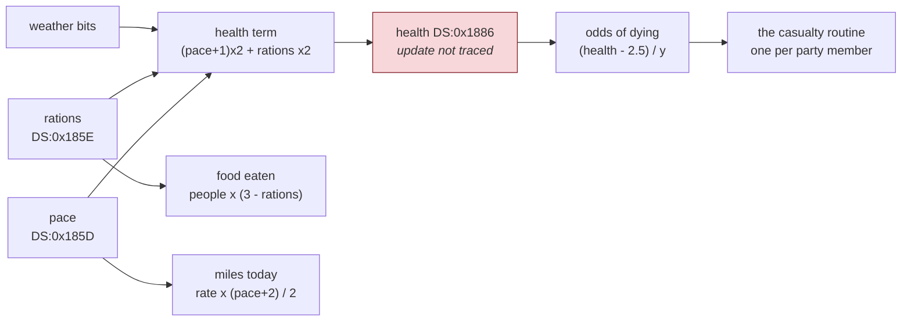

# The Oregon Trail — the code

*Document three of four. Before: [01 — the game](01-the-game.md),
[02 — architecture](02-architecture.md). After:
[04 — porting](04-porting.md).*

This is a walk through what has actually been read. Two file formats, the
start-up sequence, the memory check and **the whole of the copy protection** are
traced here. The game's own logic — the trail, the store, the rivers, the
hunting, the illnesses — is not, though it is now *located*, and
[document two](02-architecture.md#what-is-still-unknown) says so.

Two of the sections below are corrections. The memory check is real code that
**cannot fire on any machine that can run the program**, and the licence check
does not refuse on a home computer at all — an earlier session's claim that it
did came from running the program in an emulator with no disk. Both are left in
place with the reasoning that produced the wrong answer, because that reasoning
is the more useful half.

Addresses are offsets into the unpacked image. The image begins 32 bytes into
`work/unpacked.exe`, and **segment words in it are 0x1000 higher than the
image-relative value**, because the dump was taken after the packer applied
relocations at that segment.

---

## Reading compiled Pascal, if you have only read assembly before

The other games in this repository were written by hand. This one was written
by a compiler, and compiler output has a grammar you can learn in five minutes.

**A far call is a call to another unit.** `lcall 0x319F:0x03B5` means "segment
`0x319F`, offset `0x3B5`". Within a unit, calls are near — two or three bytes,
no segment. So the far calls are exactly the module boundaries, which is what
[document two](02-architecture.md#fifteen-segments-one-per-unit) exploits.

**Every procedure starts and ends the same way.**

```nasm
    push bp
    mov bp, sp
    sub sp, 0x100        ; local variables
    ...
    mov sp, bp
    pop bp
    retf 0x0004          ; and drop four bytes of arguments
```

`[bp+6]`, `[bp+8]` and upward are the arguments; `[bp-2]`, `[bp-4]` and
downward are the locals. Hand-written assembly rarely bothers with any of this
— Zaxxon has three `push bp` in 2,655 instructions — so its presence is itself
the fingerprint that a compiler was here.

**A Pascal string is length-prefixed.** The first byte is the length, then that
many characters. No terminator. So `Your computer must have…` sits in the file
as `41 59 6F 75 72…` — `0x41` is 65, the length.

**Arguments are pushed left to right and the callee cleans up**, which is the
opposite of C on both counts. That is why you see `retf 0x0004` rather than a
bare `retf`.

## Start-up: the chain of unit initialisers

The entry point, at `0x10A`:

```nasm
0010A  lcall 0x319F:0x0000        ; System   -- Borland's runtime
0010F  lcall 0x313D:0x0000
00114  lcall 0x2DE9:0x1326
00119  lcall 0x28DC:0x0000
0011E  lcall 0x25BB:0x0000
00123  lcall 0x251C:0x09E5
00128  push bp                    ; and now the program's own begin block
00129  mov bp, sp
0012B  sub sp, 0x100
```

This is how every Turbo Pascal program starts. A unit may have an
`initialization` section; the compiler emits a call to each one, in dependency
order, before the program's own code runs. Six calls, six units with something
to set up.

It also means **the order of those six calls is the dependency order of the
program**, which is real information about how it was built: `System` first,
because everything needs it, and the program last because it needs everything.

## The System unit initialising itself

The first of those calls lands at `0x219F0`:

```nasm
    mov dx, 0x3348
    mov ds, dx                  ; DS = DGROUP, and that is the last word on
                                ;   the subject of where data lives
    mov [0x1566], es            ; ES holds the PSP on entry -- save it, this
                                ;   is Turbo Pascal's PrefixSeg
    xor bp, bp
    mov ax, sp
    add ax, 0x13
    mov cl, 4
    shr ax, cl                  ; (SP + 19) / 16 -- round up to a paragraph
    mov dx, ss
    add ax, dx                  ; the first paragraph above the stack
    mov [0x153E], ax            ; HeapOrg
    mov [0x1540], ax            ; HeapPtr  -- nothing allocated yet
    add ax, [0x1538]
    mov [0x1542], ax            ; HeapEnd
    ...
    mov ax, es:[2]              ; the PSP's "top of memory" word
    sub ax, 0x1000
    mov [0x1554], ax
```

Two things worth pointing out to someone who has only read hand-written code.

**The heap is computed, not declared.** There is no heap in the executable file.
The runtime works out where it can start — immediately above the stack, rounded
up to a paragraph — and how far it can go, from a word DOS left in the PSP. A
1990 program had no idea how much memory it would be given, so it asks at
start-up.

**`mov [0x1566], es` is the whole reason `PrefixSeg` exists.** On entry, `ES`
points at the PSP: the 256-byte block DOS puts in front of every program,
holding the command line and the memory ceiling. The runtime has exactly one
moment to capture that before something else overwrites `ES`, and this is it.

## The memory check, and the claim it refutes

At `0x14BF3`, in the program's own code:

```nasm
0014BF3  lcall 0x319F:0x03B5       ; into the runtime
0014BF8  mov [bp-4], ax            ; a 32-bit result: DX:AX
0014BFB  mov [bp-2], dx
0014BFE  cmp word [bp-2], 0        ; signed 32-bit compare, high word first
0014C02  jl  0014C0D               ;   negative -> definitely below
0014C04  jg  0014C30               ;   positive -> definitely above
0014C06  cmp word [bp-4], 0x88B8   ;   equal -> compare the low word: 35,000
0014C0B  jae 0014C30
0014C0D  mov di, 0x3ED8            ; the "below" path
0014C10  push ds / push di         ;   a string variable
0014C12  mov di, 0x475C
0014C15  push cs / push di         ;   and a literal, in the code segment
0014C1A  lcall 0x319F:0x1635
0014C1F  lcall 0x319F:0x15B8
0014C24  lcall 0x319F:0x020E
```

Three-instruction signed 32-bit comparison — high word against zero, then
`jl`/`jg` to settle it, then the low word — is what a compiler emits for
`if LongIntValue < 35000`. You would not write it by hand that way.

The literal at `CS:0x475C` is:

```
Your computer must have at least 512K memory to run Oregon Trail.
```

and the routine called at `0x319F:0x03B5` is `MemAvail`:

```nasm
0021DA5  call 0021FBE              ; walk the free list
0021DA8  mov ax, si
0021DAA  mov dx, di
0021DAC  les di, [0x1552]          ; FreeList, a far pointer
0021DB0  sub dx, [0x1550]
0021DB4  sub ax, [0x154E]          ; a far-pointer subtraction ...
0021DB8  jae 0021DE1
0021DBA  add ax, 0x10              ; ... normalised to paragraphs
0021DBD  dec dx
```

**An earlier session read this same code as a copy-protection date check** —
`GetDate`, 35,000 days after 1899-12-30, the game locking itself after 1995.
The address was exactly right; the meaning was not. And the arithmetic behind
the wrong answer genuinely works: 35,000 days after that epoch *is* late 1995.

What separates the two readings is a string sixty-five bytes away, and nothing
else. That is worth remembering as a method: **when a constant admits two
meanings, look for the message the program prints, not for a better argument.**

### And the check can never fire

That is what the code says. What it *does* is a different question, and the two
turned out not to match.

`MemAvail` returns the free **heap**, and Turbo Pascal decides how big the heap
is before your program runs, from two numbers in the `.EXE` header. `minalloc`
is the smallest block DOS is allowed to hand over; if the machine cannot spare
it, DOS refuses to start the program at all. For `OREGON.EXE`:

```
packed image      81,864 bytes
minalloc          10,445 paragraphs = 167,120 bytes
minimum block     248,984 bytes  (243K)
```

So DOS will not load this program into less than 243K, and *inside* that
minimum there is already a heap. The question is whether the heap at its
smallest is under 35,000 bytes. Measuring it under DOSBox-X, by filling memory
with resident programs of known size and stepping down one kilobyte at a time:

| free conventional memory | what happens |
|---|---|
| 263K | loads; dies later with `Not enough memory.` |
| 250K | loads; dies later with `Unable to find necessary files.` |
| 244K | loads; dies later with `Unable to find necessary files.` |
| 243K | DOS refuses: `Unable to run program (errcode=8)` |

The 243K row agrees with the header's 248,984 bytes to within a rounding, which
is a pleasant check on the arithmetic. But **the 512K message never appeared at
any level**. The rows that die are dying of something else, and we can prove the
memory check passed in each: those two messages are printed by a handler the
program installs at `0x14C30`, *after* the check. If the check had fired it
would have printed its own message and stopped before the handler existed.

So the guard is real, correct, and unreachable: by the time DOS agrees to start
the program at all, the heap is already above 35,000 bytes. It is a seatbelt
bolted to a seat you cannot sit in.

The honest caveat: the numbers that would settle it *by arithmetic* cannot be
had, because LZEXE rewrites `minalloc` and `maxalloc` when it packs a file, so
the values in the header are the packer's, not the compiler's. Backing the
original heap sizes out of them gives an answer that contradicts the
measurement, which is how the attempt was known to be wrong. **When a derivation
disagrees with a measurement, the derivation has a bad assumption in it** — here,
that LZEXE leaves those two fields alone.

## The protection, traced

[Document two](02-architecture.md#the-protection-that-is) located the licence
strings and said the code had not been followed. It has now. The whole scheme is
2,544 bytes in segment `0x0151C`, it is the most self-contained thing in the
program, and it is worth reading in full because it is a small, complete design
— not a trick.

**It is called first.** The program's own `begin` block, at `0x128`:

```nasm
00128  push bp                    ; the program's begin block
00129  mov bp, sp
0012B  sub sp, 0x100
0012F  lcall 0x2042:0x47BA        ; <- the gate. The very first statement.
00134  lcall 0x2042:0x4108
```

And the gate itself, at `0x14BDA`:

```nasm
0014BE1  mov ax, 0x132             ; 306
0014BE4  xor dx, dx                ;   as a 32-bit value, 0000:0132
0014BE6  push dx / push ax
0014BE8  mov al, 1                 ; "yes, you may show messages"
0014BEA  push ax
0014BEB  lcall 0x251C:0x0000       ; the licence check
0014BF0  mov [bp-5], al            ; ... and the answer is thrown away
0014BF3  lcall 0x319F:0x03B5       ; MemAvail -- the section above
```

The result is stored into a local that is never read, which looks like a bug and
is not: **every path that would return `False` calls `Halt` first**, so the
function only ever returns to say yes.

### What it reads

The check opens a file. Its name is a Pascal string in the data segment at
`DS:0x0E20`:

```
product.pf
```

which ships with the game, and is **350 bytes** — the same number as the record
size the program asks for:

```nasm
0015299  mov di, 0x1B16            ; the file variable
001529C  push ds / push di
001529E  mov ax, 0x15E             ; 350
00152A1  push ax
00152A2  lcall 0x319F:0x1742       ; Reset(f, 350)
```

An untyped `Reset` with a record size, one `Read` into a 350-byte buffer at
`DS:0x1B96`, a `Close`, and the three `IOResult` values added together — if the
sum is non-zero the file is bad. That is the idiom for "did any of this fail",
and it is why the failure message is about the *disk* rather than the file:

```
This disk appears to be damaged or some
files are missing.

Please check your disk, use your backup
or contact MECC.
```

### The record, and how its fields were confirmed

The code reads seven fields out of that buffer. Naming them from the branches
they control gives:

| offset | read as | in the shipped file |
|---|---|---|
| `+0x00` | product number, 32-bit | 306 |
| `+0x04` | membership-copy flag | 0 |
| `+0x06` | demo flag | 0 |
| `+0x0A` | network-licence flag | **1** |
| `+0x0C` | licence slot — overwritten at load, never read from the file | 0 |
| `+0x0E` | demo uses remaining | 0 |
| `+0xBA` | membership override | 0 |

The rest of the record is text, and it is not decoration — the refusal message
prints MECC's telephone number from it:

```
0x016  Copyright 1988-1991, MECC
0x03F  3490 Lexington Avenue North
0x068  St. Paul, Minnesota  55126-8097
0x091  (612) 481-3549
0x135  The Oregon Trail
```

That table is a claim about a file, made by reading code. It can be tested by
editing the file and watching what the program does, which is worth more than
any amount of further reading:

| what was changed | predicted | observed |
|---|---|---|
| nothing | runs | runs |
| `PRODUCT.PF` deleted | halt 1 | halt 1 |
| `+0x00` set to 307 | halt 1 | halt 1 |
| `+0x04`=1, `+0xBA`=0 | halt 1 | halt 1 |
| `+0x04`=1, `+0xBA`=1 | runs | runs |
| `+0x06`=1, `+0x0E`=0 | halt 1 | halt 1 |
| `+0x06`=1, `+0x0E`=5 | runs, and the file is rewritten to 4 | **runs, file now says 4** |

Seven for seven, and the last row is the one that matters: it is the only
prediction that could not have been luck. The program decremented a counter,
wrote 350 bytes back over the file, and carried on — which confirms the field
*and* the save path *and* that the count is uses rather than days.

### The product number is not a pointer

`0000:0132` looks like a far pointer, and the code compares it like one:

```nasm
0015203  les ax, [bp+8]
0015206  mov dx, es
0015208  cmp dx, [0x1B98]          ; the record's +0x02
001520C  jne 0015214
001520E  cmp ax, [0x1B96]          ; the record's +0x00
0015212  je  0015221
```

It is not a pointer. It is the number **306**, MECC's catalogue number for The
Oregon Trail, passed as a `Pointer` because that is the convenient 32-bit type
in Turbo Pascal 5.0 — there is no `LongInt` in the call. Every MECC title shared
this licensing unit, so each had to say which product it was, and a licence file
for one program will not start another.

This is a small lesson in reading compiler output: **the type in the source is
not recoverable from the instruction.** `les` says "load a far pointer" because
that is the fastest way to move four bytes, not because anything is being
dereferenced. Nothing here ever follows it.

### Five gates, in order

```
CheckLicence(showMessages, productNumber) : Boolean

  1  load PRODUCT.PF                     failed -> "disk appears to be damaged"
  2  membership flag set, override clear -> "MECC Membership product copy"
  3  productNumber <> the file's         -> the same message
  4  demo flag set: uses := uses - 1
     save the file back                  failed -> "disk appears to be damaged"
     uses now <= 0                       -> "MECC Demo product whose time..."
  5  network flag set and no slot        -> "licensed for use by a single
                                             computer at a time"
  otherwise                              -> True
```

Four distinct products, one unit: a full copy, a MECC-membership copy that may
only be duplicated with MECC's own tool, a demo that expires after a fixed
number of runs, and a network copy licensed per concurrent user.

### The network licence, which is a lease on a timestamp

Gate 5 is the interesting one, because it has no server.

```
AcquireSlot : Boolean
  if not the program is on a network drive then exit(True)
  FindFirst('product.pf');   if it is not there        then exit(False)
  if the file is read-only                             then exit(False)
  if its timestamp is less than 30 minutes old         then exit(False)
  stamp it with the current time
```

Every step is a DOS call and there is nothing else to it:

- **"on a network drive"** is `DosVersion` ≥ 3.1, then `INT 21h AX=4409h` —
  IOCTL "is this drive remote" — and bit 12 of the returned `DX`.
- **read-only** is the attribute byte in the `SearchRec` that `FindFirst`
  filled in. A licence file on a write-protected share can never be claimed,
  which is the correct behaviour: a lock you cannot take is a lock you do not
  hold.
- **the lease** is the file's own modification time, unpacked with `UnpackTime`
  and compared against `GetDate`/`GetTime`. Different day, or either year equal
  to 1980, and the lease is treated as expired — 1980 is the DOS epoch, so that
  is the "this machine has no clock" case, and it fails *open*.
- **the timeout** is a word in the data segment at `DS:0x1020`, and it is
  **30**, in minutes.

Claiming the licence is `SetFTime` with the current time. And on the way out,
the program calls a second entry point in the same unit which does `SetFTime`
with the timestamp it saved at start-up — **putting the old time back**, so the
lease is released immediately rather than lingering for half an hour.

That is the whole mechanism: *the licence is the file's modification date.* No
daemon, no lock file, no protocol. It costs one directory entry, works on any
DOS network redirector without knowing which one, and degrades to "everyone may
run it" when the clock is unset. If a machine crashes while holding it, the
lease expires by itself in thirty minutes.

It also fails in a way its authors chose. Thirty minutes is long enough that two
pupils in a lab cannot both start the program, and short enough that a crashed
machine frees up within a lesson. The number is a policy, and it is a policy
stored as a constant in the data segment.

### Why it never refuses on a home machine

Gate 5 begins `if not on a network drive then exit(True)`. On a local disk the
whole network branch is skipped and the slot is granted unconditionally — which
is why the shipped `PRODUCT.PF` can carry `+0x0A = 1`, a *network* licence, and
still run perfectly well on a standalone PC.

This was checked rather than assumed. Compiling a probe with the same Turbo
Pascal 5.0 and asking DOS the same question under DOSBox-X:

```
dosversion major=5 minor=0
ioctl4409 flags=29254 ax=768 dx=2050 remote=0
findfirst doserror=0 attr=32 size=350 readonly=0
```

`DX = 2050 = 0x0802`; bit 12 is clear; not remote. The program then runs, and
does not stop.

### Correcting document two

[Document two](02-architecture.md#running-it-at-last) reported that the program
"calls the licence check and terminates", and listed *why the licence check
refuses* as an open question. **The premise was wrong: it does not refuse.**

What happened was that the emulator had no file system, so `Reset` on
`product.pf` failed and the check took gate 1 — the damaged-disk path — and
halted. That is now reproducible on purpose: delete `PRODUCT.PF` and run the
real program under DOSBox-X, and the screen says

```
This disk appears to be damaged or some
files are missing.

Please check your disk, use your backup
or contact MECC.

-- Press any key --
```

which is exactly what an emulator with no disk would provoke. The observation
was right; the conclusion drawn from it was not. **A program that stops when you
remove its world has not told you anything about protection.**

### Reading the screen of a program that ignores redirection

One practical note, because it cost an hour and will cost the next person the
same.

Redirecting the program's output to a file captures nothing:

```powershell
OREGON.EXE > OUT.TXT      # produces an empty file, every time
```

The reason is Turbo Pascal's `Crt` unit. When a program `uses Crt`, the unit's
initialiser **replaces the device driver behind `Output`** with one that writes
straight into video memory. That is what makes `Crt` fast, and it means DOS
never sees the text, so the shell has nothing to redirect. Any TP program with
`uses Crt` behaves this way; it is not specific to this game.

The way around it is to read the screen back afterwards. The text is still
sitting in video RAM when the program halts, so a second program can dump it:

```pascal
var scr : array[0..24, 0..79, 0..1] of Byte absolute $B800:0000;
```

Twenty lines of Pascal, run straight after the program under test, and the
messages above are recovered verbatim. It is the cheapest oracle in this
folder, and it works for anything that dies in text mode.

## What the program's exit codes mean

At `0x14C30`, immediately after the two checks, the program installs its own
`ExitProc` — Turbo Pascal's shutdown hook — saving the previous one first:

```nasm
0014C30  les ax, [0x155C]          ; the old ExitProc
0014C36  mov [0x168E], ax          ;   saved for the chain
0014C47  mov ax, 0x4272            ; and ours: ui:0x4272 = image 0x14692
0014C4D  mov [0x155C], ax
```

The handler at `0x14692` reads `ExitCode` and translates it:

| exit code | message |
|---|---|
| 0 | *(nothing)* |
| 1 | `No graphics hardware was detected. / Your computer must have at least CGA / graphics capability to run Oregon Trail.` |
| 2 | `Unable to find necessary files. / Please start the program from the / Oregon Trail directory.` |
| 203 | `Not enough memory.` |
| 255 | `^C` |

Two of those are Turbo Pascal's own runtime error numbers — 2 is "file not
found" and 203 is "heap overflow" — and MECC chose its own `Halt` codes to
collide with them deliberately, so one handler covers both a failure the program
detects and a failure the runtime detects. It is a neat trick and it is why the
memory-pressure experiment above produced `Not enough memory.` rather than a raw
`Runtime error 203`.

The handler also releases the network licence, as its first act, before anything
else — which is the right order, because a program that crashes while holding a
lab licence is the failure everyone remembers.

## Naming runtime calls by compiling something else

Every `lcall 0x319F:…` and `lcall 0x2DB8:…` above needed a name, and guessing
from argument shapes gets you most of the way and no further. There is a better
method available here, because **the compiler that built this program can be
run**.

Write a probe that calls each routine once, in a known order:

```pascal
program Off;
uses Dos;
begin
  Assign(f,'X'); Reset(f,350); Rewrite(f,350); Close(f);
  n := IOResult;   L := MemAvail;
  n := DosVersion; MsDos(r);
  GetDate(a,b,c,d); GetTime(a,b,c,d);
  FindFirst('X',63,sr); UnpackTime(L,dt); PackTime(dt,L); SetFTime(f,L);
  ...
end.
```

compile it with the game's own Turbo Pascal 5.0, and read the far calls out of
the result in order. The first four offsets matched the game exactly:

```
Dos+0x0000  DosVersion      Dos+0x00E3  GetCBreak
Dos+0x0005  MsDos           Dos+0x00F5  SetCBreak
Dos+0x0071  GetDate
Dos+0x00A7  GetTime
```

and then every later offset was wrong by exactly the same amount:

```
              probe    game    difference
FindFirst     0x014A  0x017E      0x34
SetFTime      0x012B  0x015F      0x34
UnpackTime    0x01C5  0x01F9      0x34
PackTime      0x0209  0x023D      0x34
```

A constant shift is a fact, not a coincidence. Turbo Pascal **smart-links**: a
routine you never call is not merely unreachable, it is not in the file, and
everything after it moves up. Fifty-two bytes of routine were in the game and
not in the probe, somewhere between `SetCBreak` and `SetFTime`.

So add candidates and compile again. `GetVerify` and `SetVerify` moved the
offsets by `0x1D` — the right *kind* of effect, the wrong size. `DiskFree` and
`DiskSize` moved them by exactly `0x34`, and every offset in the probe then
matched the game's, all fourteen of them.

That is a testable prediction, and it costs one search to check: **if those two
were linked, the game must call one of them.** It does, once, at `Dos+0x0104` —
and a further probe that calls only `DiskFree` puts `DiskFree` at exactly
`0x0104`. Checking free disk space before writing a saved game is precisely what
you would expect, and now it is not a guess.

The same run named the last three unknowns — `Dos+0x0275` is `GetIntVec`,
`Dos+0x028D` is `SetIntVec`, `Dos+0x02A0` is `SwapVectors` — which gives the
program's complete use of Borland's `Dos` unit:

| offset | routine | calls |
|---|---|---|
| `0x0000` | `DosVersion` | 1 |
| `0x0005` | `MsDos` | 1 |
| `0x0071` | `GetDate` | 2 |
| `0x00A7` | `GetTime` | 2 |
| `0x00E3` | `GetCBreak` | 1 |
| `0x00F5` | `SetCBreak` | 2 |
| `0x0104` | `DiskFree` | 1 |
| `0x015F` | `SetFTime` | 2 |
| `0x017E` | `FindFirst` | 5 |
| `0x01BC` | `FindNext` **[inferred]** | 3 |
| `0x01F9` | `UnpackTime` | 1 |
| `0x023D` | `PackTime` | 1 |
| `0x0275` | `GetIntVec` | 1 |
| `0x028D` | `SetIntVec` | 10 |
| `0x02A0` | `SwapVectors` | 2 |

`0x01BC` is marked inferred because no probe put a call there: it sits between
`FindFirst` and `UnpackTime` in a gap that exists in the probe too, so it is
linked without being called — `FindNext` shares code with `FindFirst` and comes
in with it. Everything else in that table is established by construction.

Ten `SetIntVec` calls and two `SwapVectors` say the program hooks interrupts and
puts them back, which is the shape of a game taking over the keyboard and timer.
None of that has been traced.

**What transfers.** This is differential compilation, and it is the strongest
technique available against any compiled program whose compiler you can obtain:
stop trying to recognise library code and instead *generate* it, then compare.
It converts a judgement call into an equality test. And the failure — the
constant `0x34` — was more useful than the successes, because it revealed the
smart-linker and turned "these offsets look wrong" into "the game links two
routines I did not".

The negative result worth recording alongside it: **a table of runtime-call
offsets is not portable between two programs built by the same compiler.** Only
the prefix up to the first omitted routine is stable. `Halt` at `System+0x00D8`,
`IOResult` at `System+0x0207` and the automatic I/O check at `System+0x020E`
were identical in every probe and in the game, and are safe anchors; anything
higher must be re-derived per program.

## The clock, which is nine lines long

The Dos-unit inventory above showed ten `SetIntVec` calls, one `GetIntVec` and
two `SwapVectors`, and said none of it had been looked at. It has now, and it is
smaller than it sounds: **every one of the ten hooks the same vector, `INT 1Ch`
— the BIOS timer tick, 18.2 times a second.**

The tail of the start-up gate installs it:

```nasm
0014CD2  mov al, 0x1C              ; the timer tick
0014CD4  push ax
0014CD5  mov di, 0x16AA            ; somewhere to keep the old one
0014CDA  lcall 0x2DB8:0x0275       ; GetIntVec(0x1C, saved)
0014CDF  mov ax, 0x0021            ; and ours: ui:0x0021,
0014CE2  mov dx, 0x2042            ;   which is image 0x10441
0014CE5  mov [0x16AE], ax
0014CE8  mov [0x16B0], dx
0014CEC  mov al, 0
0014CEF  lcall 0x2DB8:0x00F5       ; SetCBreak(False) -- no Ctrl-Break
```

Two far pointers, kept a few bytes apart: `0x16AA` is DOS's handler and `0x16AE`
is the game's. The ten `SetIntVec` calls are **five install-and-restore pairs**,
each one pushing whichever of the two the moment calls for. The program runs its
own clock only while it needs it, and hands the tick back the rest of the time.

The handler itself, at `0x10441`:

```nasm
0010441  push ax / bx / cx / dx / si / di / ds / es / bp
001044A  mov bp, sp
001044C  mov ax, 0x3348            ; DGROUP
001044F  mov ds, ax                ;   -- because an interrupt cannot assume DS
0010451  les ax, [0x16B2]          ; a 32-bit counter
0010457  add ax, 1
001045A  adc dx, 0                 ;   incremented with carry into the high word
001045D  mov [0x16B2], ax
0010460  mov [0x16B4], dx
0010464  ... pop everything ...
001046F  iret
```

That is the whole thing. **A `LongInt` at `DS:0x16B2` that counts ticks**, and
no other effect — no music, no scrolling, no input polling.

Three things in it are worth naming, because they are what an interrupt handler
always has to do and what a compiler does for you:

- **It saves every register**, including the segment registers. An interrupt
  arrives between two arbitrary instructions of whatever was running, and a
  handler that changes any register has corrupted a program it has never heard
  of.
- **It loads `DS` itself.** This is the one beginners get wrong. Your data
  segment is not set up for you — the interrupted program's `DS` is still
  loaded, so a handler that touches a global without doing this reads and writes
  someone else's memory. `mov ax, 0x3348 / mov ds, ax` is that fix, and its
  presence is a reliable sign you are looking at an interrupt handler rather
  than a procedure.
- **It ends in `iret`, not `ret`.** An interrupt pushed the flags as well as the
  return address, so returning the ordinary way leaves the stack one word out.

In Turbo Pascal this is a one-word declaration — `procedure Tick; interrupt;` —
and the compiler emits all of it. The generated shape is so distinctive that it
is worth learning as a signature: a run of nine `push`es followed by a literal
loaded into `DS` is an interrupt handler, in any compiled DOS program.

It also **does not chain** to the handler it replaced. `INT 1Ch` is the vector
the BIOS provides precisely for programs to take over, so this is legal rather
than rude — but it does mean anything else counting ticks stops counting while
the game is running, which is why the restores exist.

**What transfers.** A fixed-frequency counter incremented by hardware and read
by the main loop is how you get time in an environment with no clock function
worth calling. Nothing here waits on the timer; the loop reads the counter and
decides how much has passed. That is the same separation a modern game makes
between a fixed-timestep simulation and a display that renders whenever it can,
and it is the reason such a game keeps correct speed on a faster machine.

The two `SwapVectors` calls sit either side of the code that prints
*Please insert The Oregon Trail Disk 2* — putting DOS's own handlers back while
the machine is waiting for a human to swap a floppy, which is the moment you
most want Ctrl-Break and the DOS critical-error handler to behave normally.

## What the program does with the date

[Document two](02-architecture.md#what-is-still-unknown) listed this as unknown
and guessed at stamping a saved game or a tombstone. **The guess was wrong and
the answer is nothing.**

The program calls `GetDate` twice and `GetTime` twice, and all four calls are
inside the licence unit — at `0x15409`/`0x15422` in the lease check and
`0x15B1F`/`0x15B38` in the claim. The single `INT 21h AH=2Ah` at `0x1DBF4` is
inside Borland's `GetDate`, and the lease is its only caller.

So the game never learns what day it is. The tombstones and the saved games
carry no date, and the only thing the clock is used for is deciding whether
another machine in the lab still holds the licence.

## The first numbers out of the simulation

The game's own logic is the large thing still unread, and this is a start on it
rather than a finish — but it comes with the technique, which is the part that
generalises.

**The game does its arithmetic in floating point.** Not integers. The scoring
routine is a chain of calls into Borland's runtime with operands in registers,
and the constants are six bytes wide:

```nasm
0008128  mov cx, 0x0086
000812B  xor si, si
000812D  mov di, 0x4800
0008130  lcall 0x319F:0x0C60       ; divide
0008135  lcall 0x319F:0x0C72       ; and truncate to an integer
```

Turbo Pascal's `Real` is a **six-byte type of Borland's own design**, not the
IEEE format you know:

```
byte 0     exponent, biased by 0x81; zero means the value is zero
bytes 1-5  mantissa, least significant byte first, with an implied leading 1
bit 7 of byte 5   the sign
```

An operand travels in `AX:BX:DX` and a literal in `CX:SI:DI`, two bytes each,
in that order. So `CX=0x0086, SI=0, DI=0x4800` is the byte string
`86 00 00 00 00 48`, and that decodes to **50.0**.

Why six bytes and not eight: in 1990 a floating-point coprocessor was an
optional chip most machines did not have, so Turbo Pascal shipped its own
software format sized for what its own library could multiply quickly. Programs
compiled this way run on any machine and use no 8087 at all. The cost is that
the format is Borland's, so nothing else reads it — which is exactly why a
reverse engineer has to decode it by hand.

Decoding every such constant in the scoring routine gives eight numbers:

| where | value | what it is |
|---|---|---|
| `0x07F5E` | 2 | |
| `0x07FF5` | 35 | |
| `0x08045` | 0.5 | added before truncating — this is how you round |
| `0x08076` | 0.5 | the same, again |
| `0x08128` | **50** | bullets per point |
| `0x08160` | **25** | pounds of food per point |
| `0x08181` | **5** | dollars per point |
| `0x08224` | 1 | |

The three in bold are the scoring rates, and one of them is nailed down rather
than merely lined up: the value at `DS:0x183F` is divided by 25, and the same
variable is formatted into a buffer at `[bp-0x229]` that is later printed
immediately before the string `' pound'`. **Food scores one point per 25
pounds.** The other two are read the same way and in the same order as the
lines they print — bullets at one point per 50, cash at one point per $5 — and
are **[inferred]** to that extent, because the buffer was not traced end to end.

The two 0.5 constants are worth a sentence on their own. There is no rounding
instruction; adding a half and truncating *is* the rounding, and seeing that
idiom tells you the program is being careful about a value that is not a whole
number — money, in this case.

And the profession multiplier is right there in the strings, needing no
arithmetic at all:

```
0x07DAF  carpenter      0x07DB9  doubled
0x07DC1  farmer         0x07DC8  tripled
0x07DD0  For going as a ...  , your ...  points are ...
```

A banker gets no multiplier and no sentence. That is the whole difficulty
setting: choosing the profession that starts with the least money multiplies
your score the most.

### Naming the arithmetic, without trusting an address

Those constants are useless until you know which operation consumes them —
50 could be a divisor or a threshold, and the difference is the whole meaning.
The obvious move is to look up `System+0x0C60` in a table of Turbo Pascal
runtime offsets. There is no such table, and
[the section above](#naming-runtime-calls-by-compiling-something-else) explains
why: smart-linking moves everything.

So match the **code** instead of the address. Compile a probe that uses every
`Real` operation once, find each helper in the probe by its call, take 24 bytes
of its body, and search for those bytes in the game:

```
probe System+0x0525  ->  game System+0x0C48    Real add
probe System+0x052B  ->  game System+0x0C4E    Real subtract
probe System+0x0537  ->  game System+0x0C5A    Real multiply
probe System+0x053D  ->  game System+0x0C60    Real divide
probe System+0x0547  ->  game System+0x0C6A    Real compare
probe System+0x054B  ->  game System+0x0C6E    LongInt -> Real
probe System+0x054F  ->  game System+0x0C72    Trunc
```

Byte-for-byte identical bodies, so this holds regardless of where either
program put them. And there is a free check on it: the gaps between the probe's
offsets are 6, 12, 6 — and the gaps between the game's are 6, 12, 6. The whole
dispatch block is laid out identically in both, which is what you would expect
of a table the linker emits as a unit, and is not something two unrelated
readings would agree on by accident.

That makes the scoring constants readable at last: `0x0C60` is **divide**, so
bullets ÷ 50 and food ÷ 25 and cash ÷ 5 really are rates rather than thresholds.

### Every random decision in the game

The same technique locates `Random`, which is the key to the whole simulation:

```
game System+0x0CAA    Random : Real        (0 <= r < 1)
game System+0x0C94    Random(n) : Integer
```

Search the image for calls to those two and you have **every chance the game
takes**: 29 calls to `Random`, and 2 to `Random(n)`.

Turbo Pascal emits `if Random < p` as a call, then the six-byte literal in
`CX:SI:DI`, then the comparison — so **the probability sits exactly five bytes
after the call**, and it can be read straight off. Where it does:

| where | odds | what it decides |
|---|---|---|
| `0x09107` | `Random < 0.95` | whether anyone will trade with you today |
| `0x091E3` | `Random < 0.67` | *"He / She will trade you …"* |
| `0x01EEE` | `Random < 0.33` | in the travelling code |
| `0x029C6` | `Random < 0.20` | in the travelling code |
| `0x0B1EA` | `Random < 0.04` | in the scoring segment |
| `0x13EAA` | `Random < 0.30` | in the events code |

and nine more compare against `0.5`. The remaining calls scale `Random` by a
*variable* rather than a constant, which is the interesting half — those are the
decisions whose odds depend on the state of your party.

### One routine kills people, and it takes the odds as an argument

The clearest thing found so far, and the one a port would need first.

At `ui+0x30B6` (image `0x134D6`) there is a procedure that takes a `Real` and
does this:

```
n := HowManyInTheParty
for i := n - 1 downto (1 if n > 1 else 0) do
    if Random < p then
        ... afflict member i ...
```

Two details make it worth reading closely.

**The party is an array of eleven-byte records**, and the code says so:

```nasm
0013547  mov ax, [bp-0x106]        ; the member's index
001354B  mov dx, 0x000B            ; times eleven
001354E  mul dx
0013550  mov di, ax
0013552  add di, 0x17FE            ; plus the base of the array
```

Eleven bytes is a Pascal `string[10]` exactly — a length byte and ten
characters. So a party member *is* a name and nothing else; the health and
illness state must live in parallel arrays elsewhere.

**The loop counts down to 1, not 0, when there is more than one person.** Member
zero is skipped. That is the player — the one whose name you typed — and the
game will not take them with this routine. Whatever kills the leader is
somewhere else, which is a real design decision sitting in a `jle`.

Five places call it, and the probability is not a constant in any of them:

```nasm
004871  mov cx, 0x82 / xor si, si / mov di, 0x2000     ; the literal 2.5
004879  lcall System+0x0C4E                            ; subtract
004881  lcall System+0x0C60                            ; divide
004889  lcall ui+0x30B6                                ; and use that as p
```

and the divisor is on the stack from a few instructions earlier:

```nasm
000484F  mov al, [bp+6]            ; the caller's severity
0004854  mov cx, 0x000A / imul cx  ;   times ten
0004865  mov ax, ss:[di-0xA]       ; health, passed in by the caller
0004871  ... 2.5 ... RealSub
0004881  lcall System.RealDiv
```

```
odds per person = (health - 2.5) / (severity x 10)
```

with 3.0 in place of 2.5 at the other call site. **The chance of losing someone
is computed from the state of the party**, not drawn from a table — which is why
searching for a table of death probabilities finds nothing.

Two of the five callers are identifiable from what they print, and they are the
rafting section:

```
The raft has hit a rock.
The raft has hit the shore.
The raft has missed the landing.
  The raft is destroyed; everything has been lost.
```

The other three are in the travelling code and print nothing nearby, because the
message comes from the illness table at `0x24156` rather than from a literal.

**What transfers.** Notice the shape: one routine, one probability argument,
five callers. The game does not have a drowning system and a disease system and
an accident system — it has *one* casualty system that everything hands a number
to. That is the same instinct as the sprite table in Zaxxon and the tile
dispatch in Hard Hat Mack, and it is the single most reliable thing to look for
in a game of this era: **the place where many different situations become one
number.** Find that and you have found the design.

### When reading fails, play it

The store resisted all of that, and the way it resisted is informative. Only one
price is a literal anywhere in the program:

```nasm
00E1FD  cmp word [bp-2], 0x07D0       ; 2,000
00E202  jle 00E207                    ;   more than that is refused
00E207  mov ax, [bp-2]                ; the quantity typed
00E20A  cdq
00E20B  lcall System+0x0C6E           ; LongInt -> Real
00E210  mov cx, 0xCD7E / mov si, 0xCCCC / mov di, 0x4CCC     ; 0.2
00E219  lcall System+0x0C5A           ; multiply
```

**Food is $0.20 a pound, and you may not buy more than 2,000 pounds.** The other
four departments have no such constant, and the obvious next guess — a table of
`Real` prices — is wrong too: the `×6` indexing that looks like one addresses
`[bp+di-0x2A]`, a *local* array on the stack, which is a running total per
department rather than a price list.

So the prices are neither literals nor a static table, and static reading had
run out. But the emulator now runs the game, so the game can simply be asked.
Driving it with forty-two keystrokes — past the title, declining a saved game,
choosing to be a banker, typing five names, accepting them, leaving in March —
lands on this:

```
              Matt's General Store
             Independence, Missouri

                  March 1, 1848

     1. Oxen                    $0.00
     2. Food                    $0.00
     3. Clothing                $0.00
     4. Ammunition              $0.00
     5. Spare parts             $0.00

              Total bill:       $0.00

     Amount you have:        $1600.00
```

Two numbers there were never found by reading: the journey begins **1 March
1848**, and a banker starts with **$1,600**. And the banner at the top is the
same string at `0x0E79F` that
[nothing appears to reference](#the-first-numbers-out-of-the-simulation) — so the
negative result was about *how* it is reached, not whether, and the indirection
is still unidentified.

**What transfers.** Static reading and execution answer different questions, and
knowing which one you are stuck on saves a great deal of time. Reading tells you
*what the program can do* — every path, including the ones no player ever
reaches. Running tells you *what it does do*, but only along the path you drove
it down. The prices are a value the program computes at run time from a state
that reading alone cannot conjure; three keystrokes of a fourth department would
print them.

Three more keystrokes reach the oxen department, and it states its own price:

```
There are 2 oxen in a yoke;
I recommend at least 3 yoke.
I charge $40 a yoke.
```

**Oxen are $40 a yoke, and a yoke is two animals.** The ferry, elsewhere, is
`$5.00`. And the food cap has a sentence to match the `cmp` against 2,000:
`Your wagon may only carry 2000 pounds of food.`

### The store's text looked unreferenced, and the segment map was to blame

Worth stating carefully, because it was got wrong twice. The store's strings are
perfectly ordinary Pascal strings, packed one after another in the code segment:

```
0x0E793  len  44  "Matt's General Store\Independence, Missouri\"
0x0E7C2  len  56  "1. Oxen\2. Food\3. Clothing\4. Ammunition\5. Spare parts"
0x0E7FF  len  36  "      Total bill:\\\Amount you have:"
0x0E864  len   3  "1-5"
0x0E868  len  50  "Don't forget, you'll need\oxen to pull your wagon."
0x0E8A3  len  31  "Okay, that comes to a total\of "
```

There is nothing unusual about them. What looked unusual was that **not one
appeared to be referenced.** The idiom every other string in the program uses —
`mov di, offset` then `push cs / push di` — finds 266 references elsewhere and
seemingly none here. Nor did the offset appear as a bare word anywhere, so there
was no table of offsets either. Checked for six different strings, and rechecked
after getting the first one's address wrong by eleven bytes.

**All of that was true, and the conclusion drawn from it was still wrong,
because every one of those offsets was computed from the wrong segment base.**

The store is its own Turbo Pascal unit, based at `0x0CFA0`. The tool that
produced the segment map had folded it into its neighbour, because it is
far-called *exactly once* — from the main program, at offset `0x22B8` — and the
rule kept a candidate on two calls or on one call to offset zero. A unit entered
once, elsewhere than its start, satisfied neither.

Against the right base the mystery evaporates in one line:

```nasm
000E992  bf f3 17    mov di, 0x17F3        ; 0x0CFA0 + 0x17F3 = 0x0E793
000E995  0e          push cs
000E996  57          push di               ; -> "Matt's General Store\…"
```

and 69 of the 80 references in that unit land on a Pascal string. **The store
addresses its text exactly like everything else.**

The way to find it was to invert the question. Instead of asking *what
references this string*, ask *what segment base would make some existing `mov
di` reference it* — every `mov di, imm / push cs / push di` in the image, tested
against every candidate base, keeping the bases that are paragraph-aligned. One
base explained five references at once, and each of the five sat in the code
immediately after the string it pointed at.

Two things to carry away, and the second is the expensive one:

- **A wrong segment map does not fail where it is wrong.** It fails three steps
  away, as a *different* subsystem that appears to address its data by magic.
  Nothing about the store was strange; the map was.
- **"I checked carefully and found nothing" is not evidence of absence when
  every check shares one assumption.** Six strings, two address spaces, a
  corrected off-by-eleven — all of it careful, all of it resting on a segment
  base that was never questioned because a tool had printed it.

*This was fixed in the toolkit rather than worked around here: `tpscan.py` now
restores a single-call segment when the string references in the span it would
own resolve against it far better than against the neighbour, with four
regression checks. The Oregon Trail's eleven segments became fifteen, and the
35,008-byte "scoring" block turned out to be five units.*

### And then the shopkeeper simply tells you

The prices were never hidden. Walking the block forward from the oxen sentence,
treating each byte as a length and reading that many characters, the whole store
falls out of the file — because **the game states every price in its own
dialogue**:

| department | price | limit |
|---|---|---|
| **Oxen** | `$40 a yoke`, and *"There are 2 oxen in a yoke"* | `You may only take 20 oxen` |
| **Food** | `20 cents a pound` | `Your wagon may only carry 2000 pounds of food` |
| **Clothing** | `Each set is $10.00` | — |
| **Ammunition** | `boxes of 20 bullets. Each box costs $2.00` | — |
| **Spare parts** | wheel, axle and tongue, `$10 each` | `Your wagon may only carry 3 wagon …` |

with the shopkeeper's advice attached to each: at least 3 yoke of oxen, 200
pounds of food per person, 2 sets of clothes per person, and *"I see that you
have 5 people in all."*

Two things are worth taking from that.

**The recommendation is not the rule.** *"I recommend at least 3 yoke"* is
advice; the limit is 20 oxen. A modern game would enforce the recommendation or
grey out the choice. This one lets you leave Independence with one yoke and a
hundred pounds of flour, and the consequences arrive later, on the trail. That
is a design decision about where difficulty lives, and it is the reason the
game is remembered.

**Only the food price is also a constant in the code.** The `0.2` at `0x0E210`
duplicates what the text says. The others do not appear as `Real` literals at
all, which means the arithmetic for them is integer — dollars are whole numbers
for oxen, clothing, ammunition and parts, and only food needs a fraction of one.
That is why the search for a price table found nothing: there is no table,
there are five separate routines, and four of them never touch floating point.

Cross-checked against the running game for two of the five — oxen and food —
which is the pair the emulator was driven far enough to see.

### Pace and rations, in the game's own words

The same walk works on the two settings that drive the whole simulation, and it
gives the numbers the game actually quotes:

| pace | hours a day | what it costs you |
|---|---|---|
| **steady** | about 8 | *"frequent rests. You take care not to get too tired"* |
| **strenuous** | about 12 | *"just after sunrise … shortly before sunset … very tired"* |
| **grueling** | about 16 | *"almost never stop to rest … not enough sleep … **your health suffers**"* |

and rations come in three: **filling** (*"meals are large"*), **meager**
(*"meals are small"*), and **bare bones** (*"meals are very…"*).

Those seven words also exist as a plain array of short Pascal strings in the data
segment, one after another at `0x24112`, immediately before the six illnesses at
`0x24156`:

```
steady   strenuous   grueling   filling   meager   bare bones   exhaustion …
```

which is how the game prints *"currently: strenuous"* without a case statement —
the setting is an index, and the word is `table[index]`. The same pattern as
everything else in this repository: **a table instead of a branch.**

**What is not established** is how the two combine numerically. `grueling`
promising that *your health suffers* is a sentence, not a coefficient; the
coefficient is in the travelling code, among the `Random` calls at `0x13B3`
through `0x29EF` that scale by a variable rather than a constant. That is the
last substantial thing unread in this program, and the way in is the casualty
routine — it already takes a computed probability, and the arithmetic that
produces it is what pace and rations feed.

### The two settings, and everything they touch

Pace and rations are single bytes:

```nasm
0012FFC  mov al, [0x185D]          ; pace     0, 1, 2
0013000  mov dx, 0x000B / mul dx   ; times eleven
0013007  add di, 0x0C92            ;   -> the word table: steady, strenuous, grueling
0013022  mov al, [0x185E]          ; rations  0, 1, 2
001302D  add di, 0x0CB4            ;   -> filling, meager, bare bones
```

`DS:0x0C92` is image `0x24112`, which is exactly where the word list was found
earlier — the two arrived independently and agree.

Each byte is touched **seven times in the whole program**, and four of those are
the menu writing it and one is the outfitting screen setting it to zero. So the
entire influence of pace and rations on the simulation is **four instructions'
worth of reads**, and they can simply be listed.

**Pace decides how far you get.**

```nasm
0003C5  mov al, [0x185D]
0003C9  add ax, 2                 ; 2, 3, 4
0003CD  lcall System+0x0C6E       ;   as a Real
0003D5  mov ax, [0x185F]          ; which leg of the trail
0003DB  mul 0x25                  ;   times 37 -- a record array
0003DF  mov al, [di + 0x8B2]      ;   this leg's rate
0003FD  lcall System+0x0C5A       ; rate × (pace + 2)
000409  lcall System+0x0C60       ;      ÷ 2.0
```

**miles per day = rate × (pace + 2) ÷ 2**, so steady, strenuous and grueling are
in the ratio **1 : 1.5 : 2** — precisely the 8, 12 and 16 hours the shopkeeper's
screen quotes. The rate comes from a 37-byte record per leg of the trail at
`DS:0x08B2`, which is how terrain changes your speed without changing this
formula.

**Rations decide how fast the food goes.**

```nasm
0013D32  mov cx, ax                ; how many people are alive
0013D34  mov al, [0x185E]
0013D3A  mov ax, 3
0013D3D  sub ax, dx                ; 3 - rations  ->  3, 2, 1
0013D3F  imul cx                   ;   × people
```

**pounds eaten per day = people × (3 − rations)**: three pounds each on filling,
two on meager, one on bare bones. No table, no fractions — one subtraction.

**And both feed one accumulator.**

```nasm
0013FF9  mov al, [0x185E] / shl ax, 1   ; rations × 2   -> 0, 2, 4
0014045  mov al, [0x185D]
0014049  inc ax / shl ax, 1             ; (pace + 1) × 2 -> 2, 4, 6
001404C  imul dx                        ;   × a parameter
001404E  add ax, cx                     ; + 1 if the weather is bad
0014050  add ax, bx                     ; + 1 if it is worse
0014055  ... [0x1886] ...               ; the health value, a 6-byte Real
0014093  ... + 0.2 when [0x183F] = 0    ; ... and again if the food ran out
```

`DS:0x1886` is the party's health, and it is a **badness** score: the terms
above push it up. Travelling harder pushes harder, eating less pushes harder,
bad weather pushes harder.

**The update itself, which took two attempts to read.** It is at `0x14055`,
and it is smaller than expected:

```nasm
0014055  mov ax, [0x1886]          ; health, a 6-byte Real
0014060  mov cx, 0x0080            ;   0.5
0014067  lcall System.RealMul      ; temp := health x 0.5
0014075  mov ax, [bp-0xE]          ; a Real computed earlier this day
001407E  mov cx, 0x0080            ;   0.5
0014085  lcall System.RealCmp
001408A  ja  0014093               ;   > 0.5 -> the bad branch
001408C  cmp word [0x183F], 0      ; or the food ran out
0014091  jne 00140B5
0014093  mov ax, [0x1886]
001409E  mov cx, 0xCD80 / si, 0xCCCC / di, 0x4CCC    ; 0.2
00140A7  lcall System.RealAdd      ; temp := health + 0.2
00140B5  mov [0x1886], temp        ; and write it back
```

So:

```
if <today's strain> > 0.5 or food = 0 then health := health + 0.2
                                      else health := health x 0.5
```

And the strain is computed just above it, at `0x13F63`:

```nasm
0013F63  call 0013045              ; how many are still alive
0013F73  mov al, [0x1841]          ; and how many oxen
0013F82  lcall System.RealDiv      ; people per ox
0013F8A  mov ax, 5 / sub [0x19A4] / sub [0x19A4]   ; 5 - 2 x the going
0013F9E  lcall System.RealSub
0013FBB  lcall System.RealCmp      ; floored at zero
```

```
strain = max(0, alive / oxen - (5 - 2 x conditions))
```

**Too few oxen for the number of people is what wears a party down**, and bad
going shrinks the allowance. Five people behind three yoke gives 0.83 against an
allowance of 3, so nothing happens; five behind one yoke in hard country gives
2.5 against an allowance of 1, and health climbs every day until somebody dies.
That is the whole difficulty curve of the outfitting screen, and it is why the
shopkeeper's *"I recommend at least 3 yoke"* is advice worth taking.

The same 0.5 threshold is tested twice, at `0x13FE1` and again at `0x14075`.

**Health halves when the day goes well and creeps up by a fifth when it does
not.** That is an exponential decay toward zero with a linear penalty, which is
why a party that has been ill recovers quickly once conditions improve, and why
one bad week does not kill you but three do.

A second accumulator follows it, at `DS:0x184D`, built from seven terms:

```
[0x184D] := 0.9 x [0x184D] + <the pace/rations/weather integer> + [0x199E]
            + [0x199F] + two more locals + health
```

— another exponential average, decaying at 0.9 rather than 0.5, and the same
routine then subtracts the day's food. So this is *the* daily update: distance,
food, health, and a slower-moving companion to health whose exact role is not
established.

**And here is what the first version of this section got wrong.** It said the
health update *was*

```
health += (pace + 1) × 2 × k + rations × 2 + weatherBits + 0.2 a day
```

and listed it as one of four formulas the simulation runs on. The integer term
is real and is exactly as shown; what is wrong is the `+=`. That term is stored
to a local and then becomes **one argument among six** to a longer computation
at `0x140C2`, which also takes two byte variables at `DS:0x199E` and
`DS:0x199F`, a second local, and `Real` constants near 0.9 and 0.5. Health is
multiplied by 0.5, which is the decay shown above. The `+=` was the error; the
integer term is real but it feeds `DS:0x184D`, not health.

The overclaim was caught by writing the rules out as a program
([`tools/model.pas`](../tools/model.pas)) and running it: with the simple
formula, every configuration killed the whole party and *grueling / bare bones
scored highest*, which is backwards. Prose absorbed the error silently; nine
lines of Pascal did not. **If a claimed rule can be executed, execute it —
that is the cheapest review there is.**

That closes the last link. The
[casualty routine](#one-routine-kills-people-and-it-takes-the-odds-as-an-argument)
takes its probability as an argument and two of its callers compute
`(x − 2.5) / y` and `(x − 3.0) / y`. **`x` is this accumulator.** So the chain
runs end to end:



Read it left to right: the two things the player chooses are the only inputs the
player controls, they meet in a single term, and the number that term feeds is
the argument to the routine that kills people. **The red box is the one link
that is not established** — everything either side of it is. Notice that pace reaches the outcome by **two
separate paths** — it makes you travel further *and* it makes you sicker — which
is the whole tension of the game expressed in about twenty instructions.

**The trail's rates, and why the mountains feel long.** `legRate` is a byte at
`+0x1C` of a 37-byte record, eighteen of them at `DS:0x0896`, each with its
landmark's name as a Pascal string at `+0`:

| leg | | rate |
|---|---|---|
| 0–4 | Independence, the Kansas and Big Blue crossings, Fort Kearney, Chimney Rock | **20** |
| 5–17 | Fort Laramie, Independence Rock, South Pass, … The Dalles, the Willamette Valley | **12** |

The plains are done at 20 and everything from Fort Laramie west at 12 — three
fifths the speed. Combined with `rate x (pace + 2) / 2` that is 20 miles a day
at a steady pace on the plains and 12 in the mountains, or 40 and 24 at a
grueling one. **The second half of the trail is not longer; it is slower**, and
that is one byte per landmark.

**The scoring table is on the game's own explanation screen**, at `0x00C166`,
as two backslash-separated lists side by side — the same idiom as the health
words:

```
0x00C166  wagon\ox\spare wagon part\set of clothingullets (each 50)          food (each 25 pounds)\cash (each 5 dollars)
0x00C1D2  50\ 4\ 2\ 2\ 1\ 1\ 1
```

Seven items, seven numbers, read off in pairs. Everything the earlier sections
worked out from the arithmetic — one point per 50 bullets, per 25 pounds, per
$5 — is stated here in words, and the four that had been *assumed* from the
game's reputation rather than read (wagon 50, ox 4, part 2, clothing 2) are now
established. The prose beside it confirms the multipliers too: *"double points
… as a carpenter, and triple points … as a farmer."*

**And the health words are scored right beside their own values:**

```
0x0C0A7  good\fair\poor\very poor
0x0C0C0  500\400\300\200
```

Four words and four numbers, adjacent in the file, parsed by the same
backslash-splitting the menus use. A person in good health is worth 500 points
at the end, very poor 200 — which completes the scoring alongside the rates of
one point per 50 bullets, per 25 pounds of food and per $5.

**What transfers.** Two bytes, seven accesses each, and the whole difficulty
curve of a game that people still argue about. The lesson is not that the model
is simple — it is that **finding the variable is worth more than reading the
code**. Once `DS:0x185D` was identified, four instructions were all that
remained; before that, twenty-nine `Random` calls looked like twenty-nine
separate mysteries.

### The six illnesses, and an array whose address is never written down

Immediately after the rations words, in the same shape, sit the six illnesses:

```
DS:0x0CD6  exhaustion    DS:0x0CF7  measles
DS:0x0CE1  typhoid       DS:0x0D02  dysentery
DS:0x0CEC  cholera       DS:0x0D0D  a fever
```

Eleven bytes apart, a `string[10]` each — identical in construction to the two
tables above them.

Searching for the address `0x0CD6` finds nothing — no `add di`, no `add ax`, no
`mov di` followed by `push ds`, for the base or for any of the six entries. The
word `typhoid` occurs exactly once in 201,184 bytes and it is in this table.

That was written up here as an unsolved absence, with the honest observation
that the same search *does* find its neighbours:

```nasm
0013007  add di, 0x0C92        ; the pace words
001302D  add di, 0x0CB4        ; the rations words
```

**The absence was real and the conclusion drawn from it was wrong, for the
second time in this program.** The right question was not *where is `0x0CD6`
referenced* but *what does every eleven-byte-stride table access in this program
use as a base*. There are 42 of them, and the answer is on the list:

```nasm
0013C61  mov al, [bp-0x103]        ; the illness code, 3..8
0013C67  mov dx, 0x000B / mul dx   ; times eleven
0013C6E  add di, 0x0CB5            ; <- and this is not the table
0013C72  push ds / push di
0013C74  lcall System+0x06C1       ; append it to the message
0013C79  mov di, 0x3792            ; '.'
```

`0x0CB5` is **thirty-three bytes before the table**, and it is not the start of
anything: it lands in the middle of the word `filling`. Work it out for the
codes `Random(6) + 3` actually produces and every one is exact:

| code | `0x0CB5 + 11 × code` | |
|---|---|---|
| 3 | `0x0CD6` | exhaustion |
| 4 | `0x0CE1` | typhoid |
| 5 | `0x0CEC` | cholera |
| 6 | `0x0CF7` | measles |
| 7 | `0x0D02` | dysentery |
| 8 | `0x0D0D` | a fever |

The array is declared `array[3..8] of string[10]`, and Pascal lets you say that.
The compiler then folds the lower bound into the base once, at compile time —
`base − 3 × 11` — so that indexing costs a multiply and an add rather than a
multiply, a subtract and an add. **The address of the array never appears in the
program at all.** The completed sentence is `<name> has <illness>.`

*Zaxxon does the same thing*, and this repository already had it written down:
two of its tables are indexed from a base pointing four bytes before the data,
and its notes say *"it looks like a bug and is not."* Two games, two compilers,
six years apart, one idiom — a subscript range that does not start at zero
becomes an address you will never find by searching for the array.

**What transfers, and the correction that produced it.** A control saved this
from being a wrong answer rather than a missing one: because the pace and
rations tables *were* found by the same search, the absence was clearly real and
worth explaining rather than shrugging at. But a control tells you the search
works; it cannot tell you the search is asking the right question. Both times
this program hid something, the fix was to stop searching for the thing and
start enumerating the mechanism — every segment base that could explain a
reference, every table access with the right stride. **When a search with a good
control comes back empty, change the question, not the thresholds.**

**And the choice of illness is a coin toss.** Following `' has '` back to the
code that builds the sentence:

```nasm
0013BC0  mov ax, 6 / push ax
0013BC5  call 0x1049D              ; a wrapper on System+0x0C94 -- Random(6)
0013BC8  add ax, 3                 ; an illness code, 3..8
0013BCB  mov [bp-0x103], al
0013BD5  call 0x13B3A              ; and pick a party member
0013BE3  mov dx, 0x000B / mul dx
0013BEA  add di, 0x17FE            ; that member's name
0013BF5  mov di, 0x3786            ; ' has '
0013C15  cmp byte [di + 0x1853], 0 ; the member's status byte
0013C2D  mov di, 0x378C            ; 'died.'
```

So **which illness you get is uniform across the six** — `Random(6)`, no
weighting, no dependence on where you are or what you have eaten. Only *whether*
someone falls ill depends on the health accumulator. Six codes numbered 3 to 8,
which is exactly six illnesses offset by three, and `DS:0x1853` is a status byte
per party member sitting beside the eleven-byte name array at `DS:0x17FE`.

That is the last input the model needed, and it makes the shape complete: pace
and rations decide *how often* something goes wrong, and a flat die decides
*what*.


## Hunting, and the river, once their units were found

Both had been listed as unread for a long time, and both turned out to be
unreadable for the same reason: they are their own units, and the segment scan
had folded them into their neighbour, so every string they use resolved against
the wrong base. With the map corrected they read straight off.

### Hunting

`0x005ED0`, 7,312 bytes, one far call from the travel menu at `0x04117` —
which is the branch taken when you press **8** and are *not* at a landmark. It
takes no arguments.

```nasm
0077FF  cmp word [0x1842], 0      ; the bullet count -- no bullets, no hunting
07859  lcall Graph:0x0B40
0785E  ... 'terrain.pcc' ...      ; the hunting background
07868  lcall artwork:0x0390       ;   loaded from the container
0786E  call 0x628A                ; drawn
07889  call 0x646A                ; the rest of the setup
0788C  mov [0x16B2], 0            ; zero the tick counter
07894  ... 'animals.pcc' ...      ; the animals
078AE  lcall Dos.SetIntVec        ; install the game's own INT 1Ch handler
078B4  call 0x72DD                ; ---- the mini-game ----
078C2  lcall Dos.SetIntVec        ; put DOS's timer back
078CF  lcall artwork:0x049B       ; free both sheets
078EB  cmp [bp-0xA], 3
078F1  ... / 2.0 ... Trunc        ; meat := raw div 2, if raw >= 3
```

Two things worth pulling out.

**`terrain.pcc` is the hunting screen's sheet**, not travel scenery — this
document assumed otherwise while drawing pictures with it, and the load at
`0x785E` is the correction. `0x628A`, which the load is followed by, is not a
terrain draw at all: it paints the **instructions screen**, and its three
strings settle what the sheet is for:

```
Hunting Instructions

Enter Key      To start or stop walking
Space Bar      To fire the rifle
   (diagram)   To point the rifle (novice hunters)
   (diagram)   To point the rifle (expert hunters)
Escape Key     To stop hunting
```

The two blank key columns are where the **numeric-keypad diagrams** go — the
3×3 grid of keys with arrows that sits in `TERRAIN.PCC` and that this folder
earlier called "a movement diagram, deliberately not scenery" while using the
rest of the same sheet as trees along the trail. It is the hunting screen's
own artwork from end to end: the keypads for the instructions, the scrub and
trees for the field. And **`[0x16B2]` is the tick counter** that the `INT 1Ch`
handler increments, zeroed immediately before the mini-game and with the game's
handler installed only for its duration. The timer traced
[earlier](#the-clock-which-is-nine-lines-long) exists for this.

The mini-game at `0x72DD` is a **nested procedure**: it takes `[bp+4]`, Turbo
Pascal's static link, and works on the enclosing routine's locals through
`ss:[di-0x30]`, `ss:[di-0x56]` and so on. It sets a counter to 5, decrements it
each pass, and tracks two entities in parallel arrays.

### The river

`0x0042D0`, 7,168 bytes, and it holds all three ways across with five `Random`
calls between them:

| where | what it decides |
|---|---|
| `0x0461F` | fording: stuck in the mud, muddy but not stuck, or rough but not overturned |
| `0x046AE` | the wagon tips over — and whether anything is lost |
| `0x046DD` | `Random x 0.3` — how much is lost when it is |
| `0x04A3F` | floating: *"The wagon tipped over while floating."* |
| `0x04F18` | the ferry: safely across, *"broke loose from moorings"*, or trouble without loss |

with the refusals stated plainly — *"The river is too deep to ford"*, *"The
river is too shallow to float across"* — and the ferry's own price, $5.00,
quoted [earlier](#and-then-the-shopkeeper-simply-tells-you).

### What could not be done

**A photograph of the hunting screen, from the running program.** Four attempts,
all recorded rather than replaced with a drawing:

- `--call` at a flat offset ran the routine with the wrong `CS`; comrun now
  takes `SEG:OFF` and pushes a far return frame.
- With that fixed the routine ran four instructions and returned, correctly:
  `cmp word [0x1842], 0` with no bullets. comrun now has `--poke`.
- With 100 bullets poked it runs 200,064 instructions, reaches `0x628A` and
  gets 25 instructions into the instructions screen before leaving the image.
  The last thing it does is `lcall ui:0x1789` — the multi-line text routine —
  with *"To start or stop walking…"*. That call goes into heap-resident code
  and faults there. The same routine draws the main menu without trouble, so
  what breaks is particular to this path, and it has not been isolated.
- Driving the game to the hunting screen by injected keystrokes did not
  converge in four runs; it gets as far as buying oxen and stops at the store.

### The store's input protocol, and eight failed attempts

Driving the game to hunting means getting out of Matt's store, and that turned
into its own small piece of decompilation. The prompt is not a `ReadKey` loop:

```nasm
00EB48  mov byte [0x1A0A], 0x20   ; the terminator character -- space
00EB4D  push 1 / push 1           ; minimum and maximum length, both one
00EB53  mov di, ... '1-5'         ; the accepted character set
00EB5D  lcall ui:0x0D24           ; the input routine, image 0x11144
00EB62  mov byte [0x1A0A], 0x13   ; and put the terminator back
```

`DS:0x1A0A` is a **global terminator character**, set per prompt and restored
after. The store accepts `1`–`5` and terminates on a space, which is what
*"Press SPACE BAR to leave store"* means mechanically. The leave-check itself is
at `0x0EBA2`: a `Real` compared against zero, and if it *is* zero you get
*"Don't forget, you'll need oxen to pull your wagon."*

That is the protocol, read from the code. It still did not produce the
screenshot. Eight attempts, each a reasonable hypothesis, each recorded:

| | |
|---|---|
| `--call` at a flat offset | wrong `CS`; fixed by teaching it `SEG:OFF` |
| `--call 15ED:1928` | returned in four instructions — no bullets; fixed by `--poke` |
| with bullets poked | reaches the instructions screen, then the Genus container lookup fails |
| blind key sequences ×4 | never left the store; 81,665 keyboard reads eat 73 queued keys |
| `--at` on the `1-5` validator | key delivered, `0x0EBA2` never reached |
| `--at` on the input routine | key delivered, `0x0EBA2` never reached |

### The Genus failure, established rather than supposed

That one was worth chasing to the bottom, and two new instruments got there:
a log of every file operation, and a dump of `DS:SI` and `ES:DI` at a chosen
instruction — because a watch that only reads globals cannot see a string being
compared on the stack, which is where this one lives.

The container walk is **perfect**. Open `OTCGA.PCL`, read the 122-byte header,
read an 84-byte directory entry, seek forward by that member's size, read the
next, and so on through all 29 — ending with a read of 0 bytes at position
189,831, exactly the file's length. That short read is the error `0xFFF2` that
`genuspcx:0x1A20` returns and `0x1CF31` acts on. Nothing is wrong with the
reader.

What is wrong is the name it is looking for. At the comparison — a `repe cmpsb`
of twelve bytes at `0x1A8A6` — the entries arrive intact:

```
ES:DI  'ANIMALS .PCC'
ES:DI  'HUNTER  .PCC'
ES:DI  'TERRAIN .PCC'      <- the one being searched for, read and walked past
```

and the string being compared against them is

```
DS:SI  f9 eb 0a 8a 46 fe 50 ff 56 04 e8 4e fa 8b 46 fe
```

which is not a filename. It is **x86 instructions** — `stc`, `jmp`,
`mov al,[bp-2]`, `push ax` — sitting in an uninitialised stack buffer. The
member name never reaches the lookup at all, so every entry is compared against
rubbish and rejected, including the right one.

So the cause is settled: **`--call` leaves a buffer that the program's own path
would have filled.** Entering a compiled program in the middle gives you its
code without its state, and the eight attempts above were all looking at
consequences of that one fact. What would actually produce the screenshot is
reaching hunting the way the game does, which is the input-protocol problem on
the other side of this section.

**This is a negative result, not a pause.** Eight hypotheses, all reasonable,
none correct, and the method — probing a program's input protocol by feeding it
keys — has been shown not to converge here. Two things would settle it, and both
are larger pieces of work than another guess: reverse-engineering the Genus
library's initialisation, or tracing `ui:0x0D24` well enough to know exactly
what it does with a key.

### Reading the input routine, and the bug it exposed

`ui:0x0D24` (image `0x11144`) copies the accepted character set to a local,
clears the destination, and calls the real reader at `0x10FCC`. That one calls
`Crt.ReadKey` at **`0x11020`** and compares the character against `DS:0x1A0A`,
the terminator. There are **nine** `ReadKey` call sites in the whole program —
six in `ui`, one each in `hunt`, `scoring` and `licence` — and that is the
complete list of places the game takes a keystroke.

Knowing them was not what unstuck it. Building a gate on them was, and only
after finding this: **`--gate`, `--at` and `--trace-io` were all configured
after `m.run()`**, so none of them was ever in effect while the game was
running. They parsed correctly and reported themselves correctly and did
nothing. Every earlier drive had been sending keys into a mechanism that was
switched on after the program had finished.

Two more things were needed. Releasing a key only when the program *reads* one
deadlocks a `repeat until KeyPressed` loop — the poll never sees a key, so the
read is never reached — so a key is released on the poll as well. And Turbo
Pascal's `Crt` does not call `INT 16h` to answer `KeyPressed` at all: it
compares the head and tail pointers of the **BIOS keyboard buffer** at
`0040:001A` directly, which a harness that only answers the interrupt is
invisible to.

With those, the game stops sitting on its title screen and plays:

```
files opened: PRODUCT.PF, CGA.BGI, BIT8X8.GFT, LOGO.004, OTCGA.PCL,
              HISCORES.REC, JOYCAL.REC, ZOP12.GAM, TOMB.REC, SONGS.TXT
```

— a saved game, the tombstones and the music — and it arrives at **South Pass,
13 May 1848**, with the landmark illustration drawn out of `OTCGA.PCL` by the
program itself.

That last part settles the Genus question from the other side. The container
lookup works perfectly on the game's own path, so the `--call` failure was
missing state and nothing else, exactly as the buffer full of instructions
said.

**And it is still not the hunting screen.** The landmark screens will not take
a space bar by any of these routes, so hunting remains unreached by driving.
Eleven attempts now, each recorded. The mechanism is sound and the sequence is
not found.

### How the landmark screen reads its key

The screen that will not advance is the landmark arrival — *South Pass, May 13,
1848* — and its input is a different routine from the prompts:

```nasm
0008A5C  mov di, 0xE70             ; 'Press SPACE BAR to continue'
0008A61  lcall ui:0x147C           ;   drawn
0008A75  lcall ui:0x04A1           ; <- the wait, image 0x108C1
0008A7A  cmp byte [0x19FD], 0      ;   and its answer
```

`ui:0x04A1` is passed a buffer, the set of keys it will accept, and a byte to
put the answer in. The accepted set is two characters long and sits at
`scoring+0xE8C`:

```
0x0089EC   db 2, 0x0D, 0x20        ; carriage return, space
```

Inside, the loop is `Crt.KeyPressed` then `Crt.ReadKey`:

```nasm
0010963  lcall Crt:0x02FA          ; KeyPressed
001096C  lcall Crt:0x030C          ; ReadKey
00109F9  lcall System.StrCompare   ; is it in the accepted set?
```

and both of those go through `INT 16h` after all — `KeyPressed` at `0x216CA`
is `cmp byte [0x3DD5], 0` (a pending extended byte) then `mov ah,1 / int 16h`,
answering on the **zero flag**, and `ReadKey` at `0x216DC` is `xor ah,ah /
int 16h` with the same pending-byte check in front of it. The BIOS-buffer
theory was wrong; Borland's `Crt` uses the interrupt.

So the chain is fully known, end to end, for both kinds of prompt:

| | |
|---|---|
| the input fields | `ui:0x0D24` → `0x10FCC` → `Crt.ReadKey` at `0x11020`, terminated by `DS:0x1A0A` |
| the landmark screens | `ui:0x04A1` → `Crt.KeyPressed` / `Crt.ReadKey` at `0x1096C`, accepting `CR` or space |

### The loop that looked like a wait and was a flush

The reason more keys never helped is in five instructions:

```nasm
0010963  lcall Crt:0x02FA      ; KeyPressed
0010968  or al, al
001096A  je  0010977           ; NO key -> on to the real logic
001096C  lcall Crt:0x030C      ; a key IS waiting -> read it
0010971  mov [bp-0x204], al    ;   and keep it, unused
0010975  jmp 0010963           ; <- back to the top
```

That is not a wait. It is a **flush**: the screen throws away anything typed
ahead before it starts listening, and it loops until the buffer is *empty*. A
harness that hands out a key whenever its queue runs dry feeds that loop for
ever. Every attempt that supplied more keys made the problem worse, and the
screen that looked like it was ignoring input was in fact being fed input
continuously and never allowed to finish clearing it.

The real read comes afterwards, at `0x104CE`, and it does not block either:

```nasm
00104D4  lcall Crt:0x02FA      ; KeyPressed -- here it must say yes
00104DB  je  00104FB           ;   no key -> return (0, 0) immediately
00104DD  lcall Crt:0x030C      ; the character
00104E9  jne 00104F5           ;   zero means an extended key ...
00104EB  lcall Crt:0x030C      ;   ... so read the scancode too
```

So `Crt.KeyPressed` is called twice from the same screen, at two addresses that
need **opposite answers**: `0x10963` must see an empty buffer, `0x104D4` must
see a key. That distinction is the whole of it, and it is not visible from
outside the program — only from the disassembly.

**And with all of that known, the screen still holds.** Gating `0x104D4` and
suppressing every other release does put a key exactly where the getter asks
for one, and South Pass does not advance. Fourteen attempts now. What is
established is the complete input path, both prompt kinds, both `KeyPressed`
sites and their opposite requirements. What is not established is why a key
delivered at the point the program asks for it still does not satisfy the
comparison that follows.

So the hunting screen is described here from its code and not shown. That is a
worse outcome than a picture and a better one than a picture that was invented,
which is what this folder had before.

### That prediction was wrong, and here is the picture

The paragraph above stays where it was written. It was wrong: the screen *was*
reached, on the fifteenth attempt, and the two things that were missing were
both small and both invisible from where the search had been looking.

**Why `--call` could never have worked, whatever the state.** Entering the
routine with the segment corrected — comrun loads the image at `BASE + LOAD`,
so every runtime segment is `0x10` paragraphs above the value stored in the
file, confirmed by DGROUP `0x3348` arriving as `0x3358` — gets forty-nine
instructions in and then dies here:

```nasm
001F3D3  lcall [0x3d3e]            ; -> 0000:000B
```

`DS:0x3D3E` is the scratch far pointer the BGI `Graph` unit recomputes before
each driver primitive: eleven `call far [0x3d3e]` sites between `0x1F25F` and
`0x1F39C`, and five places that store into it. It held `0B 00 00 00` — a
plausible entry offset on **segment zero**, which is `driver_base + entry` with
no driver loaded. Hunting draws through BGI; the rest of the game draws through
its own PCX blitter. So no amount of poking state would have helped: the
graphics driver is installed on the way in, and the way in is the menu.

**The menu, from the program's own text.** One caller only, at `0x4117`, and
the option list is built from two alternatives:

```
0003E56  '1-8'                    <- on the trail
0003E80  '8. Hunt for food'
0003E7C  '1-9'                    <- at a landmark or settlement
0003E5A  '8. Talk to people'
0003E6C  '9. Buy supplies'
```

That is what `cmp byte [0x199d], 0` at `0x4109` is choosing between. Hunting is
option **8**, and only away from a landmark — which is why every attempt made
while parked at South Pass was asking for the wrong thing.

**And the flush loop, generalised.** [The section
above](#the-loop-that-looked-like-a-wait-and-was-a-flush) had the mechanism
exactly right and drew the wrong conclusion from it — that the sequence could
not be found. What it needed was not a better sequence but a harness that can
tell the two `KeyPressed` sites apart *without being told which is which*. They
differ in persistence: a flush asks a handful of times and gives up, a wait asks
until the answer changes. comrun's `--poll-patience N` answers "nothing
waiting" until the question has been repeated N times since the last blocking
read. With `N = 200` the flush at `0x10963` sees an empty buffer and stops, and
the getter at `0x104D4` gets its key.

**Two more things the store does, found by looking at it rather than at the
code.** Matt's greeting is **two pages**, not one, so a sequence that dismissed
one page had every later purchase off by one item — that is where *"Oxen
$0.00"* came from. And the `1-5` item prompt takes a digit **and** an `Enter`,
with a field one character wide: typing `1` then `3` gets the `3` rejected and
the `1` submitted, after which `3` lands in the *quantity* field. Feeding
`1 3 CR 2 9 0 0 CR` that way asks for 13 yoke and produces *"You may only take
20 oxen."* The screen said so; nothing in the disassembly would have.

With those, 111 keystrokes drive the program from its title screen to the
hunting mini-game:

```
main menu 1 -> no saved game -> banker -> five names -> March
Matt's store: two greeting pages, 3 yoke, 900 lb food, 5 sets, 5 boxes, SPACE
Independence -> 1. Continue on trail ... to the Kansas River, 102 miles
then, between landmarks: 8. Hunt for food
```

and every address on the path is in the execution map:

| | |
|---|---|
| `0x4093` | the travel menu is read |
| `0x4104` | `cmp ax, 8` |
| `0x4109` | `cmp byte [0x199d], 0` — not at a landmark |
| `0x77F8` | the hunting routine |
| `0x628A` | the terrain is drawn |
| `0x72DD` | the mini-game |

The screen that comes up is the instructions, and it carries the text
[quoted earlier in this document](#hunting) from the code — the keypad
diagrams out of `terrain.pcc`, *"Enter Key … to start or stop walking"*,
*"Space Bar … to fire the rifle"*, *"To point the rifle (novice hunters)"* and
*"(expert hunters)"*, *"Escape Key … to stop hunting"*. Read from the binary
first, then shown by the binary. That is the order this folder is supposed to
work in.

## Where the artwork is loaded from

Not traced in the code — but the file format is fully read, and
[document two](02-architecture.md#the-artwork-which-needs-no-reverse-engineering)
has it. The short version, because it is the part a port needs:

```
"pcxLib\0"  122-byte header
then, repeating:
    0x01              a marker
    name[13]          "ANIMALS .PCC\0" -- 8.3, space-padded
    size              4 bytes: the length of the image
    metadata[66]
    the PCX           exactly `size` bytes; the next entry follows it
```

29 members per container, two containers, 58 of 58 decoded. The size field and
an independent decode of the run-length encoding agree to within one byte on
every one of them.

## The data file, which is a Pascal record written to disk

`DIALOGS.REC` needed no reverse engineering either, once you know the language.
It is 51 records of 286 bytes:

```pascal
type
  Dialog = record
    speaker : string[29];     { 30 bytes: a length byte and 29 characters }
    advice  : string[255];    { 256 bytes }
  end;                        { 286 bytes, and 51 x 286 = 14,586 exactly }
```

A Pascal `string[N]` occupies `N+1` bytes always, whatever it holds, so a file
of them has a fixed stride and record *n* sits at `n × 286` with no index
needed. That is why the file has no header: there is nothing to say.

```
'A trader named Jim'
    "Better take extra sets of clothing.  Trade 'em to Indians for fresh
     vegetables, fish, or meat. ..."
'A town resident'
    'Some folks seem to think that two oxen are enough to get them to
     Oregon!  Two oxen can barely mo...'
```

**The check is the division.** 14,586 divides by 286 exactly, 51 times, with
nothing left over. A guessed record size almost never does that.

## The trail itself, which is a table

The route is not code. It is an array of records in the data segment at image
`0x23D32`, and it is legible:

```
+0  byte   a flag: 20 for the first five landmarks, 12 for the rest
+1  byte   the landmark's number
+3  word   miles from the previous landmark
+5  word   X on the map
+7  byte   Y on the map
+9  string the name, length-prefixed
```

| # | miles | map X | map Y | landmark |
|---|---|---|---|---|
| 1 | 102 | 579 | 149 | the Kansas River crossing |
| 2 | 83 | 551 | 145 | the Big Blue River crossing |
| 3 | 119 | 535 | 136 | Fort Kearney |
| 4 | 250 | 503 | 134 | Chimney Rock |
| 5 | 86 | 461 | 130 | Fort Laramie |
| 6 | 190 | 414 | 123 | Independence Rock |
| 7 | 102 | 371 | 111 | South Pass |
| 9 | — | 338 | 117 | Fort Bridger |
| 10 | 162 | 305 | 136 | Green River crossing |
| 10 | 144 | 306 | 121 | Soda Springs |
| 11 | 57 | 292 | 116 | Fort Hall |
| 12 | 182 | 257 | 107 | the Snake River crossing |
| 13 | 114 | 212 | 100 | Fort Boise |
| 14 | 160 | 194 | 85 | the Blue Mountains |
| 15 | — | 165 | 71 | Fort Walla Walla |
| 16 | 120 | 160 | 57 | The Dalles |
| 17 | 100 | 139 | 62 | the Willamette Valley |

Three things confirm this is really the trail table and not a coincidence.

**The distances are the ones the game is famous for.** 102 miles to the Kansas
River, 83 more to the Big Blue, 119 to Fort Kearney, 250 to Chimney Rock. Those
are the numbers on every Oregon Trail walkthrough ever written, and here they
are as little-endian words.

**The map coordinates march west.** X goes 579 → 139 and Y goes 149 → 57.
`MAP.PCX` in the container is 640 × 200, and these are points on it: the party's
position is drawn by looking its landmark up in this table. The route bends
north-west after South Pass, exactly as the real trail does.

**The two rows with no distance are the two forks.** Fort Bridger and Fort Walla
Walla are precisely the landmarks where the game asks you to choose — `The trail
divides here.  You may:\\ 1. head for … 2. head for …` at image `0x2F7D`, and
the Columbia-versus-Barlow-Road choice at `0x312D`. Their records carry an extra
field for the alternative branch, so the fixed offsets above do not fit them,
and rather than force a number out I have left them blank. Fifteen legs read,
totalling **1,971 miles**.

Notice that the two records that break the parser are the two the game itself
treats specially. That is the kind of agreement that makes a reading
believable — the anomaly has a meaning.

## The rest of the game, as strings

The trail segment's strings put the whole simulation on one page, in the order
the code lays them out:

| what | image | evidence |
|---|---|---|
| the main menu | `0x0000` | `1. Travel the trail  2. Learn about the trail  3. See the Oregon Top Ten` |
| the status line | `0x0E87` | `Date:` `Weather:` `Health:` `Food:` `Next landmark:` `Miles traveled:` |
| the random events | `0x1138`–`0x2A00` | snakebite, a gravesite, `Indians help find food`, rough/impassable/lost/wrong trail, a wagon fire, an ox wandering off, an ox dying, a broken wheel/axle/tongue, a broken arm/leg, heavy fog, hail, blizzard, thunderstorm, wild fruit, an abandoned wagon, a thief, bad water, `Very little water`, `Inadequate grass` |
| the trail forks | `0x2F2C`–`0x31E6` | `MAP.PCX`, `The trail divides here`, the Barlow Road toll |
| the travel menu | `0x3DCC` | `1. Continue on trail … 4. Change pace  5. Change food rations … 8. Hunt for food` |
| river crossings | `0x4441`–`0x5B32` | ford / caulk and float / ferry / a Shoshoni guide / wait, with every outcome |
| hunting | `0x61BF`–`0x77CE` | the instructions, `terrain.pcc`, `animals.pcc` |

### The store, and the party

`Matt's General Store\\Independence, Missouri` sits at image `0x0E793`, with its
five departments right after it — `1. Oxen  2. Food  3. Clothing
4. Ammunition  5. Spare parts` — and two hard limits stated in full sentences:

```
You may only take 20 oxen.
Your wagon may only carry 2000 pounds of food.
```

The spare parts are enumerated as `wagon wheel`, `wagon axle`, `wagon tongue`,
which is exactly the set of things the breakdown events can destroy. And the
party is five people: `What are the first names of the four other members in
your party?`

### The illnesses, which are a list of six

In the data segment at image `0x024156`, consecutively:

```
exhaustion   typhoid   cholera   measles   dysentery   a fever
```

and the health scale a few hundred bytes earlier, at `0x00C0A7`, as one
backslash-separated string: `good\fair\poor\very poor`.

Six illnesses and four health levels. `a fever` carries its own article, which
means the code writes `<name> has ` and then the entry — so the list is joined
into a sentence rather than looked up in a table of sentences. That is a small
observation with a real consequence for a port: **the strings are fragments,
not messages**, and translating this game would need more than swapping the
list.

### And two rules that need no code at all

Two game rules can be read straight off the strings:

- **The ferry costs $5.00 and makes you wait**, and the wait is variable:
  `The ferry operator says that he will charge you $5.00 and that you will have
  to wait N days.`
- **You can carry only 100 pounds of meat back from a hunt**, however much you
  shoot: `However, you were only able to carry 100 pounds back to the wagon.`
  The game's most-quoted piece of design is a literal in a string.

## Where the rest of the program is

Not read — but no longer unlocated, which is the difference between this
document and where it started. The strings in each segment say what each unit
is, and [document two](02-architecture.md#naming-them-which-turned-out-to-be-nearly-free)
has the table. For anyone continuing:

| what you want | where it is | size |
|---|---|---|
| the trail, the menu, weather, landmarks | segment `0x00000` | 31,584 bytes |
| scoring, the ending, the top ten | segment `0x007B6` | 35,008 bytes |
| menus, files, saved games, tombstones | segment `0x01042` | 18,656 bytes |
| loading the artwork | segment `0x014D0` | 1,216 bytes |
| the licence check | segment `0x0151C` | 2,544 bytes |

The licence check is small enough to read in an afternoon and is the most
self-contained thing left. Its strings are all recovered:

```
This disk appears to be damaged or some...
This is a MECC Membership product copy that has not been properly duplicated.
This is a MECC Demo product whose time...
PROGRAM IS NOT AVAILABLE
This product is licensed for use by a single computer at a time.
It is currently being used by someone else on the network.
The network version of this program may be licensed from MECC.
```

Four different refusals — a damaged disk, an improperly duplicated membership
copy, an expired demo, and a network seat already in use. That is a school
district's licensing model rendered as error messages, and it is a more
interesting piece of 1990 software history than the date check that was not
there.

## A negative result, and the tool it points at

Locating the store's *code* was attempted and failed, twice, and the way it
failed is informative.

The obvious route is to find the code that references the banner string. `Matt's
General Store` sits at image `0x0E792`, which is offset `0x6C32` inside segment
`0x007B6`. Searching that segment — and then the whole image — for any
two-byte occurrence of either the length byte's offset or the text's offset
returns **nothing at all**.

So Turbo Pascal 5.0 does not address a string constant by loading its offset as
an immediate, at least not here. It is doing something this search does not
model: a pointer table, a computed address, or an offset relative to something
other than the segment base. Recording that saves the next person the same two
attempts.

**The route that would work is now available and was not before.** Turbo Pascal
5.0 is the compiler this game was built with, and it now runs under DOSBox-X on
this machine. That makes *differential compilation* possible: write a ten-line
Pascal program that does the thing you are trying to identify — write a string
constant, index an array, call a function with a `var` parameter — compile it
with the same compiler, and compare the generated code against the game's.

That turns reading compiled Pascal from a matter of inference into a matter of
comparison, which is the same move `emuverify.py` makes for C and the same move
that settled the compiler version. It is the obvious next step for anyone
continuing this, and it is why the compiler is worth keeping.

## What has not been read

Most of the program: 137,712 bytes across ten segments. Specifically the trail
simulation, the store, the river crossings, the hunting screen, the illness
model and the event tables — the 66,592 bytes in segments `0x00000` and
`0x007B6`.

`prior-attempt/src/` contains a 17-unit Pascal reconstruction covering exactly
those topics. On the evidence of this document it should be read as a set of
hypotheses: the one claim from it that was tested had the right address and the
wrong meaning, which is roughly the outcome this repository expects from careful
reading that has never met an oracle.

---

*Next: [04 — porting](04-porting.md).*
