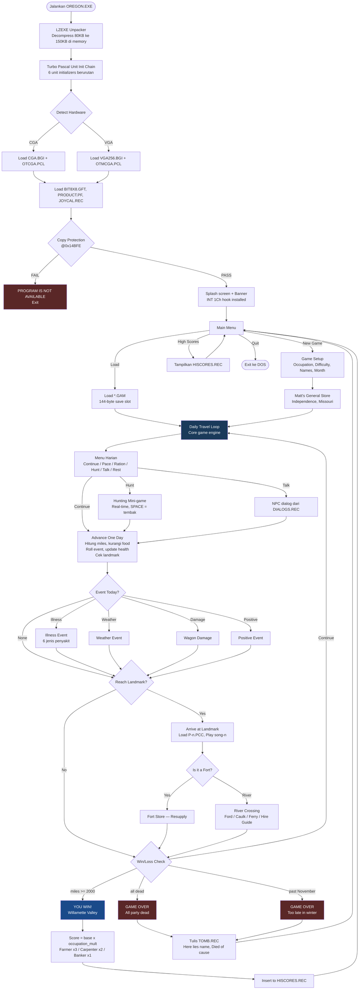
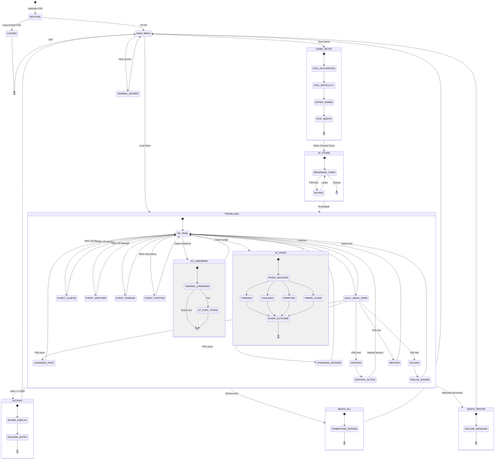
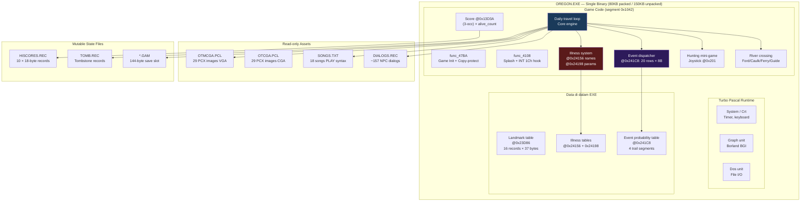
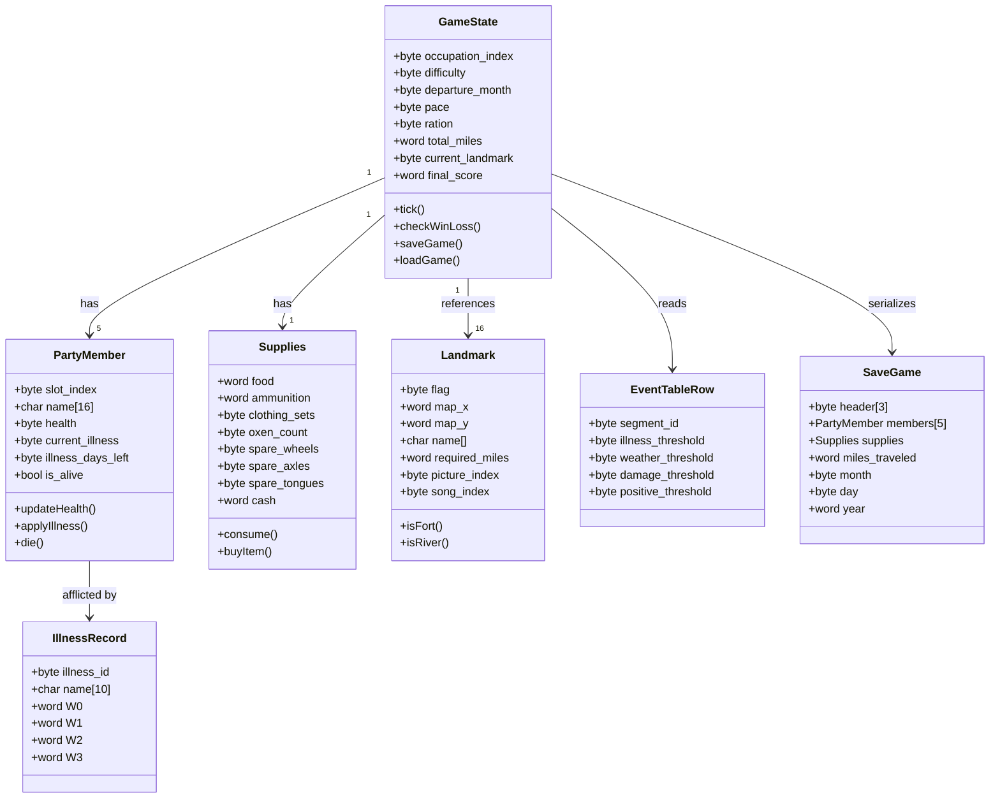
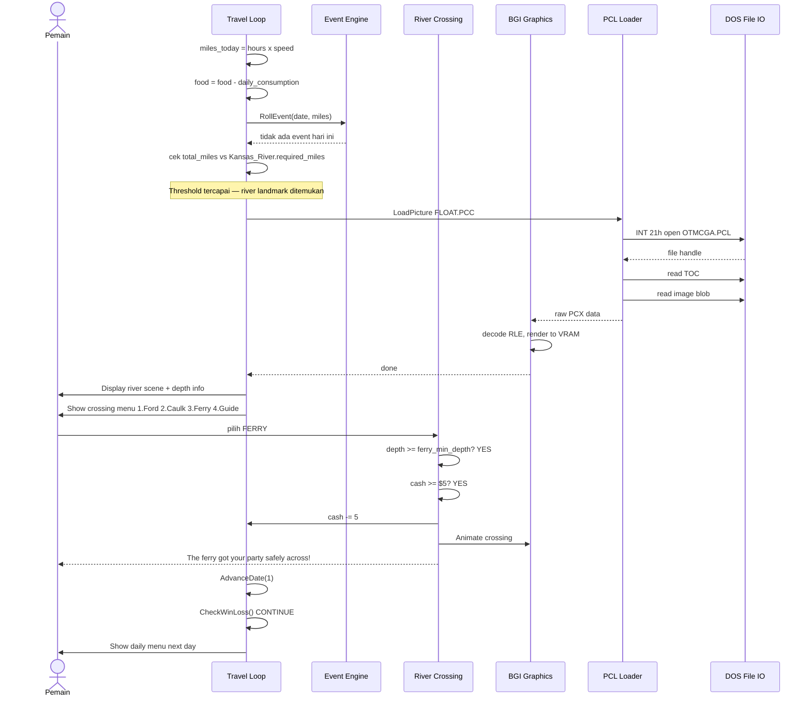
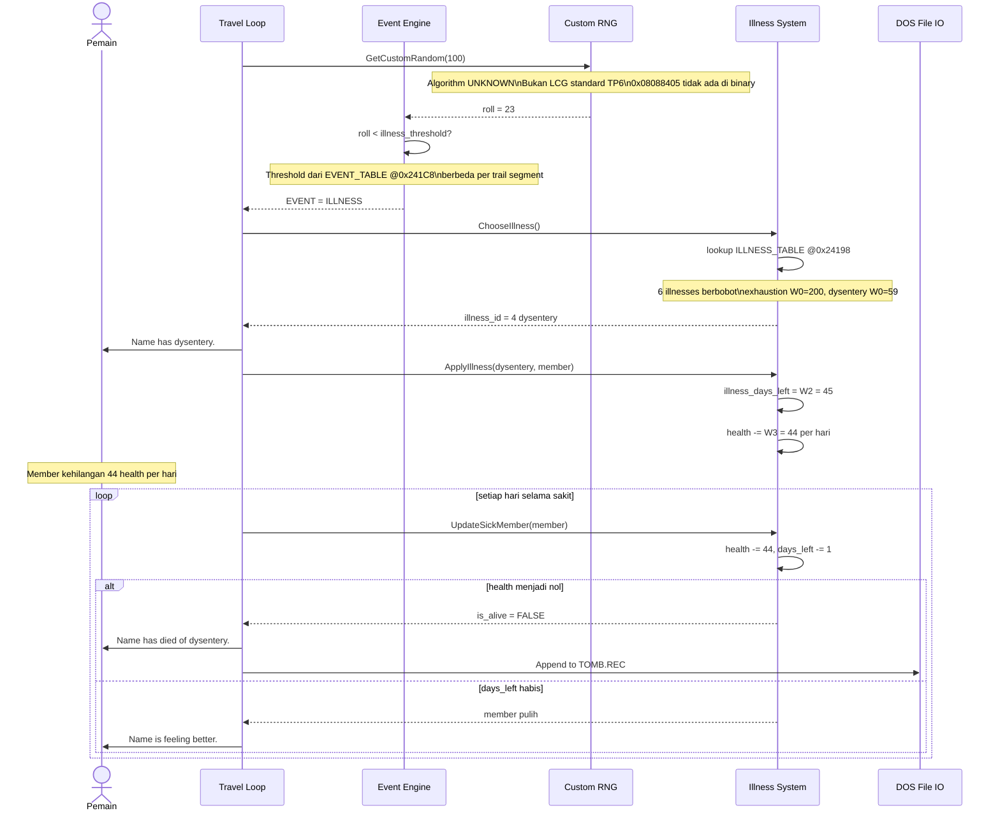
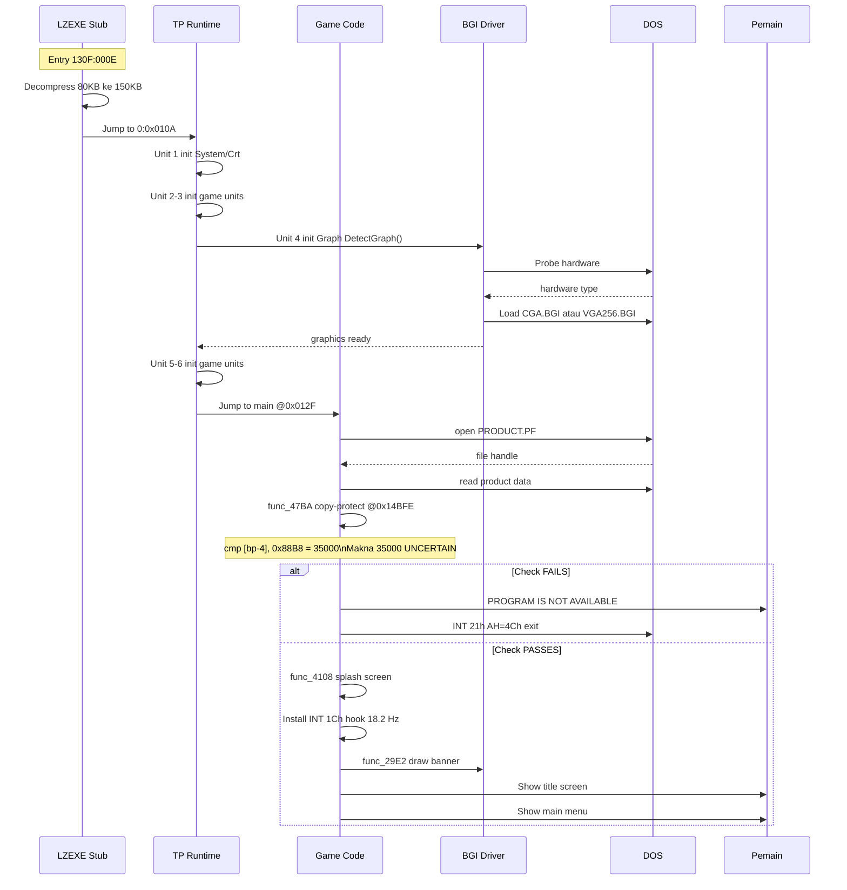
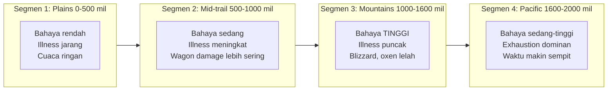

# Belajar dari Oregon Trail v2.1 (1990)
### Reverse Engineering sebagai Cara Memahami Game Architecture

> Dokumen ini dibuat dari hasil reverse engineering Oregon Trail v2.1 (MECC, 1990)
> selama 4 phase analisis — tanpa source code asli.
> Setiap diagram dan pseudo-code di sini adalah rekonstruksi dari binary.

---

## Daftar Isi

1. [Apa itu Oregon Trail?](#1-apa-itu-oregon-trail)
2. [Alur Program](#2-alur-program)
3. [State Diagram](#3-state-diagram)
4. [Arsitektur Sistem](#4-arsitektur-sistem)
5. [Pseudo-code](#5-pseudo-code)
6. [Class Diagram](#6-class-diagram)
7. [Sequence Diagram](#7-sequence-diagram)
8. [Sistem Ketidakpastian — Randomizer](#9-sistem-ketidakpastian--randomizer--challenge-design)
9. [Panduan Bermain — Tips & Tricks](#10-panduan-bermain--tips-tricks-dan-cara-menang)
10. [Hal-hal Menarik untuk Dipelajari](#11-hal-hal-menarik-untuk-dipelajari)

---

## 1. Apa itu Oregon Trail?

### 1.1 Brosur — Bayangkan Ini di Rak Toko Software 1990

```
╔══════════════════════════════════════════════════════════════════╗
║                                                                  ║
║          T H E   O R E G O N   T R A I L                        ║
║                                                                  ║
║          MECC  ·  1990  ·  DOS  ·  CGA / EGA / VGA              ║
║                                                                  ║
║  "Bisakah kamu membawa keluargamu melewati 2000 mil              ║
║   padang, sungai, dan pegunungan — dan tetap hidup?"             ║
║                                                                  ║
║  • Beli perbekalan di Matt's General Store, Independence, MO     ║
║  • Pilih antara berjalan pelan-aman atau cepat-maut              ║
║  • Seberangi sungai — ford, caulk, atau bayar feri $5            ║
║  • Berburu rusa dan bison untuk bertahan hidup                   ║
║  • Hadapi penyakit: kolera, tifoid, disentri, campak...          ║
║  • 18 landmark bersejarah nyata sepanjang jalur Oregon           ║
║  • Cetak namamu di high-score board — atau di batu nisan         ║
║                                                                  ║
╚══════════════════════════════════════════════════════════════════╝
```

### 1.2 Tentang Game Ini

**Genre:** Strategy / Survival / Historical Simulation

**Oregon Trail** adalah game edukasi yang dirancang untuk mengajarkan sejarah AS — khususnya migrasi Barat lewat jalur Oregon pada tahun 1848. Namun jangan salah: ini adalah game yang genuinely menantang dan menyenangkan, bukan sekadar "game pelajaran".

**Premis:** Kamu adalah kepala keluarga yang berangkat dari Independence, Missouri menuju Willamette Valley di Oregon — perjalanan 2000 mil dengan kereta wagon yang ditarik oxen. Kamu membawa 4 anggota keluarga, persediaan terbatas, dan harus tiba sebelum musim dingin.

**Yang membuatnya menarik:**

- **Trade-off yang nyata.** Jalan cepat (*grueling*, 16 jam/hari) lebih cepat sampai, tapi kesehatan turun drastis. Jalan pelan (*steady*, 8 jam/hari) aman tapi kehabisan waktu sebelum salju. Tidak ada pilihan yang sempurna.
- **Manajemen sumber daya yang ketat.** Makanan habis kalau tidak berburu. Roda wagon bisa patah di tengah jalan. Uang tidak pernah cukup untuk semua yang dibutuhkan.
- **Risiko nyata dari sejarah.** Penyakit seperti kolera dan disentri memang membunuh ribuan pionir nyata di jalur Oregon. Game ini merepresentasikannya dengan sistem probabilitas yang serius.
- **Keputusan sungai.** Di setiap penyeberangan sungai: ford (gratis, berisiko), caulk the wagon (gratis, bisa terbalik), bayar feri ($5-10), atau sewa pemandu Indian (paling aman, paling mahal). Setiap pilihan punya konsekuensi.
- **Hunting mini-game real-time.** Satu-satunya momen di mana skill tangan kamu menentukan nasib: menekan SPACE untuk menembak hewan buruan.
- **Tombstone system.** Kalau kamu mati, jenazahmu (dengan nama dan penyebab kematian) bisa dilihat oleh pemain berikutnya. "Here lies ___. Died of dysentery." Ini adalah salah satu game mechanic paling ikonik dalam sejarah gaming.

---

## 2. Alur Program



### 2.1 Penjelasan Alur

**Fase 1 — Startup:** LZEXE mendekompres EXE dari 80KB ke 150KB di memory. Enam Turbo Pascal unit initializer dipanggil berurutan untuk menyiapkan graphics, timer, dan subsistem game.

**Fase 2 — Setup:** Pemain memilih pekerjaan, tingkat kesulitan, nama party, dan bulan keberangkatan. Semua pilihan ini mempengaruhi seluruh sesi game sebagai state bytes di memory.

**Fase 3 — Daily Loop:** Setiap "hari" simulasi adalah satu iterasi loop besar: hitung jarak tempuh, kurangi food, lempar dadu event, update health, cek kondisi menang/kalah.

**Fase 4 — Endgame:** Berhasil ke Oregon → score dihitung dan masuk HISCORES.REC. Mati → nama dan penyebab kematian masuk TOMB.REC sebagai "ghost" untuk pemain berikutnya.

---

## 3. State Diagram



### 3.1 Penjelasan State Diagram

**`TRAVELLING`** adalah state terbesar — hampir seluruh gameplay ada di sini:
- `ON_TRAIL` = state default, di sinilah daily loop berjalan
- `AT_RIVER` = sub-state saat ada penyeberangan; pemain harus memutuskan sebelum kembali ke `ON_TRAIL`
- `AT_LANDMARK` = menampilkan gambar dan musik; bisa memicu `AT_FORT_STORE`
- `HUNTING_ACTIVE` = satu-satunya state real-time; semua state lain menu-driven

---

## 4. Arsitektur Sistem



### 4.1 Penjelasan Arsitektur

**Single-binary design:** Semua kode dalam satu EXE 80KB — constraint single-floppy 1990. LZEXE mengkompres 150KB menjadi 80KB, menghemat 45% ruang disk.

**BGI graphics abstraction:** Game tidak panggil hardware langsung — ia panggil BGI API yang di-delegate ke driver CGA atau VGA. Mirip abstraction layer modern (seperti OpenGL terhadap driver GPU).

**Genus pcxLib:** 29 gambar disimpan dalam satu archive `.PCL`, diakses lewat TOC di header. Konsepnya mirip ZIP file atau asset bundle di game engine modern.

**Embedded data tables:** Harga, illness params, landmark coords, event probabilities di-hardcode langsung dalam binary — bukan di file terpisah. Membuat modding sulit, tapi menyederhanakan loading logic.

---

## 5. Pseudo-code

### 5.1 Daily Travel Loop

```pascal
procedure DailyTravelLoop;
begin
  { 1. Menu harian }
  player_action := ShowDailyMenu;
  case player_action of
    ACTION_HUNT  : DoHunting;
    ACTION_TALK  : DoTalkToPeople;
    ACTION_REST  : pace := PACE_REST;
    ACTION_PACE  : pace := GetPaceChoice;
    ACTION_RATION: ration := GetRationChoice;
  end;

  { 2. Hitung miles (pace = jam per hari) }
  case pace of
    PACE_STEADY    : hours_today :=  8;
    PACE_STRENUOUS : hours_today := 12;
    PACE_GRUELING  : hours_today := 16;
    PACE_REST      : hours_today :=  0;
  end;
  total_miles := total_miles + hours_today * SpeedFactor(oxen_count);

  { 3. Konsumsi makanan }
  case ration of
    RATION_FILLING    : food_pp := 3;
    RATION_MEAGER     : food_pp := 2;
    RATION_BARE_BONES : food_pp := 1;
  end;
  food := food - food_pp * CountAlivePty;  { @0x13045 }
  if food < 0 then begin food := 0; ApplyHungerEffects; end;

  { 4. Roll event harian }
  e := RollEvent(current_date, total_miles);
  if e <> EVENT_NONE then ProcessEvent(e);

  { 5. Cek landmark }
  if total_miles >= NextLandmark.required_miles then
    ArriveAtLandmark(NextLandmark);

  { 6. Advance kalender }
  AdvanceDate(1);

  { 7. Win/Loss }
  if total_miles >= 2000      then GameWon;
  if CountAlivePty = 0        then GameLost(REASON_ALL_DEAD);
  if current_month > NOVEMBER then GameLost(REASON_WINTER);
end;
```

### 5.2 Event System

```pascal
function RollEvent(date: TDate; miles: word): TEventType;
begin
  { Segmen trail: 0=Plains 1=Mid 2=Mountains 3=Pacific }
  if miles < 500       then segment := 0
  else if miles < 1000 then segment := 1
  else if miles < 1600 then segment := 2
  else                      segment := 3;

  roll := GetCustomRandom(100);  { RNG custom, bukan standard TP6 LCG }
  row  := EVENT_TABLE[segment];  { @0x241C8, 4 segmen × threshold }

  if roll < row.illness_threshold  then Result := ChooseIllness
  else if roll < row.weather_threshold then Result := ChooseWeather(date)
  else if roll < row.damage_threshold  then Result := ChooseWagonDamage
  else if roll < row.positive_threshold then Result := EVENT_POSITIVE
  else Result := EVENT_NONE;
end;
```

### 5.3 Score Formula (CONFIRMED @0x13D3A)

```pascal
function ComputeFinalScore: word;
begin
  alive_count := CountAlivePty;     { @0x13045: cek [0x1853+i] <> 0xFF }
  occ_mult    := 3 - occupation_index;
  { Farmer=0 → x3 | Carpenter=1 → x2 | Banker=2 → x1 }
  Result := ComputeBaseResources * occ_mult;
  { base = resources remaining (cash, food, ammo, oxen, dll) — exact formula UNCERTAIN }
end;
```

### 5.4 River Crossing

```pascal
procedure CrossRiver(river_id: byte);
begin
  depth := GetRiverDepth(river_id, current_month);  { random }
  case ShowRiverMenu of
    RIVER_FORD:
      if depth <= 2.5 then OUTCOME_SUCCESS
      else RollRiverOutcome(RISK_HIGH);  { ~70% gagal jika dalam }
    RIVER_CAULK:
      if GetCustomRandom(100) < 70 then OUTCOME_SUCCESS
      else OUTCOME_WAGON_TIPPED;         { ~30% terbalik }
    RIVER_FERRY:
      if cash >= ferry_cost then begin cash -= ferry_cost; OUTCOME_SUCCESS; end;
    RIVER_HIRE_GUIDE:
      begin cash -= indian_guide_cost; OUTCOME_SUCCESS; end;  { paling aman }
  end;
end;
```

### 5.5 Hunting Mini-game

```pascal
procedure DoHunting;
begin
  if ammunition = 0 then begin
    ShowMessage('You cannot go hunting because you have no bullets');
    exit;
  end;
  LoadPicture('HUNTER.PCC');
  LoadPicture('ANIMALS.PCC');
  while not done do begin
    joy_raw := InPort(0x201);  { @0x11580 }
    UpdateCrosshair(joy_raw);
    if SpaceBarJustPressed then begin
      inc(shots_fired);
      if HitCheck then meat_bagged += AnimalMeatValue(GetHitAnimal);
    end;
    if TimeUp or AllAnimalsGone then done := true;
  end;
  food       := food + meat_bagged;
  ammunition := ammunition - shots_fired;
end;
```

---

## 6. Class Diagram

Turbo Pascal tidak punya OOP class — ini rekonstruksi konseptual dari struct yang ditemukan di binary.



### 6.1 Penjelasan

`GameState` adalah global state — di TP disimpan sebagai variabel global di data segment, tidak ada enkapsulasi.

`PartyMember` disimpan sebagai `array [0..4] of record` di memory sekitar `0x1853`. Anggota mati ditandai sentinel value `0xFF` (dibuktikan dari fungsi `CountAlivePty` yang cek `[0x1853+i] <> 0xFF`).

`StoreItem` harganya bukan di struct — di-hardcode sebagai immediate values di kode mesin (e.g. `MOV AL, 0x28` = $40 per oxen).

---

## 7. Sequence Diagram

### 7.1 Pemain Tiba di Sungai dan Memilih Ferry



### 7.2 Anggota Party Terkena Disentri



### 7.3 Startup dan Copy-Protection Check



---

## 8. Sistem Ketidakpastian — Randomizer & Challenge Design

Inilah yang membuat Oregon Trail tidak bisa diselesaikan dengan mudah meski sudah tahu semua rules-nya. Game ini dirancang dengan beberapa lapis ketidakpastian yang saling berinteraksi.

### 8.1 Custom RNG — Sumber Ketidakpastian Utama

Oregon Trail v2.1 **tidak menggunakan** RNG standar Turbo Pascal (LCG konstanta `0x08088405`). MECC menulis RNG sendiri, kemungkinan berbasis timer interrupt `INT 1Ch` yang berjalan di 18.2 Hz.

**Implikasinya:** Setiap sesi game berbeda karena nilai "acak" bergantung pada timing exact keypress pemain. Dua pemain yang memilih pilihan identik di momen berbeda akan mendapat hasil event yang berbeda. Game ini tidak bisa di-"script" atau di-replay secara deterministic.

```
Timer tick berjalan 18.2x per detik, terus-menerus
Setiap keypress pemain terjadi di momen acak dalam siklus itu
Nilai counter sudah berbeda setiap saat
Tidak ada cara untuk memorize urutan event
```

### 8.2 Event Table — Empat Segmen Bahaya Berbeda

Event probability table di `0x241C8` membagi trail menjadi 4 segmen:



Segmen 3 (Mountains) adalah "dinding" yang membunuh banyak run yang tampak menjanjikan.

### 8.3 Enam Penyakit dengan Probabilitas Tersembunyi

| Penyakit | W0 (bobot kemunculan) | W3 (drain health/hari) |
|---|---:|---:|
| Exhaustion | 200 | 109 — paling sering, paling mematikan |
| Typhoid | 109 | 49 |
| Cholera | 0 | 36 |
| Measles | 67 | 41 |
| Dysentery | 59 | 44 — ikonik |
| A fever | 0 | 32 — mildest, catch-all |

Yang tidak bisa dikontrol: penyakit mana yang muncul saat event illness terjadi. Yang bisa dikontrol: menjaga kondisi baik agar recovery lebih cepat.

### 8.4 River Crossing — Risiko Tidak Simetris

```
Depth sungai random setiap crossing, tapi pilihan pemain
mengubah distribusi outcome secara drastis:

Ford sungai dalam:  ~70% gagal → supplies hilang, bisa drowning
Caulk wagon:        ~30% gagal → wagon terbalik, supplies hilang
Ferry:              ~0% gagal  (jika punya uang)
Hire Indian guide:  ~0% gagal  (paling aman, paling mahal)

Trap tersering: hemat uang sepanjang trail, kehabisan cash
saat butuh ferry di sungai-sungai besar.
```

### 8.5 Time Pressure — Deadline Tersembunyi

Game tidak menampilkan countdown. Pemain hanya tahu bulan saat ini. Tapi ada deadline keras: party yang belum melewati South Pass di bulan Oktober hampir pasti tidak akan sampai Oregon sebelum musim dingin.

**Spiral mematikan:** Sakit → istirahat → waktu terbuang → makin dekat winter → harus jalan lebih cepat → makin cepat sakit → lebih banyak istirahat → ...

### 8.6 Resource Depletion — Tidak Ada Tombol Undo

Setiap hari resources berkurang deterministik (food consumption) dan stokastik (wagon damage, theft). Tidak ada cara "menabung" kecuali berburu dan singgah di fort.

**Triple squeeze yang sering mematikan:**
1. Amunisi habis → tidak bisa berburu
2. Makanan menipis → ganti ke Bare Bones → party mulai sakit
3. Saat sakit, butuh istirahat → waktu terbuang → miles per hari turun

---

## 9. Panduan Bermain — Tips, Tricks, dan Cara Menang

Berdasarkan logika game yang direkonstruksi dari binary.

### 9.1 Keputusan Awal yang Menentukan Segalanya

**Pilih Farmer** jika tujuan high score — multiplier 3x terbesar. Tapi mulai dengan uang paling sedikit, jadi supplies lebih terbatas.

**Pilih Banker** untuk pertama kali menyelesaikan game — mulai dengan cash terbanyak, lebih mudah beli supplies optimal.

**Pilih Carpenter** sebagai jalan tengah — multiplier 2x, modal sedang.

**Berangkat Maret atau April** — memberi waktu buffer paling banyak. Juli ke atas sangat berisiko.

**Difficulty Greenhorn** untuk belajar. Naik ke Adventurer setelah menang sekali.

### 9.2 Strategi Pembelian di Matt's General Store

```
PRIORITAS TERTINGGI:
Oxen — beli 6 ekor (2 yoke + 2 cadangan). $40/ekor = $240.
  Oxen mati di gunung tanpa cadangan = game over.

Makanan — target 300-400 lbs.
  Yang paling sering habis di tengah jalan.

Amunisi — beli 200+ rounds.
  Tanpa amunisi tidak bisa berburu; kelaparan = spiral kematian.

PRIORITAS MENENGAH:
Spare parts — minimal 1 spare wheel + 1 axle.
  Wagon damage adalah event paling sering setelah illness.

Clothing sets — 3-4 set.
  Cuaca dingin di gunung rusak health jika kurang pakaian.

PRIORITAS RENDAH:
Cash sisa — simpan untuk river crossings.
  Butuh $30-50 cadangan sampai Oregon.
```

### 9.3 Manajemen Pace dan Ration Sepanjang Trail

```
Plains (0-500 mil): Steady + Filling
  Party masih fresh, bangun health buffer, hunting mudah.

Mid-trail (500-1000 mil): Steady/Strenuous + Meager
  Mulai hemat makanan. Naikkan pace jika kalender sudah September.

Mountains (1000-1600 mil): Strenuous + Meager
  Race against winter. Jangan Grueling — exhaustion di gunung membunuh.

Pacific Slope (1600-2000 mil): Strenuous/Grueling + Meager
  Sudah dekat, push lebih keras. Jika Oktober, Grueling.
```

### 9.4 Strategi River Crossing

```
Punya cash cukup? SELALU ferry atau hire guide.
Nyawa party lebih berharga dari $5-10.

Sungai dangkal (≤ 2.5 kaki)? Ford aman.
Game memberitahu kedalaman sebelum kamu memutuskan.

Sungai dalam, tidak ada uang? Caulk (float).
30% risiko wagon terbalik — lebih baik dari ford sungai dalam.

JANGAN ford sungai dalam (> 3 kaki).
~70% gagal, bisa kehilangan member atau semua supplies.

Simpan minimal $20 sebagai river emergency fund sampai The Dalles.
```

### 9.5 Mengelola Penyakit

```
Saat ada anggota sakit:

1. SEGERA turunkan pace ke Steady atau Rest.
   W3 (health drain) tetap berjalan setiap hari.
   Grueling + illness = fatal dalam 1-2 hari.

2. Naikkan ration ke Filling.
   Nutrisi lebih baik mempercepat recovery.

3. Pertimbangkan istirahat 1-2 hari.
   Miles yang hilang lebih murah dari nyawa yang hilang.

Paling berbahaya: Exhaustion (W3=109).
Bisa membunuh dalam 2-3 hari jika health sudah rendah.

Paling aman: A fever (W3=32).
Hampir tidak perlu khawatir, sembuh sendiri dalam beberapa hari.
```

### 9.6 Tips Hunting

```
Waktu yang tepat untuk berburu:
  - Food < 100 lbs dan punya amunisi
  - Di segmen Plains (hewan lebih banyak)
  - Semua party sehat

Jangan buang amunisi jika:
  - Food masih > 200 lbs
  - Di gunung (hewan sedikit, hasil kecil)
  - Amunisi sudah < 50 rounds (simpan untuk darurat)

Tips mini-game:
  - Tunggu hewan ke tengah layar sebelum tembak
  - Tembak bison/buffalo (hewan besar) untuk meat value tertinggi
  - Quality over quantity: 2 tembakan tepat lebih baik dari 10 meleset
```

### 9.7 Kondisi Game Over dan Cara Mencegahnya

```
1. SEMUA ANGGOTA MATI
   Penyebab: spiral illness + kelaparan + pace terlalu cepat
   Cegah: monitor health setiap hari, reaksi cepat saat ada illness

2. MELEWATI NOVEMBER TANPA SAMPAI OREGON
   Penyebab: berangkat terlambat atau terlalu banyak istirahat
   Cegah: berangkat Maret-April, jaga pace minimal Steady

3. WAGON HANCUR TANPA SPARE PARTS
   Penyebab: tidak beli spare parts di toko
   Cegah: selalu beli minimal 1 spare wheel + 1 axle

4. KEHABISAN MAKANAN TANPA BISA BERBURU
   Penyebab: amunisi habis, tidak ada fort resupply dekat
   Cegah: jangan biarkan amunisi < 50 rounds

5. TENGGELAM DI RIVER CROSSING
   Penyebab: ford sungai dalam untuk hemat $5
   Cegah: tidak ada alasan ford sungai dalam

SPIRAL KEMATIAN KLASIK (paling umum di pemain baru):
Makanan menipis → Bare Bones → party lapar → ada yang sakit →
istirahat → waktu terbuang → musim gugur di gunung →
rush Grueling → yang lain kena exhaustion → semua mati
```

### 9.8 Checklist Pemain Ideal

```
Sebelum berangkat:
  6 oxen, 300+ lbs makanan, 200+ rounds amunisi
  1 spare wheel + 1 axle, 3+ clothing sets
  $30+ cash tersisa, bulan Maret atau April

Setiap hari:
  Monitor health semua member
  Ada yang sakit? Turunkan pace, naikkan ration
  Food < 100 lbs? Berburu
  Oktober tapi belum di gunung? Strenuous atau Grueling

Di river:
  Cek kedalaman sebelum memutuskan
  <= 2.5 kaki: ford aman
  > 2.5 kaki: ferry atau caulk
  Jangan ford sungai dalam

Di fort:
  Resupply makanan dan amunisi jika perlu
  Simpan cash untuk river crossings di depan
```

---

## 10. Hal-hal Menarik untuk Dipelajari

### 10.1 Compression sebagai Design Constraint

LZEXE 0.91 mengkompres game dari 150KB menjadi 80KB — memungkinkan single-floppy distribution. Setiap byte di era 1990 sangat berharga. Ini memaksa programmer berpikir sangat efisien, tanpa ruang untuk abstraksi berlebihan.

**Modern analogy:** Seperti game development untuk embedded systems atau mobile dengan size budget ketat.

### 10.2 Global State sebelum OOP

Turbo Pascal 5.5 baru mulai memperkenalkan `object`, dan Oregon Trail kemungkinan ditulis tanpa OOP. Semua state disimpan sebagai variabel global di data segment — tidak ada enkapsulasi.

| Konsep Modern | Oregon Trail 1990 |
|---|---|
| Class | `type TPartyMember = record` |
| Encapsulation | Tidak ada — semua global |
| Method | Prosedur yang akses global vars |
| Polymorphism | Case/if chains |

**Pelajaran:** Global state adalah "anti-pattern" di pemrograman modern, tapi di era ini itu adalah kebutuhan karena memory dan call overhead sangat mahal.

### 10.3 Custom RNG — Filosofi Replayability

MECC tidak pakai RNG standard karena ingin game genuinely tidak bisa diprediksi. Timer-based randomness memastikan dua sesi game yang identik dari sisi keputusan tetap menghasilkan outcome berbeda. Game edukasi harus bisa dimainkan berulang kali, dan replayability butuh unpredictability.

### 10.4 Data-Driven Design

Event table di `0x241C8` adalah contoh data-driven design sederhana: probabilitas disimpan terpisah dari logika. Kalau MECC ingin rebalance game (misal: Mountains lebih berbahaya), cukup ubah tabel tanpa recompile.

### 10.5 BGI: Hardware Abstraction Layer

Satu kode game berjalan di CGA (4 warna) dan VGA (256 warna) tanpa perubahan apapun. Driver-nya loadable di runtime berdasarkan hardware detection. Ini adalah konsep yang sama dengan OpenGL modern.

### 10.6 Pascal String vs C String

DIALOGS.REC menggunakan length-prefixed strings (1 byte length + data): `O(1)` untuk dapat panjang string, max 255 karakter. Versus C strings yang null-terminated: harus scan sampai akhir untuk dapat panjang. Trade-off format data yang nyata dengan konsekuensi arsitektur.

### 10.7 Save Game sebagai Binary Struct Dump

`*.GAM` (144 bytes) adalah literal dump dari struct Turbo Pascal ke disk — tanpa serialization layer. Sederhana tapi fragile: format rusak kalau struct berubah. Modern games menggunakan JSON, protobuf, atau format versioned.

### 10.8 Historical Research sebagai Game Content

HISCORES.REC pre-seeded dengan nama tokoh sejarah nyata: *Stephen Meek, Celinda Hines, Andrew Sublette*. NPC dialog mereferensikan lokasi, harga, dan kondisi perjalanan Oregon Trail 1848 yang akurat secara historis. Ini adalah kekuatan edutainment yang dilakukan dengan benar.

---

## 11. Jalankan Ekstraksi Graphics

```powershell
cd "E:\Projects\BASIC Programs\Collections\Oregon Trail\The-Oregon-Trail_DOS_EN"
pip install Pillow
python work\extract_graphics.py
```

Hasil PNG di folder `.\images\`:
- `vga_MAP_PCX.png` — peta trail keseluruhan
- `vga_TRAVELOX_PCC.png` — animasi wagon berjalan
- `vga_HUNTER_PCC.png` — backdrop hunting
- `vga_P0_PCC.png` hingga `vga_P17_PCC.png` — 18 layar landmark
- `vga_FLOAT_PCC.png` — scene caulking sungai
- `logo_vga.png` — title screen

---

## 12. Referensi

| Item | Detail |
|---|---|
| Game | Oregon Trail v2.1, MECC, 1990 |
| Platform | DOS CGA/EGA/VGA, single floppy |
| Compiler asli | Turbo Pascal 5.5 atau 6.0 |
| Packer | LZEXE 0.91 (Fabrice Bellard, 1989) |
| Graphics | Borland BGI + Genus pcxLib |
| RE tools | Python 3.14, Capstone x86-16 |
| Master RE doc | `oregon_trail_reverse.md` (103KB, 4 phases) |

---

> Semua diagram dan pseudo-code adalah **rekonstruksi** dari binary.
> Beberapa bagian masih `[HYPOTHESIS]` atau `[UNCERTAIN]`.
> Untuk analisis lebih lanjut: install Ghidra, load `work\OREGON_UNPACKED.BIN`
> sebagai `x86 / Real Mode / 16-bit`, entry point `0:0x010A`.
