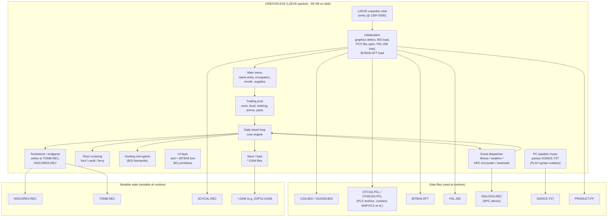

# Oregon Trail DOS — Reverse Engineering Notes

**Version identified:** Oregon Trail **v2.1 (1990), MECC, English DOS release**
Source attribution from `file_id.diz`; copyright range "1988-1991" found in `PRODUCT.PF`.

**Analysis date:** 2026-06-09
**Working directory:** `E:\Projects\BASIC Programs\Collections\Oregon Trail\The-Oregon-Trail_DOS_EN\`
**Mode:** read-only. No original file is ever modified.

**Tools used (Phase 1):**
- `xxd`, `od` — hex inspection
- `python 3.14` — custom strings extraction and binary parsing (no `strings(1)` available on host)

---

## 1. File Inventory

19 files, ~947 KB total. The release fits on a single 1.44 MB floppy.

| File | Size (bytes) | Category | Role |
|---|---:|---|---|
| `OREGON.EXE` | 81,896 | Executable | Main game binary; **LZEXE 0.91 packed** |
| `INSTALL.EXE` | 21,264 | Executable | Installer (ignored per scope) |
| `OTCGA.PCL` | 189,831 | Graphics archive | CGA art library (Genus `pcxLib` format) |
| `OTMCGA.PCL` | 321,139 | Graphics archive | MCGA/VGA-256 art library (Genus `pcxLib` format) |
| `LOGO.004` | 1,562 | Image (PCX) | Boot logo, 4-color CGA, 320×200 viewport |
| `LOGO.256` | 2,117 | Image (PCX) | Boot logo, 256-color MCGA, 320×200 viewport |
| `PAL.256` | 906 | Image (PCX) | 256-color palette carrier (small PCX file) |
| `BIT8X8.GFT` | 2,646 | Font | Custom 8×8 bitmap font; magic `BIT8X8` at offset 0x04 |
| `CGA.BGI` | 6,253 | Driver | Borland Graphics Interface — CGA |
| `VGA256.BGI` | 3,289 | Driver | Borland Graphics Interface — VGA 256-color |
| `DIALOGS.REC` | 14,586 | Data (text records) | NPC advice/dialog database |
| `HISCORES.REC` | 180 | Data (state) | 10 fixed-width high-score records |
| `TOMB.REC` | 110 | Data (state) | Tombstone records (deaths from prior plays) |
| `JOYCAL.REC` | 9 | Data (config) | Joystick calibration (4 × WORD + 1 flag) |
| `PRODUCT.PF` | 350 | Config | Product/version registration data |
| `SONGS.TXT` | 2,867 | Audio (notation) | Music in GW-BASIC `PLAY` syntax |
| `ZOP12.GAM` | 144 | Save game | Developer/demo save (joke names: "Chippere", "Buttafuco", "Tailgate") |
| `README` | 1,177 | Text | User-visible setup notes |
| `file_id.diz` | 281 | Text | Distribution metadata |

> **Hidden file referenced by the EXE but absent from the directory:** `MAP.PCX` — must live inside `OTMCGA.PCL` / `OTCGA.PCL` (the PCX-archive containers).

---

## 2. Architecture Overview

### 2.1 Executable structure (OREGON.EXE)

The main binary is **LZEXE 0.91**-packed (Fabrice Bellard, 1989). The classic fingerprints:

| Field (MZ header) | Value | Note |
|---|---|---|
| Signature | `MZ` | DOS executable |
| File size | 81,896 | matches image-size from header → no overlay/data appendix |
| Header size | 32 bytes (2 paragraphs) | unusually small |
| Relocation count | **0** | LZEXE relocates inside the compressed payload |
| Reloc-table offset | `0x001C` | followed immediately by the LZEXE magic |
| **Magic at 0x1C** | **`LZ91`** | LZEXE v0.91 signature |
| Initial CS:IP | `130F:000E` | entry point is the LZEXE unpacker stub |
| Overlay number | 0 | not an overlay module |

```
00000000: 4d5a e801 a000 0000 0200 cd28 062a a125  MZ.........(.*.%
00000010: 8000 0000 0e00 0f13 1c00 0000 4c5a 3931  ............LZ91
                                          ^^^^ ^^^^
                                          LZEXE v0.91 magic
```

**Consequence:** static disassembly of `OREGON.EXE` as-is reveals only the unpacker stub (~2 KB of x86), not the game code. Real RE requires producing an *unpacked* copy with a tool like `UNLZEXE`, `UNP`, or hand-unpacking inside a DOSBox debugger. **We will create the unpacked image as a derived file in a `work/` subfolder; the original is untouched.**

### 2.2 Compiler & runtime fingerprints

Even compressed, ~2.3 KB of plaintext escapes (~2.8% of the file). Patterns:

| Evidence | Inferred fact |
|---|---|
| `Runtime error` + numeric error codes leaking out (e.g. `>?u`) | **Borland Turbo Pascal** runtime |
| `BGI Error: Graphics not initialized (use InitGraph)` | Borland BGI library statically linked |
| Device names `IBM8514`, `PC3270`, `HERC`, `EGAVGA`, etc. | BGI auto-detect probe list |
| `0-9A-Za-z_{}~#$%^&()-` | DOS filename character class (TP's `FExpand`) |
| `A-Za-z '.-` | Party-name input filter |
| Copyright `1988-89` and `1988-1991, MECC` (in PRODUCT.PF) | Active development window |
| Genus `pcxLib` archives + BGI | Game pulls in **Genus Microprogramming PCX Programmer's Library** (commercial, c. 1988-89) for image archive handling |

**Best guess: Turbo Pascal 5.5 or 6.0**, using:
- Borland BGI for graphics primitives (lines, text, palette)
- Genus `pcxLib` for sprite/screen storage
- Custom code for everything else (game logic, music, file I/O)

### 2.3 High-level architecture (estimated)



---

## 3. Game Systems Identified (string-evidence pass)

These are surfaced from plaintext strings that leak through LZEXE compression — they only confirm *presence* of a system; precise mechanics come in Phase 2.

### 3.1 Travel pace & exhaustion
- **Evidence:** `Steady`, `Strenuous`, `exhau[sted]` (3rd implied: classic `Grueling`)
- **Confidence:** high

### 3.2 Daily date / calendar starting 1848
- **Evidence:** literal `1848` token; month strings `February`, `August`, `September`; "Date:" UI prompt
- **Note:** the game advances day-by-day from a 1848 start date (historically when Stephen Meek and Sublette were active guides on the trail — this lines up with NPC strings in DIALOGS.REC)

### 3.3 Wagon parts model
- **Evidence:** `wheel`, `tongue`, `wheels`, `repair it`
- **Inference:** discrete spare-parts counters; events break a part → repair OR replace

### 3.4 Random / scripted events
- **Evidence:** `snakebit[e]`, `Indian`, `blizzard`, `Bad W[eather]`, `injur[ed]`, `(drowned)`, `helps fr[ee]`
- **Inference:** event table with weighted RNG draw (see Phase 2)

### 3.5 NPC dialog system
- **Evidence:** `DIALOGS.REC` opened by EXE; file contains 100+ length-prefixed strings with named speakers ("A trader named Jimmy", "A traveler Miles Hendricks", "Aunt Rebecca Sims", "Big Louie a trail driver", "A fort soldier", etc.)
- **Note:** the NPCs reference *real* Oregon Trail landmarks (Fort Kearney, Council Bluffs, Independence, St. Joseph) — content is historically researched, not generic.

### 3.6 Landmarks & route geography
- **Evidence:** `Columbia R[iver]`, `Fort`, `South P[ass]`, `Bridge`, `Columbia` (appears twice — once split by LZ window)
- **Inference:** a sequential landmark list along the trail, each triggering distinctive screens / decisions

### 3.7 River crossing
- **Evidence:** `ferry`, `$5.00`, `$10.00`, `caulk` (in DIALOGS.REC bodies), `ford`
- **Inference:** classic three-option decision (ford / caulk-and-float / ferry), with ferry price varying per crossing

### 3.8 Trading post / store
- **Evidence:** `store`, `empty.`, `$10.00`, `$5.00`, `(current)`
- **Inference:** stat-bound shop UI with current quantity display

### 3.9 Hunting / shooting
- **Evidence:** `Press SPACE BAR`, `joystick` calibration file, `Calibrate`, `nojoy` flag string
- **Inference:** real-time aim/fire mini-game (SPACE = fire); joystick supported

### 3.10 Music system (PC speaker)
- **Evidence:** `SONGS.TXT` is plain ASCII in **GW-BASIC PLAY syntax** (`o4l8ggabgbadggab`, `f#`, `>c<`, `l16`)
- **Inference:** game parses text → emits tones via `Sound(freq); Delay(); NoSound()` (TP's Crt unit)

### 3.11 Save game
- **Evidence:** string `Saved Gam[e]`; existence of `ZOP12.GAM` as 144-byte struct dump
- **Inference:** single-slot named save (filename = save name); player picks `ZOP12` etc.

### 3.12 Death / tombstone
- **Evidence:** `Here lies`, ` (drowned)`, `died.`, `Greenhorn`, `Trail guide`, write to `TOMB.REC`
- **Inference:** tombstone screen on party leader death; player can leave a custom epitaph that future plays may stumble across

### 3.13 Difficulty tiers
- **Evidence:** `Greenhorn`, `Trail guide` (the canonical 3 tiers being Greenhorn / Adventurer / Trail Guide)
- **Inference:** difficulty modifier baked into scoring, supply prices, and event probabilities

### 3.14 Endgame / score
- **Evidence:** `Congratul[ations]`, `HISCORES.REC` write
- **Inference:** post-Oregon score computation feeds `HISCORES.REC`

---

## 4. Data File Structures (Phase 1 — structure only)

### 4.1 `DIALOGS.REC` — NPC dialog database

**Format:** sequence of variable-length records. Each record appears to contain:
- 1-byte length prefix → speaker name (Pascal-style string)
- ~11 bytes of metadata (event-binding flags? location IDs? Some non-printable bytes including a recurring `01 01 00` pattern and what looks like a 2-byte field)
- 1-byte length prefix → dialog body (Pascal-style string, up to ~250 chars)

**First record decoded:**
```
offset 0x0000 : 12                                           ; speaker len = 18
offset 0x0001 : "A trader named Jimmy"                       ; speaker (text run continues
                                                               with high-bit byte pattern -- 
                                                               UNCERTAIN: encoding glitch?)
offset 0x0013 : e6 79 b6 79 00 00 00 00 01 01 00            ; 11-byte metadata block
offset 0x001E : db                                           ; dialog body len = 219
offset 0x001F : "Better take extra sets of clothing.  Trade
                'em to Indians for fresh vegetables, fish,
                or meat.  It's well worth hiring an Indian
                guide at river crossings.  Expect to pay
                them!  They're sharp traders, not easily
                cheated."
```

**Sampled speakers (confirms historical research):**
- "A trader named Jimmy"
- "A traveler, Miles Hendricks"
- "A town resident"
- "Aunt Rebecca Sims"
- "A stranger"
- "A ferry operator"
- "A party leader heading east"
- "A lady, Marnie Stewart"
- "Big Louie, a trail driver"
- "A fort soldier"

**Total parseable strings (with naive 1-pass scan):** 157 entries — enough to cover ~80 NPC encounters plus prompts. Final parse will need to respect the metadata block; doing it properly is a Phase 2 task.

### 4.2 `HISCORES.REC` — fixed-width high-score table

**Format:** exactly 10 records of 18 bytes each:
```
struct HiScoreRecord {           // 18 bytes
    uint8_t  name_len;           // 1 byte (Pascal string length)
    char     name[15];           // 15 bytes, NUL-padded
    uint16_t score;              // 2 bytes, little-endian
};
```

**Decoded leaderboard (current file):**
| # | Name (len) | Score |
|--:|---|--:|
| 0 | Stephen Meek (12) | 7,650 |
| 1 | Celinda Hines (13) | 5,694 |
| 2 | Andrew Sublette (15) | 4,138 |
| 3 | David Has... (14) | … |

(Top 3 names = real historic trail guides/emigrants — MECC pre-seeded the leaderboard with historical figures.)

### 4.3 `TOMB.REC` — tombstone records

**Format:** unclear yet. First bytes `03 04 44 01 61 00 09` look like a small header (record count? version?). Contains an embedded reference to `ZOP12.GAM` (the save game), and at offset 0x33 a player name `"Antho[ny]"`. Defer full decode to Phase 2.

### 4.4 `JOYCAL.REC` — joystick calibration

**Format:** 9 bytes total:
```
struct JoyCal {
    uint16_t axis_x_min;   // 0x00C8 = 200 (default)
    uint16_t axis_x_max;   // 0x00C8
    uint16_t axis_y_min;   // 0x00C8
    uint16_t axis_y_max;   // 0x00C8
    uint8_t  enabled;      // 0x01
};
```

### 4.5 `OTCGA.PCL` / `OTMCGA.PCL` — Genus `pcxLib` archives

**Magic:** `pcxLib\x00B\xbe\x00Copyright (c) Genus Microprogramming, Inc. 1988-89` at offset 0.

**Format:** documented commercial library (`PCX Programmer's Library` by Genus). Header layout (from documentation, to be verified):
- 64-byte header
- TOC of fixed-size entries: `{ name[8+3], offset, size, flags }`
- Concatenated PCX blobs (compressed image data)

`MAP.PCX` (referenced by `OREGON.EXE` but absent from disk) almost certainly lives inside one of these. Phase 2: parse the TOC.

### 4.6 `PAL.256` / `LOGO.256` / `LOGO.004` — standard PCX images

All three start with the classic ZSoft PCX header:
```
struct PcxHeader {            // 128 bytes
    uint8_t  manufacturer;    // 0x0A (ZSoft)
    uint8_t  version;         // 0x05 (PCX 3.0+ w/ 256-color palette)
    uint8_t  encoding;        // 0x01 (RLE)
    uint8_t  bits_per_pixel;  // 0x08 (256c) / 0x02 (4c CGA)
    uint16_t xmin, ymin, xmax, ymax;   // viewport
    ...
};
```

Window for all three is **320 × 200** (xmax=0x013F, ymax=0x00C7). `PAL.256` is unusually small (906 bytes) — likely a *palette-only* PCX or a single tile used as a palette carrier.

### 4.7 `BIT8X8.GFT` — bitmap font

**Magic:** `BIT8X8` at offset 0x04 (file starts with 4 zero bytes then magic). Size 2,646 bytes; if 8×8 = 8 bytes per glyph, that's room for ~256 glyphs + ~600 bytes of header/metadata.

### 4.8 `SONGS.TXT` — music in PLAY-string notation

Plain ASCII. Example head:
```
o4l8ggabgbadggabl4gl8f#dggab>c<bagf#def#l4ggl8e.l16f#l8edef#l4gl...
```

Token grammar (matches Microsoft GW-BASIC / Turbo Pascal `Sound` conventions):
- `o<n>`  — set octave 0..6
- `l<n>` — set default note length (1 = whole, 8 = eighth, 16 = sixteenth)
- `a-g`  — note in current octave
- `#` / `+` — sharp; `-` flat
- `.`  — dotted (1.5× length)
- `>` / `<` — shift octave up/down
- multiple songs separated by some delimiter (likely blank line or `;` — to verify)

### 4.9 `PRODUCT.PF` — product/registration

First 32 bytes are small LE integers and version codes, then ASCII `"Copyright 1988-1991, MECC"`. Likely a TP record used for boot-time product verification or DRM. Low priority.

### 4.10 `ZOP12.GAM` — demo save game

144 bytes. Contains joke-named party members `Chippere`, `Buttafuco`, `Tailgate`, `Guiltfuco` — clearly a developer test save shipped with the disk. Format suggests `{ header, party[5]<name_len + name + stats>, location, supplies, date }`. Phase 2 target.

---

## 5. Game Logic Reconstructed (placeholder)

To be filled in Phase 2 after disassembly. Sections planned:
- 5.1 Daily travel cycle (pseudo-code)
- 5.2 Random event system (event table + RNG)
- 5.3 Health & resource degradation
- 5.4 River crossing decision tree
- 5.5 Hunting mini-game (input loop, target spawn, ammo)
- 5.6 Win/loss conditions and score formula

---

## 6. Constants and Magic Numbers

| Value | Source | Probable meaning |
|---|---|---|
| `1848` | EXE plaintext | Simulation start year |
| `200` (`0x00C8`) | `JOYCAL.REC` × 4 | Default joystick axis center value |
| `320 × 200` | PCX headers | Screen resolution |
| `$5.00`, `$10.00` | EXE plaintext | Ferry / supply prices |
| `0x12` (18 chars) | DIALOGS.REC[0] | First NPC name length |
| `0xDB` (219) | DIALOGS.REC[0] | First dialog body length |

---

## 7. Unknowns and Open Questions

1. **Exact Turbo Pascal version (5.5 vs 6.0).** Disambiguate after unpacking — runtime-error message format differs.
2. **DIALOGS.REC 11-byte metadata block** — does it encode event ID, location, stat preconditions, or stat impact? Need cross-reference to events table inside EXE.
3. **MAP.PCX** — confirm it lives inside `OTMCGA.PCL`'s TOC.
4. **TOMB.REC layout** — full record structure unknown; embeds save-game references.
5. **High-byte glitch in DIALOGS.REC[0]** — bytes `e6 79 b6 79` immediately after speaker text "A trader named Jim" look like binary metadata, but they intermix with the visible "y" of "Jimmy". Either the speaker name is exactly "Jim" + metadata starts at offset 0x13, or speaker length is mis-encoded. UNCERTAIN.
6. **`SONGS.TXT` song delimiter** — multiple tunes (title theme, death, victory, hunting) almost certainly bundled; need to find separator.
7. **Save filename whitelist** — name input filter is `0-9A-Za-z_{}~#$%^&()-` but DOS forbids `{}` in 8.3; this regex may be for *party* names or *epitaphs*, not save filenames.
8. **`PRODUCT.PF` purpose** — likely a copy-protection check; binary fields not yet decoded.

---

## 8. References

- LZEXE 0.91 format (Fabrice Bellard, 1989): https://bellard.org/  (and the original `LZEXE.DOC`)
- Genus PCX Programmer's Library (pcxLib) — `pcxLib\0` archive format
- Borland BGI (Borland Graphics Interface) — standard CGA/VGA driver framework (1988-1992)
- ZSoft PCX file format spec (v3.0+ with 256-color palette extension)
- Microsoft GW-BASIC `PLAY` statement syntax — basis for `SONGS.TXT` notation
- MECC historical timeline: Oregon Trail v2.1 released April 1990 on a single 5¼" / 3½" floppy.

---

## Phase 1 status: COMPLETE.

Awaiting user confirmation to begin Phase 2 (disassembly setup).
Phase 2 will require producing a derived, *unpacked* copy of `OREGON.EXE` (the original stays untouched) using one of: `UNLZEXE`, `UNP`, `DOSBox-X` debugger snapshot, or a hand-written LZEXE 0.91 unpacker.
