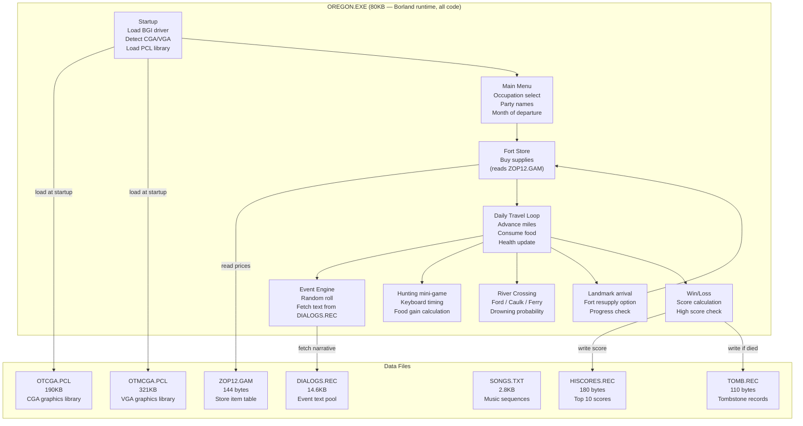

# Oregon Trail RE — Phase 1B: Deep File Analysis
# Paste this entire prompt into Claude Code to continue from Phase 1 findings.
#
# ANSWERS TO CLAUDE CODE QUESTIONS (answer these before pasting the rest):
#   Proceed option  -> 2  (Yes, but skip INSTALL.EXE)
#   Data Depth      -> 1  (Structure only — identify format, decode a few samples, don't extract every record)
#
# Rationale: We want a map of the territory first. Full extraction is Phase 2 work.
# ============================================================

Great findings! Confirmed: Oregon Trail v2.1 (1990), Borland toolchain, single EXE, no overlays.

My answers to your questions:
- Proceed: Option 2 — skip INSTALL.EXE, focus on OREGON.EXE and data files only.
- Data Depth: Option 1 — Structure only. Identify record format, decode a few sample records to confirm. No full extraction yet.

Working directory: E:\Projects\BASIC Programs\Collections\Oregon Trail\The-Oregon-Trail_DOS_EN\

Continue Phase 1 deeper analysis. Do NOT modify any original files. All analysis is read-only.

---

## STEP 1.5 — Decode DIALOGS.REC (highest priority)

This 14.6 KB file is almost certainly the entire pool of in-game event and narrative text.

1. Hex dump the first 128 bytes using PowerShell:

```powershell
$path = 'E:\Projects\BASIC Programs\Collections\Oregon Trail\The-Oregon-Trail_DOS_EN\DIALOGS.REC'
$bytes = [System.IO.File]::ReadAllBytes($path)
$bytes[0..127] | ForEach-Object { $_.ToString('X2') } | 
    ForEach-Object -Begin {$i=0} -Process { 
        if ($i % 16 -eq 0) { Write-Host -NoNewline "`n$(($i).ToString('X4')): " }
        Write-Host -NoNewline "$_ "
        $i++
    }
```

2. Extract all readable strings (4+ chars):

```powershell
$path = 'E:\Projects\BASIC Programs\Collections\Oregon Trail\The-Oregon-Trail_DOS_EN\DIALOGS.REC'
$bytes = [System.IO.File]::ReadAllBytes($path)
$text = [System.Text.Encoding]::ASCII.GetString($bytes)
$text -split '[^\x20-\x7E]+' | Where-Object { $_.Length -ge 4 } | ForEach-Object { $_.Trim() }
```

3. From the hex dump, check offset 0x0000:
   - Is the first 2 bytes a record count? (little-endian: 0x3A 0x00 = 58 records)
   - Is there an offset table following the header? (sequential 2-byte or 4-byte pointers)
   - Or are records separated by a 0x00 terminator with no index?

4. Identify and report:
   [CONFIRMED or HYPOTHESIS] the record format
   Approximate number of dialog entries
   A sample of 3-5 decoded dialog strings with their offsets

---

## STEP 1.6 — Decode ZOP12.GAM (store/item table hypothesis)

This 144-byte file is suspiciously clean. Full hex dump:

```powershell
$path = 'E:\Projects\BASIC Programs\Collections\Oregon Trail\The-Oregon-Trail_DOS_EN\ZOP12.GAM'
$bytes = [System.IO.File]::ReadAllBytes($path)
$bytes | ForEach-Object { $_.ToString('X2') } | 
    ForEach-Object -Begin {$i=0} -Process {
        if ($i % 16 -eq 0) { Write-Host -NoNewline "`n$(($i).ToString('X4')): " }
        Write-Host -NoNewline "$_ "
        $i++
    }
Write-Host "`nTotal bytes: $($bytes.Length)"
```

Then test these record-size hypotheses against known Oregon Trail v2.1 store prices:
- Oxen: $40 each (0x28)
- Food: sold by the pound, roughly $0.20 (stored as integer cents? 20 = 0x14)
- Ammunition: $2 per box (0x02)
- Clothing: $10 per set (0x0A)
- Spare wheel: $10 (0x0A)
- Spare axle: $10 (0x0A)
- Spare tongue: $10 (0x0A)

Check if any of these byte values appear at regular intervals. Report:
- Most likely record size (6, 8, 12, or 16 bytes)
- Number of records
- Decoded interpretation of first 2-3 records
- [CONFIRMED or HYPOTHESIS] tag for each finding

---

## STEP 1.7 — Decode HISCORES.REC and TOMB.REC

HISCORES.REC (180 bytes) — full hex dump then interpret:

```powershell
$path = 'E:\Projects\BASIC Programs\Collections\Oregon Trail\The-Oregon-Trail_DOS_EN\HISCORES.REC'
$bytes = [System.IO.File]::ReadAllBytes($path)
$bytes | ForEach-Object { $_.ToString('X2') } | 
    ForEach-Object -Begin {$i=0} -Process {
        if ($i % 16 -eq 0) { Write-Host -NoNewline "`n$(($i).ToString('X4')): " }
        Write-Host -NoNewline "$_ "
        $i++
    }
```

Hypothesis: 10 entries x 18 bytes each = 180 bytes exactly.
Each entry likely: [name: 13 bytes, null-padded][score: 2 bytes little-endian][padding: 3 bytes]
Look for null-terminated ASCII names at offsets 0, 18, 36, 54, 72...
Report what you actually find.

TOMB.REC (110 bytes) — full hex dump then interpret:

```powershell
$path = 'E:\Projects\BASIC Programs\Collections\Oregon Trail\The-Oregon-Trail_DOS_EN\TOMB.REC'
$bytes = [System.IO.File]::ReadAllBytes($path)
$bytes | ForEach-Object { $_.ToString('X2') } | 
    ForEach-Object -Begin {$i=0} -Process {
        if ($i % 16 -eq 0) { Write-Host -NoNewline "`n$(($i).ToString('X4')): " }
        Write-Host -NoNewline "$_ "
        $i++
    }
```

110 bytes — does not divide evenly by obvious record sizes.
Check for: 5 records x 22 bytes, or 10 records x 11 bytes.
Look for ASCII names + a numeric cause-of-death code.
Report what you actually see.

---

## STEP 1.8 — SONGS.TXT music format

Show the full content of SONGS.TXT as plain text:

```powershell
Get-Content 'E:\Projects\BASIC Programs\Collections\Oregon Trail\The-Oregon-Trail_DOS_EN\SONGS.TXT'
```

Identify:
- Is it human-readable note sequences or binary-as-text?
- What is the note format? (letter names, frequencies, MIDI-like values, duration+pitch pairs)
- How many songs or themes are present?
- Are songs labeled by name?
Report the format and list all song names/sections found.

---

## STEP 1.9 — EXE string extraction (game logic anchors)

Extract all strings of 5+ characters from OREGON.EXE:

```powershell
$path = 'E:\Projects\BASIC Programs\Collections\Oregon Trail\The-Oregon-Trail_DOS_EN\OREGON.EXE'
$bytes = [System.IO.File]::ReadAllBytes($path)
$text = [System.Text.Encoding]::ASCII.GetString($bytes)
$strings = $text -split '[^\x20-\x7E\x09\x0A\x0D]+' | 
    Where-Object { $_.Length -ge 5 } | 
    ForEach-Object { $_.Trim() } | 
    Where-Object { $_.Length -ge 5 }
$strings | Out-File 'E:\Projects\BASIC Programs\Collections\Oregon Trail\oregon_strings.txt' -Encoding UTF8
Write-Host "Total strings found: $($strings.Count)"
```

Then search the saved file for these known Oregon Trail game constants and report every match:

Known landmark names to find:
  Independence, Kearny, Chimney Rock, Laramie, Independence Rock,
  South Pass, Fort Bridger, Soda Springs, Fort Hall, Fort Boise,
  Snake River, Blue Mountains, The Dalles, Oregon City, Willamette

Known occupation names:
  Banker, Carpenter, Farmer, Doctor, Teacher

Known condition/pace strings:
  Steady, Strenuous, Grueling, Rest
  Filling, Meager, Bare Bones
  Good, Fair, Poor, Very Poor, Excellent

Known cause of death (classic Oregon Trail):
  dysentery, typhoid, cholera, measles, fever, exhaustion,
  drowning, snakebite, accident

Known store item names:
  oxen, food, ammunition, clothing, wheel, axle, tongue

Search command:
```powershell
$strings = Get-Content 'E:\Projects\BASIC Programs\Collections\Oregon Trail\oregon_strings.txt'
$keywords = @('Banker','Carpenter','Farmer','Steady','Strenuous','Grueling',
              'Filling','Meager','dysentery','typhoid','cholera','measles',
              'Kearny','Laramie','Chimney','Oregon City','Independence',
              'Banker','oxen','ammunition','clothing')
foreach ($kw in $keywords) {
    $matches = $strings | Where-Object { $_ -match $kw }
    if ($matches) { Write-Host "[$kw] -> $($matches -join ' | ')" }
}
```

---

## STEP 1.10 — PCL graphics library header

For OTCGA.PCL — header only, no extraction:

```powershell
$path = 'E:\Projects\BASIC Programs\Collections\Oregon Trail\The-Oregon-Trail_DOS_EN\OTCGA.PCL'
$bytes = [System.IO.File]::ReadAllBytes($path)
$bytes[0..127] | ForEach-Object { $_.ToString('X2') } | 
    ForEach-Object -Begin {$i=0} -Process {
        if ($i % 16 -eq 0) { Write-Host -NoNewline "`n$(($i).ToString('X4')): " }
        Write-Host -NoNewline "$_ "
        $i++
    }
```

Look for:
- A file count at offset 0 (how many pictures in the library?)
- An offset table (sequential 4-byte pointers to each image start)
- A magic number or signature at the very start
- Whether image headers contain width x height fields

Report the apparent structure and estimated image count. Do not extract images.

---

## OUTPUT: Write findings to oregon_trail_reverse.md

After all steps above, write (or overwrite) this file:
  E:\Projects\BASIC Programs\Collections\Oregon Trail\oregon_trail_reverse.md

Use this exact structure. Write raw Markdown — do NOT render diagrams, just write the code blocks as-is.

Use chunk writes of 30 lines or fewer. Append each section as it completes.
Tag every claim as [CONFIRMED] or [HYPOTHESIS].

---

## DOCUMENT STRUCTURE

Section headers to use (write them in order, appending each as you go):

```
# Oregon Trail v2.1 (1990) — Reverse Engineering Notes

**Version:** Oregon Trail v2.1, MECC, 1990
**Platform:** DOS (CGA/EGA/VGA), Borland toolchain (Turbo Pascal or Turbo C)
**Analysis date:** [today's date]
**Analyst:** Ardhivipala Gunawijaya

---

## 1. File Inventory
[paste the inventory table from Phase 1 using Markdown table format]

---

## 2. Key Architectural Findings

### 2.1 Toolchain identification
[Borland BGI files confirm Borland Turbo Pascal or Turbo C. Implications:
 - Familiar calling conventions (pascal or cdecl)
 - BGI graphics loaded at runtime from .BGI files
 - Borland runtime library routines will appear in disassembly]

### 2.2 No-overlay design
[Single 80KB EXE — all game code in one binary. No memory bank switching.
 Simpler disassembly story: one continuous code segment.]

### 2.3 Data file roles (confirmed)
[Table: Filename | Confirmed/Hypothesis | Purpose | Record format | Record count]

---

## 3. DIALOGS.REC — Event Text System

### 3.1 File structure
[Header format, record format — CONFIRMED or HYPOTHESIS]

### 3.2 Sample decoded entries
[3-5 example dialog strings with hex offsets]

### 3.3 Event categories identified
[List of event types found: illness, weather, theft, wagon damage, etc.]

---

## 4. ZOP12.GAM — Store Item Table

### 4.1 File structure
[Record size, field layout — CONFIRMED or HYPOTHESIS]

### 4.2 Decoded records (sample)
[First 3-5 records decoded as a table: Item | Price | Quantity cap | Other fields]

---

## 5. HISCORES.REC and TOMB.REC

### 5.1 HISCORES.REC structure
[Record format, confirmed entry count]

### 5.2 TOMB.REC structure
[Record format, confirmed entry count, cause-of-death field]

---

## 6. SONGS.TXT — Music System

### 6.1 Format
[Note format description]

### 6.2 Song list
[All song names or sections found]

---

## 7. EXE String Anchors

### 7.1 Location/landmark names found
[List with any surrounding context strings]

### 7.2 Game state strings found
[Pace, ration, condition, occupation strings]

### 7.3 Cause of death strings
[Found or not found — if not in EXE, they are in DIALOGS.REC]

### 7.4 Numeric constants of interest
[Any price or threshold values found as strings]

---

## 8. Architecture Diagram



---

## 9. Daily Travel Loop — Pseudo-code (draft)

```
// Called once per in-game day
procedure DailyTravelLoop():

    // 1. Apply travel pace modifier
    pace_multiplier = GET_PACE_MODIFIER(current_pace)
    // Steady=1.0, Strenuous=1.5, Grueling=2.0, Rest=0.0

    // 2. Advance odometer
    miles_today = BASE_SPEED * pace_multiplier * oxen_health_modifier
    total_miles = total_miles + miles_today

    // 3. Consume food
    food_consumed = PARTY_SIZE * DAILY_FOOD_PER_PERSON * ration_modifier
    food_supply = food_supply - food_consumed
    if food_supply < 0:
        food_supply = 0
        // hunger effects applied in health update

    // 4. Update party health
    for each member in party:
        if member.alive:
            HEALTH_UPDATE(member, food_supply, weather, pace)

    // 5. Roll for random event
    event_roll = RANDOM(0, 99)
    event_type = LOOKUP_EVENT_TABLE(event_roll, current_date, total_miles)
    if event_type != NONE:
        DISPLAY_EVENT(event_type)   // fetches text from DIALOGS.REC
        APPLY_EVENT_EFFECTS(event_type)

    // 6. Check for landmark arrival
    if total_miles >= NEXT_LANDMARK.required_miles:
        ARRIVE_LANDMARK(NEXT_LANDMARK)

    // 7. Advance calendar
    current_day = current_day + 1
    if current_day > DAYS_IN_MONTH[current_month]:
        current_month = current_month + 1
        current_day = 1

    // 8. Check win/loss conditions
    if total_miles >= OREGON_CITY_MILES:
        WIN()
    if party_all_dead or current_month > NOVEMBER:
        LOSE()
```

---

## 10. Event System — Pseudo-code (draft)

```
// Event probability depends on: random roll, date, miles traveled, health state
procedure LOOKUP_EVENT_TABLE(roll, date, miles):

    // Illness events — higher probability if:
    // - river recently crossed, cold weather, poor rations
    if roll < illness_threshold:
        illness_type = RANDOM_ILLNESS()
        // illness_type maps to a dialog ID in DIALOGS.REC
        return ILLNESS_EVENT(illness_type)

    // Weather events
    if roll < weather_threshold:
        return WEATHER_EVENT(season_for_date(date))

    // Theft / wagon damage
    if roll < damage_threshold:
        damage_type = RANDOM_DAMAGE()  // wheel, axle, tongue, or theft
        return DAMAGE_EVENT(damage_type)

    // Positive events
    if roll < positive_threshold:
        return POSITIVE_EVENT()  // wild fruit, abandoned wagon, etc.

    return NO_EVENT
```

---

## 11. Store System — Pseudo-code (draft)

```
// Called at Independence (start) and each fort landmark
procedure FORT_STORE(fort_id):

    display_inventory = LOAD_STORE_TABLE(ZOP12.GAM, fort_id)
    // ZOP12.GAM likely encodes price multipliers per fort
    // or a single base price table used everywhere

    loop:
        display_menu(display_inventory, player_cash)
        choice = get_input()
        if choice == DONE: break

        item = display_inventory[choice]
        quantity = get_quantity_input()
        cost = item.price * quantity

        if cost > player_cash:
            display "You can't afford that"
            continue

        player_cash = player_cash - cost
        INVENTORY[item.type] = INVENTORY[item.type] + quantity
```

---

## 12. Open Questions for Phase 2 (Disassembly)

These cannot be answered from data files alone — need disassembly to confirm:

1. What is the exact random number generator algorithm? (LCG? XOR shift?)
2. What are the exact illness probability thresholds? (the numbers in the event table)
3. How is oxen health modeled — single value or per-ox?
4. What is the exact health degradation formula per day?
5. How does the river crossing probability work — is depth a random variable?
6. Does ZOP12.GAM encode per-fort price differences, or is it one global price table?
7. How many distinct random events exist — is it more than the DIALOGS.REC entry count?
8. What triggers the hunting mini-game availability?
9. How is score calculated at game end?
10. What are the exact win condition checks beyond "reach Oregon City"?
```

---

## IMPORTANT INSTRUCTIONS

- Save oregon_trail_reverse.md incrementally — write each section as it completes, not all at once.
- Write chunks of 30 lines or fewer to avoid timeout issues.
- Tag every claim: [CONFIRMED] means directly observed in hex/strings. [HYPOTHESIS] means inferred.
- All Mermaid and code blocks go into the .md file as raw text — do not render them.
- If a PowerShell command fails due to path spaces, wrap the full path in single quotes inside double quotes.
- Do not modify any original game files. Read-only throughout.
- When done with all steps, report: "Phase 1B complete. Ready for Phase 2 (disassembly)."
