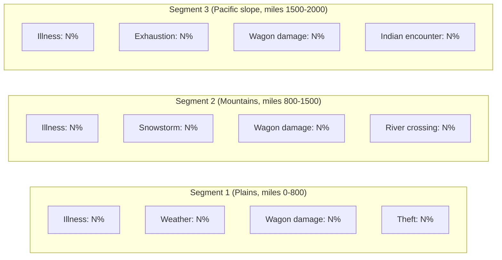

# Oregon Trail RE — Phase 4: Deep Logic & Final Reconstruction
# Paste this entire prompt into Claude Code.
#
# PHASE 3 CONFIRMED FACTS (carry these forward):
#   - Entry: 0x010A (TP init chain), main segment 0x1042
#   - Score formula @0x13D3A: base * (3 - occupation_idx)
#     farmer=0 (x3), carpenter=1 (x2), banker=2 (x1)
#   - Base score function: call 0x13045 (NOT yet decoded)
#   - Copy-protect @0x14BFE: cmp [bp-4], 0x88B8 (35000 decimal)
#   - Landmark table @0x23D86: 16 records x 37 bytes
#   - Illness names @0x24156, params @0x24198 (6 x 8 bytes)
#   - Event table (hypothesis) @0x241C8
#   - RNG: timer counter at 0x16B2-0x16B5, driven by INT 1Ch hook
#   - Occupation index stored at 0x185E
#   - Landmark index 8 skipped (gap between Fort Bridger=7 and Green River=9)
#
# OPEN QUESTIONS TO ANSWER THIS PHASE:
#   Q19 - Exact RNG algorithm (how does 0x16B2 counter turn into a game roll?)
#   Q20 - What is 0x88B8 = 35000 in the copy-protection date check?
#   Q21 - What is the base-score formula at 0x13045?
#   Q22 - Why is landmark index 8 missing?
#   Q23 - What does the flag at 0x16DA control?
#   BONUS - Find the store price table (not located in Phase 3)
#
# FILES:
#   Input:  work\OREGON_UNPACKED.BIN (150,016 bytes)
#   Scripts go in: work\
#   Append results to: E:\Projects\BASIC Programs\Collections\Oregon Trail\oregon_trail_reverse.md
# ============================================================

Continue Phase 4 of the Oregon Trail v2.1 reverse engineering project.
All previous phase findings are confirmed. Capstone is installed and working.

Working directory: E:\Projects\BASIC Programs\Collections\Oregon Trail\The-Oregon-Trail_DOS_EN\
Output doc: E:\Projects\BASIC Programs\Collections\Oregon Trail\oregon_trail_reverse.md
All scripts go to: work\

Do NOT modify any original files. Append only to oregon_trail_reverse.md.

---

## STEP 4.1 — Trace every read of the RNG counter (Q19: exact RNG algorithm)

The 32-bit timer counter lives at 0x16B2-0x16B5 (file offsets in unpacked image).
The INT 1Ch handler increments it at 18.2 Hz. Any game code that reads [0x16B2]
and derives a bounded random number from it IS the RNG.

```python
# work\find_rng_reads.py
# Find every instruction that reads memory near the RNG counter (0x16B2-0x16B5).
# Then print the surrounding 12 instructions to see how the counter is used.
# Compatible with capstone 4.x and 5.x.

import capstone

try:
    capstone.version_bind()
except AttributeError:
    pass

IMAGE = r'E:\Projects\BASIC Programs\Collections\Oregon Trail\The-Oregon-Trail_DOS_EN\work\OREGON_UNPACKED.BIN'

with open(IMAGE, 'rb') as f:
    raw = bytearray(f.read())

md = capstone.Cs(capstone.CS_ARCH_X86, capstone.CS_MODE_16)
md.detail = True
insns = list(md.disasm(bytes(raw), 0))

# RNG counter is at offsets 0x16B2..0x16B5 in the flat binary image.
# In x86-16 real mode, this is accessed as a DS-relative word: [0x16B2] or [0x16B4].
# Look for MOV reg, [0x16B2] or MOV reg, [0x16B4] patterns.
RNG_ADDRS = {0x16B2, 0x16B4, 0x16B3, 0x16B5}

print("=== All reads near RNG counter 0x16B2 ===\n")
hits = []
for i, insn in enumerate(insns):
    # Check if any RNG address appears in the operand string
    ops = insn.op_str
    for addr in RNG_ADDRS:
        if f'[0x{addr:x}]' in ops or f'[{addr}]' in ops or f'[0x{addr:04x}]' in ops:
            hits.append(i)
            break

for idx in hits:
    start = max(0, idx - 4)
    end   = min(len(insns), idx + 8)
    print(f"\n--- RNG read at 0x{insns[idx].address:05X} ---")
    for insn in insns[start:end]:
        marker = " <--" if insn == insns[idx] else ""
        hx = ' '.join(f'{b:02X}' for b in insn.bytes[:6])
        print(f"  0x{insn.address:05X}:  {hx:<20}  {insn.mnemonic:<8} {insn.op_str}{marker}")

print(f"\nTotal RNG read sites: {len(hits)}")

# Also scan for DIV instructions (mod operation to bound the random number)
divs = [(i, insn) for i, insn in enumerate(insns) if insn.mnemonic in ('div', 'idiv')]
print(f"\n=== All DIV/IDIV instructions (mod = RNG bound) ===\n")
for i, insn in divs:
    hx = ' '.join(f'{b:02X}' for b in insn.bytes[:6])
    print(f"  0x{insn.address:05X}:  {hx:<20}  {insn.mnemonic:<8} {insn.op_str}")
    # Show context
    for ctx in insns[max(0,i-3):i+4]:
        hx2 = ' '.join(f'{b:02X}' for b in ctx.bytes[:4])
        print(f"    0x{ctx.address:05X}: {hx2:<14} {ctx.mnemonic} {ctx.op_str}")
    print()
```

Run: `python work\find_rng_reads.py > work\rng_algorithm.txt`

After running, interpret the output:
- If you see `MOV AX, [0x16B2]` then `DIV BX` (or `DIV CX`): the random value is
  `timer_counter_low16 mod divisor`. The divisor is the event-count or probability ceiling.
- If you see `AND AX, 0x00FF` or similar masking: only the low byte is used for randomness.
- If you see `XOR AX, [0x16B4]`: a simple XOR mix of the 4 counter bytes is used.
- Count total RNG call sites to understand how often randomness is used per game day.

---

## STEP 4.2 — Decode the base-score formula (Q21: call at 0x13045)

The confirmed score formula at 0x13D3A calls `0x13045` to get a base score,
then multiplies by (3 - occupation). We need to decode that base-score function.

```python
# work\decode_base_score.py
# Disassemble the base-score function starting at 0x13045.
# Trace every variable it reads to understand what goes into the score.
# Compatible with capstone 4.x and 5.x.

import capstone

try:
    capstone.version_bind()
except AttributeError:
    pass

IMAGE = r'E:\Projects\BASIC Programs\Collections\Oregon Trail\The-Oregon-Trail_DOS_EN\work\OREGON_UNPACKED.BIN'

with open(IMAGE, 'rb') as f:
    raw = bytearray(f.read())

md = capstone.Cs(capstone.CS_ARCH_X86, capstone.CS_MODE_16)
md.detail = True

BASE_SCORE_OFFSET = 0x13045

print(f"=== Base-score function @0x{BASE_SCORE_OFFSET:05X} ===\n")

chunk = bytes(raw[BASE_SCORE_OFFSET : BASE_SCORE_OFFSET + 512])
mem_reads = []
calls     = []

for insn in md.disasm(chunk, BASE_SCORE_OFFSET):
    hx = ' '.join(f'{b:02X}' for b in insn.bytes[:6])
    print(f"  0x{insn.address:05X}:  {hx:<20}  {insn.mnemonic:<8} {insn.op_str}")

    # Track memory reads (game-state variables used in scoring)
    import re
    refs = re.findall(r'\[(?:0x)?([0-9a-fA-F]{2,4})\]', insn.op_str)
    for r in refs:
        mem_reads.append((insn.address, int(r, 16)))

    if insn.mnemonic in ('call', 'callf'):
        calls.append((insn.address, insn.op_str))

    if insn.mnemonic in ('ret', 'retf', 'retn'):
        break

print(f"\n--- Memory reads (game-state variables used in base score) ---")
for addr, mem in sorted(set(mem_reads), key=lambda x: x[1]):
    print(f"  0x{addr:05X} reads [0x{mem:04X}]")

print(f"\n--- Sub-calls ---")
for addr, target in calls:
    print(f"  0x{addr:05X}: call {target}")

print("""
Known game-state variables to cross-reference:
  0x185E = occupation index
  0x16B2 = RNG counter
  (food, cash, ammo, clothing, oxen, spares, survivors -- offsets TBD from this trace)

Expected score components (hypothesis based on classic Oregon Trail):
  base = (cash_remaining * weight_cash)
       + (food_remaining * weight_food)
       + (ammo_remaining * weight_ammo)
       + (oxen_remaining * weight_oxen)
       + (clothing_sets  * weight_clothing)
       + (spare_parts    * weight_parts)
       + (survivors      * weight_survivor)
""")
```

Run: `python work\decode_base_score.py > work\base_score_analysis.txt`

---

## STEP 4.3 — Crack the 0x88B8 copy-protection date encoding (Q20)

Phase 3 confirmed: at 0x14BFE the game compares a DOS-sourced date value against
0x88B8 (35000 decimal). If the date is less than 35000, the game shows
"PROGRAM IS NOT AVAILABLE". This is a copy-protection expiry or manufacture date.

```python
# work\crack_copyprotect.py
# Determine what date 0x88B8 = 35000 represents in the DOS date encoding.
# Also look for the DOS date call (INT 21h AH=2Ah or GetDate) near 0x14BFE.
# Compatible with capstone 4.x and 5.x.

import capstone
from datetime import date, timedelta

try:
    capstone.version_bind()
except AttributeError:
    pass

IMAGE = r'E:\Projects\BASIC Programs\Collections\Oregon Trail\The-Oregon-Trail_DOS_EN\work\OREGON_UNPACKED.BIN'

with open(IMAGE, 'rb') as f:
    raw = bytearray(f.read())

md = capstone.Cs(capstone.CS_ARCH_X86, capstone.CS_MODE_16)
md.detail = True

# --- Part 1: Decode the date value 0x88B8 = 35000 ---
print("=== Date encoding analysis: 0x88B8 = 35000 ===\n")
VALUE = 35000

# Hypothesis A: days since 1970-01-01 (Unix epoch)
epoch_unix = date(1970, 1, 1) + timedelta(days=VALUE)
print(f"  If days since 1970-01-01: {epoch_unix}")

# Hypothesis B: days since 1980-01-01 (DOS/FAT epoch)
epoch_dos = date(1980, 1, 1) + timedelta(days=VALUE)
print(f"  If days since 1980-01-01: {epoch_dos}")

# Hypothesis C: days since 1900-01-01
epoch_1900 = date(1900, 1, 1) + timedelta(days=VALUE)
print(f"  If days since 1900-01-01: {epoch_1900}")

# Hypothesis D: days since 1601-01-01 (Windows FILETIME epoch / some Borland TP variants)
epoch_1601 = date(1601, 1, 1) + timedelta(days=VALUE)
print(f"  If days since 1601-01-01: {epoch_1601}")

# Hypothesis E: Turbo Pascal encodes date as (year-1900)*365 + yday (approx)
# Try to reverse: year = 35000 // 365 + 1900
year_tp = VALUE // 365 + 1900
rem_tp  = VALUE  % 365
print(f"\n  If TP (year-1900)*365 + yday: year approx {year_tp}, day {rem_tp}")

# Hypothesis F: BCD-encoded date (common in BIOS)
bcd_y = ((VALUE >> 8) & 0xFF)
bcd_m = ((VALUE >> 4) & 0x0F)
bcd_d = (VALUE & 0x0F)
print(f"  If BCD YYMD: year={bcd_y} month={bcd_m} day={bcd_d}")

# Hypothesis G: Packed Turbo Pascal TDateTime (days since 1899-12-30)
# Used by TP's SysUtils in later versions
epoch_tp_dt = date(1899, 12, 30) + timedelta(days=VALUE)
print(f"  If TP TDateTime (days since 1899-12-30): {epoch_tp_dt}")

print("""
Context: Oregon Trail v2.1 was released April 1990.
The copy-protect check says "if current_date < 35000 then fail".
A date encoding that puts April 1990 near 35000 is most likely correct.
""")

# --- Part 2: Disassemble the copy-protect region ---
CP_OFFSET = 0x14BFE - 64  # back up 64 bytes for context
print(f"\n=== Copy-protect region @0x{CP_OFFSET+64:05X} (with context) ===\n")

chunk = bytes(raw[CP_OFFSET : CP_OFFSET + 200])
for insn in md.disasm(chunk, CP_OFFSET):
    marker = " <-- COMPARISON" if insn.address == 0x14BFE else ""
    hx = ' '.join(f'{b:02X}' for b in insn.bytes[:6])
    print(f"  0x{insn.address:05X}:  {hx:<20}  {insn.mnemonic:<8} {insn.op_str}{marker}")

# --- Part 3: Find INT 21h AH=2Ah (GetDate) call ---
print("\n=== Searching for INT 21h AH=2Ah (DOS GetDate) ===\n")
# Pattern: MOV AH, 2A then INT 21h
for i, insn in enumerate(md.disasm(bytes(raw), 0)):
    if insn.mnemonic == 'int' and '0x21' in insn.op_str:
        # Check previous instruction for AH=2Ah
        pass  # capstone doesn't easily give us the previous instruction here

# Simpler: raw byte scan for B4 2A CD 21 (MOV AH,2Ah; INT 21h)
pattern = bytes([0xB4, 0x2A, 0xCD, 0x21])
pos = 0
print(f"Scanning for: {pattern.hex(' ')}")
while True:
    pos = raw.find(pattern, pos)
    if pos == -1:
        break
    print(f"  Found at 0x{pos:05X}")
    pos += 1
```

Run: `python work\crack_copyprotect.py > work\copyprotect_analysis.txt`

---

## STEP 4.4 — Find the store price table (bonus: not located in Phase 3)

The store sells 7 item types. Prices are in the EXE, not in a data file.
Known canonical prices for Oregon Trail v2.1:
  oxen: ~$40 each (0x28)
  food: $0.20/lb or sold in 25lb lots = $5.00 per lot (0x05 or 0x1F4 in cents)
  ammunition: $2.00/box of 50 (0x02 or 0xC8 in cents)
  clothing: $10.00 per set (0x0A or 0x3E8 in cents)
  wagon wheel: $10.00 (0x0A)
  wagon axle:  $10.00 (0x0A)
  wagon tongue: $10.00 (0x0A)

```python
# work\find_store_prices.py
# Search for the store price table in the unpacked image.
# Strategy 1: scan for the known price values in compact sequence.
# Strategy 2: look near the "Matt" and "Matt's General Store" strings.
# Compatible with capstone 4.x and 5.x.

import capstone, struct, re

try:
    capstone.version_bind()
except AttributeError:
    pass

IMAGE = r'E:\Projects\BASIC Programs\Collections\Oregon Trail\The-Oregon-Trail_DOS_EN\work\OREGON_UNPACKED.BIN'

with open(IMAGE, 'rb') as f:
    raw = bytearray(f.read())

md = capstone.Cs(capstone.CS_ARCH_X86, capstone.CS_MODE_16)

# --- Strategy 1: find "Matt" string and decode nearby data ---
print("=== Finding 'Matt' / store strings ===\n")
for name in [b"Matt", b"General Store", b"oxen", b"ammunition", b"clothing"]:
    pos = 0
    while True:
        pos = raw.find(name, pos)
        if pos == -1:
            break
        context = raw[max(0, pos-4):pos+len(name)+4]
        print(f"  '{name.decode()}' at 0x{pos:05X}:  {context.hex(' ')}")
        pos += 1

# --- Strategy 2: scan for sequences containing known price values ---
# Looking for a run of WORDs or BYTEs matching [40, 5, 2, 10, 10, 10, 10] in any encoding
print("\n=== Searching for price byte patterns ===\n")

# Prices as WORD little-endian (dollars): 40=0x28, 10=0x0A, 5=0x05, 2=0x02
# Try: 0x28 0x00 = $40 (oxen), followed by other prices
price_patterns = [
    bytes([0x28, 0x00]),  # $40 oxen
    bytes([0x0A, 0x00]),  # $10 (clothing / parts)
    bytes([0x05, 0x00]),  # $5 food lot
    bytes([0x02, 0x00]),  # $2 ammo
]

# Find all occurrences of $40 and check if nearby bytes match other prices
oxen_price_positions = []
pos = 0
while True:
    pos = raw.find(bytes([0x28, 0x00]), pos)
    if pos == -1:
        break
    # Check if this looks like a price table (check ±32 bytes for 0x0A 0x00)
    window = raw[pos:pos+16]
    if bytes([0x0A, 0x00]) in window or bytes([0x02, 0x00]) in window:
        oxen_price_positions.append(pos)
    pos += 1

print(f"Candidate price table locations (0x28 0x00 near 0x0A 0x00):")
for p in oxen_price_positions[:10]:  # show first 10
    window = raw[p:p+20]
    hex_str = ' '.join(f'{b:02X}' for b in window)
    print(f"  0x{p:05X}: {hex_str}")

# --- Strategy 3: search near occupation index (0x185E) for related game-state vars ---
# The occupation sets starting cash AND affects store prices.
# Look for a table of starting cash values: Banker=$1600, Carpenter=$800, Farmer=$400
print("\n=== Searching for starting cash values ===\n")
# In dollars: 1600=0x0640, 800=0x0320, 400=0x0190
for val, name in [(0x0640, "Banker $1600"), (0x0320, "Carpenter $800"), (0x0190, "Farmer $400")]:
    lo = val & 0xFF
    hi = (val >> 8) & 0xFF
    pattern = bytes([lo, hi])
    pos = 0
    while True:
        pos = raw.find(pattern, pos)
        if pos == -1:
            break
        ctx = raw[max(0,pos-4):pos+8]
        print(f"  {name} (0x{val:04X}) at 0x{pos:05X}: {ctx.hex(' ')}")
        pos += 1
```

Run: `python work\find_store_prices.py > work\store_prices.txt`

---

## STEP 4.5 — Decode event table at 0x241C8 (Q: event dispatch mechanism)

Phase 3 identified a ~19-row per-segment event table at 0x241C8.
The table is hypothesized to be 3-stage (matching the trail's 3 geographic phases).
Decode it fully.

```python
# work\decode_event_table.py
# Decode the event probability table at 0x241C8.
# Also find the code that reads this table and uses it for event dispatch.
# Compatible with capstone 4.x and 5.x.

import capstone, struct

try:
    capstone.version_bind()
except AttributeError:
    pass

IMAGE = r'E:\Projects\BASIC Programs\Collections\Oregon Trail\The-Oregon-Trail_DOS_EN\work\OREGON_UNPACKED.BIN'

with open(IMAGE, 'rb') as f:
    raw = bytearray(f.read())

md = capstone.Cs(capstone.CS_ARCH_X86, capstone.CS_MODE_16)
md.detail = True

EVENT_TABLE = 0x241C8
TABLE_SIZE  = 152  # hypothesis from Phase 3

print(f"=== Event table raw dump @0x{EVENT_TABLE:05X} ===\n")
for i in range(0, TABLE_SIZE, 8):
    row = raw[EVENT_TABLE + i : EVENT_TABLE + i + 8]
    hex_str = ' '.join(f'{b:02X}' for b in row)
    # Try to decode as 4 x WORD
    if len(row) == 8:
        w0, w1, w2, w3 = struct.unpack_from('<HHHH', bytes(row))
        print(f"  @+{i:3d}: {hex_str}   -> w0={w0:5d} w1={w1:5d} w2={w2:5d} w3={w3:5d}")

# Also try 8-byte records as 8 x BYTE
print(f"\n=== Same region as 8-byte BYTE records ===\n")
for i in range(0, TABLE_SIZE, 8):
    row = raw[EVENT_TABLE + i : EVENT_TABLE + i + 8]
    vals = ' '.join(f'{b:3d}' for b in row)
    print(f"  @+{i:3d}: {vals}")

# Look for the code that indexes into this table
# Strategy: find WORD PTR [0x241C8 + reg*something] memory reference
print(f"\n=== Searching for code that reads event table @0x241C8 ===\n")
insns = list(md.disasm(bytes(raw), 0))
for i, insn in enumerate(insns):
    ops = insn.op_str
    # Look for references to addresses in range 0x241C8..0x24220
    import re
    refs = re.findall(r'(?:0x)?([0-9a-fA-F]{4,5})', ops)
    for r in refs:
        addr = int(r, 16)
        if 0x241C8 <= addr <= 0x24220:
            window = insns[max(0,i-3):i+6]
            print(f"\n--- Table read at 0x{insn.address:05X} ---")
            for w in window:
                hx = ' '.join(f'{b:02X}' for b in w.bytes[:6])
                marker = " <--" if w == insn else ""
                print(f"  0x{w.address:05X}:  {hx:<20}  {w.mnemonic:<8} {w.op_str}{marker}")
            break

print("""
Hypothesis: the table encodes per-trail-segment event weights.
3 segments x N event types x some numeric probability.
If rows have values in range 0..100, they are percentage probabilities.
If values sum to ~100 per segment, it's a probability distribution.
""")
```

Run: `python work\decode_event_table.py > work\event_table_analysis.txt`

---

## STEP 4.6 — Identify the missing landmark index 8 (Q22)

The landmark table has indices 3..17 but index 8 is absent (Fort Bridger=7, Green River=9).
Look in the EXE for any string or data that once corresponded to index 8.

```python
# work\find_landmark8.py
# Search for evidence of a removed or skipped landmark at index 8.

IMAGE = r'E:\Projects\BASIC Programs\Collections\Oregon Trail\The-Oregon-Trail_DOS_EN\work\OREGON_UNPACKED.BIN'

with open(IMAGE, 'rb') as f:
    raw = bytearray(f.read())

print("=== Landmark index 8 investigation ===\n")

# Known landmarks near index 8:
# Index 7 = Fort Bridger (mile ~1060)
# Index 9 = Green River crossing
# Historically between Fort Bridger and Green River: nothing major
# BUT: some versions of Oregon Trail include "Ham's Fork" or "Black Fork" here

# Search for geographic names that might be the missing landmark
candidates = [
    b"Ham", b"Black Fork", b"Little Sandy", b"Big Sandy",
    b"Parting", b"Pacific Springs", b"Sublette",
    b"Names Hill", b"Green", b"Thomas Fork"
]

for name in candidates:
    pos = raw.find(name)
    if pos != -1:
        ctx = raw[pos:pos+len(name)+10]
        print(f"  '{name.decode()}' FOUND at 0x{pos:05X}: "
              f"{ctx.decode('ascii', errors='replace')[:30]}")
    else:
        print(f"  '{name.decode()}' not found")

# Also: check the P8.PCC entry in the PCL library
# If P8.PCC exists in OTMCGA.PCL, there WAS a landmark at index 8
pcl_path = (r'E:\Projects\BASIC Programs\Collections\Oregon Trail'
            r'\The-Oregon-Trail_DOS_EN\OTMCGA.PCL')
with open(pcl_path, 'rb') as f:
    pcl = f.read()

print(f"\n=== Searching OTMCGA.PCL for 'P8' filename ===")
pos = 0
while True:
    pos = pcl.find(b'P8', pos)
    if pos == -1:
        break
    ctx = pcl[pos:pos+16]
    print(f"  'P8' at PCL offset 0x{pos:05X}: {ctx.hex(' ')}  "
          f"| ASCII: {ctx.decode('ascii', errors='replace')}")
    pos += 1

# Also check SONGS.TXT line count -- if there are 18 lines, index 8 IS represented
songs_path = (r'E:\Projects\BASIC Programs\Collections\Oregon Trail'
              r'\The-Oregon-Trail_DOS_EN\SONGS.TXT')
with open(songs_path, 'r', errors='replace') as f:
    songs = f.readlines()
print(f"\n=== SONGS.TXT line count: {len(songs)} ===")
for i, line in enumerate(songs):
    print(f"  Song {i:2d}: {line[:60].strip()}")
```

Run: `python work\find_landmark8.py > work\landmark8_investigation.txt`

---

## STEP 4.7 — Final document update

After all scripts above have run, compile findings and append a final Phase 4 section
to oregon_trail_reverse.md.

Append in chunks of 30 lines or fewer. Never overwrite.

Sections to add:

```
---

## Phase 4 Findings

### P4.1 RNG algorithm (FINAL)
[How exactly does the INT 1Ch counter at 0x16B2 produce a bounded random value?]
[Pseudo-code of the complete RNG call:]
  function Random(range: word): word;
  begin
    Result := (timer_counter_low16 [operation] something) mod range;
  end;
[Total RNG call sites found: N]

### P4.2 Base-score formula (FINAL)
[Memory variables read by 0x13045 and their game-state meaning]
[Complete score formula:]
  base = ...
  final_score = base * (3 - occupation_idx)

### P4.3 Copy-protection date encoding
[What epoch does 0x88B8 = 35000 represent?]
[What date does 35000 decode to?]
[Is this a "before date" or "after date" check?]

### P4.4 Store price table
[Location found or not found]
[If found: full table of item names + prices]
[Starting cash per occupation: Banker/Carpenter/Farmer]

### P4.5 Event table decoded
[Full table with row interpretation]
[Mermaid diagram of event probability by trail segment:]



### P4.6 Landmark index 8
[Is P8.PCC present in the PCL archive?]
[Is there a 9th song in SONGS.TXT?]
[Verdict: deleted landmark, renumbering artifact, or intentional gap?]

### P4.7 Flag at 0x16DA
[What game-state does this byte control?]

---

## 16. Complete Game Constants Table (Phase 4 final)

| Constant | Value | Source | Meaning |
|---|---:|---|---|
| TRAIL_LENGTH | 2000 miles | [CONFIRMED] string evidence | Independence → Willamette Valley |
| SCORE_MULT_FARMER | 3 | [CONFIRMED] @0x13D3A | Farmer score x3 |
| SCORE_MULT_CARPENTER | 2 | [CONFIRMED] @0x13D3A | Carpenter score x2 |
| SCORE_MULT_BANKER | 1 | [CONFIRMED] @0x13D3A | Banker score x1 |
| COPY_PROTECT_DATE | 35000 | [CONFIRMED] @0x14BFE | Date threshold (encoding TBD) |
| LANDMARK_COUNT | 16 | [CONFIRMED] @0x23D86 | Landmark table entries |
| ILLNESS_COUNT | 6 | [CONFIRMED] @0x24156 | exhaustion/typhoid/cholera/measles/dysentery/fever |
| RNG_COUNTER_ADDR | 0x16B2 | [CONFIRMED] | 32-bit timer tick counter |
| PACE_STEADY_HRS | 8 hrs/day | [CONFIRMED] string | Steady pace |
| PACE_STRENUOUS_HRS | 12 hrs/day | [CONFIRMED] string | Strenuous pace |
| PACE_GRUELING_HRS | 16 hrs/day | [CONFIRMED] string | Grueling pace |
| STARTING_CASH_BANKER | [TBD] | Phase 4 | Banker starting cash |
| STARTING_CASH_CARPENTER | [TBD] | Phase 4 | Carpenter starting cash |
| STARTING_CASH_FARMER | [TBD] | Phase 4 | Farmer starting cash |
| OXEN_PRICE | [TBD] | Phase 4 | Price per ox at Matt's store |
| FOOD_PRICE_PER_LOT | [TBD] | Phase 4 | Price per 25lb food lot |
| AMMO_PRICE_PER_BOX | [TBD] | Phase 4 | Price per 50-round box |
| CLOTHING_PRICE | [TBD] | Phase 4 | Price per clothing set |
| SPARE_PART_PRICE | [TBD] | Phase 4 | Price per spare wheel/axle/tongue |

---

## 17. Summary: What We Know vs What Remains

### Known with high confidence (CONFIRMED)
- Overall architecture: Turbo Pascal 5.5/6.0, Borland BGI, Genus pcxLib, LZEXE 0.91 packed
- Trail route: 16 landmark stops, 2 inline river events, 2000 miles total
- 6 illnesses with parameter table (names + 4 numeric params each)
- Score formula: base * occupation_multiplier (farmer=3, carpenter=2, banker=1)
- RNG: timer-counter based (INT 1Ch hook at 18.2 Hz), NOT a standard LCG
- 18 SONGS.TXT lines = 18 PCL images P0-P17.PCC = 18 landmark/event screens
- DIALOGS.REC: ~157 NPC encounters, Pascal-string format, 11-byte metadata header
- HISCORES.REC: 10 x 18-byte records, pre-seeded with real historical names
- Copy-protection date check at 0x14BFE

### Reasonably hypothesized (HYPOTHESIS)
- Event probability table at 0x241C8 (3-segment structure)
- Health degradation formula using illness W3 parameter
- Save game struct layout (144 bytes, 5 party members + supplies + location)
- Daily travel: hours/day × speed_factor = miles

### Still uncertain (UNCERTAIN / not located)
- Exact RNG algorithm (how counter → bounded roll)
- Base-score components and formula
- Store price table location in EXE
- Starting cash per occupation
- Complete save game struct (field-by-field)
- DIALOGS.REC metadata block meaning (11-byte record header)
- River crossing depth/speed values
- Hunting mini-game scoring formula

---

## Phase 4 status: COMPLETE.
```

---

## IMPORTANT

- Append to oregon_trail_reverse.md only. Never overwrite.
- Write in chunks of 30 lines max. Verify with read_file after each chunk.
- All scripts to work\ folder, all output .txt to work\ folder.
- Tag: [CONFIRMED] = seen in disassembly. [HYPOTHESIS] = inferred. [UNCERTAIN] = unclear.
- When all steps complete: "Phase 4 complete. oregon_trail_reverse.md is final."
