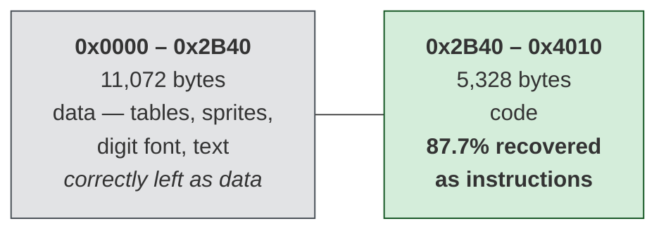

# ParaTrooper (1982)

A fixed-gun shooter written by **Greg Kuperberg** — aged fourteen or fifteen —
and published by **Orion Software** in 1982. Sixteen kilobytes of hand-written
8088 assembly: the game, all its graphics, its music and every word of its text.

This folder contains a playable browser port, six documents explaining how both
versions work, and instructions for reconstructing the original source yourself.

*Part of [retro-ports](../README.md). Start with the port and document 01 if you
are new to programming; go straight to 02 and 03 if you are not.*

## Play it

```
web/index.html
```

Open that file. No build step, no server, no dependencies — just double-click
it. Arrow keys rotate the gun, space fires, `C` switches to the original's
stranger 1982 controls, `M` mutes.

The rules, the 18.2 Hz clock, the random number generator and the title melody
are the original's, read out of the binary. **The artwork is new** — the
original sprite format is still undecoded, so nothing could be reproduced even
in principle. `selfTest()` in the browser console verifies the generator
against the 1982 sequence and plays ten unattended games from fixed seeds.

Why that language, and what porting it actually taught, is in
[docs/04-porting.md](docs/04-porting.md).

## Documentation

| | |
|---|---|
| [**docs/01-the-game.md**](docs/01-the-game.md) | what ParaTrooper is, how it plays, what machine it needs — read from the binary's own text and tables |
| [**docs/02-architecture.md**](docs/02-architecture.md) | how the program is built: memory layout, the three ways it addresses itself, and its video, timing, input and sound |
| [**docs/03-the-code.md**](docs/03-the-code.md) | six routines traced end to end and annotated, including the RNG and the four-paratrooper rule |
| [**docs/04-porting.md**](docs/04-porting.md) | where to take it next — five targets with honest trade-offs, what will bite you in each, and how to tell whether a port is actually right |
| [**docs/05-web-architecture.md**](docs/05-web-architecture.md) | how the browser port is built: the game loop, fixed timestep, state machines, coordinate systems — written from scratch for someone learning to program |
| [**docs/06-web-code.md**](docs/06-web-code.md) | the port's code walked through, with the four bugs it produced and what each one teaches |

Each states plainly what was read from the file and what was inferred; the
[open questions](docs/02-architecture.md#what-is-still-unknown) are listed
rather than papered over.

## Reconstructing the original source

**`original/` and `recovered/` are not in this repository.** ParaTrooper is
still under copyright, and `recovered/paratrooper.asm` assembles to a
byte-identical copy of the game — which makes shipping it the same as shipping
the binary, only in source form.

If you have your own copy, you can regenerate both in about a minute. You need
[dos-decompiler](https://github.com/agunawijaya/dos-decompiler) and
[NASM](https://www.nasm.us/):

```powershell
mkdir original, recovered
copy <your copy> original\ParaTrooper.1982.com

python <path-to>\dos-decompiler\tools\comrec.py `
       original\ParaTrooper.1982.com --out recovered\paratrooper.asm
```

No other flags — the tool works out the two-segment layout from the entry stub
by itself. It prints `BYTE-IDENTICAL` when the reconstruction is exact. Check
that yourself rather than believing it:

```powershell
nasm -f bin -o recovered\rebuilt.com recovered\paratrooper.asm
(Get-FileHash original\ParaTrooper.1982.com -Algorithm SHA256).Hash
(Get-FileHash recovered\rebuilt.com        -Algorithm SHA256).Hash
```

Both should read
`D709DDEC8C38D385F60A13A16514D8BDCADDBDA37429EC4C8FF5DF4635009342`, at 16,400
bytes.

**None of this is needed to play the port or to read the documents.** The
routines discussed in document 03 are quoted in full where they are explained.

## What you are looking at

The game was written in **assembly**, not C. There is not one stack-frame
prologue in 16 KB, so no decompiler will produce C for it — assembly is all
there ever was, and this is the strongest form that recovery can take.

Of the 16,400 bytes:



The remainder of the code region is a 77-byte zero-filled buffer at the end and
a few short runs.

2,017 instructions were disassembled. 236 of them are written as fixed bytes
with their disassembly in a comment:

```nasm
    db 0x8B, 0xD0                          ; mov dx, ax
```

Those are encodings NASM has no syntax to select — `8B D0` and `89 C2` are
both `mov dx, ax` and differ only in the direction bit. Nothing is lost from
the reading; the bytes simply have to be stated rather than spelled.

Strings appear as text, and every data row carries both its file offset and
the address the code uses to reach it, since the two differ:

```nasm
    db 0x00, 0x0D, 0x0A                                    ; 0x01A05  ds:0x19F5
    db 'Do you have the Color/Graphics'                    ; 0x01A08  ds:0x19F8
```

So `mov si, 0x19f6` in the code lands on the `0x0D 0x0A` two rows above that
prompt.

## The one thing worth knowing about the file

The first twelve bytes are a far return that reloads CS:

```nasm
    mov ax, cs
    add ax, 0x2C4
    push ax
    xor ax, ax
    push ax
    mov ax, ds
    retf
```

Execution continues at file offset `0x2B40`, addressed from base 0 instead of
0x100. Disassemble the file without knowing that and every branch target past
`0x2B40` is wrong.

The `mov ax, ds` on the second-to-last line is easy to miss and decides the
rest: it leaves `AX` holding the PSP segment, so the `add ax, 0x11 / mov ds,
ax` that opens the real code puts `DS` 0x110 bytes into the file. That is the
`ds:` column above.

---

Method and tooling: [dos-decompiler](https://github.com/agunawijaya/dos-decompiler).
The game is © 1982 Orion Software, Inc.; only the reconstruction is here.
