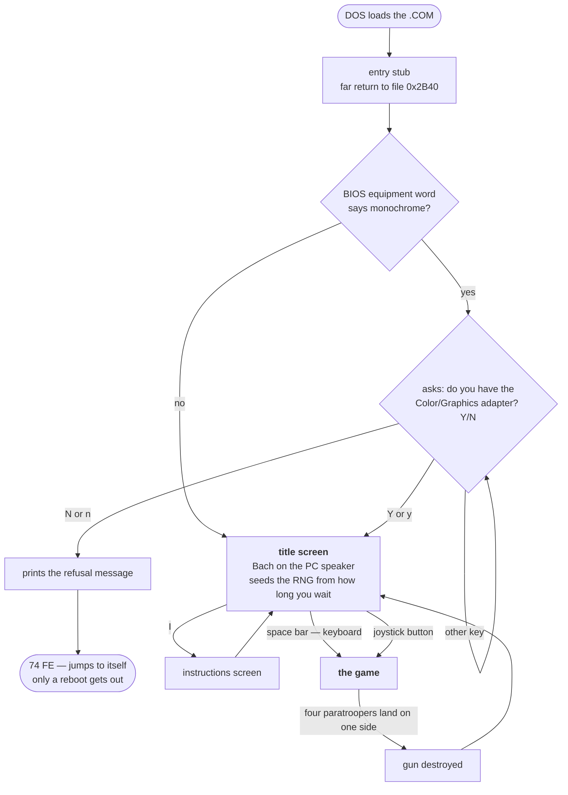
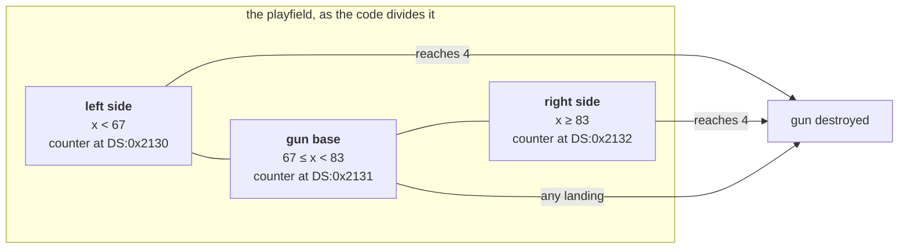

# ParaTrooper — the game

*Document one of six. See [02-architecture.md](02-architecture.md) for how
the program is built, [03-the-code.md](03-the-code.md) for what the routines
actually do, and [04-porting.md](04-porting.md) for where to take it next. The port itself is described in [05-web-architecture.md](05-web-architecture.md) and [06-web-code.md](06-web-code.md).*

This document has two kinds of fact in it, and they are kept apart on purpose:

- **From the binary.** Text, tables and code read directly out of
  `ParaTrooper.1982.com`. These are checkable — you can look at the same bytes.
- **From published sources.** History, reception, and how people played it.
  Linked at the [bottom](#sources).

Where the two disagree, the binary wins, and there is [one place where they
disagree quite badly](#the-scoring-nobody-agrees-on).

---

## What it is

ParaTrooper, published 1982 by **Orion Software**, written by **Greg
Kuperberg**. Both names are in the file, in the title screen text at file
offset `0x1516` and `0x158F`:

```
Greg Kuperberg
PRESS `I' FOR INSTRUCTIONS
PRESS space bar FOR KEYBOARD PLAY
OR joystick button FOR JOYSTICK PLAY
(C)1982 ORION SOFTWARE, INC.
```

You sit behind a gun at the bottom of the screen. Helicopters cross the sky
dropping paratroopers. Shoot the helicopters, shoot the paratroopers, and above
all do not let four of them land on the same side of you — because then they
climb on each other's shoulders, reach your gun, and blow it up.

It is 16,400 bytes. The whole game — code, graphics, music, every word of text
you will ever see — is that one file. A single photograph from a modern phone
is roughly two hundred times larger.

### Written by a fifteen-year-old

Kuperberg was **14 or 15** when he wrote it. He had learned BASIC at Auburn
University's computer centre at ten or eleven, and had taken a university
assembly language course before ever touching an 8088.

He wrote it with **Edlin** — a *line* editor. Not a screen editor: you could
not scroll through your program and look at it. You typed a line number and
edited that one line, blind. Five thousand lines of assembly, that way.

The graphics were made on paper:

> I drew pictures on graph paper and I converted them to hexadecimal data.
> — Greg Kuperberg

That is not a figure of speech. You can see the result:
[the digit font decoded out of the binary](03-the-code.md#6-the-digit-font) is a
grid of hand-plotted pixels, including a zero with a diagonal slash through it
that somebody drew square by square on graph paper and then converted to hex by
hand.

### It is a copy, and that was normal

ParaTrooper is based on **Sabotage** (1981, Apple II, by Mark Allen). The
concept — fixed gun, falling paratroopers, human pyramid — is Sabotage's.
Porting a hit from another machine was completely ordinary in 1982; the IBM PC
was barely a year old and had almost no games at all.

Reviewers of the day noticed that ParaTrooper is *harder* than its model:
paratroopers jump more often, fall faster, and open their parachutes closer to
the ground. In exchange your gun fires faster and the scoring is more generous.

---

## The shape of a session

**What this diagram shows:** every screen the program can put in front of you,
and the exact key or condition that moves you between them. Every arrow is a
real branch in the code — none of it is a guess about how it "probably" works.

Read it top to bottom. Diamonds are decisions the program makes; the rounded
boxes are the beginning and the one dead end.



**Three things in it are easy to miss:**

1. **The colour check happens before anything is drawn.** The very first thing
   the game does is ask the BIOS what kind of monitor is attached. If the answer
   is "monochrome", you never see the game at all. This is why the first thing
   to get right when running it today is your emulator's video setting.
2. **One path has no way out.** `Halt` is a genuine dead end — the program jumps
   to itself forever. There is no "press any key to return to DOS", because
   there is no DOS to return to (see [below](#it-never-talks-to-dos)).
3. **Everything else loops back to the title screen.** Losing does not end the
   program. There is, in fact, no way to quit ParaTrooper at all except by
   restarting the machine.

---

## How it plays

The game explains itself. This is the mission text at file offset `0x1636`,
exactly as stored — the ragged spacing is the original's, because the text was
laid out by hand for a 40-column screen:

> **\*Your Mission\***
>
> Do not allow enemy paratroopers to land on either side of your gun base. If
> four paratroopers land on one side of your base, they will overpower your
> defenses and blow up your gun. After you have survived the first round of
> helicopters, watch out for the jet bombers. Every jet pilot has a deadly
> aim!

### The three things in the sky

| Threat | What it does | How dangerous |
|---|---|---|
| **Helicopters** | cross the sky, drop paratroopers | harmless in themselves |
| **Paratroopers** | float down; four on one side and you lose | the slow death |
| **Jets and their bombs** | fly over and bomb your gun directly | instant death |

Helicopters cannot hurt you. Paratroopers cannot hurt you *individually*. Only
accumulation kills — or a bomb, which kills at once.

### Your gun swivels, and that is the whole difficulty

It rotates; it does not slide. The instructions call the directions
*counterclockwise* and *clockwise*, not left and right, and it covers roughly
90° either side of straight up.

The control scheme is unusual, and understanding it is most of learning the
game:

```
The numeric key pad controls your gun and the firing of your bullets.
Two keys start the gun moving:
    ...  or  ...   counterclockwise
    ...  or  ...   clockwise
Using the ... or ... key stops the movement of your gun and fires your bullets.
```

(The gaps are in the file. The key names are drawn as pictures at run time
rather than stored as text, which is why the sentences have holes in them.)

One key **starts the gun swinging**, and it keeps swinging. Another key **stops
it and fires**. You are not aiming and then shooting — you are *timing a stop*.
That is a different skill entirely, and it is why the game feels clumsy for the
first few minutes and then abruptly does not.

---

## The scoring nobody agrees on

Here the binary settles an argument. Three published sources give three
different sets of point values and **none of them is fully right.**

The scoring routine at address `0x1328` takes the points to award in the `AL`
register. Every place in the program that calls it, and what it passes:

| Instruction | Value | Number of call sites |
|---|---|---|
| `mov al, 5` | **5** | 4 |
| `mov al, 0xa` | **10** | 1 |
| `mov al, 0x1e` | **30** | 2 |

Three values exist in the entire program: **5, 10 and 30**. There is no 50, no
25, and no 2. Anything else you read about ParaTrooper's scoring is wrong.

Matched to the three categories the instruction screen itself lists, in its own
order:

| | Points |
|---|---|
| Helicopter or jet | **10** |
| Enemy paratrooper | **5** |
| Bomb | **30** |
| **Every shell you fire** | **−1** |

**[inferred]** The three *values* are certain — they are in the code. Which
enemy each one belongs to follows the instruction screen's ordering and one
corroborating source; the per-enemy mapping was not traced call by call.

### The minus one is the entire design

*Firing costs a point.* That one rule turns a shooting game into an accuracy
game. Spraying bullets at the sky will keep you alive and drive your score
steadily down. A good player fires **fewer** shots than a bad one, not more.

It also means your score can go negative, and on a bad opening wave it will.

---

## How to win

There is no winning. There are **escalating waves — no discrete levels, no
ending, no final boss.** The game runs until it kills you, which it eventually
will. "Winning" means a high score, and the high score survives only until the
machine is switched off (`HI-SCORE:` at file offset `0x1A9C`; the program
contains no file I/O whatsoever, so nothing is ever saved).

Each wave brings more helicopters and more paratroopers. After the first round,
the jet bombers start.

### Tips that actually move your score

**Shoot the parachute, not the man.** This is the best trick in the game. A
direct hit destroys one paratrooper. A hit on the *canopy* drops him like a
stone — and he kills any paratrooper he lands on. One bullet, two or three
kills. Since every bullet costs a point, chaining kills this way is most of the
difference between a mediocre score and a good one.

**Bombs first, always.** A bomb kills you instantly; paratroopers need four
landings. Whatever else is happening on screen, a bomber outranks it. Bombs are
also worth the most points, so here the safe play and the greedy play agree.

**Then helicopters, then paratroopers.** Kill a helicopter before it unloads and
you never have to deal with its passengers at all. Paratroopers already under
canopy are the *last* priority — they are a problem you can defer, and
deferring them is usually correct.

**Count per side, not in total.** You lose at four on *one* side. Three left and
three right is survivable; four left is not. Under pressure, look at which side
is filling up and defend that one — the other side has far more slack than your
panic suggests.

**What this diagram shows:** how the program actually divides the ground under
you. This is not an interpretation of the artwork — the code tests each
landing against exactly these two boundaries, and keeps three separate
counters. Knowing they are separate is what makes the tip above work.



Note the middle zone. A paratrooper landing *on* your gun base does not need
three friends — that one is fatal immediately. It is traced instruction by
instruction in
[03-the-code.md](03-the-code.md#4-landing-and-the-four-paratrooper-rule).

**Do not chase.** The gun swings and stops, and every change of direction costs
time you do not have. Between waves, leave it near centre, where it can reach
either side fastest.

**Fire less than feels comfortable.** The scoring punishes every shot. If you
are not fairly confident of a hit, the point you keep is worth more than the
shot you spend.

---

## The Bach on the PC speaker

The title screen plays music on a device that can produce exactly one square
wave at a time. Published accounts describe it as Bach.

The melody is in the file, and it can be pulled out. At `DS:0x0F85` — file
offset `0x0F95` — sit **110 sixteen-bit numbers**. They are not notes. They are
*divisors* for the PC's timer chip: divide the timer's 1,193,182 Hz clock by
each one and you get a frequency.

| Stored value | Divisor | Frequency | Note |
|---|---|---|---|
| `0x0E24` | 3620 | 329.6 Hz | E4 |
| `0x0A98` | 2712 | 440.0 Hz | A4 |
| `0x0970` | 2416 | 493.9 Hz | B4 |
| `0x08E8` | 2280 | 523.3 Hz | C5 |

Doing that for all 110 values gives the tune:

```
E4 E4 A4 A4  E4 E4 B4 B4  E4 E4 C5 C5  E4 E4 A4 A4
E4 E4 B4 B4  E4 E4 C5 C5  E4 E4 D5 D5  E4 E4 B4 B4
E4 E4 C5 C5  E4 E4 D5 D5  E4 E4 E5 E5  E4 E4 C5 C5
E4 E4 D5 D5  E4 E4 E5 E5  E4 E4 F5 F5  E4 E4 D5 D5
...
E4 E4 A4 A4  E4 E4 B4 B4  E4 E4 G#4 G#4 E4 E4
```

Look at the shape. **One note — E — keeps coming back**, and between each
return the other voice climbs: A, B, C, D, E, F, then walks back down. A fixed
pedal note alternating against a moving line is a signature Baroque keyboard
device, and the pitches used (A B C D E F G♯) are A harmonic minor.

**[verified vs. cited]** The pitches above are decoded from the file and anyone
can recheck them. The *attribution* comes from published sources, which name
Bach's Toccata and Fugue in D minor, BWV 565. The figure is that piece's
characteristic device, but this rendering sits in A minor rather than D minor —
so it is transposed, adapted, or the attribution is loose. The binary can prove
the notes; it cannot prove the composer.

Either way: somebody in 1982, given a one-voice beeper, decided the right thing
to greet you with was Bach.

---

## It demands a colour monitor, and asks politely

The first thing the program does is read the BIOS equipment word at
`0040:0010` and check the video bits. If it finds a Monochrome Display Adapter:

> Sorry, Paratrooper does not work on the Monchrome Display Adapter. You must
> have a Color/Graphics Monitor Adapter in order to play this game.

and then it hangs on purpose. The instruction at file offset `0x2B8A` is
`74 FE` — "jump to yourself" — and the machine spins there until switched off.
That was an ordinary way to end a program that could not run.

(The typo — *Monchrome* — is the original's, at file offset `0x1996`. It has
been sitting in that file since 1982.)

If the equipment word is ambiguous, it asks rather than guessing:

> Do you have the Color/Graphics Monitor Adapter(Y/N)?

`Y`, `y`, `N` and `n` are accepted; anything else asks again. Answering no takes
the same path: message, then hang.

**Running it today: set your emulator to CGA.** MDA or Hercules will hit that
check and stop.

---

## It never talks to DOS

This deserves its own heading, because it is unusual and it explains where the
game came from.

Across all 2,017 instructions in the program, these are the only system calls
it makes:

| Call | What it is | Used for |
|---|---|---|
| `int 10h` | BIOS video | set the screen mode; print text on the title and instruction screens |
| `int 16h` | BIOS keyboard | read keys |
| `int 1Ah` | BIOS clock | the game's timing, and its source of randomness |

**There is no `int 21h` anywhere.** That is the DOS call. This program never
asks DOS for anything — not to print a character, not to read a key, not even
to exit. It has no exit path at all.

That fits its history exactly. ParaTrooper was originally sold as a
**self-booting disk**: you put the floppy in, turned the machine on, and the
game *was* the operating system. There was nothing to ask and nothing to return
to. The `.COM` file examined here is a later conversion for people running DOS,
and it kept that character entirely — it loads, and it takes over.

It also explains the direct-to-hardware style everywhere else. Kuperberg's own
account of why:

> my assembly language programs wrote image data straight into the section of
> the computer memory tied to the screen display

after finding the system's graphics calls nearly as slow as a whole frame of
animation. The binary agrees precisely: `int 10h` draws the menu text, and
every single pixel of the actual game is written straight to video memory.

---

## What the machine had to be

| | |
|---|---|
| CPU | 8088 at 4.77 MHz, real mode. Not one instruction requires a 286 or later. |
| Video | CGA, mode 4 — 320×200, four colours. Set at start-up, never changed. |
| Memory | ~16 KB, and it allocates nothing beyond itself. |
| Sound | PC speaker — one square wave, no sound chip, no channels. |
| Input | Keyboard through the BIOS; joystick read straight off port `0x201`. |
| Storage | None. It never opens a file. |
| DOS | **None at all.** |

No interrupt handler is installed anywhere; everything is polled in a single
loop. See
[02-architecture.md](02-architecture.md#no-interrupts-anywhere) — it turns out
that is the reason the program is as readable as it is.

---

## How it was received

Honestly: not that well.

*PC Magazine* gave it **10 points out of 18**, calling it "a well-executed but
unexceptional game [which] quickly loses its appeal after a dozen or so plays."
In 1984, readers of *Softline* voted ParaTrooper **the worst IBM program of
1983**.

That is worth sitting with, because it is a useful corrective. This program is
technically impressive, historically interesting and beautifully compact — and
players at the time found it repetitive. Both are true. A program being a good
thing to study does not make it a good game, and the reverse holds just as
often.

It sold regardless, through ComputerLand and similar chains, in what Kuperberg
describes as roughly one sales wave per title during Orion's short life.
Software Creations released *Night Raid* in 1992 as a spiritual successor.

---

## Provenance

The copy examined here is `ParaTrooper.1982.com`, 16,400 bytes, SHA-256
`D709DDEC8C38D385F60A13A16514D8BDCADDBDA37429EC4C8FF5DF4635009342`.

The game is © 1982 Orion Software, Inc. Nothing in this directory redistributes
it; `recovered/paratrooper.asm` is a reconstruction produced from a copy the reader
must already have, and is useful only to someone who has it.

## Sources

Everything in the "from the binary" category can be rechecked against the file
itself. The historical and gameplay material comes from:

- [Paratrooper (video game) — Wikipedia](https://en.wikipedia.org/wiki/Paratrooper_(video_game))
- [Interview with Greg Kuperberg — Into The Vertical Blank](https://intotheverticalblank.com/2025/12/02/interview-greg-kuperberg/)
- [Games 193–194: Sabotage & Paratrooper — Data Driven Gamer](https://datadrivengamer.blogspot.com/2020/06/games-193-194-sabotage-paratrooper.html)
- [Paratrooper for DOS — sparcie](https://sparcie.wordpress.com/2013/03/04/paratrooper-for-dos/)
- [The original IBM PC and Orion Software — Retro365](https://retro365.blog/2019/09/23/bits-from-my-personal-collection-the-original-ibm-pc-and-orion-software/)
- [Paratrooper — Internet Archive](https://archive.org/details/msdos_Paratrooper_1982) (playable in a browser)

The point values in several of these disagree with each other and with the
program. [The program is right](#the-scoring-nobody-agrees-on).
