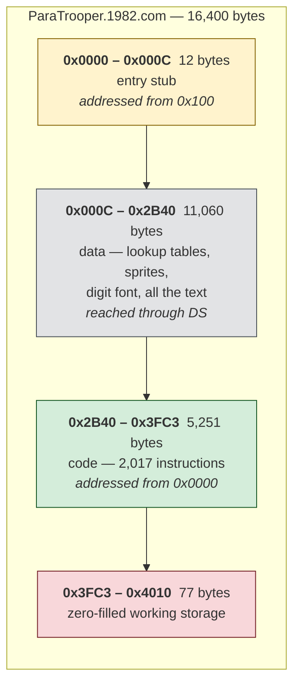
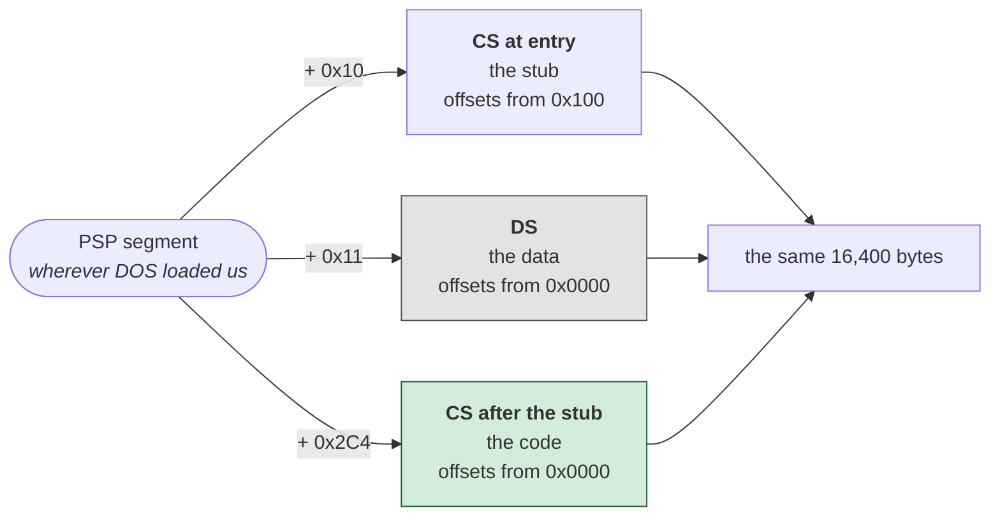
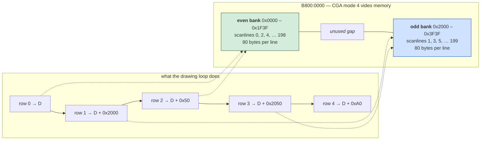
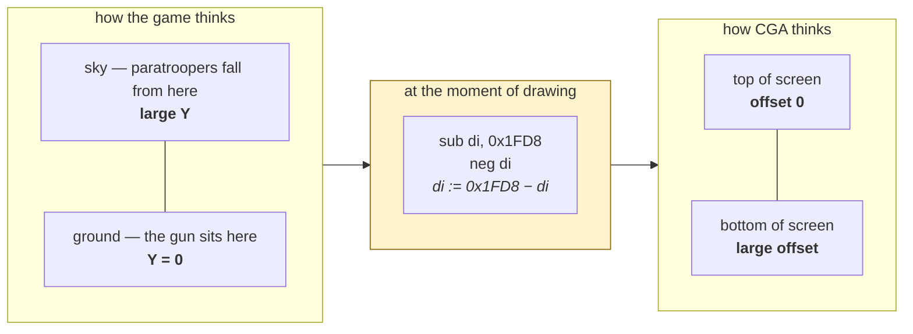
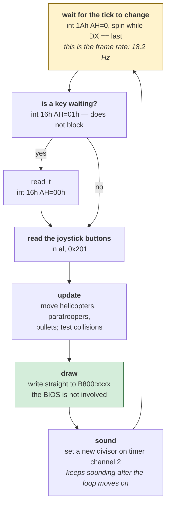

# ParaTrooper — architecture

*Document two of six. See [01-the-game.md](01-the-game.md) for what the game
is, [03-the-code.md](03-the-code.md) for annotated routines, and
[04-porting.md](04-porting.md) for where to take it next. For the browser port instead, see [05-web-architecture.md](05-web-architecture.md).*

This describes the shape of the program: how it is laid out in memory, how it
finds its own data, and the four mechanisms it is built out of — video, timing,
input and sound.

**You do not need to know assembly to read this.** The next section gives you
the five ideas everything else rests on. If you already write assembly, skip to
[Shape of the file](#shape-of-the-file).

Facts here were read from the binary. Anything inferred is marked
**[inferred]**, and there is a list of
[what is still unknown](#what-is-still-unknown) at the end.

---

## Five ideas, if assembly is new to you

**1. A program is a list of very small orders.**

Modern languages let you write `score = score + 10`. A 1982 processor has no
such instruction. It has orders like "copy this number into that box", "add
these two boxes", "if the result was zero, jump somewhere else". Assembly is
those orders written down one per line. A single line of C might be six lines
of assembly, and a line of Python might be fifty.

The orders in this program look like this:

```nasm
    mov ah, 0       ; put the number 0 into the box called AH
    int 0x16        ; ask the BIOS for a keypress
    cmp al, 0x59    ; compare the box AL against 0x59 (the letter 'Y')
    je L_02B94      ; if they were equal, jump to the label L_02B94
```

`mov` means *move* (really: copy). `cmp` means *compare*. `je` means *jump if
equal*. That is genuinely most of it — this whole game is built from about
thirty distinct orders.

**2. The boxes are called registers, and there are very few.**

A modern program has as many variables as it likes. An 8088 has **eight**
16-bit registers, and every calculation passes through them: `AX`, `BX`, `CX`,
`DX`, `SI`, `DI`, `BP`, `SP`. Each of the first four can also be used as two
separate 8-bit halves — `AX` splits into `AH` (high) and `AL` (low).

That scarcity shapes everything. Much of what looks like busywork in old
assembly is just shuffling values in and out of eight boxes.

**3. Memory is one enormous numbered row of bytes.**

No objects, no strings, no arrays — just byte number 0, byte number 1, byte
number 2, and so on. If you want a string, you decide that bytes 5,398 through
5,412 are a string and you remember that. Nothing enforces it. This is why the
[reconstruction](../recovered/paratrooper.asm) has to *work out* which bytes are code
and which are data: the file does not say.

**4. Addresses come in two parts, and this is the confusing bit.**

A 16-bit register can count to 65,535 — but the 8088 could reach a million
bytes. The fix was to build every address out of *two* numbers: a **segment**
and an **offset**. The real address is `segment × 16 + offset`.

The consequence that matters here: **the same byte has different addresses
depending on which segment you view it through.** That is not a bug, it is the
design, and this program uses it deliberately — see
[Three views of the same bytes](#three-views-of-the-same-bytes).

**5. There is no operating system to help.**

No windows, no files being opened for you, no graphics library. If you want a
pixel on screen you write a number into the memory the screen is wired to. If
you want a sound you program a timer chip. If you want to know the time you ask
the BIOS. This program does all three, and
[nothing else at all](01-the-game.md#it-never-talks-to-dos).

That is the whole background. Everything below is built from it.

---

## Shape of the file

**What this diagram shows:** the whole 16,400-byte file, top to bottom, divided
into the four regions it actually contains. The numbers on the left are
positions within the file — byte 0, byte 12, byte 11,072, and so on.



**How to read it.** Two thirds of this "program" is not program. The green band
is the only part the processor ever executes; the grey band above it is
pictures, text and lookup tables. That ratio is normal for a game and it is why
[a percentage of the whole file is a misleading way to measure a
decompilation](https://github.com/agunawijaya/dos-decompiler/blob/main/tests/com/CASE-STUDY.md).

The red band at the bottom is 77 bytes of zeros — scratch space the game writes
into while running. It is stored in the file only because the file has to be a
contiguous block.

**The thing to notice:** the data comes *first* and the code comes *second*.
That is backwards from almost every program you will ever meet, and it is the
reason for the strange twelve bytes at the very start.

---

## Three views of the same bytes

This is the one genuinely confusing thing about the program, and it is worth
slowing down for, because it is the trap that defeats a naive disassembler.

Recall idea 4: an address is `segment × 16 + offset`. When DOS loads a `.COM`
file it puts it somewhere in memory and tells the program where via the segment
registers. This program then sets up **three different segment values**, and
uses each to look at a different part of itself.

| Register | Points at | So its offsets start from | Used for |
|---|---|---|---|
| `CS` at entry | PSP + 0x10 | `0x100` | the first 12 bytes, then never again |
| `CS` after the stub | PSP + 0x2C4 | `0x0000` | every instruction that runs |
| `DS` | PSP + 0x11 | `0x0000` | every piece of data |

**What this diagram shows:** the same physical bytes, seen through three
different segment registers. "PSP" is simply wherever DOS happened to load the
program — the program does not know that number in advance and must compute
everything relative to it.



**Why three arrows point at one box.** They are not three copies of the file.
There is one file in memory, and three different ways of counting into it. An
instruction that says "give me byte 0x19F6" gets a completely different byte
depending on which of these three is in force.

**The one rule to remember:** a `DS` address plus `0x10` is a position in the
file. So when the code says `mov si, 0x19F6`, it is pointing at file offset
`0x1A06`.

The reconstruction prints both numbers on every row of data so this never has
to be worked out by hand:

```nasm
    db 0x00, 0x0D, 0x0A                                    ; 0x01A05  ds:0x19F5
    db 'Do you have the Color/Graphics'                    ; 0x01A08  ds:0x19F8
```

Left of the semicolon is what is in the file. Right of it: where it sits in the
file, and what the code calls it. That is how you get from `mov si, 0x19F6` in
the program to the actual sentence it prints.

### The entry stub

The first twelve bytes exist for one purpose: to move execution to the far end
of the file, and to set up that third view.

```nasm
    mov ax, cs          ; the PSP segment
    add ax, 0x2C4       ; skip past 11 KB of data
    push ax
    xor ax, ax
    push ax
    mov ax, ds          ; leave AX = PSP for the code to use
    retf                ; -> (PSP+0x2C4):0000, file offset 0x2B40
```

**In plain terms:** `retf` normally means "return from a function call" — it
takes two numbers off the stack and jumps to them. Here nobody called anything.
The program *pushes* the destination it wants onto the stack itself and then
"returns" to it. A return instruction used as a jump.

Why go to that trouble? Because the 8088 can jump to a fixed faraway address
written into the instruction, but not to one it has just *calculated* — and this
address must be calculated, since a `.COM` program has no idea where it will be
loaded.

**The load-bearing instruction is `mov ax, ds`**, second from last. It looks
like nothing. It survives the jump and hands the PSP segment to the code, which
immediately does `add ax, 0x11 / mov ds, ax` to aim `DS` at the data. Miss that
one instruction and every data address in the program is wrong by 11 kilobytes,
and nothing will tell you.

A disassembler that does not follow this stub reads the entire file as though
it started at `0x100`, and produces confident nonsense for all 5 KB of code.
That single trap is why the reconstruction tool detects this pattern
automatically instead of asking.

---

## Video

**CGA mode 4: 320×200 pixels, four colours.** Set once at start-up and never
changed:

```nasm
    mov ax, 0xb800
    mov es, ax          ; ES now points at the screen
    mov ax, 4           ; AH=0 means "set mode", AL=4 means mode 4
    int 0x10            ; ask the BIOS to do it
    mov ax, 0xb00       ; AH=0Bh: set the palette
    mov bx, 0x10
    int 0x10
```

`0xB800` is not a made-up number. On a CGA card, the memory starting at that
segment *is the screen* — it is wired to the display hardware. Write a byte
there and a pixel changes. There is no drawing call, no buffer to flip, no
notion of a window.

After these six lines the BIOS is used only to print text on the title and
instruction screens. **Every pixel of the actual game is written straight into
that memory**, which is exactly what the author said he did and why:

> my assembly language programs wrote image data straight into the section of
> the computer memory tied to the screen display

Four colours means **two bits per pixel** — four pixels packed into every byte.
So a byte is not a pixel; it is four of them, and changing one pixel means
reading a byte, altering two bits, and writing it back.

### The interleave

Here CGA does something genuinely strange that anyone porting this must know.

You would expect row 0 of the screen to be followed in memory by row 1, then
row 2. It is not. CGA splits the screen into **two separate halves of memory**:
all the even-numbered scanlines live at the start, and all the odd-numbered
ones live 8 KB further along. This was a hardware convenience in 1981 and a
nuisance ever after.

The program steps through it like this:

```nasm
    mov ax, 0x1ffe
.row:
    movsw               ; copy two bytes = 8 pixels to the screen
    add di, ax          ; jump to the next row — but which way?
    neg ax              ; flip the sign
    add ax, 0x4c        ; and adjust
    loop .row
```

That little dance of `neg` and `add` produces an alternating stride: a big jump
forward, then a big jump backward-and-a-bit, forever.

**What this diagram shows:** on the left, how CGA memory is really arranged; on
the right, the sequence of addresses the loop above visits. The dotted lines
connect each step to the half of memory it lands in.



**How to read it.** Follow the right-hand column downward and watch the dotted
lines bounce between green and blue. Drawing a sprite eight rows tall means
hopping back and forth between two regions of memory 8 KB apart, four times
each. The `+0x50` you see appearing every second step is 80 — one screen line's
worth of bytes — because moving *two* scanlines within one bank is one line's
worth of movement.

This arithmetic is also the **proof** that the screen layout is the standard
one. It could not work for any other arrangement, which is how the mode was
confirmed rather than assumed.

### The screen is upside down

Fifty-seven `neg` instructions in a 5 KB program is not normal —`neg` means
"negate", and no ordinary code needs it that often. They are all the same
two-line idiom:

```nasm
    sub di, 0x1fd8
    neg di              ; di := 0x1FD8 - di
```

which computes `0x1FD8 minus di`. That is a mirror: large numbers become small
ones and vice versa.

**What this diagram shows:** why it is there. The game and the screen disagree
about which way is up, and this idiom is the translation between them — applied
at the last moment, just before drawing.



**Why bother?** Because the game is about things *falling*. In the game's own
coordinates, the ground is zero and height increases upward, exactly as a
person would describe it — so gravity is a subtraction and "has it landed?" is
a comparison against zero. Doing it the screen's way would mean every piece of
game logic in the program carrying a correction.

The author paid two instructions per sprite and got simpler physics
everywhere else. That is a real engineering trade, made deliberately, in 1982.

`0x1FD8` is `0x2000 − 0x28`: the last 40-byte step inside one bank.

---

## Timing

The game's clock is the **BIOS tick counter** — `int 1Ah`, which returns a
number that the hardware increases 18.2 times per second. It appears eight
times in the program, in two quite different roles.

**As a frame clock.** The program reads the tick, then reads it again in a
tight loop until it changes. That pause is one frame:

```nasm
    mov ah, 0
    int 0x1a
    mov [0x1ab0], dx        ; remember the current tick
.wait:
    mov bx, [0x1ab0]
    mov ah, 0
    int 0x1a
    cmp dx, bx
    je .wait                ; spin until it moves
```

**As a source of randomness.** While the title screen waits for you to press a
key, it reads the clock twice and combines the readings. What it is really
measuring is *how long you took* — the only unpredictable quantity available on
a machine with no clock chip, no disk activity and no network:

```nasm
    mov ah, 0
    int 0x1a
    mov bx, dx
    mov ah, 0
    int 0x1a
    xor dx, bx              ; difference = how long the player waited
    test dx, 0xfc
```

**Why this matters more than it sounds.** The usual way to pace a game in 1982
was to count: `mov cx, 5000 / loop $`, spin the processor a fixed number of
times and call it a delay. It works — on the machine you own. It is also the
single reason so many games of that era became unplayable a few years later,
running at ten times the intended speed on a faster PC.

ParaTrooper does not do that. It waits on a *hardware clock*, so its pace is
the same on any machine. The author was explicit that this was deliberate:

> I cared about consistent laws of motion. When objects fell, they travelled
> along parabolas … the animations were clocked at a fixed rate.

Forty years later that decision is why the game still plays correctly, and why
[porting it is unusually easy](04-porting.md).

---

## No interrupts anywhere

The program **installs no interrupt handler**. There is no `int 21h` with
`AH=25h`, no write into the interrupt vector table, no `cli`/`sti` pair guarding
a shared variable. Verified by scanning all 2,017 decoded instructions.

For a reader who has not met the term: an *interrupt handler* is code the
hardware calls without being asked — a keyboard handler that fires the instant
a key goes down, say, interrupting whatever was running. It is powerful and it
is the classic source of the hardest bugs in this kind of program, because two
pieces of code end up touching the same variable at unpredictable moments.

This program has none of that. Everything is a poll inside one loop.

**What this diagram shows:** the game's entire life. It goes round this circle
about eighteen times a second, forever.



**How to read it.** Start at the yellow box and follow the arrows round. Note
the shape: *wait, look, think, draw, repeat.* There are no other paths and
nothing runs in the background.

Note also the branch near the top. `int 16h AH=01h` asks "is there a key
waiting?" **without stopping** — a blocking read would freeze the helicopters
until you pressed something. The game only performs the real read once it knows
a key is there.

**Why this is the most important fact in the document.** Every hard thing about
reading old game code — reentrancy, race conditions, state shared between a
handler and the main program, "who owns this variable right now" — is simply
absent. It is a single-threaded loop over global variables. You can read it
from top to bottom, and what you read is what happens.

If you are learning by studying old programs, this is why ParaTrooper is a good
first one and, say, a sound-driver-equipped game from 1990 is not.

**[inferred]** Each box above is a mechanism confirmed present in the code — the
tick wait, the non-blocking key test, the port read, the direct video writes,
the timer writes. Their arrangement into a single loop in this order is the
reading that fits; the main loop was not traced end to end to confirm the exact
sequence.

---

## Input

**Keyboard** — through the BIOS. `int 16h` with `AH=01h` tests whether a key is
waiting; `AH=00h` actually takes it. The title screen compares what it gets
against `'N'`, `'n'`, `'Y'`, `'y'`, `'I'`, `'i'` and scancode `0x13`.

**Joystick** — read directly off the hardware, with no BIOS involved at all:

```nasm
    mov dx, 0x201
    in al, dx           ; read the game port
    neg al
    test al, 0x30       ; are either of the two button bits set?
```

`in` is the instruction for reading a hardware port — a completely separate
address space from memory, reserved for talking to devices. Port `0x201` is the
game port, and two of the bits it returns are the joystick buttons.

**[inferred]** Only the buttons are read this way in the paths examined. The
joystick's *axes* were read on real hardware by triggering a timing circuit and
counting how long it took to respond; if this program does that, the loop was
not located.

---

## Sound

The PC speaker, through **timer channel 2** — the standard arrangement, and the
only one available:

```nasm
    mov al, 0x4f
    out 0x61, al        ; connect the timer to the speaker
    mov al, 0xb6
    out 0x43, al        ; configure channel 2: square wave, 16-bit divisor
    ...
    out 0x42, al        ; the pitch, low byte
    mov al, ah
    out 0x42, al        ; the pitch, high byte
```

The PC of 1981 had no sound chip. It had a timer whose output could be wired to
a small speaker, and you set the pitch by telling the timer what to divide its
1,193,182 Hz clock by. That is the entire sound system: **one square wave, one
note at a time, no volume control.**

Eighteen separate writes to port `0x42` means the pitch is changed constantly —
so the effects are sweeping tones rather than fixed beeps.

Because nothing runs on an interrupt, sound is produced *inline*: the main loop
sets a frequency and moves on, and the speaker keeps making that noise until
some later pass changes it or switches it off. The music on the title screen is
[a table of 110 divisors](01-the-game.md#the-bach-on-the-pc-speaker) fed through
the same two ports.

---

## Code structure

Nineteen subroutines. Thirty-eight call sites. Thirty-six `ret` instructions.
No jump tables, no function pointers, no dispatch of any kind.

For a 5 KB program that is a very flat structure — the call graph is shallow,
the two busiest routines are called seven times each, and most of the program
is straight-line code with local jumps. Modern code of the same size would have
several times as many functions.

The instruction mix tells the same story:

```
mov  676    cmp 140    add  85    je  80
jne   67    neg  57    dec  56    inc 56
```

`mov` — plain copying — is more than a third of everything, and there are more
`neg` than `sub`. **This is a program that moves bytes to the screen and does
very little arithmetic.** Which is exactly what a 1982 arcade game is.

### State

Forty-seven distinct memory addresses are used as variables. All of them are
globals; there are no local variables and no stack frames anywhere in the
program, because at this size there was no reason to pay for them.

| Address (DS) | Uses | What it is |
|---|---|---|
| `0x2AF0` | 17 | not identified |
| `0x1AB2` | 16 | not identified |
| `0x2AF7` | 15 | not identified |
| `0x1D8F` | 12 | index into a coordinate table |
| `0x1AB0` | 5 | **last BIOS tick — the frame clock** (confirmed) |
| `0x2B00`–`0x2B05` | | **the six score digits**, least significant first (confirmed) |
| `0x2130`–`0x2132` | | **per-side landed-paratrooper counters** (confirmed) |
| `0x144F`–`0x14FE` | | **the digit font**, 11 glyphs of 16 bytes (confirmed) |

Most of the forty-seven were not identified, and that is worth being plain
about: naming a variable honestly means watching every routine that touches it,
and that was done only where a routine could be traced end to end. A name
guessed from one use is how a wrong reading gets written down and then quoted.

### The playfield is divided in three

Two separate routines split the horizontal axis at exactly the same two
boundaries, `0x43` and `0x53` — 67 and 83:

```nasm
    cmp si, 0x43                ; at 0x0707
    ...
    cmp si, 0x53

    cmp byte [0x2137], 0x43     ; at 0x0DBF
    cmp byte [0x2137], 0x53
```

Left of 67, between 67 and 83, and right of 83 — the two sides and the gun base
between them. This is where the game's central rule lives, and it is traced in
full in [03-the-code.md](03-the-code.md#4-landing-and-the-four-paratrooper-rule).

Note that the coordinate is *not* pixels: a 320-pixel screen would not stop at
104. The game keeps its own coordinate system and converts only when drawing —
the same separation as the upside-down Y axis above.

**[inferred]** The data region opens with a table of 16-bit values at `DS:0`
whose entries advance by a constant 104 bytes. 104 is suggestively close to the
coordinate range implied by those boundaries, which would make it a row table
for a 104-column playfield grid. But no instruction anywhere in the program
contains the number 104, so nothing confirms this. The shape of the table is
the only evidence, and shape alone is not enough.

---

## What is still unknown

Listed plainly, so nobody mistakes this for a complete map:

- **The sprite format is not decoded.** The digit font is understood — 8×8, two
  bytes per row — because the scoring routine could be followed all the way to
  it. The helicopter, jet, paratrooper and gun shapes have not been traced back
  to the routines that draw them. This is the [largest single
  blocker](04-porting.md#the-bad-news-the-blocker-is-not-the-language) for
  anyone wanting to port the game.
- **132 bytes inside the code region** never came back as instructions, mostly
  the 77-byte zero-filled buffer at the end, which is working storage.
- **The 104-stride table's consumer** was never found.
- **The joystick axis read**, if there is one, was not located.
- **Most of the 47 variables** have no confirmed meaning.

None of this affects the reconstruction. `recovered/paratrooper.asm` rebuilds the
file byte for byte regardless of how well any individual table is understood —
the correctness of the rebuild and the completeness of the understanding are
two different things, and only the first one is finished.
