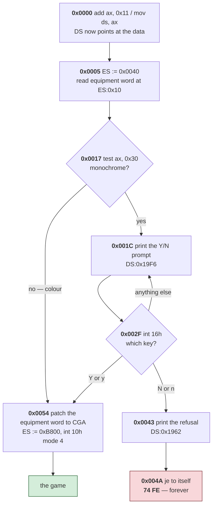
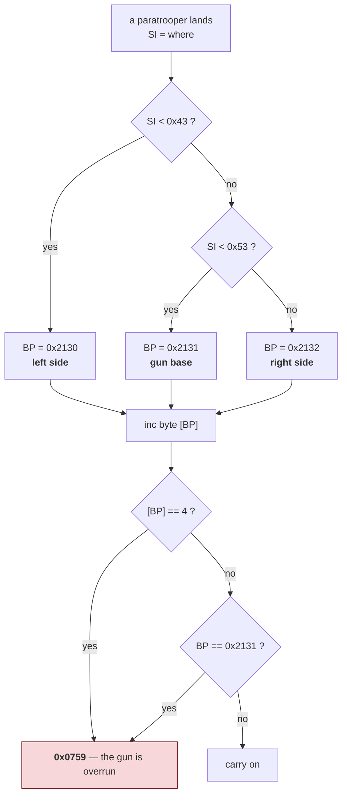
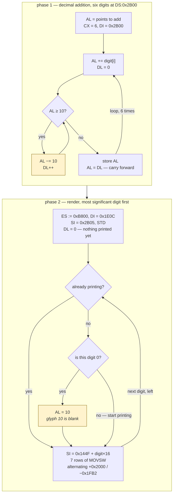

# ParaTrooper — the code

*Document three of six. See [01-the-game.md](01-the-game.md) for what the game
is, [02-architecture.md](02-architecture.md) for how the program is laid out,
and [04-porting.md](04-porting.md) for where to take it next. For the browser port instead, see [06-web-code.md](06-web-code.md).*

Six routines, traced end to end. Every listing is copied from
`recovered/paratrooper.asm` — the file that reassembles to a byte-identical copy of
the original — with comments added and nothing else changed. Addresses are given
both ways: position in the file first, then the address the code itself uses.

**If assembly is new to you**, read
[the five ideas](02-architecture.md#five-ideas-if-assembly-is-new-to-you) in the
architecture document first. Each routine below is explained twice: once as
*what the machine does*, once as *what the programmer was thinking*.

Nothing here is a guess about what the machine does. Where the *purpose* of
something is inferred rather than proven, it says so.

If you only read one section, read
[what was remarkable in 1982](#what-was-remarkable-in-1982) at the end.

---

## 1. The entry stub

**File `0x0000`, twelve bytes.** The whole of it:

```nasm
L_00000:
    mov ax, cs          ; PSP segment: where DOS loaded us
    add ax, 0x2C4       ; + 11,264 bytes — past the data, to the code
    push ax             ; the CS we want
    xor ax, ax
    push ax             ; the IP we want: 0
    mov ax, ds          ; leave AX = PSP for the code to pick up
    retf                ; "return" to (PSP+0x2C4):0000 = file offset 0x2B40
```

**What the machine does.** `push` puts a number on the stack. `retf` — return
far — takes two numbers off the stack and jumps to them. So the program pushes
a destination and then "returns" to a place it was never called from.

**What the programmer was thinking.** *I need to jump to an address I have to
calculate, and this processor has no instruction for that.* The 8088 can jump
to a fixed faraway address baked into the instruction, but a `.COM` program does
not know where it will be loaded, so the target must be worked out at run time.
`retf` is the only instruction that jumps to a computed segment-and-offset pair,
so you feed it one by hand.

This is a *pattern*, not a hack — it was the standard way to do a computed far
jump, and it appears in DOS programs throughout the era.

**Two details worth pausing on.**

`xor ax, ax` sets `AX` to zero. Why not `mov ax, 0`? Because `xor` of a register
with itself is two bytes and `mov ax, 0` is three, and on this processor the
`xor` is also faster. In a 16 KB budget, one byte matters. You will see this
idiom in compiled code to this day.

`mov ax, ds` is the load-bearing instruction and it looks like nothing. It sits
between the pushes and the jump, doing no apparent work. What it actually does
is *smuggle a value across the jump*: `AX` still holds it when the code at the
other end starts, and that code needs it to find its own data. Miss this one
line and every data address in the program is wrong by 11 kilobytes.

**Why all this exists at all:** the data comes first in this file and the code
comes second, which is backwards. Twelve bytes of stub is the price.

---

## 2. Start-up and the colour check

**File `0x2B40`, address `0x0000`.**

**What this diagram shows:** every branch in the start-up sequence, before you
read a single line of assembly. Diamonds are decisions; follow the arrows.



Note the red box. Every other path leads onward; that one leads nowhere,
deliberately.

Now the code. The first instructions actually executed after the stub:

```nasm
L_02B40:
    add ax, strict word 0x11    ; AX was PSP; DS will point 0x110 bytes in
    mov ds, ax                  ; from here, DS:0 is file offset 0x10
    mov ax, 0x40
    mov es, ax                  ; ES -> the BIOS data area
    mov dx, 0x201
    in al, dx                   ; touch the game port (result discarded here)
    mov ax, word [es:0x10]      ; the BIOS equipment word
    xor ax, 0x30
    db 0x8B, 0xD0               ; mov dx, ax
    test ax, 0x30               ; video bits: 0x30 means monochrome
    jne L_02B94                 ; not monochrome -> get on with it
```

**What the machine does.** The BIOS keeps a block of information about the
machine at a fixed place in memory — segment `0x40` — and two bits of the word
at offset `0x10` describe the video adapter. The code points `ES` at that block,
reads the word, and tests those two bits.

**The trick in the middle.** `xor ax, 0x30` flips the two bits. `test ax, 0x30`
then checks whether they are now both zero — which happens precisely when they
were both *ones* before, the code for monochrome. So a flip plus a test does
the work of "are these two bits both set?" in two instructions with no branch
between them.

**What the programmer was thinking.** *I can only run on a colour card, so ask
the machine first and fail politely.* Checking hardware before assuming it is
not something every 1982 game bothered with.

If the check says monochrome, control falls through to the prompt:

```nasm
L_02B5C:
    mov si, 0x19f6              ; DS:0x19F6 = file 0x1A06
L_02B5F:                        ; "Do you have the Color/Graphics
    cld                         ;  Monitor Adapter(Y/N)?"
    lodsb
    cmp al, 0
    je L_02B6D                  ; NUL ends the string
    mov ah, 0xe                 ; BIOS teletype
    mov bh, 0
    int 0x10
    jmp L_02B5F
L_02B6D:
    mov ah, 0
    int 0x16                    ; wait for a key
    cmp al, 0x4e
    je L_02B83                  ; 'N'
    cmp al, 0x6e
    je L_02B83                  ; 'n'
    cmp al, 0x59
    je L_02B94                  ; 'Y' -> start
    cmp al, 0x79
    je L_02B94                  ; 'y' -> start
    jmp L_02B5C                 ; anything else: ask again
```

**This is what "print a string" looks like** when nothing prints strings for
you. `lodsb` loads one byte from wherever `SI` points and advances `SI`. Test it
for zero; if not zero, ask the BIOS to display it; repeat. Six lines to do what
`print()` does, and the loop *is* the string type — a string is simply "bytes
until a zero", a convention with nothing enforcing it.

`cld` sets the direction flag so `lodsb` moves forward rather than backward.
Forgetting it is a classic bug of the era, because some other routine may have
left the flag pointing the other way.

Note also the four separate comparisons for `N`, `n`, `Y`, `y`. There is no
"convert to uppercase" call to lean on; case-insensitivity means writing both.

Answering no reaches the refusal, and the refusal does not return:

```nasm
L_02B83:
    mov si, 0x1962              ; "Sorry, Paratrooper does not work
    cld                         ;  on the Monchrome Display Adapter..."
L_02B87:
    lodsb
    cmp al, 0
L_02B8A:
    je L_02B8A                  ; <-- 74 FE: jump to self, forever
    mov ah, 0xe
    mov bh, 0
    int 0x10
    jmp L_02B87
```

`je L_02B8A` at address `0x004A` targets its own address. When the string's
terminating zero is reached, the processor spins on those two bytes until the
machine is switched off. In 1982, with no operating system underneath to return
to, that was an ordinary way to end a program that could not run.

It is also a good lesson in reading disassembly: **a jump to itself looks
exactly like a decoding error**, and here it is the real instruction — `74 FE`,
checked against the file. This is why a reconstruction that verifies itself
against the original bytes is worth more than one that merely looks plausible.

Past the check, the display is configured and the BIOS is dismissed:

```nasm
L_02B94:
    and dx, 0xffcf              ; DX still holds the equipment word
    or dx, 0x20                 ; force the video bits to CGA
    mov word [es:0x10], dx      ; write it back to the BIOS data area
    mov ax, 0xb800
    mov es, ax                  ; ES -> CGA video memory, for good
    mov ax, 4
    int 0x10                    ; mode 4: 320x200, four colours
    mov ax, 0xb00
    mov bx, 0x10
    int 0x10                    ; AH=0Bh: palette
```

**The interesting line is the third one.** It does not merely *read* the BIOS
equipment word — it *writes back* to it, editing the operating system's own
notion of what hardware is installed so that the BIOS agrees the machine is in
colour. Reaching into the BIOS's private data and changing it is the kind of
thing that was routine then and would be a firing offence now.

Notice too that `mov es, ax` is done once, here, and `ES` then points at the
screen for the rest of the program's life. One of the eight registers is spent
permanently on "the screen". With only eight to go round, that is a real
decision.

---

## 3. The random number generator

**File `0x3235`, address `0x06F5`.** Called seven times — the most-used routine
in the program — and six instructions long:

```nasm
    mov ax, word [0x1adb]       ; the seed
    mov dx, 0x7781              ; multiplier: 30,593
    mul dx
    add ax, 0x64c9              ; increment: 25,801
    mov word [0x1adb], ax       ; keep the low 16 bits
    ret
```

**What the machine does.** Take the stored number, multiply by 30,593, add
25,801, store it back, return it. That is all.

**Why it works.** This is a **linear congruential generator** — for decades the
standard way to make random numbers, and still the method behind many
languages' built-in generators:

```
seed = (seed × 30593 + 25801) mod 65536
```

The `mod 65536` is free. `mul dx` produces a 32-bit answer split across two
registers, `DX` and `AX`; the code uses `AX` and simply ignores `DX`. Throwing
away the top half *is* the modulus. No division, no masking, no instruction
spent on it.

**The constants are not arbitrary.** An LCG can be terrible — pick badly and it
cycles after a handful of values. This one visits **all 65,536 possible states
before repeating**, because it satisfies both Hull–Dobell conditions for a
power-of-two modulus:

- the increment 25,801 is odd, so it shares no factor with 65,536;
- 30,593 ≡ 1 (mod 4), which is required when the modulus is a power of two.

Whether a fifteen-year-old knew that theorem or picked constants and tested
them, the binary cannot say. Either way the generator is correct, and getting
this wrong was extremely common.

**Where its randomness comes from.** A computer with no clock chip, no disk
activity and no network has nothing unpredictable in it. So the game measures
*you*:

```nasm
    mov ah, 0
    int 0x1a                    ; tick count -> CX:DX
    mov bx, dx
    mov ah, 0
    int 0x1a                    ; read it again
    xor dx, bx                  ; difference = how long the player waited
    test dx, 0xfc
```

While the title screen waits for a keypress it keeps reading the clock. However
long you took to press a key becomes the seed. Human reaction time was the only
entropy available, and it is a genuinely good source — nobody presses a key at
the same 1/18th of a second twice.

**Seven call sites for one generator**, in a program with only nineteen
subroutines, tells you how much of this game is chance: where helicopters
appear, when paratroopers jump, where the jets come from.

---

## 4. Landing, and the four-paratrooper rule

**File `0x3244`, address `0x0704`.** This is where the printed rules and the
machine meet.

**What this diagram shows:** the complete decision made every time a
paratrooper touches the ground.



And the code:

```nasm
    mov bp, 0x2130              ; counter for the left side
    cmp si, 0x43                ; SI = where the paratrooper landed
    jl 0x713                    ;   < 67: left
    inc bp                      ; counter for the middle
    cmp si, 0x53
    jl 0x713                    ;   67..82: the gun base itself
    inc bp                      ;   >= 83: right
0x713:
    inc byte [ds:bp]            ; one more down on that side
    cmp byte [ds:bp], 4
    je 0x759                    ; FOUR -> the gun is overrun
    cmp bp, 0x2131
    je 0x759                    ; landing on the base -> the same path
```

**The trick worth learning here.** Look at how the zone is chosen. There is no
`if/else if/else`, no table, no jump. `BP` is set to the *first* counter's
address, and then it is simply **incremented past** the ones that do not apply:

```
start at counter 0
    landed left of 67?    -> use this one
    otherwise step to counter 1
    landed left of 83?    -> use this one
    otherwise step to counter 2
```

Three adjacent counters in memory, and choosing between them costs one `inc`
each. Then a single `inc byte [ds:bp]` handles all three cases at once. This is
what "the data structure makes the code disappear" looks like, and it is the
same instinct behind a modern programmer choosing an array over three named
variables.

**What the programmer was thinking.** *Put the three counters next to each other
so the choice becomes arithmetic.*

**Reading the rule out of it.** Increment the counter for the zone; if it
reaches four, jump to `0x759`. Set against what the game itself prints:

> If four paratroopers land on one side of your base, they will overpower your
> defenses and blow up your gun.

The rule and the code agree exactly, down to the number. The same two boundaries
appear again 200 bytes later at address `0x0DBF`, tested against a different
variable — so the three-zone division is a property of the whole game world,
not a detail of this one routine.

**[inferred]** That `0x759` is the "gun destroyed" path follows from the rule
text and the branch structure; the routine at that address was not traced to
confirm it.

---

## 5. Scoring

**File `0x3E68`, address `0x1328`.** Called seven times, and it does two
separate jobs: add points to the score, then redraw it.

**What this diagram shows:** both phases. The two yellow boxes are the clever
parts, explained below.



### Phase 1 — adding, one decimal digit at a time

The score is not a number. It is **six separate bytes**, each holding one
decimal digit, least significant first. `AL` arrives holding the points to add.

```nasm
    push bx
    push cx
    push dx
    push di
    push si
    push es                     ; the only routine that saves anything
    mov bx, ds
    mov es, bx                  ; ES = DS, for STOSB
    mov cx, 6                   ; six digits
    mov di, 0x2b00
    cld
.digit:
    add al, byte [di]           ; this digit plus whatever is carried in
    mov dl, 0                   ; DL will be the carry out
.carry:
    cmp al, 0xa
    jb .store
    sub al, 0xa                 ; subtract ten, count a carry
    inc dl
    jmp .carry
.store:
    stosb                       ; write the digit back
    db 0x8A, 0xC2               ; mov al, dl  -- carry into the next digit
    loop .digit
```

**Why store a number as six separate digits?** Because it has to be *displayed*
far more often than it is *calculated with*. Storing 001234 as a normal binary
number would mean converting it to digits — which needs division — every single
time the score is drawn, several times a second. Storing it as digits means the
conversion never happens at all: drawing is just "look up the glyph for each
byte".

This is a straight trade of *arithmetic convenience* for *display convenience*,
made in the direction the program actually needs. Choosing your representation
to suit the common operation is the same decision a programmer makes today when
they cache a formatted string.

**Why subtract ten in a loop instead of dividing?** There is no `daa` here, no
`div`, no modulo. Just: is it ten or more? Take away ten, count one carry, ask
again.

That looks primitive. It is actually the fast choice. On an 8088, `div` costs
**80 to 90 cycles**; `cmp` and `sub` cost **about 4 each**. Since a digit plus a
digit plus a carry can never exceed 19, the loop runs at most *once*. Eight
cycles against ninety.

**This is the era's cost model, and it is inverted from today's.** Division was
brutally expensive; comparison and subtraction were nearly free. Code written
then looks clumsy until you know the prices, and then it looks obvious.

The digits are stored least-significant-first so the loop runs naturally from
the small end with the carry flowing forward — exactly how you add on paper.

### Phase 2 — drawing it

```nasm
    mov ax, 0xb800
    mov es, ax                  ; ES -> video
    mov di, 0x1e0c              ; where the score sits on screen
    mov dh, 6
    mov si, 0x2b05              ; the most significant digit
    mov dl, 0                   ; "have we printed anything yet?"
    std                         ; walk the digits backwards
.next:
    lodsb
    cmp dl, 0
    jne .draw                   ; already printing: draw whatever it is
    mov dl, 1
    cmp al, 0
    jne .draw                   ; first non-zero: start printing
    mov dl, 0
    mov al, 0xa                 ; still leading: use glyph 10 — a blank
.draw:
    mov cx, 7
    db 0x8B, 0xDE               ; mov bx, si  -- save the digit pointer
    mov si, 0x144f              ; the font
    cbw                         ; digit 0..10 into AX
    shl ax, 1
    shl ax, 1
    shl ax, 1
    shl ax, 1                   ; x16: each glyph is sixteen bytes
    db 0x03, 0xF0               ; add si, ax  -- point at this glyph
    mov ax, 0x1ffe
    cld
.row:
    movsw                       ; two bytes = eight pixels
    db 0x03, 0xF8               ; add di, ax
    neg ax
    add ax, 0x4c                ; alternate +0x2000 / -0x1FB2: the CGA interleave
    loop .row
    db 0x8B, 0xF3               ; mov si, bx  -- restore
    sub di, 0x20ee              ; step left to the next digit position
```

**Leading zeros, solved with no code at all.** A score of 42 should read `42`,
not `000042`. The usual solution is a special case in the drawing loop. This
program has none — because the font has **eleven** glyphs, and glyph 10 is
sixteen bytes of zero. A blank.

`DL` is a flag meaning "we have started printing". While it is clear and the
digit is zero, the code substitutes glyph 10 and draws it exactly like any
other glyph. The drawing loop never learns that anything unusual happened.

**That is the lesson worth taking away.** The special case was moved out of the
code and into the data. One extra table entry replaced a branch inside the
innermost loop — and in 1982, a branch inside an inner loop was expensive.
Modern programmers do the same thing with a lookup table or a null object, for
the same reason: *code you do not write cannot be slow or wrong.*

**The multiply is four shifts.** `shl ax, 1` four times multiplies by 16.
The 8088 could not shift by a constant other than 1 without loading `CL` first,
and `mul` would cost far more than four single-bit shifts. Multiplying by
powers of two with shifts is one of the oldest tricks there is, and compilers
still do it.

**About the `db` lines.** These are real instructions written as raw bytes. The
original assembler chose one of the two legal encodings for `mov al, dl` — `8A
C2` — and the modern assembler prefers the other, `88 D0`. Same operation, same
registers, different byte. Since the reconstruction has to reproduce the file
*exactly*, those instructions are pinned to their original bytes with the
disassembly kept in the comment. Nothing is lost for the reader.

The `cbw` on the other hand is a real instruction in the listing, and only
became one while this document was being written — see
[the postscript](#postscript-writing-this-document-found-a-bug).

---

## 6. The digit font

**`DS:0x144F`, file `0x145F`. Eleven glyphs, sixteen bytes each, 176 bytes
total.** Eight rows of two bytes; two bits per pixel, so eight pixels wide.

Decoded straight out of the file:

```
glyph 0                glyph 7                glyph 9                glyph 10
.#####..               ######..               .####...               ........
##...##.               ##..##..               ##..##..               ........
##..###.               ....##..               ##..##..               ........
##.####.               ...##...               .#####..               ........
####.##.               ..##....               ....##..               ........
###..##.               ..##....               ...##...               ........
.#####..               ..##....               .###....               ........
........               ........               ........               ........
```

**This is what the author meant** when he said he drew pictures on graph paper
and converted them to hexadecimal. Glyph 0 has a diagonal through it — the
slashed zero of early computing, so `0` could not be mistaken for `O` — and
somebody filled in those squares by hand, then worked out that the top row was
`2A A0`, and typed that into a line editor.

Glyph 10 is the blank the scoring routine depends on.

**A detail that says a lot about the era:** the eleventh glyph ends at
`DS:0x14FF`, and at `DS:0x1506` the text begins with `Greg Kuperberg`. Between
them, nothing. No header, no length field, no padding, no marker. The font ends
where it ends because the code that reads it stops there.

**Which is precisely why decompilation is hard.** Nothing in the file says "here
is a font of eleven glyphs". You learn it by following the code that reads it,
and until you do, those 176 bytes are indistinguishable from anything else.

---

## What was remarkable in 1982

Some of this program is ordinary for its time. Several things are not.

### It is clocked, not counted

The usual way to pace a game then was to burn time: `mov cx, 5000 / loop $`.
Simple, and it works on the machine you own — and it is the reason a shelf of
early-80s games became unplayable on a faster PC a few years later, running at
ten times the intended speed.

ParaTrooper waits on the **hardware clock** instead
([02-architecture.md](02-architecture.md#timing)). Its pace is the same on any
machine. The author was explicit that this was deliberate:

> I cared about consistent laws of motion. When objects fell, they travelled
> along parabolas … the animations were clocked at a fixed rate.

Parabolas. Not "things fell at a fixed number of pixels per frame" — actual
accelerated motion, from a fifteen-year-old, on a machine with no floating
point. Forty years later this is the single decision that makes the game still
work, and the one that makes [porting it
easy](04-porting.md#the-good-news-this-program-is-unusually-portable).

### It separates game coordinates from screen coordinates

The game's Y axis increases *upward*, and gets flipped at the moment of drawing
([02-architecture.md](02-architecture.md#the-screen-is-upside-down)). The
horizontal axis is not pixels either — it runs to about 104, not 320.

That is an *abstraction*: the physics is written in the units the physics
wants, and there is one conversion layer at the boundary. Being willing to pay
two instructions per sprite for cleaner logic everywhere else is a mature
engineering instinct, and it is exactly the split a modern engine makes between
world space and screen space.

### It has no interrupt handlers, and that was a choice

Hooking the timer or the keyboard interrupt was the sophisticated thing to do,
and plenty of contemporaries did it. This program does not. Everything is
polled in one loop.

The result is a program with no reentrancy, no race conditions and no shared
state between contexts — the three things that make period assembly genuinely
hard to reason about. Simplicity bought correctness. It is not obvious that a
teenager made that trade knowingly, but the program is a good deal easier to
read for it, and it works.

### The random number generator is correct

Getting an LCG's constants wrong was common, and a bad one repeats after a
short cycle, which players notice as patterns. This one has full period
([section 3](#3-the-random-number-generator)). Seeding it from human reaction
time is a neat solution to a real problem — on that machine there was genuinely
nothing else unpredictable to draw on.

### The whole thing is 16 KB

Code, all graphics, the font, the music, every screen of instruction text: 16
kilobytes, hand-packed with no padding anywhere. There is no wasted byte in the
data region because every table butts directly against the next one.

For scale, the four documents in this folder describing the game are together
larger than the game.

### And one thing that is completely ordinary

Writing directly to video memory. Every fast game did this, because the BIOS
was too slow to be usable — Kuperberg found the system's graphics calls "nearly
as slow as entire game animations". It is worth naming as *typical* precisely
so the genuinely unusual items above stand out.

---

## What a programmer today can take from it

**The cost model was inverted, and cost models change.** Division was 90 cycles
and comparison was 4, so repeated subtraction beat `div`. Today the ratios are
different again, and on modern hardware a mispredicted branch can cost more than
the arithmetic it was avoiding. The lesson is not "use subtraction" — it is that
"obviously slower" is a claim about a particular machine, and it expires.

**Choose the representation that suits the common operation.** The score is six
digit bytes because it is displayed constantly and calculated with rarely. The
three landing counters sit adjacent in memory because that turns a three-way
branch into two `inc`s. Both are the same move a modern programmer makes when
they denormalise a table or cache a rendered string.

**Push special cases into data.** The blank eleventh glyph removes leading-zero
handling from the drawing loop entirely. A null object, a sentinel row, a
default entry in a lookup table — same idea, still worth reaching for.

**Globals are not always wrong.** Forty-seven globals and no local variables
would be indefensible in a 50,000-line program. In 5 KB, with one thread and no
interrupts, it is *correct*: the machinery to do better would cost more than it
saved, and there is no confusion it could have prevented.

**Nothing in a binary tells you what anything is.** No types, no names, no
boundary between code and data. The font is a font because a routine treats it
as one. That is worth experiencing once, because it makes every type annotation
and every named constant you write afterwards feel like the gift it is.

---

## Postscript: writing this document found a bug

While quoting the scoring routine above, the quotation did not match the file.
Chasing that discrepancy turned up a real defect in the reconstruction tool.

The disassembler was reporting the single byte `0x98` as `cwde`, its 32-bit
name. In 16-bit real mode that byte is `cbw`. The assembler encodes `cwde` as
*two* bytes, so those instructions failed verification and were pinned to raw
bytes — the rebuild stayed byte-perfect, which is exactly why nobody noticed.
The only symptom was nine instructions written as bytes, carrying a comment
that named the wrong instruction.

Trusting the encoding over the name fixed it: nine instructions recovered, and
the comments now say what the processor actually does.

**The lesson generalises.** Writing prose forces you to read output you would
otherwise only run. Three separate defects in that tool were caught by things
other than the tool's own tests — two by deliberately written test fixtures, and
this one by trying to explain a routine to somebody else.

---

## Reading the rest

`recovered/paratrooper.asm` is about 3,000 lines and covers all 16,400 bytes. It is
navigable:

- **Labels** are `L_xxxxx`, named after the position in the file, so a branch
  target can be found by searching for its address.
- **Data rows** carry both addresses — `; 0x01A08  ds:0x19F8` — so a `mov si,
  0x19F6` in the code can be followed to the byte it points at.
- **Text** is emitted as text, not hex.
- **`db` lines with a comment** are instructions pinned to a fixed encoding.
  They execute; they are just spelled in bytes.

The honest limits are listed at the end of
[02-architecture.md](02-architecture.md#what-is-still-unknown). The sprite
format for the helicopters, jets and paratroopers is the largest thing not
worked out — the font was decoded because the scoring routine could be followed
to it, and no equivalent path was traced for the game objects.
