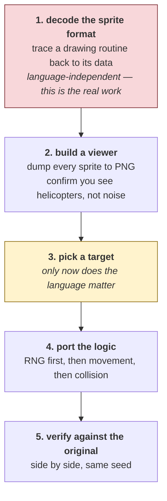
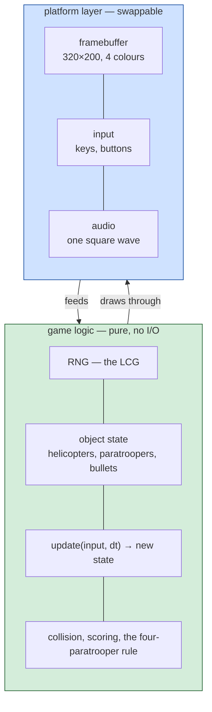
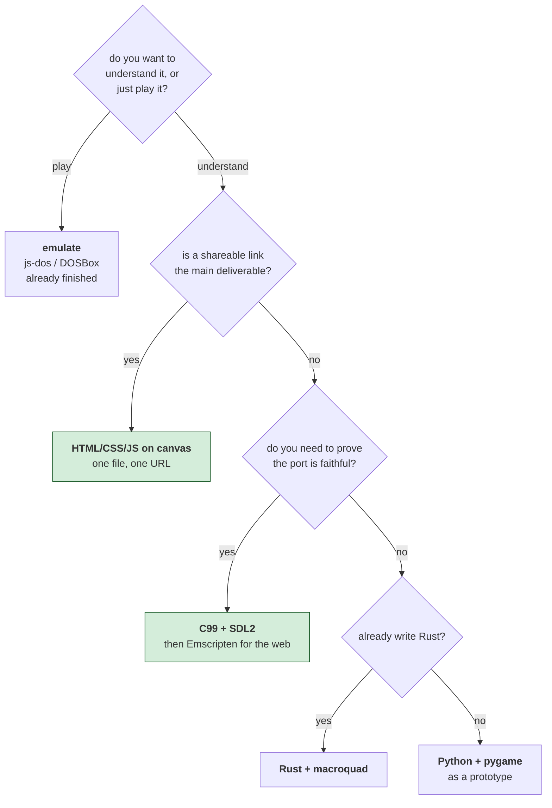

# ParaTrooper — porting it

*Document four of six. See [01-the-game.md](01-the-game.md),
[02-architecture.md](02-architecture.md) and [03-the-code.md](03-the-code.md) for
the 1982 program; [05-web-architecture.md](05-web-architecture.md) and
[06-web-code.md](06-web-code.md) describe the port this page argued for.*

A port is a rewrite informed by the disassembly, not a translation of it. This
page is about choosing the target — but the language is not the first decision,
and pretending otherwise wastes the most time.

## Read this before choosing a language

### The good news: this program is unusually portable

Three properties, all confirmed in [02-architecture.md](02-architecture.md),
remove most of what normally makes 1980s games painful to port:

- **No interrupt handlers.** Nothing is reentrant, no state is shared between a
  handler and a main loop, there is no critical section to reason about. It is
  a single-threaded loop over globals. Most period games are not this kind.
- **Timing comes from the 18.2 Hz BIOS tick**, not a counted delay loop. The
  game logic is *already* decoupled from CPU speed, so a fixed-timestep loop in
  any language reproduces the original's pacing rather than approximating it.
- **It is small and flat.** 19 subroutines, 38 call sites, 47 globals, 5 KB of
  code. One person can hold all of it.

### The bad news: the blocker is not the language

**The sprite format is not decoded.** The digit font is understood — 8×8, two
bytes per row — because the scoring routine could be followed to it. The
helicopter, jet, paratrooper and gun shapes have not been traced back to the
routines that draw them, and *nothing can be drawn on screen until they are*.

That work is identical in every language on this page. Do it first, in whatever
you already read fastest, before committing to a target.



Step 2 is the checkpoint worth insisting on. If the sprites render as
recognisable shapes, the format is right; if they render as noise, no amount of
porting effort will help, and you find out in an afternoon rather than a month.

### Separate the two halves on day one

Whatever the language, the shape of the port is the same, and it is worth
enforcing from the first commit:



The platform layer is genuinely tiny here — a 320×200 indexed framebuffer, a
handful of key states, and **one** square-wave voice. That is why the choice of
language matters less than it usually would, and why moving between the options
below later is cheap if you keep the split.

---

## The options

### 1. HTML / CSS / JavaScript, on a `<canvas>`

**The best choice if the point is to learn from it and show it to people.**

The web platform happens to fit this particular program well. `ImageData` is a
flat byte array you write pixels into, which is what the original does to
`B800:0000`; the only difference is that you expand 2 bits to RGBA instead of
letting the CGA hardware do it. Web Audio's `OscillatorNode` with
`type: 'square'` is, near enough, what timer channel 2 produces.

**Pros**

- **Zero install, runs anywhere, one URL to share.** For a 40-year-old game
  people want to *look* at, this matters more than any technical argument.
- Canvas maps almost directly onto the original's model. Scaling 320×200 up to
  a modern display is one line (`imageSmoothingEnabled = false`).
- `requestAnimationFrame` plus a time accumulator reproduces the 18.2 Hz tick
  exactly — you step the logic on a fixed timestep and let the browser present
  whenever it likes.
- Performance is a non-issue. This game moved perhaps a few dozen objects on an
  8088 at 4.77 MHz.
- Best debugging story of anything here: DevTools, live editing, no build step
  if you do not want one.
- Trivially archivable — a single HTML file that will still open in twenty
  years.

**Cons**

- **`|0` and `& 0xFFFF` everywhere, or the RNG is silently wrong.** JavaScript
  numbers are doubles. `seed * 30593 + 25801` exceeds 2⁵³ after a couple of
  iterations and starts losing precision, so the sequence diverges from the
  original's without ever throwing an error. Use `Math.imul` and mask, or
  `Uint16Array`.
- Audio cannot start until the user interacts with the page. You need a "click
  to play" gate, which the original obviously has no equivalent of.
- Keyboard semantics differ from the BIOS. The original polls `int 16h` for a
  *buffered* keystroke; browsers give you key-down/key-up events. For a game
  whose gun "starts moving" on one key and "stops and fires" on another, that
  difference is felt, and reproducing the original's feel takes deliberate work.
- No path to a byte-level correctness check. You are comparing behaviour by eye.

**Reach for it when:** the goal is a playable, shareable artifact and a
readable codebase — which, given that this whole exercise exists for learning,
is a perfectly good goal.

---

### 2. C99 + SDL2 (or raylib)

**The best structural match to the original, and the most verifiable.**

The assembly is 47 globals and tight loops over byte arrays. C is that, with
names. A port can be close enough to the disassembly that you can read them
side by side — which is exactly what you want while you are still discovering
what routines do.

**Pros**

- **Closest 1:1 correspondence.** `uint8_t screen[320*200]`, a `struct` per
  object type, globals where the original had globals. Nothing fights you.
- Integer widths are explicit. `uint16_t seed` gives you the LCG's wraparound
  for free, with no masking discipline to remember.
- **You can still have the web.** Emscripten compiles SDL2 to WASM, so this is
  not a choice *against* option 1 — it is a longer route that ends up there too,
  plus native builds.
- Easiest to write a headless harness: build the logic without SDL, run it for
  N ticks with a fixed seed, dump state, and diff against a trace pulled out of
  an emulator. That is a real correctness check, not a vibe.
- raylib instead of SDL2 if you want less ceremony — one dependency, simpler
  API, still cross-platform.

**Cons**

- A build toolchain and a dependency, on every platform you care about.
- Distribution friction: people run a web page; they do not download and trust a
  binary from a stranger.
- More code before anything appears on screen — window, event pump, texture
  upload, audio callback.
- All of C's usual hazards, on code that is doing raw array indexing by design.

**Reach for it when:** you want the port to be *demonstrably* faithful, or you
expect to keep working on it for a long time, or you want native and web from
one codebase.

---

### 3. Rust + macroquad (or `pixels` + `winit`)

**The best choice for a long-lived preservation project; the worst fit for the
original's structure.**

**Pros**

- Compiles to WASM cleanly, so it also reaches the browser.
- `wrapping_mul` / `u16` make the integer semantics explicit and checked — the
  LCG problem simply cannot happen.
- The port will still build in ten years, which is not obviously true of an
  SDL2 + autotools project.
- macroquad is genuinely low-ceremony: a window and a framebuffer in a few
  lines, and it targets web and native from the same source.

**Cons**

- **The borrow checker and 47 mutable globals are natural enemies.** You will
  restructure everything into a `struct Game` with `&mut self` methods on day
  one. That is better code — and it puts distance between your port and the
  disassembly at exactly the moment you most need to compare them.
- Steepest learning curve here if it is not already familiar, and the thing you
  are learning is Rust, not the game.
- Slower to iterate while you are still guessing at what routines do.

**Reach for it when:** you already write Rust, or the port matters more than
the archaeology.

---

### 4. Python + pygame

**The best choice for figuring out what the game actually does.**

**Pros**

- Fastest possible iteration while you are still reverse-engineering. Decode a
  sprite, look at it, adjust, look again — in seconds, in a REPL.
- Excellent as a *tool* even if it is not the final port: a script that reads
  the original `.COM`, decodes candidate sprites and dumps PNGs is fifty lines
  and is exactly what step 2 above asks for.
- Reads almost like pseudocode, which suits a document-and-explain project.

**Cons**

- Same silent-integer risk as JavaScript, for the opposite reason — Python
  integers are arbitrary precision, so the LCG never wraps unless you mask it.
  `& 0xFFFF` or it is not the same generator.
- Distribution is the weakest of anything here.
- Per-pixel work in pure Python is slow enough to matter if you write the
  framebuffer naively; you end up in NumPy or `pygame.surfarray`, which is fine
  but is no longer simple.

**Reach for it when:** you are still in the discovery phase. Consider it a
prototype rather than a destination.

---

### 5. Do not port it — run the original

Worth stating, because it is the only option that is already finished and is
the only one that is *provably* faithful.

`recovered/paratrooper.asm` reassembles to the original bit for bit. Point js-dos,
PCjs or DOSBox at the `.COM` and you have the real game in a browser today,
with no reimplementation risk at all.

**Pros**

- Perfect fidelity, by construction. Every bug, every quirk, the exact feel.
- Zero work. It is done.
- The reconstruction stays useful as documentation regardless.

**Cons**

- You learn nothing further about how it works. The whole value of a port is
  that you must understand something before you can rewrite it.
- You cannot change anything — no widescreen, no new levels, no netplay.
- An emulator is a heavier dependency than the game.

**Reach for it when:** you want to *play* it, or you want a reference to check
a port against. It pairs with any option above rather than competing with them.

---

## Side by side

| | HTML/JS | C99 + SDL2 | Rust | Python | emulate |
|---|---|---|---|---|---|
| Effort to first pixel | **lowest** | medium | medium | low | none |
| Structural match to the asm | fair | **best** | poor | good | n/a |
| Shareability | **one URL** | poor | good (WASM) | poor | good |
| Verifiability against the original | weak | **strongest** | strong | fair | **exact** |
| Integer-width hazard | high | **none** | **none** | high | n/a |
| Also reaches the web | native | via Emscripten | via WASM | no | yes |
| Good while still reverse-engineering | good | fair | poor | **best** | n/a |



## Recommendation

**If this is a learning and sharing project — which is what this whole
repository exists for — go straight to HTML/CSS/JavaScript on a canvas.** The
platform layer this game needs is a framebuffer, a few key states and one
square wave, and the web gives you all three with no build step and no install.
Being able to send someone a link is worth more here than any structural
argument.

**If you want the port to be demonstrably correct, write it in C99 and compile
it to WASM with Emscripten.** You get the browser anyway, you get native
builds, you get explicit integer widths, and you get the one thing JavaScript
cannot offer: a headless harness that runs the logic for a fixed number of
ticks from a fixed seed and diffs the result against a trace from the real
thing.

Either way, **do the sprite decoding first and in Python**, whatever you ship
in. It is the actual blocker, it is language-independent, and it is the part
that tells you whether the rest is worth starting.

## The port that exists

`../web/` is the HTML/CSS/JavaScript option, built. Open `index.html` — no
build step, no server, no dependencies.

What is the original's: the 18.2 Hz logic clock, the LCG with its 1982
constants, the scoring (10 / 5 / 30, and −1 per shot), the four-per-side rule
and the fatal centre zone, and the title melody — read as timer divisors
straight out of the binary and played back through a square wave, because that
is what a PC speaker is.

Three things end a game:

| | |
|---|---|
| **Four paratroopers on one side** | they run in, climb on each other and reach over the sandbags — about 3.6 seconds, and not interruptible. The loss happened when the fourth man touched the ground; the sequence only shows why. |
| **One landing on the gun base** | fatal at once, no counter involved |
| **A bomb striking the emplacement** | it is a physical object, so this happens at whatever height contact occurs — a bomb falling squarely onto the gun ends the game before it lands |

A bomb that reaches open ground is only an explosion. It *will* kill a
paratrooper standing there, and that man stops counting against you — so the
enemy's own bombs can clear the ground they were trying to take. That is an
addition, not something the original is known to do.

What is not: **all of the artwork.** The original sprite format is still
undecoded, so nothing could be reproduced even in principle. Every shape is
drawn with canvas paths — which is why the porting order at the top of this
page puts sprite decoding first and everything else second.

Logic runs at exactly 18.2 Hz and rendering interpolates between ticks at
whatever rate the display offers, so the simulation is the 1982 one and the
motion is smooth. `selfTest()` in the browser console checks the generator
against the original sequence, checks the distribution of `rndInt`, and plays
ten unattended games from fixed seeds to confirm they all end.

### Three bugs it produced, none of them visible on screen

**The generator's low bits are a counter.** The worst of the three, and the one
worth carrying to any project. `rnd() % 4` looked like an ordinary way to pick
"one time in four". It is not: in a power-of-two LCG, bit *k* repeats with
period 2^(k+1), and because both of this generator's constants are 1 (mod 4),
the bottom two bits literally count upward — `2, 3, 0, 1, 2, 3, 0, 1`, for
ever.

So `if (rndInt(4) === 0) spawnJet(); else spawnHeli()` locked to one phase and
spawned **only jets**. No helicopter ever appeared, no paratrooper ever jumped,
and the game ran for eleven waves with nothing happening. Four of eight test
seeds hung forever. Scaling the whole value instead of taking a modulus —
`Math.floor((rnd() / 65536) * n)` — fixed it, because the high bits are fine.

This is the original reason for the old rule *never take an LCG modulo a small
number*, and it arrived here as a game that would not start rather than as a
statistics failure. The generator passed its own test vector throughout.

**The seed could not be overridden.** `resetGame()` seeded from the clock, the
way the original did — which meant no game could be replayed and the stall
above could not be reproduced. Adding an optional seed argument turned a
Heisenbug into a two-line test. A game you cannot replay is a game you cannot
debug, and that is worth building in on day one rather than when you need it.

**Countdowns that ran off-screen.** Each helicopter counted down to its next
drop every tick, including while it was still outside the play area. Every
helicopter therefore arrived with its timer already expired and dropped its
first man the instant it crossed the boundary, stacking parachutes into a
column at one x coordinate. Only counting down while over the field fixed it.

All three were found by running the simulation and measuring, not by reading
the code or looking at the screen. The first two are invisible in a screenshot.

## Five things that will bite, in any language

1. **The LCG must wrap at 16 bits.** `seed = (seed × 30593 + 25801) mod 65536`.
   In C or Rust the type does it for you. In JavaScript and Python it does not,
   and the failure is silent — the game runs, the game looks fine, and the wave
   patterns are simply not the original's.

   Here is a test vector. From `seed = 1`, the first six values are:

   ```
   56394, 52243, 3932, 58917, 36974, 20023
   ```

   If your port does not produce exactly those, it is not this generator. In
   JavaScript, `seed = (Math.imul(seed, 30593) + 25801) & 0xFFFF`; in Python,
   `seed = (seed * 30593 + 25801) & 0xFFFF`. (The generator has full period —
   all 65,536 states — so a subtly wrong one will still look random. That is
   what makes this worth checking rather than assuming.)
2. **Never take this generator modulo a small number.** Its low bits are a
   counter, not random — see [above](#three-bugs-it-produced-none-of-them-visible-on-screen).
   Scale the value instead: `Math.floor((rnd() / 65536) * n)`. This costs a
   whole afternoon if you meet it the hard way, and it looks like a game logic
   bug rather than a random number bug the entire time.
3. **The screen is upside down.** The game's Y increases upward and is flipped
   at the moment of drawing (`di := 0x1FD8 - di`). Decide once whether your port
   keeps the game's convention or the screen's, and write it down, because
   mixing them produces sprites that are individually correct and collectively
   mirrored.
4. **CGA mode 4 is 2 bits per pixel with interleaved banks.** Even scanlines at
   offset 0, odd at 0x2000. Sprite data is in that format. Your port almost
   certainly wants one byte per pixel internally — convert when you decode the
   sprites, once, not on every blit.
5. **Get the palette right or it will look wrong in a way you cannot name.**
   The original sets it with `AH=0Bh` at the very start
   ([03-the-code.md](03-the-code.md#2-start-up-and-the-colour-check)).
   Mode 4's palettes are cyan/magenta/white or green/red/brown, and the wrong
   one is instantly recognisable to anyone who played it.
6. **Fixed timestep, always.** Step the logic at 18.2 Hz — 54.9 ms — and render
   whenever the platform lets you. Driving the logic from the frame rate makes
   the game speed up on a 144 Hz display, which is the exact bug the original
   avoided in 1982.

## How to know your port is right

The toolkit this reconstruction came from grades claims about equivalence on a
[verification ladder](https://github.com/agunawijaya/dos-decompiler#the-verification-ladder).
A port cannot reach the top rungs — it is different code — but it can do much
better than "looks right", which proves nothing:

| Rung | What it means for a port | Achievable? |
|---|---|---|
| 1 | byte-identical rebuild | no — that is the `.asm`, not a port |
| 2 | instruction-identical | no |
| 3 | **same state after N ticks from the same seed** | **yes, and this is the one to aim for** |
| 4 | pixel-identical frames against an emulator | yes, for the title screen at least |
| 5 | "looks right" | worth nothing |

Rung 3 is the practical target and it is not hard: run the original under an
emulator with a scripted input sequence, dump the object table at a known tick,
and compare against your port from the same seed. If the helicopters are in the
same places after 500 ticks, the port is right in the way that matters.
