# The port — architecture

*Document five of six. [01-the-game.md](01-the-game.md) is what ParaTrooper is;
[02](02-architecture.md) and [03](03-the-code.md) describe the 1982 assembly
program; [04](04-porting.md) is about choosing a target. This one and
[06-web-code.md](06-web-code.md) describe the browser port in `../web/`.*

The earlier documents took a finished program apart. This one goes the other
way: here is a program being *put together*, and why it is shaped the way it
is.

**It is written for someone learning to program.** Every concept is explained
from the beginning, and the parts that are genuinely hard are given room. You
do not need to have read the assembly documents, though the game will make more
sense if you have.

The ideas here are not specific to this game or to JavaScript. A game loop, a
state machine, two coordinate systems, edge-triggered input — you will meet all
of them again.

---

## What "architecture" means

Not the code. The **shape**: what pieces exist, what each is responsible for,
and how they are allowed to talk to each other.

You can write a working game without thinking about this. People do, and the
program works right up until they want to change something — and then every
change breaks two things somewhere else, because nothing had a boundary.

Architecture is the set of decisions you make *before* the details, so that the
details have somewhere to live.

---

## Three files, three jobs

The port is three files. That split is not arbitrary, and it is worth
understanding before anything else because it is how the whole web works.

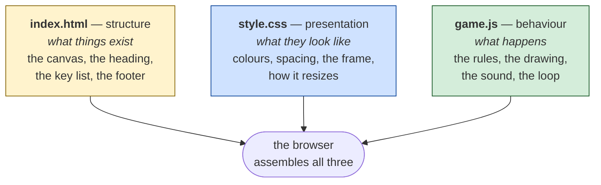

**HTML says what exists.** It is a list of things — a heading, a canvas, some
paragraphs. It says nothing about how they look or what they do.

**CSS says what those things look like.** Colours, sizes, spacing, what happens
on a narrow screen. It cannot make anything *happen*; it only describes
appearance.

**JavaScript says what happens.** It runs, it reacts, it changes things over
time.

### Why bother separating them?

You can put all three in one file. The browser does not care. The reason to
separate them is that **each answers a different question, and questions change
independently.**

Want to make the game darker? That is CSS only — you will not touch a line of
game logic, and you cannot possibly break the collision detection while doing
it. Want to change how bombs work? That is JavaScript only, and no amount of
messing it up can break the page layout.

That property — *this change can only affect this file* — is the single most
valuable thing an architecture can give you. It is what makes a program safe to
edit six months later.

**A caution against the opposite mistake.** Separation costs something too:
three files to open instead of one, and a reader has to hold the relationship
in their head. For something this small it is a close call, and a single
self-contained HTML file would have been perfectly defensible. It is separated
here because these files are also meant to be *read* as a lesson, and the split
makes the three jobs visible.

---

## The canvas

Almost everything you see is drawn on a `<canvas>`, which is worth
understanding precisely because beginners often expect it to work differently.

A canvas is **a rectangle of pixels you paint into.** That is all. It is not a
scene, it is not a list of objects, it has no memory of what you drew. You
issue drawing commands — "fill this circle", "stroke this line" — and pixels
change. If you want the helicopter to move, you must clear the area and draw it
again in the new place. The canvas has no idea a helicopter exists.

This is the opposite of how the rest of a web page works, where you create an
element and the browser keeps track of it for you.

### Two sizes, and this trips everyone up

A canvas has **two different sizes** and they are not the same thing:

```html
<canvas id="screen" width="960" height="600"></canvas>
```

```css
canvas { width: 100%; aspect-ratio: 960 / 600; }
```

The HTML attributes set the **internal** size: the canvas really is a grid of
960 × 600 pixels, and that is the coordinate system your drawing code uses.

The CSS sets the **displayed** size: how big that grid appears on screen. The
browser scales the internal grid up or down to fit, like enlarging a
photograph.

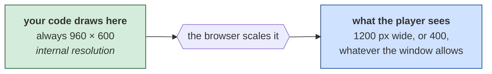

**Why this is a good arrangement.** The game logic never has to know how big
the window is. A helicopter at x = 480 is in the middle of the screen on a
phone and on a 4K monitor, and no code anywhere asks which. All the
responsiveness lives in one line of CSS.

The classic beginner bug is setting only the CSS size. Then the canvas stays at
its default 300 × 150 internally and gets stretched, and everything looks
blurry and squashed — for reasons that are invisible if you do not know these
are two separate numbers.

---

## The heartbeat: the game loop

This is the most important idea in the document. Take your time here.

A game is not a program that runs from top to bottom and stops. It is a program
that does the same thing over and over, very fast, forever:

> look at the input → move everything a little → draw it → repeat

Each pass round that circle is one **frame**. Do it 60 times a second and things
appear to move.

### The obvious approach, and why it is wrong

The obvious way is to do exactly that: every time the browser is ready to draw,
move everything one step and draw it.

It works. On your machine. Then someone opens it on a 144 Hz gaming monitor and
the game runs **two and a half times faster** — every helicopter, every falling
paratrooper, every bullet. The game is unplayable and nothing in the code is
obviously wrong.

This is not hypothetical. It is the single most common reason games from the
1980s are unplayable on later hardware, and the original ParaTrooper
deliberately avoided it by waiting on a hardware clock instead of counting
([02-architecture.md](02-architecture.md#timing)).

### Separating the two rates

The fix is to stop treating "move things" and "draw things" as the same event.
They are different jobs with different natural rates:

- **The simulation** should advance at a *fixed* rate — here 18.2 times a
  second, the rate the 1982 game ran at. Every step advances the world by the
  same amount, so the game plays identically everywhere.
- **The drawing** should happen as often as the display can show it — 60 times
  a second, 144, whatever the machine offers.

Those numbers do not divide evenly, and that is fine. Here is how they are
reconciled:

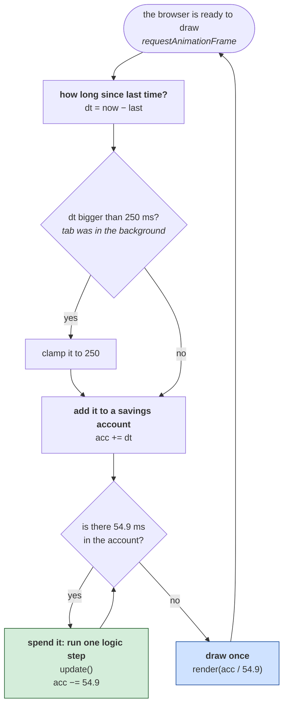

**The accumulator is the whole trick.** Think of `acc` as a savings account for
time. Every frame you deposit however long has passed. Whenever the balance
reaches the cost of one logic step — 54.9 milliseconds — you spend it and run
one step. Sometimes you can afford none that frame, sometimes two.

At 60 frames a second, roughly every third frame runs a logic step. At 144, one
in eight. **The simulation advances at 18.2 Hz either way**, which is exactly
what we wanted.

Two details in that diagram earn their place:

**The 250 ms clamp.** Browsers stop calling you when a tab is hidden. Come back
after five minutes and `dt` is 300,000 — you would deposit five minutes of time
and the loop would try to run 5,460 logic steps in one frame, freezing the page
while the game fast-forwards. Clamping means a backgrounded tab simply loses
that time, which is what a player expects.

**The `guard++ < 8`.** If the machine is so slow that a logic step takes longer
than 54.9 ms, each frame adds more time than it can spend, the balance grows
for ever, and the loop never exits — the page hangs. The guard says "at most
eight steps per frame, then draw regardless". The game runs in slow motion on a
hopeless machine, which is far better than not running.

That is called the *spiral of death*, and it is a real failure mode, not a
theoretical one.

### Interpolation: the last piece

There is a problem left. The simulation moves in 18.2 jumps a second. If you
simply draw wherever things currently are, you see 18 distinct positions a
second — visibly choppy by modern standards, however smooth it looked in 1982.

So each object remembers **where it was last step** as well as where it is now:

```js
h.px = h.x;      // previous
h.x += h.vx;     // current
```

And drawing asks for a position *between* the two:

```js
const x = lerp(h.px, h.x, t);
```

`t` is that leftover balance in the savings account, expressed as a fraction:
0 means a logic step just happened, 0.5 means we are halfway to the next one.

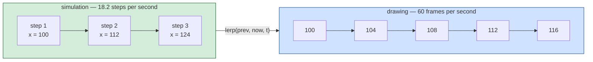

**The result: a 1982 simulation, rendered smoothly.** Nothing about the game's
behaviour changed — collisions, scoring and timing all still happen at 18.2 Hz,
on integer step boundaries. Only the picture is interpolated.

`lerp` is *linear interpolation*, and it is three lines you will use for the
rest of your life:

```js
const lerp = (a, b, t) => a + (b - a) * t;
```

At `t = 0` you get `a`. At `t = 1` you get `b`. At `0.5`, halfway. That is all
it is.

---

## States: the game is a machine with modes

At any moment the game is doing exactly one of five things, and what a keypress
means depends entirely on which:

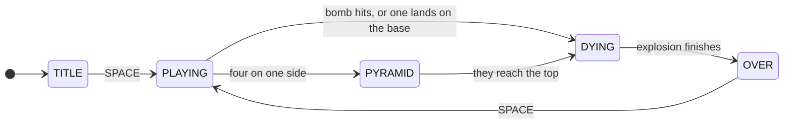

This is a **finite state machine**, and it is worth naming because the
alternative is so much worse.

Without it you end up with a scatter of booleans — `isPlaying`, `isDead`,
`showingTitle`, `exploding` — and then you have to reason about what happens
when two of them are true at once. They should be mutually exclusive but
nothing enforces it, so eventually a bug sets both and the program does
something incoherent.

One variable holding one of five values **cannot** be in two states. The
problem is designed out rather than defended against.

In the code it is one line at the top of the update function:

```js
if (game.state === State.PYRAMID) { updatePyramid(); return; }
if (game.state === State.DYING)   { /* count down, then OVER */ return; }
if (game.state !== State.PLAYING) { stepParticles(); return; }
// ... everything below here is the actual game
```

Each state gets its own code and nothing else runs. `PYRAMID` is a good example
of why this pays: while the paratroopers climb, no helicopters spawn, no bullets
move, nothing can be shot. Not because each of those checks "am I in the
pyramid sequence?" — but because their code is never reached.

---

## The data: plain objects in arrays

Every moving thing is an ordinary JavaScript object in an ordinary array:

```js
game.helis   = [];   // helicopters
game.jets    = [];
game.paras   = [];   // paratroopers
game.bullets = [];
game.bombs   = [];
game.parts   = [];   // explosion particles
```

A helicopter is just this:

```js
{ x, y, px, py, vx, dir, drops, dropAt, rotor, blink, alive }
```

Position, previous position, velocity, which way it faces, how many
paratroopers it still carries, when it drops the next one, the rotor angle, a
blink counter, and whether it is still alive.

**No classes, no inheritance, no `Helicopter extends Entity`.** That is a
deliberate choice and worth defending, because a textbook would tell you
otherwise.

The case for classes is shared behaviour: if helicopters, jets and bombs all
did the same things, a common base class would remove repetition. But they do
not. A helicopter drops paratroopers; a bomb falls and explodes; a particle
fades. They share almost nothing except having a position — and inheriting from
a base class to share two fields buys you less than it costs.

**The honest version of this advice:** at 5,000 lines with fifteen entity types
this decision would likely be wrong, and the repetition would start to hurt.
Pick the structure that fits the size of the problem you actually have, and be
willing to change it when the problem grows. "It scales badly at ten times the
size" is not an argument against something at this size.

### Killing things

Objects are never removed mid-loop. They are flagged, and swept afterwards:

```js
h.alive = false;                                  // during the loop
game.helis = game.helis.filter(h => h.alive);     // after it
```

This looks roundabout. It is protecting you from a real and confusing bug:
**removing an item from an array while looping over it skips the next item.**
The loop is at index 3, you delete index 3, everything shifts down, the loop
moves to index 4 — and what was index 4 is now index 3 and never gets looked
at. Enemies survive being shot, seemingly at random.

Flag-then-sweep sidesteps it entirely. The rule generalises: **do not modify a
collection while you are iterating it.**

---

## Two coordinate systems

The port keeps the original's convention, and understanding why is more useful
than the convention itself.

**The game thinks in world coordinates:** the ground is `y = 0` and up is
positive. Gravity is `vy -= 0.55`. "Has it landed?" is `y <= 8`. Both read the
way a person would say them.

**The canvas thinks in screen coordinates:** `y = 0` is the *top*, and y
increases downward.

One function bridges them:

```js
const sy = y => GROUND_Y - y;
```

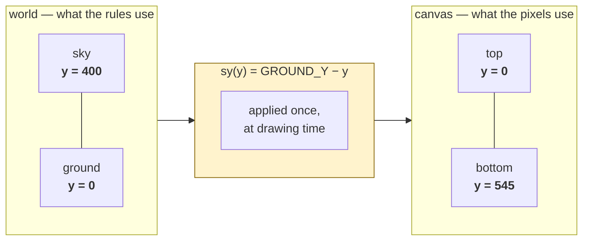

**The transferable lesson is not "flip your y axis".** It is: *when two parts of
a system disagree about something, convert at the boundary, once, in a named
place.* The alternative — sprinkling `GROUND_Y -` through fifty drawing calls —
works right up until you forget one, and then a single sprite is mirrored and
you have no idea why.

The same principle covers dates in UTC versus local time, prices in cents
versus dollars, angles in degrees versus radians. Same shape of problem, same
answer: one conversion, at the edge, with a name.

---

## Drawing: order is everything

A canvas has no notion of depth. Whatever you draw last covers what was drawn
before, like laying down paint. This is called the **painter's algorithm**, and
it means the *order of your drawing calls is your z-ordering*.

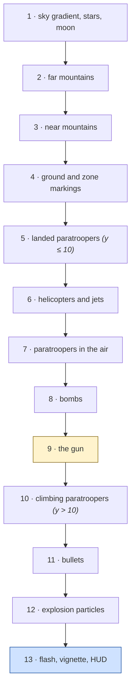

Read that list as *back to front*. The sky is painted first because everything
is in front of it; the HUD last because it is in front of everything.

Look at layers 5, 9 and 10 — the paratroopers are split around the gun:

```js
for (const p of game.paras) if (onGround(p) && p.y <= 10) drawLanded(p, t);
// ... helicopters, jets, falling troopers, bombs ...
drawGun(...);
for (const p of game.paras) if (onGround(p) && p.y > 10) drawLanded(p, t);
```

Troopers standing on the ground are drawn *before* the gun, so the sandbags
hide their feet. Troopers who have climbed above ground level are drawn
*after*, so they appear on top of the emplacement — which is the whole point of
the climb. One condition, `p.y > 10`, buys the entire illusion.

**The general lesson:** when you cannot get something to look right, the
question is often not "how do I draw this?" but "in what order am I drawing
these?"

---

## Input: two ways to read a key, and you need both

This distinction catches almost everyone once.

**"Is the key down right now?"** — level-triggered. Right for continuous
actions. Holding the arrow key should rotate the gun continuously:

```js
if (Keys['ArrowLeft']) game.gunAngle -= 0.085;
```

**"Was the key just pressed?"** — edge-triggered. Right for one-off actions.
Pressing `C` should toggle the control scheme *once*, not sixty times a second
while you hold it:

```js
if (takePress('KeyC')) game.classicControls = !game.classicControls;
```

Two records are kept:

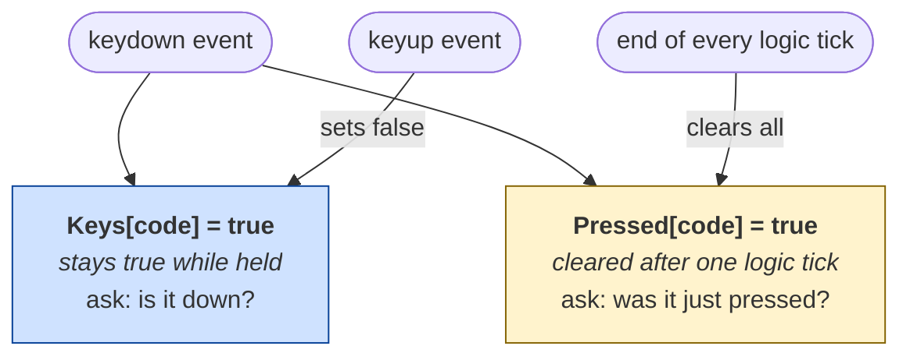

`Pressed` is cleared at the end of **every** tick, whether anything read it or
not:

```js
for (const k in Pressed) Pressed[k] = false;
```

That line looks like tidying up. It is load-bearing. Without it, a press nobody
consumed stays pending for ever and fires later in some state that never asked
for it — press `C` on the title screen, and the gun fires the moment the game
starts, because the pending flag was finally read by different code.

Bugs of that shape are miserable to find: the symptom appears far from the
cause, in time and in code.

---

## Sound

The PC of 1981 had a timer chip wired to a small speaker: one square wave, one
note, no volume ([02-architecture.md](02-architecture.md#sound)). The port
reproduces that rather than improving on it, because the square wave *is* the
sound of the era.

Web Audio works by connecting small nodes into a chain:

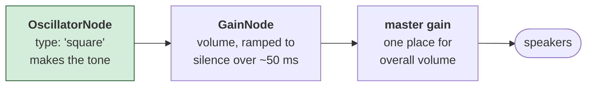

Every sound effect creates a fresh oscillator, plays it, and lets it be
discarded. That sounds wasteful and is not — the browser is built for it, and
the alternative (reusing one oscillator) means the sounds interrupt each other.

The gain ramp is what makes it a *sound* rather than a *click*. A tone that
stops abruptly produces an audible pop, because the waveform jumps to zero
mid-cycle. Fading over a few tens of milliseconds removes it.

**Browsers will not let a page make noise until the user has interacted with
it.** That is a deliberate rule, and it is why the port has a bar along the
bottom of the screen asking for a click. There is no way around it and you
should not look for one — it exists because auto-playing audio was genuinely
awful.

---

## Determinism, and why it matters more than it sounds

The random number generator is the original's, and it can be **seeded**:

```js
resetGame(4099);   // this exact game, every time
resetGame();       // seed from the clock, like the original did
```

Given the same seed and the same inputs, the game plays out identically. Every
time, on every machine.

This sounds like a curiosity. It is the difference between a bug you can fix
and a bug you cannot.

While this port was being written, games would occasionally run for eleven
waves with nothing happening. Unreproducible, because the seed came from the
clock — every attempt to investigate produced a different game. Adding the seed
argument turned it into two lines that failed identically every time, and the
cause took minutes instead of hours.

That is what `selfTest()` is built on. It plays ten complete games from ten
fixed seeds and checks they all end:

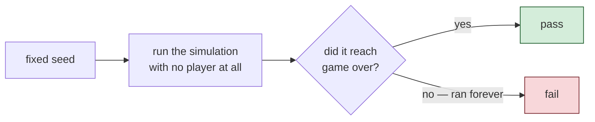

No graphics, no waiting, no clicking. Ten full games in a few milliseconds,
because the logic does not need the screen to run.

**Build this in on day one.** Not when you need it — by the time you need it,
adding it means changing code you are already confused about.

---

## What is deliberately not here

Worth stating, because a beginner reading modern tutorials might expect all of
it:

**No framework.** No React, no Vue, no game engine. The whole platform layer
this game needs is a rectangle of pixels, a few key states and one square wave.
A framework would be more to learn than the game.

**No build step.** No npm, no bundler, no transpiler. Edit `game.js`, refresh
the page, see the change. Nothing between you and the thing you are editing —
which for learning is worth a great deal.

**No dependencies.** Nothing to install, nothing to keep up to date, nothing
that stops working in three years when a package is abandoned. The file will
open in a browser in 2040.

**None of this is an argument against those tools.** They exist because real
problems need them, and on a large application with a team they are the right
call. It is an argument for *matching the tooling to the problem*. A 1,400-line
game does not need a build pipeline, and choosing one anyway means spending
your first day configuring instead of programming.

---

## The whole thing, in one picture

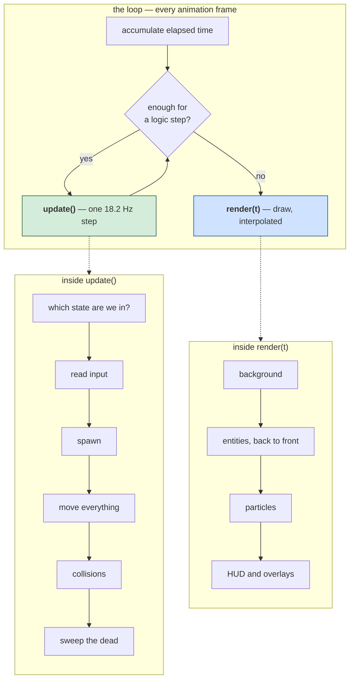

**The shape to remember: update and render are separate, and they run at
different rates.** Almost everything else in this document follows from that
one decision.

Next: [06-web-code.md](06-web-code.md) walks through the code itself.
