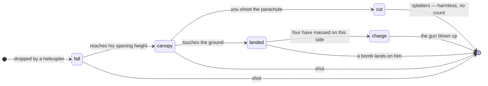
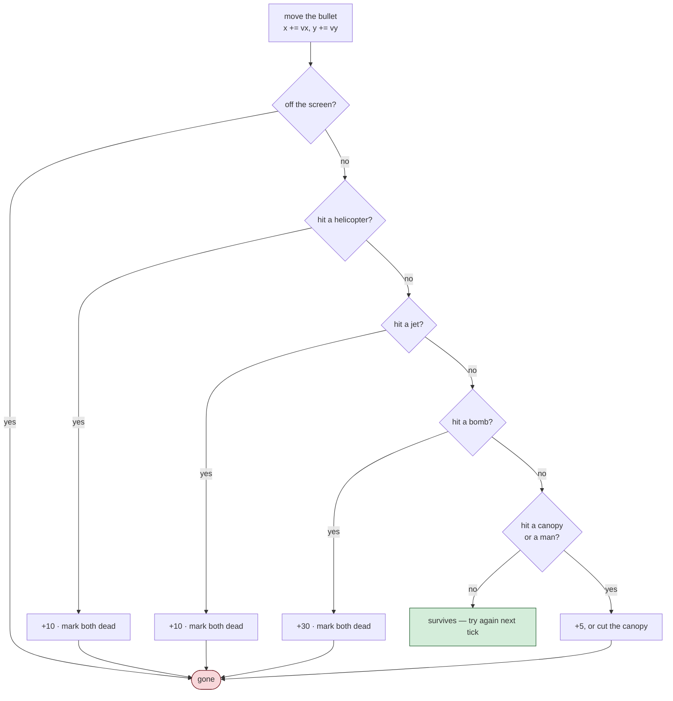
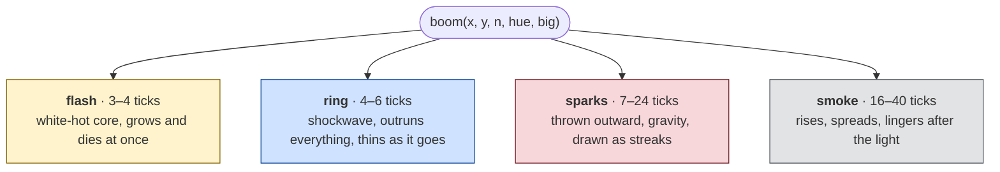
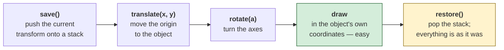

# The port — the code

*Document six of six. [05-web-architecture.md](05-web-architecture.md) describes
the shape of this program; this one goes through the code that fills it in. If
you have not read document five, read it first — most of what follows assumes
the game loop and the state machine.*

Everything here is copied from `../web/game.js`, unchanged except for trimming
and added comments. It is about 1,400 lines, and this walks the parts worth
understanding.

**Written for someone learning to program.** Each section explains what the code
does, then why it is written that way, then what to take from it. The last part
is the point — nearly everything here is a pattern you will use again in
programs that have nothing to do with helicopters.

---

## 1. The random number generator

Six lines, and three separate lessons.

```js
let seed = 1;
function rnd() {
  seed = (Math.imul(seed, 30593) + 25801) & 0xFFFF;
  return seed;
}
```

### What it does

Take a number, multiply it by 30,593, add 25,801, keep the bottom 16 bits, and
give it back. Next time, do the same to the result.

That is a **linear congruential generator** — the standard way to make random
numbers for decades, and still what many languages use underneath. The constants
here are the 1982 game's, copied out of the disassembly.

Nothing about it is random, of course. It is a fixed sequence that *looks*
random. Start it at the same place and you get the same sequence, which is
exactly the property [document five](05-web-architecture.md#determinism-and-why-it-matters-more-than-it-sounds)
depends on for testing.

### Lesson one: `Math.imul`, or the sequence is silently wrong

JavaScript has one number type, and it is a 64-bit float. That is usually
convenient and here it is a trap.

`seed * 30593` where seed can be 65,535 gives about two billion — fine. But
floats only hold about 15 significant digits exactly, and multiplication
compounds. Write the loop with plain `*` and within a few iterations you are
losing precision at the bottom.

The result is not a crash. It is not even an obviously wrong number. It is a
**different sequence** that still looks perfectly random, so the game runs, the
helicopters appear in plausible places, and nothing tells you the generator is
not the one you thought.

`Math.imul(a, b)` does a genuine 32-bit integer multiply and returns a 32-bit
integer. `& 0xFFFF` then keeps the low 16 bits, which is the `mod 65536` the
original got for free by ignoring the high half of its result.

**Take from this:** in a language with one number type, integer arithmetic is
something you have to *ask for*. And the failure mode is silence.

### Lesson two: test it against a known answer

```js
seed = 1;
[rnd(), rnd(), rnd(), rnd(), rnd(), rnd()]
// must be 56394, 52243, 3932, 58917, 36974, 20023
```

Six numbers. If your generator produces those, it is the 1982 generator. If it
produces anything else, it is not — and you find out in a millisecond instead of
wondering for a week why the game feels different.

This is worth generalising. **When you port or reimplement something, find a
small input whose correct output you can state exactly, and check it.** Not "it
looks about right" — an exact value.

### Lesson three: never take it modulo a small number

This one cost an afternoon, and it is the best lesson in the file.

I needed "one time in four", so I wrote the obvious thing:

```js
function rndInt(n) { return rnd() % n; }        // WRONG
```

The low bits of a power-of-two LCG are barely random. Bit *k* repeats with
period 2^(k+1) — bit 0 alternates every call, bit 1 every two calls, and so on.
This generator is worse than most, because both constants are 1 (mod 4), which
makes the bottom two bits **count**:

```
seed & 3  →  2, 3, 0, 1, 2, 3, 0, 1, 2, 3, 0, 1 ...
```

Not "somewhat correlated". A counter.

So `if (rndInt(4) === 0) spawnJet(); else spawnHeli();` locked to one phase of
that cycle and spawned **only jets, for ever**. No helicopter appeared, so no
paratrooper jumped, so nothing could land, so the game ran for eleven waves with
nothing happening. Four of eight test seeds hung indefinitely.

The fix is to use the *high* bits, by scaling rather than dividing:

```js
function rndInt(n) { return Math.floor((rnd() / 65536) * n); }
```

**Take from this:** the old advice *never take an LCG modulo a small number* is
not folklore. And notice how it presented — as a game that would not start.
Nothing pointed at the random number generator, which was passing its own test
vector the whole time. When something impossible is happening, suspect your
sources of randomness early.

---

## 2. The loop

The heart of the program, and only twenty lines.

```js
let acc = 0, last = performance.now();

function frame(now) {
  let dt = now - last;
  last = now;
  if (dt > 250) dt = 250;
  acc += dt;

  let guard = 0;
  while (acc >= TICK_MS && guard++ < 8) {
    handleMeta();
    update();
    for (const k in Pressed) Pressed[k] = false;
    acc -= TICK_MS;
  }
  render(clamp(acc / TICK_MS, 0, 1));
  requestAnimationFrame(frame);
}
```

Line by line:

**`requestAnimationFrame(frame)`** at the bottom asks the browser to call
`frame` again next time it draws. It is how you make a loop that does not block
the page — the function ends, the browser gets on with other work, and calls
you back. `now` is the timestamp the browser hands in.

**`dt = now - last`** is how long since the previous frame. About 16.7 ms on a
60 Hz display, about 6.9 on a 144 Hz one. You do not choose this and cannot
rely on it.

**`if (dt > 250) dt = 250`** guards against a hidden tab. Browsers stop calling
you when a tab is in the background; return after five minutes and `dt` is
300,000. Without the clamp the loop tries to run 5,460 logic steps in one frame
and the page locks up while the game fast-forwards.

**`acc += dt`** is the savings account from
[document five](05-web-architecture.md#separating-the-two-rates).

**`while (acc >= TICK_MS && guard++ < 8)`** spends the account. Zero, one or two
steps per frame; over time it averages exactly 18.2 per second. The guard caps
it at eight so a machine too slow to keep up runs in slow motion instead of
freezing.

**`render(clamp(acc / TICK_MS, 0, 1))`** draws once, passing the leftover time
as a fraction so the drawing can interpolate.

**Take from this:** `while (acc >= step)` — spend a budget in fixed units, keep
the remainder — is a pattern far beyond games. Animation, rate limiting, batch
processing, billing.

---

## 3. Interpolation, and why every object has `px`

```js
h.px = h.x;      // remember where I was
h.x += h.vx;     // then move
```

and at drawing time:

```js
const x = lerp(h.px, h.x, t);
const lerp = (a, b, t) => a + (b - a) * t;
```

The simulation only knows 18.2 positions a second. Drawing 60 times a second
from those alone gives you the same picture three or four times in a row, then
a jump — visibly choppy.

Keeping the previous position lets the renderer ask for a point *between* two
simulation steps. The object appears to slide smoothly from one to the next,
while the simulation itself never left its fixed grid.

**A subtlety worth noticing:** interpolation means the picture is always
slightly *behind* the simulation — you are drawing between the last two states,
not predicting the next. That is deliberate. Predicting forward means being
wrong whenever something changes direction, and a bullet that visibly overshoots
a helicopter before snapping back looks far worse than one frame of lag.

**Take from this:** `lerp` is three characters of arithmetic and you will use it
constantly — fades, camera movement, colour blending, easing. Learn it now.

---

## 4. The life of an entity

Take a paratrooper from birth to death. This is the whole pattern of the game in
one object.

He is never simply "alive" or "dead". He is always in exactly one of five
states, and the state decides what happens to him each tick:



Read the two paths out of `canopy`. Shoot the *man* and he is gone. Shoot the
*canopy* and he enters `cut` — still falling, now lethal to anyone below him.
That single extra state is where the game's best tactic lives.

### Born

```js
function dropPara(x, y) {
  game.paras.push({
    x, y, px: x, py: y, vy: 0,
    state: 'fall',
    openAt: rndRange(200, 300),
    sway: rndF() * TAU, swayV: rndRange(0.06, 0.13),
    side: 0, alive: true
  });
}
```

Note `{ x, y, ... }` — JavaScript shorthand for `{ x: x, y: y }`.

Note also that `openAt` and `swayV` are random *per trooper*. Every one opens
his canopy at a different height and sways at his own rate. Small per-instance
variation is most of what makes a crowd of identical objects look alive, and it
costs two lines.

### Falling

```js
if (p.state === 'fall') {
  p.vy -= 0.42;                 // gravity: world y counts upward
  p.y += p.vy;
  if (p.y <= p.openAt) { p.state = 'canopy'; p.vy = -1.15; }
}
```

That is **Euler integration**, and it is how essentially every game does
physics: each step, add acceleration to velocity, then add velocity to position.
Not exact — a real parabola is a curve and this is a sequence of straight
segments — but at 18.2 steps a second nobody can tell.

When he reaches his opening height the state changes and the velocity becomes
constant: a canopy does not accelerate, it descends steadily.

### Under canopy

```js
} else if (p.state === 'canopy') {
  p.vy = -1.15;
  p.y += p.vy;
  p.sway += p.swayV;
  p.x += Math.sin(p.sway) * 0.5;
}
```

`Math.sin` of a steadily increasing number gives a value oscillating smoothly
between −1 and 1. Multiply by 0.5 and add it to `x` each step and he drifts
gently side to side.

**This is the single most useful trick in game feel.** A steadily advancing
angle through `sin` gives you smooth oscillation, and you can drive anything
with it: bobbing, breathing, hovering, flickering, pulsing. Change the
multiplier for size, the increment for speed, add a random starting offset so
things are not synchronised.

### Shot — and the interesting case

```js
if (p.state === 'canopy' &&
    Math.abs(b.x - p.x) < 26 && Math.abs(b.y - (p.y + 32)) < 12) {
  p.state = 'cut';
  ...
}
```

The canopy is a *separate target* from the man: wider (26 versus 13) and 32
units above him. Hitting it does not kill him — it changes his state:

```js
} else if (p.state === 'cut') {
  p.vy -= 0.62;                  // falls fast now
  p.y += p.vy;
  for (const q of game.paras) {
    if (q === p || !q.alive || q.state === 'landed') continue;
    if (Math.abs(q.x - p.x) < 18 && q.y < p.y && p.y - q.y < 26) {
      q.alive = false;           // he kills whoever he lands on
      addScore(SCORE_PARA);
    }
  }
}
```

A falling body is now itself a weapon. One bullet can kill three men.

**Notice what makes that possible in the code:** the state variable. Without it
a paratrooper would have to be either alive or dead, and "falling, dangerous to
his own side" would have nowhere to live. Adding a *state* rather than a
*boolean* is what let the interesting behaviour exist at all.

### Landing

```js
if (p.state !== 'landed' && p.y <= 8) {
  p.y = 8;
  if (p.state === 'cut') { p.alive = false; continue; }   // splattered
  p.state = 'landed';
  if (Math.abs(p.x - GUN_X) < GUN_BASE_HALF) { die('base'); return; }
  if (p.x < GUN_X) { p.side = -1; game.left++; }
  else             { p.side = 1;  game.right++; }
  if (game.left  >= LOSE_PER_SIDE) { startPyramid(-1); return; }
  if (game.right >= LOSE_PER_SIDE) { startPyramid(1);  return; }
}
```

`p.y = 8` first — clamping to the ground rather than leaving him slightly
below it. Small, and the kind of thing that causes a one-pixel judder if you
skip it.

Then the three zones from the original: land on the base and it is over
immediately; otherwise increment a side and check for four.

---

## 5. Collision detection

```js
if (Math.abs(b.x - h.x) < 34 && Math.abs(b.y - h.y) < 17) { /* hit */ }
```

That is the whole thing. Two subtractions, two comparisons.

It is an **axis-aligned bounding box** test: pretend both objects are rectangles
lined up with the axes, and check whether they overlap horizontally *and*
vertically. The helicopter is treated as 68 wide and 34 tall regardless of what
was actually drawn.

### Why not something more accurate?

You could test the real outline. It would cost a great deal more and play
*worse*. Players do not perceive a near miss on a rotor blade as a miss; they
perceive it as the game cheating. A slightly generous rectangle feels fair.

**"Accurate" and "good" are not the same goal**, and in games they conflict more
often than beginners expect.

### Why the bounds are asymmetric

`34` horizontally, `17` vertically — the helicopter is wide and flat, and the
box matches its silhouette. A single radius would either miss the tail or eat
bullets passing above it.

### The `if (b.dead) continue` after each group

```js
for (const h of game.helis) { ... }
if (b.dead) continue;
for (const j of game.jets)  { ... }
if (b.dead) continue;
```

Once a bullet has hit something it must stop existing. Without these checks it
would continue through the jet loop and the bomb loop and could score three
kills from one shot.



Every branch that scores leads straight to *gone*. That is what the
`if (b.dead) continue` lines buy: there is no path through the diagram that
reaches two scoring boxes.

**Take from this:** whenever an object can be consumed mid-loop, ask what
happens to the rest of the loop. This class of bug — one thing being spent
twice — appears everywhere from inventory systems to payment processing.

### The order is a design decision

Helicopters, then jets, then bombs, then paratroopers. If a bullet overlaps two
things at once, the earlier one wins. Nothing forces that order and it is
essentially arbitrary here — but be aware you *made* the choice, because on a
busier game it is felt.

---

## 6. Particles

An explosion is not one thing. It is four, and leaving any of them out is what
makes a burst of dots look like a burst of dots.



The lifetimes are the point. The flash is gone in a fifth of a second, the
sparks last a second, the smoke drifts for two. **Staggered lifetimes are what
make an explosion feel like an event rather than a shape.**

All four are the same kind of object in one array, told apart by a `kind` field:

```js
for (const p of game.parts) {
  p.age++;
  if (p.kind === 'spark') {
    p.x += p.vx; p.y += p.vy;
    p.vy += 0.34;            // falls
    p.vx *= 0.96;            // air resistance
  } else if (p.kind === 'smoke') {
    p.x += p.vx; p.y += p.vy;
    p.vy -= 0.05;            // rises
    p.vx *= 0.94;
  }
}
game.parts = game.parts.filter(p => p.age < p.life);
```

Two details that do a lot of work:

**`p.vx *= 0.96`** is drag. Multiplying velocity by slightly less than one each
step makes things slow down smoothly. It is not real physics and it does not
need to be — it is one character of code and it looks right.

**Sparks fall, smoke rises.** One sign difference, and it is most of what
distinguishes debris from smoke to the eye.

### Fading by age

```js
const u = p.age / p.life;   // 0 at birth, 1 at death
const k = 1 - u;            // 1 at birth, 0 at death
ctx.fillStyle = `hsla(${p.hue},100%,${52 + k * 38}%,${k})`;
```

`k` drives everything at once: transparency, brightness, size. As the particle
ages it becomes dimmer, darker and smaller together, which reads as cooling.

**HSL is the right colour space here.** `hsl(30, 100%, 50%)` is "orange, fully
saturated, medium brightness" — and to make it dimmer you change one number. In
RGB you would have to change three, in the right proportions. When a colour
needs to *vary*, HSL is almost always easier to think in.

---

## 7. Drawing with canvas transforms

This is the concept that unlocks 2D graphics, and it is worth real attention.

Here is the problem. The gun barrel must be drawn rotated to whatever angle the
player has aimed. You could work out where each corner of a rotated rectangle
lands — that is four points, each needing a sine and a cosine, and it is
miserable to write and worse to read.

The canvas offers something better: **move the paper instead of the pen.**

```js
ctx.save();                    // remember the current arrangement
ctx.translate(bx, by - 32);    // put the origin at the barrel's pivot
ctx.rotate(a);                 // turn the whole coordinate system
ctx.fillRect(-5, -BARREL_LEN, 10, BARREL_LEN);   // draw straight up
ctx.restore();                 // put everything back
```

Inside those calls you draw the barrel as if it points straight up from the
origin, because from the coordinate system's point of view it does. Every
`fillRect`, every `arc`, every `moveTo` is now expressed in the barrel's own
frame.



**`save` and `restore` must be balanced.** They are a stack. Forget a `restore`
and the transform leaks into everything drawn afterwards — the whole scene
slides sideways or spins, and the cause is nowhere near the symptom. If a canvas
program suddenly draws everything in the wrong place, an unbalanced `save` is
the first thing to check.

### Flipping instead of drawing twice

Helicopters fly both ways. Rather than two sets of drawing code:

```js
ctx.translate(x, y);
ctx.scale(h.dir, 1);       // dir is +1 or −1
```

`scale(-1, 1)` mirrors the x axis. One drawing routine, both directions, and
they cannot drift out of sync when you change the artwork — which two copies
absolutely would.

### Gradients make flat shapes look solid

```js
const bg = ctx.createLinearGradient(0, -12, 0, 13);
bg.addColorStop(0,    '#89a97c');   // lit from above
bg.addColorStop(0.42, '#5b7d4f');
bg.addColorStop(1,    '#2b3d27');   // shadow underneath
ctx.fillStyle = bg;
```

A flat green shape reads as a sticker. The same shape filled top-light to
bottom-dark reads as a solid object, because that is what light does. Three
colour stops, and it is the difference between amateur and not.

### The rotor: a lesson in what reads, versus what is true

The first attempt drew the rotor disc as a stroked ellipse. Geometrically
reasonable — a spinning blade *does* sweep an ellipse from this angle. On screen
it was a hard closed ring, and the helicopter looked like a flying saucer.

What works:

```js
ctx.globalAlpha = 0.20;
ctx.fillStyle = '#e2ecf5';
ctx.beginPath(); ctx.ellipse(0, -21, 48, 2.4, 0, 0, TAU); ctx.fill();  // faint blur
ctx.globalAlpha = 1;

const k = Math.cos(h.rotor);                    // foreshortening
ctx.beginPath();
ctx.moveTo(-48 * k, -21 - s);
ctx.lineTo( 48 * k, -21 + s);                   // one bright blade
ctx.stroke();
```

A faint filled band for the blur, plus one bright line whose apparent length
shrinks as it turns edge-on. Less physically justified; far more legible.

**Take from this:** in visual work, "what is geometrically correct" and "what
reads correctly" are different questions, and the second one is the one that
matters. Look at the result, not the reasoning.

---

## 8. A state machine inside a state

The pyramid sequence is a small machine living inside the `PYRAMID` state, and
it shows how to build a scripted moment without a special-case mess.

When the fourth paratrooper lands, each of the four on that side is given a
destination:

```js
crew.forEach((p, i) => {
  p.state = 'charge';
  p.order = i;
  p.tx = edge - side * i * 4;     // where to run to
  p.ty = 8 + i * 18;              // how high to climb
});
```

Then every tick, each man does whichever job he has not finished:

```js
for (const p of game.pyrCrew) {
  if (Math.abs(p.x - p.tx) > 4) {              // job 1: run
    p.x += Math.sign(p.tx - p.x) * 7.5;
    p.step += 0.55;
    settled = false;
  } else if (p.y < p.ty) {                     // job 2: climb
    if (game.pyrTimer > 8 + p.order * 5) p.y = Math.min(p.ty, p.y + 4.2);
    settled = false;
  }
}
if (settled && game.pyrTimer > 20) die('pyramid');
```

Three things here are worth stealing.

**`Math.sign(p.tx - p.x)`** gives −1, 0 or +1 — the *direction* to the target
without caring about the distance. One expression handles both directions.

**`Math.min(p.ty, p.y + 4.2)`** climbs by 4.2 but never past the target. Without
it he overshoots, and the `p.y < p.ty` test flips to false while he is above
where he should be. Clamping at the point of movement is cheaper than detecting
the overshoot afterwards.

**`8 + p.order * 5`** staggers the climb. Each man waits a little longer than
the one below him, so they go up in sequence rather than rising as a block. Five
ticks of delay, multiplied by position — and the whole thing reads as
cooperation rather than a lift.

**`settled`** starts `true` each tick and any unfinished job sets it `false`.
When it survives a whole pass, everyone has arrived. This is a clean way to ask
"is everything done?" without counting or tracking completions individually.

---

## 9. The self-test

```js
window.selfTest = function selfTest() { ... };
```

Type `selfTest()` in the browser console. It checks four things, and each one
exists because something broke:

| Check | Because |
|---|---|
| the generator matches the 1982 sequence | `Math.imul` is easy to forget |
| `rndInt(4)` is uniform, not a counter | the low-bits bug hung the game |
| ten unattended games all reach game over | the stall was unreproducible |
| each ends for a stated reason | a silent `null` cause would hide a new bug |

The third is the one to study:

```js
for (let s = 1; s <= 10; s++) {
  resetGame(s * 4099);
  game.state = State.PLAYING;
  let t = 0;
  while (game.state !== State.OVER && t < 12000) { update(); t++; }
  games.push(+(t / 18.2).toFixed(1));
}
```

Ten complete games, no player, no graphics, no waiting. It runs in a few
milliseconds because **`update()` does not need the screen.** The simulation and
the rendering were kept separate for the game loop's sake — and that separation
turns out to be what makes the game testable at all.

**Take from this:** testability is usually not a thing you add. It is a
consequence of how you divided the program up. Code that can run without its
user interface can be tested a thousand times a second; code that cannot must be
tested by a human, slowly, and therefore mostly is not.

---

## 10. Four bugs, and what each one teaches

Every one of these was real, in this file, during this port.

### The syntax error that hid everything

```js
function drawTrooperBody(x, y, flail, gait) {
  const g = gait || 0;
  ...
  const g = ctx.createLinearGradient(-5, -6, 5, 8);   // same name
```

`SyntaxError: Identifier 'g' has already been declared`. The whole file failed
to parse, so *nothing* ran — but the page still loaded and looked normal,
because the HTML and CSS were fine. The canvas simply stayed empty.

Found by calling `selfTest()` and getting "not defined", then reading the
console.

**Lesson:** a page that loads is not a page that works, and the browser console
is the first place to look, not the last. In a classic script, one syntax error
anywhere kills the entire file.

### The generator that would not spawn helicopters

Covered in [section 1](#lesson-three-never-take-it-modulo-a-small-number). The
lesson worth repeating: it presented as broken game logic, and the actual fault
was three layers away in a function that was passing its own test.

### The seed that could not be set

```js
function resetGame() {
  seed = Date.now() & 0xFFFF;     // no way to override
}
```

Every attempt to investigate the stall produced a different game. Adding one
optional argument made it reproducible, and the cause fell out in minutes.

**Lesson:** the ability to replay a bug is worth more than any amount of
cleverness in chasing it. Build the seam in before you need it.

### The countdown that ran off-screen

```js
if (h.drops > 0 && --h.dropAt <= 0 && h.x > 90) { ... }
```

`--h.dropAt` runs *every* tick, including while the helicopter is still off the
side of the screen. Every helicopter therefore arrived with its timer already
expired and dropped its first man the instant it crossed the boundary —
parachutes stacked into a column at one x coordinate.

```js
if (h.drops > 0 && h.x > 80 && h.x < W - 80 && --h.dropAt <= 0) { ... }
```

Moving the decrement after the position checks fixed it, because `&&`
short-circuits: if the position test fails, the decrement never runs.

**Lesson:** be deliberate about side effects inside conditions. `--x` in the
middle of an `&&` chain runs or does not run depending on what is to its left,
and that is easy to miss when reading.

---

## What to take away

If you remember five things from these two documents:

**Separate simulation from rendering.** Fixed timestep for logic, draw as often
as you can, interpolate between. It fixes frame-rate dependence, and it hands
you testability for free.

**One state variable beats five booleans.** Mutually exclusive things should be
mutually exclusive by construction, not by discipline.

**Convert at the boundary.** When two parts of a system disagree — y direction,
units, time zones — translate once, in a named place, at the edge.

**Make it reproducible before you need to.** A seeded generator and a headless
test loop cost twenty lines and turn impossible bugs into ordinary ones.

**Look at the output.** Two of the four bugs above were invisible in a
screenshot, and one was only found by trying to explain a routine in writing.
Running the thing and measuring beats reading the code and reasoning about it.

---

*The code is `../web/game.js`. It is meant to be read — open it alongside this
document. Nothing in it is cleverer than what is described here, and where it
does something surprising there is a comment saying why.*
