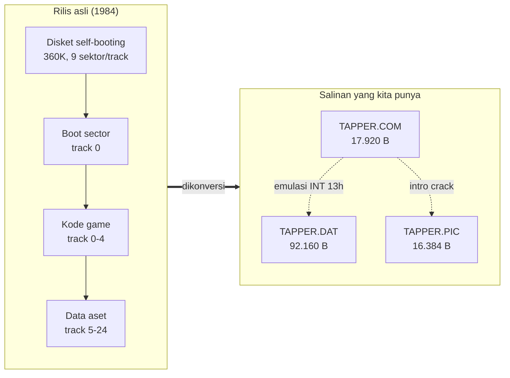
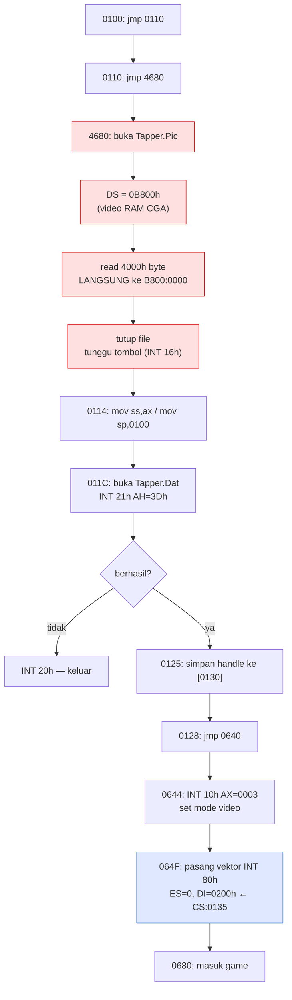
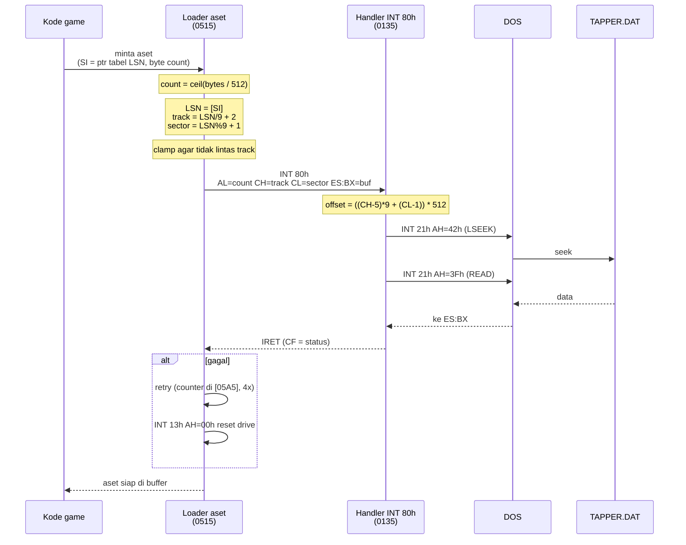
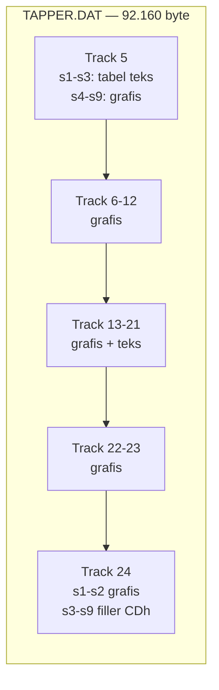
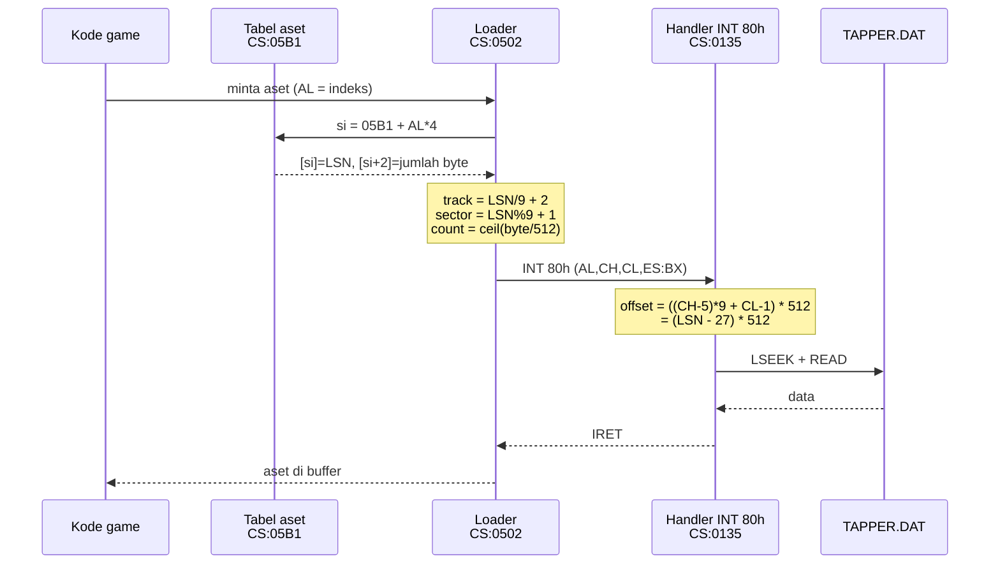
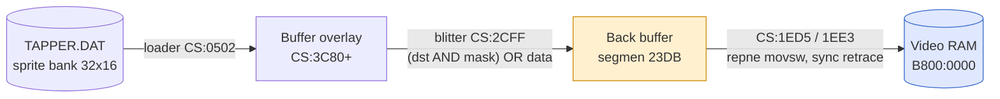
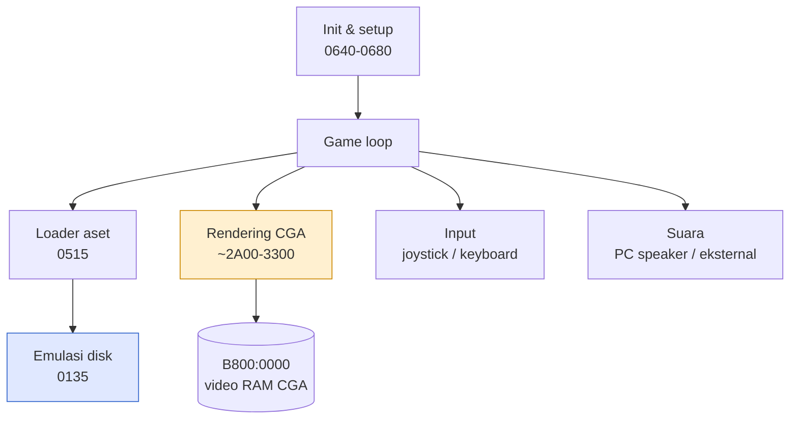
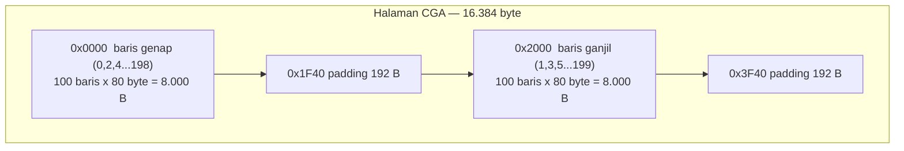

# Arsitektur Tapper (IBM PC, 1984)

Dokumen ini menjelaskan arsitektur teknis salinan Tapper yang ada di
`.\Tapper`, berdasarkan pembongkaran langsung terhadap `TAPPER.COM`.
Setiap klaim di sini punya rujukan alamat kode; yang masih dugaan ditandai
eksplisit.

Ringkasan format data ada di [FINDINGS.md](FINDINGS.md).

---

## 1. Gambaran besar: ini booter yang di-DOS-kan

Rilis IBM PC asli Tapper adalah **PC Booter** — disket self-booting yang
mengambil alih mesin tanpa DOS sama sekali. Bukti di dalam binary:

| Interrupt | Dipakai di | Keterangan |
|---|---|---|
| `INT 10h` | ~20 lokasi di badan game | BIOS video |
| `INT 13h` | `0x55A`, `0x8B7` | BIOS disk (reset drive) |
| `INT 16h` | `0x470A` | BIOS keyboard |
| `INT 1Ah` | `0x5xx` | BIOS timer tick — sumber waktu & seed acak |
| `INT 21h` / `INT 20h` | **hanya di kode crack** | DOS |

Badan game **tidak pernah memanggil DOS satu kali pun**. Semua akses disk lewat
BIOS sektor mentah, semua grafis lewat port CGA langsung. Itu ciri booter.

Yang kita punya adalah hasil konversi: seseorang membungkusnya jadi `.COM`,
mengekstrak track data disket ke `TAPPER.DAT`, dan memasang lapisan emulasi
disk supaya game tetap percaya sedang membaca floppy.



---

## 2. Peta memori

`TAPPER.COM` dimuat pada `ORG 100h` dalam satu segmen tunggal
(`CS = DS = ES = SS`), gaya .COM klasik.

| Alamat | Isi | Asal |
|---|---|---|
| `0100` | Entry point — `jmp 0110` | patch crack |
| `0102` | String `"Tapper.Dat"` | crack |
| `0110` | `jmp 4680` — lompat ke intro crack | patch crack |
| `0114` | Start sesungguhnya: `mov ss,ax` / `mov sp,0100` | crack |
| `0130` | Penyimpanan file handle `TAPPER.DAT` | crack |
| `0135` | **Handler INT 80h — emulasi disk** (diakhiri `IRET`) | crack |
| `0515` | Loader aset — LSN → CHS → `INT 80h` | game (dipatch) |
| `05A3`–`05A5` | Variabel: jumlah sektor, retry counter | game |
| `0640` | Init: set mode video, pasang vektor INT 80h | game (dipatch) |
| `0680`–`~3BF0` | Badan game (~15 KB kode) | game |
| `~3BFA` | Tabel string & data statis | game |
| `3C80` | **Buffer overlay** — tujuan muat data disk | game |
| `4680` | Loader intro crack | crack |
| `4682` | String `"Tapper.Pic"` | crack |
| `4700` | Akhir image | — |

Buffer di `3C80` sudah berisi 5 sektor pertama track 5 (2560 byte) yang ikut
dibakukan ke dalam executable — identik dengan `TAPPER.DAT` offset 0.

---

## 3. Urutan startup



Kotak merah adalah sisipan crack. Deretan `NOP` di `0649` dan `065B`–`066D`
adalah bekas kode proteksi asli yang ditimpa.

---

## 4. Lapisan emulasi disk — inti arsitekturnya

Ini bagian paling menarik. Game memanggil disk seolah masih di floppy;
handler crack menerjemahkannya jadi operasi file DOS.

### Konvensi register

Handler di `0135` memakai konvensi **BIOS INT 13h AH=02h (read sectors)** persis:

| Register | Arti |
|---|---|
| `AL` | jumlah sektor yang dibaca |
| `CH` | nomor track (cylinder) |
| `CL` | nomor sektor (basis 1) |
| `DH` | head — selalu `0` |
| `DL` | drive — di-hardcode `1` (B:) |
| `ES:BX` | buffer tujuan |

### Terjemahannya

```
offset = ((CH - 5) * 9 + (CL - 1)) * 512      ; 0139-014B
count  = AL * 512                              ; 015F-0166
```

lalu `LSEEK` (`INT 21h AH=42h`) + `READ` (`INT 21h AH=3Fh`), ditutup `IRET`.



### Kenapa ada clamp track

Pengontrol floppy tidak bisa membaca melewati batas track dalam satu perintah.
Loader di `052C`–`0538` menghitung sisa sektor pada track berjalan
(`10 - sector`) dan memotong permintaan bila melebihi itu. Batasan hardware ini
ikut terbawa walaupun sekarang sumbernya cuma file biasa.

---

## 5. Geometri TAPPER.DAT



- 512 byte per sektor, **9 sektor per track**
- 180 sektor = **20 track**, dinomori **5 sampai 24**
- Track 0–4 disket asli (boot sector + kode game) tidak ikut diekstrak —
  isinya sudah jadi `TAPPER.COM`

---

## 5a. Pipeline aset

Dari nomor aset di `AL` sampai byte sampai di buffer, seluruh rantainya sudah
terpetakan:



Struktur tabel: 15 entri x 4 byte, `[+0]` = LSN, `[+2]` = jumlah byte.
Entri 0 menunjuk kode game di track 0–4 floppy asli (di luar `TAPPER.DAT`);
entri 1–14 adalah aset data yang menutupi file secara kontigu.

## 5b. Pipeline rendering

Game tidak menggambar langsung ke video memory. Ia menyusun di back buffer
RAM, lalu menyalinnya ke layar tersinkron vertical retrace.



Blitter menulis dengan `ES` = `0x23DB` (back buffer), bukan `0xB800`.

## 6. Subsistem

Ada **69 sasaran `call` langsung** dari 238 call site. Yang paling banyak
dipanggil terkumpul di rentang `2A00`–`3300`, dan setelah dibaca semuanya
memang lapisan rendering.



Subrutin dengan call site terbanyak:

| Subrutin | Call site | Peran |
|---|---|---|
| `copy_32px_unmasked` (`2C6A`) | 26 | salin 32 pixel tanpa mask |
| `select_sprite_ptr` (`2E96`) | 20 | pilih pointer sprite |
| `lookup_ptr_pair` (`2E1E`) | 19 | ambil sepasang pointer dari tabel |
| `print_string_at` (`2F2D`) | 18 | cetak string di posisi |
| `load_asset_from_stream` (`2D66`) | 14 | muat aset dari stream indeks |
| `blit_sprite_16x16` (`2D1A`) | 12 | blit sprite 16×16 |

Kolom peran ini dulu diisi **dugaan** dari lokasi dan frekuensi panggilan. Kini
keenamnya sudah dibaca dan dinamai, dan dugaan "lapisan rendering" itu ternyata
benar — tapi perhatikan bahwa `load_asset_from_stream` yang dulu ditandai "—"
bukan rutin rendering sama sekali.

---

## 7. Format video CGA

Kedua jalur grafis memakai layout hardware CGA yang sama.

- Resolusi **320 × 200**, **2 bit per pixel**, 4 warna
- Palette 1 high-intensity: hitam / cyan / magenta / putih
- **80 byte per scanline**, 4 pixel per byte, pixel paling kiri di bit tertinggi
- **Bank interleave**: baris genap mulai di `0x0000`, baris ganjil di `0x2000`
- 192 byte padding tak terpakai di ekor tiap bank



Satu byte = 4 pixel:

```
bit  7 6 | 5 4 | 3 2 | 1 0
     px0 | px1 | px2 | px3
```

`TAPPER.PIC` adalah dump mentah struktur ini — di-`read()` bulat-bulat ke
`B800:0000` tanpa dekoding apa pun.

---

## 8. Yang belum terpecahkan

Bagian ini pernah berisi "encoding sprite di dalam sektor" sebagai masalah
terbuka, lengkap dengan langkah berikutnya "bongkar rutin blitter" dan "temukan
tabel LSN". Keduanya sudah selesai sejak lama — ketujuh varian blitter terbaca dan
`asset_table` (`0x05B1`) ditemukan — sementara bagian ini tetap mengatakan
sebaliknya. Persis jebakan 7.5 di [PLAYBOOK.md](PLAYBOOK.md): klaim
"belum terpecahkan" membusuk tanpa memicu kegagalan apa pun.

Yang benar-benar masih terbuka:

| Hal | Kenapa terhenti |
|---|---|
| Sprite bank di track lain | Keenam tabel di memori sudah dirender ke `screens/` dan ukurannya terpetakan. Yang belum dikatalogkan adalah sprite yang masih tersimpan di track `TAPPER.DAT` dan belum pernah dimuat ke memori pada jalur yang teramati |
| Permintaan sprite di luar jangkauan | Runtime mencatat indeks 78, 80, 126 diminta padahal `ptr_table_a` cuma 66 entri; `sprite_index_in_range` mengabaikannya diam-diam. Cacat atau jalur untuk mode lain — belum terjawab |
| 54 instruksi masih `db` | **Terklasifikasi, bukan lagi terbuka.** 39 dari 54 bukan instruksi — mereka di dalam tabel data (`bar_limit_source`, `round_spawn_table`, tabel nada `0x42CC`-`0x4348`, string `"Tapper.Pic"`). Sisanya 15 kode sungguhan: 13 kasus lebar displacement + 2 encoding jump/call. Dua percobaan aturan umum justru memperburuk, lihat [DECISIONS.md](DECISIONS.md) |

Enam item lama sudah keluar dari daftar ini:

- **Kepemilikan entri tabel sprite** — run 400M menghasilkan 16 indeks
  dengan pemiliknya, dari kaitan runtime pada `lookup_ptr_pair` dan
  `set_entity_sprite`, bukan pengamatan mata. Aturan "paruh bawah = paruh
  atas + 2" muncul sendiri di datanya
- **`or bx, 0xe000` di `CS:3B5D`** — terukur mati:
  `tools/probe_rom_noise.py` mencatat 4000 pembacaan, semuanya di
  F000:0000-0x05CC, tidak satu pun di atas `0x2000`

- **Baris ke-21 tabel ronde** — ronde berpadanan satu-satu dengan halaman
  berlayar, baris 20 milik halaman 26, dan `show_next_page` membungkus sebelum
  halaman itu dijalankan
- **Peta pemakai aset** — terbaca dari tabel skrip layar dan kedua tabel aux,
  tanpa emulator
- **Isi layar bar** — aset layar terkompresi RLE; `unpack_screen` (`CS:2DB5`)
  adalah dekompresornya, dan `tools/decode_screen.py` membongkar keempat layar
  langsung dari `TAPPER.DAT` ke `screens/`
- **Empat site `call word ptr [bx+si]`** — bukan kode sama sekali: tiga adalah
  kode kontrol kursor `FF 10 14` di dalam string UI, satu adalah awal tabel data
  suara. Artefak disassembly, bukan misteri

---

## 9. Catatan kualitas sumber

Salinan ini **bukan binary pristine**. Title screen asli sudah diganti intro
grup crack, entry point dipatch, dan ada bekas `NOP` sled tempat kode proteksi
ditimpa. Untuk memahami format data hal ini justru membantu — crack-nya
mengekspos geometri disk secara eksplisit. Tapi untuk rekonstruksi kode yang
byte-identik dengan rilis 1984, salinan ini bukan basis yang benar.
