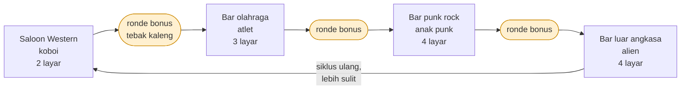

# Tapper — tentang game-nya

Panduan tentang Tapper: sejarahnya, cara main, dan hal-hal khusus versi IBM PC
yang ada di folder ini.

Detail versi DOS di bawah ditandai **[dari binary]** kalau saya verifikasi
langsung dari `TAPPER.COM`, bukan dari sumber luar.

---

## 1. Identitas

| | |
|---|---|
| **Judul** | Tapper (juga dirilis sebagai *Root Beer Tapper*) |
| **Pengembang** | Marvin Glass and Associates |
| **Publisher arkade** | Bally Midway (Amerika Utara & Eropa), Sega (Jepang, 1984) |
| **Tahun arkade** | 1983 — sebagian sumber mencatat 1984 |
| **Publisher versi IBM PC** | Sega Enterprises, 1984 |
| **Genre** | Aksi / arcade, satu layar |
| **Pemain** | 1–2, bergantian |

**Tim aslinya:** pemrogram Steve Meyer dan Elaine Ditton, artis Scott Morrison,
komposer Rick Hicaro.

### Kenapa ada dua nama

Versi arkade asli disponsori Anheuser-Busch dan bertema **Budweiser** — kabinetnya
bahkan pakai tuas joystick berbentuk gagang keran bir, plus footrest kuningan dan
tempat gelas, karena memang ditargetkan untuk dipasang di bar.

Masalahnya, hukum melarang iklan minuman beralkohol ke anak-anak. Bally Midway
lalu merilis ulang versi identik bernama **Root Beer Tapper**: mekanik sama
persis, tapi Anda jadi penjaga kedai soda, bukan bartender. Versi inilah yang
umumnya dipakai untuk port konsol rumahan.

---

## 2. Cara bermain

Anda adalah bartender. Ada **empat bar horizontal** di layar. Pelanggan masuk
dari ujung jauh tiap bar dan berjalan maju ke arah Anda sambil minta minum.

Aksi dasarnya:

1. **Pindah** naik-turun antar bar, dan maju-mundur di sepanjang bar.
2. **Isi gelas** di keran, lalu **luncurkan** menyusuri bar.
3. Gelas meluncur menghantam pelanggan → pelanggan **terdorong mundur** dan
   minum di tempat.
4. Setelah habis, pelanggan **melempar gelas kosong** balik ke arah Anda —
   Anda harus **menangkapnya**.
5. Bar bersih dari pelanggan = layar selesai.

### Cara kehilangan nyawa

Ada tiga cara, dan ketiganya wajib Anda hafal:

| Kesalahan | Penyebab |
|---|---|
| Gelas penuh jatuh di ujung bar | Anda meluncurkan gelas saat bar kosong, atau pelanggan sudah lewat |
| Gelas kosong tidak tertangkap | Anda tidak ada di posisi saat gelas balik, gelas pecah |
| Pelanggan sampai ke ujung keran | Pelanggan tidak dilayani cukup cepat, dia menyeret Anda |

### Tip

Sesekali pelanggan meninggalkan **uang tip** di bar. Ambil untuk poin tambahan —
dan sebagai bonus, saat Anda mengambilnya sekelompok penari muncul dan
**mengalihkan perhatian sebagian pelanggan sejenak**. Itu bukan cuma poin, itu
alat taktis untuk membeli waktu.

---

## 3. Level

Empat tema bar, dimainkan berurutan:

| Urutan | Tema | Pelanggan | Jumlah layar |
|---|---|---|---|
| 1 | Saloon Western | Koboi | 2 |
| 2 | Bar olahraga | Atlet | 3 |
| 3 | Bar punk rock | Anak punk | 4 |
| 4 | Bar luar angkasa | Alien | 4 |

Total **13 layar per siklus penuh**. Setelah itu game tidak berakhir —
ia mengulang dari awal dengan tingkat kesulitan naik. Jadi tidak ada
"tamat"; yang ada adalah bertahan selama mungkin, khas game arkade era itu.



### Bagaimana kesulitan naik

- Pelanggan **muncul lebih sering**
- Pelanggan **bergerak lebih cepat**
- Gelas **mendorong mereka mundur lebih pendek** — jadi butuh lebih banyak gelas
  per pelanggan
- Jumlah maksimum pelanggan per bar naik bertahap sampai **empat sekaligus**

Poin ketiga itu yang paling mematikan. Di level awal satu gelas cukup mengusir
pelanggan; di level lanjut Anda perlu memberi minum berkali-kali sementara
pelanggan lain terus maju di tiga bar lainnya.

### Menangkap gelas kosong — jendelanya melampaui posisi Anda

**[dari kode]** `update_returning_mugs` (`CS:18AE`) memberi angka pastinya.
Gelas kosong tertangkap bila posisinya jatuh di jendela selebar delapan satuan:

```
batas bawah = player_column − 1 + 2 × player_velocity
batas atas  = batas bawah + 7
```

Perhatikan suku `2 × player_velocity`: **jendelanya bergeser ke arah Anda
bergerak**, dua kali kecepatan. Jadi bartender yang sedang berlari menangkap
sedikit di depan posisi gambarnya, bukan tepat di badannya. Tertangkap berarti
node dilepas kembali ke free list dan skor bertambah `0x100`.

Kalau lolos, gelas itu terus sampai melewati batas bar, lalu **jatuh dalam
delapan frame animasi dan memakan satu nyawa**.

### Tiga cara mati, bukan satu

Membaca kedua daftar node menuntaskan aturannya, dan bentuknya simetris:

| Cara | Kode |
|---|---|
| Pelanggan mencapai Anda | `CS:1329` → `player_death_sequence` |
| **Gelas yang Anda lempar meleset** dari semua pelanggan dan lewat ujung bar | `update_served_mugs`, `CS:189D` |
| **Gelas kosong tidak tertangkap** dan lewat ujung bar di sisi Anda | `update_returning_mugs`, `CS:19EE` |

Kedua jalur gelas itu aturan yang sama di dua ujung berlawanan: **gelas yang
keluar dari bar memakan nyawa**, tidak peduli arahnya. Yang selama ini
terdokumentasi hanya jalur pertama.

Keempat poin di atas awalnya berasal dari deskripsi game, bukan dari kode —
dan kini ketemu di kode. Tabel parameter per-ronde di `0x4105` menaikkan jumlah
pelanggan per bar dari 1 di ronde 0 sampai 4 di ronde 8, sementara
`tighten_difficulty` menyetengahkan interval gerak entitas di milestone
tertentu. Pengelompokan tipe pelanggan di tabel pasangannya bahkan mengikuti
pola **2/3/4/4 layar** yang tercatat di tabel tema di atas. Rinciannya di
[FINDINGS.md](FINDINGS.md#kesulitan-yang-menanjak--tabel-per-ronde-diindeks-penghitung-ronde).

---

## 4. Ronde bonus

Di antara level ada ronde bonus. Seorang sosok bertopeng muncul membawa
sederet kaleng, **mengocok lima di antaranya**, lalu menggebrak meja untuk
mengacak posisinya.

Tugas Anda: pilih **satu kaleng yang tidak dikocok**.

**[dari binary]** Versi DOS mengonfirmasi hasilnya lewat string di dalam file:
benar → `"Congratulations!"` + `"3000 Points"`; salah → `"OOPS"`.

**[dari kode]** Pengocokannya bukan acak murni. `reroll_spaced_pick` (`CS:267F`)
mengundi pasangan posisi lalu **menolak pasangan yang bersebelahan** — ia menguji
bit yang terpilih, bit di kirinya, dan bit di kanannya, dan mengundi ulang kalau
ada yang bentrok. Jadi kedua kaleng yang ditukar selalu berjarak.

Animasinya delapan frame (`bonus_slot_index` menghitung 1…8), dan jeda antar
frame diambil dari `0x4516` — nilai yang sama yang `begin_round` setengahkan
begitu nomor ronde mencapai 6. **Jadi kocokannya makin cepat seiring permainan
maju.**

Ronde ini tidak memakan nyawa, jadi selalu ambil tebakan.

---

## 5. Versi IBM PC — yang khusus di sini

Semua di bagian ini saya baca langsung dari `TAPPER.COM`.

### Menu pilihan **[dari binary]**

Layar `SELECT:` menawarkan:

| Pilihan | Opsi |
|---|---|
| Kontrol | `JOYSTICK` / `KEYBOARD` |
| Pemain | `ONE PLAYER` / `TWO PLAYER` |
| Kesulitan | `BEGINNER` / `ARCADE` / `EXPERT` |
| Suara | `NO SOUND` / `SOUND` / `EXTERNAL SOUND` |

Lalu: `BUTTON OR SPACE TO PLAY ...`

Tiga tingkat kesulitan itu khas port rumahan — versi arkade tidak punya
`BEGINNER`. Kalau baru mulai, jelas mulai dari situ.

`EXTERNAL SOUND` menarik: ini era sebelum sound card standar, jadi opsi itu
kemungkinan untuk perangkat audio eksternal yang dijual terpisah.

### Pilihan tampilan **[dari binary]**

Sebelum menu, game bertanya:

```
PRESS "R" FOR RGB DISPLAY
PRESS "C" FOR COMPOSITE DISPLAY
```

Ini penting untuk emulasi. CGA menghasilkan warna berbeda di monitor RGB
digital vs monitor komposit. Data pixel-nya sama, tapi di komposit warna
"bocor" antar pixel dan menghasilkan palet yang jauh lebih kaya. Kalau warna
di DOSBox terlihat aneh mencolok (cyan/magenta menyala), coba pilihan satunya
dan set mode komposit di emulator.

### Kalibrasi joystick **[dari binary]**

Kalau memilih joystick, game meminta tiga posisi berurutan:

1. `MOVE THE JOYSTICK TO THE TOP LEFT HAND CORNER AND PUSH THE BUTTON`
2. `MOVE THE JOYSTICK TO THE MIDDLE AND PUSH THE BUTTON`
3. `MOVE THE JOYSTICK TO THE LOWER RIGHT HAND CORNER AND PUSH THE BUTTON`

Gagal → `ERROR IN SETUP.  RECHECK JOYSTICK AND TRY AGAIN.` atau
`JOYSTICK NOT FOUND`.

### Tutorial bawaan **[dari binary]**

Ada mode latihan singkat: `WATCH CLOSELY` → `USE THE JOYSTICK TO MOVE THE BAR
TENDER` / `USE THE BUTTON TO OPEN CAN` (versi keyboard: `USE THE MOTION KEYS`
dan `USE THE SPACE BAR`) → `GET READY TO SERVE`.

Perhatikan kata **"OPEN CAN"**, bukan "pour beer". Ini indikasi kuat bahwa port
PC-nya berbasis **Root Beer Tapper**, bukan versi Budweiser.

### Kontrol lain **[dari binary]**

- Game bisa dijeda → `GAME PAUSED`
- `USE Ctrl Break TO ABORT` untuk keluar

---

## 6. Tips & trik

Sebagian dari mekanik yang terverifikasi di atas, sebagian strategi umum.

**Dasar**

1. **Mulai dari `BEGINNER`.** Tidak ada gunanya langsung `EXPERT`; ritme
   empat-bar itu perlu dibiasakan dulu.
2. **Jangan pernah luncurkan gelas ke bar kosong.** Gelas penuh yang jatuh di
   ujung = satu nyawa. Ini penyebab kematian pemula nomor satu, dan sepenuhnya
   bisa dihindari.
3. **Gelas kosong lebih mendesak daripada pelanggan baru.** Pelanggan yang maju
   masih memberi Anda beberapa detik; gelas kosong yang meluncur tidak.

**Manajemen bar**

4. **Prioritaskan bar dengan pelanggan terdekat ke keran.** Itu ancaman
   langsung. Bar yang pelanggannya baru masuk bisa ditunda.
5. **Layani sambil bergerak ke arah yang sama.** Merencanakan urutan bar supaya
   Anda bergerak satu arah jauh lebih hemat daripada bolak-balik panik.
6. **Waspadai gelas kembali sebelum meluncurkan yang baru.** Kalau Anda tahu
   satu gelas kosong sedang meluncur balik di bar 2, jangan telanjur pindah ke
   bar 4.

**Lanjutan**

7. **Ambil tip saat Anda butuh napas**, bukan sekadar saat lewat. Penari yang
   muncul mengalihkan sebagian pelanggan — itu jendela waktu untuk membereskan
   bar lain yang sedang genting.
8. **Di level tinggi, hitung gelas.** Karena dorongan mundur makin pendek,
   perkirakan berapa gelas yang dibutuhkan seorang pelanggan sebelum Anda
   berkomitmen ke bar itu.
9. **Selalu tebak di ronde bonus.** Tidak ada risiko nyawa, hanya potensi
   3000 poin.
10. **Jangan panik saat empat bar penuh.** Itu justru saat paling penting untuk
    bergerak sistematis satu arah, bukan melompat-lompat.

---

## 7. Menjalankan versi ini

File di `.\Tapper` sudah dalam bentuk `.COM` yang jalan di bawah DOS, jadi bisa
langsung dijalankan di DOSBox (sudah terpasang: DOSBox Staging 0.82.2).

Ketiga file harus berada dalam satu folder — `TAPPER.COM` mencari `Tapper.Dat`
dan `Tapper.Pic` di direktori kerja, dan langsung keluar kalau tidak ketemu.

Untuk warna yang benar, cocokkan pilihan RGB/Composite di game dengan setting
mode CGA di emulator.

Catatan: salinan ini adalah **versi crack** — layar judul aslinya sudah diganti
intro grup crack. Detail teknisnya ada di [ARCHITECTURE.md](ARCHITECTURE.md).

---

## Sumber

Fakta sejarah dan mekanik arkade dirangkum dari:

- [Tapper (video game) — Wikipedia](https://en.wikipedia.org/wiki/Tapper_(video_game))
- [Tapper — Museum of the Game / Arcade Museum](https://www.arcade-museum.com/Videogame/tapper)
- [Tapper, Bally Midway 1983 — Arcade History](https://www.arcade-history.com/?n=tapper-model-0a11&page=detail&id=2834)
- [Tapper (1983) — MobyGames](https://www.mobygames.com/game/298/tapper/)
- [Tapper (IBM PC & Compatibles) — RAM OK ROM OK](https://ramokromok.com/games/tapper-ibm-pc-compatibles)

Semua detail bertanda **[dari binary]** berasal dari pembongkaran langsung
`TAPPER.COM`, bukan dari sumber di atas.
