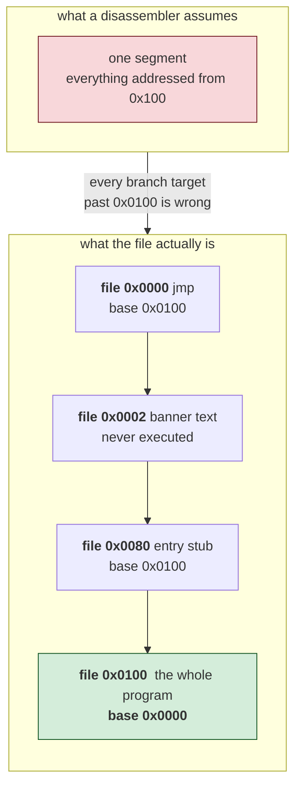
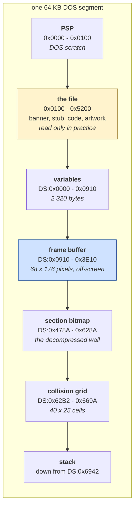

# Zaxxon — how the program is built

*Document two of three. Before this: [01 — the game](01-the-game.md). After
it: [03 — the code](03-the-code.md), which walks through the routines
themselves.*

This document explains how twenty kilobytes of 1984 assembly draws a
three-dimensional fortress on a graphics card that had no idea what a sprite
was. Everything in it was measured from the file. Where something is reasoned
rather than observed it is marked **[inferred]**, and there is a list of what
is still unknown at the end.

---

## Contents

- [What the file is, and how we know](#what-the-file-is-and-how-we-know)
- [Getting the program to start](#getting-the-program-to-start)
- [Where everything lives](#where-everything-lives)
- [The screen, and the buffer in front of it](#the-screen-and-the-buffer-in-front-of-it)
- [One coordinate system for the whole game](#one-coordinate-system-for-the-whole-game)
- [The backgrounds: tiles, and a run-length encoder](#the-backgrounds-tiles-and-a-run-length-encoder)
- [The objects: 34 sprites and eight ways to store one](#the-objects-34-sprites-and-eight-ways-to-store-one)
- [The object table](#the-object-table)
- [The level script](#the-level-script)
- [Where the enemies come from](#where-the-enemies-come-from)
- [Time](#time)
- [Sound](#sound)
- [Randomness](#randomness)
- [Collision](#collision)
- [The text, and the font it does not have](#the-text-and-the-font-it-does-not-have)
- [What this program is not](#what-this-program-is-not)
- [What is still unknown](#what-is-still-unknown)

---

## What the file is, and how we know

One file, `ZAXXON.COM`, 20,736 bytes.

```
SHA-256  a9214cced592ddea960753a37ecb0029a7ae7ae2b37e9ee394944be61a41a45b
```

The claim this whole document rests on is that the reconstructed assembly in
`recovered/zaxxon.asm` **assembles back to a file with that exact hash**. Not
"produces working code", not "looks equivalent" — the same 20,736 bytes. That
was checked with NASM and `Get-FileHash`, outside the tool that produced the
source, and the [README](../README.md) tells you how to repeat it.

Byte-identity on its own would prove very little. A file emitted entirely as
`db 0x8C, 0xC8, ...` also rebuilds exactly and teaches nothing. So the second
number matters more:

| | |
|---|---|
| rebuild | byte-identical, SHA-256 verified independently |
| instructions recovered | **2,633** |
| of which pinned to raw bytes to preserve their encoding | 114 |
| bytes covered by instructions | 6,335 of 20,736 — **30.6% of the file** |
| code region `0x0000..0x20DD` | 8,413 bytes, **75.3% recovered as instructions** |
| data tail `0x20DD..0x5100` | 12,323 bytes, correctly left as data |

**Quote the second percentage, not the first.** Sixty per cent of this program
is artwork and lookup tables. A percentage of the whole file measures the game;
a percentage of the region that actually holds code measures the recovery.

The shape of the file is visible in its bytes before anything is disassembled:

| | |
|---|---|
| `0x00` | 7,761 bytes, 37.4% |
| `0xFF` | 1,770 bytes — the second commonest value |
| printable ASCII | 15.9% |

Long runs of `0x00` and `0xFF` are what artwork and sparse tables look like.
The high printable fraction is unusual for a game this size, and it is
accounted for: there is a text banner, a title screen, a status line, and — as
it turns out — a great deal of sprite data whose bytes happen to fall in the
printable range.

## Getting the program to start

A `.COM` file is the simplest executable DOS has. There is no header of any
kind. DOS finds 64 KB of free memory, calls the first 256 bytes of it the
**PSP** (a scratch area holding the command line and a few pointers), copies
the entire file in at offset `0x100`, and jumps to the first byte. That is the
whole loading procedure.

So execution starts at file offset 0, and file offset 0 holds this:

```nasm
    jmp 0x180                       ; over the next 126 bytes
```

Those 126 bytes are text, ending in byte `0x1A` — the character DOS used to
mark the end of a text file:

```
Zaxxon is brought to you by :

   --- The Duplicators ---
```

This is a crack-group signature, described in
[document one](01-the-game.md#where-this-particular-file-came-from). It is
never executed and never printed by the game; it exists so that `TYPE
ZAXXON.COM` shows it.

It also caused the first real difficulty in this reconstruction, which is
worth recording because it was a **tool bug rather than a Zaxxon problem**.
The toolkit already knew how to recognise the pattern that follows the banner
— it does it automatically for ParaTrooper — but it looked for it starting at
offset 0 and gave up the moment it met a jump. Result: nine instructions
recovered out of 20,736 bytes, and a rebuild that was still byte-identical,
because copying bytes is not the same as understanding them. Teaching it to
follow the jump first was a four-line change, and Zaxxon then needed no
manual help at all. There is a regression fixture in the toolkit
(`tests/com/fixtures/jmpstub.asm`) so it cannot come back.

### The stub, and why it matters more than it looks

At file offset `0x80` — address `0x180`, where the jump lands — sits this:

```nasm
    mov ax, cs                      ; the segment DOS loaded us into
    add ax, 0x20                    ; + 0x20 paragraphs = + 512 bytes
    push ax                         ;   that is the segment to jump to
    add ax, 0x500                   ; + another 0x500 paragraphs
    mov word [0x201], ax            ;   stored into the middle of an instruction
    xor ax, ax
    push ax                         ;   offset 0 within that segment
    retf                            ; "return" to (CS + 0x20) : 0000
```

Three separate things are happening, and each of them would break a naive
reading of the file.

**A `retf` used as a jump.** `retf` normally returns from a far call: it pops
an offset and a segment off the stack and continues there. Here nothing called
anything — the program pushed the destination itself. It is a far jump written
in two instructions because the 8086 has no instruction for "jump to a segment
I just computed". A disassembler following control flow stops dead at a `retf`
unless it is told what was on the stack.

**The rest of the file is addressed from a different base.** `CS + 0x20`
paragraphs is 512 bytes further on, and the offset is 0 rather than `0x100`.
Net effect: **file offset `0x100` onwards is addressed as though it started at
zero.** Every address in the real program is 256 lower than a naive reading
gives. Miss this and every branch target in the file is wrong, the walk
wanders off into data, and nothing announces the mistake.



*The diagram contrasts the two readings. Notice that the mistake is not
detectable from the bytes: both readings disassemble into valid instructions,
and only one of them is the program.*

**The program modifies itself before it runs.** `mov word [0x201], ax` writes
to address `0x201`, which is file offset `0x101` — the second and third bytes
of the very first instruction of the real program. That instruction is:

```nasm
    mov ax, 0x560                   ; file 0x100 -- the 0x560 is a placeholder
```

The stub overwrites the `0x560` with `CS + 0x520`. So the first thing the real
program does is load a number that was computed a microsecond earlier and
patched in. This is how a 1984 `.COM` program says "here is a second segment,
worked out at run time" — there are no relocations in a `.COM` file, so if you
want an address that depends on where DOS put you, you write it into your own
code.

Self-modifying code is rare enough today to be alarming and was ordinary then.
It is worth understanding rather than admiring: nothing here is clever, it is
just the only mechanism available.

## Where everything lives

Following the patched value through:

```nasm
    mov ax, 0x560                   ; patched to CS + 0x520
    mov ds, ax                      ; DS -- all data references go through this
    mov ss, ax                      ; SS -- and the stack lives there too
    mov sp, 0x6942                  ; 27 KB of it
    mov ax, 0xb800
    mov es, ax                      ; ES -- the CGA framebuffer
```

`CS + 0x520` paragraphs is `0x5200` bytes past the code segment, and the code
segment starts at file offset `0x100`. So `DS:0000` is file offset
`0x100 + 0x5000 = 0x5100`, which is **exactly the end of the file**.

That single fact explains the whole memory layout:



*What to notice: every byte the game writes to is past the end of the file.
Nothing in the program is initialised data in the C sense — the file is
constants, and the variables are whatever DOS left in memory, zeroed by hand at
start-up. This is why the same address, say `DS:0x70`, means one thing here and
`file offset 0x70` means something completely unrelated.*

A consequence worth stating for a beginner: **there are two entirely different
address spaces in this document.** `cs:0x2613` is somewhere in the file (add
`0x100` and you have the file offset). `[0x2613]` with no segment named is a
variable, 9,747 bytes past the end of the file. The code tells them apart with
a `cs:` prefix; a reader has to keep track.

## The screen, and the buffer in front of it

The IBM PC's CGA card in **mode 4** gives 320×200 pixels in four colours, in
16 KB of memory at segment `0xB800`. Zaxxon sets that mode and picks palette 1
— black, cyan, magenta, white — which is why every screenshot of it looks the
way it does.

Two bits per pixel means **four pixels per byte**, most significant pair
leftmost, and 80 bytes per scanline. The awkward part is that CGA does not
store the scanlines in order. It stores them in **two banks**:

- even-numbered lines at `0xB800:0x0000`
- odd-numbered lines at `0xB800:0x2000`

so line 0 is at offset 0, line 1 is at `0x2000`, line 2 is at 80, line 3 at
`0x2080`, and so on. This was a hardware convenience in 1981 and a nuisance
forever afterwards.

### Drawing off-screen and copying once

Zaxxon does not draw into video memory. It draws into ordinary RAM — a plain
bitmap with **80 bytes per row and no bank splitting** — and copies the
finished picture to the card in one pass. The copy is eleven instructions long
(file `0x05BA`):

```nasm
    mov cx, 0xb0                    ; 176 rows
    mov si, 0x910                   ; source: the off-screen buffer
    mov di, 0xa                     ; destination: byte 10 of the even bank
    mov bx, 0x200a                  ; and byte 10 of the odd bank
    cld
row:
    push cx
    mov cx, 0x22                    ; 34 words = 68 bytes
    rep movsw                       ;   one scanline
    pop cx
    add si, 0xc                     ; source row is 80 bytes, we copied 68
    add di, 0xc
    xchg di, bx                     ; swap the two banks over
    loop row
```

`xchg di, bx` is the whole bank problem, solved in one instruction: keep two
destination pointers, swap them every row. `rep movsw` copies words as fast as
the 8088 can, which is the only thing that matters here — this loop runs
14,080 bytes' worth every frame.

Two things this buys, and both are the reason to bother:

- **No tearing and no flicker.** The screen is never seen half-drawn, because
  it is never half-drawn. Everything else happens somewhere the display cannot
  see.
- **Simple drawing code.** Every sprite routine can assume 80 bytes per row and
  ignore banks entirely. The bank interleave is confined to those eleven
  instructions and to one other routine that writes the status line directly.

The play field is therefore **68 bytes wide (272 pixels) by 176 rows**, placed
at byte column 10 of the screen, leaving 24 rows at the bottom for the fuel
gauge and spare lives.

## One coordinate system for the whole game

Every object in Zaxxon has a position `(x, y)` where:

- **x is a byte column**, 0 to 74, so one unit is 4 pixels;
- **y is a half-row**, 0 to 100, so one unit is 2 scanlines.

The routine that turns that into a buffer address is four instructions (file
`0x0CC3`):

```nasm
    mov di, 0x18a                   ; the origin
    mov al, 0xa0
    mul byte [bx + 3]               ; 160 * y   (160 = two rows of 80)
    add al, byte [bx + 2]           ;   + x
    ...
    add di, ax
```

That the units are coarse is not laziness — it is what makes the arithmetic a
single 8-bit multiply. And the constants line up exactly with the play field:

| | |
|---|---|
| origin `0x18A` | 394 |
| first visible byte | `0x910` = 2,320 |
| smallest y the code will draw | `0x0C` = 12 → 394 + 160×12 = 2,314 |
| smallest x the code will draw | 6 → 2,314 + 6 = **2,320** |
| largest x | `0x4A` = 74 → 68 columns |
| largest y | `0x64` = 100 → 88 half-rows = **176 rows** |

So the clipping limits `6`, `0x4A`, `0x0C` and `0x64` that appear all over the
code are not magic numbers: they *are* the play field, expressed in the units
the game thinks in. **[Verified: the arithmetic closes exactly, with no
remainder.]**

In the projection, moving one unit left and one unit down is "towards the
player". That is the direction the fortress travels, and it is the direction a
freshly spawned enemy drifts.

## The backgrounds: tiles, and a run-length encoder

A wall section is 192 × 144 pixels. Stored as a raw CGA bitmap that is 6,912
bytes. There are seven of them, which would be 48,384 bytes — more than twice
the size of the entire program.

So they are not stored that way. Two ideas stack up.

**First: tiles.** The file holds **94 pictures of 8 × 8 pixels**, sixteen bytes
each, behind a table of word pointers at `cs:0x1FDD`. A section is described as
a grid of **24 × 18 tile numbers** rather than as pixels. That alone takes
6,912 bytes down to 432.

**Second: run-length encoding.** Isometric brickwork is enormously repetitive —
the same edge tile forty times along a diagonal. So the grid is not stored as
432 numbers either. It is stored as a stream of commands, decoded by the
routine at file `0x0B8D`:

| byte | meaning |
|---|---|
| `0x00`–`0xFB` | draw this tile once |
| `0xFD n t` | draw tile `t`, `n` times |
| `0xFE n` | leave `n` tiles untouched |
| `0xFF` | leave the rest of this row untouched |
| `0xFC` | end of the picture |

Two of those four commands are *skips* rather than *fills*, which is the detail
that makes it work as well as it does: the destination is cleared first, so a
gap in a wall costs two bytes however wide it is.

Measured, per section:

| section, as an address in the file | bytes | pixels |
|---|---|---|
| `cs:0x399B` | 107 | 27,648 |
| `cs:0x3A07` | 87 | 27,648 |
| `cs:0x3A5F` | 79 | 27,648 |
| `cs:0x3AB7` | 235 | 27,648 |
| `cs:0x3BA3` | 172 | 27,648 |
| `cs:0x3C50` | 209 | 27,648 |
| `cs:0x3D22` | 93 | 27,648 |

The seven sections together are **982 bytes**. The same pictures as raw CGA
bitmaps would be 48,384. That is a compression ratio of about 49:1, and it is
almost entirely down to choosing the right unit — the run-length encoder is
ordinary, but it is run-length encoding *tiles*, and one command covers 64
pixels rather than 4.

Decompression happens once per section, into a 6,912-byte bitmap at `DS:0x478A`
that is **48 bytes per row**, not 80. It is not a screen; it is a picture the
game will later cut rectangles out of.

**This was confirmed by rendering it.** `tools/render-artwork.py` decodes the
seven streams and writes them out as PNGs. They are walls, floors and stepped
edges, in perspective, unmistakably. A format that reads plausibly and a format
that is right are different things, and the difference is visible in about one
second.

### Getting a section onto the screen

The section is one large picture; what appears on screen is a clipped rectangle
of it, positioned by an eight-byte record: x, y, width, height. The routine at
file `0x0EB0` does the clipping, and the interesting half is what happens when
the section is partly above the top of the play field:

```nasm
    cmp word [bx + 2], 0            ; is y negative?
    jge below
    mov cx, [bx + 6]
    add cx, [bx + 2]                ; visible height = h + y
    mov ax, 0xffa0                  ; -96 = -(two rows of 48)
    imul word [bx + 2]
    add si, ax                      ; ... so move the SOURCE down instead
```

The destination stays pinned at the top of the field and the *source* pointer
advances. That is the standard way to clip a blit, and seeing it written out in
six instructions is a good way to understand why clipping is fiddly: there are
four edges, each needs the source or the destination adjusted but never both,
and getting one wrong produces a picture that is subtly sheared rather than
obviously broken.

The section enters at byte column `0x4A` — just past the right edge — 36
half-rows above the field, and each frame the code at file `0x08FC` does:

```nasm
    dec word [bx]                   ; one byte column left
    inc word [bx + 2]               ; one half-row down
```

One diagonal step per frame, 122 frames from entering to leaving. That is the
scrolling: there is no hardware to help, and none is needed, because the whole
background is one object.

## The objects: 34 sprites and eight ways to store one

Everything that is not background is an **object**, and there are 34 kinds. A
table at `cs:0x2613` holds, for each kind, two words:

```
    +0   pointer to the picture
    +2   pointer to the routine that draws it
```

and the dispatcher is three instructions (file `0x0CDD`):

```nasm
    mov bp, 0x2613
    shl ax, 1
    shl ax, 1                       ; kind * 4
    add bp, ax
    mov si, word [cs:bp]            ; the picture
    jmp word [cs:bp + 2]            ; the drawing routine, which returns for us
```

`jmp` rather than `call`, so the drawing routine's own `ret` returns to the
dispatcher's caller. It saves three bytes and one stack push per sprite, and it
is the kind of thing you only do when three bytes matter.

**There is no width or height anywhere in the sprite data.** The drawing
routine *is* the format. There are eight of them:

| routine | rows | bytes wide | mask | total bytes | used by |
|---|---|---|---|---|---|
| `cs:0x0BF0` | 24 | 6 | at +0x90 | 288 | 6 kinds |
| `cs:0x0C0F` | 16 | 4 | none | 64 | 3 |
| `cs:0x0C2B` | 16 | 6 | none | 96 | 1 |
| `cs:0x0C4E` | 16 | 4 | at +0x40 | 128 | 5 |
| `cs:0x0C77` | 16 | 6 | at +0x60 | 192 | 13 |
| `cs:0x0C99` | 8 | 2 | none | 16 | 3 |
| `cs:0x0CAD` | 8 | 2 | at +0x08 | 32 | 2 |
| `cs:0x0CC7` | 16 | 6 | none — **AND only** | 96 | 1 |

Every one of those sizes was checked against the gaps between consecutive
picture pointers in the table, and they agree exactly. **[Verified.]**

### What a mask is for

A sprite is not a rectangle. It is a shape inside a rectangle, and the corners
have to let the background through. The masked routines do this (file `0x0C77`,
one word at a time):

```nasm
    mov ax, word [di]               ; what is already on the screen
    and ax, word [cs:si + 0x60]     ; keep it only where the mask says so
    or  ax, word [cs:si]            ; add the sprite's own pixels
    mov word [di], ax
```

Two bitmaps per sprite: the picture, and a mask of the same size sitting a
fixed distance later. Where the mask has `11` the background survives; where it
has `00` the sprite's pixels win. One `and`, one `or`, and no branches — the
only way to afford transparency when every pixel costs.

### The shadow, which is a sprite made only of holes

One sprite selects the routine at `cs:0x0CC7`, and that routine does something
none of the others do:

```nasm
    mov ax, word [cs:si]
    and word [di], ax               ; and nothing else
```

No `or`. It has no pixels of its own — it only clears. That is the **shadow of
the player's aircraft**: a stencil punched into whatever it lands on. In a game
where altitude is invisible, the shadow is the entire instrument panel, and it
costs 96 bytes and one loop.

*Rendered proof: `tools/render-artwork.py` writes all 34 sprites out as a
sheet. They are aircraft at four bank angles, fuel drums, gun turrets, the boss
robot, missiles, shots and explosions — recognisably the game. The shadow is
the one black silhouette among them.*

## The object table

An object is **six bytes**:

| offset | meaning |
|---|---|
| +0 | kind, `0xFF` if the slot is free |
| +1 | direction — an index into a velocity table |
| +2 | x, byte column |
| +3 | y, half-row |
| +4 | altitude |
| +5 | state counter, used differently per kind |

They live in one array at `DS:0x00AC`, and different ranges of it are used for
different things — the code walks 23 of them to draw, 29 to move, and reserves
sub-ranges at `DS:0x0100` and `DS:0x0136` for shots. The player's own aircraft
is a record of the same shape at `DS:0x00A0`, four bytes before the array,
which lets one routine draw the player and the enemies without a special case.

Movement, for every object, is one table lookup (file `0x1071`):

```nasm
    mov si, word [bx + 1]
    and si, strict word 7           ; direction, 0..7
    shl si, 1
    add si, 0xff5                   ; a table of (dx, dy) pairs
    mov ax, word [cs:si]
    add byte [bx + 2], al           ; x += dx
    add byte [bx + 3], ah           ; y += dy
```

Eight directions, eight two-byte entries, sixteen bytes of data replacing what
would otherwise be a switch statement. Direction 0 is `(-1, +1)` — one column
left and one half-row down, the same diagonal the background travels.

## The level script

The game's structure is a list. At `cs:0x075E` there is a table of 22 entries,
four bytes each:

```
    +0   the routine that sets this scene up
    +2   the routine that runs while it lasts
```

and a byte in the player's state holds how far through the list they are. The
dispatcher (file `0x0848`) is:

```nasm
    mov bp, word [bx]               ; the script position, a multiple of 4
    add bp, 0x75e
    jmp word [cs:bp]
```

Reading the table out gives the whole shape of a playthrough — six scenes, a
long section, a scene, a boss, and then a longer variant of the same before it
loops:

| entries | what the setup routine points at |
|---|---|
| 0–5 | six different short scenes |
| 6 | a distinct routine, shared with entry 17 |
| 7–8, 10–16, 18–19 | more of the short scenes, reordered |
| 9, 20 | a different pair of routines again |
| 21 | `0xFFFF` — the end, which sends the position back to 0 |

**This table is also where the second toolkit problem was.** An indirect jump
through a table ends a recursive-descent disassembly: the walker has no idea
where `jmp word [cs:bp]` goes. About 2,400 bytes of routines are reachable only
through this table and its two smaller siblings, and without them the recovery
was 57.9% of the code region. Teaching the toolkit to read such a table — with
rules strict enough that it *refuses* to read the sprite table above, whose
first word is a picture rather than a routine — took it to **75.3%**. The rules
and their one false positive are documented in the toolkit's
`comrec.py`.

## Where the enemies come from

Not from the level script. Enemies arrive from **wave scripts**: eight lists at
`cs:0x1518`, each a run of `(kind, lane)` pairs ending in `0xFF`. The spawn
routine (file `0x15DD`) finds a free slot and fills it in:

```nasm
    mov al, byte [cs:si]            ; the kind
    cbw
    mov word [di], ax               ;   into the object's first two bytes
    mov bx, 0x14fe
    xlatb                           ; look up its starting altitude
    mov word [di + 4], ax
    mov al, byte [cs:si + 1]        ; the lane
    shl ax, 1
    mov bx, 0x150e
    add bx, ax
    mov ax, word [cs:bx]            ; look up where that lane enters
    mov word [di + 2], ax
```

There are five lanes, at `cs:0x150E`, and every one of them is byte column
`0x4A` — the right-hand edge — at five different heights. Enemies enter off the
side of the screen and drift in on the standard diagonal.

The altitude table has a detail worth pointing out to a beginner, because it
looks like a bug and is not. `xlatb` reads `[bx + al]` with `bx = 0x14FE`, but
the table's actual first byte is at `cs:0x1502`, four bytes later. The table is
therefore indexed **from kind 4**, not kind 0 — deliberately, because kinds 0
to 3 are the player's own aircraft and are never spawned from a wave. Four
bytes saved. **[Verified: the values from kind 4 onward are sensible altitudes
— 12 for a fuel drum, 20 for a wall-height object, 16 for an enemy aircraft —
and the four bytes before them are the tail of the preceding routine.]**

## Time

The game hooks **INT 1Ch**, the BIOS timer tick, which fires 18.2 times a
second. The install (file `0x011B`) is worth reading because it is not the form
most programs use:

```nasm
    cli
    in al, 0x21
    and al, 0xfe
    out 0x21, al                    ; unmask IRQ0 at the interrupt controller
    push ds
    mov ax, cs                      ; the handler's segment
    lea dx, [0x191]                 ;   and its offset
    xor cx, cx
    mov ds, cx                      ; DS -> the interrupt vector table at 0
    mov bx, 0x70                    ; 0x70 / 4 = vector 0x1C
    mov word [bx], dx
    mov word [bx + 2], ax
    pop ds
    sti
```

There is no `es:` anywhere in it, and no constant that looks like a vector
slot: the slot number is in a base register. That is the **third** thing this
game broke in the toolkit, which recognised only the textbook form. Fixing it
recovered the entire 47-byte handler, which had been sitting in the file as
data — and with it every conclusion about how the game keeps time. There is a
fixture for that too (`tests/com/fixtures/timer.asm`).

The handler itself (file `0x0291`) is nineteen instructions:

```nasm
    push ax / push bx / push cx / push dx / push si / push di / push ds
    mov ax, word [cs:1]             ; the word the entry stub patched
    mov ds, ax                      ;   -- that is how the handler finds DS
    test byte [0], 0x20             ; is a joystick in use?
    je no_stick
    call read_joystick              ; port 0x201
    mov word [0x55], bx
no_stick:
    call sound_tick
    pop ds / pop di / pop si / pop dx / pop cx / pop bx / pop ax
    iret
```

`mov ax, word [cs:1]` is the self-modification from the entry stub paying off a
second time. An interrupt handler is entered with `DS` set to whatever the
interrupted code was using — which, for a handler called by the BIOS, could be
anything. It needs its own data segment and it cannot use a variable to find
one, because reading a variable is the thing it cannot yet do. So it reads the
number out of its own instruction stream, where the stub left it.

So the timer does two jobs and only two: sample the joystick at a steady rate,
and advance the sound. **It does not pace the game.** The main loop runs flat
out; the `test byte [1], 0xff` at the bottom of it is a "the score changed,
redraw it" flag set by the scoring routine, not a frame tick. On a 4.77 MHz PC
the loop itself was the limit; on anything faster the whole game runs faster,
which is why games of this era are unplayable on later hardware.

## Sound

The PC speaker, driven by channel 2 of the 8253 timer chip. To make a tone you
write a mode byte to port `0x43`, a 16-bit divisor to port `0x42`, and then set
two bits in port `0x61` to connect the timer to the speaker:

```nasm
    mov al, 0xb6
    out 0x43, al                    ; channel 2, square wave
    mov ax, di                      ; the divisor -- pitch
    out 0x42, al
    mov al, ah
    out 0x42, al
    in al, 0x61
    or al, 3
    out 0x61, al                    ; speaker on
```

Above that sits a four-slot sound engine: four counters at `DS:0x25`, a table
of effect routines at `cs:0x1F12`, and a dispatcher that reaches them with
`push si / ret` — another computed jump, in two bytes. Each effect is a tiny
routine that advances a counter and picks the next divisor; the explosion one
picks a *random* divisor every tick, which is how you make noise with a chip
that can only make tones.

## Randomness

There is no linear congruential generator here. The random number routine (file
`0x20BD`) reads the BIOS clock:

```nasm
    xor ax, ax
    int 0x1a                        ; CX:DX = ticks since midnight
    mov word [0x38], dx
    sub dh, byte [0x3a]
    add byte [0x3a], dl
    add dl, dh
    mov ax, dx
    mov dl, 0x51                    ; 81
    and ax, 0x3ff
    div dl
    mov al, ah                      ; the remainder, 0..80
```

This is worth a paragraph because it is a design choice with consequences.

Using the clock means the game is **not reproducible**: the same inputs give a
different game every time, which is good for a player and terrible for anyone
debugging it, then or now. It also means the randomness is only as fine-grained
as the clock, which ticks 18.2 times a second — so consecutive calls within one
frame return values derived from the *same* tick, differing only through the
`[0x3a]` accumulator that the routine keeps.

It does avoid one classic trap. A common cheap generator is `seed = seed * A +
C` with a power-of-two modulus, and the low bits of such a generator are not
random at all — they are a counter, so `rnd() % 4` cycles 0, 1, 2, 3 forever.
Zaxxon's routine divides by 81, an odd number, and returns the remainder, so it
has no such structure. Whether that was reasoned or lucky, the file cannot say.

## Collision

One routine (file `0x1EA3`), used for everything:

```nasm
    mov al, byte [bx + 2]
    sub al, byte [si + 2]           ; difference in x
    jge  .-
    neg al
.-  cmp al, 3
    ja  miss
    mov al, byte [bx + 3]
    sub al, byte [si + 3]           ; difference in y
    ...
    cmp al, 3
    ja  miss
```

A box: within 3 byte columns (12 pixels) and 3 half-rows (6 pixels), plus a
further test on altitude for the kinds where height matters. No pixel testing,
no distance calculation, no square roots.

It is worth being clear that this is not an approximation the programmer would
have improved given more cycles. A rectangle is cheaper than the real outline
**and it plays better**, because a player reads a near miss that kills them as
the game cheating, and a rectangle slightly smaller than the sprite produces
forgiving collisions that feel fair. Almost every game since has done the same
thing for the same reason.

## The text, and the font it does not have

Hard Hat Mack carries 1,152 bytes of character glyphs and a 64-entry pointer
table to reach them. Zaxxon carries none, and the reason is one routine (file
`0x0233`):

```nasm
    push ax
    mov cx, 1
    mov bh, 0
    mov ah, 2
    int 0x10                        ; BIOS: move the cursor
    pop ax
    mov ah, 9
    mov bl, byte [2]                ; the colour
    int 0x10                        ; BIOS: write this character, CX times
```

Every character the game ever displays goes through those two BIOS calls —
the title, the credits, the prompts, `GAME OVER`, and the score, which is
turned into characters by adding `0x30` to each digit. In CGA mode 4 the BIOS
draws text by looking the character up in the ROM font and plotting it, which
is slow, and Zaxxon does not care because it only does this between rounds and
on the score line.

That is worth stating because it is one of the questions this kind of work is
supposed to answer, and the answer is "there is nothing there". Counted across
the whole file there are exactly **five `int 0x10` calls**: set mode 4, set the
background colour, select palette 1, position the cursor, write a character.
The 94 tiles are the only glyph-shaped data the program owns, and they are
scenery and the fuel gauge, not letters.

The one place text-like drawing happens without the BIOS is the status line
(file `0x0E82`), which writes tiles straight into video memory with the bank
interleave done by hand — `xor di, 0x2000` between rows. That is the fuel gauge
and the altitude bar, and neither of them is text.

## What this program is not

Two negatives, both established rather than assumed.

**It is not compiled C.** A C compiler of the period opens nearly every
function with `push bp / mov bp, sp`. There are **zero** such pairs in 2,633
instructions. This is hand-written assembly, and no amount of work will produce
C from it. What the reconstruction gives you is assembly that rebuilds the
original exactly, which is a stronger guarantee but a different thing.

**It was not mechanically translated from another processor.** Hard Hat Mack
(1983) was converted from Apple II 6502 source, and the evidence survives in
its binary as 391 `cmc` instructions — a carry-flag flip after 91% of all
compares, because the 6502 and the 8088 define borrow in opposite directions.
Zaxxon contains **zero** `cmc` instructions. Whatever else it is, it is x86
that someone wrote as x86.

**And it never calls DOS.** Not once — there are no `int 0x21` instructions
anywhere in the recovered code. Video is set through the BIOS, the keyboard is
read through the BIOS, the clock is read through the BIOS, and everything else
is done by writing to hardware directly. The program has no files to open, so
it has no use for an operating system.

**And it never exits.** This is stronger than "no exit was found in the code
that was recovered": the byte sequences `CD 20` (`int 0x20`), `CD 21`
(`int 0x21`) and `B8 00 4C` (`mov ax, 0x4C00`) do not occur **anywhere in the
20,736 bytes**, in code or data or artwork. There is no way back to DOS. You
turned the machine off.

## What is still unknown

Listed plainly, because a gap stated is worth more than a gap papered over.

1. **24.7% of the code region is not recovered as instructions.** Most of it is
   demonstrably data — the wave scripts, the velocity tables, the sound tables,
   the text — but not all of it has been individually accounted for.
2. **The scoring rules.** The routine at file `0x018C` adds a value to a
   packed-decimal score using `aaa`, and the strings `200 Point BONUS`,
   `1000 Point BONUS` and `2000 Point BONUS` are in the file, but which object
   is worth what has not been traced end to end.
3. **The boss sequence.** Scene entries 9 and 20 lead to routines around file
   `0x1B03` that have been recovered as instructions but not read closely. The
   robot sprite and its missile are in the sprite sheet; the fight is not
   documented here.
4. **The altitude/collision grid at `DS:0x62B2`.** 40 × 25 bytes, filled with
   `0x80`, written by the object drawing routine and read by something else.
   The reading is that it is a coarse occupancy map used for collision against
   the *background* rather than against objects **[inferred]** — it is written
   in exactly the pattern a 3×3 stamp around each object would produce — but
   the consumer has not been identified.
5. **The two-player logic.** There are clearly two of everything (the routine
   at file `0x05D9` returns one of two pointer blocks depending on a flag bit),
   but the second player's state block has not been mapped.
6. **What the 94 tiles are used for individually.** The set has been rendered
   and the fuel-gauge cells identified (`0x55`–`0x5D`), but most of the rest
   are only "isometric edge pieces".
7. **Whether this file matches the Sega/Datasoft release byte for byte.** It
   carries a crack-group banner, so at minimum the first 128 bytes are not
   original. Whether anything else was patched is not knowable from one copy.

---

*Next: [03 — the code](03-the-code.md), which walks through the routines named
above, in the order the program runs them.*
