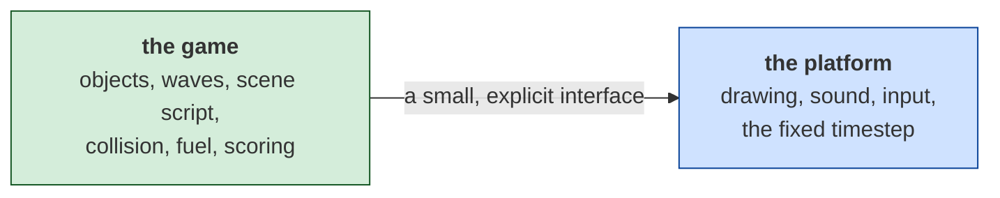

# Zaxxon — porting it

*Document four of four. [01-the-game.md](01-the-game.md) is what the game is;
[02-architecture.md](02-architecture.md) is how the program is shaped;
[03-the-code.md](03-the-code.md) walks its routines.*

**No port of this game exists yet.** This document is the decision that comes
before one: what the choices are, what each costs, and what specifically about
*this* program will be harder than it looks — and, just as importantly, what
will be easier than it looks.

---

## Contents

- [Read this before choosing a language](#read-this-before-choosing-a-language)
- [The options](#the-options)
- [Side by side](#side-by-side)
- [Recommendation](#recommendation)
- [Six things that will bite, in any language](#six-things-that-will-bite-in-any-language)
- [How to know your port is right](#how-to-know-your-port-is-right)

---

## Read this before choosing a language

### This one is the middle case

[ParaTrooper](../../paratrooper/docs/04-porting.md) is the easy port: one flat
loop, 47 variables, a clock you can read a number off.
[Hard Hat Mack](../../hard-hat-mack/docs/04-porting.md) is the hard one: five
times the code, machine-translated from a different processor, timed by counted
delay loops. Zaxxon sits between them, and not where its reputation would put
it.

| | ParaTrooper (1982) | **Zaxxon (1984)** | Hard Hat Mack (1983) |
|---|---|---|---|
| File | 16,400 bytes | **20,736** | 42,112 bytes |
| Instructions recovered | 2,017 | **2,655** | 9,060 |
| Distinct subroutines | 19 | **74** | 222 |
| Call sites | 38 | **206** | 568 |
| Absolute data addresses | 47 | **41** | 405 |
| Written by | a person, in assembly | **a person, in assembly** | a translator, from 6502 |
| Frame timing | the BIOS tick, 18.2 Hz | **nothing at all** | a counted delay loop |
| Sound | timer channel 2 | **timer channel 2** | the speaker bit-banged |

Read the "written by" row first, because it governs everything else. Zaxxon has
**zero `cmc` instructions** — it carries none of the fingerprints that show Hard
Hat Mack was converted by a tool. This is x86 that somebody wrote as x86, which
means **the structure you are reading is a real design and it is worth
following.** The object table, the scene script, the dispatch tables and the
dirty-tile erase are decisions, not artefacts. That is not true of Hard Hat
Mack and it changes how you should read the code: here, transliterating the
*shape* is reasonable, where there it was actively misleading.

The 41 data addresses is the number that should reassure you most. The whole
game state is 41 named globals plus one array of six-byte records. You can hold
all of it in your head.

### The isometric view is not 3D, and you must not build it as 3D

This is the single most important sentence in the document, so it gets its own
section.

There is no projection matrix in Zaxxon. There is no depth buffer, no camera,
no perspective divide, and no trigonometry anywhere in the file. An object has
two screen numbers and one altitude number:

- **x** — a byte column, 6 to 74, one unit = 4 pixels
- **y** — a half-row, 12 to 100, one unit = 2 scanlines
- **altitude** — 0 to 20, which does exactly one thing: it shifts the *allowed
  range of y* by the same amount, and picks which of four aircraft pictures to
  draw

That is the whole of the third dimension.
[02-architecture.md](02-architecture.md#one-coordinate-system-for-the-whole-game)
has the arithmetic and shows that the clipping constants close exactly against
the play field, with no remainder.

The temptation, in 2026, is enormous: you have a GPU, you have a matrix
library, and the game *looks* three-dimensional. Build it that way and you will
spend a week discovering that

- objects must not scale with distance, so you will disable perspective;
- the draw order is a two-way partition around the player, not a depth sort
  (see [03-the-code.md](03-the-code.md#drawing-and-the-order-things-are-drawn-in));
- the shadow is not a projection, it is a stencil drawn at a fixed offset;
- and the wall collision has nothing to do with geometry at all.

Every one of those is a fight against a 3D pipeline and a free gift in a 2D
one. **Draw sprites at (x, y) on a flat canvas. Let altitude offset y. Stop.**

### Three things you should deliberately not port

A port is not a transliteration, and this program contains three pieces of
1984 engineering whose entire purpose was to be cheap on hardware you do not
have. Copying them faithfully makes your port slower, longer and worse.

**The dirty-tile renderer.** Zaxxon never clears the screen; it marks the nine
background tiles under each sprite and repaints exactly those after the frame
has been shown
([02-architecture.md](02-architecture.md#how-the-screen-gets-erased)). It is a
beautiful piece of work and it exists because an 8088 could not afford to
repaint 748 tiles at 30 Hz. Your canvas can clear and redraw the whole play
field in well under a millisecond. **Clear and redraw.** Understand the
original's mechanism — it is one of the best things in the program to learn
from — and then do not implement it.

**The score kept as eight decimal digits.** That representation exists because
converting binary to decimal on an 8086 costs a division routine, and the score
is never used as a number
([03-the-code.md](03-the-code.md#the-score)). In your port the score is an
integer and you format it when you draw it. The *values* transfer — 100, 150,
200, 300, 500, an extra life at 20,000 — the storage does not.

**The fuel gauge as fifteen tile numbers.** Same reasoning: the game's model and
its view are the same fifteen bytes because there was no room for both. Keep a
fuel number; derive the picture.

Notice what these three have in common. They are all cases where the original
merged two things — model and view, state and animation, damage and repair —
because separating them cost memory. You have memory. Separate them.

### The wall collision is two representations, and you inherit both

The most surprising finding in this program is that **the hole you can see and
the hole you can fly through are unrelated data**
([03-the-code.md](03-the-code.md#flying-into-a-wall)). The wall is a compressed
bitmap. Hitting it is seven hand-written inequalities on your column and your
altitude, evaluated on the single frame the wall draws level with you.

This puts a fork in the road on day one:

- **If you reuse the original's artwork layout**, copy the seven predicates
  verbatim. They are in the table in document three and they are exact.
- **If you draw your own walls** — which, for copyright reasons, you probably
  will — the predicates no longer describe your pictures, and a player who dies
  in a visible gap will rightly call your port broken. You must either derive
  the gaps from your own artwork, or draw your artwork to fit the predicates.

The second option is more work than it sounds and is the honest one. Whichever
you choose, **write it down in the port's README**, because it is exactly the
kind of divergence that is invisible until someone plays it.

### There is no frame rate to copy

Hard Hat Mack at least has delay loops you can measure. Zaxxon has nothing. The
main loop runs flat out, and the timer interrupt does two jobs — sample the
joystick, advance the sound — and never paces anything
([02-architecture.md](02-architecture.md#time)). The speed of the game *is* the
speed of the machine.

So there is no number to recover, and the difficulty of the original was partly
a property of a 4.77 MHz 8088. You have two honest options:

1. Measure it. `comrun.py` in the toolkit runs the binary and can stop on the
   *n*th arrival at any address, so counting frames against emulated cycles is
   a day's work and gives you a defensible number.
2. Pick a fixed timestep — 30 or 60 Hz — and say in the README that you chose
   it.

Either is fine. Silently choosing one and calling the result faithful is not.

**Whatever you pick, use a fixed timestep.** Do not tie the simulation to
`requestAnimationFrame` and multiply by delta time: the original's movement is
integer, one byte column and one half-row per frame, and a fractional timestep
will make objects drift off the diagonal they are supposed to travel on.

### Make it seedable, because the original could not be

Zaxxon's random numbers come from the BIOS clock: read the tick count, mix, take
the remainder of a division by 81
([02-architecture.md](02-architecture.md#randomness)). It avoids the classic
trap — the low bits of a power-of-two generator are a counter, not random — but
it has a worse property for you: **the same inputs never give the same game.**

Replace it with a seeded generator. `resetGame(seed)` for a reproducible run, no
argument for a clock seed. This is not fidelity, it is a deliberate improvement,
and it is the difference between a bug you can replay and a bug you cannot. This
repository learned that on ParaTrooper the hard way.

### The artwork is decoded, and you still cannot ship it

All of it comes out cleanly and is confirmed by rendering: 34 sprites in eight
storage formats, 94 tiles, eight compressed sections including the boss. The
*formats* are now documented, which means a port can read them at load time from
a copy of the game the player already owns — no asset pipeline, no conversion
step.

But the pixels are Sega's. This repository's rule is that ports ship **newly
drawn artwork**, and each README says which parts are faithful and which are
new. The geometry is not copyrightable and neither is the layout; a 24 × 24
aircraft at four bank angles, a 16-row fuel drum and a 68 × 176 play field are
facts about the game, and you can draw your own to fit them exactly.

### Separate the two halves on day one



*What to notice: the split follows the original's own seam. Zaxxon's game logic
already touches the screen only through the object table and the tile map, so
the boundary is not something you have to invent — it is there in the program,
and document three walks it.* Keeping it means the simulation can run thousands
of ticks headless in a test, which is how you will check the wave scripts and
the scene sequence without watching them.

---

## The options

### 1. HTML / CSS / JavaScript, on a `<canvas>`

**The one everybody can run.** A URL, no install, works on a phone.

```js
const ctx = canvas.getContext('2d');
ctx.imageSmoothingEnabled = false;      // keep the pixels square
// x is a byte column, y is a half-row: that is the entire projection
ctx.drawImage(sheet, sx, sy, 24, 24, (x - 6) * 4 * S, (y - 12) * 2 * S, 24 * S, 24 * S);
```

**For:**
- Nothing to install, for you or anyone you show it to.
- A 272 × 176 play field cleared and fully redrawn every frame is nothing for a
  canvas, which is what lets you throw the dirty-tile machinery away.
- The Web Audio API plays square waves directly, so the four-slot sound engine
  maps over almost unchanged — and without the PC speaker's single-voice limit.
- Sprites decode from the binary at load time; the formats are in document two.

**Against:**
- One language for everything.
- 74 subroutines and 41 globals is small enough that plain JavaScript is
  genuinely fine here — unlike Hard Hat Mack, this does not need TypeScript to
  stay honest. Use it if you like it, not because the size demands it.
- Audio needs a user gesture before it will start. Every browser, no exceptions.

**Effort: about a week** to a playable fortress section, given this
documentation. Most of that is the scene script and the wave data, not the
language.

### 2. C99 + SDL2 (or raylib)

**The closest thing to what the original was.**

**For:**
- The mental model matches exactly: a framebuffer, a blit, a byte array. The
  masked sprite blitter is ten lines and reads like the original's.
- Six-byte object records map onto a struct with no translation.
- Runs everywhere, including the browser via Emscripten.

**Against:**
- A toolchain, a build, and a binary per platform.
- Manual memory management buys you nothing; the entire game state is 27 KB.
- Sharing it means asking someone to download and trust an executable.

**Effort: about a week and a half.** The extra time is packaging, not code.

### 3. Rust + macroquad

**For:** a program built almost entirely out of table indices — sprite kind into
the dispatch table, direction into the velocity table, lane into the position
table — is a program where the compiler catching an index mistake is worth
real time. Single binary, WebAssembly target available.

**Against:** an object array that everything mutates is the least comfortable
shape in Rust. Workable — one `Vec<Object>` and indices rather than references —
but if you do not already know the language, this is not the project to learn
it on.

**Effort: two weeks**, considerably more if it is your first Rust project.

### 4. Python + pygame

**For:** the shortest distance from reading this to seeing something move. The
sprite decoder is fifteen lines — `tools/render-artwork.py` in this folder
already *is* that decoder, and it draws the whole game's artwork without an
emulator or an assembler. Extending it into a playable prototype is a small
step, and it is the fastest way to check that you have understood the wave
scripts.

**Against:** distribution is painful, and per-frame logic in CPython will need
care. Fine for verifying; poor for shipping.

**Effort: three days to something moving**, and then a wall.

### 5. Do not port it — run the original

DOSBox runs the real thing, exactly, today. If the goal is *playing Zaxxon*,
that is the honest answer and it costs nothing.

Port it when the goal is different: to understand it completely, to change it,
to put it somewhere DOSBox will not go, or to prove the reading in these
documents was right.

---

## Side by side

| | reach | effort | how well it fits this program | shareable |
|---|---|---|---|---|
| **HTML/CSS/JS** | everywhere | ~1 week | very good — a canvas *is* the off-screen buffer | a URL |
| **C99 + SDL2** | desktop, +web via Emscripten | ~1.5 weeks | best — same mental model | a download |
| **Rust + macroquad** | desktop, +web | ~2 weeks | good; the types guard the tables | a download |
| **Python + pygame** | wherever Python is | ~3 days | fine for checking, poor for playing | painful |
| **DOSBox** | everywhere | none | it *is* the program | a disk image |

---

## Recommendation

**HTML/CSS/JS, on a canvas, plain JavaScript.**

Reach and zero install win for a game people are meant to try. The browser's
frame clock is better than what the original had, Web Audio is better than the
PC speaker, and the artwork formats are documented well enough to decode at load
time.

The one place this differs from Hard Hat Mack's recommendation is TypeScript.
That port needs it — 405 variables and 222 routines will let you misspell a
field and find out three levels later. Zaxxon has 41 globals and 74 routines.
Plain JavaScript is proportionate. Use TypeScript because you prefer it, not
because the program requires it.

**If you would rather learn systems programming**, C99 with SDL2 is the more
instructive choice here than in either sibling game, because Zaxxon's renderer
is the interesting one: a masked blitter, a two-way depth partition and a
compressed tile background are all things you will write yourself and all
things you will meet again.

---

## Six things that will bite, in any language

1. **The wall gaps are not in the artwork.** Seven inequalities, unconnected to
   the pictures. If you redraw the walls you own the job of keeping the two in
   agreement — and the failure is invisible until someone dies in a gap they
   could see.
2. **Altitude moves the allowed y range, not the sprite size.** Get this
   backwards and the game looks right in a screenshot and plays wrong.
3. **Movement is integer, one column and one half-row per frame.** A
   delta-time loop will drift objects off the diagonal. Fixed timestep.
4. **The draw order is a partition, not a sort.** Objects behind the player,
   then the player, then the ones in front — the original does it with the
   stack and no comparison function.
5. **The score is a multiple of ten and the amounts are indices, not values.**
   100, 150, 200, 300, 500, and "index 5" means 500 twice. Extra life at
   20,000, exactly once.
6. **The shadow is the game's only altitude instrument.** It is an AND-only
   stencil drawn at a fixed offset below the aircraft. If it reads badly, the
   game is unplayable — that is not a polish item, it is the interface.

---

## How to know your port is right

The point of this repository is that claims get checked. Three levels, in
increasing order of what they prove.

**Does it run?** Open `index.html`, read the browser console. A page that loads
is not a page that works: one syntax error kills an entire classic script while
the page still renders normally.

**Does it behave?** Expose a `selfTest()` on `window` that runs in the console
and checks whatever has broken before. Make `resetGame(seed)` reproducible so a
failure can be replayed. Keep the simulation separate from the drawing so a test
can run thousands of ticks headless in milliseconds.

**Does it match?** This is the one Zaxxon makes unusually easy, and it is worth
using. `comrun.py` in the toolkit runs the original under emulation and dumps
the framebuffer at any point you choose. Two comparisons are available and
neither needs the original's artwork in your port:

- **The object stream.** Set the same seed, drive both from the same wave
  script, and compare positions frame by frame. The movement is integer, so
  they should agree *exactly*, not approximately — any divergence is a real
  difference and you can localise it to a frame.
- **The scene sequence.** Twenty-two entries, in a fixed order, with the boss at
  9 and 20. If your port's scene order differs, you read the table wrong.

And one caution, learned here: **a coverage number is not a picture.** Hard Hat
Mack's placement extraction reported 100% of calls explained while laying a
fourteen-girder floor out as a diagonal staircase. Look at the screen as well.
Of the errors found in this documentation, the ones that mattered were caught
by looking at a rendered image, not by re-reading the code.

---

*Back to [01 — the game](01-the-game.md),
[02 — architecture](02-architecture.md),
[03 — the code](03-the-code.md), or the [README](../README.md).*
